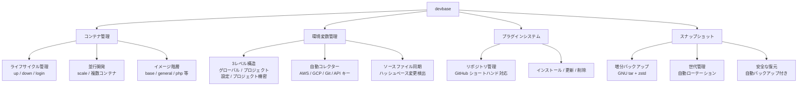
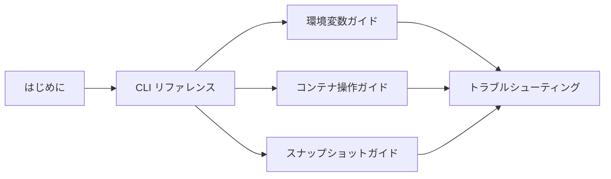

# devbase ドキュメント

devbase は Docker ベースの開発環境管理ツールです。プラグインシステムによる柔軟な拡張、環境変数の安全な管理、増分スナップショットによるデータ保護を提供します。

## devbase の主な機能



| 機能 | 説明 |
|------|------|
| **コンテナ管理** | Docker Compose ベースのコンテナライフサイクル管理。複数コンテナの並行開発をサポート |
| **環境変数管理** | グローバル / プロジェクト設定 / プロジェクト機密の 3 レベル構造。AWS / GCP 等の認証情報を自動収集 |
| **プラグインシステム** | GitHub リポジトリからのプラグインインストール。プロジェクトテンプレートの共有・再利用 |
| **スナップショット** | GNU tar の増分バックアップによるデータ保護。世代管理と自動ローテーション |

## 読者別ガイド

### 利用者（devbase を使って開発環境を構築したい方）

日常的な開発作業で devbase を利用するための情報です。

| ドキュメント | 内容 |
|-------------|------|
| [はじめに](user/getting-started.md) | 前提条件、初回セットアップ、日常ワークフロー |
| [CLI リファレンス](user/cli-reference.md) | 全コマンドの構文・オプション・使用例 |
| [環境変数ガイド](user/environment-variables.md) | 3レベル構造、コレクター、ソース同期 |
| [コンテナ操作ガイド](user/container-operations.md) | ライフサイクル、並行開発、ボリューム構造 |
| [スナップショットガイド](user/snapshot-guide.md) | 増分バックアップ、世代管理、復元手順 |
| [トラブルシューティング](user/troubleshooting.md) | カテゴリ別の問題と解決策 |

**推奨の読み順:**



### プラグイン開発者（devbase プラグインを作りたい方）

独自のプラグインを開発・公開するための情報です。利用者向けドキュメントを一通り読んでから参照してください。

| ドキュメント | 内容 |
|-------------|------|
| [プラグイン開発クイックスタート](plugin-dev/quickstart.md) | 最小構成プラグインの作成手順 |
| [plugin.yml リファレンス](plugin-dev/plugin-yml-reference.md) | プラグイン定義ファイルの全フィールド |
| [compose.yml ガイドライン](plugin-dev/compose-yml-guidelines.md) | Docker Compose 設定のベストプラクティス |

### devbase 開発者（devbase 本体を改善したい方）

devbase 本体のコードベースに貢献するための情報です。

| ドキュメント | 内容 |
|-------------|------|
| [アーキテクチャ](developer/architecture.md) | ディレクトリ構造、モジュール設計、データフロー |
| [コントリビューション](developer/contributing.md) | 開発環境構築、コーディング規約、PR ルール |
| [拡張ガイド](developer/extending.md) | 新コマンド・コレクター・イメージの追加方法 |

## ドキュメント構成

```
docs/
├── README.md                          ← このファイル（ドキュメント索引）
├── user/                              ← 利用者向け
│   ├── getting-started.md             ← はじめに
│   ├── cli-reference.md               ← CLI リファレンス
│   ├── environment-variables.md       ← 環境変数ガイド
│   ├── container-operations.md        ← コンテナ操作ガイド
│   ├── snapshot-guide.md              ← スナップショットガイド
│   └── troubleshooting.md             ← トラブルシューティング
├── plugin-dev/                        ← プラグイン開発者向け
│   ├── quickstart.md                  ← クイックスタート
│   ├── plugin-yml-reference.md        ← plugin.yml リファレンス
│   └── compose-yml-guidelines.md      ← compose.yml ガイドライン
└── developer/                         ← devbase 開発者向け
    ├── architecture.md                ← アーキテクチャ
    ├── contributing.md                ← コントリビューション
    └── extending.md                   ← 拡張ガイド
```

## クイックリンク

### よくある操作

| やりたいこと | 参照先 |
|-------------|--------|
| devbase を初めてインストールする | [はじめに](user/getting-started.md#セットアップ手順) |
| コマンドの使い方を調べる | [CLI リファレンス](user/cli-reference.md) |
| 環境変数を設定する | [環境変数ガイド](user/environment-variables.md#環境変数の操作) |
| 複数コンテナで並行開発する | [コンテナ操作ガイド](user/container-operations.md#並行開発) |
| データをバックアップ・復元する | [スナップショットガイド](user/snapshot-guide.md) |
| エラーが発生した | [トラブルシューティング](user/troubleshooting.md) |
| プラグインを作りたい | [プラグイン開発クイックスタート](plugin-dev/quickstart.md) |
| devbase 本体に貢献したい | [コントリビューション](developer/contributing.md) |

### 外部リソース

| リソース | URL |
|---------|-----|
| GitHub リポジトリ | [devbasex/devbase](https://github.com/devbasex/devbase) |
| Issue トラッカー | [GitHub Issues](https://github.com/devbasex/devbase/issues) |

## 表記規則

本ドキュメント群では以下の表記規則を使用します。

| 表記 | 意味 |
|------|------|
| `固定幅フォント` | コマンド、ファイル名、環境変数名 |
| `<山括弧>` | 必須パラメータ（実際の値に置き換える） |
| `[角括弧]` | 省略可能なパラメータ |
| `A \| B` | A または B のいずれか |

> **Note:** 補足情報や参考情報を示します。

> **Warning:** 注意が必要な操作や、データ損失の可能性がある操作を示します。

## 30秒クイックスタート

devbase を初めて使う場合の最短手順です。詳細は [はじめに](user/getting-started.md) を参照してください。

```bash
# 1. クローンと初期化
git clone https://github.com/devbasex/devbase.git && cd devbase
./bin/devbase init
source ~/.bashrc

# 2. プラグインのインストール
devbase plugin repo add user/repo
devbase plugin install <name>

# 3. プロジェクトのセットアップ
cd projects/<project>
devbase env init
devbase build

# 4. 開発開始
devbase up
devbase login
```

## 前提条件

| ソフトウェア | 最低バージョン |
|-------------|--------------|
| Docker Engine | 20.10 以上 |
| Docker Compose | v2.x 以上 |
| Bash / Zsh | 4.0 以上 / 5.0 以上 |
| Python | 3.10 以上 |
| Git | 最新推奨 |
