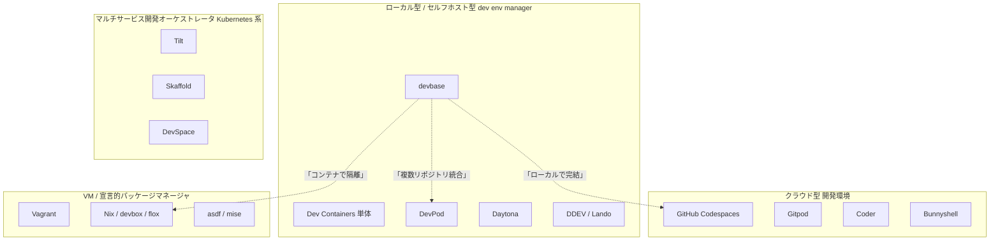
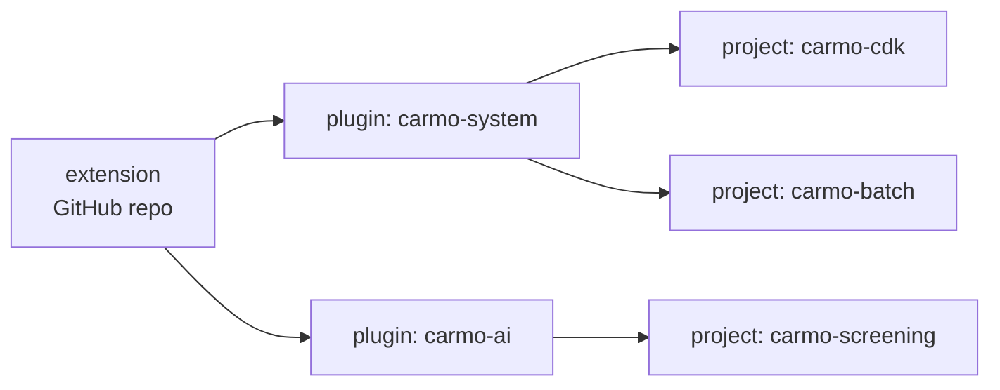

# 競合ツール比較

devbase と類似カテゴリのツールを「複数リポジトリ管理」「ローカルDocker完結」「AI開発適性」「永続化・世代管理」などの観点で比較し、**どんな課題のときに devbase を選ぶ価値があるか** を整理します。

---

## 1. 比較対象カテゴリ

devbase の隣接ツールはレイヤーが異なります。まずカテゴリ分けします。

---

## 2. 直接的な競合（dev environment manager）

devbase と最も近い位置に立つツール群。devcontainer / Docker / VM ベースで「再現可能な開発環境」を提供します。

### 2.1 DevPod（loft-sh） — 最も近い競合

- **概要**: 「Codespaces のオープンソース版・クライアント専用」を標榜。`devcontainer.json` を入力にして、ローカルDocker / SSH / Kubernetes / AWS EC2 / GCP / Codespaces など**複数のバックエンドプロバイダ**で同じワークスペースを起動できる。
- **強み**: プロバイダ抽象化、devcontainer 標準準拠、IDE非依存。
- **devbase との違い**:
  - DevPod は **1ワークスペース = 1リポジトリ** が基本単位。**複数リポジトリの統合管理（plugin/extension配布）の概念は無い**。
  - devbase は **複数リポジトリ × 並行コンテナ（scale）× 環境変数の3レベル統合** を提供。
  - devbase は **AI CLI 同梱 / snapshot 30世代 / `${DEVBASE_ROOT}/.env` 自動収集** が標準。DevPod は素のdevcontainer体験。
- **使い分け**: 単一リポジトリでクラウド/ローカルを切り替えたい → DevPod。複数リポジトリ＋AI開発 → devbase。

### 2.2 Daytona

- **概要**: 元はOSSの「self-hosted dev environment manager」だったが、2026年2月のSeries A（$24M）で **「AI生成コードを安全に実行するサンドボックス基盤」** へ事業ピボット。現行は AI agent向けのコード実行サンドボックスが主。
- **devbase との違い**:
  - 現行 Daytona は **AI agent 向けのサンドボックス実行基盤**。開発者本人の日常的開発環境という用途は二次的。
  - devbase は **開発者の日常開発体験**にフォーカス（dev コンテナへの接続・複数リポジトリ管理・snapshot）。
- **使い分け**: AIに任意コードを実行させるサンドボックス基盤が必要 → Daytona。人間の開発者が複数リポジトリで日常開発 → devbase。

### 2.3 Coder / Bunnyshell

- **概要**: K8s や VM 上に自社で構築するセルフホスト型クラウド開発環境。
- **devbase との違い**: 運用に Kubernetes / VM 管理が必要。devbase は個人ラップトップでも組織サーバでも同じ CLI で動く軽量さ。

### 2.4 GitHub Codespaces / Gitpod

- **概要**: クラウドVM上で `.devcontainer.json` を解釈する完全クラウド型。
- **devbase との違い**: クラウド継続課金、オフライン不可。devbase は**ローカルDockerだけで完結**し、private extension に組織秘構成を閉じ込められる。
- **併用**: Codespaces で素早く触る → 本格運用は devbase に移行、というハイブリッドが現実的。

### 2.5 Dev Containers 単体（Microsoft 公式）

- **概要**: VSCode 拡張 + `.devcontainer/` ディレクトリでリポジトリ単位のコンテナ環境を定義。
- **devbase との関係**: devbase は内部で Dev Containers 互換の dev コンテナを使う。**競合というより上位ツール**。
- **devbase が追加するもの**:
  - 複数リポジトリの **横断管理**（plugin/extension）
  - `scale` による並行 dev コンテナ
  - 環境変数の **3レベル統合**（`${DEVBASE_ROOT}/.env` / `env` / `.env`）
  - snapshot（差分10世代＋フル3世代）
  - **AI CLI 同梱**（claude / codex / gemini / kiro）

### 2.6 DDEV / Lando

- **概要**: PHP / Drupal / WordPress に特化したDocker開発環境管理。
- **devbase との違い**: 言語特化なので他言語混在チームには不向き。devbase は言語不問。

---

## 3. マルチサービス開発オーケストレータ（K8s 系）

devbase は「**ホスト ↔ dev コンテナ**」型、こちらは「**dev ↔ K8sクラスタ上の複数サービス**」型で、レイヤーが違います。

### 3.1 Tilt

- **概要**: K8s上で動くマイクロサービスを**ファイル同期＋ライブアップデート**で開発。`Tiltfile`（Starlark DSL）でビルド/デプロイ/同期を宣言。Web UI付き。
- **devbase との関係**: マイクロサービスの**サービス間統合**を解決。devbase は**リポジトリ間統合**を解決。**併用可**。

### 3.2 Skaffold

- **概要**: K8s前提の continuous development ツール。`skaffold.yaml`（YAML）でビルド/デプロイ/開発サイクルを定義。CLI中心。
- **Tilt との違い**: Skaffold はビルド→デプロイ型、Tilt は同期型。Skaffold の方が言語サポートが広く、コミュニティも成熟。
- **devbase との関係**: 同上、レイヤーが異なる（併用可）。

### 3.3 DevSpace

- **概要**: loft-sh による K8s 開発ツール。Tilt / Skaffold と同領域。
- **devbase との関係**: 同上。

---

## 4. その他の隣接ツール

| ツール | 概要 | devbase との違い |
|--------|------|-----------------|
| **Vagrant** | VM ベースの古典 | VM起動が遅い、Apple Silicon相性悪い。devbase はDockerなのでオーバーヘッド最小。 |
| **Nix / devbox / flox** | 宣言的パッケージマネージャ | ホストOS上で動く前提、AI CLIの危険モードを**閉じ込められない**。学習コスト高。 |
| **asdf / mise / rtx** | 言語バージョンマネージャ | ホスト依存を残すため、ローカル汚染問題は解決しない。 |
| **docker compose 自作** | 各リポジトリで独自運用 | 横断の概念が無い。10リポジトリあれば10通りの使い方を覚える必要がある。 |

---

## 5. 機能比較表

凡例: ◎ ＝主要機能、〇 ＝対応、△ ＝部分対応・拡張で実現、✕ ＝非対応

| 観点 | devbase | DevPod | Daytona | Codespaces | Coder | Dev Containers | Tilt/Skaffold | DDEV |
|------|:-:|:-:|:-:|:-:|:-:|:-:|:-:|:-:|
| ローカルDockerで完結 | ◎ | ◎ | △ | ✕ | △ | ◎ | △ | ◎ |
| クラウド/リモート利用 | △ | ◎ | ◎ | ◎ | ◎ | ◎ | ◎ | ✕ |
| 複数リポジトリの統合管理 | ◎ | ✕ | △ | △ | △ | ✕ | △ | ✕ |
| 並行コンテナ（scale） | ◎ | ✕ | △ | △ | △ | ✕ | ◎ | ✕ |
| 環境変数の3レベル統合 | ◎ | △ | △ | △ | △ | △ | △ | △ |
| 認証情報の自動収集ウィザード | ◎ | ✕ | ✕ | ✕ | ✕ | ✕ | ✕ | ✕ |
| AI CLI 標準同梱 | ◎ | ✕ | ✕ | ✕ | ✕ | ✕ | ✕ | ✕ |
| AIコード実行サンドボックス | △ | ✕ | ◎ | △ | △ | ✕ | ✕ | ✕ |
| 巻き戻し可能なsnapshot | ◎ | ✕ | △ | △ | △ | ✕ | ✕ | ✕ |
| private 配布レジストリ | ◎ | △ | △ | △ | △ | ✕ | ✕ | ✕ |
| devcontainer.json 互換 | △ | ◎ | ◎ | ◎ | ◎ | ◎ | ✕ | ✕ |
| 言語非依存 | ◎ | ◎ | ◎ | ◎ | ◎ | ◎ | ◎ | ✕ |
| 月額課金 | なし | なし | あり/自前 | あり | 自前運用 | なし | なし | なし |

---

## 6. 選定ガイド

### → devbase

- 複数リポジトリを横断して開発（マイクロサービス、モノリス＋API＋バッチ＋インフラ）
- **AI CLI（claude/codex/gemini/kiro）を多用**しつつコンテナで安全に隔離
- 同一リポジトリで**並行開発**（git worktree の代替）
- **社外秘の compose 構成**を private extension で組織内に閉じて配布
- ローカルDockerで**オフライン完結**
- 巻き戻し可能な snapshot が必要

### → DevPod

- 単一リポジトリの devcontainer 体験で、**ローカル/リモート/クラウドを切り替え**たい
- IDE非依存・プロバイダ非依存を最優先

### → Daytona

- **AI エージェントに任意コードを実行させる**サンドボックス基盤が必要
- マルチテナント・マルチユーザの Code Interpreter 風サービスを構築

### → Codespaces / Gitpod

- 端末でDockerを入れられない、ゼロセットアップを最優先

### → Tilt / Skaffold / DevSpace

- 開発対象が **K8s 上のマイクロサービス群**で、サービス間のホットリロードが本丸

### → Dev Containers 単体

- リポジトリは1つだけ、VSCode専用、シンプルな構成

### → DDEV / Lando

- PHP / Drupal / WordPress 特化で、その範囲しか触らない

### → Nix / mise

- ツールバージョンを言語横断で**宣言的に固定**したい（ホスト常駐モデル）

---

## 7. devbase ならではの差別化要素

### 7.1 3層構造による配布

public な devbase 本体に、private な extension を**重ねるだけ**で組織秘の構成を共有できる。DevPod / Codespaces / Dev Containers にはこの**配布抽象化レイヤ**が無い。

### 7.2 環境変数の3レベル統合

`${DEVBASE_ROOT}/.env`（グローバル） → `projects/
/env`（プロジェクト, Git管理） → `projects/
/.env`（プロジェクト機密, gitignore） を**後勝ち**でマージ。「通常 ap-northeast-1 / このPJだけ us-east-1」が自然。

### 7.3 snapshot による世代管理

差分10世代＋フル3世代＝**合計30世代** を自動保管。`devbase snapshot list` で巻き戻し。AIエージェントに `~/` を破壊されても秒で復旧。

### 7.4 AI CLI 同梱と封じ込め

`claude` / `codex` / `gemini` / `kiro` をベースイメージに同梱。`--dangerously-skip-permissions` 等の危険モードもコンテナ境界で**ホストに波及しない**。

---

## 8. 移行ガイド（簡易）

| 移行元 | 主な作業 |
|--------|---------|
| docker compose 自作 | `compose.yml` を `${DEVBASE_ROOT}` ベースに書換 → `env`/`.env` 分離 → `projects/` 配下へ |
| Dev Containers | `.devcontainer/Dockerfile` を `containers/<name>/` か標準コンテナへ → `compose.yml` 作成 |
| DevPod | devcontainer.json を参考に `compose.yml` 作成 → plugin/extension化で複数リポジトリを束ねる |
| Codespaces | ローカルにDockerを導入 → `projects/<name>/` 配下に配置 → `devbase env init` で認証移送 |

---

## 9. まとめ

devbase は単体の Dev Containers / DevPod / クラウド型開発環境の代替ではなく、**「ローカルDocker × 複数リポジトリ × AI 開発」という現代的な3要件に最適化された統合管理レイヤ**です。

特に以下の3つが揃うチームでは選定価値が高い:

1. **複数リポジトリを日常的に行き来**している
2. **AI CLI を本格活用**しており、安全な隔離が必要
3. **社外秘の開発環境構成**を組織内で再利用したい

---

## 関連ドキュメント

- [はじめに](user/getting-started.md)
- [プラグインレジストリ](user/plugin-registries.md)
- [スナップショットガイド](user/snapshot-guide.md)
- [アーキテクチャ](developer/architecture.md)

## 参考資料

- [DevPod 公式](https://devpod.sh/) / [GitHub](https://github.com/loft-sh/devpod)
- [Daytona 公式](https://www.daytona.io/) / [GitHub](https://github.com/daytonaio/daytona)
- [Tilt vs Skaffold（vcluster）](https://www.vcluster.com/blog/skaffold-vs-tilt-vs-devspace)
- [Daytona Alternatives 2026（Bunnyshell）](https://www.bunnyshell.com/comparisons/daytona-alternatives/)
- [DevPod Alternatives 2026（Bunnyshell）](https://www.bunnyshell.com/comparisons/devpod-alternatives/)
- [Self-hostable Alternatives to Daytona（Northflank）](https://northflank.com/blog/self-hostable-alternatives-to-daytona)
