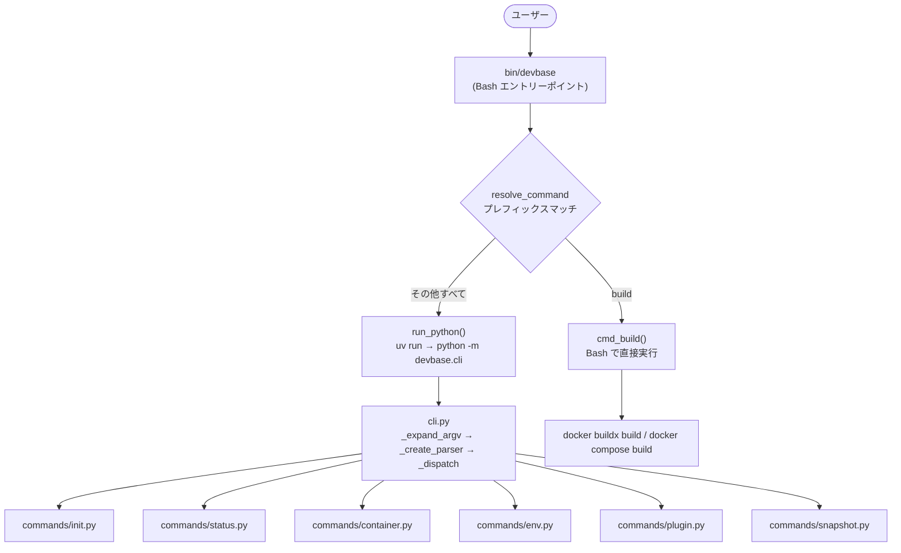
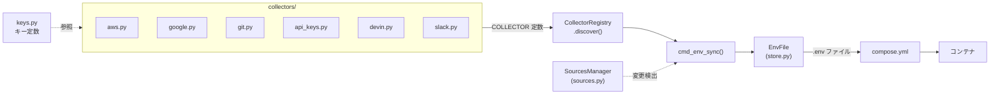
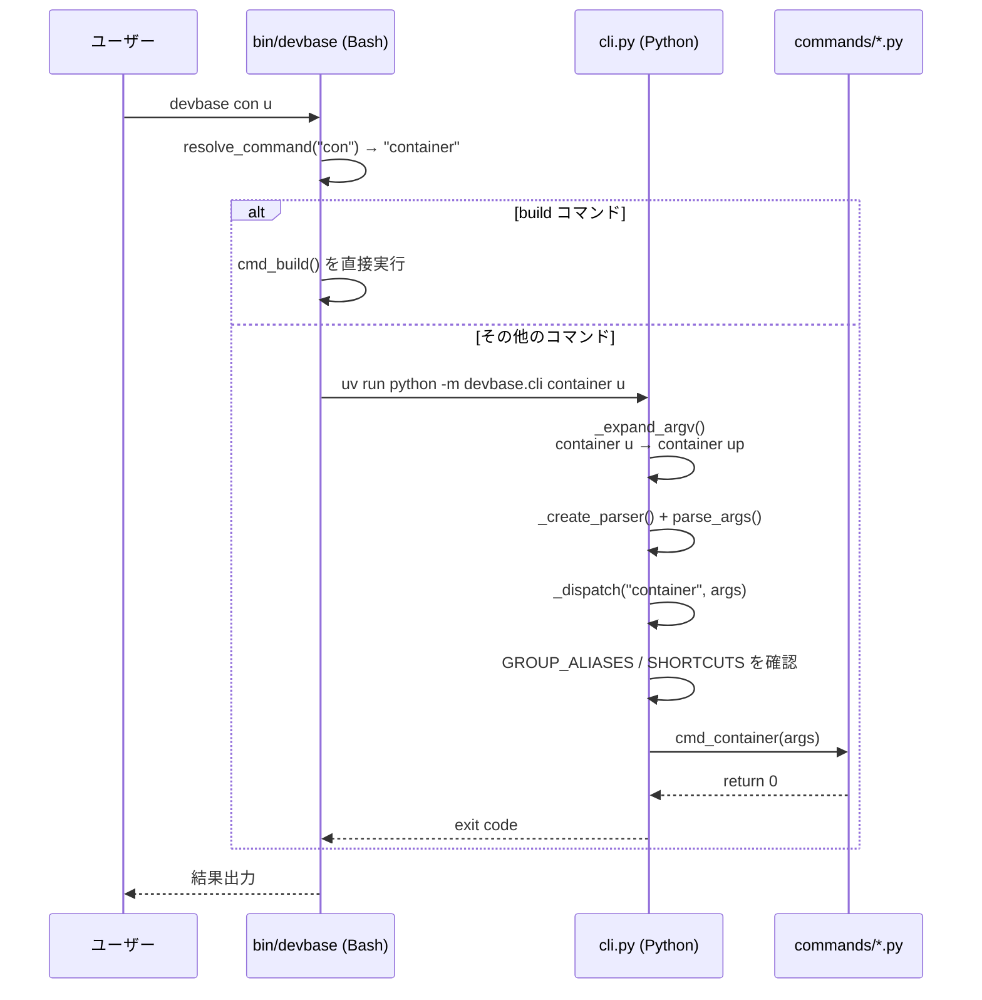
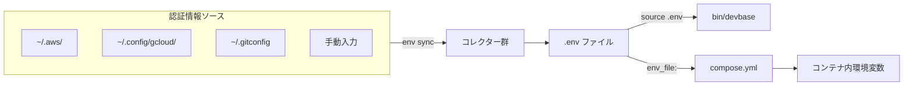
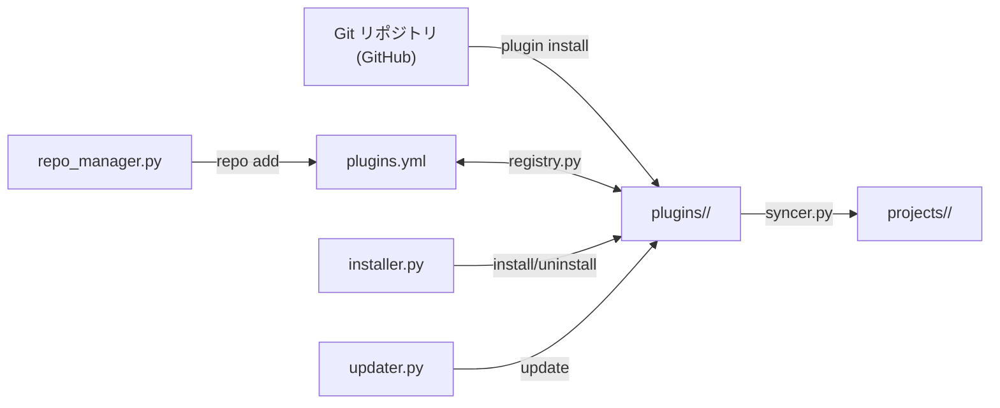

# devbase アーキテクチャ概要

devbase v2.2.0 のアーキテクチャ設計と内部構造について説明する。

## 全体構成

devbase は **Bash + Python の二層構成** を採用している。
CLI エントリーポイントは Bash スクリプト (`bin/devbase`) であり、大半のコマンドは Python 実装 (`lib/devbase/`) に委譲される。

### なぜ二層構成なのか

| 層 | 担当 | 利点 |
|----|------|------|
| **Bash** (`bin/devbase`) | PATH 設定、シェル補完登録、環境変数エクスポート、`build` コマンド | シェル環境へのネイティブ統合。`source` で `.env` を読み込み、`DEVBASE_ROOT` を確定してから Python に渡せる |
| **Python** (`lib/devbase/`) | init, status, container, env, plugin, snapshot | 複雑なロジック（YAML パース、Git 操作、差分バックアップ等）を安全かつ保守的に実装できる |

`build` コマンドだけが Bash 側に残っている理由は、Docker buildx の制御と compose.yml のパース処理がシェルスクリプトで完結するためである。

## モジュール構成

### cli.py -- コマンドディスパッチ

Python 側のエントリーポイント。以下の責務を持つ。

- **`_expand_argv()`**: `sys.argv` のコマンド名・サブコマンド名をユニークプレフィックスマッチで正規化する。例: `devbase con u` は `devbase container up` に展開される
- **`_resolve_prefix(input, candidates)`**: 候補リストに対してプレフィックスマッチを行い、一意に決まる場合のみ展開する
- **`_create_parser()`**: argparse のパーサーツリーを構築する
- **`_dispatch(cmd, args)`**: コマンド名に基づき各ハンドラモジュールを遅延 import して実行する

主要な定数は以下の通り。

| 定数 | 役割 |
|------|------|
| `SHORTCUTS` | トップレベルショートカット → (グループ, サブコマンド) のマッピング。`up`, `down`, `login`, `build`, `ps` が `container` グループに転送される |
| `GROUP_ALIASES` | グループのエイリアス。`ct` → `container`, `pl` → `plugin`, `ss` → `snapshot` |
| `SUBCMD_MAP` | 各グループが受け付けるサブコマンド一覧。プレフィックスマッチの候補として使用される |

### commands/ -- コマンド実装

各モジュールは `cmd_<command>(devbase_root, args)` 形式のハンドラ関数をエクスポートする。

| モジュール | ハンドラ | 概要 |
|-----------|---------|------|
| `init.py` | `cmd_init` | PATH 追加、シェル補完設定、plugins.yml 初期化 |
| `status.py` | `cmd_status` | コンテナ・プラグイン・環境変数の状態表示 |
| `container.py` | `cmd_container` | docker compose を操作。up/down/ps/login/logs/scale/build |
| `env.py` | `cmd_env` | 環境変数の管理。init/sync/list/set/get/delete/edit/project |
| `plugin.py` | `cmd_plugin` | プラグインの管理。list/install/uninstall/update/info/sync/repo |
| `snapshot.py` | `cmd_snapshot` | スナップショットの管理。create/list/restore/copy/delete/rotate |

### env/ -- 環境変数管理システム

環境変数の収集・保存・同期を担うサブシステム。

| モジュール | クラス/関数 | 役割 |
|-----------|-----------|------|
| `store.py` | `EnvFile` | `.env` ファイルの読み書き。`load`, `save`, `get`, `set`, `delete`, `backup` 等のメソッドを提供 |
| `collector.py` | `Collector` | コレクター定義のデータクラス。`name`, `display_name`, `collect_fn`, `source_files`, `source_type` |
| `collector.py` | `CollectorRegistry` | `collectors/` パッケージ内のモジュールを `pkgutil.iter_modules` で走査し、`COLLECTOR` 定数を持つモジュールを自動登録する |
| `collectors/*.py` | 各コレクター | AWS、GCP、Git 等の認証情報を収集する。モジュールレベルの `COLLECTOR` 定数をエクスポートする |
| `keys.py` | 定数群 | 環境変数キー名の一元管理。`AWS_ACCESS_KEY_ID`, `GIT_USER_NAME` 等 |
| `sources.py` | `SourcesManager` | ソースファイルのハッシュ管理と変更検出。`file_hash`, `dir_hash` 関数も提供 |

### plugin/ -- プラグイン管理システム

| モジュール | 役割 |
|-----------|------|
| `models.py` | プラグイン・リポジトリのデータモデル定義 |
| `registry.py` | `plugins.yml` の読み書き |
| `installer.py` | プラグインの install / uninstall。Git clone やローカルリンクに対応 |
| `repo_manager.py` | リポジトリの add / remove / list / refresh |
| `updater.py` | プラグインの update とマイグレーション |
| `syncer.py` | `plugins/*/projects/*` から `projects/` へのシンボリックリンク同期 |
| `info.py` | プラグイン詳細情報の表示 |

### snapshot/ -- スナップショット管理

`snapshot/manager.py` の `SnapshotManager` クラスが全機能を提供する。差分バックアップとフルバックアップに対応し、zstd 圧縮を使用する。

### その他

| ディレクトリ | 役割 |
|-------------|------|
| `volume/` | Docker ボリューム管理ユーティリティ |
| `utils/` | 汎用ユーティリティ関数 |
| `errors.py` | `DevbaseError` を基底とした共通例外クラス群 |
| `log.py` | `get_logger` / `setup` による共通ロガー |

## 設計原則

### 1. 冪等性

すべてのコマンドは繰り返し実行しても安全に動作する。例えば `devbase init` は PATH 設定済みならスキップし、`plugin install` はインストール済みなら何もしない。

### 2. 自動化

`env sync` によって AWS、GCP、Git 等の認証情報をローカル環境から自動収集し、`.env` ファイルに統合する。開発者が手動で環境変数を設定する必要を最小化する。

### 3. セキュリティ

`.env` ファイルは機密情報を含むため、適切なファイルパーミッション (`0600`) で管理される。また `.gitignore` により Git 管理対象外となっている。

### 4. 拡張性

プラグインシステムにより、devbase 本体を変更することなくプロジェクト定義を追加できる。コレクターの自動検出により、新しい認証情報ソースの追加も容易である。

### 5. 再現性

Docker コンテナによって開発環境を統一する。`containers/` 配下のイメージ定義と `compose.yml` により、全開発者が同一の環境で作業できる。

## コマンドディスパッチフロー

ユーザーが入力したコマンドが実行されるまでの詳細フローを示す。

### プレフィックスマッチの二段階処理

1. **Bash 側** (`resolve_command`): 第1引数のコマンド名をプレフィックスマッチで展開
2. **Python 側** (`_expand_argv`): コマンド名とサブコマンド名の両方をプレフィックスマッチで展開

Bash 側の展開は `build` コマンドの判定に必要なため残されている。Python 側では `SUBCMD_MAP` を参照して、グループごとのサブコマンドも展開する。

## データフロー

### 環境変数の流れ

1. `devbase env sync` を実行すると、`CollectorRegistry` が全コレクターを起動する
2. 各コレクターがローカルの認証情報ファイルを読み取り、環境変数として収集する
3. `SourcesManager` がソースファイルのハッシュを記録し、次回以降は変更があった場合のみ再収集する
4. 収集された値は `EnvFile` 経由で `.env` ファイルに書き込まれる
5. `bin/devbase` 起動時に `.env` を `source` し、`compose.yml` の `env_file` 指定でもコンテナに渡される

### プラグインの流れ

1. `devbase repo add <url>` でリポジトリを登録すると、`plugins.yml` にリポジトリ情報と利用可能プラグイン一覧が記録される
2. `devbase plugin install <name>` でプラグインを Git clone し、`plugins/<name>/` に配置する
3. `syncer.py` が `plugins/<name>/projects/*` を走査し、`projects/` 配下にシンボリックリンクを作成する
4. これにより `projects/` が全プロジェクトへの統一アクセスポイントとなる
