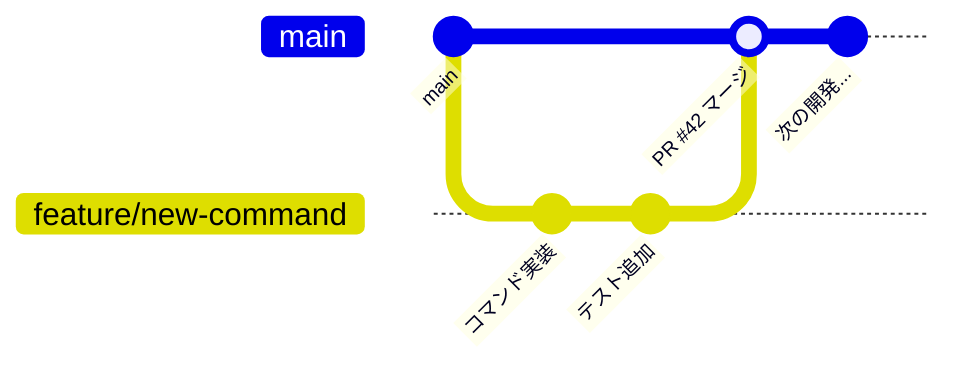

# devbase 開発参加ガイド

devbase の開発に参加するための手順と規約をまとめる。

## 開発環境セットアップ

### 前提条件

- Git
- Python 3.10 以上
- Docker / Docker Compose
- [uv](https://docs.astral.sh/uv/) (Python パッケージマネージャー)

### 手順

1. リポジトリをクローンする

```bash
git clone https://github.com/devbasex/devbase.git
cd devbase
```

2. uv をインストールする（未インストールの場合）

```bash
curl -LsSf https://astral.sh/uv/install.sh | sh
```

> `bin/devbase` を実行すると `ensure_uv()` により自動インストールされるが、開発時は事前に入れておくことを推奨する。

3. Python 依存パッケージをインストールする

```bash
uv sync
```

`pyproject.toml` に基づいて仮想環境が作成され、依存がインストールされる。

4. devbase を初期化する

```bash
./bin/devbase init
source ~/.bashrc   # PATH とシェル補完を反映
```

### ディレクトリ構造の概要

開発時に主に触るディレクトリは以下の通り。

```
devbase/
├── bin/devbase              # CLI エントリーポイント（Bash）
├── lib/devbase/             # Python 実装（主な開発対象）
│   ├── cli.py               # CLI パーサー・コマンドディスパッチ
│   ├── commands/            # 各コマンドの実装
│   ├── env/                 # 環境変数管理
│   ├── plugin/              # プラグイン管理
│   ├── snapshot/            # スナップショット管理
│   └── utils/               # ユーティリティ
├── containers/              # コンテナイメージ定義
├── etc/                     # シェル補完ファイル（bash/zsh）
└── pyproject.toml           # Python 依存管理（uv）
```

## Git ワークフロー

### ブランチ戦略

**main ブランチへの直接 push は禁止。** 必ず feature ブランチを作成し、Pull Request 経由でマージする。

### ブランチ命名規則

| プレフィックス | 用途 | 例 |
|---------------|------|-----|
| `feature/` | 新機能の追加 | `feature/add-env-export` |
| `fix/` | バグ修正 | `fix/snapshot-restore-error` |
| `docs/` | ドキュメント変更 | `docs/update-architecture` |

### 基本的なワークフロー



```bash
# 1. feature ブランチを作成
git checkout main && git pull origin main
git checkout -b feature/my-feature

# 2. 変更を実装・コミット
git add <files>
git commit -m "新機能: env export コマンドの追加"

# 3. push して PR 作成
git push -u origin feature/my-feature

# 4. レビュー → マージ後にクリーンアップ
git checkout main && git pull origin main
git branch -d feature/my-feature
```

### コミットメッセージ

コミットメッセージは**日本語**で記述する。変更の種類を先頭に記載する。

```
新機能: env export コマンドの追加
バグ修正: snapshot restore で差分適用順序が逆になる問題を修正
リファクタリング: collector の重複コードを共通化
ドキュメント: アーキテクチャ概要を追加
```

## コーディング規約

### Python

**PEP 8 準拠** を基本とする。加えて以下のルールを適用する。

#### for 文・if 文を多用しない

内包表記と dict を優先し、冗長なループ・条件分岐を避ける。

```python
# 良い例: 内包表記
active_plugins = [p for p in plugins if p.is_active]

# 良い例: dict によるディスパッチ
handlers = {
    'install': handle_install,
    'uninstall': handle_uninstall,
    'update': handle_update,
}
handler = handlers.get(action)

# 避ける例: 冗長な for + if
active_plugins = []
for p in plugins:
    if p.is_active:
        active_plugins.append(p)
```

#### エラーハンドリング

`DevbaseError` を基底クラスとした例外を使用する。`errors.py` で定義されている。

```python
from devbase.errors import DevbaseError

class PluginError(DevbaseError):
    """プラグイン関連のエラー"""
    pass
```

#### ロガー

各モジュールで `get_logger` を使用する。

```python
from devbase.log import get_logger

logger = get_logger("devbase.commands.env")
```

#### コマンドハンドラの命名

`cmd_<command>` の形式を使用する。グループコマンドの場合は `cmd_<group>` がサブコマンドをディスパッチする。

```python
def cmd_env(devbase_root: Path, args) -> int:
    """env グループのエントリーポイント"""
    ...

def cmd_env_sync(devbase_root: Path, args) -> int:
    """env sync サブコマンドの実装"""
    ...
```

### Bash

`bin/devbase` のスクリプトに適用される規約。

| 項目 | ルール |
|------|--------|
| インデント | 4 スペース |
| 命名 | `snake_case` |
| 関数名 | `cmd_<command>` 形式 |
| エラー処理 | `set -e` を使用 |

### Dockerfile

`containers/` 配下のイメージ定義に適用される規約。

| 項目 | ルール |
|------|--------|
| ベースイメージ | バージョンを明示する（`ubuntu:noble` 等、`latest` は避ける） |
| RUN コマンド | 論理的なグループ単位でまとめる。1行1コマンドの羅列は避ける |
| 実行ユーザー | 最終的に `USER ubuntu` で実行する |
| キャッシュ | apt のキャッシュはレイヤー内で削除する |

```dockerfile
# 良い例: 論理グループ化
RUN apt-get update && apt-get install -y --no-install-recommends \
        curl \
        git \
        jq \
    && rm -rf /var/lib/apt/lists/*

USER ubuntu
```

## PR プロセス

### PR の作成

PR には以下の情報を記載する。

- **概要**: 変更内容の簡潔な説明（1-3 行）
- **テスト計画**: 動作確認の手順
- **関連 Issue**: あれば Issue 番号をリンク

### レビュー観点

レビュアーは以下の観点でコードを確認する。

| 観点 | チェック内容 |
|------|-------------|
| 設計 | 既存アーキテクチャとの整合性。冪等性の担保 |
| コード品質 | PEP 8 準拠。内包表記・dict の活用。不要な for/if がないか |
| セキュリティ | 機密情報のハードコード禁止。`.env` のパーミッション |
| エラー処理 | `DevbaseError` 系例外の適切な使用 |
| 互換性 | 既存コマンドの動作に影響がないか |

## テスト

### 現状のテスト方針

devbase は現時点では**手動テスト中心**で運用している。変更時は以下の手順で動作確認を行う。

### 手動テストの手順

1. **変更したコマンドを直接実行する**

```bash
# 例: env コマンドを修正した場合
devbase env list
devbase env set TEST_KEY=test_value
devbase env get TEST_KEY
devbase env delete TEST_KEY
```

2. **関連するコマンドへの影響を確認する**

```bash
# 例: plugin の installer を修正した場合
devbase plugin list
devbase plugin install <test-plugin>
devbase plugin info <test-plugin>
devbase plugin uninstall <test-plugin>
```

3. **プレフィックスマッチが正しく動作するか確認する**

```bash
devbase con u    # → container up
devbase pl l     # → plugin list
devbase ss c     # → snapshot create
```

### テスト時の注意点

- `devbase env sync` は実際の認証情報ファイル（`~/.aws/`, `~/.config/gcloud/` 等）を読み取るため、テスト環境の認証設定に注意する
- `devbase plugin install` は Git clone を実行するため、ネットワーク接続が必要である
- `devbase container up` / `down` は Docker コンテナを操作するため、Docker デーモンが起動していることを確認する
- スナップショット関連のテストは `backups/` ディレクトリにデータを書き込むため、ディスク容量に注意する

### Python モジュールの単体確認

個別のモジュールを直接実行して動作確認することも可能。

```bash
# uv run 経由で Python モジュールを直接実行
DEVBASE_ROOT=$(pwd) uv run python -c "
from devbase.env.collector import CollectorRegistry
registry = CollectorRegistry()
registry.discover()
for c in registry.collectors:
    print(f'{c.name}: {c.display_name}')
"
```
