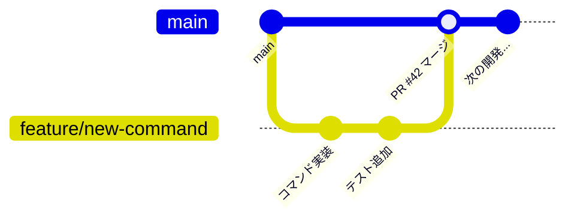

# devbase 開発参加ガイド

devbase の開発に参加するための手順と規約をまとめる。

## 開発環境セットアップ

### 前提条件

- Git
- Python 3.10 以上
- Docker / Docker Compose
- [uv](https://docs.astral.sh/uv/) (Python パッケージマネージャー)

### 手順

1. リポジトリをクローンする

```bash
git clone https://github.com/devbasex/devbase.git
cd devbase
```

2. uv をインストールする（未インストールの場合）

```bash
curl -LsSf https://astral.sh/uv/install.sh | sh
```

> `bin/devbase` を実行すると `ensure_uv()` により自動インストールされるが、開発時は事前に入れておくことを推奨する。

3. Python 依存パッケージをインストールする

```bash
uv sync
```

`pyproject.toml` に基づいて仮想環境が作成され、依存がインストールされる。

4. devbase を初期化する

```bash
./bin/devbase init
source ~/.bashrc   # PATH とシェル補完を反映
```

### ディレクトリ構造の概要

開発時に主に触るディレクトリは以下の通り。

```
devbase/
├── bin/devbase              # CLI エントリーポイント（Bash）
├── lib/devbase/             # Python 実装（主な開発対象）
│   ├── cli.py               # CLI パーサー・コマンドディスパッチ
│   ├── commands/            # 各コマンドの実装
│   ├── env/                 # 環境変数管理
│   ├── plugin/              # プラグイン管理
│   ├── snapshot/            # スナップショット管理
│   └── utils/               # ユーティリティ
├── containers/              # コンテナイメージ定義
├── etc/                     # シェル補完ファイル（bash/zsh）
└── pyproject.toml           # Python 依存管理（uv）
```

## Git ワークフロー

### ブランチ戦略

**main ブランチへの直接 push は禁止。** 必ず feature ブランチを作成し、Pull Request 経由でマージする。

### ブランチ命名規則

| プレフィックス | 用途 | 例 |
|---------------|------|-----|
| `feature/` | 新機能の追加 | `feature/add-env-export` |
| `fix/` | バグ修正 | `fix/snapshot-restore-error` |
| `docs/` | ドキュメント変更 | `docs/update-architecture` |

### 基本的なワークフロー


```mermaid
gitGraph
    commit id: "main"
    branch feature/new-command
    commit id: "コマンド実装"
    commit id: "テスト追加"
    checkout main
    merge feature/new-command id: "PR #42 マージ"
    commit id: "次の開発..."
```

```bash
# 1. feature ブランチを作成
git checkout main && git pull origin main
git checkout -b feature/my-feature

# 2. 変更を実装・コミット
git add <files>
git commit -m "新機能: env export コマンドの追加"

# 3. push して PR 作成
git push -u origin feature/my-feature

# 4. レビュー → マージ後にクリーンアップ
git checkout main && git pull origin main
git branch -d feature/my-feature
```

### コミットメッセージ

コミットメッセージは**日本語**で記述する。変更の種類を先頭に記載する。

```
新機能: env export コマンドの追加
バグ修正: snapshot restore で差分適用順序が逆になる問題を修正
リファクタリング: collector の重複コードを共通化
ドキュメント: アーキテクチャ概要を追加
```

## コーディング規約

### Python

**PEP 8 準拠** を基本とする。加えて以下のルールを適用する。

#### for 文・if 文を多用しない

内包表記と dict を優先し、冗長なループ・条件分岐を避ける。

```python
# 良い例: 内包表記
active_plugins = [p for p in plugins if p.is_active]

# 良い例: dict によるディスパッチ
handlers = {
    'install': handle_install,
    'uninstall': handle_uninstall,
    'update': handle_update,
}
handler = handlers.get(action)

# 避ける例: 冗長な for + if
active_plugins = []
for p in plugins:
    if p.is_active:
        active_plugins.append(p)
```

#### エラーハンドリング

`DevbaseError` を基底クラスとした例外を使用する。`errors.py` で定義されている。

```python
from devbase.errors import DevbaseError

class PluginError(DevbaseError):
    """プラグイン関連のエラー"""
    pass
```

#### ロガー

各モジュールで `get_logger` を使用する。

```python
from devbase.log import get_logger

logger = get_logger("devbase.commands.env")
```

#### コマンドハンドラの命名

`cmd_<command>` の形式を使用する。グループコマンドの場合は `cmd_<group>` がサブコマンドをディスパッチする。

```python
def cmd_env(devbase_root: Path, args) -> int:
    """env グループのエントリーポイント"""
    ...

def cmd_env_sync(devbase_root: Path, args) -> int:
    """env sync サブコマンドの実装"""
    ...
```

### Bash

`bin/devbase` のスクリプトに適用される規約。

| 項目 | ルール |
|------|--------|
| インデント | 4 スペース |
| 命名 | `snake_case` |
| 関数名 | `cmd_<command>` 形式 |
| エラー処理 | `set -e` を使用 |

### Dockerfile

`containers/` 配下のイメージ定義に適用される規約。

| 項目 | ルール |
|------|--------|
| ベースイメージ | バージョンを明示する（`ubuntu:26.04` 等、`latest` は避ける） |
| RUN コマンド | 論理的なグループ単位でまとめる。1行1コマンドの羅列は避ける |
| 実行ユーザー | 最終的に `USER ubuntu` で実行する |
| キャッシュ | apt のキャッシュはレイヤー内で削除する |

```dockerfile
# 良い例: 論理グループ化
RUN apt-get update && apt-get install -y --no-install-recommends \
        curl \
        git \
        jq \
    && rm -rf /var/lib/apt/lists/*

USER ubuntu
```

## PR プロセス

### PR の作成

PR には以下の情報を記載する。

- **概要**: 変更内容の簡潔な説明（1-3 行）
- **テスト計画**: 動作確認の手順
- **関連 Issue**: あれば Issue 番号をリンク

### CHANGELOG の更新

`main` へのマージがそのまま配布になる。利用者に見える変更（devbase を使う人がコマンド・イメージ・設定を
通じて気づく振る舞いの変化）を `main` へ入れる Pull Request は、同じ Pull Request で `CHANGELOG.md` の
`[Unreleased]` を更新する。破壊的変更はその旨を明記する。

- **CHANGELOG が要らない変更**: テストだけの変更、開発者向けの文書だけの変更、利用者に見えないリファクタリング
- **統合ブランチ（`release/**`・`mission/**`）を通す変更**: 統合ブランチ宛ての個々の Pull Request では書かなくてよい。
  統合ブランチから `main` への Pull Request の差分で `CHANGELOG.md` を更新する
- **CI の未記入の警告**: `main` 宛ての Pull Request で `lib/`・`bin/`・`containers/`・`etc/`・`install.sh` のどれかを
  変えて `CHANGELOG.md` を変えていないと、CI の `CHANGELOG check` が警告を出す。警告であってジョブは失敗にしない。
  要らない変更かどうかはレビュアーが判断する

### レビュー観点

レビュアーは以下の観点でコードを確認する。

| 観点 | チェック内容 |
|------|-------------|
| 設計 | 既存アーキテクチャとの整合性。冪等性の担保 |
| コード品質 | PEP 8 準拠。内包表記・dict の活用。不要な for/if がないか |
| セキュリティ | 機密情報のハードコード禁止。`.env` のパーミッション |
| エラー処理 | `DevbaseError` 系例外の適切な使用 |
| 互換性 | 既存コマンドの動作に影響がないか |

## テスト

### 現状のテスト方針

`tests/` の pytest と、Docker や実環境が要る範囲の手動テストを併用する。手元では
`uv run --locked pytest tests/ -q` で全体を回し、実機の挙動は以下の手順で確認する。
`pyproject.toml` の `addopts` が `-n auto`（pytest-xdist）を渡すため、テストは CPU の数で並列に走る。
`pdb` で止めたいときや 1 件だけ流すときは `-n 0` で直列に戻す。テストどうしは一時ディレクトリ・
tmux のサーバー・環境変数を共有しない前提で書く。
テストは起動したシェルの環境変数と `HOME` から隔離される（[テストの環境の隔離](../specifications/test-environment-isolation.md)）。

### CI が実行するもの

宛先を問わずすべての Pull Request と、`main`・`release/**`・`mission/**` への push で
`.github/workflows/ci.yml` が走り、
`compileall`（Python 3.10 / 3.11 / 3.12）・`ruff check --select=E9,F63,F7,F82 lib`・
`bin/*`・`install.sh`・`containers/base/` のシェルスクリプトの ShellCheck・`uv sync --locked` の後の `pytest tests/`
（Python 3.10 / 3.13）を実行する。CI に `DEVBASE_ROOT` と Docker は無いため、テストは
自前の一時ディレクトリを `DEVBASE_ROOT` に向け、実機を要するものは理由を添えて skip する。
`main` 宛ての Pull Request では、あわせて CHANGELOG の検査（`CHANGELOG check`）が走る
（[CHANGELOG の更新](#changelog-の更新)）。
すべてのトリガーで、固有の語の検査（`Proper term check`）も走る（[固有の語の検査](#固有の語の検査)）。

pytest の全版の結果は、まとめたチェック `Pytest`（ジョブ `pytest-all`）に 1 つにまとまる。pytest が 1 版でも
失敗・取り消し・時間切れなら `Pytest` は `failure` になる。`main` の保護の必須チェックは
`Python syntax check (3.10)` / `(3.11)` / `(3.12)`・`Ruff lint`・`ShellCheck`・`Pytest` の 6 件で、pytest が
落ちた Pull Request は `main` へマージできない。pytest の matrix の版を変えても保護設定は直さなくてよく、
`tests/ci/test_ci_workflow.py` の期待値だけを直す。トリガーと検査ジョブの名前もこのテストが固定する。

ShellCheck は基準の版（`devbase-base:latest` の shellcheck と同じ版、現在は 0.11.0）の公式の配布物を
SHA-256 で照合して入れ、既定の水準（style まで）で走らせる。指摘が 1 件でもあればジョブが失敗する。
抑えるしかない指摘は `# shellcheck disable=SCxxxx` と抑える理由を同じ行か直前の行に書く
（`tests/ci/test_shellcheck_job.py` と `tests/containers/test_base_shellcheck_ci.py` が理由の無い指示を止める）。
`containers/base/` の直下にシェルスクリプト（`sh` か `bash` の shebang を持つか、拡張子が `.sh` のもの）を足したら、
`ci.yml` の `Run ShellCheck on containers/base/` の一覧へも足す。足し忘れは `tests/containers/test_base_shellcheck_ci.py` が落とす。
トリガー・検査の対象・抑止の注記・CHANGELOG の検査・固有の語の検査の規則は [CI の検査（トリガー・ShellCheck・CHANGELOG・固有の語）](../specifications/ci-checks.md) にある。
手元では次で CI と同じ版の検査を打てる。

```bash
docker run --rm -v "$PWD":/w -w /w --entrypoint shellcheck devbase-base:latest bin/devbase bin/rc install.sh
docker run --rm -v "$PWD":/w -w /w --entrypoint shellcheck devbase-base:latest containers/base/ai-cli-aliases.sh \
  containers/base/entrypoint.sh containers/base/shellrc-dir.sh \
  containers/base/tmux-clean containers/base/tmux-first containers/base/tmux-session
```

### 固有の語の検査

作成者の所属組織・顧客・社内プロダクト・個人に固有の名前（固有の語）を、文書・コード・テストへ持ち込まない。
`.github/scripts/proper_term_check.py` が語の一覧を読み、`git ls-files` が返す追跡されたファイルから語を含む行を
探す。語は正規表現でなく文字列として、大文字小文字を区別せずに部分一致で探す。当たりはパスと行番号だけで示し、
語と行の本文は出さない。語の一覧は公開のファイル・ログ・Pull Request の本文とコメントに書かない。

CI の `Proper term check` は、リポジトリの Actions の secret `PROPER_TERMS` を一覧として使う。secret の登録と
更新は人が行う。secret が未登録のときと、フォークからの Pull Request では、検査を飛ばして成功で終わる。

手元では、1 行 1 語の UTF-8 の平文を `${XDG_CONFIG_HOME:-$HOME/.config}/devbase/proper-terms.txt` に置く。
空の行と `#` で始まる行は読み飛ばす。リポジトリの外に置くため、どの worktree から打っても同じ一覧を読む。
push の前に、リポジトリの中で次を打つ（Python 3.10 以上と `git` が要る）。

```bash
python3 .github/scripts/proper_term_check.py                          # 既定の置き場の一覧で打つ
python3 .github/scripts/proper_term_check.py --terms /path/to/terms.txt  # 別の一覧で打つ
```

一覧の出所は `--terms` のファイル・環境変数 `PROPER_TERMS`・既定の置き場の順で、最初に当たった 1 つだけを使う。
中身は作業ツリーから読むため、コミットしていない変更も対象になる。

| 終了コード | 意味 |
| --- | --- |
| 0 | 当たり 0 件、または一覧が無い・空で飛ばした |
| 1 | 当たりが 1 件以上ある（`<パス>:<行番号>` を 1 行ずつ出す） |
| 2 | 一覧を読めない（`--terms` のファイルが無い・権限・UTF-8 でない）、`git` が使えない・リポジトリの外、引数の誤り |

`LICENSE` の著作権表示の行と `.ndf/mvv.json` の `approved_by` の行は当たりにしない。UTF-8 で読めないファイルと
symlink は対象から外し、外した数を要約の行に出す。

実機の確認の記録やリリース後テストの結果をリポジトリへ書くときは、プロジェクト名・アカウントグループ名・
利用者名を書き始めから中立の呼び名（`proj-a`・`team-a`・`<user>` など）にする。commit の前に
`python3 .github/scripts/proper_term_check.py` を打つ。一覧が無いと検査は飛ばされて終了コード 0 で終わり、
`固有の語の検査: 語の一覧が無いため飛ばした（見た出所: …）` の 1 行だけが出る。この行が出たら、当たりが無いのではなく
検査をしていないため、既定の置き場に一覧を置いてから打ち直す。一覧の中身は secret `PROPER_TERMS` と同じで、
置くのは人が行う。

### 手動テストの手順

1. **変更したコマンドを直接実行する**

```bash
# 例: env コマンドを修正した場合
devbase env list
devbase env set TEST_KEY=test_value
devbase env get TEST_KEY
devbase env delete TEST_KEY
```

2. **関連するコマンドへの影響を確認する**

```bash
# 例: plugin の installer を修正した場合
devbase plugin list
devbase plugin install <test-plugin>
devbase plugin info <test-plugin>
devbase plugin uninstall <test-plugin>
```

3. **プレフィックスマッチが正しく動作するか確認する**

```bash
devbase con u    # → container up
devbase pl l     # → plugin list
devbase ss c     # → snapshot create
```

### テスト時の注意点

- `devbase env sync` は実際の認証情報ファイル（`~/.aws/`, `~/.config/gcloud/` 等）を読み取るため、テスト環境の認証設定に注意する
- `devbase plugin install` は Git clone を実行するため、ネットワーク接続が必要である
- `devbase container up` / `down` は Docker コンテナを操作するため、Docker デーモンが起動していることを確認する
- スナップショット関連のテストは `backups/` ディレクトリにデータを書き込むため、ディスク容量に注意する
- base を建てる確認の前に `docker system df` で空きを見る。base は 1 本で数 GB あり、比較用に複数のタグを並べるとディスクが埋まって Docker が止まる（スプリント m7b で 3 本並べて止まった）
- 確認のために建てたイメージのタグ（`m7b-220` のような作業用の名前）は、記録を書いたらその場で `docker image rm` で消す。ビルドキャッシュが膨らんでいれば `docker builder prune` も打つ

### Python モジュールの単体確認

個別のモジュールを直接実行して動作確認することも可能。

```bash
# uv run 経由で Python モジュールを直接実行
DEVBASE_ROOT=$(pwd) uv run python -c "
from devbase.env.collector import CollectorRegistry
registry = CollectorRegistry()
registry.discover()
for c in registry.collectors:
    print(f'{c.name}: {c.display_name}')
"
```
