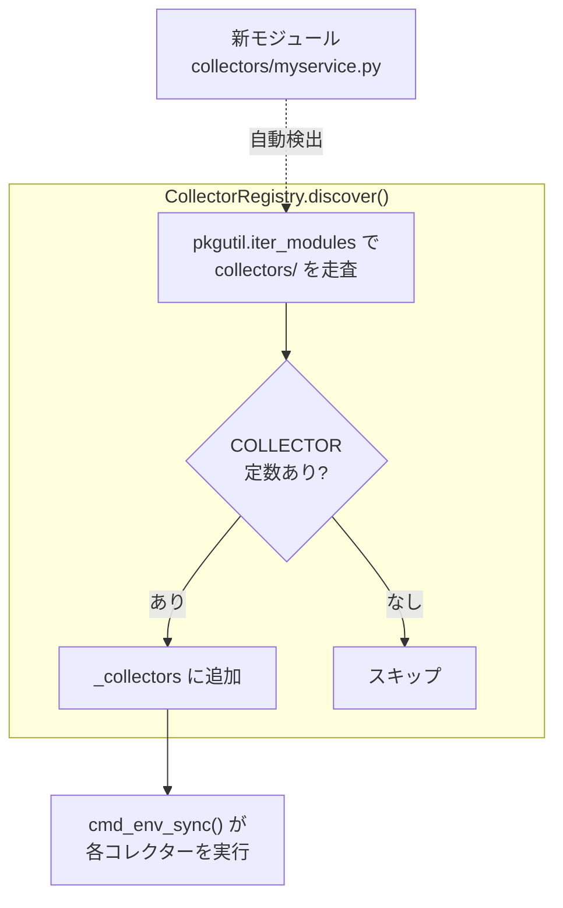
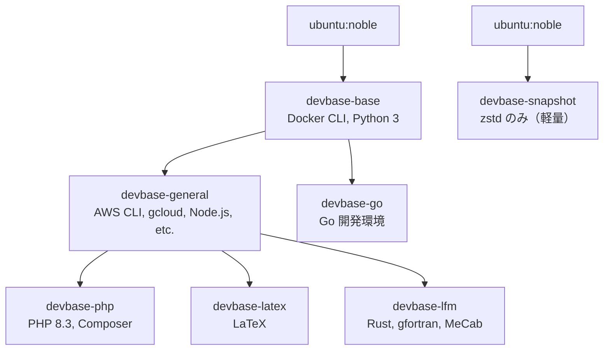

# devbase 機能拡張ガイド

devbase に新しい機能を追加する方法について説明する。主な拡張ポイントは、コマンドの追加、コレクターの追加、コンテナイメージの追加の3つである。

## 新コマンドの追加

### 概要

devbase のコマンドは以下の2パターンで追加できる。

1. **既存グループにサブコマンドを追加する** (例: `container export`)
2. **新しいグループまたはトップレベルコマンドを追加する** (例: `devbase backup`)

いずれの場合も、`lib/devbase/commands/` にハンドラを実装し、`cli.py` にパーサーを登録する流れとなる。

### 手順 1: コマンドハンドラの実装

`lib/devbase/commands/` ディレクトリに新しいモジュールを作成する。

```python
# lib/devbase/commands/backup.py
"""devbase backup コマンド"""
from pathlib import Path
from devbase.errors import DevbaseError
from devbase.log import get_logger

logger = get_logger("devbase.commands.backup")

def cmd_backup(devbase_root: Path, args) -> int:
    """backup グループのエントリーポイント"""
    handlers = {
        'create': cmd_backup_create,
        'restore': cmd_backup_restore,
    }
    handler = handlers.get(args.subcommand)
    if not handler:
        logger.error("サブコマンドを指定してください: %s", ", ".join(handlers))
        return 1
    return handler(devbase_root, args)

def cmd_backup_create(devbase_root: Path, args) -> int:
    """backup create の実装"""
    # ...
    return 0
```

#### 規約

- ハンドラ関数名は `cmd_<command>` 形式とする
- グループコマンドの場合、エントリーポイントが dict でサブコマンドをディスパッチする
- `devbase_root: Path` と `args` を引数に取り、`int` (終了コード) を返す
- ロガーは `get_logger("devbase.commands.<module>")` で作成する
- エラーは `DevbaseError` またはそのサブクラスを raise する

### 手順 2: CLI パーサーへの登録

`lib/devbase/cli.py` にパーサー定義を追加する。

#### 2a. パーサー構築関数を追加する

```python
def _add_backup_parser(subparsers):
    """Backup group parser"""
    bk_parser = subparsers.add_parser('backup', aliases=['bk'],
                                       help='Manage backups')
    bk_sub = bk_parser.add_subparsers(dest='subcommand')

    bk_create = bk_sub.add_parser('create', help='Create a backup')
    bk_create.add_argument('--name', default=None, help='Backup name')

    bk_restore = bk_sub.add_parser('restore', help='Restore from backup')
    bk_restore.add_argument('name', help='Backup name')
```

#### 2b. `_create_parser()` に登録する

```python
def _create_parser():
    # ... 既存コード ...
    _add_container_parser(subparsers)
    _add_env_parser(subparsers)
    _add_plugin_parser(subparsers)
    _add_snapshot_parser(subparsers)
    _add_backup_parser(subparsers)    # 追加
    _add_shortcuts(subparsers)
    return parser
```

#### 2c. `_dispatch()` にハンドラを登録する

```python
def _dispatch(cmd, args):
    # ... 既存コード ...

    if cmd == 'backup':
        from devbase.commands.backup import cmd_backup
        return cmd_backup(devbase_root, args)

    # ...
```

#### 2d. プレフィックスマッチ・エイリアス・Bash 側の対応

以下の箇所にも新コマンドを登録する。

| 対象ファイル | 変数/箇所 | 追加内容 |
|-------------|-----------|---------|
| `cli.py` | `SUBCMD_MAP` | `('backup', 'bk'): ['create', 'restore']` |
| `cli.py` | `GROUP_ALIASES` | `'bk': 'backup'` |
| `bin/devbase` | `resolve_command()` の `commands` 変数 | `backup bk` を追加 |
| `bin/devbase` | `case` 文の Python 転送パターン | `backup\|bk` を追加 |

### エイリアスとショートカットの追加

- **グループエイリアス**: `GROUP_ALIASES` に `'bk': 'backup'` のように登録する
- **トップレベルショートカット**: `SHORTCUTS` に `'bkcreate': ('backup', 'create')` のように登録し、`_add_shortcuts()` にパーサーを追加する

> ショートカットの追加は慎重に行うこと。トップレベルのコマンド名空間を消費するため、本当に頻繁に使うコマンドに限定する。

### 判断基準: 既存グループへの追加 vs 新グループ

| 条件 | 推奨 |
|------|------|
| 既存グループの機能と密接に関連する | 既存グループにサブコマンドを追加 |
| 独立した機能ドメインである | 新グループを作成 |
| サブコマンドが1つしかない | トップレベルコマンドとして追加 |
| 将来的にサブコマンドが増える見込みがある | 新グループを作成 |

## 新コレクターの追加

### 概要

コレクターは、ローカル環境の認証情報やツール設定を自動検出し、`.env` ファイルに書き込む仕組みである。`CollectorRegistry.discover()` による自動検出のおかげで、**新しいモジュールを配置するだけで登録不要で動作する**。

### コレクターの仕組み



### 手順 1: コレクターモジュールの作成

`lib/devbase/env/collectors/` ディレクトリに新しい Python モジュールを作成する。

```python
# lib/devbase/env/collectors/myservice.py
"""MyService 認証情報コレクター"""
import json
from pathlib import Path
from devbase.env.collector import Collector
from devbase.env.keys import MYSERVICE_API_KEY, MYSERVICE_ENDPOINT
from devbase.env.store import collect_key

def _collect(env_file, devbase_root: Path) -> None:
    """MyService の認証情報を収集して env_file に書き込む"""
    config_path = Path.home() / ".myservice" / "config.json"
    if not config_path.exists():
        return
    config = json.loads(config_path.read_text())
    key_map = {
        MYSERVICE_API_KEY: config.get("api_key", ""),
        MYSERVICE_ENDPOINT: config.get("endpoint", ""),
    }
    for key, value in key_map.items():
        if value:
            collect_key(env_file, key, value)

# モジュールレベルの COLLECTOR 定数（必須）
COLLECTOR = Collector(
    name="myservice",
    display_name="MyService",
    collect_fn=_collect,
    source_files=["~/.myservice/config.json"],
    source_type="file",
)
```

#### 必須要素

| 要素 | 説明 |
|------|------|
| `COLLECTOR` 定数 | モジュールレベルで `Collector` インスタンスをエクスポートする。これが `discover()` による自動検出の条件 |
| `collect_fn` | `(env_file, devbase_root)` を引数に取る関数。`collect_key()` を使って値を書き込む |
| `source_files` | 変更検出に使用するソースファイルのパス一覧 |

### 手順 2: キー定数の追加

`lib/devbase/env/keys.py` に環境変数キー名を定義する。

```python
# lib/devbase/env/keys.py に追加

# MyService
MYSERVICE_API_KEY = "MYSERVICE_API_KEY"
MYSERVICE_ENDPOINT = "MYSERVICE_ENDPOINT"
```

キー名は大文字のスネークケースで統一する。サービスごとにコメントでセクションを区切る。

### 手順 3: 動作確認

モジュールを配置するだけで `discover()` により自動登録されるため、追加の設定は不要である。

```bash
# コレクターが認識されていることを確認
devbase env sync

# 収集された値を確認
devbase env list --reveal
```

### 既存コレクターの一覧

参考として、現在実装されているコレクターを示す。

| モジュール | 収集対象 |
|-----------|---------|
| `aws.py` | AWS CLI 認証情報（`~/.aws/`） |
| `google.py` | GCP 認証情報（`~/.config/gcloud/`） |
| `git.py` | Git ユーザー設定・認証情報 |
| `api_keys.py` | 汎用 API キー |
| `devin.py` | Devin 関連の設定 |
| `slack.py` | Slack 関連の設定 |

## 新コンテナイメージの追加

### 概要

devbase のコンテナイメージは `containers/` ディレクトリに定義される。イメージは階層構造になっており、`devbase-base` をベースとして各用途向けのイメージが構築される。

### イメージ階層



### 手順 1: ディレクトリとDockerfileの作成

`containers/` 配下に新しいディレクトリを作成し、`Dockerfile` を配置する。

```bash
mkdir containers/myimage
```

```dockerfile
# containers/myimage/Dockerfile
FROM devbase-general:latest

USER root

# --- パッケージインストール ---
RUN apt-get update && apt-get install -y --no-install-recommends \
        libexample-dev \
        example-tools \
    && rm -rf /var/lib/apt/lists/*

# --- 言語ランタイムのインストール ---
RUN curl -fsSL https://example.com/install.sh | bash

USER ubuntu
```

> Dockerfile の記述ルール（ベースイメージのバージョン明示、RUN グループ化、`USER ubuntu`、apt キャッシュ削除等）は [contributing.md](contributing.md) を参照。

### ベースイメージの選択基準

| 条件 | 推奨ベース |
|------|-----------|
| AWS CLI / gcloud / Node.js 等の一般的な開発ツールが必要 | `devbase-general` |
| 最小限のツールだけでよい（Docker CLI + Python 3） | `devbase-base` |
| Docker も不要で極めて軽量なイメージが必要 | `ubuntu:noble` から直接構築 |

### 手順 2: ビルドと compose.yml への組み込み

`cmd_build()` は `compose.yml` から Dockerfile パスを検出し、`FROM devbase-*` 行があればベースイメージを自動的に先にビルドする。特別な設定は不要である。

プロジェクトの `compose.yml` で新しいイメージを参照する。

```yaml
services:
  dev:
    build:
      context: ${DEVBASE_ROOT}/containers/myimage/
      dockerfile: Dockerfile
    env_file:
      - ${DEVBASE_ROOT}/.env
      - env
      - .env
```

> パスは必ず `${DEVBASE_ROOT}` ベースで記述する。相対パスは使用しない。

動作確認は `devbase build` → `devbase up` → `devbase login` の順で行う。
