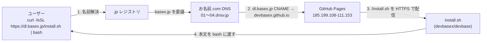
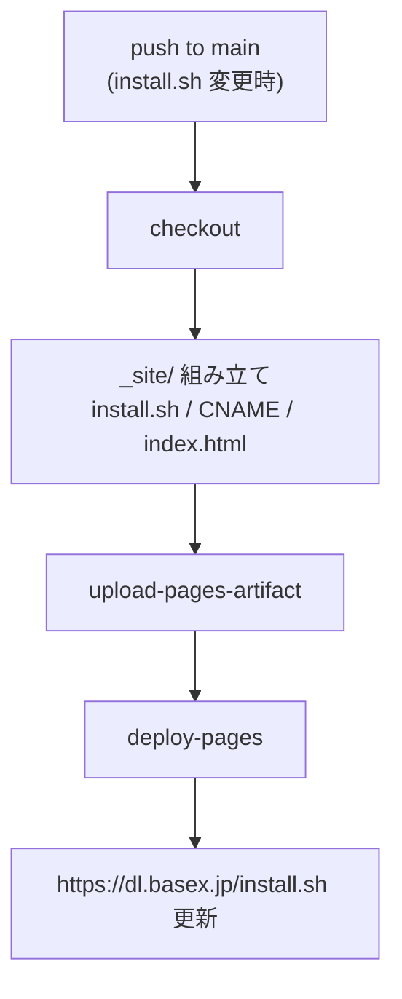
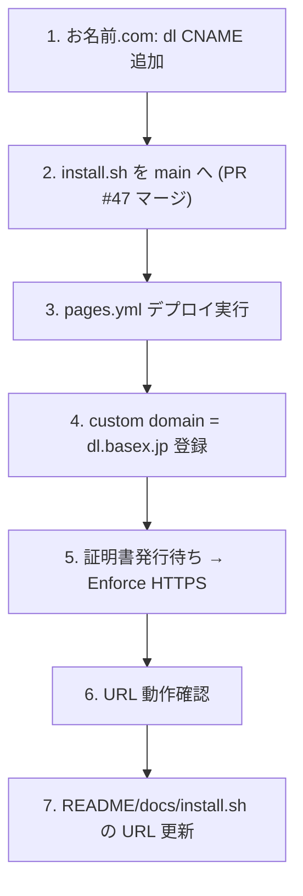

# installer 配信ホスティング仕様

`install.sh`（ワンライナー installer, PLAN31_1）を短いカスタムドメイン URL で
配信するためのホスティング仕様。plan §8 の未決事項「正規ホスティング」をここで
確定する。対象は devbase メンテナ（インフラ／リリース担当）。

## 1. 目的とスコープ

- `curl -fsSL <URL> | bash` で実行する静的ファイル `install.sh` を、安定した
  短い HTTPS URL で配信する。
- 配信 URL を `https://raw.githubusercontent.com/devbasex/devbase/main/install.sh`
  （約 73 文字）から `https://dl.basex.jp/install.sh`（約 33 文字）へ短縮する。
- スコープ外: installer 自体の挙動（`issues/PLAN31_1_devbase-installer.md` 参照）。

## 2. 決定事項

| 項目 | 決定 |
|---|---|
| ホスティング | **GitHub Pages**（devbasex/devbase リポジトリ） |
| カスタムドメイン | **`dl.basex.jp`** |
| 配信 URL | **`https://dl.basex.jp/install.sh`** |
| ドメインレジストラ | お名前.com（basex.jp） |
| DNS | お名前.com DNS（`01〜04.dnsv.jp`）に `dl` の CNAME |
| 月額コスト | **$0**（GitHub Pages 無料枠） |
| 配信方式 | GitHub Actions で `install.sh` のみを Pages 公開（single source of truth） |

### 2.1 なぜ GitHub Pages か（コスト比較）

| 選択肢 | 月額 | 帯域 | 手間 | 備考 |
|---|---|---|---|---|
| **GitHub Pages** | **$0** | 100GB/月（ソフト） | 最小 | install.sh が既に repo にある |
| Cloudflare Pages | $0 | 無制限 | 中 | DNS を Cloudflare へ寄せる前提 |
| S3 + CloudFront | 実質 $0〜 | CloudFront always-free 1TB/10M req | 大 | Route53 利用時 +$0.50/月・運用増 |

installer 程度のトラフィックでは GitHub Pages の無料枠で十分。`install.sh` が
リポジトリにあるため二重管理が不要で、運用が最も軽い。出典は本書末尾参照。

## 3. アーキテクチャ



## 4. DNS 仕様（お名前.com）

| 種別 | ホスト | 値 | 用途 |
|---|---|---|---|
| CNAME | `dl` | `devbasex.github.io.` | Pages へのルーティング |
| TXT | `_github-pages-challenge-devbasex` | GitHub 発行トークン | ドメイン検証（乗っ取り防止・任意だが推奨） |

- basex.jp のネームサーバーは `01.dnsv.jp`〜`04.dnsv.jp`（お名前.com の DNS レコード
  設定用サーバー）。NS 変更は不要。
- **お名前.com には CNAME/TXT を操作する公式 REST API は無い**。レコード設定は
  Navi の Web 画面のみ（ダイナミック DNS は A レコード専用で本用途に使えない）。
  IaC で DNS を回したい場合は NS を Cloudflare DNS（無料・API あり）または
  Route53（$0.50/月）へ委譲する必要がある（本書では採用しない）。
- 反映には時間がかかる場合がある。ゾーン未活性時は権威サーバーが `REFUSED`
  （SOA を含む全レコードが lame delegation）を返すため、レコード追加後は
  「設定する」まで完走し、伝播を待って §8 のコマンドで確認する。

## 5. GitHub Pages 配信仕様

### 5.1 方針

- リポジトリ全体を Pages で晒さないよう、**GitHub Actions で `install.sh` のみ**を
  成果物（artifact）として公開する。`install.sh` はリポジトリ root の 1 ファイルが
  正本（single source of truth）であり、Pages 用に複製しない。
- 成果物に `CNAME`（内容 `dl.basex.jp`）を含め、custom domain を固定する。
- ルート（`/`）には簡単な案内 HTML を置く（任意）。

### 5.2 配信ワークフロー（`.github/workflows/pages.yml`）



要点:

- トリガ: `push`（`paths: [install.sh, .github/workflows/pages.yml]`）+ `workflow_dispatch`。
- 権限: `pages: write` / `id-token: write` / `contents: read`。
- 並行制御: `concurrency: { group: pages, cancel-in-progress: true }`。
- `_site/` に `install.sh` をコピーし、`CNAME` に `dl.basex.jp` を書き出す。

### 5.3 HTTPS

- GitHub Pages が Let's Encrypt 証明書を自動発行・更新する。
- custom domain 設定後、証明書が発行され次第 **Enforce HTTPS** を有効化する。
- 証明書発行前は `dl.basex.jp` への HTTPS アクセスが cert 不一致になるため、
  custom domain 登録 → 発行待ち（数分〜）→ Enforce の順で進める。

## 6. 初回セットアップ手順



| # | 作業 | 実施者 | 方法 |
|---|---|---|---|
| 1 | `dl` CNAME 追加 | メンテナ | お名前.com Navi（API 不可） |
| 2 | `install.sh` を main へ | メンテナ | PR #47 をマージ |
| 3 | Pages 有効化・デプロイ | 自動/CLI | Actions 実行、または `gh api -X POST repos/devbasex/devbase/pages -f build_type=workflow` |
| 4 | custom domain 登録 | CLI/UI | `gh api -X PUT repos/devbasex/devbase/pages -f cname=dl.basex.jp` または Settings→Pages |
| 5 | Enforce HTTPS | CLI/UI | 証明書発行後に `https_enforced=true` |
| 6 | 動作確認 | 任意 | §8 のコマンド |
| 7 | URL 更新 | メンテナ | README / docs / install.sh のコメント |

URL 更新（#7）は **配信が生きてから**行う。先に書くと一時的に 404 になる。

## 7. 更新・運用フロー

- `install.sh` を変更して main にマージすると、`pages.yml` が走り `dl.basex.jp` の
  配信が自動更新される（手動の cache invalidation 不要）。
- 正本はリポジトリ root の `install.sh` の 1 つだけ。Pages 用コピーは作らない。
- ドメイン検証 TXT を入れておくと、サブドメイン乗っ取り（dangling DNS）を防げる。

## 8. 検証コマンド

```bash
# DNS: CNAME が devbasex.github.io を指すか
curl -fsS 'https://dns.google/resolve?name=dl.basex.jp&type=CNAME'

# 配信: install.sh が 200 で取得でき、HTTPS 証明書が一致するか
curl -fsSL -o /dev/null -w 'HTTP %{http_code} ssl_verify=%{ssl_verify_result}\n' \
  https://dl.basex.jp/install.sh

# 中身の先頭確認
curl -fsSL https://dl.basex.jp/install.sh | head -20
```

- DNS 成功時は `Status:0` で `data` が `devbasex.github.io.`。
- 配信成功時は `HTTP 200` かつ `ssl_verify=0`。

## 9. セキュリティ

- 配信は HTTPS 強制（Enforce HTTPS）。`curl -fsSL` の `-f` で HTTP エラーを fail させる。
- ドメイン検証 TXT で dangling DNS による乗っ取りを防止する。
- `curl | bash` の一般的注意（実行前にスクリプトを確認する代替手順）は
  README / getting-started に記載済み。
- installer 自身の安全策（前提チェック・REF サニタイズ・誤上書き防止）は
  `issues/PLAN31_1_devbase-installer.md` を参照。

## 10. 既知の制約・代替

- お名前.com の DNS は公式 API が無く手動運用。DNS を IaC 化したい場合は
  Cloudflare DNS（無料）/ Route53（$0.50/月）への委譲を検討する。
- 帯域が 100GB/月を大きく超える見込みになった場合は、帯域無制限の
  Cloudflare Pages への移行を検討する（URL・配信方式は据え置き可能）。

## 11. ステータス

- DNS（`dl.basex.jp` CNAME）: **完了**（GitHub Pages IP に解決・確認済み）。
- GitHub Pages 有効化 / custom domain / Enforce HTTPS: **完了**。
  `https://dl.basex.jp/install.sh` が HTTP 200・証明書一致・`http→https` 301 を確認済み。
- URL 更新（README / docs / install.sh）: **完了**（#49）。配信内容の sha256 が
  `main:install.sh` と一致することを確認済み。
- ドメイン検証 TXT（§4・乗っ取り防止）: **未**（推奨）。GitHub の Verify domains で
  発行されるトークンを、お名前.com に TXT `_github-pages-challenge-devbasex` として登録する。

## 12. 出典

- [Amazon CloudFront Pricing](https://aws.amazon.com/cloudfront/pricing/)
- [GitHub Pages limits](https://docs.github.com/en/pages/getting-started-with-github-pages/github-pages-limits)
- [Securing your GitHub Pages site with HTTPS](https://docs.github.com/en/pages/getting-started-with-github-pages/securing-your-github-pages-site-with-https)
- [Cloudflare Pages limits](https://developers.cloudflare.com/pages/platform/limits/)
- [お名前.com DNSレコード設定ガイド](https://www.onamae.com/guide/p/70)
