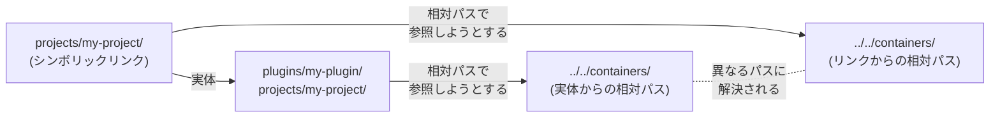
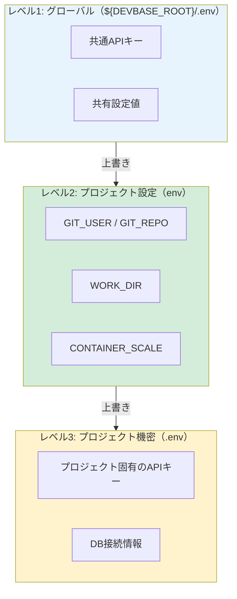
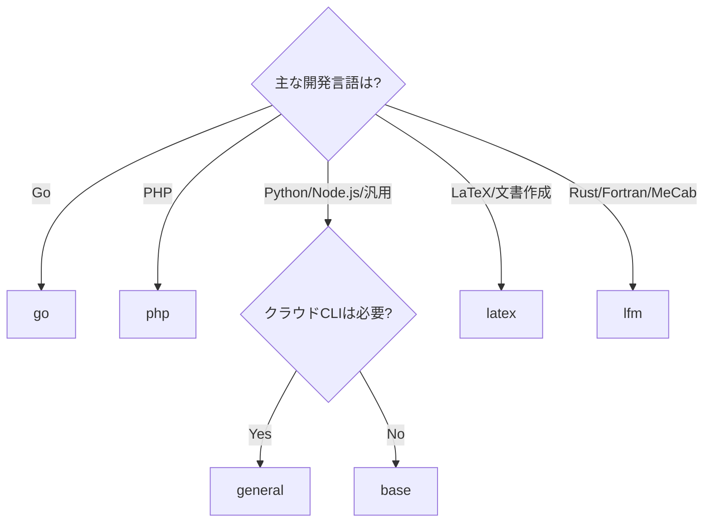

# compose.yml ガイドライン

devbase Pluginにおける `compose.yml` の記述ルール、設計パターン、テンプレートをまとめたガイドラインです。

---

## 1. パス規則

### 1.1 `${DEVBASE_ROOT}` ベースのパス（必須）

compose.yml 内のすべてのパスは `${DEVBASE_ROOT}` を起点として記述してください。

```yaml
# OK: 絶対パス（DEVBASE_ROOTベース）
build:
  context: ${DEVBASE_ROOT}/containers/general/

# NG: 相対パス
build:
  context: ../../containers/general/
```

### 1.2 相対パスが禁止の理由

devbaseはPluginのプロジェクトを `projects/` 配下にシンボリックリンクとして配置します。



Docker Composeが相対パスを解決する際、シンボリックリンク元とリンク先のどちらを基準にするかは実行環境に依存します。
`${DEVBASE_ROOT}` を使うことで、パス解決が常に一意になり、環境による差異を排除できます。

### 1.3 例外: env_file のローカルパス

`env_file` に指定する `env` と `.env` はプロジェクトディレクトリからの相対パスで記述します。
これらはcompose.yml と同じディレクトリに配置されるため、相対パスで問題ありません。

```yaml
env_file:
  - ${DEVBASE_ROOT}/.env    # グローバル: DEVBASE_ROOTベース
  - env                      # ローカル: 相対パス（OK）
  - .env                     # ローカル: 相対パス（OK）
```

---

## 2. env_file 指定順序

### 2.1 3段階の環境変数

devbaseでは環境変数を3段階で管理します。
`env_file` は上から順に読み込まれ、**後の指定が前の指定を上書き**します。

```yaml
env_file:
  - ${DEVBASE_ROOT}/.env    # 1. グローバル環境変数
  - env                      # 2. プロジェクト設定（Git管理対象）
  - .env                     # 3. プロジェクト機密（gitignore）
```

### 2.2 各レベルの役割



| レベル | ファイル | Git管理 | 用途 | 例 |
|--------|---------|---------|------|-----|
| 1 | `${DEVBASE_ROOT}/.env` | No | 全プロジェクト共通の設定 | 共通APIキー |
| 2 | `env` | Yes | プロジェクト固有の設定 | `GIT_REPO`, `CONTAINER_SCALE` |
| 3 | `.env` | No | プロジェクト固有の機密 | DB接続文字列、秘密鍵 |

---

## 3. ボリューム設定

### 3.1 標準ボリューム

devbaseでは2種類のボリュームパターンを使い分けます。

```yaml
volumes:
  - devbase_home_ubuntu:/home/ubuntu                              # 全コンテナ共有
  - ${COMPOSE_PROJECT_NAME}_work_${CONTAINER_INDEX:-1}:/work      # コンテナ専用
```

| ボリューム | マウント先 | 共有範囲 | 用途 |
|-----------|-----------|----------|------|
| `devbase_home_ubuntu` | `/home/ubuntu` | 全コンテナ | シェル設定、SSH鍵、Git設定 |
| `${COMPOSE_PROJECT_NAME}_work_${CONTAINER_INDEX:-1}` | `/work` | コンテナ専用 | ソースコード、ビルド成果物 |

### 3.2 Docker Socketのマウント

コンテナ内からDockerコマンドを使用する場合は、Docker Socketをマウントし、`group_add` でDockerグループに追加します。

```yaml
services:
  dev:
    volumes:
      - /var/run/docker.sock:/var/run/docker.sock
    group_add: ["${DOCKER_GID}"]
```

---

## 4. ビルドコンテキスト

### 4.1 コンテナイメージの選択

プロジェクトの技術スタックに応じて、適切なコンテナイメージを選択します。



| イメージ | ベース | 主要ツール | 典型的な用途 |
|---------|--------|-----------|-------------|
| `base` | Ubuntu Noble | Docker CLI、Python 3 | 軽量な自動化・スクリプト |
| `general` | base | AWS CLI、gcloud、Terraform、Node.js 20、AI CLI | Webアプリ、インフラ管理 |
| `go` | base | Go開発環境 | APIサーバー、CLIツール |
| `php` | general | PHP 8.3、Composer | Laravel、WordPress |
| `latex` | general | LaTeX | 論文、技術文書、レポート |
| `lfm` | general | Rust、gfortran、MeCab | 数値計算、自然言語処理 |
| `snapshot` | Ubuntu Noble | zstd | スナップショットの取得・復元 |

### 4.2 標準イメージの使用

標準イメージを使用する場合は、`containers/` ディレクトリ内のDockerfileを参照します。

```yaml
build:
  context: ${DEVBASE_ROOT}/containers/general/
  dockerfile: Dockerfile
```

### 4.3 カスタムDockerfileの配置

プロジェクト固有の追加パッケージが必要な場合は、カスタムDockerfileを作成し、`dockerfile` フィールドで指定します。

```yaml
build:
  context: ${DEVBASE_ROOT}/containers/general/
  dockerfile: ${DEVBASE_ROOT}/plugins/my-plugin/docker/Dockerfile.custom
```

---

## 5. スケーリング対応

### 5.1 CONTAINER_INDEX 変数

devbaseはスケーリング時にコンテナごとに `CONTAINER_INDEX`（1始まり）を割り当てます。
`${CONTAINER_INDEX:-1}` のようにデフォルト値 `1` を指定すれば、スケーリングしない場合でも安全に動作します。

### 5.2 ポートバインドの注意

ホストポートをバインドする場合、スケーリング時にポート重複が発生します。
`CONTAINER_INDEX` を使ってポート番号をずらしてください。

```yaml
# NG: スケーリング時にポート重複
ports:
  - "3000:3000"

# OK: CONTAINER_INDEXでポートをオフセット
ports:
  - "${CONTAINER_INDEX:-1}3000:3000"
```

例: `CONTAINER_INDEX=1` の場合は `13000:3000`、`CONTAINER_INDEX=2` の場合は `23000:3000`

### 5.3 CONTAINER_SCALE の設定

`env` ファイルで `CONTAINER_SCALE` を設定すると、`devbase up` 実行時に `.docker-compose.scale.yml` が自動生成され、指定された数のコンテナが起動します。

---

## 6. テンプレート例

### 6.1 基本的なWebアプリ構成

Node.js / Python などの汎用的なWebアプリケーション向け構成です。

```yaml
services:

  dev:
    image: my-webapp:latest
    build:
      context: ${DEVBASE_ROOT}/containers/general/
      dockerfile: Dockerfile
    volumes:
      - /var/run/docker.sock:/var/run/docker.sock
    env_file:
      - ${DEVBASE_ROOT}/.env
      - env
      - .env
    group_add: ["${DOCKER_GID}"]
    command: tail -f /dev/null
    working_dir: /work
    networks:
      - devbase_net

networks:
  devbase_net:
    external: true
```

対応する `env` ファイル:

```bash
GIT_USER=your-org
GIT_REPO=my-webapp
WORK_DIR=/work/$GIT_REPO
CONTAINER_SCALE=1
```

### 6.2 データベースを含む構成

基本構成に `db` サービスを追加し、`depends_on` で依存関係を定義します。

```yaml
services:

  dev:
    image: my-app:latest
    build:
      context: ${DEVBASE_ROOT}/containers/general/
      dockerfile: Dockerfile
    volumes:
      - /var/run/docker.sock:/var/run/docker.sock
    env_file:
      - ${DEVBASE_ROOT}/.env
      - env
      - .env
    group_add: ["${DOCKER_GID}"]
    command: tail -f /dev/null
    working_dir: /work
    depends_on:
      - db
    networks:
      - devbase_net

  db:
    image: postgres:16
    environment:
      POSTGRES_USER: devuser
      POSTGRES_PASSWORD: devpass
      POSTGRES_DB: myapp_dev
    volumes:
      - ${COMPOSE_PROJECT_NAME}_pgdata:/var/lib/postgresql/data
    networks:
      - devbase_net

networks:
  devbase_net:
    external: true
```

> **注意:** DB認証情報は本番では `.env`（gitignore対象）に外部化してください。

### 6.3 他のコンテナイメージを使う場合

基本構成の `build.context` を変更するだけで対応できます。

```yaml
# Go言語プロジェクトの場合
build:
  context: ${DEVBASE_ROOT}/containers/go/

# PHP/Laravelプロジェクトの場合
build:
  context: ${DEVBASE_ROOT}/containers/php/
```

---

## 7. チェックリスト

compose.yml を作成・レビューする際に確認すべき項目です。

| # | チェック項目 | 確認 |
|---|------------|------|
| 1 | `build.context` が `${DEVBASE_ROOT}` ベースか | |
| 2 | `env_file` が3段階で正しい順序か | |
| 3 | `networks` に `devbase_net: external: true` があるか | |
| 4 | Docker Socketマウント + `group_add` が設定されているか | |
| 5 | ホストポートバインド時に `CONTAINER_INDEX` を考慮しているか | |
| 6 | 機密情報が `compose.yml` にハードコードされていないか | |
| 7 | ボリューム名が命名規則に従っているか | |
| 8 | `working_dir` が `/work` に設定されているか | |

---

## 関連ドキュメント

- [クイックスタート](quickstart.md) -- Plugin開発の始め方
- [plugin.yml リファレンス](plugin-yml-reference.md) -- plugin.yml の全フィールド仕様
