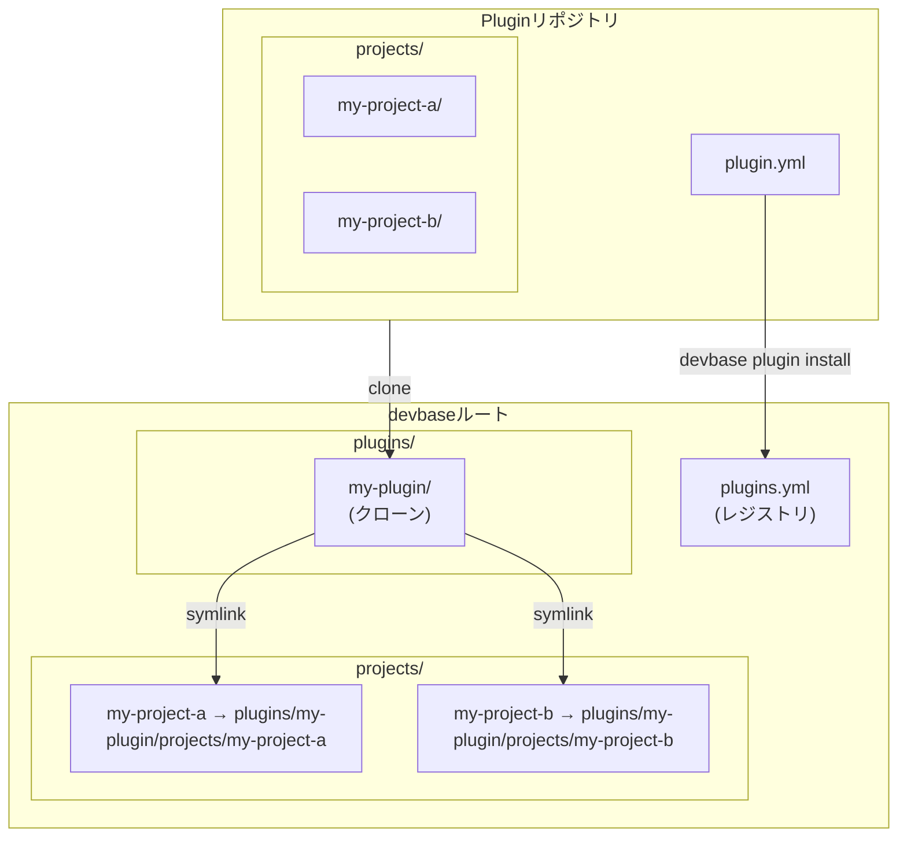
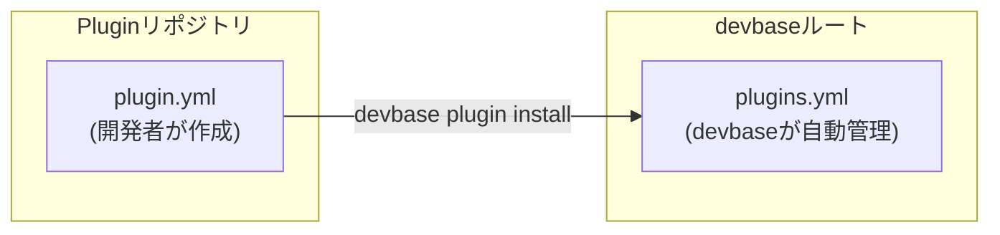

# plugin.yml リファレンス

`plugin.yml` はPluginリポジトリのルートに配置する設定ファイルです。
Pluginのメタ情報とプロジェクト一覧を定義します。

---

## 概要



---

## 基本構造

```yaml
plugins:
  - name: my-plugin
    version: 1.0.0
    description: "プラグインの説明"
    projects:
      - name: my-project-a
        description: "プロジェクトAの説明"
        path: projects/my-project-a
      - name: my-project-b
        description: "プロジェクトBの説明"
        path: projects/my-project-b
```

---

## フィールド一覧

### トップレベル

| フィールド | 型 | 必須 | 説明 |
|-----------|-----|------|------|
| `plugins` | array | Yes | Plugin定義のリスト |

### Plugin定義 (`plugins[*]`)

| フィールド | 型 | 必須 | 説明 |
|-----------|-----|------|------|
| `name` | string | Yes | Plugin名 |
| `version` | string | Yes | セマンティックバージョン |
| `description` | string | No | Pluginの説明 |
| `projects` | array | Yes | プロジェクト定義のリスト |

### プロジェクト定義 (`plugins[*].projects[*]`)

| フィールド | 型 | 必須 | 説明 |
|-----------|-----|------|------|
| `name` | string | Yes | プロジェクト名 |
| `description` | string | No | プロジェクトの説明 |
| `path` | string | Yes | リポジトリルートからの相対パス |

---

## フィールド詳細

### `name`（Plugin名）

Pluginを一意に識別する名前です。

**バリデーションルール:**

- 使用可能文字: 英小文字、数字、ハイフン（`a-z`, `0-9`, `-`）
- 先頭はアルファベット
- 長さ: 2文字以上、64文字以下
- devbase内で一意であること

```yaml
# OK
name: my-plugin
name: data-pipeline-v2

# NG
name: My_Plugin     # 大文字・アンダースコア不可
name: -my-plugin    # 先頭ハイフン不可
name: a             # 2文字未満
```

### `version`

セマンティックバージョニング（SemVer）形式で記述します。

**フォーマット:** `MAJOR.MINOR.PATCH`

```yaml
version: 1.0.0
version: 2.3.1
```

| 要素 | 意味 | インクリメントするとき |
|------|------|---------------------|
| MAJOR | 破壊的変更 | プロジェクト構成の大幅な変更 |
| MINOR | 後方互換の機能追加 | 新しいプロジェクトの追加 |
| PATCH | バグ修正 | compose.yml や env の軽微な修正 |

### `description`

Pluginまたはプロジェクトの説明文です。
`devbase plugin list` で一覧表示されるため、簡潔に記述してください。

```yaml
description: "EC事業部のマイクロサービス群"
```

### `projects`

Pluginに含まれるプロジェクトの一覧です。
1つのPluginに複数のプロジェクトを含めることができます。

### `projects[*].name`（プロジェクト名）

プロジェクトを一意に識別する名前です。
インストール時に `projects/<name>/` としてシンボリックリンクが作成されます。

**バリデーションルール:**

- Plugin名と同様の命名規則
- devbase全体で一意であること（他のPluginのプロジェクト名と重複不可）

### `projects[*].path`

リポジトリルートからの相対パスで、プロジェクトディレクトリの位置を指定します。

```yaml
path: projects/my-project
```

**注意事項:**

- パスの先頭に `/` を付けない（相対パスで記述する）
- 指定したディレクトリに `compose.yml` が存在すること
- 慣例として `projects/` ディレクトリ配下に配置する

---

## 使用例

### 単一プロジェクトのPlugin

最もシンプルな構成です。

```yaml
plugins:
  - name: my-api
    version: 1.0.0
    description: "APIサーバー開発環境"
    projects:
      - name: my-api
        description: "APIサーバー"
        path: projects/my-api
```

ディレクトリ構造:

```
my-api/
├── plugin.yml
└── projects/
    └── my-api/
        ├── compose.yml
        └── env
```

### 複数プロジェクトのPlugin

関連するプロジェクトをまとめて管理する場合に使います。

```yaml
plugins:
  - name: ecommerce
    version: 2.1.0
    description: "ECサイト開発環境一式"
    projects:
      - name: ec-frontend
        description: "フロントエンド（Next.js）"
        path: projects/ec-frontend
      - name: ec-backend
        description: "バックエンドAPI（Go）"
        path: projects/ec-backend
      - name: ec-admin
        description: "管理画面（Laravel）"
        path: projects/ec-admin
```

ディレクトリ構造:

```
ecommerce/
├── plugin.yml
└── projects/
    ├── ec-frontend/
    │   ├── compose.yml
    │   └── env
    ├── ec-backend/
    │   ├── compose.yml
    │   └── env
    └── ec-admin/
        ├── compose.yml
        └── env
```

### 1リポジトリに複数Pluginを含む場合

`plugins` 配列に複数のPlugin定義を記述します。
チーム横断で1つのリポジトリを共有する場合に使えます。

```yaml
plugins:
  - name: team-alpha
    version: 1.0.0
    description: "Alphaチームのプロジェクト"
    projects:
      - name: alpha-service
        description: "Alphaチームのサービス"
        path: projects/alpha-service

  - name: team-beta
    version: 1.2.0
    description: "Betaチームのプロジェクト"
    projects:
      - name: beta-service
        description: "Betaチームのサービス"
        path: projects/beta-service
```

---

## plugin.yml と plugins.yml の違い

devbaseには似た名前の2つのファイルがあります。混同しないよう注意してください。

| 項目 | plugin.yml | plugins.yml |
|------|-----------|-------------|
| 配置場所 | Pluginリポジトリのルート | devbaseルートディレクトリ |
| 管理者 | Plugin開発者 | devbase（自動管理） |
| 用途 | Pluginの定義・メタ情報 | インストール済みPluginのレジストリ |
| Git管理 | Plugin側のリポジトリで管理 | devbase側のリポジトリで管理 |
| 編集 | 手動で編集 | `devbase plugin` コマンドで自動更新 |



### plugins.yml の構造（参考）

```yaml
# devbaseが自動管理するため、手動編集は非推奨
plugins:
  my-plugin:
    source: github.com/your-user/my-plugin
    version: 1.0.0
    installed_at: 2025-01-15T10:30:00Z
```

---

## バリデーション

`plugin.yml` は `devbase plugin install` 実行時に自動的にバリデーションされます。

### よくあるエラーと対処

| エラーメッセージ | 原因 | 対処 |
|----------------|------|------|
| `Invalid plugin name` | 命名規則違反 | 英小文字・数字・ハイフンのみ使用 |
| `Invalid version format` | SemVer形式でない | `MAJOR.MINOR.PATCH` 形式に修正 |
| `Project directory not found` | pathが不正 | ディレクトリの存在を確認 |
| `compose.yml not found` | compose.ymlが未配置 | 指定ディレクトリに配置 |
| `Duplicate project name` | プロジェクト名が重複 | 一意な名前に変更 |

---

## 関連ドキュメント

- [クイックスタート](quickstart.md) -- Plugin開発の始め方
- [compose.yml ガイドライン](compose-yml-guidelines.md) -- compose.yml の記述ルール
