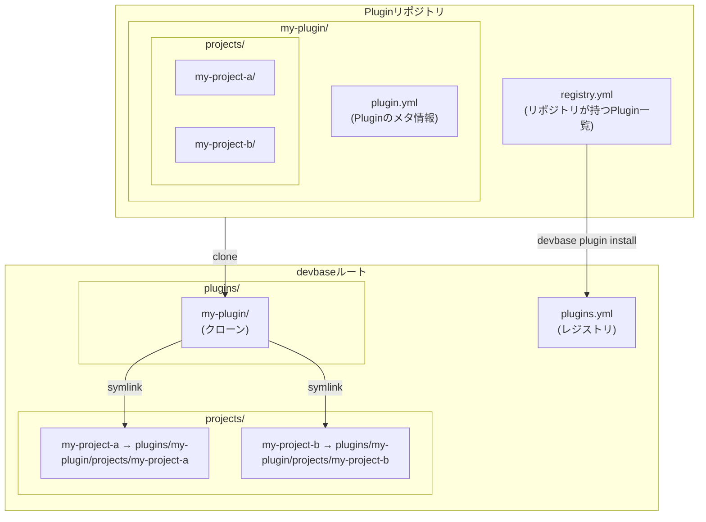
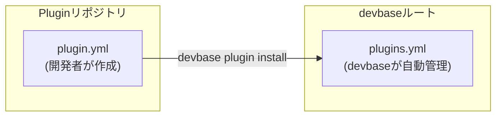

# plugin.yml リファレンス

`plugin.yml` は Plugin ディレクトリのルートに配置する設定ファイルです。
Plugin のメタ情報（名前・バージョン・必要な devbase 本体のバージョンなど）を定義します。

---

## 概要


```mermaid
flowchart TB
    subgraph repo["Pluginリポジトリ"]
        RY["registry.yml<br/>(リポジトリが持つPlugin一覧)"]
        subgraph plugin["my-plugin/"]
            PY["plugin.yml<br/>(Pluginのメタ情報)"]
            subgraph projects["projects/"]
                P1["my-project-a/"]
                P2["my-project-b/"]
            end
        end
    end
    subgraph devbase["devbaseルート"]
        PS["plugins.yml<br/>(レジストリ)"]
        subgraph installed["plugins/"]
            IP["my-plugin/<br/>(クローン)"]
        end
        subgraph symlinks["projects/"]
            S1["my-project-a → plugins/my-plugin/projects/my-project-a"]
            S2["my-project-b → plugins/my-plugin/projects/my-project-b"]
        end
    end
    RY -->|"devbase plugin install"| PS
    repo -->|clone| IP
    IP -->|symlink| S1
    IP -->|symlink| S2
```

---

## 基本構造

```yaml
name: my-plugin
version: "1.0.0"
description: "プラグインの説明"
requires:
  devbase: ">=3.0.0"
priority: 0
```

Plugin が提供するプロジェクトは `projects/` 配下のディレクトリから**自動的に検出**されます。
`plugin.yml` にプロジェクトを列挙する必要はありません。

---

## フィールド一覧

| フィールド | 型 | 必須 | 既定値 | 説明 |
|-----------|-----|------|--------|------|
| `name` | string | Yes | ディレクトリ名 | Plugin名 |
| `version` | string | No | `0.1.0` | セマンティックバージョン |
| `description` | string | No | `""` | Pluginの説明 |
| `requires` | map | No | なし | 動作要件。現在は `devbase` キーのみ |
| `requires.devbase` | string | No | なし | 必要な devbase 本体の最低バージョン（例: `">=3.0.0"`） |
| `priority` | int | No | `0` | プロジェクト名が他Pluginと衝突したときの優先度。大きいほうが `projects/<name>` を取る |

---

## フィールド詳細

### `name`（Plugin名）

Pluginを一意に識別する名前です。省略するとディレクトリ名が使われますが、
`registry.yml` の `plugins[*].name` と食い違うと追跡しにくいため明示してください。

**命名規則（推奨）:**

- 使用可能文字: 英小文字、数字、ハイフン（`a-z`, `0-9`, `-`）
- 先頭はアルファベット
- 長さ: 2文字以上、64文字以下
- devbase内で一意であること

```yaml
# OK
name: my-plugin
name: data-pipeline-v2

# NG
name: My_Plugin     # 大文字・アンダースコア不可
name: -my-plugin    # 先頭ハイフン不可
name: a             # 2文字未満
```

### `version`

セマンティックバージョニング（SemVer）形式で記述します。

**フォーマット:** `MAJOR.MINOR.PATCH`

```yaml
version: "1.0.0"
version: "2.3.1"
```

| 要素 | 意味 | インクリメントするとき |
|------|------|---------------------|
| MAJOR | 破壊的変更 | プロジェクト構成の大幅な変更 |
| MINOR | 後方互換の機能追加 | 新しいプロジェクトの追加 |
| PATCH | バグ修正 | compose.yml や env の軽微な修正 |

### `description`

Pluginの説明文です。
`devbase plugin list` で一覧表示されるため、簡潔に記述してください。

```yaml
description: "EC事業部のマイクロサービス群"
```

### `requires`

この Plugin が動作するために必要な devbase 側の条件を書きます。
現在使えるキーは `devbase`（本体の最低バージョン）だけです。

```yaml
requires:
  devbase: ">=3.0.0"
```

| 値 | 意味 |
|----|------|
| `">=3.0.0"` | devbase 3.0.0 以上が必要 |
| `">=3.0.0,<4.0.0"` | 範囲指定（カンマ区切りは AND） |
| `"==3.0.0"` / `"3.0.0"` | 一致（演算子を省略すると `==` 扱い） |
| 省略 | バージョン要件なし（どの版でも導入を試みる） |

使える演算子は `>=` / `<=` / `>` / `<` / `==` / `!=` です。版数の要素数は自由で、
桁数が違う場合は短い方を `0` で埋めて比較します（`">=3.0"` と `3.0.0` は等しい、
`">=3.0.0.1"` を `3.0.0` は満たさない）。比較は数値で行うため `10.0.0` は `3.0.0` より新しく扱われます。

**devbase 3.0.0 以降のPluginは `">=3.0.0"` を指定してください。**
プロジェクト設定を `projects/<name>/project.yml` で記述する形式は devbase 3.0.0 で導入されたもので、
2.x 系の devbase は `project.yml` を読めません。

### インストール時の検証

`devbase plugin install` は、要件を満たさない Plugin のインストールを**中止**します。

```
Error: プラグイン 'carmo-web' は devbase >=3.0.0 を要求していますが、現在の devbase は 2.2.0 です。
devbase を更新してから再度インストールしてください (検証を飛ばす場合は DEVBASE_IGNORE_PLUGIN_REQUIRES=1)。
```

- 既存のインストールに触れる**前**に検証するため、入れ替えに失敗しても既に入っている Plugin は壊れません
- 解釈できない書式（`"^3.0.0"` など）や版数のときは、**警告を出して検証せずに続行**します。独自記法を書いた Plugin をインストール不能にするより実害が小さいためです
- 検証側の判断が誤っているときは `DEVBASE_IGNORE_PLUGIN_REQUIRES=1` で無効化できます

### 更新時の警告

`devbase plugin update`（`git pull`）で Plugin 側の `requires.devbase` が上がることがあります。
更新自体は既に済んでいて中止できないため、要件を満たさなくなった Plugin は**警告**で知らせます。

```
WARNING プラグイン 'carmo-web' は devbase >=4.0.0 を要求していますが、現在の devbase は 3.0.0 です。
devbase 本体を更新してください (この警告を止める場合は DEVBASE_IGNORE_PLUGIN_REQUIRES=1)。
```

> `requires.devbase` を上げるのは、**Plugin が `project.yml` 形式へ移行したタイミング**です。
> 本体の版数と一緒に自動では上がりません。

### `priority`

同じ名前のプロジェクトを複数のPluginが提供したときに、どちらが `projects/<name>` の
シンボリックリンクを取るかを決める整数です（既定 `0`、大きいほうが勝ち）。
負けた側は `projects/<name>.<owner>--<repo>` の形でリンクされ、どちらも利用できます。

```yaml
priority: 10
```

### プロジェクトの検出

`plugin.yml` にプロジェクト一覧は書きません。Plugin ディレクトリ直下の `projects/` にある
ディレクトリ（`.` で始まるものを除く）がそのままプロジェクトとして扱われ、インストール時に
devbase ルートの `projects/<name>/` へシンボリックリンクが作成されます。

```
my-plugin/
├── plugin.yml
└── projects/
    ├── my-project-a/    -> projects/my-project-a として公開される
    │   ├── compose.yml
    │   ├── project.yml
    │   └── env
    └── my-project-b/
        ├── compose.yml
        ├── project.yml
        └── env
```

各プロジェクトディレクトリの中身は
[クイックスタート](quickstart.md) と [project.yml リファレンス](../user/project-yml.md) を参照してください。

---

## 使用例

### 単一プロジェクトのPlugin

最もシンプルな構成です。

```yaml
name: my-api
version: "1.0.0"
description: "APIサーバー開発環境"
requires:
  devbase: ">=3.0.0"
```

ディレクトリ構造:

```
my-api/
├── plugin.yml
└── projects/
    └── my-api/
        ├── compose.yml
        ├── project.yml
        └── env
```

### 複数プロジェクトのPlugin

関連するプロジェクトをまとめて管理する場合に使います。

```yaml
name: ecommerce
version: "2.1.0"
description: "ECサイト開発環境一式"
requires:
  devbase: ">=3.0.0"
```

ディレクトリ構造:

```
ecommerce/
├── plugin.yml
└── projects/
    ├── ec-frontend/
    │   ├── compose.yml
    │   ├── project.yml
    │   └── env
    ├── ec-backend/
    │   ├── compose.yml
    │   ├── project.yml
    │   └── env
    └── ec-admin/
        ├── compose.yml
        ├── project.yml
        └── env
```

### 1リポジトリに複数Pluginを含む場合

`plugin.yml` は Plugin ごとに 1 ファイルです。1 つのリポジトリで複数の Plugin を配布する場合は、
Plugin ごとにディレクトリを分けてそれぞれに `plugin.yml` を置き、リポジトリルートの
`registry.yml` に一覧を記述します。

```
my-registry/
├── registry.yml
├── team-alpha/
│   ├── plugin.yml
│   └── projects/alpha-service/
└── team-beta/
    ├── plugin.yml
    └── projects/beta-service/
```

`registry.yml`:

```yaml
name: my-registry
description: "社内レジストリ"
plugins:
  - name: team-alpha
    path: team-alpha
    description: "Alphaチームのプロジェクト"
  - name: team-beta
    path: team-beta
    description: "Betaチームのプロジェクト"
```

---

## plugin.yml と plugins.yml の違い

devbaseには似た名前の2つのファイルがあります。混同しないよう注意してください。

| 項目 | plugin.yml | plugins.yml |
|------|-----------|-------------|
| 配置場所 | Pluginディレクトリのルート | devbaseルートディレクトリ |
| 管理者 | Plugin開発者 | devbase（自動管理） |
| 用途 | Pluginの定義・メタ情報 | インストール済みPluginのレジストリ |
| Git管理 | Plugin側のリポジトリで管理 | devbase側のリポジトリで管理 |
| 編集 | 手動で編集 | `devbase plugin` コマンドで自動更新 |


```mermaid
flowchart LR
    subgraph plugin_repo["Pluginリポジトリ"]
        A["plugin.yml<br/>(開発者が作成)"]
    end
    subgraph devbase_root["devbaseルート"]
        B["plugins.yml<br/>(devbaseが自動管理)"]
    end
    A -->|"devbase plugin install"| B
```

### plugins.yml の構造（参考）

```yaml
# devbaseが自動管理するため、手動編集は非推奨
plugins:
  my-plugin:
    source: github.com/your-user/my-plugin
    version: 1.0.0
    installed_at: 2025-01-15T10:30:00Z
```

---

## バリデーション

`devbase plugin install` はリポジトリを clone したあと `registry.yml` と `plugin.yml` を読み込みます。

### よくあるエラーと対処

| エラーメッセージ | 原因 | 対処 |
|----------------|------|------|
| `Failed to parse .../plugin.yml` | YAML の構文エラー | インデント・引用符を確認 |
| `No registry.yml found in repository` | リポジトリルートに `registry.yml` が無い | リポジトリルートに配置する |
| `Plugin '<name>' not found in <repo>` | `registry.yml` に該当 Plugin の記載が無い | `plugins[*].name` を確認 |
| `Plugin directory not found: <path>` | `registry.yml` の `path` が実在しない | `path` とディレクトリ名を突き合わせる |

---

## 関連ドキュメント

- [クイックスタート](quickstart.md) -- Plugin開発の始め方
- [compose.yml ガイドライン](compose-yml-guidelines.md) -- compose.yml の記述ルール
