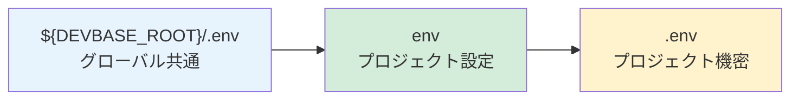

# プラグイン開発クイックスタート

devbase用のPluginを作成し、公開するまでの手順を解説します。

---

## 前提条件

- devbase 2.2.0 以上がインストール済み
- Git がインストール済み
- Docker / Docker Compose が利用可能

---

## 1. Pluginリポジトリの作成

### 1.1 Gitリポジトリの初期化

```bash
mkdir my-plugin && cd my-plugin
git init
```

### 1.2 plugin.yml の配置

リポジトリのルートに `plugin.yml` を作成します。
このファイルはPluginのメタ情報とプロジェクト一覧を定義します。

```yaml
plugins:
  - name: my-plugin
    version: 1.0.0
    description: "サンプルプラグイン"
    projects:
      - name: my-project
        description: "サンプルプロジェクト"
        path: projects/my-project
```

> **補足:** `plugin.yml` のフォーマット詳細は [plugin.yml リファレンス](plugin-yml-reference.md) を参照してください。

---

## 2. 最小構成のプロジェクト作成

### 2.1 ディレクトリ構造

最小限のPluginは以下の構造で構成されます。

```
my-plugin/
├── plugin.yml
└── projects/
    └── my-project/
        ├── compose.yml
        └── env
```

### 2.2 compose.yml の作成

`projects/my-project/compose.yml` を作成します。

```yaml
services:

  dev:
    image: my-project:latest
    build:
      context: ${DEVBASE_ROOT}/containers/general/
      dockerfile: Dockerfile
    volumes:
      - /var/run/docker.sock:/var/run/docker.sock
    env_file:
      - ${DEVBASE_ROOT}/.env
      - env
      - .env
    group_add: ["${DOCKER_GID}"]
    command: tail -f /dev/null
    working_dir: /work
    networks:
      - devbase_net

networks:
  devbase_net:
    external: true
```

**ポイント:**

- 標準コンテナを使う場合は、`build.context` には `${DEVBASE_ROOT}` ベースのパスを指定する（相対パス禁止）。Docker Hub などの公開イメージを利用する場合は `image:` のみを指定し `build:` を省略でき、独自の `Dockerfile` を `projects/<project>/` 配下に置いて `context: .` で参照することも可能
- `env_file` は3段階の環境変数ファイルを読み込む
- `devbase_net` はdevbaseが管理する共有ネットワーク

> **補足:** compose.yml の記述ルール詳細は [compose.yml ガイドライン](compose-yml-guidelines.md) を参照してください。

### 2.3 env ファイルの作成

`projects/my-project/env` を作成します。このファイルはGit管理対象です。

```bash
GIT_USER=your-github-user
GIT_REPO=my-repo
WORK_DIR=/work/$GIT_REPO
CONTAINER_SCALE=1
# GitLab等GitHub以外のホストを使う場合:
# GIT_HOST=gitlab.com
```

| 変数 | 説明 |
|------|------|
| `GIT_USER` | Gitホストのユーザー名またはOrganization名 |
| `GIT_REPO` | リポジトリ名 |
| `GIT_HOST` | Gitホスト名（デフォルト: `github.com`）。GitLabの場合は `gitlab.com` を指定 |
| `WORK_DIR` | コンテナ内の作業ディレクトリ |
| `CONTAINER_SCALE` | 起動するコンテナ数（デフォルト: 2） |

### 2.4 .env ファイル（任意）

プロジェクト固有の機密情報は `projects/my-project/.env` に配置します。
このファイルは `.gitignore` に含まれるため、Git管理対象外です。

```bash
MY_SECRET_API_KEY=sk-xxxxxxxxxxxx
```

---

## 3. ローカルでの開発・テスト

### 3.1 リンクインストール

開発中のPluginは `--link` オプションでシンボリックリンクとしてインストールできます。
ローカルでの変更が即座に反映されるため、開発サイクルが高速化します。

```bash
devbase plugin install /path/to/my-plugin:my-plugin --link
```

### 3.2 環境の初期化と起動

```bash
cd projects/my-project
devbase env init
devbase up
```

### 3.3 動作確認

```bash
# コンテナにログイン
devbase login

# コンテナの状態確認
devbase ps
```

### 3.4 開発中のトラブルシューティング

| 症状 | 確認事項 |
|------|----------|
| compose.yml のパスが解決できない | `${DEVBASE_ROOT}` ベースになっているか確認 |
| 環境変数が読み込まれない | `env_file` の指定順序と `.env` ファイルの存在を確認 |
| ネットワーク接続エラー | `devbase_net` が作成済みか確認（`docker network ls`） |
| ボリュームが見つからない | 外部ボリュームの場合は事前に作成が必要 |

---

## 4. 公開

### 4.1 GitHubリポジトリへのpush

```bash
cd /path/to/my-plugin
git add .
git commit -m "Initial plugin release"
git remote add origin https://github.com/your-user/my-plugin.git
git push -u origin main
```

### 4.2 レジストリへの登録

他のユーザーがインストールできるよう、レジストリに登録します。

```bash
devbase plugin repo add your-user/my-plugin
```

### 4.3 インストール確認

正しく公開されたか確認するため、名前指定でインストールします。

```bash
devbase plugin install my-plugin
```

---

## 5. ベストプラクティス

### 5.1 パスの記述

compose.yml 内のすべてのパスは `${DEVBASE_ROOT}` ベースで記述してください。
プロジェクトディレクトリは `projects/` 配下にシンボリックリンクとして配置されるため、
相対パスを使うとリンク元とリンク先でパス解決が異なり、予期しないエラーが発生します。

```yaml
# OK
context: ${DEVBASE_ROOT}/containers/general/

# NG（シンボリックリンク経由で解決できない場合がある）
context: ../../containers/general/
```

### 5.2 env_file の読み込み順序

env_file は上から順に読み込まれ、**後の指定が前の指定を上書き**します。
この順序を活用して、環境変数を適切に階層化してください。



### 5.3 ボリューム設計

| 用途 | ボリューム名パターン | 共有範囲 |
|------|---------------------|----------|
| ホームディレクトリ | `devbase_home_ubuntu` | 全コンテナ共有 |
| 作業ディレクトリ | `${COMPOSE_PROJECT_NAME}_work_${CONTAINER_INDEX:-1}` | コンテナ専用 |

- ホームディレクトリボリュームはシェル設定やSSH鍵など、コンテナ横断で共有したい設定の永続化に使用
- 作業ディレクトリボリュームはプロジェクトごと・コンテナインデックスごとに独立

### 5.4 コンテナイメージの選択

プロジェクトの要件に応じて適切なベースイメージを選択してください。

| イメージ | ベース | 主要ツール | 推奨用途 |
|---------|--------|-----------|---------|
| `base` | Ubuntu Noble | Docker CLI、Python 3 | 軽量な開発環境 |
| `general` | base | AWS CLI、gcloud、Terraform、Node.js 20、AI CLI | 汎用開発 |
| `go` | base | Go開発環境 | Go言語プロジェクト |
| `php` | general | PHP 8.3、Composer | PHP 8.3 系プロジェクト |
| `php85` | general | PHP 8.5、Composer | PHP 8.5 系プロジェクト |
| `latex` | general | LaTeX | 文書・論文作成 |
| `lfm` | general | Rust、gfortran、MeCab | 数値計算・自然言語処理 |
| `snapshot` | Ubuntu Noble | zstd | スナップショット専用 |

### 5.5 Git管理のガイドライン

```
# Git管理対象
plugin.yml
projects/*/compose.yml
projects/*/env

# Git管理対象外（.gitignoreに追加）
projects/*/.env
projects/*/.docker-compose.scale.yml
```

---

## 次のステップ

- [plugin.yml リファレンス](plugin-yml-reference.md) -- 全フィールドの詳細仕様
- [compose.yml ガイドライン](compose-yml-guidelines.md) -- compose.yml の記述ルールとテンプレート
