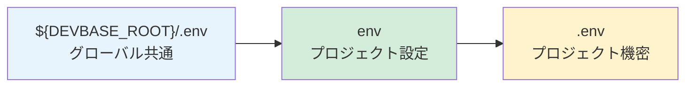

# プラグイン開発クイックスタート

devbase用のPluginを作成し、公開するまでの手順を解説します。

---

## 前提条件

- devbase 3.0.0 以上がインストール済み
- Git がインストール済み
- Docker / Docker Compose が利用可能

---

## 1. Pluginリポジトリの作成

### 1.1 Gitリポジトリの初期化

```bash
mkdir my-plugin && cd my-plugin
git init
```

### 1.2 plugin.yml の配置

リポジトリのルート（Plugin ディレクトリのルート）に `plugin.yml` を作成します。
このファイルは Plugin のメタ情報を定義します。

```yaml
name: my-plugin
version: "1.0.0"
description: "サンプルプラグイン"
requires:
  devbase: ">=3.0.0"
priority: 0
```

**ポイント:**

- プロジェクトは `projects/` 配下のディレクトリから自動的に検出されます。`plugin.yml` に一覧を書く必要はありません。
- `requires.devbase` には **この Plugin が動作する devbase 本体の最低バージョン**を書きます。`project.yml` 形式のプロジェクト定義は devbase 3.0.0 以降でしか読めないため、`project.yml` を持つ Plugin（= 本手順で作るもの）は必ず `">=3.0.0"` を指定してください。

> **補足:** `plugin.yml` のフォーマット詳細は [plugin.yml リファレンス](plugin-yml-reference.md) を参照してください。

---

## 2. 最小構成のプロジェクト作成

### 2.1 ディレクトリ構造

最小限のPluginは以下の構造で構成されます。

```
my-plugin/
├── plugin.yml
└── projects/
    └── my-project/
        ├── compose.yml
        ├── project.yml
        └── env          # 中身は任意だが、ファイルは必須
```

### 2.2 compose.yml の作成

`projects/my-project/compose.yml` を作成します。

```yaml
services:

  dev:
    image: my-project:latest
    build:
      context: ${DEVBASE_ROOT}/containers/general/
      dockerfile: Dockerfile
    volumes:
      - /var/run/docker.sock:/var/run/docker.sock
    env_file:
      - ${DEVBASE_ROOT}/.env
      - env
      - .env
    group_add: ["${DOCKER_GID}"]
    command: tail -f /dev/null
    working_dir: /work
    networks:
      - devbase_net

networks:
  devbase_net:
    external: true
```

**ポイント:**

- 標準コンテナを使う場合は、`build.context` には `${DEVBASE_ROOT}` ベースのパスを指定する（相対パス禁止）。Docker Hub などの公開イメージを利用する場合は `image:` のみを指定し `build:` を省略できる。独自の `Dockerfile` を使う場合は `${DEVBASE_ROOT}/plugins/<plugin>/...` 配下に配置する（`projects/` 直下はシンボリックリンクのため `context: .` は不可。詳細は [compose.yml ガイドライン §4.3](compose-yml-guidelines.md)）
- `env_file` は3段階の環境変数ファイルを読み込む
- `devbase_net` はdevbaseが管理する共有ネットワーク

> **補足:** compose.yml の記述ルール詳細は [compose.yml ガイドライン](compose-yml-guidelines.md) を参照してください。

### 2.3 project.yml の作成

`projects/my-project/project.yml` を作成します。このファイルはGit管理対象で、**プロジェクト設定の正**です。

```yaml
version: 1
scale: 1
repos:
  - owner: your-github-user
    repo: my-repo
```

複数のリポジトリを 1 つのコンテナへチェックアウトできます。

```yaml
version: 1
scale: 1
defaults:
  owner: your-github-user
repos:
  - repo: my-app          # 先頭が primary（ログイン直後の作業ディレクトリ）
  - repo: my-app-docs
  - repo: my-app-infra
    host: gitlab.com      # リポジトリごとに Git ホストを変えられる
    owner: another-org
    dir: infra            # /work 配下の clone 先名（既定: repo 名）
    branch: develop       # clone 後にチェックアウトするブランチ
    init: false           # 起動のたびの ./init.sh 実行を無効化する
```

主なキーは以下のとおりです。全項目は [project.yml リファレンス](../user/project-yml.md) を参照してください。

| キー | 説明 |
|------|------|
| `version` | スキーマ版。現在は `1` |
| `repos[].owner` / `repos[].repo` | Git ホストのユーザー名（Organization 名）とリポジトリ名 |
| `repos[].host` | Git ホスト名（既定: `github.com`）。GitLab なら `gitlab.com` |
| `repos[].dir` / `branch` / `init` / `primary` | clone 先ディレクトリ名 / チェックアウトするブランチ（clone 直後のみ） / `init.sh` の実行有無（起動のたびに実行。冪等に書くこと） / 既定の作業リポジトリ |
| `scale` | 起動するコンテナ数（既定: 2） |
| `open_editor` | `devbase up` 後に VS Code を自動で開くか |

### 2.3.1 env ファイル（ファイルは必須・中身は任意）

`projects/my-project/env` には、**コンテナへ渡す環境変数**だけを書きます（`ENABLE_SSH` など）。devbase 自身の設定は `project.yml` にあります。

```bash
ENABLE_SSH=true
```

2.2 の `compose.yml` が `env_file: - env` で参照するため、**ファイルは必ず作成してください**（実在しないと `devbase up` が compose の起動時に失敗します）。渡したい環境変数が無ければ空ファイルで構いません。

```bash
touch projects/my-project/env
```

### 2.4 .env ファイル（任意）

プロジェクト固有の機密情報は `projects/my-project/.env` に配置します。
このファイルは `.gitignore` に含まれるため、Git管理対象外です。

```bash
MY_SECRET_API_KEY=sk-xxxxxxxxxxxx
```

### 2.5 ライフサイクルフック（任意）

プロジェクトディレクトリ直下に以下の実行可能ファイルを置くと、`devbase up` のライフサイクルに合わせて自動的に呼び出されます。どちらも実行できなくても問題ない場合は配置不要です。

| ファイル | 実行タイミング | 主な用途 |
|---------|---------------|---------|
| `pre-up` | `devbase up` 開始直後（`docker compose up` の前） | `build.context` 用ソースリポジトリの clone、設定ファイルの生成など、イメージビルド前に完了させたい準備 |
| `deploy` | コンテナ起動完了後、各スケールインスタンスごとに実行 | S3 からの `.env` 取得、コンテナ起動後に必要な外部リソースの初期化など |

#### フックへ渡る環境変数

フックは**ホスト側**で動くため、コンテナへ渡る `env` / `.env` は読み込まれません。フックが必要とする `project.yml` の値は、devbase が環境変数として明示的に渡します。

| 変数 | 内容 | `pre-up` | `deploy` |
|------|------|:---:|:---:|
| `DEVBASE_PRIMARY_DIR` | primary リポジトリの `/work` 配下ディレクトリ名（`repos[].dir`。未指定ならリポジトリ名） | ✓ | ✓ |
| `DEVBASE_PRIMARY_URL` | primary リポジトリの clone URL（`https://<host>/<owner>/<repo>.git`） | ✓ | ✓ |
| `DEVBASE_WORK_DIR` | コンテナ内の既定の作業ディレクトリ（`work_dir`。未指定なら `/work/$DEVBASE_PRIMARY_DIR`） | ✓ | ✓ |
| `DEVBASE_REPO_DIRS` | 全リポジトリのディレクトリ名を `project.yml` の宣言順に空白区切りで並べたもの | ✓ | ✓ |
| `DEVBASE_INSTANCE_INDEX` | 実行対象のインスタンス番号（1 始まり）。`pre-up` はインスタンスごとに実行されないため渡りません | -- | ✓ |

primary は `repos` の先頭（または `primary: true` を付けた 1 件）で、常にちょうど 1 件です。primary 以外も含めて全リポジトリを回したい場合は `DEVBASE_REPO_DIRS` を使います。

```bash
for dir in $DEVBASE_REPO_DIRS; do
    echo "populate /work/$dir"
done
```

> **Note:** これらは**子プロセスにだけ**渡ります。フック内で `export` しても、後続の `docker compose up` や別プロジェクトの実行へは伝播しません。

#### `pre-up` の例

```bash
#!/bin/bash
# projects/my-project/pre-up
set -e

# build context に使うリポジトリが無ければ clone
# (clone 先も URL も devbase が project.yml から渡してくれる)
if [ ! -d "./repo" ]; then
    git clone "$DEVBASE_PRIMARY_URL" repo
fi

echo "コンテナ内の作業ディレクトリ: $DEVBASE_WORK_DIR"   # 例: /work/my-repo
```

> **Note:** どちらのフックも `bash` で実行されます。`chmod +x` で実行可能ビットを立てておいてください。`pre-up` が非ゼロ終了すると `devbase up` は中断します。`deploy` は失敗してもデプロイは続行されます。

> **応用:** 外部リポジトリを共有 work ボリュームへ取り込み、app / nginx / db など複数コンテナで動かすプロジェクトでは、`pre-up` で clone/pull と work ボリュームへの populate を行い、2 回目以降はコンテナ側を上書きしないよう冪等にスキップするのが定石です。詳細は [repo 連携プロジェクトと pre-up populate パターン](repo-backed-projects.md) を参照してください。

---

## 3. ローカルでの開発・テスト

### 3.1 リンクインストール

開発中のPluginは `--link` オプションでシンボリックリンクとしてインストールできます。
ローカルでの変更が即座に反映されるため、開発サイクルが高速化します。

```bash
devbase plugin install /path/to/my-plugin:my-plugin --link
```

### 3.2 環境の初期化と起動

```bash
cd projects/my-project
devbase env init
devbase up
```

### 3.3 動作確認

```bash
# コンテナにログイン
devbase login

# コンテナの状態確認
devbase ps
```

### 3.4 開発中のトラブルシューティング

| 症状 | 確認事項 |
|------|----------|
| compose.yml のパスが解決できない | `${DEVBASE_ROOT}` ベースになっているか確認 |
| 環境変数が読み込まれない | `env_file` の指定順序と `.env` ファイルの存在を確認 |
| ネットワーク接続エラー | `devbase_net` が作成済みか確認（`docker network ls`） |
| ボリュームが見つからない | 外部ボリュームの場合は事前に作成が必要 |

---

## 4. 公開

### 4.1 GitHubリポジトリへのpush

```bash
cd /path/to/my-plugin
git add .
git commit -m "Initial plugin release"
git remote add origin https://github.com/your-user/my-plugin.git
git push -u origin main
```

### 4.2 レジストリへの登録

他のユーザーがインストールできるよう、レジストリに登録します。

```bash
devbase plugin repo add your-user/my-plugin
```

### 4.3 インストール確認

正しく公開されたか確認するため、名前指定でインストールします。

```bash
devbase plugin install my-plugin
```

---

## 5. ベストプラクティス

### 5.1 パスの記述

compose.yml 内のすべてのパスは `${DEVBASE_ROOT}` ベースで記述してください。
プロジェクトディレクトリは `projects/` 配下にシンボリックリンクとして配置されるため、
相対パスを使うとリンク元とリンク先でパス解決が異なり、予期しないエラーが発生します。

```yaml
# OK
context: ${DEVBASE_ROOT}/containers/general/

# NG（シンボリックリンク経由で解決できない場合がある）
context: ../../containers/general/
```

### 5.2 env_file の読み込み順序

env_file は上から順に読み込まれ、**後の指定が前の指定を上書き**します。
この順序を活用して、環境変数を適切に階層化してください。


```mermaid
flowchart LR
    A["${DEVBASE_ROOT}/.env<br/>グローバル共通"] --> B["env<br/>プロジェクト設定"]
    B --> C[".env<br/>プロジェクト機密"]
    style A fill:#e8f4fd
    style B fill:#d4edda
    style C fill:#fff3cd
```

### 5.3 ボリューム設計

| 用途 | ボリューム名パターン | マウント先 | 共有範囲 |
|------|---------------------|-----------|----------|
| 共通 AI 資産・共有ファイル | `devbase_home_ubuntu` | `/persistent/ai` | 全コンテナ共有 |
| 認証・会話ログ | `devbase_home_<group>` | `/persistent/group` | 同じアカウントグループ |
| 作業ディレクトリ | `${COMPOSE_PROJECT_NAME}_work_${CONTAINER_INDEX:-1}` | `/work` | コンテナ専用 |

- `devbase_home_ubuntu`（`/persistent/ai`）は SSH 鍵・共有ファイル・`~/.claude/plugins` など、契約に紐づかずコンテナ横断で共有したい資産の永続化に使用（entrypoint が symlink。旧 `/home/ubuntu` 直接マウントは廃止）
- `devbase_home_<group>`（`/persistent/group`）は認証情報と会話ログ。`<group>` は `DEVBASE_ACCOUNT_GROUP`（未設定なら `default`）で決まり、devbase が生成 compose へ自動注入する
- 作業ディレクトリボリュームはプロジェクトごと・コンテナインデックスごとに独立

### 5.4 コンテナイメージの選択

プロジェクトの要件に応じて適切なベースイメージを選択してください。

| イメージ | ベース | 主要ツール | 推奨用途 |
|---------|--------|-----------|---------|
| `base` | Ubuntu 26.04 | Docker CLI、Python 3 | 軽量な開発環境 |
| `general` | base | AWS CLI、gcloud、Terraform、Node.js 20、AI CLI | 汎用開発 |
| `go` | base | Go開発環境 | Go言語プロジェクト |
| `php` | general | PHP 8.5、Composer | PHP 8.5 系プロジェクト |
| `php85` | general | PHP 8.5、Composer | PHP 8.5 系プロジェクト |
| `latex` | general | LaTeX | 文書・論文作成 |
| `lfm` | general | Rust、gfortran、MeCab | 数値計算・自然言語処理 |
| `snapshot` | Ubuntu 26.04 | zstd | スナップショット専用 |

### 5.5 Git管理のガイドライン

```
# Git管理対象
plugin.yml
projects/*/compose.yml
projects/*/env

# Git管理対象外（.gitignoreに追加）
projects/*/.env
projects/*/.docker-compose.scale.yml
```

---

## 次のステップ

- [plugin.yml リファレンス](plugin-yml-reference.md) -- 全フィールドの詳細仕様
- [compose.yml ガイドライン](compose-yml-guidelines.md) -- compose.yml の記述ルールとテンプレート
