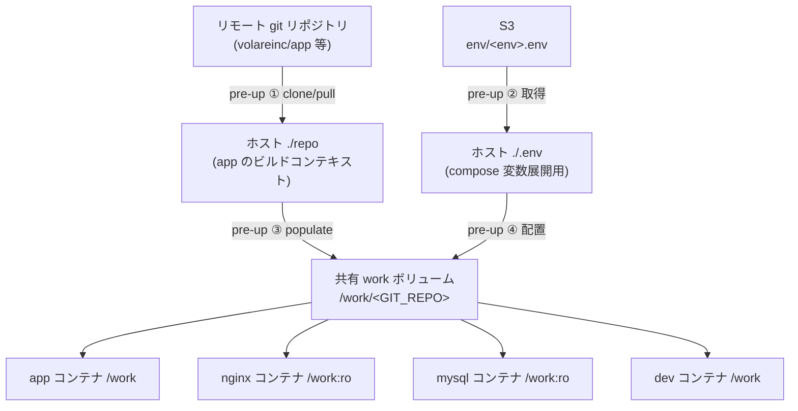

# repo 連携プロジェクトと `pre-up` populate パターン

外部リポジトリ（アプリ本体）を丸ごと取り込み、複数コンテナ（app / nginx / db 等）で共有して動かすタイプのプロジェクト向けのガイドです。`pre-up` ライフサイクルフックで **ホスト側リポジトリの clone/pull** と **共有 work ボリュームへの populate** を行い、2 回目以降の `devbase up` では populate 済みを検出して同期をスキップする冪等パターンを解説します。

リファレンス実装は `projects/carmo-system-console`（Laravel Sail ベース）です。

> **前提:** ライフサイクルフック自体の基本は [プラグイン開発クイックスタート](quickstart.md#25-ライフサイクルフック任意) を、共有ボリュームや `CONTAINER_SCALE` の一般論は [compose.yml ガイドライン](compose-yml-guidelines.md) と [コンテナ操作ガイド](../user/container-operations.md#並行開発) を参照してください。本書はそれらを組み合わせた「repo 連携」パターンに絞って説明します。

---

## 1. なぜこのパターンが必要か

`devbase-general` / `devbase-php` のような単一 dev コンテナのプロジェクトでは、各コンテナが専用の `/work` ボリュームを持ち、ソースはコンテナ内で `git clone` すれば十分です。

一方で、アプリ本体のリポジトリに付属する `docker-compose.dev.yml` 相当（app / nginx / mysql / redis …）を devbase 上で再現したい場合、次の要件が生じます。

- **複数コンテナが同一のソースツリーを共有**する必要がある（app が書いた成果物を nginx が配信する等）。
- app サービスは **リポジトリ内の `Dockerfile` をビルドコンテキスト**として使うため、ホスト側にソースの実体が必要。
- コンテナ内 `git clone` に頼ると、複数コンテナの起動順で **clone レース**が起きる。

これを解決するのが「ホスト `repo/` を用意し、それを共有 work ボリュームへ populate してから全コンテナを起動する」パターンです。populate を `pre-up`（`docker compose up` の前）に寄せることで、app / nginx / mysql が立ち上がる前にソースを確定できます。

---

## 2. 全体構成



| 要素 | 実体 | 役割 |
|------|------|------|
| ホスト `./repo` | `git clone` した作業コピー | app イメージのビルドコンテキスト兼、work ボリュームの populate 元 |
| ホスト `./.env` | S3 から取得 | `docker compose` の変数展開（`${DB_DATABASE}` 等）に使用 |
| 共有 work ボリューム | `external: true` の named volume | 全コンテナが `/work` にマウントする実行時ソース |

`compose.yml` では work ボリュームを **external** として宣言し、インスタンスごとに名前を切り替えます。

```yaml
services:
  app:
    build:
      context: ./repo          # ← ホスト repo/ をビルドコンテキストに
      dockerfile: docker/Dockerfile
    volumes:
      - work:/work             # ← 共有 work ボリューム
  nginx:
    volumes:
      - work:/work:ro
  # ...
volumes:
  work:
    external: true
    name: ${DEVBASE_WORK_VOLUME:-devbase_work_${DEVBASE_INSTANCE_INDEX:-1}}
```

> **Note:** `pre-up` は子プロセスのため `export DEVBASE_WORK_VOLUME` しても後続の `docker compose up` へは伝播しません。`compose.yml` 側は `${DEVBASE_WORK_VOLUME:-devbase_work_${DEVBASE_INSTANCE_INDEX:-1}}` のフォールバック式で解決し、加えて `pre-up` が同じ値を `.env` に書き出すことで整合を取ります。

---

## 3. `pre-up` の 4 つの責務

`pre-up` は毎回の `devbase up` 前に次を行います。

| # | 処理 | 内容 |
|---|------|------|
| ① | `repo/` の clone / pull | 無ければ `git clone`、あれば `git pull --ff-only`（app ビルドコンテキストの最新化） |
| ② | `.env` の取得 | S3 等から取得してホスト `./.env` に配置（`docker compose` の変数展開前に必要） |
| ③ | work ボリュームへ populate | `repo/` の内容を `/work/<GIT_REPO>` へコピー |
| ④ | `.env` を work ボリュームへ配置 | Laravel 等のランタイムが `/work/<GIT_REPO>/.env` を参照するため |

② を `deploy`（`up` 後フック）ではなく `pre-up` で行うのは、`compose.yml` の `MYSQL_DATABASE: ${DB_DATABASE:-...}` のような変数展開が `docker compose` パース時（＝ MySQL コンテナ初回起動前）に `.env` を要求するためです。`deploy` 段階では間に合わず、DB がデフォルト名で初期化されてしまいます。

---

## 4. 冪等性 — populate 済みならスキップ（重要）

**このパターンの肝は「初回だけ populate し、2 回目以降はコンテナ側に触れない」ことです。**

`pre-up` は work ボリューム上に `/work/<GIT_REPO>/.git` が存在するかどうかで populate 済みを判定し、済みの場合は ②③④ をスキップします。

| # | 処理 | 未populate（初回） | populate 済み（2回目以降） |
|---|------|:---:|:---:|
| ① | `repo/` の `git pull` | 実行 | **実行**（構成変更をビルドに追従） |
| ② | `.env` の S3 取得 | 実行 | スキップ |
| ③ | ソース populate | 実行 | スキップ |
| ④ | `.env` を volume へ配置 | 実行 | スキップ |

### なぜスキップするのか

populate 済みの work ボリュームを毎回ホスト `repo/` で上書き同期すると、次の破壊が起きます。

- **同期の除外リスト（`storage/` / `vendor/` / `node_modules/` / `.env` 等）に無いファイルが消える。** コンテナ内で生成した認証ファイルや作業ファイルが `devbase up` のたびに削除される。
- **コンテナ側で編集した `.env` が上書きされる。**

これを避けるため、実行時ソースと `.env` の供給は初回 populate 時に限定し、以降はコンテナ側を手動管理に委ねます。これはアプリ本体リポジトリが取る一般的な開発フローと同じ考え方です。多くのリポジトリでは、環境ファイルの取得やソースの用意は**ビルド時のセットアップスクリプト**が担い、日常の**起動（`docker compose up`）は環境ファイルやソースに触れません**。devbase の初回 populate がこのビルド時セットアップに相当し、2 回目以降の `up` は起動だけを行います。

一方で ①（`repo/` の pull）は常に実行します。これはホスト側のビルドコンテキストであり、`compose.yml` / `Dockerfile` / `docker/` 構成の変更を次回の app イメージ再ビルドへ反映するためです（アプリのソースコードそのものは work ボリューム側で管理）。

---

## 5. ソース・`.env` の更新運用

populate 済み以降、更新経路は次のように分かれます。

| 対象 | 場所 | 更新方法 |
|------|------|---------|
| ビルドコンテキスト | ホスト `./repo` | `pre-up` が毎回 `git pull`（自動） |
| 実行時ソース | work ボリューム `/work/<GIT_REPO>` | **コンテナ内で手動 `git pull`** |
| 実行時 `.env` | work ボリューム `/work/<GIT_REPO>/.env` | コンテナ内で手動編集 |

```bash
# 実行時ソースの更新（dev コンテナ内）
cd /work/<GIT_REPO>
git pull origin main
```

### クリーンに作り直す（再 populate）

`.env` やソースを S3 / `repo/` の内容からやり直したい場合は、work ボリュームを削除して次回 `up` で populate を再実行させます。

```bash
devbase down
docker volume rm <project>_devbase_work_1   # インスタンス番号は環境に応じて
devbase up                                  # pre-up が ②③④ を再実行
```

> **Warning:** work ボリュームには実行時ソースと `.env`、コンテナ内生成物が含まれます。削除前に必要な変更をコミット / 退避してください。DB 等の `sail-*` ボリュームは別管理なので、work ボリュームだけを消してもデータは残ります。

---

## 6. 関連する環境変数

| 変数 | 既定 | 効果 |
|------|------|------|
| `DEVBASE_REPO_PULL` | `1` | `0` にすると ①（`repo/` の `git pull`）を抑止。オフラインや意図的にビルドコンテキストを固定したいとき |
| `DEVBASE_ENV_OVERWRITE` | `backup` | 未 populate 時の既存ホスト `.env` の扱い。`backup`（`.env.bak.<ts>` に退避して上書き）/ `skip`（既存があれば S3 取得しない）/ `force`（退避せず上書き） |
| `DEVBASE_WORK_VOLUME` | `devbase_work_<index>` | 共有 work ボリューム名の明示指定。未指定なら `DEVBASE_INSTANCE_INDEX` から解決 |
| `DEVBASE_INSTANCE_INDEX` | `1` | `devbase scale` 時にインスタンスごとの work ボリューム名を切り替えるためのインデックス（devbase 本体が付与） |

> **Note:** `.env` の環境選択（例: `s3://.../env/local.env` の `local` 部分）など、S3 パスやプロファイルはプロジェクト固有の変数（例: `CARMO_ENV`）で制御することがあります。プロジェクトの `pre-up` 冒頭コメントを参照してください。

---

## 7. チェックリスト（新規に repo 連携プロジェクトを作るとき）

- [ ] `env` に `GIT_USER` / `GIT_REPO` を定義した
- [ ] `compose.yml` で work ボリュームを `external: true` + `name: ${DEVBASE_WORK_VOLUME:-devbase_work_${DEVBASE_INSTANCE_INDEX:-1}}` で宣言した
- [ ] app サービスの `build.context` をホスト `./repo` にした
- [ ] `pre-up` で ①clone/pull → ②`.env`取得 → ③populate → ④`.env`配置 を実装した
- [ ] `pre-up` が `/work/<GIT_REPO>/.git` の有無で populate 済みを判定し、②③④ をスキップする
- [ ] populate 時の owner を `1000:1000`（コンテナ内ユーザー）に設定した
- [ ] `storage/` / `vendor/` / `node_modules/` 等、初回のみ生成され上書きしたくないパスの扱いを決めた
- [ ] README にソース・`.env` の更新運用（手動 pull / 再 populate）を記載した

---

## 参考

- リファレンス実装: `projects/carmo-system-console/pre-up` / `compose.yml` / `README.md`
- [プラグイン開発クイックスタート](quickstart.md) — ライフサイクルフックの基本
- [compose.yml ガイドライン](compose-yml-guidelines.md) — 共有ボリューム・スケール構成
- [コンテナ操作ガイド](../user/container-operations.md) — `/work` ボリュームの一般論
