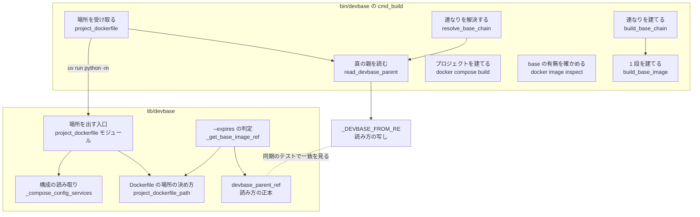
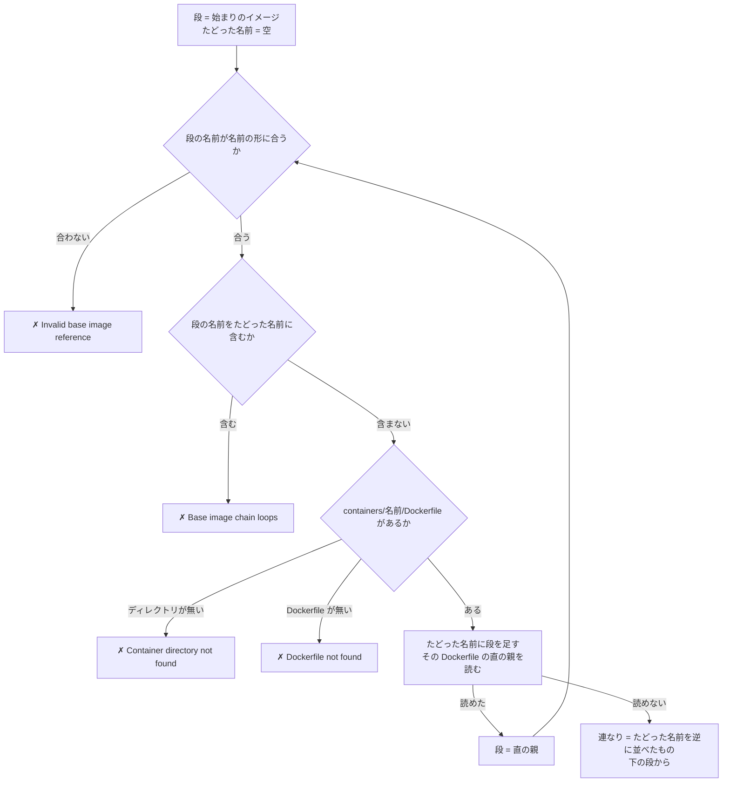
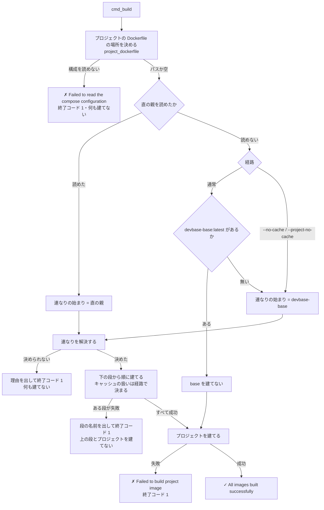
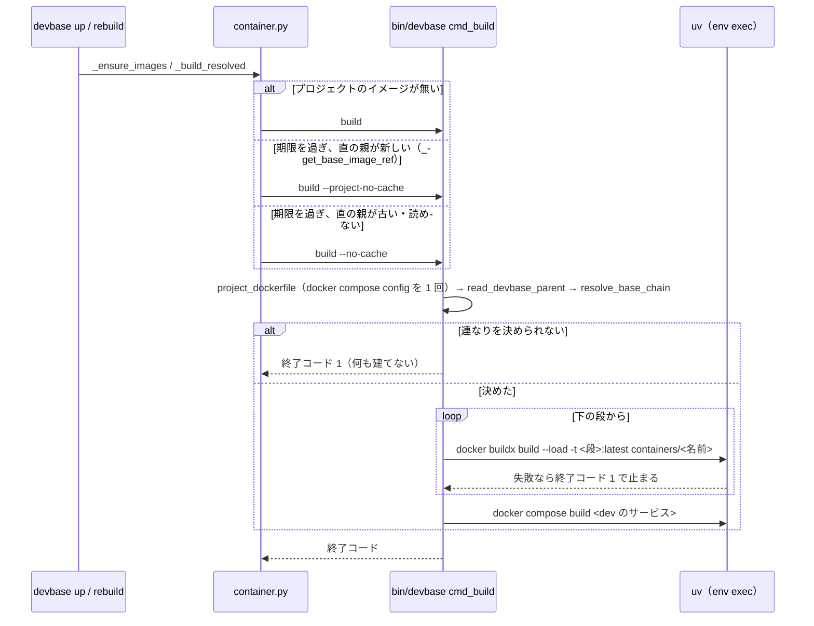

# 派生イメージの継承の連なりのビルド（直の親の読み方）

## 概要

プロジェクトの `devbase build` は、プロジェクトの Dockerfile が `FROM` に取る `devbase-*` から
`containers/<名前>/Dockerfile` の `FROM devbase-*` を順にたどり、継承の連なりを**下の段から**建ててから
プロジェクトのイメージを建てる。`FROM devbase-php:latest` のプロジェクトでは
`devbase-base` → `devbase-php` → プロジェクトの順に建つ。base を一度も建てていない端末でも、先に
`devbase build base` を打つ必要は無い。

Dockerfile から直の親イメージを読む規則（直の親の読み方）は 1 つの正規表現で決め、通常のビルド
（`bin/devbase`）と `--expires` の判定（`lib/devbase`）が同じ Dockerfile から同じ直の親を読む。

読む Dockerfile（プロジェクトの Dockerfile）は、`docker compose build` が建てる開発サービス
（`DEV_SERVICE_NAME`、既定 `dev`）の `build` から決める。compose の構成は `docker compose config` で読み、
通常のビルドと `--expires` の判定が同じ決め方（Dockerfile の場所の決め方）を使う。

利用者向けの説明は
[コンテナ操作ガイド](../user/container-operations.md) の「プロジェクトの Dockerfile で足す」の行にある。

## 用語

派生イメージ・単体ビルド・継承の連なり・直の親イメージ・直の親の読み方の定義は
[用語集: イメージの継承（`image-lineage`）](../glossary.md#イメージの継承image-lineage) にある。

## コンテキスト

イメージの継承（`image-lineage`）が上流、コマンドの入口（`cli`）が下流の順応者である。コマンドの入口は
Dockerfile の `FROM` を書かれたとおりに読み、連なりの形（何段か・どの名前か）を自分では決めない。

## 背景

以前の `devbase build` は、プロジェクトの Dockerfile の直の親だけを建て、その Dockerfile が継ぐ下の段を
たどらなかった。2 段の継承（プロジェクト → `devbase-php` → `devbase-base`）のプロジェクトは、base の無い
端末で `devbase-php` の段で止まった（#404）。また、通常のビルドは `FROM --platform=...`・小文字の `from`・
行頭の空白の行を読み落とし、`--expires` の判定は読む、という食い違いがあった。

主な判断:

| 判断 | 理由 |
| --- | --- |
| 正規表現の正本を Python（`lib/devbase/utils/dockerfile.py`）に置き、`bin/devbase` に同じ文字列を写して、値の同期と表の契約の 2 つのテストで縛る | Bash から Python を呼ぶと、偽の `uv` で外への呼び出しを受けるテストで連なりが決まらず、`devbase.cli` の機密の注入（OpenBao への認証）がビルドのたびに走る。ERE と Python の `re` に共通の部分だけで書くため、写しは同じ文字列になり同期のテストが文字列の比較で済む。名前の形（`_SINGLE_SEGMENT_NAME_RE`）と同じ形 |
| 連なりは最初の段を建てる前に終わりまで解決する | 途中の段が無い・循環するときに、何も建てずに止まれる。解決は Dockerfile を読むだけで数ミリ秒で終わる |
| 循環はたどった名前の記録で見つけ、段の数の上限を置かない | `containers/` の下は有限なので記録だけで必ず終わり、循環した名前の並びを出せる。上限は正当な連なりを誤って止めうる |
| 段の名前は `containers/` へ連結する前に名前の形（`is_single_segment_name`）で検証し、合わなければ止まる | `FROM devbase-../x` のような参照で `$DEVBASE_ROOT` の外の Dockerfile を読ませない。読み飛ばすと書き損じが黙って `devbase-base` の分岐へ流れる |
| 連なりの段は手元にあっても飛ばさず、経路のキャッシュの扱いで毎回建てる | `containers/<名前>` が変わっていなければ層はキャッシュから来る。有無で飛ばすと、`containers/base` を直した後も古い base の上に上の段が建つ |
| 1 段の連なりでは以前の出力の行をそのまま出す | 既存のテストと利用者の目が頼る行を変えない |
| プロジェクトの Dockerfile の場所は、`docker compose config` の開発サービスの `build` から、Python の 1 つの関数（`project_dockerfile_path`）で決める。通常のビルドは Python の入口を 1 回起動してパスを受ける | 構成の正しい読み（`build: ./dev` の文字列の形・変数の展開・上書きのファイル・`COMPOSE_FILE`）は compose 自身にしかできない。`compose.yml` を行の並びとして読むと、開発サービスより前の別のサービスの `build:` や文字列の形で、`--expires` の判定と別の Dockerfile を読んだ（#415） |
| 場所を出す入口は CLI のサブコマンドにせず `python -m devbase.commands.project_dockerfile` にする | help の一覧と前方一致の集合に値を増やさない |
| 開発サービス名は `bin/devbase` が `${DEV_SERVICE_NAME:-dev}` を入口へ渡す | `docker compose build` に渡す名前と、場所を決めるサービスの名前が常に同じになる |

## 対象範囲

- `bin/devbase` の `cmd_build` の 3 つの経路（通常・`--no-cache`・`--project-no-cache`）での連なりの解決と建て
- `lib/devbase/commands/container.py` の `--expires` の判定が直の親を読む規則
- 通常のビルドと `--expires` の判定が、compose の構成からプロジェクトの Dockerfile の場所を決める規則

含まない:

- 単体ビルド（`devbase build <image>`）。名前を挙げた 1 つのイメージだけを建て、連なりをたどらない
- `--expires` の鮮度の判定で、連なりの下の段の作成日を見ること。判定は直の親イメージの作成日だけで行う
- `COPY --from=devbase-*`・`ARG` で名前を組み立てる `FROM ${BASE}`・最初に `devbase-*` を指す `FROM` より後の `FROM`
- `build.dockerfile_inline`（Dockerfile を compose の中に書く形）の読み方。2 つの経路は同じパス
  （`<context>/Dockerfile`）を受ける
- `build.target`（多段の Dockerfile の段の指定）による直の親の選び分け。Dockerfile の中で最初に `devbase-*` を
  指す `FROM` を読む
- 開発サービス以外のサービスの Dockerfile が `devbase-*` を継ぐときに、その連なりを建てること

## 構成要素

| 要素 | 置き場所 | 責務 |
| --- | --- | --- |
| 直の親の読み方の正本 | `lib/devbase/utils/dockerfile.py` の `DEVBASE_FROM_PATTERN` | 正規表現の値 |
| 直の親を読む関数 | 同 `devbase_parent_ref(text)` | Dockerfile の本文から直の親イメージの参照を返す。副作用を持たない |
| Dockerfile の場所の決め方 | `lib/devbase/utils/dockerfile.py` の `project_dockerfile_path(dev_service)` | 開発サービスの定義から Dockerfile のパスを返す。`build` が無ければ `None`。ファイルを読まず、副作用を持たない |
| 構成の読み取り | `lib/devbase/commands/container.py` の `_compose_config_services` | `docker compose config --format json` を起動する唯一の関数。`show_errors=True` なら、0 以外のとき compose の標準エラーをそのまま書く。`resolve_env_files=False` なら `--no-env-resolution` を付け、サービスの `env_file` を読まない。このオプションを知らない Docker Compose（v2.35 より前）が未知のオプションとして退けたときは、外して 1 回だけ読み直す |
| `--expires` の判定 | 同 `_get_base_image_ref` | 開発サービスの Dockerfile の場所を `project_dockerfile_path` から受け、本文の読みを `devbase_parent_ref` に任せる。`_base_image_is_fresh` がその作成日を見る |
| 場所を出す入口 | `lib/devbase/commands/project_dockerfile.py`（`python -m` で起動する。CLI のサブコマンドではない） | 接続先と機密を載せてから構成を 1 回読み、開発サービスの Dockerfile のパスを標準出力へ 1 行で出す。`docker compose build` と同じくサービスの `env_file` を読まない（`--no-env-resolution`。実行時用の `.env` がまだ無くても建てられる） |
| 読み方の写し | `bin/devbase` のトップレベルの `_DEVBASE_FROM_RE`（`_SINGLE_SEGMENT_NAME_RE` の隣） | 正本と同じ文字列。`$'...'` でタブ文字を入れる |
| 直の親を読む | `cmd_build` の `read_devbase_parent` | Dockerfile を 1 行ずつ読み、最初に当たった行の参照を出す。当たらない・ファイルが無いときは 1（失敗ではない） |
| 連なりの解決 | `cmd_build` の `resolve_base_chain` | 直の親から `containers/<名前>/Dockerfile` をたどり、下の段からの並びを配列 `_BASE_CHAIN` に置く。決められないときは理由を 1 行出して 1 |
| 連なりの建て | `cmd_build` の `build_base_chain` | `_BASE_CHAIN` の段を下から `build_base_image` へ渡す。失敗した段で止まって 1 |
| 1 段の建て | `cmd_build` の `build_base_image` | `docker buildx build --load -t <段>:latest containers/<名前>` |
| プロジェクトの Dockerfile の場所を受け取る | `cmd_build` の `project_dockerfile` | `compose.yml` があれば場所を出す入口を 1 回起動してパスを受ける（開発サービスが `build` を持たなければ空）。無ければ `Dockerfile` |

継承の連なりはビルドのたびに Dockerfile から作り直し、保存しない。

## 仕様

### 常に成り立つ条件

| # | 条件 | 破れたときの扱い |
| --- | --- | --- |
| I1 | 同じ Dockerfile から、通常のビルドと `--expires` の判定は同じ直の親イメージの参照を読む | 契約の表のテストと同期のテストが落ちる |
| I2 | 段は下から建て、ある段を建てるのは、その下の段がすべて建った後だけである | ある段の建てが失敗したら、上の段とプロジェクトを建てずに終了コード 1 で止まる |
| I3 | 連なりは最初の段を建てる前に終わりまで解決する | 途中の段の `containers/<名前>/` か Dockerfile が無い・循環する・名前の形に合わないときは、どの段も建てずに理由を出して終了コード 1 |
| I4 | 同じ名前は連なりに 2 度現れない | 循環として I3 の扱い |
| I5 | 段の名前は、`containers/` の下へ連結する前に名前の形に合っている | I3 の扱い |
| I6 | 連なりのすべての段は、経路が決めた同じキャッシュの扱いで建つ | テストが落ちる |
| I7 | 1 段の連なりでは、建てるイメージ・順・出力の行が 2 段の対応の前と同じである | 既存のテストが落ちる |
| I8 | プロジェクトの Dockerfile が `devbase-*` を `FROM` に取らないとき、通常のビルドは `devbase-base:latest` があれば建てず、無ければ建てる | 既存のテストが落ちる |
| I9 | 同じ compose の構成と同じ開発サービス名から、通常のビルドと `--expires` の判定は同じプロジェクトの Dockerfile のパスを決める | 入力の表を両方の経路に通す契約のテストが落ちる |
| I10 | パスは開発サービス名のサービスの `build` だけから決まり、ほかのサービスの `build`・サービスの並び・`build` の書き方（文字列か辞書か）に左右されない | テストが落ちる |
| I11 | 開発サービスが構成に無い・`build` を持たないとき、プロジェクトの Dockerfile は無い。通常のビルドはどの Dockerfile も読まず I8 の分岐へ進む | テストが落ちる |
| I12 | compose の構成を読めないとき、通常のビルドはどの段の `docker buildx build` も `docker compose build` も起動せず、理由を出して終了コード 1 で止まる | テストが落ちる |
| I13 | 通常のビルド 1 回で `docker compose config` を起動するのは 1 回以下である（`compose.yml` が無ければ 0 回） | テストが落ちる |

### プロジェクトの Dockerfile の場所の決め方

compose の構成は `docker compose config --format json` の出力で、`build` はいつも辞書、`context` は変数を展開した
絶対パスで出る。`project_dockerfile_path` は開発サービスの定義を次のとおりに読む。

| 開発サービスの定義 | 返すパス |
| --- | --- |
| `build` が無い・空 / 開発サービスが無い | 無し（`None`） |
| `build` が文字列 `X` | `X/Dockerfile` |
| `build` が辞書で `context` だけ | `<context>/Dockerfile` |
| `build` が辞書で `dockerfile` だけ（相対） | `<dockerfile>`（`context` の既定 `.` からの相対） |
| `build` が辞書で両方（`dockerfile` が相対） | `<context>/<dockerfile>` |
| `dockerfile` が絶対パス | `<dockerfile>`（`context` を連結しない） |
| `dockerfile_inline` だけ | `<context>/Dockerfile` |

通常のビルドは場所を出す入口を次の形で起動する（`bin/devbase` だけが呼ぶ内部の約束）。

| 項目 | 内容 |
| --- | --- |
| 起動 | `uv run --project "$DEVBASE_ROOT" python -m devbase.commands.project_dockerfile --service <開発サービス名> [--context <名前>]`。`--context` は `devbase build --context` の値があるときだけ渡す。カレントディレクトリはプロジェクト |
| 前処理 | 接続先を決め（`--context` とプロジェクトの設定）、今のプロジェクトの機密を載せる（読めなくても警告で続ける）。構成の読み取りは daemon に繋がない |
| 成功 | 終了コード 0。標準出力に 1 行だけ（パス。プロジェクトの Dockerfile が無ければ空の行） |
| 構成を読めない | 終了コード 1。compose の標準エラー（JSON として読めなければ `Unable to read the compose configuration as JSON`）を標準エラーへ書き、標準出力には何も書かない |
| 引数の誤り | 終了コード 2 |

`compose.yml` が無いときは入口を起動せず、カレントディレクトリの `Dockerfile` を読む。

### 直の親の読み方

| 項目 | 内容 |
| --- | --- |
| 入力 | Dockerfile の本文（行の並び） |
| 出力 | 最初に読み方に当たった行の `devbase-<名前>[:<タグ>]`。タグが無ければ `:latest` を補う。当たる行が無ければ「無し」（Python は `None`、Bash は終了コード 1） |
| 正規表現 | `^[ TAB]*[Ff][Rr][Oo][Mm][ TAB]+(--platform=[^ TAB]+[ TAB]+)?(devbase-[^ TAB]+)`（`TAB` はタブ文字）。2 番目の組がイメージの参照 |
| 行の扱い | 行末の CR を除いてから当てる。`FROM` の語だけ大文字小文字を区別しない。イメージの名前は小文字の `devbase-` だけを読む |

正規表現は POSIX の ERE と Python の `re` のどちらでも同じ意味になる部分だけで書く。`\s`・`(?:...)`・
`[[:space:]]`・`re.IGNORECASE` を使わない。Bash は値を変数に持ち `[[ =~ ]]` に変数で渡し、`LC_ALL=C` で
比べる（bash 3.2 の引用の扱い。`is_single_segment_name` と同じ）。

| Dockerfile の行 | 読むイメージ |
| --- | --- |
| `FROM devbase-php:latest` | `devbase-php:latest` |
| `FROM devbase-php` | `devbase-php:latest` |
| `FROM --platform=linux/amd64 devbase-base:latest` | `devbase-base:latest` |
| `from devbase-base:latest` | `devbase-base:latest` |
| `FROM devbase-base:latest AS builder` | `devbase-base:latest` |
| 先頭に空白のある `  FROM devbase-base:latest` | `devbase-base:latest` |
| `FROM devbase-php` の後に CR（CRLF の改行） | `devbase-php:latest` |
| `FROM ubuntu:26.04 AS x` の後に `FROM devbase-base:latest` | `devbase-base:latest`（最初の `FROM` ではなく、最初に `devbase-*` を指す `FROM`） |
| `# FROM devbase-base:latest` | 読まない |
| `COPY --from=devbase-base:latest /a /b` | 読まない |
| `FROM DEVBASE-base:latest` | 読まない |
| `FROM ubuntu:26.04` だけの Dockerfile | 読まない（`devbase-base` の有無を確かめる分岐へ進む） |

### 連なりの解決

`resolve_base_chain` は始まりの参照から次を繰り返す。参照のダイジェスト（`@` 以降）とタグ（`:` 以降）を除き、
`devbase-` を外した残りを段の名前とする。

結果は配列 `_BASE_CHAIN` に置き、成否は終了コードで返す。`bin/devbase` は `set -e` で動くため、コマンド置換で
呼ぶと `✗` の行が値として飲み込まれて利用者に出ない。呼び出し側は `if ! resolve_base_chain ...; then exit 1; fi`
で受ける。

段は `devbase-<名前>:latest` として建てる。直の親が `devbase-php:8.3` のような `latest` でないタグでも、建てるのは
`devbase-php:latest` で、`--expires` の判定は `devbase-php:8.3` の作成日を見る（今の Dockerfile に例は無い）。

### `cmd_build` の流れ

経路は引数で決まる。`--project-no-cache` があれば `--project-no-cache`、なければ引数に `--no-cache` を含めば
`--no-cache`、どちらも無ければ通常である。

| 経路 | 連なりの段 | プロジェクト |
| --- | --- | --- |
| 通常 | キャッシュあり | キャッシュあり |
| `--no-cache` | `--no-cache` | `--no-cache` |
| `--project-no-cache` | 引数から `--no-cache` を除いて建てる（キャッシュあり） | `--no-cache` |

### 呼び出し元

`devbase build`・`devbase rebuild`・`devbase up` の自動の準備は、Python（`_run_build`）が `bin/devbase build` を
起動して `cmd_build` へ入る。

### 出力の行

N は連なりの段の数 + 1（プロジェクト）である。

| 場合 | 連なりが 1 段（N = 2） | 連なりが 2 段以上（N ≥ 3） |
| --- | --- | --- |
| 通常・直の親あり | `[1/2] Project uses <段>, building base image...` | `Project uses <直の親>, building its base images: <下の段> -> ... -> <直の親>` の後に、段ごとに `[k/N] Building <段>...` |
| 通常・直の親なし・base あり | `[1/2] devbase-base already exists (use --no-cache to rebuild)` | — |
| 通常・直の親なし・base 無し / `--no-cache` | `[1/2] Building <段>...` | 段ごとに `[k/N] Building <段>...` |
| `--project-no-cache` | `[1/2] Building <段> (using cache)...` | 段ごとに `[k/N] Building <段> (using cache)...` |
| 最後の行 | `[N/N] Building project image...`（`--project-no-cache` は `[N/N] Building project image without cache...`） | 同左 |

`build_base_image` は段ごとに `Building <段>:latest...`・`✓ <段> built successfully`・`✗ Failed to build <段>` を出す。
成功すれば最後に `✓ All images built successfully`、プロジェクトの建てが失敗すれば `✗ Failed to build project image`。

## エラー処理

compose の構成を読めないとき（必須の環境変数が無い・YAML が壊れている など）は、compose の理由を標準エラーへ、
`✗ Failed to read the compose configuration; no image was built` を標準出力へ出し、どのイメージも建てずに
終了コード 1 で止まる。続く `docker compose build` も同じ構成を読んで失敗するため、先に止まる。

連なりを決められないときは、次の行を標準出力に出し、どのイメージも建てずに終了コード 1 で止まる。

| 場合 | 行 |
| --- | --- |
| 段のディレクトリが無い | `✗ Container directory not found: <DEVBASE_ROOT>/containers/<名前>` |
| ディレクトリはあるが Dockerfile が無い | `✗ Dockerfile not found: <DEVBASE_ROOT>/containers/<名前>/Dockerfile` |
| 循環する | `✗ Base image chain loops: devbase-a -> devbase-b -> devbase-a` |
| 段の名前が名前の形に合わない | `✗ Invalid base image reference in <参照を読んだ Dockerfile のパス>: <参照>` |

段の建てが失敗したときは `✗ Failed to build <段>` を出し、上の段とプロジェクトを建てずに終了コード 1 で止まる。
`--expires` の判定で直の親が読めない・作成日が読めないときは、base も含めて `--no-cache` で建てる。

## セキュリティ

段の名前は `containers/` へ連結する前に `is_single_segment_name` で検証する。`FROM devbase-../x` のような参照は
`$DEVBASE_ROOT` の外を読まずに止まる。

## 運用

- 2 段の継承のプロジェクトでも、base の無い端末で先に `devbase build base` を打つ必要は無い
- `containers/base` を直した後の `devbase build` は、base から上の段を順に建て直す（変わっていない段はキャッシュから来る）
- 直の親の読み方を変えるときは、`lib/devbase/utils/dockerfile.py` の `DEVBASE_FROM_PATTERN` と `bin/devbase` の
  `_DEVBASE_FROM_RE` を同じ文字列に変える
- base の無い端末での実機の順（base → `devbase-php` → プロジェクト）は自動テストでは確かめておらず、
  リリース後テストで確かめる

## テスト観点

`tests/cli/test_build_base_chain.py`（`bin/devbase` を実プロセスで起動し、外への呼び出しを偽の `uv` で受ける。
Docker を起動しない）:

- I2: プロジェクトが `FROM devbase-php:latest`、`containers/php` が `FROM devbase-base:latest` のとき、
  `devbase-base:latest` → `devbase-php:latest` → `docker compose build dev` の順に建ち、終了コード 0 であること。
  `docker image inspect` が base は無いと答える状態でも同じであること
- I6: `--no-cache` で 2 つの段とプロジェクトのすべてに `--no-cache` が付き、`--project-no-cache --no-cache` で
  段には付かずプロジェクトには付くこと
- I2: `devbase-base:latest` の建てが失敗すると、`devbase-php` とプロジェクトを建てず、終了コードが 0 でなく、
  出力に `devbase-base` が出ること
- I3: 1 段目・2 段目の `containers/<名前>/` が無いとき、Dockerfile だけが無いときに、何も建てず、見つからなかった
  パスが出ること
- I3・I4: 2 つの段が互いを `FROM` に取るとき、自身を `FROM` に取るときに、何も建てず、循環した名前が出て、時間内に終わること
- I5: 直の親が `devbase-../x` のとき、`containers/` の外を読まずに止まり、参照が出ること
- I8: `FROM ubuntu:26.04` のプロジェクトで、base があれば建てず、無ければ `devbase-base:latest` を建ててから
  プロジェクトを建てること
- I7: 1 段の連なりで以前の行がそのまま出ること

`tests/cli/test_devbase_from_contract.py`:

- I1: 「直の親の読み方」の表の全行を、通常のビルドの経路（建つ `-t` のイメージ、または `devbase-base` の有無の
  分岐へ進むこと）と `_get_base_image_ref` の両方に通し、表の答えと一致すること
- I1: `bin/devbase` から抜き出した `_DEVBASE_FROM_RE` の値が `DEVBASE_FROM_PATTERN` と同じ文字列であること

`tests/cli/test_build_project_dockerfile.py`（場所を出す入口を本物で動かし、偽の `docker` が構成の JSON を返す）:

- I10: 開発サービスより前に `FROM devbase-other` の別のサービスがあっても、開発サービスの `devbase-base` を建て、
  `devbase-other` を建てず名前も出さないこと。`build: ./dev` の文字列の形で `./dev/Dockerfile` を読むこと。
  `DEV_SERVICE_NAME` の名前のサービスから決めること
- I11: 開発サービスが `image:` だけのとき、カレントの `Dockerfile` を読まず I8 の分岐へ進むこと
- I12: 構成を読めないとき、何も起動せず、compose の理由と `✗` の行を出して終了コード 1 で終わること
- I13: 通常・`--no-cache`・`--project-no-cache` で `docker compose config` の起動が 1 回、`compose.yml` が無ければ 0 回であること
- 入口の契約: 標準出力が 1 行（パスか空）だけ、構成を読めないと終了コード 1 で標準出力が空であること

`tests/cli/test_project_dockerfile_contract.py`:

- I9: 文字列の形 / `context` だけ / `dockerfile` だけ / 両方 / `dockerfile` が絶対パス / `context` に環境変数 /
  開発サービスより前に別のサービス / 開発サービスが `build` を持たない、の表の各行を、通常のビルドの経路と
  `_get_base_image_ref` の両方に通し、同じ Dockerfile を読むこと
- 「プロジェクトの Dockerfile の場所の決め方」の表の各行の返り値

既存のテスト（I7・I8 の退行の検査）: `tests/cli/test_build_browser_image.py`・`tests/cli/test_wrapper_shellcheck_fixes.py`・
`tests/cli/test_base_image_staleness.py`。

## 関連リンク

- [base イメージの中身の絞り込み](base-image-contents.md)（派生イメージの一覧）
- [base イメージの文字の描画と、文書を扱う道具](base-image-rendering.md)（ブラウザの派生イメージ）
- [位置引数の解決（プロジェクト名・イメージ名）](cli-argument-resolution.md)（名前の形 `is_single_segment_name`）
- [用語集: イメージの継承（`image-lineage`）](../glossary.md#イメージの継承image-lineage)
- [コンテナ操作ガイド](../user/container-operations.md)
