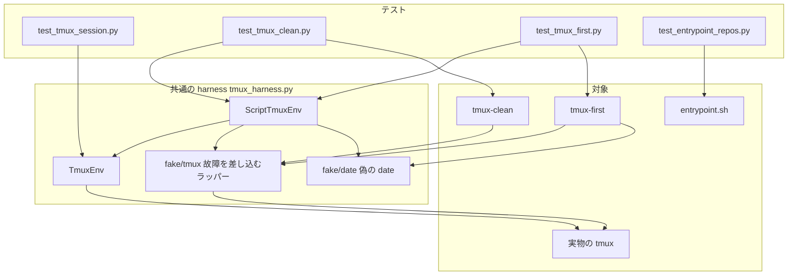
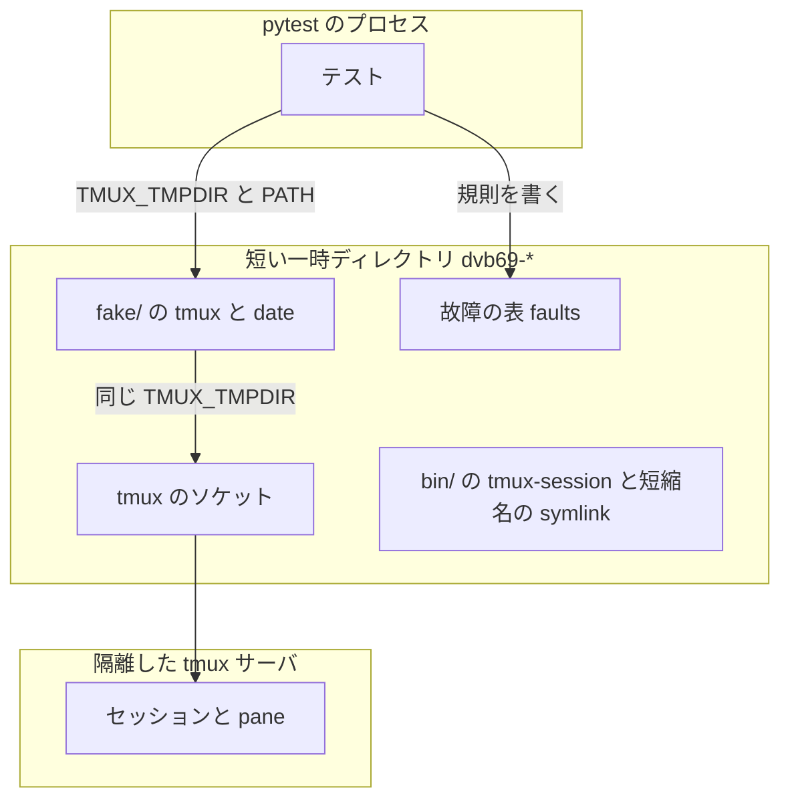
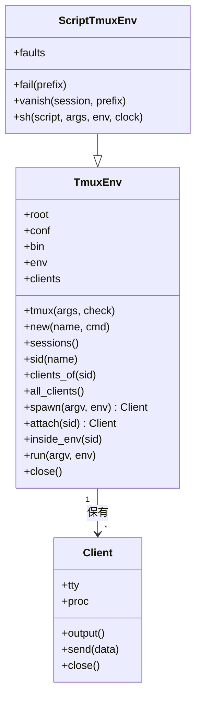
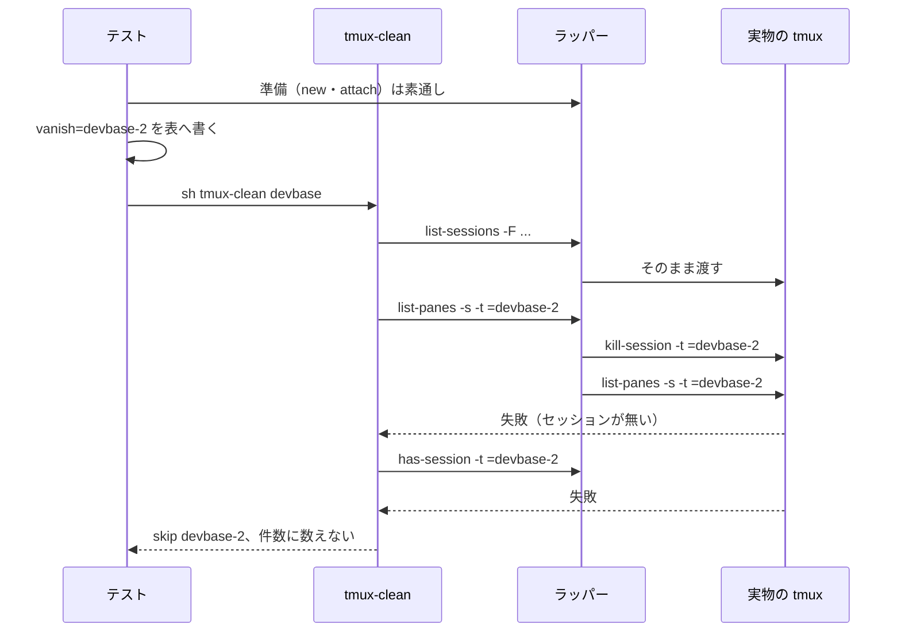
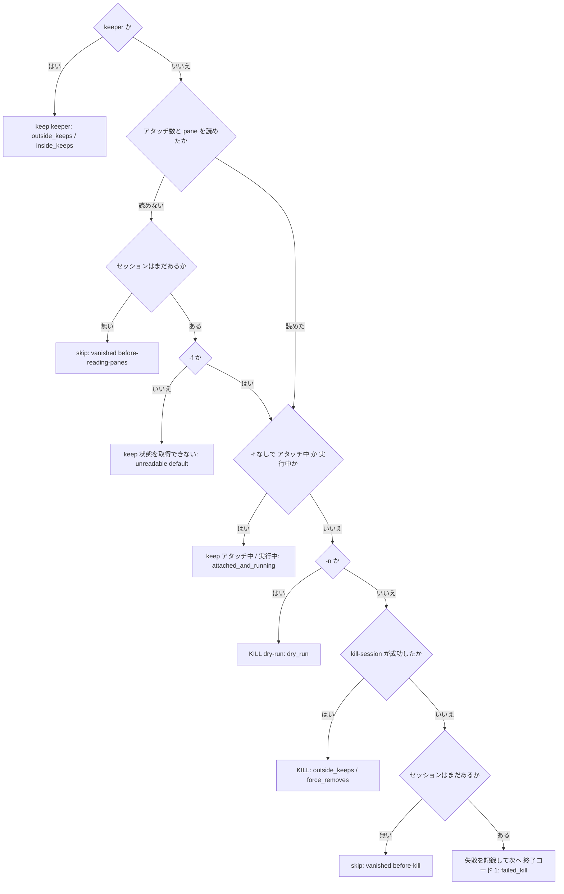
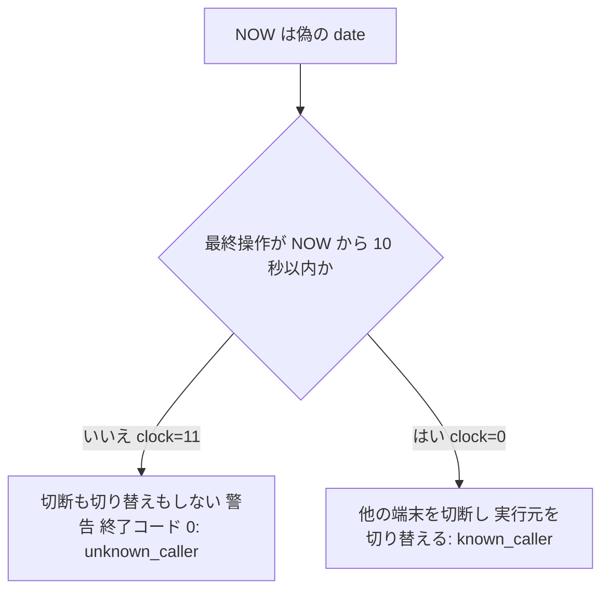

# base イメージのシェルの異常系と分岐を固定するテスト

## 概要

`containers/base` のシェルのうち、`entrypoint.sh` の workspace の書き出しと、`tmux-clean` /
`tmux-first` の異常系と分岐を、実物のシェルと実物の tmux を動かすテストで固定する。
スクリプトの今の出力・終了コード・副作用（書き出したファイル、セッションとクライアントの一覧）を
観察し、退行すると pytest が落ちる。

tmux を使うテストは、利用者の tmux サーバに触れない**隔離した tmux サーバ**で動く。実物の tmux だけ
では狙って起こせない失敗（状態を読めない・削除を拒まれる・走査中にセッションが消える）は、
実物の tmux の前に置いたラッパーで 1 つの呼び出しだけに差し込む。`tmux-first` の実行元の判定に
要る時刻の経過は、待たずに偽の `date` で作る。

コマンドの振る舞いそのものの仕様は次にある。この文書は、テストの仕組みと、テストが固定する観点を
扱う。

- `tmux-first` / `tmux-clean` の使い方と既定の守り:
  [環境変数ガイド: 同じプロジェクトのセッションが増え続ける場合](../user/environment-variables.md#同じプロジェクトのセッションが増え続ける場合)
- 実行元のクライアントの特定の規則（`tmux-session go` と共通）:
  [tmux-session: 実行元の特定](tmux-named-session.md#実行元の特定go-で--c-が無く-tmux-の中にいるとき)

### コンテキスト

| コンテキスト | 何の語が 1 つの意味に決まるか |
| --- | --- |
| base イメージの tmux のコマンド（`tmux`） | `tmux-clean` / `tmux-first` が扱うセッション・クライアント・keeper・実行元のクライアント |
| テストの実行環境（`test`） | 隔離した tmux サーバ・故障の差し込み・偽の date |

`test` は `tmux` の顧客である（顧客 / 供給者）。テストはスクリプトの振る舞いを変えずに受け取り、
出力・終了コード・一覧だけを観察する。`entrypoint.sh` の workspace の書き出しは固有の語を持たない
ため、コンテキストに挙げない。

## 用語

語の定義は [用語集](../glossary.md) にある。この仕様が使う語は次のとおり。

- `tmux` の節: keeper、実行元のクライアント
- `test` の節: 隔離した tmux サーバ、故障の差し込み、偽の date

## 背景

`entrypoint.sh` の workspace の書き出しは、復号に失敗すると完成品へ切り替える。この分岐が退行すると
コンテナは起動するが作業領域の定義が欠け、利用者には「フォルダが 1 つしか見えない」形でしか
現れない。`tmux-clean` の削除の可否の判断が退行すると利用中のセッションを消し、失敗の記録が落ちると
消え残りにも気づけない。`tmux-first` の実行元の判定が退行すると別の利用者の画面を奪う。
`tmux-session` は `tmux-first` と同じ規則で実行元を特定するため、片方の退行はもう片方にも関わる。

## 対象範囲

- `containers/base/entrypoint.sh` の `devbase_write_workspace` と `devbase_write_workspace_verbatim`
  の、base64 の復号に失敗する経路
- `containers/base/tmux-clean` の分岐（keeper・利用中の保護・`-f`・`-n`）と異常系（状態の取得の
  失敗・走査中の消失・削除の失敗）
- `containers/base/tmux-first` が tmux の中で実行元のクライアントを特定できないときの経路と、
  特定できるときの対照
- 上のテストが共有する harness（`tests/containers/tmux_harness.py`）
- `tmux-session` のテストの観点は [tmux-session の仕様](tmux-named-session.md#テスト観点) にあり、
  ここでは harness を共有することだけを扱う
- 含まないもの: スクリプトの振る舞いの変更。`tmux-clean` の子プロセスの検出
  （`/proc/<pid>/task/*/children` と `pgrep -P`）でバックグラウンドジョブを「実行中」とみなす経路、
  `-n` と故障の差し込みの組み合わせ、`tmux-first` の放置の判定（`TMUX_FIRST_IDLE`）と `-n` の表示は
  固定しない

## 構成要素

| 要素 | 置き場所 | 責務 |
| --- | --- | --- |
| 共通の harness | `tests/containers/tmux_harness.py` | 隔離した tmux サーバを作って片付ける（`TmuxEnv`）。端末を `pty` で繋ぐ（`Client`）。待ちの関数 `wait`・短い一時ディレクトリ `short_root`・skip の印 `needs_tmux` を持つ。`test_` で始まらないため pytest は収集しない |
| スクリプト用の harness | 同じファイルの `ScriptTmuxEnv` | 故障を差し込むラッパーと偽の date を `fake/` に書き、それを `PATH` の先頭に置いた隔離環境を作る。スクリプトを `sh <スクリプト>` で呼ぶ |
| 故障を差し込むラッパー | テストの実行時に `<root>/fake/tmux` へ生成 | 故障の表に当たる呼び出しだけを失敗させるか、呼び出しの直前にセッションを消す。当たらない呼び出しは実物の tmux へ渡す |
| 偽の date | テストの実行時に `<root>/fake/date` へ生成 | `date +%s` だけに `FAKE_DATE_OFFSET` 秒を足す。ほかの呼び出しは実物の `date` へ渡す |
| tmux-clean のテスト | `tests/containers/test_tmux_clean.py` | `tmux-clean` の分岐と異常系 |
| tmux-first のテスト | `tests/containers/test_tmux_first.py` | 実行元を特定できないときに何もしないこと、その対照、harness の環境の検査 |
| entrypoint のテスト | `tests/containers/test_entrypoint_repos.py` の workspace の節 | 復号の失敗の 2 経路。tmux を使わず、既存の `run_entrypoint_fn`（`DEVBASE_ENTRYPOINT_LIB_ONLY=1` で関数だけを source して bash で呼ぶ）と `write_workspace` を使う |
| tmux-session のテスト | `tests/containers/test_tmux_session.py` | 共通の harness を読み込んで使う（`from .tmux_harness import ...`）。`wait` / `short_root` は `_wait` / `_short_root` の別名で読み込む。`TMUX_CONF` と `DOCKERFILE` は自分のファイルに持つ |

`tests/containers/` は `__init__.py` を持つパッケージで、テストは相対の読み込みで harness を使う。
harness を `conftest.py` に置かないのは、`TmuxEnv` などが型注釈で名前を使う型であり、fixture の
名前では読み込めないためである。fixture（`tm`）は各テストファイルが持つ。

### 構成要素図

`ScriptTmuxEnv` を使うテストでは、テスト側の tmux の操作（`TmuxEnv.tmux`）も `PATH` の先頭の
ラッパーを通る。

### 配置

境界をまたぐのは環境変数だけである。テストのプロセスからスクリプトへ渡る環境は、`TMUX` /
`TMUX_PANE` / `ENV` / `BASH_ENV` を除いた上で `TMUX_TMPDIR`（一時ディレクトリ）と `PATH` などを
上書きしたものになる。tmux の中を模すときだけ、`inside_env` が隔離したサーバの pane を指す
`TMUX` / `TMUX_PANE` を足す。

## 仕様

### 集約

テストが書き換えるのは試験のための状態だけである。スクリプトの状態（セッション・クライアント・
workspace の定義）は、スクリプトの実行中は観察の対象で、テストが手を入れるのは実行の前の準備
（セッションを作る・端末を繋ぐ・書き出し先に既存の内容を置く）だけである。

| 集約 | 持ち主（書き換えてよいもの） | 根 | エンティティ | 値オブジェクト |
| --- | --- | --- | --- | --- |
| 隔離した tmux サーバ | `TmuxEnv` | `TmuxEnv`（1 テストに 1 つ） | セッション・クライアント（端末） | ソケットのディレクトリ（`TMUX_TMPDIR`）・環境 |
| 故障の差し込み | `ScriptTmuxEnv` | 故障の表（1 テストに 1 つのファイル） | — | 規則（動作と引数の前方一致） |
| workspace の書き出し先 | 準備ではテスト（既存の内容を置く）、実行中は `devbase_write_workspace`（`<書き出し先>.tmp` を経て置き換える） | 書き出し先のファイル（テストの `work` の下の `sample.code-workspace`） | — | 完成品の文書（`DEVBASE_WORKSPACE_B64`） |

### 隔離した tmux サーバ（`TmuxEnv`）

- `short_root()` は `$TMPDIR` 直下に `dvb69-` で始まる一時ディレクトリを作る。UNIX ソケットの
  パス長には OS の上限（macOS で 104 バイト）があるため、pytest の `tmp_path` は使わない
- `TmuxEnv(root, conf=None, fake=None)` は `root/bin` に `tmux-session` と短縮名 4 つ（`SHORT_NAMES`）の
  symlink を張り、環境を 1 つ作る。環境は pytest のプロセスの環境から `TMUX` / `TMUX_PANE` /
  `ENV` / `BASH_ENV` を除き、`TMUX_TMPDIR=<root>`・`TERM=xterm-256color`・`SHELL=/bin/sh`・
  `PS1="$ "`・`LANG=C.UTF-8`・`PATH=[<fake>:]<root>/bin:<元の PATH>` を置く
- `TMUX` を外すことは省けない。`TMUX` が残ると tmux は `TMUX_TMPDIR` を無視して利用者のサーバへ
  繋ぐ。`tmux-clean` / `tmux-first` は `-S` を受け取らず既定のソケットへ繋ぐため、テスト側の操作と
  スクリプトの実行を同じ `TMUX_TMPDIR` の環境でそろえる
- `new(name, *cmd)` は `-f <conf>`（既定 `/dev/null`。利用者の `~/.tmux.conf` を読まない）で
  120×40 の切り離したセッションを作り、その ID を返す。最初の 1 つがサーバを起動する
- `attach(sid)` は `pty` の端末から `tmux attach-session` を起こし、`all_clients()` に現れるまで
  待つ。`Client` は端末の出力をスレッドで読み続ける（読まないと tmux のクライアントが書き込みで
  止まる）
- `inside_env(sid)` は、その pane の中のシェルと同じ `TMUX`（`<ソケット>,<サーバの pid>,0`）と
  `TMUX_PANE` を足した環境を返す。値は隔離したサーバを指す
- `close()` は、`PATH` に tmux があるときだけ隔離した環境で `kill-server` を打ち、端末を閉じ、
  一時ディレクトリを消す。`kill-server` は `TMUX` を外し `TMUX_TMPDIR` を向けた環境の外では打たない

### 故障を差し込むラッパー（`fake/tmux`）

`ScriptTmuxEnv(root)` は `root/fake` にラッパーと偽の date を書いて実行権を付け、
`super().__init__(root, fake=root / "fake")` を呼ぶ。

| 項目 | 内容 |
| --- | --- |
| 呼ばれ方 | `PATH` の先頭の `fake/` にあり、スクリプトとテスト側の tmux の操作の両方から `tmux` として呼ばれる |
| 実物の場所 | 生成の時点で `shutil.which("tmux")` を解いた絶対パスを埋め込む。ラッパー自身を再び呼ばない |
| 故障の表 | `<root>/faults`。無ければすべての呼び出しを実物へ渡す。1 行 1 規則で、`<動作>` と `<前方一致の文字列>` をタブで区切る |
| 照合 | 引数を空白 1 つで連結した文字列（`"$*"`）が、規則の文字列で始まるか。規則の文字列は文字どおりに比べ、glob として読まない。表の上から見て最初に当たった規則だけが効く |
| 動作 `fail` | 標準エラーへ `injected failure: <引数>` を書き、終了コード 1 で終わる。実物を呼ばない |
| 動作 `vanish=<名前>` | 実物で `kill-session -t =<名前>` を打ってから（失敗は無視）、元の呼び出しを実物へ渡す |
| 当たらないとき | `exec <実物> "$@"`。引数・環境・標準入出力・終了コードをそのまま渡す |

`fail(prefix)` と `vanish(session, prefix)` は、故障の表へ 1 行を足すだけである。

失敗はラッパーで作る。ラッパーは当たらない呼び出しを実物へそのまま渡すため、セッションの作成・
アタッチ・一覧は本物の振る舞いのまま、1 つの呼び出しだけを失敗させられる。tmux 全体を作り物に
すると、セッションとクライアントの実際の変化を見られない。

走査中の消失は、スクリプトが次に読むセッションを、その呼び出しの直前に実物で消して作る。時間差で
別のプロセスから消すと、消える時点がスクリプトの進みに左右されて結果が揺れる。直前に消せば、
スクリプトは「一覧にはあったが次の呼び出しでは無い」状態を毎回同じ位置で踏む。

テストが使う規則は次の 5 つである。

| 再現する状況 | 動作 | 前方一致の文字列 |
| --- | --- | --- |
| 1 つのセッションの pane を読めない | `fail` | `list-panes -s -t =devbase-2` |
| アタッチ数の一覧を読めない | `fail` | `list-sessions -F #{session_attached}` |
| 状態を読む間にセッションが終わる | `vanish=devbase-2` | `list-panes -s -t =devbase-2` |
| 削除の直前にセッションが終わる | `vanish=devbase-2` | `kill-session -t =devbase-2` |
| 削除を tmux が拒む | `fail` | `kill-session -t =devbase-2` |

### 偽の date（`fake/date`）

| 項目 | 内容 |
| --- | --- |
| 引数が `+%s` の 1 つだけ | 実物の `date +%s` に `FAKE_DATE_OFFSET`（未設定なら 0）を足した整数を出す |
| それ以外 | `exec <実物> "$@"` |
| 秒数の渡し方 | `ScriptTmuxEnv.sh(..., clock=N)` が実行する環境に `FAKE_DATE_OFFSET=N` を置く |

`tmux-first` が時刻を読むのは `NOW=$(date +%s)` の 1 か所で、クライアントの最終操作
（`#{client_activity}`）は tmux サーバが実時刻で持つ。tmux サーバの時刻は変えられないため、
スクリプトが読む `NOW` の側を進める。こうすると端末を操作しないまま、待たずに「最終操作から N 秒」の
状態を作れる。

### スクリプトの呼び出し（`ScriptTmuxEnv.sh`）

| 項目 | 内容 |
| --- | --- |
| 形 | `sh containers/base/<スクリプト> <引数...>` を `subprocess.run` で実行する。`tmux-clean` と `tmux-first` は git の上で実行権を持たない（`100644`。イメージでは Dockerfile の `COPY --chmod=0755` で付く） |
| 環境 | 既定は `self.env`（tmux の外）。tmux の中を模すときは `inside_env(sid)` を渡す |
| 返すもの | `CompletedProcess`（標準出力・標準エラー・終了コード）。`timeout=30` |

### テストが固定する振る舞い: workspace の書き出し

壊れた base64 の入力には `%%%%`（テストの `UNDECODABLE`）を使う。macOS の `base64 -d` は
`not-base64!!` を終了コード 0 で通すが、`%%%%` は macOS・base イメージ（uutils coreutils）・
GNU coreutils のいずれでも失敗する。

- `DEVBASE_WORKSPACE_FOLDERS` の復号が失敗すると、標準出力へ
  `Warning: Failed to decode DEVBASE_WORKSPACE_FOLDERS` を出し、完成品（`DEVBASE_WORKSPACE_B64`）を
  そのまま書き出す。終了コードは 0
- 完成品の復号も失敗すると、`<書き出し先>.tmp` を消し、標準出力へ
  `Warning: Failed to write workspace file: <書き出し先>` を出す。既にある書き出し先は上書きしない。
  終了コードは 0。`DEVBASE_WORKSPACE_FOLDERS` が壊れていた場合は、その警告より先に復号の失敗の
  警告が出る。`DEVBASE_WORKSPACE_FOLDERS` が無い場合は復号の失敗の警告は出ない

### テストが固定する振る舞い: `tmux-clean`

1 つのセッションの判定の順と、テストが通す経路を次に示す。枠の中の名前はテスト関数である。

- keeper は、tmux の外では `<ベース名>-<数字>` のうち数の昇順で最小のもの（`devbase-2` と
  `devbase-10` なら `devbase-2`）、tmux の中では今のセッションである。tmux の中で引数を省くと、
  今のセッション名から末尾の `-数字` を除いてベース名にする。1 行目に
  `tmux-clean: base=<ベース名> keeper=<名前>` を出す
- `-f` なしでは、アタッチ中のセッションを `  keep  <名前>  (アタッチ中: クライアント <数> 個)`、
  シェル以外が動いているセッションを `  keep  <名前>  (実行中: <コマンド>)` として残す。`-f` では
  keeper 以外をすべて消す
- `-n` は何も消さず、消す対象を `  KILL  <名前>  (dry-run)` と出して終了コード 0。`-n -f` でも
  keeper は `  keep  <名前>  (keeper)` と出て残る
- アタッチ数か pane を読めず、セッションがまだあるときは、`-f` なしでは空の状態と読み替えず
  `  keep  <名前>  (状態を取得できませんでした)` として残し、標準エラーへ
  `tmux-clean: セッションの状態を取得できないため削除しません: <名前>` を出す。`-f` なら消す
- 状態を読む途中か削除の直前にセッションが消えていたら `  skip  <名前>  (既に終了していました)` と
  出し、削除・残す・失敗のどの件数にも数えない
- 削除を tmux が拒み、セッションがまだあるときは、標準エラーへ
  `tmux-clean: セッションを削除できませんでした: <名前>` を出して後続のセッションへ進み、最後に
  終了コード 1 で終わる。件数の行は `tmux-clean: 削除 <数> 件 / 残す <数> 件 / 失敗 <数> 件`

### テストが固定する振る舞い: `tmux-first`

`tmux-first` は tmux の中では、実行元のクライアントの最終操作が 10 秒（`SELF_FRESH`）以内のときだけ
実行元を特定できたとみなす（規則は
[tmux-session の実行元の特定](tmux-named-session.md#実行元の特定go-で--c-が無く-tmux-の中にいるとき)
と共通）。

- 特定できないときは、`-f` の有無によらず、どの端末も切断も切り替えもしない。標準エラーへ
  `tmux-first: 実行元のクライアントを特定できないため切断は行いません`・同じく
  `...切り替えも行いません`・手で切り替える `tmux switch-client -t '=<対象>'` を出し、終了コード 0 で
  終わる
- 特定できるときは、対象のセッションに繋がる他の端末を切断し（`-f` では最終操作によらず）、
  実行元を `switch-client -c <実行元>` で対象へ切り替える

`tmux-first` は特定できないとき 0 で、`tmux-session go` は 1 で終わる。この違いは揃えない。
`tmux-first` は若い番号へ戻す補助で、何もしないことが安全側の完了にあたり手順を案内して終わる。
`tmux-session go` は名指しの移動の依頼で、移れなかったことは依頼の失敗である。テストはそれぞれの
今の値を固定する。

tmux の外で実行したとき（`TMUX` が無い）は実行元の判定を通らず、他の端末の切断と attach へ進む。
この経路は対象にしない。

### ドメインイベント

| # | イベント | 発生元 | 受け手 | 失敗したとき |
| --- | --- | --- | --- | --- |
| E1 | コンテナの起動で workspace の定義を書いた | `devbase_write_workspace` | テスト（書き出し先の中身・`.tmp` の有無・標準出力） | 復号に失敗 → 完成品へ切り替える。完成品も壊れている → 警告だけ出して起動を続ける |
| E2 | `tmux-clean` が同じベース名のセッションを走査した | `tmux-clean` | テスト（1 行ずつの `keep` / `skip` / `KILL`）。故障の差し込みは走査の途中の tmux の呼び出しに割り込む | 状態を取得できない → 残す（`-f` なら消す）。走査中に消えた → `skip` |
| E3 | `tmux-clean` がセッションを消した | `tmux-clean` | テスト（隔離したサーバのセッション一覧・件数の行・終了コード） | 消せない → 記録して次へ進み、終了コード 1 |
| E4 | `tmux-first` が他の端末を切断し、自分の端末を切り替えた | `tmux-first` | テスト（隔離したサーバのクライアント一覧） | 実行元を特定できない → 切断も切り替えもしない |

### 常に成り立つ条件

| 条件 | 破れたとき何が止めるか |
| --- | --- |
| harness が起動する tmux とスクリプトの環境には、pytest が継承した `TMUX` / `TMUX_PANE` が無い | `test_harness_env_has_no_inherited_tmux` が落ちる |
| 環境に `TMUX` があるのは `inside_env` が与えたときだけで、その値のソケットは `TMUX_TMPDIR` の下にある | `test_harness_env_has_no_inherited_tmux` が落ちる |
| 利用者の tmux サーバのセッション一覧とクライアント一覧は、テストの前後で変わらない | 自動では止まらない。運用の「利用者のサーバへの影響の確認」で手で比べる |
| 故障の表に当たらない tmux の呼び出しは、実物の tmux へ引数と環境をそのまま渡す | ラッパーを通したまま本物どおりの結果を見る `tmux-clean` の分岐のテストが落ちる |
| 完成品の復号に失敗しても、`<書き出し先>.tmp` が残らず、既にある書き出し先が上書きされない | `test_a_broken_prebuilt_document_keeps_the_old_workspace` が落ちる |
| `tmux-clean` は keeper を、どの分岐・どのオプションでも消さない | keeper の残りを毎回確かめる `tmux-clean` のテストが落ちる |
| `tmux-first` は tmux の中で実行元を特定できないとき、`-f` の有無によらず、どの端末も切断も切り替えもしない | `test_unknown_caller_touches_no_client` が落ちる |
| `test_tmux_clean.py` と `test_tmux_first.py` は時刻を待つための `sleep` を使わない。時刻は偽の date で進める | 自動では止まらない。`grep -n "sleep(" tests/containers/test_tmux_clean.py tests/containers/test_tmux_first.py` が 0 件であることで確かめる（セッションのコマンドの `sleep 600` は待ちではない） |

## データ・設定

| 名前 | 種類 | 内容 |
| --- | --- | --- |
| `TMUX_TMPDIR` | 環境変数 | `TmuxEnv` が一時ディレクトリへ向ける。隔離したサーバのソケットの置き場 |
| `TMUX` / `TMUX_PANE` | 環境変数 | `TmuxEnv` の環境から除く。`inside_env` だけが隔離したサーバの値を足す |
| `ENV` / `BASH_ENV` | 環境変数 | `TmuxEnv` の環境から除く（起動するシェルに利用者の初期化を読ませない） |
| `FAKE_DATE_OFFSET` | 環境変数 | 偽の date が `date +%s` に足す秒数。`ScriptTmuxEnv.sh` の `clock` から置く |
| `<root>/faults` | ファイル | 故障の表。1 行 1 規則、`<動作>\t<前方一致の文字列>` |
| `DEVBASE_WORKSPACE` / `DEVBASE_WORKSPACE_FOLDERS` / `DEVBASE_WORKSPACE_B64` | 環境変数 | workspace の書き出し先・folder ごとの記録・完成品。テストは `write_workspace` で与える |
| `DEVBASE_ENTRYPOINT_LIB_ONLY` | 環境変数 | `1` で `entrypoint.sh` を関数の定義だけ読み込み、本体を走らせない。`run_entrypoint_fn` が使う |

## エラー処理

- tmux が無い環境では、tmux を使うテストを `needs_tmux` で skip する。`test_tmux_clean.py` はファイル
  全体に付け（`pytestmark`）、`test_tmux_first.py` は tmux を使う 2 つに付ける。
  `test_harness_env_has_no_inherited_tmux` は tmux が無くても環境の検査までを行う
- `TmuxEnv.tmux` は既定で終了コード 0 を要し、外れると tmux の標準エラーを添えて落ちる。
  `sessions()` などの読み取りは `check=False` で、サーバが無ければ空を返す
- `wait` は条件が既定 10 秒のうちに真にならなければ `AssertionError` で落ちる
- `close()` は tmux の無い環境でも後片付けを終える。`kill-server` の失敗は無視する
- 故障の表は準備（セッションと端末を作る）が終わってから書く。準備の tmux の操作もラッパーを
  通るため、先に書くと準備そのものが失敗する

## 運用

- 実行は `uv run --locked pytest tests/containers -q`。CI の pytest ジョブ（`.github/workflows/ci.yml`、
  ubuntu-latest）は `uv run --locked pytest tests/ -q` で同じテストを拾う
- tmux を使うテストを足すときは、fixture で `ScriptTmuxEnv(short_root())`（スクリプトを呼ばないなら
  `TmuxEnv`）を作り、`finally` で `close()` する。`kill-server` を、`TMUX` の残った環境やソケットを
  指定しない形で打たない。`$TMUX` のある端末では `TMUX_TMPDIR` が無視され、利用者のサーバが落ちる
- 利用者のサーバへの影響の確認: 利用者の tmux の中（`TMUX` のある端末）で `tmux list-sessions` と
  `tmux list-clients` を控え、`uv run --locked pytest tests/containers -q` の後に比べて変わらないこと
- 壊して確かめる確認: 次の行を 1 つずつ壊して、対応するテストが落ちることを見てから戻す。
  壊したままコミットしない

| 壊す行 | 落ちるテスト |
| --- | --- |
| `entrypoint.sh` の `devbase_write_workspace` で、復号の失敗の分岐から `devbase_write_workspace_verbatim` の呼び出しを消す | `test_workspace_falls_back_when_the_folders_cannot_be_decoded` |
| `entrypoint.sh` の `devbase_write_workspace_verbatim` の `rm -f "$dest.tmp"` を消す | `test_a_broken_prebuilt_document_keeps_the_old_workspace` |
| `tmux-clean` の `[ "$s" = "$KEEP" ]` の分岐を消す | `test_outside_keeps_the_lowest_number`・`test_inside_keeps_the_current_session` |
| `tmux-clean` の `[ "$FORCE" = 0 ] && [ "${ATT:-0}" != 0 ]` の keep を消す | `test_attached_and_running_sessions_are_kept` |
| `tmux-clean` の `[ "$FORCE" = 0 ] && [ -n "$BUSY" ]` の keep を消す | `test_attached_and_running_sessions_are_kept` |
| `tmux-clean` のループの中の `[ "$DRY" = 1 ]` の dry-run の分岐を消す | `test_dry_run_removes_nothing` |
| `tmux-clean` の `STATE_OK=0` の後の `[ "$FORCE" = 0 ]` の keep を消す | `test_unreadable_state_is_kept_without_force`（`-f` なしの 2 つ） |
| `tmux-clean` の `has-session` による `skip` の分岐（2 か所）を消す | `test_a_session_that_vanished_is_skipped` |
| `tmux-clean` の最後の `[ "$FAILED" = 0 ] \|\| exit 1` を消す | `test_a_failed_kill_is_reported_and_the_rest_continue` |
| `tmux-first` の `[ "$ME_VERIFIED" = 1 ] \|\| ME=""` を消す | `test_unknown_caller_touches_no_client` |
| `tmux-first` の `tmux switch-client -c "$ME" -t "=$TARGET"` を消す | `test_known_caller_detaches_others_and_switches` |

## テスト観点

`tests/containers/test_entrypoint_repos.py`（workspace の節）:

| 観点 | テスト |
| --- | --- |
| `DEVBASE_WORKSPACE_FOLDERS` が `%%%%` で `DEVBASE_WORKSPACE_B64` が正しいとき、`Warning: Failed to decode DEVBASE_WORKSPACE_FOLDERS` が出て、書き出し先の中身が B64 の復号結果と一致し、終了コード 0 であること | `test_workspace_falls_back_when_the_folders_cannot_be_decoded` |
| `DEVBASE_WORKSPACE_B64` が `%%%%` のとき（FOLDERS なし / `%%%%`）、`Warning: Failed to write workspace file: <書き出し先>` が出て、`<書き出し先>.tmp` が残らず、既にある書き出し先が上書きされず、終了コード 0 であること。FOLDERS が `%%%%` なら復号の失敗の警告が先に出て、FOLDERS なしなら出ないこと | `test_a_broken_prebuilt_document_keeps_the_old_workspace` |

`tests/containers/test_tmux_clean.py`:

| 観点 | テスト |
| --- | --- |
| tmux の外で番号が最小のもの（数の昇順）が keeper として残り、他が消えること | `test_outside_keeps_the_lowest_number` |
| tmux の中で引数を省くと、ベース名を推定し、今のセッションが keeper として残ること | `test_inside_keeps_the_current_session` |
| `-f` なしで、アタッチ中と実行中のセッションが理由とともに残り、空のセッションだけが消えること | `test_attached_and_running_sessions_are_kept` |
| `-f` で、アタッチ中と実行中も消え、keeper だけが残ること | `test_force_removes_attached_and_running_but_not_the_keeper` |
| `-n` と `-n -f` で何も消えず、`  KILL  devbase-4  (dry-run)` が出て、keeper が残り、終了コード 0 であること | `test_dry_run_removes_nothing` |
| pane かアタッチ数を読めないセッションが、`-f` なしでは残って警告が出て、`-f` では消えること | `test_unreadable_state_is_kept_without_force` |
| pane を読む前か削除の直前に消えたセッションが `skip` と出て、削除の件数に数えられず、終了コード 0 であること | `test_a_session_that_vanished_is_skipped` |
| 削除に失敗したセッションで警告が出て残り、後続のセッションが消え、`失敗 1 件` で終了コード 1 であること | `test_a_failed_kill_is_reported_and_the_rest_continue` |

`tests/containers/test_tmux_first.py`:

| 観点 | テスト |
| --- | --- |
| tmux の中で実行元の最終操作が 10 秒より前のとき、`-f` の有無によらず、クライアント一覧が前後で変わらず、`実行元のクライアントを特定できないため` の警告が出て、終了コード 0 であること | `test_unknown_caller_touches_no_client` |
| 対照として、実行元を特定できるとき（`-f`）、対象の他の端末が外れ、対象に繋がるのが実行元だけになること | `test_known_caller_detaches_others_and_switches` |
| pytest のプロセスに `TMUX` / `TMUX_PANE` があっても harness の環境に持ち込まず、`inside_env` の `TMUX` のソケットが `TMUX_TMPDIR` の下にあること | `test_harness_env_has_no_inherited_tmux` |

## 関連リンク

- [tmux のセッションを名指しで扱うコマンド（tmux-session）](tmux-named-session.md)
- [環境変数ガイド: 同じプロジェクトのセッションが増え続ける場合](../user/environment-variables.md#同じプロジェクトのセッションが増え続ける場合)
- [用語集](../glossary.md)
- [Issue #239](https://github.com/devbasex/devbase/issues/239)
