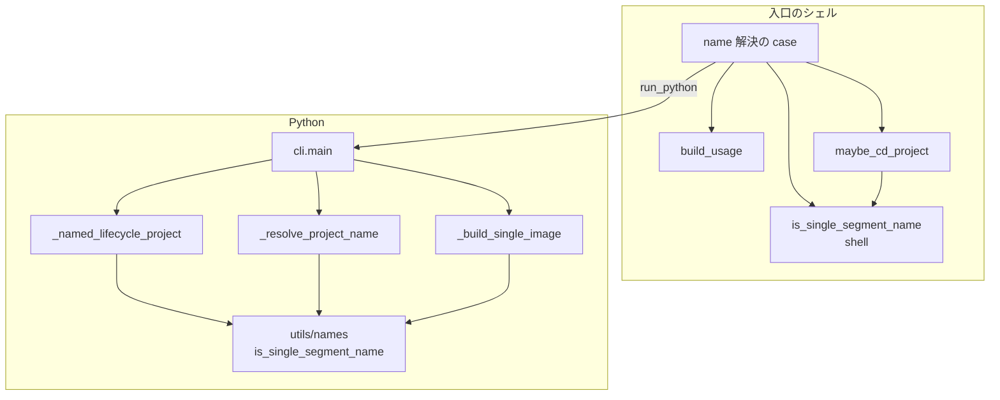
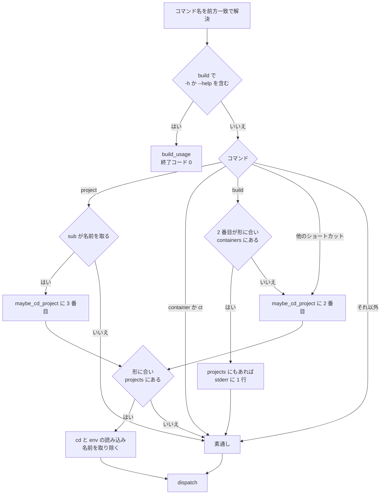

# 位置引数の解決（プロジェクト名・イメージ名）

## 概要

`devbase <コマンド> <値>` の `<値>` を、プロジェクト名として解釈するか、そのコマンド固有の意味
（イメージ名・`login` の番号・`scale` の台数）のまま下流へ渡すかを決める規則。判定は起動ラッパー
`bin/devbase`（name 解決）と、ラッパーを経ない直接起動に備える Python 側の検証の 2 か所にあり、
どちらも同じ名前の形を使う。

| 入口 | 名前の位置 | 解決するもの |
| --- | --- | --- |
| `devbase <sub> <name>`（ショートカット） | 2 番目 | `up` `down` `ps` `scale` `login` `build` `rebuild` `open` |
| `devbase project <sub> <name>` | 3 番目 | `up` `down` `ps` `logs` `scale` `rebuild` `open` |
| `devbase container <sub> …` / `ct`（非推奨） | — | 解決しない（`[name]` を受け付けない） |
| `python -m devbase.cli project <sub> <name>` | 3 番目 | Python 側のフォールバック（`_resolve_project_name`） |

名前として解釈した値は、ラッパーが `$DEVBASE_ROOT/projects/<name>` へ `cd` して引数から取り除く。
`devbase` は PATH 上の実行ファイルとして子プロセスで起動するため、この `cd` が呼び出し元シェルの
作業ディレクトリを変えることはない。

## 用語

| 用語 | 意味 |
| --- | --- |
| 名前の形 | 親ディレクトリの直下の 1 つの名前として受け付ける形。`[A-Za-z0-9][A-Za-z0-9._-]*` の全体一致 |
| name 解決 | 位置引数を名前として解釈し、`projects/<name>` へ `cd` して引数から取り除く処理 |
| ラッパー | `bin/devbase`（bash 実装の入口。Python 実装のコマンドへ `run_python` で振り分ける） |
| ショートカット | `devbase up` のように `project` を省いたトップレベルの同義語（`cli.SHORTCUTS` と shell の `_NAME_RESOLVABLE_SHORTCUTS`） |
| 単体ビルド | `$DEVBASE_ROOT/containers/<image>` を `devbase-<image>:latest` として 1 つだけ作るビルド |

## 構成要素

| 要素 | 置き場所 | 責務 |
| --- | --- | --- |
| 名前の形の規則 | `lib/devbase/utils/names.py` | `SINGLE_SEGMENT_NAME_PATTERN` と `is_single_segment_name(value)`。`re` だけに依存し副作用を持たない |
| 名前の形の規則（shell） | `bin/devbase` | `_SINGLE_SEGMENT_NAME_RE` と `is_single_segment_name`。Python と同じ正規表現を文字列で持つ |
| name 解決 | `bin/devbase` | `maybe_cd_project`。形・実在の順に見て、通れば `cd` と `COMPOSE_PROJECT_NAME` / `env` の再読み込み |
| 解決の対象の一覧 | `bin/devbase` | `_PROJECT_NAME_SUBCOMMANDS`（`project` の対象）と `_NAME_RESOLVABLE_SHORTCUTS`（トップレベルの対象） |
| `build` の使い方 | `bin/devbase` | `build_usage`。トップレベル `build` の `-h` / `--help` で出す |
| 解決の順序 | `bin/devbase` の name 解決の `case` | `build` のヘルプ → `project` → `build` → その他のショートカット |
| 名前の検証（切替） | `lib/devbase/commands/container.py` | `_resolve_project_name`。ラッパーを経ない直接起動のフォールバック |
| 名前の検証（注入） | `lib/devbase/cli.py` | `_named_lifecycle_project`。dispatch 前の機密の注入で使うプロジェクト名 |
| 名前の検証（イメージ） | `lib/devbase/commands/container.py` | `_build_single_image`。`containers/<image>` へ連結する前の検証 |
| 引数の受け口 | `lib/devbase/cli.py` | `_add_project_parser`（`name` positional を持つサブコマンド）、`SHORTCUTS`、`GROUP_ALIASES` |

型（クラス）は持たない。モジュール関数の並びで構成する。



`cli.main` と `_resolve_project_name` の間には `_dispatch_lifecycle` と `_enter_project` がある。

## 仕様

### 名前の形

| 項目 | 内容 |
| --- | --- |
| 規則 | `[A-Za-z0-9][A-Za-z0-9._-]*` に**全体が**一致する。先頭が英数字なので `.`・`..`・`-x`・空文字は当たらない。`/`・`\`・空白・非 ASCII は含められない |
| Python | `devbase.utils.names.is_single_segment_name(value)`。`re.fullmatch` で見るため、末尾の改行も不一致になる |
| shell | `_SINGLE_SEGMENT_NAME_RE='^[A-Za-z0-9][A-Za-z0-9._-]*$'`。比較は関数の中で `local LC_ALL=C` にして行う |
| 使う場所 | shell: `maybe_cd_project`、`build` の衝突の判定。Python: `_resolve_project_name`、`_named_lifecycle_project`、`_build_single_image` |

プロジェクト名とイメージ名は同じ規則を使う。どちらも「決まった親ディレクトリ（`projects/` /
`containers/`）の直下の 1 つの名前」を表すためである。`/` と `..` だけを弾く拒否リストは採らない
（`\`・空白・制御文字・非 ASCII のように見落とした文字がそのまま通る）。

shell が Python を呼ばずに同じ正規表現を文字列で持つのは、name 解決のたびに `uv run` の起動が
1 回増えるためである。2 か所の一致は同期テストで保つ。

`[A-Za-z]` の範囲は C ライブラリの正規表現ではロケールによって ASCII 以外を含みうるため、shell 側は
`LC_ALL=C` を関数の中に閉じて比べる。`[[:alnum:]]` はロケールに依存し、Python の定義と字面で
比べられなくなるため使わない。

### 形に合わない値の扱い

ラッパーは形に合わない値を**名前として扱わない**（`cd` も引数からの除去もしない）。止めずに
そのまま下流へ渡す。同じ位置引数が名前以外の意味（`login` の番号、`build` のイメージ、`scale` の
台数）も持つためである。ラッパーは名前かどうかだけを決め、止めるのは意味を知る下流に任せる。

### トップレベル `build` の引数の解釈

上から順に見て、最初に当たった行で決まる。判定に使うのは `$2` だけである
（`build --no-cache bi-tools` のように位置引数が 2 番目に無いときは name 解決を通らず、
`build)` の分岐がイメージとして拾う）。

| 条件 | 解釈 | 行き先 | cd |
| --- | --- | --- | --- |
| `build` より後ろのどこかに `-h` か `--help` がある | 使い方 | `build_usage` → 終了コード 0 | しない |
| `$2` が名前の形に合い `containers/$2` が実在する | イメージ `$2` | Python の `project build $2 …`。`projects/$2` も実在すれば stderr に知らせを 1 行出す | しない |
| `$2` が名前の形に合い `projects/$2` が実在する | プロジェクト `$2` | `projects/$2` へ `cd` し `$2` を取り除いて shell の `cmd_build` | する |
| 上のどれでもない | 既存の `build)` 分岐 | 位置引数があれば Python の単体ビルド、無ければ shell の `cmd_build` | しない |

`containers/<x>` があれば `projects/<x>` の有無によらず name 解決を通さない。`build <image>` は
イメージを明示した指定であり、プロジェクトのビルドは通常そのディレクトリで引数なしに行うためで
ある。逆にすると `containers/<x>` をトップレベルからビルドする手段が無いまま残る。判定は
`maybe_cd_project` より前に置く（後だと `cd` と `env` の読み込みが先に起き、戻す手段が無い）。
名前の形を先に見るのは、`containers/../x` のような値でディレクトリの実在を確かめないためである。

### 衝突の知らせ

| 項目 | 内容 |
| --- | --- |
| 条件 | トップレベル `build <x>` で、`<x>` が名前の形に合い、`containers/<x>` と `projects/<x>` がどちらもディレクトリとして実在する |
| 出力 | stderr に 1 行。1 回の起動で 1 回だけ |
| 文言 | `Note: '<x>' is also a project (projects/<x>); building image containers/<x>. To build the project, run 'devbase build' in $DEVBASE_ROOT/projects/<x>`（`$DEVBASE_ROOT` は展開した値） |
| 終了コード | 知らせは終了コードに影響しない。単体ビルドの結果がそのまま返る |

標準出力ではなく stderr へ出すのは、単体ビルドの出力をパイプで読む側の邪魔をしないためである。

### `devbase build --help` / `-h`

| 項目 | 内容 |
| --- | --- |
| 名前 | `devbase build -h` / `devbase build --help`。前方一致（`devbase b --help`）も同じ |
| 入力 | `build` より後ろの引数のどこかにある `-h` または `--help`。`--context --help` / `--context -h` も使い方として扱う。`--context=--help` / `--context=-h` は使い方にせず下流へ渡す（argparse の値不足で終了コード 2 になる） |
| 出力 | 標準出力に下の使い方。終了コード 0 |
| 起こさないこと | `cmd_build`・`compose_with_secrets`・`run_python` を呼ばない。`cd` せず、切り替え先のプロジェクト（`projects/<name>`）の `env` を読まない |
| 対象外 | `devbase project build --help`（argparse の `--help`）は変わらない。`-` の付かない `help` という語は名前として扱う |

```text
Usage: devbase build [<project> | <image>] [options]

Build devbase images.
  (no argument)       build the images of the current project (base image first)
  <project>           build the project in $DEVBASE_ROOT/projects/<project>
  <image>             build $DEVBASE_ROOT/containers/<image> alone as devbase-<image>:latest
                      (when both containers/<name> and projects/<name> exist, <name> is an image;
                       to build the project, run 'devbase build' in its directory)

Options:
  --no-cache          rebuild the base and project images without cache
  --project-no-cache  rebuild only the project image without cache (base uses cache)
  --expires[=DAYS]    rebuild without cache only if the image is older than DAYS days (default 7)
  --context NAME      run docker against the docker context NAME
  -h, --help          show this help
```

使い方をラッパーが出すのは、トップレベル `build` が shell の `cmd_build` と Python の
`project build` に振り分けられ、受け付ける引数が両者で違う（`--project-no-cache` は shell にだけ
ある）ためである。判定を name 解決より前に置くのは、`build carmo --help` で `projects/carmo` への
`cd` とその `env` の読み込みを起こさないためである。起動時の `$DEVBASE_ROOT/env` と実行時の
ディレクトリの `env` の読み込みは、コマンド名の解決より前に全コマンド共通で起きる。

### `container` / `ct` グループ

`container` / `ct` は name 解決の対象外である。parser が `[name]` を持たないため、
`devbase container up carmo` は `projects/carmo` が実在しても argparse の usage エラー
（`unrecognized arguments: carmo`、終了コード 2）になる。`container scale <name> N` は
`new_scale` の型エラーで同じく 2 である。名前なしの `devbase container up` は今までどおり実行時の
ディレクトリのプロジェクトで動き、非推奨の警告を出す。

ラッパーだけが名前を取り除く形では「実在するときだけ受け付ける」動きになり、受け付けるかどうかが
利用者の打った語ではなく `projects/` の中身で変わる。`container` は非推奨で、名前の指定は
`project <sub> <name>` が持つため、ラッパーを parser に合わせた。

### Python 側の名前の検証

3 つの入口が `projects/` または `containers/` へ名前を連結する前に同じ規則で弾く。

| 入口 | 形に合わないときの振る舞い |
| --- | --- |
| `container._resolve_project_name(name)` | `プロジェクト名に使えない形です: '<name>'（英数字で始まり、英数字・'.'・'-'・'_' だけからなる名前）` を error ログへ出して `False` を返す。`chdir`・`env` の読み込み・候補の提示をしない。呼び出し元（`_dispatch_lifecycle`）は 1 を返す |
| `cli._named_lifecycle_project(root, cmd, sub, name)` | `projects/<name>` の実在を見る前に `None` を返す。`store_for` / `ref_group` を呼ばず、`projects/` の外の `env` の宣言も読まない |
| `container._build_single_image(image)` | `Invalid image name: …（must be a single directory name under containers/: …）` を error ログへ出して 1 を返す |

`_resolve_project_name` は、ラッパーが起動前に `cd` 済みでないとき（`python -m devbase.cli` の
直接起動、`_ensure_env_files` などラッパーを経ない経路）のフォールバックである。ラッパー経由なら
同一パス判定で `chdir` は no-op になる。

### 失敗の形

| 状況 | 終了コード | 出力 |
| --- | --- | --- |
| ラッパー経由で形に合わない名前（`up ../etc` など） | 下流の結果 | ラッパーは何も出さない。引数はそのまま Python へ渡る |
| `project <sub> <name>` / トップレベル `up` などで Python が形に合わない `name` を受け取った | 1 | `プロジェクト名に使えない形です: …`（error）。候補の一覧は出さない |
| 形に合うが `projects/<name>` が無い | 1 | 従来どおり利用可能なプロジェクト候補を添えたエラー |
| `scale <形に合わない値>`（値が 1 つだけ） | 2 | argparse の `new_scale` の型エラー |
| `login <形に合わない値>` | 下流の結果 | 番号として `docker compose` へ渡る。`cd` しない |
| `build <形に合わない値>` | 1 | `_build_single_image` の `Invalid image name` |
| `container <sub> <name>` / `ct <sub> <name>`（`up` `down` `ps` `logs` `rebuild` `open`） | 2 | argparse の `unrecognized arguments: <name>` |
| `container scale <name> [N]` | 2 | argparse の `new_scale` の型エラー |

### 解決の順序



「他のショートカット」は `_NAME_RESOLVABLE_SHORTCUTS` から `build` を除いた 7 つ
（`up` `down` `ps` `scale` `login` `rebuild` `open`）である。

### 常に成り立つ条件

- 名前として `projects/` へ連結される値は、必ず名前の形に合う 1 セグメントである。したがって
  位置引数に `..` や `/` を混ぜて `$DEVBASE_ROOT/projects/<name>` の外を指すこと
  （パストラバーサル）はできず、name 解決と Python 側の検証はそのような値で `cd` も `env` の
  読み込みもしない。**保証するのはここまでで、`projects/<name>` の実体がどこにあるかは含まない**
  （下の「リンクの先は対象外」）
- `containers/` への連結（実在の確認と単体ビルド）も同じ規則を通る
- ラッパーが名前として解釈した値だけが引数から取り除かれる。解釈しなかった値は 1 つも欠けずに
  下流へ渡る
- shell と Python の正規表現は同じ文字列である（同期テストが一致を見る）

### リンクの先は対象外

上の保証は**位置引数の形**についてのもので、`$DEVBASE_ROOT/projects/<name>` が指す先までは
縛らない。`projects/<name>` はプラグインの同期が張るシンボリックリンクであることが多く、実体は
リポジトリの管理外（`repos/` 配下など、`.gitignore` で除外された場所）にある。

```
$ ls -l $DEVBASE_ROOT/projects
lrwxr-xr-x  adminer   -> ../repos/github.com--devbasex--devbase-samples/adminer/projects/adminer
lrwxr-xr-x  carmo     -> ../repos/github.com--volareinc--devbase-ext/carmo-web/projects/carmo
```

`maybe_cd_project` の `cd "$target"` も Python 側の `os.chdir` もリンクを辿るため、対象が
リンクなら実体のディレクトリへ移動し、そこの `env` を `source` する。これは登録済みの
プロジェクトを扱うための**意図した動き**で、この仕様は変えていない。つまり、

| 事柄 | 保証 |
| --- | --- |
| 位置引数に `..` `/` `.` を含めて `projects/<name>` の外を指す | 拒む（名前の形で弾く） |
| `projects/<name>` が登録済みのシンボリックリンクで、実体が `projects/` の外にある | 拒まない。実体へ `cd` し、そこの `env` を読む |

リンクを張れるのは `$DEVBASE_ROOT/projects/` へ書ける者だけで、その者はもともと
任意の `env` をそこへ置ける。したがってリンクを辿ることで新たに広がる権限は無い。

### 残る衝突

トップレベルの `devbase login <index>` / `devbase scale <N>` は、値が実在するプロジェクト名と
一致すると名前として解釈される（`projects/2` がある状態の `devbase login 2` は番号 2 ではなく
プロジェクト `2` への操作になる）。数字だけのプロジェクト名は通常作られないため衝突は偶発に
限られる。

名前の解決は現在地を見ない。`maybe_cd_project` が見るのは `$DEVBASE_ROOT/projects/<値>` の実在
だけなので、対象プロジェクトのディレクトリの中で打っても回避できない。`projects/web` の中で
`devbase login 2` と打つと `projects/2` へ切り替わり、`2` は引数から取り除かれて index は既定の
1 になる。`devbase scale 2` も同じく `projects/2` へ切り替わり、`new_scale` が無くなって usage
error になる。回避するには、名前の解決を通らない形か、名前を明示した形を使う。

| 衝突する形 | 回避する形 | 理由 |
| --- | --- | --- |
| `devbase login 2` | `devbase project login 2` | `project login` は `[name]` を取らないため `_PROJECT_NAME_SUBCOMMANDS` に含まれず、`2` は index のまま下流へ渡る（対象はカレントプロジェクト） |
| `devbase scale 2` | `devbase project scale <name> 2` | `<name>` が名前として取り除かれ、残る `2` が `new_scale` になる。`devbase project scale 2` は依然 `projects/2` へ切り替わるので、名前は省略しない |

## データ・設定

`maybe_cd_project` が名前として解釈したとき、ラッパーは対象ディレクトリで次を行う。

| 対象 | 内容 |
| --- | --- |
| 作業ディレクトリ | `$DEVBASE_ROOT/projects/<name>` へ `cd`（子プロセスの中なので呼び出し元シェルには及ばない） |
| `COMPOSE_PROJECT_NAME` | `<name>` を export |
| 呼び出し元の `env` 固有のキー | 起動時に記録したキーを unset してから対象の `env` を `source` する（呼び出し元の値の残留を防ぐ） |
| 対象の `env` | `set -a` の下で `source ./env`（`.env` は読まない） |

Python 側の `_resolve_project_name` は同じ結果になるよう、`chdir` に加えて `os.environ['PWD']` と
`COMPOSE_PROJECT_NAME` を更新し、対象の `env` を `os.environ` へ反映する。

`projects/` と `containers/` の位置はどちらも `$DEVBASE_ROOT` の直下で、`DEVBASE_ROOT` が未設定の
ときは Python 側の名前の検証が「`DEVBASE_ROOT` が未設定のため解決できません」で 1 を返す。

## 運用

- 名前の形に合わないプロジェクト（`_` で始まる名前など）は、名前の指定（CLI の `[name]` と
  `devbase list` の一覧）から操作できない。そのディレクトリの中で名前なしに打てば動く
- 名前の検証はリポジトリの中で 1 つに寄せていない。`env/bundle.py` の `is_valid_project_name`
  （先頭の `_` を許す。`env` の export / import の書庫の中の名前）、`env/secret_store.py` の
  `_validate_project_name`（機密の保存先のファイル名）、`snapshot/manager.py` の `_VALID_NAME_RE`
  （スナップショットの名前）はそれぞれ別の用途と互換性を持つ。寄せると受け付ける名前が変わる
  範囲が広がるため、位置引数の解決はこの仕様の規則だけを使う
- shell 側は macOS 既定の bash 3.2 で動くこと。`[[ =~ ]]` の右辺は変数で渡す（引用した右辺は
  文字列として比べられる）。連想配列・`${var,,}`・`mapfile` を使わない
- `cli.py` でサブコマンドを足し引きしたら、`bin/devbase` の `_PROJECT_NAME_SUBCOMMANDS` /
  `_NAME_RESOLVABLE_SHORTCUTS` も合わせる（両側にコメントの対がある）

## テスト観点

- 名前の形が実在のプロジェクト名（`carmo`・`github_work_time`・`carmo-ai`）を通し、`../etc`・
  `a/b`・`.`・`..`・空・`-x`・`café` を弾くこと（`tests/utils/test_names.py`）
- shell の `_SINGLE_SEGMENT_NAME_RE` が Python の `SINGLE_SEGMENT_NAME_PATTERN` と一致すること
  （`tests/cli/test_project_name_resolution.py` の同期テスト）
- 形に合わない名前で、トップレベルの 7 コマンドと `project` の 7 サブコマンドが `projects/` の外へ
  `cd` せず、そこの `env` を読まないこと。形に合う実在の名前は `cd` して引数から取り除かれること
  （`tests/cli/test_project_name_resolution.py`）
- ラッパーを経ない `python -m devbase.cli project up ../etc` が `chdir` せず、使えない形である旨を
  出して 1 で終わること（同上）
- dispatch 前の注入（`_named_lifecycle_project`）が形に合わない名前で `projects/` の外の `env` を
  読まず `None` を返すこと（`tests/cli/test_secret_injection.py`）
- `build <x>` で `containers/<x>` と `projects/<x>` が両方あるときイメージが勝ち、知らせが stderr に
  ちょうど 1 行出ること。片方だけのときは従来どおりで知らせが出ないこと
  （`tests/cli/test_build_image_argument.py`）
- `build --help` / `-h`（`build <name> --help` を含む）が終了コード 0 で使い方を出し、ビルドを
  起こさず `cd` も `env` の読み込みもしないこと。使い方に `--no-cache`・`--project-no-cache`・
  `--expires[=DAYS]`・`--context NAME`・`<image>` が載ること。`--context --help` は使い方、
  `--context=--help` は下流へ渡ること（同上）
- `container` / `ct` の 7 サブコマンドが名前を取り除かず、parser が `SystemExit(2)` になること。
  名前なしの `container up` は実行時のディレクトリで動き非推奨の警告を出すこと
  （`tests/cli/test_project_name_resolution.py`、`tests/cli/test_project_dispatch.py`）
- ラッパーの振る舞いは `tests/cli/conftest.py` の `exec_wrapper` で確かめる。`bin/devbase` を
  一時ディレクトリへ複製して実プロセスで起動し、`maybe_cd_project` や `cmd_build` は差し替えず、
  外へ出る呼び出しが通る `uv` だけを `PATH` の先頭で差し替える（複製した位置から `DEVBASE_ROOT`
  が決まるので、実環境の `DEVBASE_ROOT` を継承しない）
- macOS の `/bin/bash`（3.2）で `tests/cli` を流すことと `shellcheck --severity=error bin/devbase`
  は手元で行う（CI の bash は Linux 版）

## 関連リンク

- [CLI リファレンス: project](../user/cli-reference/02-project.md)
- [CLI リファレンス: 一覧](../user/cli-reference/README.md)
- [アーキテクチャ: `build` の振り分け](../developer/architecture.md)
- [エディタの窓の開き直し（`devbase open`）](editor-open.md)
- 実装 PR: devbasex/devbase#207（#146・#142・#196・#200）
