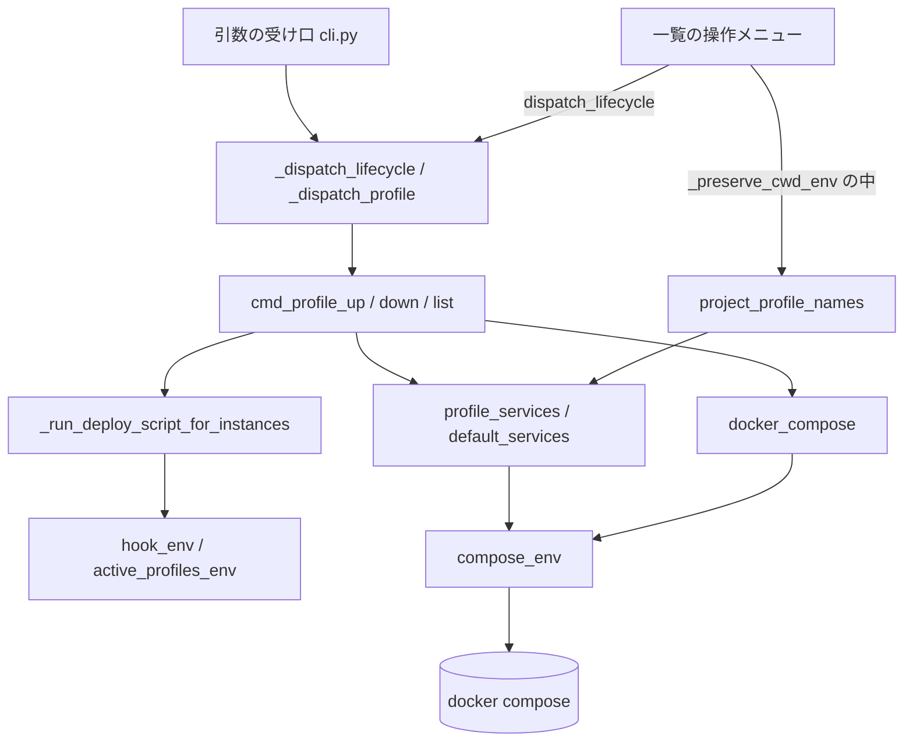

# 付随サービス群の後からの起動・停止（Compose の profiles）

## 概要

dev のほかに app / db などのサービスを持つプロジェクトで、`devbase up` の既定では
`profiles:` を持たないサービス（dev を含む）だけを起動し、`profiles:` を付けた付随サービス群は
`devbase project profile up|down` で後から起動・停止する。起動・停止のどちらでも dev
コンテナは操作の対象に入らず、再作成も再起動もされない。

プロジェクトは `compose.yml` の各サービスへ `profiles:` を書くだけでよい。プロファイル名は
プロジェクトが決め、devbase は既定のプロファイル名を持たない。devbase が担うのは、
プロファイルを指定して起動・停止する入口、停止（`devbase down` と `up` 冒頭）を全プロファイルへ
効かせること、devbase 経由の Compose で有効なプロファイルを devbase 自身が決めること、
フックと `devbase list` の TUI への反映である。

プロジェクト作者向けの書き方（`profiles:` と `depends_on.required` の例、フックでの分岐）は
[テスト用サーバを後から起動・停止する](../plugin-dev/compose-profiles.md) にある。

## 用語

| 用語 | 意味 |
| --- | --- |
| プロファイル | Compose の `profiles:` に書いた名前。付随サービス群をまとめる単位 |
| 既定のサービス | `profiles:` を持たないサービス。`devbase up` で起動する |
| プロファイルのサービス | そのプロファイルに属し、既定のサービスに含まれないサービス |
| 打ち消し用のプロファイル名 | `__devbase_none__`（定数 `NO_PROFILE`）。どのプロジェクトも定義しない名前で、devbase が子プロセスの `COMPOSE_PROFILES` へ入れて利用者の指定を無効にする |
| 生成物 | `devbase up` がプロジェクト直下に作る `.docker-compose.scale.yml`。プロファイルの解決と操作はすべてこのファイルを `-f` で渡して行う |
| 開発サービス名 | `get_dev_service_name()` が返す名前（`DEV_SERVICE_NAME`、既定 `dev`）。生成物では `<開発サービス名>-1`..`-N` へ複製される |

## 構成要素

| 要素 | 置き場所 | 責務 |
| --- | --- | --- |
| 子プロセスの環境と Compose の呼び出し | `lib/devbase/utils/docker.py` | `NO_PROFILE` / `compose_env`。`docker_compose` が `env=compose_env()` を渡す。`docker_compose_up(services=...)` が起動の対象を受け、`docker_compose_down` が `--profile '*'` を付ける |
| プロファイルの解決 | `lib/devbase/commands/container.py` | `_compose_lines` / `default_services` / `profile_services`。TUI 向けに対象プロジェクトへ切り替えて解決する `project_profile_names` |
| プロファイルの操作 | `lib/devbase/commands/container.py` | 共通の前段 `_profile_targets`、`cmd_profile_up` / `cmd_profile_down` / `cmd_profile_list`、`_dev_instance_indices`、`_running_services` / `_running_label` |
| 振り分け | `lib/devbase/commands/container.py` | `_dispatch_lifecycle` の handlers の `profile` と `_dispatch_profile`。名前を指定したときの切替 `_enter_project`。`cmd_container` の非推奨の警告 |
| `devbase up` の起動 | `lib/devbase/commands/container.py` | `_run_deploy_pipeline` が停止より前に `default_services` を求め、`docker_compose_up` へ渡す |
| `devbase scale` の起動 | `lib/devbase/commands/container.py` | `cmd_scale` が生成物を作った直後に `default_services` を求め、`docker_compose` へ `up -d --no-recreate <既定のサービス...>` を `check=False` で渡す |
| Compose 設定の読み取り | `lib/devbase/commands/container.py` | `_compose_config_services` が `docker_compose` で `config --format json` を読む唯一の関数。`_resolve_dev_service`（`build --expires` / `rebuild`）と `_ensure_images`（起動前のイメージ確認）がその上に載る |
| フックの環境変数 | `lib/devbase/project/runtime.py`、`commands/container.py` | `active_profiles_env` / `hook_env(config, active_profiles=())`。`_hook_vars`、`_run_deploy_script_for_instances(..., active_profiles=()) -> bool`、`_run_pre_up_hook` |
| 引数の受け口 | `lib/devbase/cli.py` | `_add_profile_subparser(sub, with_name=...)`、`SUBCMD_MAP` と `SUBCMD_PREFIX_PREFERENCES` |
| 一覧の操作メニュー | `lib/devbase/tui/actions_project.py` | `_PROFILE_OPS` / `_profile_names` / `_running_ops` / `_op_profile`、`_BACK_TO_TOP_OPS` |
| 復元境界 | `lib/devbase/tui/dispatch.py`、`lib/devbase/env/runtime.py` | `_preserve_cwd_env` が CWD・`os.environ`・機密の注入履歴（`snapshot_injected` / `restore_injected`）を戻す |
| エディタのコンテナ名の照会 | `lib/devbase/editor/opener.py` | `_query_container_name` の `ps --format json` に `env=compose_env()` を渡す |
| シェル補完 | `etc/devbase-completion.bash`、`etc/_devbase` | `project` / `container` の `profile` と、その下の `up down list` |

型（クラス）は追加していない。モジュール関数の並びで構成する。

## 仕様

### 有効なプロファイルの決め方

devbase 経由の Compose では、有効なプロファイルを devbase が経路ごとに `--profile` で決める。
端末の環境変数やプロジェクトの `.env` の `COMPOSE_PROFILES` で、起動・表示の対象を変えない。

`compose_env(environ=None)` は `environ`（既定は `os.environ`）の複製を作り、`COMPOSE_PROFILES`
を `__devbase_none__` にして返す。元の環境は変えない。次の経路が子プロセスへこの環境を渡す。

| 経路 | 場所 | 用途 |
| --- | --- | --- |
| `docker_compose` | `utils/docker.py` | `up` / `down` / `scale` の `up -d --no-recreate` / `profile up` / `profile down` / `profile list` の `ps`、`_compose_config_services` の `config --format json`（`build --expires` / `rebuild` と起動前のイメージ確認） |
| `_compose_lines` | `commands/container.py` | `config --profiles` / `config --services`（プロファイルの解決） |
| `_compose_run` | `commands/container.py` | `devbase ps` / `devbase logs` |
| `cmd_login` | `commands/container.py` | `devbase login` の `exec <開発サービス名>-<n> bash` |
| `_query_container_name` | `editor/opener.py` | エディタを開くときの `ps --format json` |

devbase が Compose を起動する経路はこの表の 5 つだけである。`docker_compose` 以外の 4 つは
`subprocess.run` を直接呼び、`env=compose_env()` を自分で渡す。打ち消しが要るのはプロファイルの
入口だからではなく、子プロセスへ利用者の値がそのまま渡るからである。読み取りだけの経路も
`exec` も同じ扱いにする。

値の決め方には次の理由がある。

- **キーを外すだけにしない。** Compose は環境変数が無ければプロジェクトの `.env` の値を採る。
  値を入れておけば、環境変数がファイルより優先される規則で `.env` の指定も無効になる
- **空文字列にしない。** 空の値が「空の一覧」と「未設定」のどちらに解釈されるかは版に依る
  可能性がある。打ち消し用のプロファイル名なら、どちらでも「その名前のプロファイルは無い」になる
- **`.env` は書き換えない。** `.env` は利用者とプロジェクトの持ち物で、書き換えると素の
  `docker compose` の挙動まで変わる。環境変数の上書きなら影響は devbase 経由に閉じる
- 打ち消し用のプロファイル名を入れると、既定のサービスがプロファイルのサービスへ `depends_on`
  を持つ構成でも、依存先としての起動が止まる。既定のサービスどうしの依存の待ち合わせは残る
- `--profile` と `COMPOSE_PROFILES` は和集合として扱われるため、`--profile` を明示する経路の
  対象は変わらない。環境変数だけでプロファイルを有効にする使い方は約束しない

`__devbase_none__` はプロジェクトが使ってはならない予約名である。定義すると、そのプロファイルが
devbase 経由の操作で常に有効になる。

### 組み立てるコマンド列

`docker_compose` は `docker compose -f <生成物>` の後に配列をそのまま並べる。`--profile` は
subcommand より前に置く。`<サービス...>` はプロファイル X に属するサービスの全件である。

| 操作 | コマンド列（`docker compose -f <ファイル>` の後） | 子プロセスの `COMPOSE_PROFILES` |
| --- | --- | --- |
| `devbase up` の起動 | `up -d <既定のサービス...>`（`--profile` なし） | `__devbase_none__` |
| `devbase scale` の起動 | `up -d --no-recreate <既定のサービス...>`（`--profile` なし） | `__devbase_none__` |
| `devbase down` / `devbase up` 冒頭の停止 | `--profile '*' down -t0` | `__devbase_none__` |
| `profile up X` | `--profile X up -d --no-deps <サービス...>` | `__devbase_none__` |
| `profile down X`（1 段目） | `--profile X stop <サービス...>` | `__devbase_none__` |
| `profile down X`（2 段目） | `--profile X rm -f <サービス...>` | `__devbase_none__` |
| `profile list` の稼働状況 | `--profile '*' ps --format json` | `__devbase_none__` |
| 既定のサービスの解決 | `config --services` | `__devbase_none__` |
| プロファイル名の解決 | `config --profiles` | `__devbase_none__` |
| プロファイル X の解決 | `--profile X config --services` | `__devbase_none__` |
| Compose 設定の読み取り | `config --format json`（`-f` なし） | `__devbase_none__` |
| `devbase login`（生成物あり） | `exec <開発サービス名>-<n> bash` | `__devbase_none__` |
| `devbase login`（生成物なし） | `exec --index=<n> <開発サービス名> bash`（`-f` なし） | `__devbase_none__` |

`docker_compose_up(compose_file, detach=True, services=())` は `services` が空なら従来どおり
サービス名を付けない。`docker_compose_down` は引数を増やさず、常に `--profile '*'` を付ける。

### `devbase up` と `devbase down`

`devbase up` は、その構成で開発環境を作り直す操作である。起動の前に全プロファイルを含めて
停止し、起動するのは既定のサービスだけにする。プロファイルのサービスが動いていても、`up` の後は
既定の状態へ揃う。プロファイルのサービスを使い続けるときは `up` の後にもう一度 `profile up` する。
後の状態が直前の操作に依存しないようにするためである。

`_run_deploy_pipeline` は `_previous_scale_compose` の中で、生成物を作った直後、既存コンテナの
停止**より前**に `default_services(override_file)` を求める。`config --services` が補間エラーなどで
失敗しても、稼働中の環境を止めず、旧構成の生成物を書き戻して止まる。求めた一覧は停止の後の
`docker_compose_up(..., services=services)` へ渡す。生成物は `up` のたびに作り直し、必ず
`<開発サービス名>-1`..`-N` を含むため、一覧は最新で空にならない。

起動の対象を明示するのは、打ち消し用のプロファイル名が効かない形でプロファイルが有効に
なっても、一覧に無いサービスを起動しないためである。停止は `--profile '*'` で対象を広げる向きの
指定のため、`.env` が別のプロファイルを有効にしても対象は狭まらない。`--profile '*'` を付けない
と、プロファイルのサービスが動いたまま残り、network の削除にも失敗する。

`devbase scale` は既存のコンテナを止めずにインスタンスを足す操作で、停止の段を持たない。
`cmd_scale` は生成物を作った直後に `default_services(override_file)` を求め、
`docker_compose(['up', '-d', '--no-recreate', *services], compose_file=override_file, check=False)`
で起動する。起動の対象を明示する理由は `up` と同じである。プロファイルのサービスは起動の対象に
入れず、既に動いているプロファイルのサービスは対象の外にあるため止めない。`check=False` で
終了コードを受け、0 以外なら `Failed to start new containers` を出して 1 を返す
（`docker_compose_up` は `check=True` 固定で、`subprocess.CalledProcessError` が `cmd_scale` の
`except DevbaseError` を素通りするため使わない）。`config --services` の失敗は `DevbaseError` として
`Scale failed: ...` で 1 になる。`project.yml` の `scale` はその時点で既に書き換わっている。
`cmd_up` が使う `_previous_scale_compose`（旧構成の退避と書き戻し）は `cmd_scale` に入れない。
`scale` には停止の段が無いので旧構成で停止する必要が無く、入れると失敗したときに生成物だけが
巻き戻り、`[1/5]` で既に書き換わった `project.yml` の `scale` と食い違うためである。

プロファイルを持たないプロジェクトでは、`up` / `down` / `scale` が扱うコンテナの集合と順序は
変わらない。プロファイルのサービスは scale の対象にせず、複製されるのは開発サービスだけである。

### プロファイルの解決

プロファイル名とサービスの対応は、生成物を `-f` で渡して `docker compose config` に問い合わせて
得る（`_compose_lines` が標準出力を空行を除いた行の一覧にし、非 0 の終了は `DevbaseError`
にする）。

| 関数 | 求め方 | 並び |
| --- | --- | --- |
| `default_services(compose_file, environ=None) -> list[str]` | `config --services` | Compose の出力順 |
| `profile_services(compose_file, environ=None) -> dict[str, list[str]]` | `config --profiles` で名前を得る。名前が無ければ `{}`。各 X について `--profile X config --services` から既定のサービスを差し引く | 名前もサービスも Compose の出力順 |

- 生成物を devbase が読んで解決しないのは、生成物に `profiles: ["${TEST_PROFILE:-test}"]` の
  ような変数の式が残るためである。Compose が展開した名前を使わないと、`list` が式を表示し、
  `profile up test` が未知の名前になる。既存の `_expand_env_vars` は `${VAR:-default}` を
  解釈しないため使わない
- `config --format json` を 1 回だけ呼ぶ形は採らない。この出力は有効でないプロファイルの
  サービスを含まないため、対応を作れない
- `config` はデーモンへ接続しない。名前と対応はデーモンへ接続できなくても解決できる

### コマンドの入出力

| コマンド | 入力 | 成功 | 失敗 |
| --- | --- | --- | --- |
| `devbase project profile up [name] <profile>` | プロファイル名（必須）、プロジェクト名（省略時は現在地） | サービスを起動し、`./deploy` があれば呼び直して 0 | 下表 |
| `devbase project profile down [name] <profile>` | 同上 | サービスを停止してコンテナを削除し 0。フックは呼ばない | 下表 |
| `devbase project profile list [name]` | プロジェクト名（省略可） | 表を標準出力へ出して 0 | 下表 |
| `devbase container profile up <profile>` / `down <profile>` / `list`（`ct` も同じ） | プロファイル名のみ | `project profile` と同じ | 同じ |

どれも `--context NAME` を受け付ける（[別ホストの Docker への dev コンテナ起動](remote-docker-context.md)）。

| 状態 | `up` / `down` | `list` |
| --- | --- | --- |
| 生成物が無い | `devbase up` を促すエラーを出して 1。Compose を呼ばない | 同じく 1 |
| `profile_services` が失敗した | エラーを出して 1 | 同じく 1 |
| 未知のプロファイル名 | 使えるプロファイルの一覧（無ければ `(なし)`）を出して 1 | 該当しない |
| `./deploy` があり `project.yml` を読めない（`DevbaseError`） | `up` は Compose を呼ばずに 1 | 該当しない |
| Compose が非 0 で終わった（デーモンへ接続できないときを含む） | その終了コードをそのまま返す。`down` は `stop` が失敗したら `rm` を呼ばない | 稼働状況の列を `不明` にして 0 |
| `./deploy` が 1 インスタンスでも失敗した | `up` は 1 | 該当しない |
| `profile` の後に操作が無い | エラーを出して 1 | 同じ |

引数の受け方は次のとおりである。

- `project profile up|down` の位置引数は既存の `scale` と同じ並びで、値が 1 個ならプロファイル名、
  2 個なら（プロジェクト名、プロファイル名）になる。名前を渡すと `_dispatch_lifecycle` が
  `_enter_project` で切り替える（切替元の機密を落とし、`projects/<name>` へ移動し、切替先の機密を
  注入する）。結果は、そのプロジェクトのディレクトリで名前を省いて実行した場合と同じである
- `container profile` / `ct profile` は `[name]` を受け付けず、現在地のプロジェクトで動く。
  `container` 群の既存の規約（`project` の `login` / `build` と同じ）に従う。`cmd_container` が
  非推奨の警告を 1 行出す
- 入れ子の subparser は `dest='profile_subcommand'` を使う。親の `subcommand` を再利用すると、
  `cli._dispatch` が `project profile list` を `project list`（プロジェクト一覧）へ流すためである
- 前方一致の省略は `project p` / `container p` を従来どおり `ps` に解決し（`SUBCMD_PREFIX_PREFERENCES`）、
  `project pr` は `profile` に解決する
- `bin/devbase` の `_PROJECT_NAME_SUBCOMMANDS`（`up down ps logs scale rebuild open`）に `profile` は
  入れない。wrapper は 3 番目の引数をプロジェクト名として解決するが、`profile` ではそこに
  `up` / `down` / `list` が来るため、同名のプロジェクトが実在すると誤って移動する。名前の解決は
  Python 側の `_dispatch_lifecycle` が行う

### `profile up`

`cmd_profile_up(profile, context=None)` は次の順で動く。

1. `_profile_targets`: `_prepare_compose(context)` で接続先を反映して機密を注入し、生成物の存在・
   `profile_services`・名前を検査する
2. `./deploy` があれば `project_runtime.current_project_config()` を読む
3. 対象を `logger.info` で 1 行残し、`--profile X up -d --no-deps <サービス...>` を呼ぶ
4. `./deploy` があれば `_run_deploy_script_for_instances(deploy, _dev_instance_indices(生成物), config, active_profiles=(X,))`
   を呼ぶ。`./pre-up` は呼ばない（コンテナ起動前の準備は `up` の役目である）

サービス名をすべて明示し、`--no-deps` を付けるのは、既定のサービスを操作の対象に入れないため
である。

- サービス名を省くと既定のサービスも照合の対象に入る。機密の値はプロセスの環境から解決される
  ため、値が変わっていれば dev が再作成されうる
- 生成物では、プロファイルのサービスの `depends_on: dev` が `dev-1`..`dev-N` へ書き換わる
  （`_build_scaled_services` が `_rewrite_depends_on` を非 dev サービスにも適用する）。Compose は
  依存先を対象へ取り込むため、明示だけでは dev が対象に入る。`required: false` は依存先が不在の
  ときのエラーを緩めるだけで、対象から外さない
- `--no-deps` は依存先を自動起動しないため、プロファイルのサービスは 1 つも漏らさず渡す。渡す集合は
  `profile_services` が生成物から求める
- 生成のときに devbase が `required: false` を補うことはしない。依存が必須かはプロジェクトの意図で
  あり、対象から外す役目は `--no-deps` が担う

`depends_on` の書き方（`[dev]` / `required: false` 付き）によらず、dev は対象に入らない。

### `profile down`

`cmd_profile_down(profile, context=None)` は `_profile_targets` の後、対象を `logger.info` で 1 行
残し、`--profile X stop <サービス...>` と `--profile X rm -f <サービス...>` を順に呼ぶ。

- `down <サービス...>` は使わない。Compose の対象選択は指定したサービスの依存元（そのサービスへ
  `depends_on` を持つ側）も含めるため、dev が db へ `depends_on` を持つ構成で dev まで消える。
  `required: false` はこれも止めない。`stop` / `rm` は依存元をたどらず、`down` のサービス指定が
  使える版を調べる必要も無くなる
- `stop` に `-t` を付けず、既定の猶予（10 秒）で止める。プロファイルに入るのはデータベースなど
  状態を持つサービスで、開発環境を残したまま止める操作だからである（`devbase down` は環境ごと
  畳むため `-t0`）
- `rm` には `-f`（確認の省略）だけを付け、`-v` は付けない。名前付きボリュームは残る
- `docker_compose_down` は通さず、この関数に引数も足さない。その呼び出し側は `devbase down` と
  `up` 冒頭の停止だけで、どちらも全体を `-t0` で落とす

### `profile list`

`cmd_profile_list(context=None)` は `_profile_targets` で対応を得て、次の表を出す。

| 列 | 内容 |
| --- | --- |
| PROFILE | プロファイル名（`config --profiles` の順） |
| SERVICES | そのプロファイルのサービス名をカンマ区切りで並べたもの |
| RUNNING | `稼働数/総数 状態語`、または `不明` |

| 稼働数 | 状態語 |
| --- | --- |
| 総数と同じ | `running`（例: `3/3 running`） |
| 1 以上で総数未満 | `partial`（例: `1/3 partial`） |
| 0 | `stopped`（例: `0/3 stopped`） |

稼働状況は `_running_services` が `--profile '*' ps --format json` で求め、`State` が `running`
のサービスだけを数える（`exited` / `paused` は数えない）。`--profile '*'` は、有効でない
プロファイルのサービスを `ps` に出さない版でも `stopped` に張り付かないためである。出力は
1 行 1 JSON と JSON 配列の両方を受ける。実行の失敗（`OSError`）・非 0 の終了・JSON として
読めない出力はすべて `不明` にして 0 で終わる。プロファイルが 1 つも無ければ `ps` を呼ばず、
見出しの行だけを出して 0 で終わる。

### フックの約束

`hook_env(config, active_profiles=())` は既存の `DEVBASE_PRIMARY_DIR` などに加えて、
`active_profiles_env(active_profiles)` が作る `DEVBASE_ACTIVE_PROFILES` を持つ。名前と区切り
（カンマ）を決めるのは `active_profiles_env` だけである。キーは値が空でも必ず持ち、呼び出し元の
環境に同名の値が残っていても上書きする。`project.yml` を渡さない呼び出し（`config=None`）でも
`_hook_vars` がこのキーだけは渡す。

| フック | 呼ぶ経路 | `DEVBASE_ACTIVE_PROFILES` |
| --- | --- | --- |
| `./pre-up` | `devbase up` のみ | 常に空 |
| `./deploy` | `devbase up` / `devbase scale` | 空 |
| `./deploy` | `devbase project profile up X` | `X` |

- `profile up` の後に新しいフックを作らず `./deploy` を呼び直す。`./deploy` は既にインスタンス
  ごとに冪等に書かれ、`DEVBASE_ACTIVE_PROFILES` で分岐できる。フック名を増やすと、プロジェクトが
  持つ約束とどちらに書くかの判断が増える
- 値は常にプロファイル名 1 つである。同時に 2 つ以上を起動する操作は無く、カンマ区切りは将来の
  拡張のための予約である。`profile up` を 2 回呼ぶと、2 回目のフックに渡るのは 2 回目の名前だけ
- `profile up` が `./deploy` を呼ぶ番号は、`_dev_instance_indices` が生成物の `services` から
  `<開発サービス名>-<数字>` に完全一致する名前を読んだ昇順の番号である。`project.yml` の `scale`
  は使わない。`up` の後に書き換えられると稼働中のインスタンスと食い違うためで、生成物は `up` が
  作った稼働中の構成と一致する。開発サービス名は `get_dev_service_name()` に従う
- `_run_deploy_script_for_instances` は失敗したインスタンスがあっても残りを実行し、全インスタンスで
  成功したかを返す。`profile up` は失敗を終了コード 1 に反映し、`up` / `scale` は従来どおり警告
  だけにとどめる

### `devbase list` の操作メニュー

`devbase list` で起動中の行を選ぶと `_operation_menu` が操作の一覧を出す。プロファイルを持つ
プロジェクトにだけ、`_RUNNING_OPS` の後へ次の 2 項目を足す（`_running_ops`）。

| 項目 | 値 | 選んだ後 |
| --- | --- | --- |
| テスト用サーバ起動 (profile up) | `profile-up` | プロファイル名を選ばせ `profile up` を実行し、一覧へ戻る |
| テスト用サーバ停止 (profile down) | `profile-down` | プロファイル名を選ばせ `profile down` を実行し、一覧へ戻る |

選べる操作は、選べば動くものに限る。持たないプロジェクトで出すと、選んだ後に「プロファイルが
ありません」と戻ることになるためである。

**出し分けの解決。** `_profile_names(name)` は `_preserve_cwd_env()` の中で
`container.project_profile_names(name)` を呼ぶ。`project_profile_names` は次のように動く。

1. `docker_context.reset()` の後、`_enter_project(name)` で対象プロジェクトへ切り替え、その `env`
   と機密を載せる。生成物が対象の `env` にだけある変数（`${VAR:?required}` など）を参照して
   いても解決できるようにするためである
2. 切替に失敗したか生成物が無ければ `[]`。あれば `profile_services` の名前の一覧を返す
3. `DevbaseError` / `OSError` は「持たない」として `[]` にする。操作メニューを出すこと自体を
   止めないためである
4. 最後に `docker_context.reset()` と `runtime.release_store()` を行う

解決にデーモンは要らないため、接続できない状態でも項目は出る。

**復元境界。** `_preserve_cwd_env` は入口で CWD・`os.environ`・機密の注入履歴
（`runtime.snapshot_injected()`）を控え、終わりに 3 つを同時に戻す（`restore_injected`）。
ハンドラの中で別プロジェクトへ切り替えると注入履歴は切替先のものになる。値だけを戻すと、次の
`clear_injected` が切替元固有の機密を知らずに残し、次に操作するプロジェクトの Compose 子プロセスへ
渡すためである。メニュー表示時の解決と `dispatch_lifecycle` の両方がこの境界を通る。

**選択と委譲。** `_op_profile(operation)` は、選ばれた時点でもう一度 `_profile_names` を解決する。

- 解決が空（項目を出した後の状態変化・解決失敗）なら警告を出し、選択を出さずにサブメニューへ戻る
- 名前が 1 つだけでも `menu.select` で選択として出す。Esc / ← はサブメニューへ戻る
- 選ばれた名前で `dispatch_lifecycle('profile', name, profile_subcommand=operation, profile=...)`
  へ委譲する。TUI はコマンドの中身を持たない
- 2 項目は `_BACK_TO_TOP_OPS` に入る。コンテナの数が変わるため、実行後は一覧へ戻って STATUS を
  更新して見せる

questionary が無い端末の代替経路（番号入力して `up`）は変わらない。

### 対応する Docker Compose の版

最低対応版は **Docker Compose 2.20.0** である。

| 使う機能 | 版の下限 |
| --- | --- |
| `--no-deps`、サービスを明示した `up` / `stop` / `rm -f` | 作らない（2 系全般で使える） |
| `depends_on.required` | 2.20.0。プロジェクトが書き、案内する構成例が使う。2.20.0 未満では `required: false` を書いた構成の検証に失敗するため対象外とする |
| `--profile '*'` | 公式ドキュメントに版の記載が無い |

**未確認の事項（この仕様の制約）。** 動作を確かめたのは Docker Compose v5.1.4 だけである。
`--profile '*'` は v5.1.4 でのみ確認済みで、2.20.0 以上 5.x 未満は未検証である。ワイルドカードを
解釈しない版で `*` がリテラルのプロファイル名として扱われ、停止の対象が従来と同じに留まるか
（想定）も未確認である。この経路は `devbase down` と `up` 冒頭の停止に入り、プロファイルを
使わない全プロジェクトを通る。

## データ・設定

### `compose.yml` と生成物

プロジェクトはサービスへ `profiles:` を書く。`devbase up` が作る生成物
`.docker-compose.scale.yml` は、プロファイルのサービスの `profiles:` をそのまま保つ。
`depends_on` の長い書式（`condition` / `required`）も保ち、依存先が開発サービスなら
`<開発サービス名>-1`..`-N` の各要素へ写す。開発サービスがプロファイルのサービスへ持つ
`depends_on` の `required` も保つ。

### 環境変数

| 名前 | 向き | 意味 |
| --- | --- | --- |
| `COMPOSE_PROFILES` | 出力（devbase 経由の Compose の子プロセス） | 常に `__devbase_none__`。利用者の端末の値と `.env` の値は効かない |
| `DEVBASE_ACTIVE_PROFILES` | 出力（`./pre-up` / `./deploy`） | 有効なプロファイル名。`profile up X` の `./deploy` だけ `X`、それ以外は空 |
| `DEV_SERVICE_NAME` | 入力 | 開発サービス名。`profile up` がフックを呼ぶ番号の読み取りに使う |

## セキュリティ

プロファイルのサービスへ渡る機密は、そのサービスが元々 `env_file` で参照していた由来のキーに
限る（`volume/compose.py` の `_services_receiving_secrets` の規則）。プロファイルの操作は生成物を
そのまま使い、実行前に `_prepare_compose` で既存と同じ注入を通すため、新しい注入経路を作らない。
素の `docker compose` ではなく devbase を通すのは、機密の注入と対象サービスの限定をこの規則の中で
行うためである。

TUI では、復元境界が機密の注入履歴も戻すため、別プロジェクトを続けて操作しても前のプロジェクト
固有の機密が次の Compose の子プロセスへ渡らない。

## 運用

- `devbase up` はプロファイルのサービスも止め、既定のサービスだけを起動する。テスト用サーバを
  使い続けるなら `up` の後に `profile up` をやり直す
- `devbase down` はプロファイルのサービスも含めて削除する。`devbase scale` はプロファイルの
  サービスを複製せず、起動の対象にも入れない。既に動いているプロファイルのサービスは止めない
- `COMPOSE_PROFILES` を端末や `.env` に置いても devbase 経由の操作には効かない。素の
  `docker compose` には従来どおり効く
- プロファイル名に `__devbase_none__` を使わない
- 起動・停止の記録は `logger.info` の 1 行（プロファイル名と対象サービス）で残る。Compose の出力は
  そのまま標準出力へ流れる
- 最低対応版と未確認の事項は「対応する Docker Compose の版」のとおり

## テスト観点

自動テストは `subprocess.run` を差し替えて、組み立てたコマンド列・子プロセスの環境・終了コードを
検査する。実 docker と実 `DEVBASE_ROOT` には触れない。

- `compose_env` が `COMPOSE_PROFILES` を打ち消し用の名前にし（未設定でも入れる）、プロセスの環境を
  変えないこと。`docker_compose`・`ps` / `logs`・`config --services`・`login` の `exec`
  （生成物あり・なし）・エディタの `ps` がその環境を渡し、`config --format json` を読む 2 経路が
  `docker_compose` を通ること。`_compose_config_services` が非 0 で空の `services`、読めない JSON で
  `json.JSONDecodeError` を返し、`_resolve_dev_service` がどちらでも `None` を返すこと。`down` が `--profile '*' down -t0` になり、`up` がサービス無しで従来の形、
  サービス有りで `--profile` 無しに名前を並べること（`tests/utils/test_docker_profiles.py`）
- `devbase up` が生成物の既定のサービスを起動へ渡し、`default_services` が失敗したときは
  コンテナを止めないこと（`tests/commands/test_container_up_order.py`）。既存の `up` の harness は
  `default_services` を差し替える（`test_up_roundtrips.py` / `test_container_context.py` /
  `test_container_bao.py` / `tui/test_dispatch.py`）
- `devbase scale` が `up -d --no-recreate <既定のサービス...>` を打ち消し用の名前で起動し、呼び出し側の
  `os.environ` を変えないこと。起動の非 0 で `Failed to start new containers` と 1 になり例外を
  出さないこと。プロファイルのサービスを起動の対象に入れないこと。正常系の順序
  （グループの検査 → `write_scale` → ボリューム → network → 生成 → `default_services` → 起動 →
  ready 待ち → bao の token → `./deploy`）、bao と `./deploy` の範囲が `current + 1` から `new` まで
  であること、停止を呼ばないこと（`tests/commands/test_container_scale_order.py`）
- `default_services` が打ち消し用の名前で `config --services` を呼ぶこと、`profile_services` が
  既定のサービスを差し引き、Compose が展開した名前を使い、プロファイルが無ければ空、解決の失敗で
  `DevbaseError` になること。生成物が無いときに Compose を呼ばずに 1、未知の名前で起動・停止を呼ばずに
  既知の名前を出して 1、`profile up` が全
  サービスと `--no-deps` を渡し、Compose の終了コードを返し、生成物の番号と `DEV_SERVICE_NAME` に
  従って `./deploy` を走らせ、`./deploy` の失敗と `project.yml` の `DevbaseError` で 1 になること。
  `profile down` が `stop` → `rm -f`（`-v` なし）で、`stop` の失敗で `rm` を呼ばず、`rm` の失敗で
  非 0 になること。`profile list` の 3 つの状態語、`--profile '*'` 付きの `ps`、デーモン不通・
  `ps` の失敗・読めない JSON での `不明` と 0、JSON 配列の受け取り、プロファイルが無いときの
  見出しだけの出力（`tests/commands/test_container_profile.py`）
- `project profile` の `[name] <profile>` の割り当て、`list` の任意の名前、`container profile` が
  名前を拒むこと、`project profile list` が `project list` へ流れないこと、名前の解決が先に行われる
  こと、`container` / `ct` が同じ委譲で警告を 1 行だけ出すこと、操作なしで 1、`p` が `ps`・`pr` が
  `profile` に解決されること（`tests/cli/test_profile_dispatch.py`）
- `DEVBASE_ACTIVE_PROFILES` が `up` の `./pre-up` / `./deploy` で空、`profile up` の `./deploy` で
  全インスタンスにプロファイル名、`config` 無しでも渡ること、1 インスタンスの失敗を返すこと
  （`tests/commands/test_hook_env.py`）
- TUI の 2 項目がプロファイルを持つときだけ出て、解決が空・失敗・生成物なしでは出ないこと、1 件でも
  選択を出して委譲の属性が `profile` / 名前 / `profile_subcommand` / `profile` になること、選択の
  Back と 2 回目の解決が空のときにサブメニューへ戻ること、実行後に一覧へ戻ること、解決が対象
  プロジェクトの CWD・`env`・機密の上で行われ、CWD と `os.environ` が戻ること
  （`tests/cli/tui/test_profile_menu.py`）
- `_preserve_cwd_env` が注入履歴を戻すこと（`tests/cli/tui/test_dispatch.py`）、
  `snapshot_injected` / `restore_injected` の往復・後の注入で控えが変わらないこと・空の控えで履歴を
  消すこと（`tests/env/test_runtime.py`）
- 生成物が非 dev サービスの `profiles` と、`depends_on` の `condition` / `required` を保つこと
  （`tests/volume/test_compose_profiles.py`）
- シェル補完の `profile` と `up down list`（`tests/cli/test_completion.py`）

実コンテナが要る条件は手動確認で判定する（Docker Compose v5.1.4、`alpine:3` の最小構成）。

| 確認すること | 手順 |
| --- | --- |
| `up` は既定のサービスだけを起動し、`profile up` / `profile down` の前後で dev-1..N の Container ID と `StartedAt` が変わらない。`profile down` 後も名前付きボリュームが残り、`down` で全コンテナと network が消える | `up` → `profile up X` → `profile down X` → `down` を通し、`docker inspect` の値を段ごとに比べる。`project.yml` の `scale` を書き換えた後の `profile up` で `./deploy` が生成物の全インスタンスへ走ることも見る |
| 依存を `depends_on: [dev]` で書いても dev が変わらない | 同じ手順 |
| dev の環境変数の値を変えても `profile up` が dev を再作成しない | 値を変えてから `profile up X`。`--no-deps` 無しでは再作成されることを dry-run で見る |
| dev がプロファイルのサービスへ `depends_on`（`required: false`）を持っても `profile down` が dev を止めない | `profile up X` → `profile down X` の前後で比べる |
| 端末の環境変数と `.env` の `COMPOSE_PROFILES` が `up` に効かない | 両方の置き方で `up` を通し、dev だけが動くこと、続く `profile up` / `down` が効くことを見る |
| プロファイルを持たない構成の `up` / `down` が従来どおり | 全サービスの起動と、`down` の後に何も残らないことを見る |
| デーモン不通で `list` が `不明` と 0、`up` / `down` が 1 | `DOCKER_HOST` を存在しないソケットへ向けて実行する |

実プロジェクトでの `devbase up` 全経路、`devbase list` の TUI の目視、Compose 2.20.0 以上 5.x 未満
での `--profile '*'` は、配布後の確認の対象である。

## 関連リンク

- [テスト用サーバを後から起動・停止する（プロジェクト作者向け）](../plugin-dev/compose-profiles.md)
- [CLI リファレンス: `devbase project profile`](../user/cli-reference/02-project.md#devbase-project-profile)
- [プラグイン開発クイックスタート: フックへ渡る環境変数](../plugin-dev/quickstart.md#フックへ渡る環境変数)
- [別ホストの Docker への dev コンテナ起動（docker context）](remote-docker-context.md)
- [機密ストアの保存先の差し替え](secret-backend.md)
- 課題: devbasex/devbase#189。設計 PR: #190、実装 PR: #191
- [Compose file reference: `depends_on`](https://docs.docker.com/reference/compose-file/services/#depends_on)
- [Using profiles with Compose](https://docs.docker.com/compose/how-tos/profiles/)
