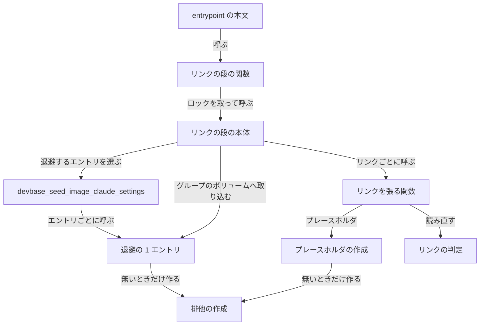
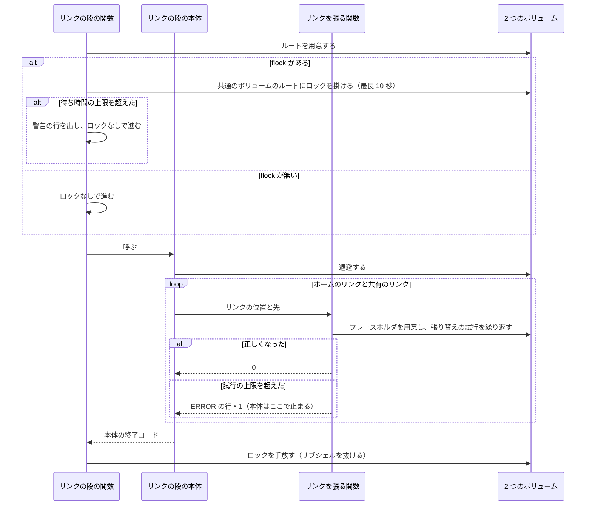
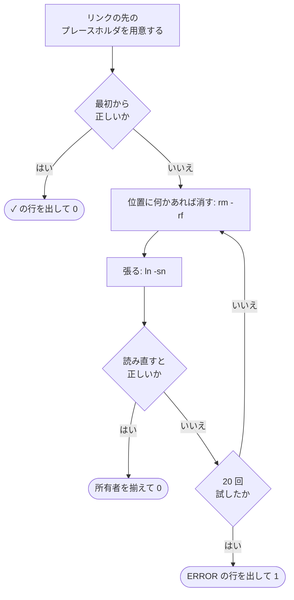
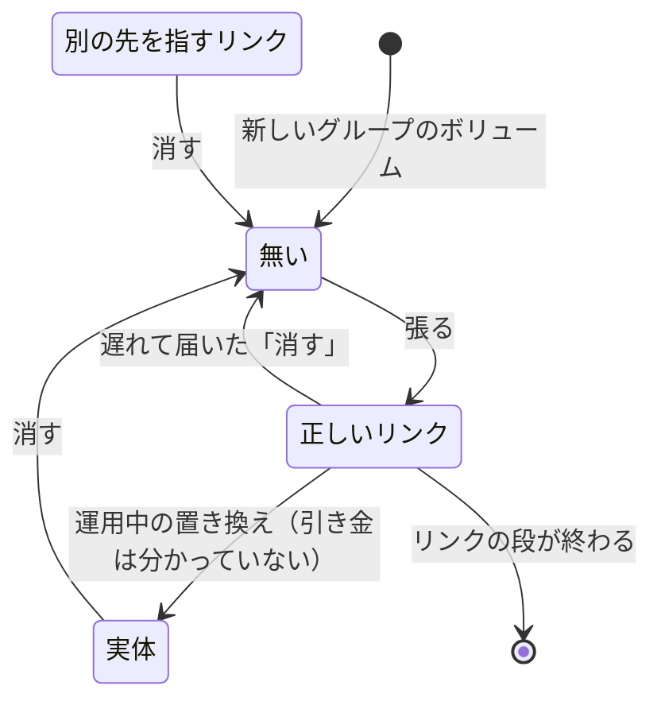
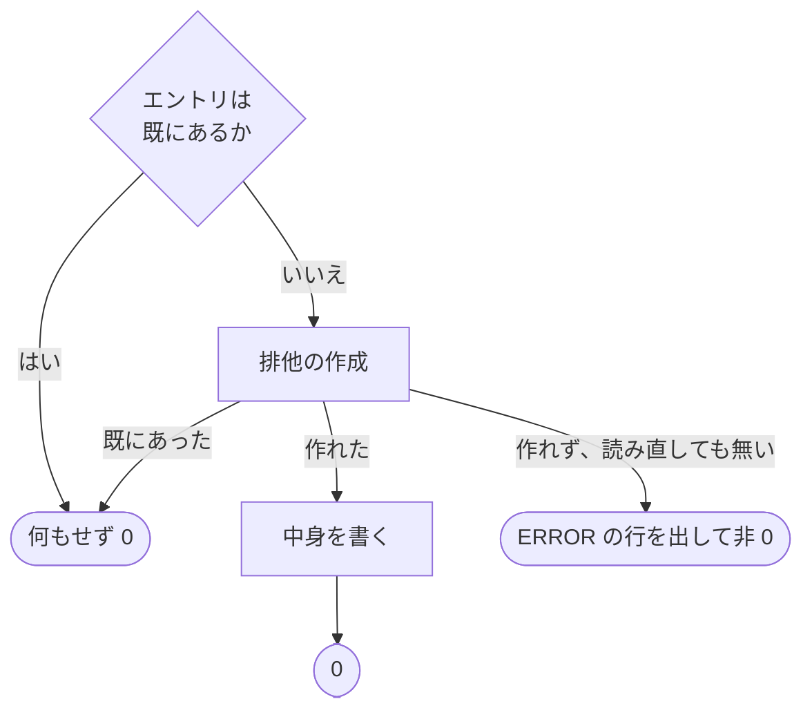

# 同時起動でもリンクの段が失敗しない張り方（entrypoint の AI 設定のリンク）

## 概要

base イメージの entrypoint（`containers/base/entrypoint.sh`）は、起動のたびに AI 設定のリンクを張る（リンクの段）。
同じアカウントグループのコンテナは、グループのボリュームの `.claude` の下にある共有のリンク 5 本
（`plugins` / `skills` / `commands` / `CLAUDE.md` / `settings.json`）を同じ 1 本ずつ使うため、ホストの再起動の後の
一斉起動や、`scale` が 2 以上のプロジェクトの `devbase up` では、リンクの段が時間の上で重なる（同時起動）。

リンクの段は、同時起動でも、変更前のイメージのコンテナと並んでも失敗せず、1 つずつ順に走らせたときと同じ状態を
2 つのボリュームに残す。そのために次の 3 つを持つ。

- **リンクの段のロック**: 共通のボリュームのルートのディレクトリに `flock` を掛け、リンクの段どうしを 1 つずつ順に走らせる
- **張り替えの試行**: リンクを張る操作の成否ではなく、張った後に読み直した結果で成功を決める
- **排他の作成**: 退避とプレースホルダは、エントリを「無いときだけ作る」操作で作れた 1 つのプロセスだけが中身を書く

コマンド・環境変数・compose の生成物は持たない。効くのは base イメージを建て直した後のコンテナからである。

## 用語

語の定義は [用語集: コンテナの起動（`container-start`）](../glossary.md#コンテナの起動container-start) にある。
使う語: 共通のボリューム・共有のリンク・リンクの段・同時起動・修正前の手順・リンクの段のロック・ロックの待ち時間の上限・
張り替えの試行・入れ子のリンク・排他の作成。アカウントグループとグループのボリュームは
[機密の置き場（`secret`）](../glossary.md#機密の置き場secret) の語をそのままの意味で使う。

この仕様は `container-start` のコンテキストで閉じる。コンテナを起動する側（`devbase up` / `devbase scale`）には
触れない。

## 構成要素

| 要素 | 置き場所（`containers/base/entrypoint.sh`） | 責務 |
| --- | --- | --- |
| リンクの段の関数 | `devbase_setup_ai_settings` | 2 つのボリュームのルートを用意し、サブシェルの中でリンクの段のロックを取って本体を呼ぶ。本体の終了コードをそのまま返す |
| リンクの段の本体 | `devbase_apply_ai_settings` | 退避（イメージの `~/.claude` の初期設定を共通のボリュームへ、Kiro CLI の認証の状態をグループのボリュームへ）・ホームのリンク・共有のリンクを、この順で行う |
| リンクを張る関数 | `devbase_link_setting` | リンクの先のプレースホルダを用意し、張り替えの試行を繰り返す |
| リンクの判定 | `devbase_link_is_set` | リンクの位置が、渡した先を指す symlink かを終了コード（0 / 1）で返す。何も出力しない |
| 退避の 1 エントリ | `devbase_seed_entry` | コピー先のエントリを排他の作成で作り、作れたときだけ中身をコピーする |
| プレースホルダの作成 | `devbase_ensure_entry` | 無いエントリを排他の作成で作り、作れたときだけ中身（JSON のファイルは `{}`）を書く |
| 排他の作成 | `devbase_create_entry` | エントリを無いときだけ作り、結果を終了コード（作れた 0 / 既にあった 1 / 作れない 2）で返す |
| 上限の定数 | `DEVBASE_LINK_LOCK_WAIT`（10）・`DEVBASE_LINK_TRIES`（20） | ロックの待ち時間の上限（秒）と試行の上限（回） |

関数と定数は `DEVBASE_ENTRYPOINT_LIB_ONLY` の `return` より前に置く。テストが関数だけを読み込んで走らせるためである。
リンクを張る関数は、ホームのリンク（`~/.shellrc.d` などを含む。[shellrc-dir.md](shellrc-dir.md)）にも共有のリンクにも
同じものを使う。分けると、位置に実体があるときの扱いを 2 か所で保つことになる。ホームのリンクでは試行が 1 回で終わる。

## 仕様

### 集約

| 集約 | 持ち主 | 根 | エンティティ | 値オブジェクト |
| --- | --- | --- | --- | --- |
| 共有のリンク | リンクを張る関数（`devbase_link_setting`） | 共有のリンク（グループのボリュームの `.claude` の下の位置で識別する） | — | リンクの先（パスの文字列）・位置の状態（無い / 正しいリンク / 別の先を指すリンク / 実体） |
| リンクの段 | リンクの段の関数（`devbase_setup_ai_settings`） | リンクの段の 1 回の実行 | 張り替えの試行（リンクごとの何回目かで識別する） | ロックの結果（取れた / 待ち時間の上限を超えた / `flock` が無い）・排他の作成の結果（作れた / 既にあった / 作れない）・2 つの上限 |

共有のリンクの持ち主は関数として 1 つだが、同じグループのコンテナの数だけ別々のプロセスで動く。変更前のイメージの
コンテナも、ロックを取らずに同じ位置を書く（修正前の手順）。下の条件は、ほかのプロセスが同じ位置を書き換える
ことを前提に保つ。

### リンクの段

- ルートの用意（`devbase_ensure_persistent_root`）はロックの前に行う。ロックを掛ける相手のディレクトリが要るため
  である。中身は「無ければ作る・書けなければ所有者を直す」で、重なっても結果は変わらない
- ロックは共通のボリュームのルートのディレクトリそのものに掛け、ロックのためのファイルを作らない。退避が書く共通の
  ボリュームはすべてのコンテナが共有するため、ここに 1 つ置けば、グループのボリュームの処理も含めてリンクの段の全体が
  順に走る。ボリュームに残るものが無く、変更前の手順とスナップショットから見える並びが変わらない。別のグループの
  コンテナも順番を待つが、リンクの段 1 回は 0.1 秒ほどである
- ロックはサブシェルにだけ付けた fd 9（`exec 9<"$ai_root"`）で持ち、同じサブシェルの中で本体を呼ぶ。サブシェルを
  抜ければ成功でも失敗でも fd が閉じてロックが外れ、entrypoint が最後に `exec` するコマンドへ引き継がない。
  持ったプロセスが kill されたときはカーネルが外す
- ロックは 10 秒まで待ち、取れなければ警告を出してロックなしで進む。止まったまま終わらない持ち主が 1 つあるだけで、
  ホストのすべてのコンテナの起動が止まるのを避けるためである。ロックなしでも、共有のリンクは張り替えの試行で正しく
  なり、退避とプレースホルダは排他の作成で 1 つのプロセスだけが書く。失うのは、リンクの段の全体が 1 つずつ順に走る
  保証だけである。10 秒は 8 個が順に走る所要（実測で 2 秒未満）より長い
- `flock` が無い環境（開発者の macOS）でも止めずにロックなしで進む

### 張り替えの試行

- 消す操作と張る操作は、失敗してもそこで終わらない。標準エラーは捨てずに控え、最後の ERROR の行にだけ使う
- 張る操作には `-n` を付ける。`-n` の無い `ln -s` は、位置が既にディレクトリを指すリンクだと失敗せず、その先の
  ディレクトリの中へリンクを作って 0 で終わる（入れ子のリンク。例: 共通のボリュームの `plugins/plugins`）。`-n` を
  付けると位置そのものを対象にして失敗し、読み直しへ進む
- 試行の間に待ち時間は置かない。次の試行が要るのは、相手のプロセスが位置を書き換えたときだけである
- 一時的な名前で張ってから `mv -T` で置き換える方式は採らない。位置が実体のディレクトリのときに置き換えられず、
  `mv -T` は macOS に無く、途中で kill されると一時的な名前がボリュームに残るためである
- リンクの位置に実体（通常のファイル・ディレクトリ・別の先を指すリンク）があるときは、消して張り直す

共有のリンクの位置が取る状態と遷移は次のとおりである。「別の先を指すリンク」は、指す先の無い壊れたリンクを含む。
遅れて届いた「消す」は、正しくなる前に「違う」と判定を済ませていたプロセス（修正前の手順の相手と、ロックなしで
進んだリンクの段）が出す。

修正前の手順で張る相手と重なったときは次のとおり進む。修正前の手順の相手が消すのは 1 プロセスにつき 1 回で、
同時起動が 8 個なら試行は 9 回までに収まる。試行の上限の 20 回は、その 2 倍の余裕である。

| 重なり方 | リンクの段の側 | 修正前の手順の相手 |
| --- | --- | --- |
| 相手が先に張り、その後でこちらが張る | 張る操作は失敗するが、読み直すと正しいので 0 | 0 |
| こちらが張った後で、相手が消して張る | 読み直した時点で正しければ 0。消された直後なら次の試行で張る | 0 |
| こちらが張った後で、消し終えていた相手が張る | 0 | ファイルのリンクでは非 0。ディレクトリのリンクでは入れ子のリンクを作って 0 |

### 退避とプレースホルダ

- 通常のファイルは bash の noclobber（`set -C` を付けたサブシェルの `>`）で空のファイルとして作る。作れたプロセスが、
  その空のファイルへ中身を書く（退避は `cp -a` で上書きし、JSON のプレースホルダは `{}` を書く）
- ディレクトリは `perl` から `mkdir(2)` を呼んで作る。base イメージの `mkdir`（uutils coreutils）は、同時に呼ぶと
  2 個以上が 0 で終わり、作れたプロセスを 1 つに決められないため使わない。`perl` は base イメージに必ずある
  Essential のパッケージ（perl-base）で、道具を足さない。`perl` が無い環境では `mkdir` で作り、止めない
- 作る操作の終了コードが非 0 のときは読み直して決める。エントリがあれば「既にあった」（1）、無ければ「作れない」（2）
- 退避でディレクトリの子を `cp -a` でコピーするのは、作れたプロセスだけである。既にある子のディレクトリをコピー先に
  する `cp -a` が走らないため、子の中へ重ねてコピーしない（`plugins/<名前>/<名前>` を作らない）
- 作れなかったプロセスは、作れたプロセスが中身を書き終えるのを待たずにリンクへ進む

### 起動ログ

| 場合 | 行 | 出力先 |
| --- | --- | --- |
| リンクが最初から正しい | `  ✓ <リンクの位置> (symlink exists)` | 標準出力 |
| 位置に何かあり、消す | `  Removing existing <リンクの位置>...`（1 回目の試行でだけ出す） | 標準出力 |
| 張る | `  Creating symlink: <リンクの位置> -> <リンクの先>`（1 回目の試行でだけ出す） | 標準出力 |
| 張る操作か消す操作が失敗したが、読み直すと正しい | 何も足さない（`ln:` と `rm:` の行を出さない） | — |
| 試行の上限まで正しくならない | `ERROR: symlink を張れない: <リンクの位置> -> <リンクの先> (<最後に失敗したコマンドの出力>)` | 標準エラー |
| 排他の作成で作れなかったが、読み直すとエントリがある | 何も足さない | — |
| エントリを作れず、読み直しても無い | `ERROR: エントリを作れない: <エントリのパス> (<失敗したコマンドの出力>)` | 標準エラー |
| ロックを待ち切れなかった | `WARNING: リンクの段のロックを 10 秒待っても取れないため、ロックなしで進める: <共通のボリュームのルート>` | 標準エラー |

終了コードは、リンクの段の関数もリンクを張る関数も成功が 0、失敗が非 0 である。entrypoint は `set -e` で動くため、
リンクの段の関数が非 0 を返すとコンテナの起動が止まる。2 つの上限は環境変数から読まない（テストは関数を読み込んだ
後に定数を上書きして確かめる）。

### 常に成り立つ条件

- リンクを張る関数が 0 で返るのは、リンクの位置が正しい先を指す symlink であると読み直して確かめたときだけである。
  `ln` と `rm` の終了コードでは決めない
- 張る操作は、位置がディレクトリを指すリンクになっていても、その先のディレクトリの中へリンクを作らない
- 試行の上限（20 回）まで正しくならなければ、非 0 で返り、リンクの位置のパスを含む行を標準エラーへ出す
- 0 で返るとき、`ln:` で始まる行を出さない
- ロックを取れたリンクの段どうしは、退避・プレースホルダ・リンクの処理が時間の上で重ならない
- ロックを取れない（待ち時間の上限を超えた・`flock` が無い）ときは、止まらずに進み、上の条件と排他の作成の条件を守る
- ロックは、リンクの段を抜けた後（成功でも失敗でも）に残らず、entrypoint が最後に起動するコマンドへ引き継がない
- 2 つのボリュームに、ロックのためのファイルも、一時的な名前のエントリも作らない
- 退避とプレースホルダが 2 つのボリュームに作るエントリは、排他の作成で作れた 1 つのプロセスだけが中身を書く。
  ロックを取れたかどうかによらない

どのホームにも同じ中身がある同時起動では、ロックを取れなくても、2 つのボリュームに残る並び・リンクの先・ファイルの
中身が、1 個だけ走らせた後と同じになる。

## 運用

- 反映には `devbase build base` で base イメージを建て直し、派生イメージも建て直す。建て直すまで、変更前のイメージの
  コンテナは同時起動で落ちることと、入れ子のリンクを作ることが残る。同じグループに変更前と変更後のイメージの
  コンテナが並んでも、変更後のコンテナは落ちない
- ロックを取れず、ホームの中身が違うコンテナが同時に退避するときは、エントリごとに排他の作成で作れた 1 つの
  コンテナの中身が丸ごと残る（エントリによって作れたコンテナが違うことがある）。ロックを取れたときは起きない
- 排他の作成で作れたプロセスが中身を書き終える前に kill されると、書きかけのエントリが残り、次のリンクの段は
  「既にある」として退避しない（1 個だけで走らせて退避の途中で kill されたときと同じ）
- 初回の起動で派生イメージが `~/.claude` に大きなディレクトリを持ち、退避が 10 秒を超えると、待つ側はロックなしで進む。
  共有のリンクは正しくなるが、起動の直後に共通のボリュームの中身が揃っていない時間がある
- 変更前の手順が過去に作った入れ子のリンクは片付けない
- リンクの段の外の entrypoint の処理（Git・AWS・GCP の資格情報、リポジトリの clone、Docker-in-Docker）はロックの外で動く

## テスト観点

関数の水準のテストは Docker を使わず、別々のホームと同じ 2 つのボリューム（一時ディレクトリ）を渡したリンクの段を
同時に始める。1 回の同時実行では変更前の手順でも通ることがあるため、1 件の中で同時実行を繰り返し、1 回でも条件が
破れたら落ちる形にする（`tests/containers/test_entrypoint_ai_settings_concurrent.py`）。

- `settings.json` だけが通常のファイルの状態で 2 個・8 個同時に走らせると、全部が 0 で終わり、`settings.json` が共通の
  ボリュームを指し、共通のボリュームの中身が変わらないこと
- 2 つのボリュームが空で、どのホームにも同じ中身がある状態で 8 個同時に走らせた後の並び・リンクの先・中身が、
  1 個だけ走らせた後と同じであること。`flock` が無い状態でも同じであること
- グループのボリュームが空・`plugins` が実体のディレクトリ・別の先を指すリンク・壊れたリンクのそれぞれで 8 個同時に
  走らせると、全部が 0 で終わり、リンクが共通のボリュームを指すこと
- 修正前の手順で張る相手と同時に走らせても、こちらが 0 で終わり、共有のリンクが正しいこと。リンクの段の後に修正前の
  手順を同じボリュームで走らせても 0 で終わること
- 消した直後にほかのプロセスが同じリンクを張り終えた状態で 0 を返し、`plugins` の中に入れ子のリンクを作らないこと
- グループのボリュームの `.claude` に書き込めない・退避のコピー先の親に書き込めない状態で、非 0 で終わり、そのパスを
  含む行を標準エラーへ出すこと（root では状態を作れないため skip する）
- 0 で終わった出力に `ln:` で始まる行が無く、ボリュームにロックのためのエントリも一時的な名前のエントリも無いこと
- 排他の作成を 8 個同時に呼ぶと、通常のファイルでもディレクトリでも 0 を返すのは 1 個だけで、既にあるエントリには 1 を
  返して中身を変えないこと。`perl` が無い状態で 1 個だけ走らせた結果が、`perl` がある状態と同じであること
- ロックの持ち主がいる間は待ち、手放された後に進むこと。持ち主が手放さないときは待ち時間の上限の後に警告して 0 で
  終わること。持ち主が kill されたとき・張りかけで終わった後から走らせたときも 0 で終わること。リンクの段から戻った
  後にほかのプロセスが待たずにロックを取れること（`flock` が無い macOS では skip する）
- 8 個同時に走らせたとき 8 個すべてが 30 秒以内に終わること。1 個だけの所要（CPU 時間）が、修正前の手順の所要に
  1 秒を足した値を超えないこと
- 既存の `tests/containers/test_entrypoint_ai_settings.py` が書き換えずに通ること

実物の base イメージでは、作業ツリーの `entrypoint.sh` を読み取り専用でマウントし、使い捨ての名前のボリューム 2 つで
コンテナ 8 個を同時に起動して、全部の entrypoint が 0 で終わることと、base イメージの道具（uutils の `ln` / `mkdir`、
`perl`）で排他の作成が 1 つのプロセスにだけ通ることを確かめる（`tests/containers/test_base_image_link_stage.py`）。
利用者のイメージのタグもボリュームも置き換えず、Docker かイメージが無ければ skip する（CI では skip になる）。

## 関連リンク

- [用語集: コンテナの起動（`container-start`）](../glossary.md#コンテナの起動container-start)
- [機密ストアの保存先の差し替え（secret-backend.md）](secret-backend.md)（アカウントグループとグループのボリューム）
- [shellrc-dir.md](shellrc-dir.md)（同じリンクを張る関数とプレースホルダの作成を使う `~/.shellrc.d`）
- [起動の後の処理（post-start.md）](post-start.md)（1 台が起動できなかったときの `up` / `scale` の扱い）
