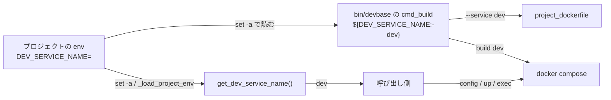

# 開発サービス名の読み方（`DEV_SERVICE_NAME`）

## 概要

プロジェクトの compose の構成で、どのサービスを開発サービスとして扱うかは、プロジェクトの `env` に書く
環境変数 `DEV_SERVICE_NAME` で決める。**未設定か空（長さ 0 の文字列）なら `dev`、それ以外は値をそのまま使う。**

この名前は 2 つの実行の単位がそれぞれ決める。`bin/devbase`（Bash）は `${DEV_SERVICE_NAME:-dev}` で、
`lib/devbase`（Python）は `lib/devbase/volume/compose.py` の `get_dev_service_name()` で決め、2 つは同じ値から
同じ名前を得る。`DEV_SERVICE_NAME=` と空で書いたプロジェクトでも、`build` が建てるサービスと、`up`・`login`・
`open`・`post-start`・`scale`・`--expires` の判定・token の配布が扱うサービスは同じ `dev` になる。

## 用語

開発サービス名の定義は [用語集: Compose の構成（`compose`）](../glossary.md#compose-の構成compose) にある。

## コンテキスト

変更は Compose の構成（`compose`）のコンテキストに閉じる。開発サービス名を使う側（コマンドの入口 `cli`・
イメージの継承 `image-lineage`）は名前を受け取るだけで、読み方を自分では持たない。

## 背景

`bin/devbase` は以前から空の値を `dev` と読んでいたが、Python の `get_dev_service_name()` は空の値をそのまま
返していた。`DEV_SERVICE_NAME=` と書いたプロジェクトでは、`build` は `dev` を建てるのに、Python の経路は空の名前の
サービスを探して開発サービスを見失った（#425）。Python の側を `bin/devbase` の読み方へ揃え、`bin/devbase` は
変えていない。

## 対象範囲

- `lib/devbase/volume/compose.py` の `get_dev_service_name()` が、`DEV_SERVICE_NAME` から開発サービス名を決める規則
- `bin/devbase` の `${DEV_SERVICE_NAME:-dev}` と同じ値を決めること

含まない:

- 空白だけの値・サービス名に使えない文字を含む値の検証（名前の形の検証）
- `DEV_SERVICE_NAME` 以外の環境変数の空の値の扱い
- 空の値を書いたプロジェクトへの警告

## 構成要素

| 要素 | 置き場所 | 責務 |
| --- | --- | --- |
| Python の読み方 | `lib/devbase/volume/compose.py` の `get_dev_service_name()` | 環境変数から開発サービス名を決める。Python で `DEV_SERVICE_NAME` を読む唯一の場所 |
| Bash の読み方 | `bin/devbase` の `cmd_build` の `${DEV_SERVICE_NAME:-dev}` | 名前を決め、`docker compose build` と `project_dockerfile --service` へ渡す（[派生イメージの継承の連なりのビルド](base-image-chain-build.md)の決定 6） |
| 呼び出し側 | `lib/devbase/commands/container.py` の `cmd_up`・`cmd_login`・`cmd_open`・`cmd_post_start`・`cmd_scale`・`_resolve_dev_service`・`_ensure_images`・`_dev_instance_indices`・`_maybe_open_editor`・`_open_editor_at`、`lib/devbase/commands/env.py` の `_push_token_to_running`、`lib/devbase/volume/compose.py` の `generate_scaled_compose` | 名前を受け取り、compose の構成から開発サービスを引く。空の値を自分では確かめない |

`DEV_SERVICE_NAME` は `bin/devbase` が `env` を `set -a` で読んで環境へ載せるほか、Python の `_load_project_env`
（`lib/devbase/commands/container.py`）も `env` を読み直して載せる。どちらの経路でも空の値は環境変数として
Python へ渡り、`get_dev_service_name()` が `dev` と読む。

## 仕様

### 読み方

| `DEV_SERVICE_NAME` の値 | 開発サービス名 |
| --- | --- |
| 未設定 | `dev` |
| 空（`''`） | `dev` |
| 空白だけ（`' '` など） | 値のまま（`' '`）。前後の空白を削らない |
| それ以外（`app` など） | 値のまま |

失敗の形は無く、名前は必ず決まる。構成にその名前のサービスが無いときの扱いは呼び出し側が持つ。
呼び出しのたびに環境変数から決め直し、保存しない。

### 常に成り立つ条件

| # | 条件 | 破れたときの扱い |
| --- | --- | --- |
| I1 | `DEV_SERVICE_NAME` が未設定か空（長さ 0）なら、名前は `dev` である | 単体のテストが落ちる |
| I2 | `DEV_SERVICE_NAME` が空でなければ、名前はその値を変えずに使う（空白だけの値も前後の空白を削らない） | 単体のテストが落ちる |
| I3 | 同じ `DEV_SERVICE_NAME` の値から、`bin/devbase` の `${DEV_SERVICE_NAME:-dev}` と `get_dev_service_name()` は同じ名前を決める | I1・I2 の単体のテストが、Bash の `${VAR:-word}` の規則（未設定か空のときだけ置き換え、空白だけの値は置き換えない）と同じ表で縛る |
| I4 | `lib/devbase/` で `DEV_SERVICE_NAME` を読むのは `volume/compose.py` の 1 か所だけである | 環境変数の読み取りを集める検査のテストが落ちる |

### 設計の判断

- **空の値を `dev` と読む規則は `get_dev_service_name()` の中だけに置く。** 呼び出し側は 12 か所あり、どれもこの関数から
  名前を受け取るため、関数の中に置けば呼び出し側を変えずにすべての経路が揃う。`bin/devbase` で空の値を消してから
  Python へ渡す形では、`_load_project_env` が `env` を読み直す経路で空の値が戻る
- **空の判定は長さ 0 だけにし、前後の空白を削らない。** `${DEV_SERVICE_NAME:-dev}` は空白だけの値を置き換えない。
  Python だけが空白を削ると、空白だけの値で `build` が建てるサービスと Python が探すサービスが分かれる（I3 が破れる）
- **読み取りは `os.environ.get('DEV_SERVICE_NAME') or 'dev'` の形で関数の中に置く。** 環境変数の読み取りを集める検査
  （[テストの環境の隔離](test-environment-isolation.md#読み取りの集合の集め方)）は `os.environ.get(N, ...)` の形を
  `ast` で拾う。この形を保てば、検査が読み取りを拾う場所は `volume/compose.py` のままになる

## データ・設定

| 名前 | 向き | 意味 |
| --- | --- | --- |
| `DEV_SERVICE_NAME` | 入力（プロジェクトの `env`、任意） | 開発サービス名。未設定か空なら `dev` |

## 運用

- `DEV_SERVICE_NAME=` と空で書いたプロジェクトは、書かないプロジェクトと同じく `dev` を開発サービスとして扱う
- 空白だけの値は空として扱わない。サービス名として使えない値を書いたときの扱いは呼び出し側（構成にそのサービスが無い）に従う

## テスト観点

`tests/volume/test_compose_dev_service_name.py`:

- `get_dev_service_name()` が、未設定で `'dev'`、空で `'dev'`、`app` で `'app'`、空白 1 文字で `' '` を返すこと（I1・I2。
  関数を `os.environ.get('DEV_SERVICE_NAME', 'dev')` に戻すと空の値の場合が落ちる）
- 構成に `dev` と `redis` があり `DEV_SERVICE_NAME` が空のとき、`generate_scaled_compose(scale=2)` が `dev` を
  `dev-1`・`dev-2` へ複製し、`dev` を残さないこと（呼び出し側の経路が `get_dev_service_name()` を差し替えずに通る）

`tests/test_env_isolation.py`:

- `test_collector_finds_known_reads` が `DEV_SERVICE_NAME` の読み取りを `volume/compose.py` に見つけること（I4）
- `test_test_side_setenv_wins` が `monkeypatch.setenv('DEV_SERVICE_NAME', 'x')` の後に `get_dev_service_name()` から
  `'x'` を得ること

手動の確認: 作業用のプロジェクトの `env` に `DEV_SERVICE_NAME=` と書き、`devbase login` が `dev` のコンテナへ入ること。

## 関連リンク

- [付随サービス群の後からの起動・停止（Compose の profiles）](compose-profiles.md)（開発サービス名を生成物で `<開発サービス名>-1`..`-N` へ複製する）
- [派生イメージの継承の連なりのビルド](base-image-chain-build.md)（`build` が開発サービス名を `--service` で渡す、決定 6）
- [テストの環境の隔離（環境変数と HOME）](test-environment-isolation.md)（環境変数の読み取りを集める検査）
- 実装 PR: devbasex/devbase#438（#425）
