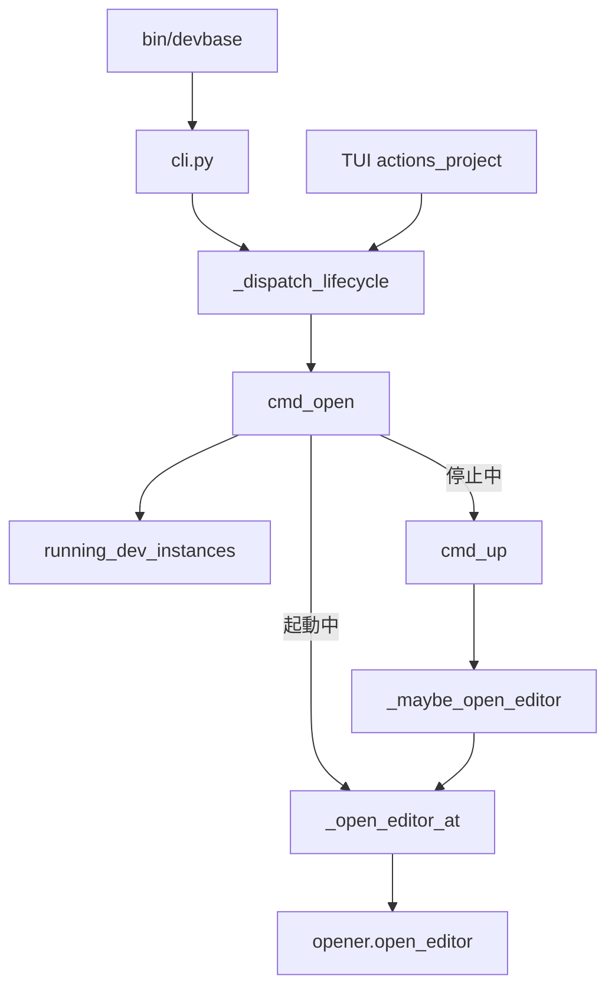
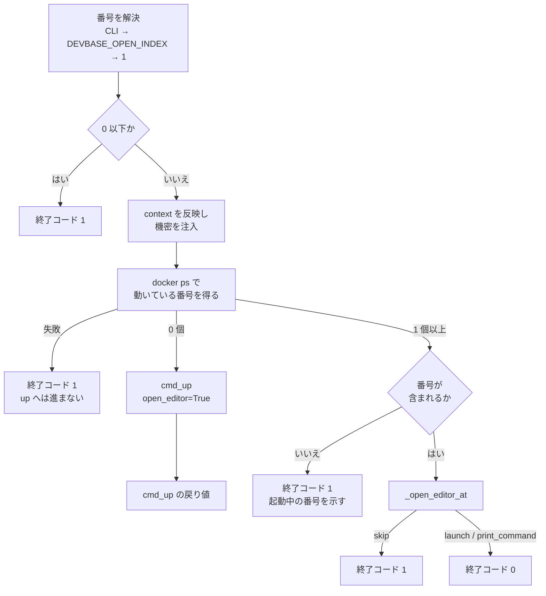

# エディタの窓の開き直し（`devbase open`）

## 概要

閉じた VS Code の窓を、コンテナを再起動せずに開き直す。`devbase up` の最後の段（`[6/6]`）で開くのと
同じ窓（dev コンテナへ接続したフォルダ、リポジトリが 2 件以上ならワークスペース）を開く。

| 入口 | 形 |
| --- | --- |
| トップレベル | `devbase open [name] [--open-index N] [--context NAME]` |
| `project` グループ | `devbase project open [name] [--open-index N] [--context NAME]` |
| `container` / `ct` グループ（非推奨） | `devbase container open [--open-index N] [--context NAME]` |
| `devbase list` の TUI | 起動中のプロジェクトの操作メニューの先頭「エディタを開く (open)」 |

dev コンテナが 1 つ以上動いていれば、コンテナ・ボリューム・ネットワークに触らずに窓を開く。1 つも
動いていなければ `devbase up --open` と同じく起動してから開く。`devbase up` の `--open` /
`--no-open` / `--open-index` と自動オープンの仕組みはそのまま残り、`open` はそれを置き換えない。

## 用語

| 用語 | 意味 |
| --- | --- |
| 窓 | dev コンテナへ Dev Containers 拡張で接続した VS Code のウィンドウ |
| 動いているインスタンス | `docker ps`（`-a` なし）に現れ、Compose のプロジェクトのラベルが対象のプロジェクトで、サービスのラベルが `<開発サービス名>-<1 以上の数字>` のコンテナ |
| 番号（index） | 開くインスタンスの番号（`dev-1` の `1`）。`--open-index N`、無ければ環境変数 `DEVBASE_OPEN_INDEX`、それも無ければ 1 |
| 開発サービス名 | `get_dev_service_name()` が返す名前（`DEV_SERVICE_NAME`、既定 `dev`） |

## 構成要素

| 要素 | 置き場所 | 責務 |
| --- | --- | --- |
| 引数の受け口 | `lib/devbase/cli.py` | `_add_open_subparser(sub, *, with_name)`。`--open-index` と `--context` は常に、`[name]` は `project` とトップレベルだけ登録する。`allow_abbrev=False`。`SHORTCUTS` / `SUBCMD_MAP` / epilog / `_expand_argv` の候補 |
| 入口のシェル | `bin/devbase` | `resolve_command` の候補、Python 実装のコマンドの `case`、名前解決の `_PROJECT_NAME_SUBCOMMANDS` / `_NAME_RESOLVABLE_SHORTCUTS` |
| 振り分け | `lib/devbase/commands/container.py` | `_dispatch_lifecycle` の handlers の `open` |
| 本体 | `lib/devbase/commands/container.py` | `cmd_open`。番号の解決は `_explicit_open_index`（環境変数の読み方は `up` と共有する `_open_index_from_env`） |
| 開く処理 | `lib/devbase/commands/container.py` | `_open_editor_at`。開く対象（フォルダかワークスペースか）と compose file と接続先を組み、`opener.open_editor` の結果を返す。有効判定と番号の解決は持たない。`up` の `_maybe_open_editor` も同じ関数を通る |
| 起動中の判定 | `lib/devbase/utils/docker.py` | `running_dev_instances(project, dev_service_name, runner=None)`。`devbase env token` の配り先（`env.py` の `_running_dev_containers`）と共有する |
| 一覧の操作メニュー | `lib/devbase/tui/actions_project.py` | `_RUNNING_OPS` の先頭と `_OP_HANDLERS["open"]` |
| シェル補完 | `etc/devbase-completion.bash`、`etc/_devbase` | トップレベル・`project`・`container` の `open`、`[name]` と `--open-index` / `--context` |

型（クラス）は追加していない。モジュール関数の並びで構成する。

`open` の起動中の経路が docker daemon に対して行うのは、読み取りの `docker ps` と、`opener.open_editor`
が実コンテナ名を問い合わせる `docker compose ps` だけである。

## 仕様

### 処理の流れ

- **起動中かどうかは「動いているインスタンスが 1 つ以上あるか」で決め、番号の検査と分ける。** 番号の
  コンテナ名が解決できないことを停止中と読むと、scale 1 で動いているプロジェクトへ `--open-index 2` を
  渡しただけで `up` が環境を作り直す。`opener.resolve_container_name` は問い合わせに失敗すると決定的な
  名前へ落ちるため、判定には使わない
- **状態を取得できないときは `up` へ進まずに止まる。** `docker ps` の失敗は停止中を意味しないためである
- **停止中は `cmd_up(open_editor=True, open_index=<利用者の値>)` へ委譲し、自前で開き直さない。** 起動直後に
  開く compose file は `up` の側で決まる。番号の範囲外は `up` の既存の扱い（警告して 1）に従う
- `DEVBASE_OPEN_EDITOR` と `project.yml` の `open_editor` は見ない。明示のコマンドは開く意思表示そのもので
  あり、`up` の自動オープンの可否とは別に扱う
- 番号の上限は `project.yml` の `scale` ではなく動いているインスタンスで決まる（`devbase scale` で増やした
  分も開ける）
- 接続先は `up` と同じ優先順位（`--context` > `DEVBASE_DOCKER_CONTEXT` > `project.local.yml`）で決め、
  `docker ps` の環境変数 `DOCKER_CONTEXT` と、`opener.open_editor` の `docker_context` の両方に使う
- 機密は `login` と同じく任意で注入する（`opener` の `docker compose ps` の補間のため）

### 引数と終了コード

| 状況 | 終了コード | 出力 |
| --- | --- | --- |
| 開いた（`launch`）・SSH で手元のコマンドを提示した（`print_command`） | 0 | `エディタを開きます: <dev>-<N>` と `opener` の出力 |
| 停止中 | `cmd_up` の戻り値 | `dev コンテナが起動していないため up を実行します (起動後にエディタを開きます)` |
| 開けなかった（`skip`: 非 TTY・`code` が無い） | 1 | `opener` が出す理由 |
| 番号が 0 以下 | 1 | `open index N は 1 以上を指定してください`（docker を呼ばない） |
| 番号が動いていない | 1 | `<dev>-<N> は起動していません。起動中: 1, 2` |
| `docker ps` が失敗した | 1 | `docker ps` の失敗の理由と `dev コンテナの状態を取得できないため、エディタを開けません` |
| `--open` / `--no-open`、およびその値付きの形（`--open 2` / `--open=2`） | 2 | argparse の usage エラー。サブパーサーの `allow_abbrev=False` により、`--open-index` の前方一致として受け付けない |
| `name` が解決できない | 1 | 既存の `_enter_project` の候補提示 |

`container open` は `[name]` を取らない（`container` の他のサブコマンドと同じ）。`bin/devbase` の name 解決も
`container` / `ct` を通さないため、`devbase container open <name>` は実在する名前でも usage エラー（終了コード 2）に
なる（PLAN61 決定 10）。前方一致では `devbase o` が `open` に、`devbase project o` / `container o` も `open` に解決する。`devbase l` → `login`、`devbase project p`
→ `ps` は変わらない。

### `running_dev_instances`

- `docker ps --filter label=com.docker.compose.project=<project> --format '{{.Names}}\t{{.Label "com.docker.compose.service"}}'`
  を 1 回呼ぶ
- プロジェクトのラベルで絞り、サービス名が `^<開発サービス名>-([1-9][0-9]*)$` に合う行から `(番号, コンテナ名)` を
  集め、番号の昇順で返す。同じプロジェクトの DB などと、区切りやコンテナ名を欠く行は除く
- 呼び出しの例外・0 以外の終了コードは error ログを出して `None` を返し、0 個の `[]` と区別する
- Compose のファイルを読まないため、`.docker-compose.scale.yml` の有無と構成の補間に左右されない

### `devbase list` の操作メニュー

| 項目 | 内容 |
| --- | --- |
| 位置 | 起動中の行の操作メニューの先頭（Enter 1 回で決まる位置）。以下は再起動 (up)・停止 (down)・ログイン (login) … の順 |
| 委譲 | `dispatch_lifecycle("open", <name>, open_index=None)`。番号は尋ねず、既定（`DEVBASE_OPEN_INDEX`、無ければ 1）を開く |
| 実行後 | コンテナの数が変わらないため、トップの一覧へ戻らずサブメニューに留まる（`_BACK_TO_TOP_OPS` に含めない）。成否によらず続けて別の操作を選べる |

停止中の行は従来どおり選ぶと直接 `up` する。

## データ・設定

| 設定 | 扱い |
| --- | --- |
| `DEVBASE_OPEN_INDEX` | `--open-index` を省いたときの番号。数でなければ 1。`up` と読み方を共有する |
| `DEVBASE_OPEN_EDITOR` / `project.yml` の `open_editor` | `open` では見ない |
| `DEVBASE_EDITOR` / `DEVBASE_EDITOR_SSH_HOST` / `DEVBASE_EDITOR_DOCKER_CONTEXT` / `DEVBASE_WORKSPACE` | `opener.open_editor` が従来どおり読む |

永続データは持たない。

## 運用

- 窓を閉じた後はコンテナを止めずに `devbase open` で開き直す
- 非 TTY（CI・パイプ）では `opener` が開くのを見送り、終了コード 1 になる

## テスト観点

自動テストは `running_dev_instances`・`opener.open_editor`・`cmd_up` を差し替え、`up` のパイプラインの部品は
呼ばれたら落ちるスタブにする。実 docker と実 `DEVBASE_ROOT` には触れない。

- 起動中の経路で `opener.open_editor` が 1 回だけ呼ばれ、compose up / down・ボリューム / ネットワークの作成・
  pre-up チェック・自動スナップショット・`deploy` フック・`cmd_up` が呼ばれないこと。自動オープンの無効化
  （環境変数・`project.yml`）が効かないこと。`project.yml` の `scale` を超える番号も動いていれば開けること、
  環境変数の番号・空・数でない値・飛び番号の扱い。動いていない番号・0 以下・`docker ps` の失敗で `cmd_up` を
  呼ばずに 1 になること。`--context` が状態の照会とエディタの両方に届くこと。`skip` で 1、`print_command` で 0。
  停止中に `cmd_up` へ `open_editor=True` と利用者の番号が渡ること。`up` の自動オープンの範囲外の扱いと有効判定が
  変わらないこと（`tests/commands/test_container_open.py`）
- `running_dev_instances` の並び・プロジェクトのラベルでの絞り込み・`-a` を付けないこと・dev 以外と不完全な
  行を除くこと・サービス名のドットを文字どおり扱い先頭ゼロを除くこと・失敗で `None`
  （`tests/utils/test_running_dev_instances.py`）。`env token` の既存テストが変わらず通ること
  （`tests/commands/test_env_token.py`）
- 3 入口の parse、`container open` が名前を拒むこと、`--open` / `--no-open` と値付きの前方一致の拒否、
  ショートカットと `project open` が名前を解決してから `cmd_open` へ渡すこと、前方一致、`bin/devbase` が名前を
  取り除いて移動すること（`tests/cli/test_open_command.py`）
- TUI の先頭・委譲の属性・サブメニューに留まること・成否によらず次の操作を選べること
  （`tests/cli/tui/test_open_menu.py`、`tests/cli/tui/test_actions_project.py`）
- bash / zsh の補完（`tests/cli/test_completion.py`）

実機（起動中のプロジェクト、非 TTY）では、`open` / `open --open-index <動いていない番号>` /
`open --context <存在しない context>` / `open --open 2` / `project open --open-index 2` の終了コードが上の表の
とおりで、前後で dev コンテナの ID と `StartedAt` が変わらないことを確かめる。TTY の端末から窓が開くこと、
`devbase list` の先頭が `open` であることは配布後の確認の対象である。

## 関連リンク

- [CLI リファレンス: `devbase project open`](../user/cli-reference/02-project.md#devbase-project-open)
- [環境変数ガイド: エディタ自動オープン](../user/environment-variables.md)
- [別ホストの Docker への dev コンテナ起動（docker context）](remote-docker-context.md)
- 課題: devbasex/devbase#197。設計 PR: #198、実装 PR: #199
