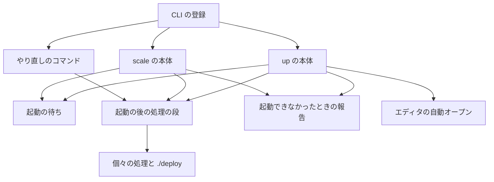
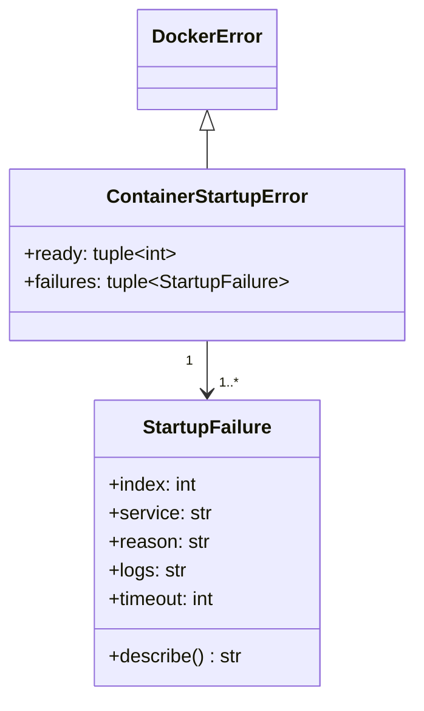
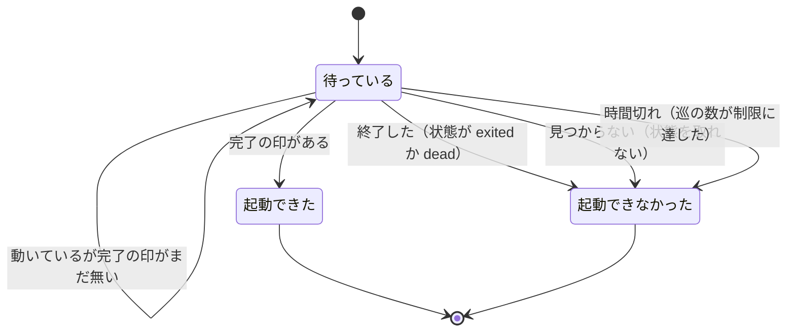
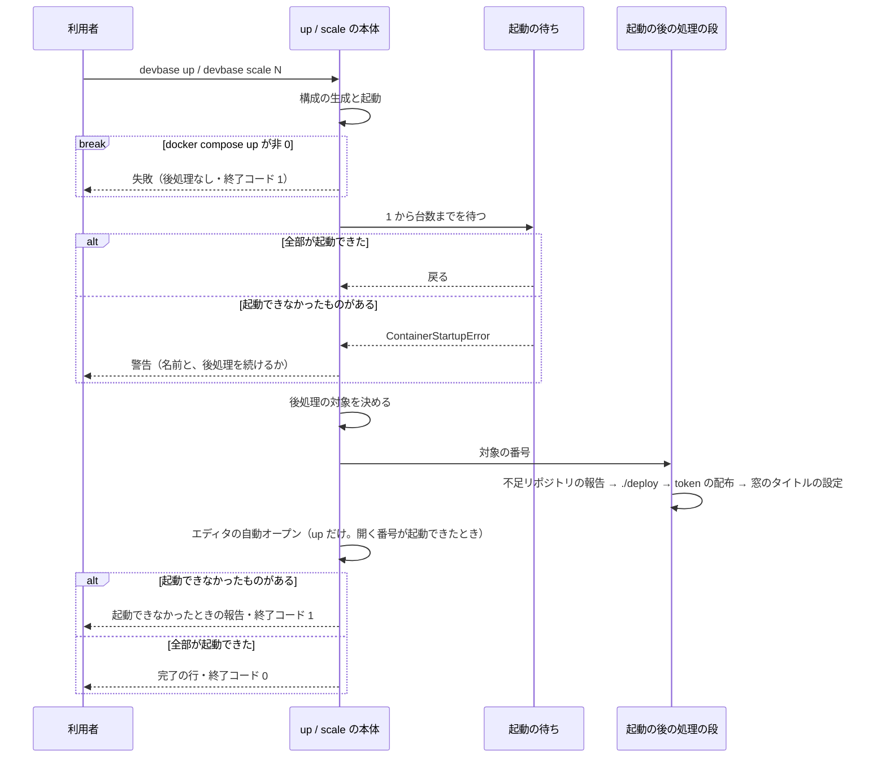

# 起動の後の処理（`up` / `scale` / `project post-start`）

## 概要

`devbase up` と `devbase scale` は、コンテナを起動して entrypoint の完了を待った後、ホストの側から
決まった処理を行う。不足リポジトリの報告・`./deploy` の実行・token の配布・窓のタイトルの設定の 4 つを
インスタンスごとに同じ順で行い、`up` だけがその後でエディタを自動で開く。

処理を行うインスタンスの集合（後処理の対象）は、`up` / `scale` の本体が起動の結果から決め、1 つの段
（`_run_post_start`）へ渡す。1 台が起動できなくても、起動できたインスタンスへは処理を届け、そのうえで
起動できなかった全部の名前・理由と補う手順を出して終了コード 1 で終える。動いているインスタンスへ、
コンテナを作り直さずに処理だけを行い直すコマンドとして `devbase project post-start [name]` を持つ。

## 用語

語の定義は [用語集: 起動の後の処理（`post-start`）](../glossary.md#起動の後の処理post-start) にある。
使う語: 起動の後の処理・インスタンスごとの処理・起動の待ち・起動できたインスタンス・起動できなかったインスタンス・
増やしたインスタンス・後処理の対象・起動の結果・起動できなかった理由・起動の後の処理の段・起動の後の処理のやり直し。
開発サービス名は [Compose の構成（`compose`）](../glossary.md#compose-の構成compose)、窓と動いているインスタンスは
[エディタで開く（`editor`）](../glossary.md#エディタで開くeditor) の語である。

この仕様の変更は `post-start` のコンテキストで閉じる。`editor`（窓のタイトルの設定・動いているインスタンスの調べ方）、
`secret`（token の発行とコンテナへの書き込み）、`compose`（開発サービス名と生成物 `.docker-compose.scale.yml`）には
順応者として接し、それらのモデルを変えない。

## 構成要素

| 要素 | 置き場所 | 責務 |
| --- | --- | --- |
| 起動の待ち | `lib/devbase/utils/docker.py` の `wait_for_containers_ready` | 1 から台数までの番号を、巡ごとに状態と完了の印で確かめる。全部が起動できたら `True` を返し、起動できなかった番号があれば、残りを制限まで待った後に `ContainerStartupError` を投げる |
| 起動の結果の型 | 同ファイルの `StartupFailure`・`ContainerStartupError` | 起動できた番号と、起動できなかった番号ごとの理由・ログの末尾を運び、利用者へ出す文言を組み立てる |
| 起動の後の処理の段 | `lib/devbase/commands/container.py` の `_run_post_start` | 後処理の対象を受け、インスタンスごとの処理を決まった順に呼ぶ。対象を自分で決めず、番号を足しも引きもしない。`./deploy` を走らせるかを `run_deploy` で受ける |
| 個々の処理 | 同ファイルの `_report_missing_repos`・`_run_deploy_script_for_instances`・`_push_bao_token`・`_apply_window_titles` | キーワード引数 `indices`（対象の番号の並び）を受ける。渡されなければ番号 1 から台数まで（token の配布は開始の番号から）に行う |
| エディタの自動オープン | 同ファイルの `_maybe_open_editor` | キーワード引数 `started`（起動できた番号の並び）を受け、開く番号がそこに無ければ警告して開かない |
| `up` の本体 | 同ファイルの `cmd_up` | 起動の待ちの例外を受けて後処理の対象を決め、段とエディタの自動オープンを呼ぶ |
| `scale` の本体 | 同ファイルの `cmd_scale` | 同じく例外を受け、増やしたインスタンスのうち起動できたものを対象に段を呼ぶ |
| 部分的な起動の扱い | 同ファイルの `_start_or_partial`・`_warn_partial_start`・`_finish_partial`・`_report_startup_failure` | 起動の段の例外から起動できた番号を取り出す。待ちの直後の 1 行の警告と、出力の最後の報告を出す |
| やり直しのコマンド | 同ファイルの `cmd_post_start` | 接続先と機密を用意し、動いているインスタンスと完了の印から後処理の対象を決め、段を `./deploy` なしで呼ぶ |
| 動いているインスタンスの調べ方 | `lib/devbase/utils/docker.py` の `running_dev_instances` | `docker ps` をプロジェクトのラベルで絞り、`<開発サービス名>-<番号>` の `(番号, コンテナ名)` を返す。取得できなければ `None` |
| CLI の登録 | `lib/devbase/cli.py`（`SUBCMD_MAP` と `project` の parser）・`bin/devbase`（`_PROJECT_NAME_SUBCOMMANDS`）・`_dispatch_lifecycle`・`etc/devbase-completion.bash`・`etc/_devbase` | `project` グループの `post-start [name] [--context NAME]` |
| 完了の印 | `containers/base/entrypoint.sh` | 起動のはじめに `/tmp/entrypoint-ready` を消し、entrypoint の最後に置く |



起動の待ちは、`up` では起動の段 `_run_deploy_pipeline`、`scale` では `_run_scale_pipeline` の最後に呼ばれる。
2 つの起動の段は起動の待ちの例外を受けずにそのまま通し、本体が受ける。

## 仕様

### 集約

| 集約 | 持ち主 | 根 | エンティティ | 値オブジェクト |
| --- | --- | --- | --- | --- |
| 起動の結果 | 起動の待ち（`utils/docker.py`） | 1 回の待ちの結果 | インスタンス（番号で識別する） | 起動できなかった理由・ログの末尾 |
| 起動の後の処理の実行 | `up` / `scale` の本体・やり直しのコマンドと、起動の後の処理の段（`commands/container.py`） | 1 回の実行 | — | 後処理の対象（番号の集合）・処理の並び |

後処理の対象を決めるのは `cmd_up`・`cmd_scale`・`cmd_post_start` だけである。どちらの集約も 1 回のコマンドの
中だけで生き、保存しない。窓のタイトルの設定ファイルと `~/.vault-token` は `editor` と `secret` の持ち物で、
書き方はそれぞれの仕様に従う。



`ready` と `failures` は番号の昇順で、合わせると待った番号の全部になる。`reason` は `exited`・`not_found`・
`timeout` のどれかで、`logs` は `exited` のときだけ中身を持つ。

### 起動の待ち

`wait_for_containers_ready(container_prefix, scale, ready_file, timeout, compose_file)` は、1 から `scale` までの番号を
巡ごとに確かめる。1 巡では、まだ決まっていない番号ごとに状態の確認（`docker compose ps`）を 1 回、動いていれば
完了の確認（`docker compose exec -T <サービス> test -f /tmp/entrypoint-ready`）を 1 回行う。決まった番号へは、
その後の巡で問い合わせない。決まっていない番号が残っていれば 1 秒休んで次の巡へ進み、巡の数が `timeout`（60）に
達したら終える。



| 起動できなかった理由 | 決まる条件 | 番号の行の文言 |
| --- | --- | --- |
| 終了した（`exited`） | 状態が `exited` か `dead` を含む | `exited unexpectedly` と、続く `Last logs:` とログの末尾（10 行まで。決まったときに 1 回だけ取る） |
| 見つからない（`not_found`） | 状態を取れない | `container not found` |
| 時間切れ（`timeout`） | 巡の数が制限に達した時点で、完了の印を確かめられていない | `timeout (<制限>s) waiting for the entrypoint to complete` |

1 台が起動できなくても、残りの番号は制限まで待つ。番号の小さい 1 台が落ちたときにも、後から起動を終える
インスタンスへ後処理を届けるためである。そのため 1 台が落ちた `up` / `scale` が終わるまでの時間は、最長で
制限まで延びる。制限は 1 秒の休みを挟む巡の回数で数えるため、docker の呼び出しにかかる分だけ実際の時間は
60 秒を超える。

起動できなかった番号が 1 つ以上あれば `ContainerStartupError` を投げる。引数と成功時の戻り値は変えず、例外は
`DockerError`（`DevbaseError` の派生）なので、受けない呼び出し元は失敗のまま終わる。内訳を戻り値で返さないのは、
戻り値を見ない呼び出し元が部分的な失敗を成功として扱えてしまうためである。文言は次の形である。

```text
Container startup failed: 2 of 3 instances did not become ready.
  - dev-2: exited unexpectedly
    Last logs:
    <そのコンテナのログの末尾。10 行まで>
  - dev-3: timeout (60s) waiting for the entrypoint to complete
```

完了の印（`/tmp/entrypoint-ready`）は、entrypoint が起動のはじめに消し、最後に置く。`docker start` で起こし直した
コンテナに前の起動の印が残り、初期化の途中でも完了と読まれることは無い。この振る舞いは base イメージを建て直した
後のコンテナから効く。

### 起動の後の処理の段

`_run_post_start(deployment, indices, config, run_deploy=True)` は、
後処理の対象 `indices` へ次の順で処理を行う。対象が空なら何も行わない（token も発行しない）。
`deployment` は起動した構成（`_ComposeDeployment`。`project_name`・`scale`・`dev_service_name`・`compose_file` の組）で、
`up` / `scale` / `project post-start` が組んで渡す。

| 順 | 処理 | 条件 | 失敗したとき |
| --- | --- | --- | --- |
| 1 | 不足リポジトリの報告（`Repositories missing in /work of <コンテナ>`） | 常に | 問い合わせに失敗すれば何も出さずに続ける |
| 2 | `./deploy` の実行（番号ごとに `DEVBASE_INSTANCE_INDEX` を渡す） | `run_deploy` が真で、`./deploy` があるとき | 非 0 は警告して次の番号へ続ける |
| 3 | token の配布（`~/.vault-token`） | backend が `openbao` のとき | 取れない・書けないときは警告して続ける |
| 4 | 窓のタイトルの設定 | `DEVBASE_WINDOW_TITLE` で止めていないとき | 書けないときは debug のログに出して続ける |

個々の処理の失敗は終了コードへ反映しない。段は例外を投げない。`up` と `scale` は同じ順で処理し、やり直しは
同じ順から `./deploy` を除く。`scale` の順を `up` に合わせたのは、`up` の振る舞いを変えないためである（同じ
`./deploy` は `up` では token の無い状態で走っており、token があることを前提にできない）。

### `up` と `scale`



| 項目 | `up` | `scale` |
| --- | --- | --- |
| 待つ番号 | 1 から台数まで | 1 から新しい台数まで（既存のインスタンスを含む） |
| 後処理の対象 | 起動できたインスタンス | 増やしたインスタンス（前の台数 + 1 から新しい台数まで）のうち起動できたもの |
| エディタの自動オープン | 行う | 行わない |
| 全部が起動できたときの完了の行 | `=== Deploy completed successfully ===` | `=== Scale completed successfully ===` と、増やした番号ごとの `devbase login <番号>` |
| 起動できなかったときの報告の先頭 | `Deploy failed: ...` | `Scale failed: ...` |

`scale` の既存のインスタンスは、`up` か前の `scale` で処理が済んでいるものとして対象に入れない。

| 場合 | 後処理 | 出力 | 終了コード |
| --- | --- | --- | --- |
| 全部が起動できた | 後処理の対象の全部へ行う | 完了の行 | 0 |
| 起動できなかったものがあり、後処理の対象が空でない | 後処理の対象へ行う。エディタは開く番号が起動できたときだけ開く | 続ける旨の警告（処理先として後処理の対象の名前を出す） → 個々の処理の出力 → 報告 | 1 |
| 起動できなかったものがあり、後処理の対象が空である | 行わない | 行わない旨の警告（処理先の名前を出さない） → 報告 | 1 |
| `docker compose up` が非 0 | 行わない | `Deploy failed: ...` / `Failed to start new containers` | 1 |
| 内訳を持たない失敗（構成の生成の失敗など） | 行わない | `Deploy failed: ...` / `Scale failed: ...` | 1 |

場合は「起動できたものがあるか」ではなく「後処理の対象が空か」で分ける。`scale` では、既存のインスタンスが
起動できていても対象に入らないためである。起動の待ちより後に、`up` / `scale` はコンテナを停止・削除しない。
起動できなかったインスタンスがあると、本体は後処理へ渡す構成のファイルとして生成物の決まった置き場
（`.docker-compose.scale.yml`）を使う。

出力は次の形で、報告（`Deploy failed` 以降）を最後に置く。利用者は出力の末尾を読むため、`./deploy` の出力に
埋もれないようにする。1 行目は警告、`Deploy failed` 以降はエラーの水準である（`up` でプロジェクト `myapp` の
`dev-2` が終了した例）。

```text
起動できなかったインスタンスがあります: dev-2。dev-1 へ起動の後の処理を続けます
…（個々の処理の出力）…
Deploy failed: Container startup failed: 1 of 2 instances did not become ready.
  - dev-2: exited unexpectedly
    Last logs:
    …
起動できなかったインスタンスには、起動の後の処理を行っていません。補う手順:
  落ちたコンテナを起こし直し、その起動が終わった後に、次のコマンドで起動の後の処理をやり直します（./deploy は走りません）
  devbase project post-start myapp
  docker start で起こし直しただけでは、起動の後の処理（token の配布・窓のタイトルの設定など）は行われません
  ./deploy を含めて最初からやり直すには devbase up myapp を打ちます（全インスタンスを作り直します）
```

後処理の対象が空のときの 1 行目は次の形である。

```text
起動できなかったインスタンスがあります: dev-2。起動の後の処理を行うインスタンスが無いため、起動の後の処理は行いません
```

### エディタの自動オープン

`up` のエディタの自動オープンは、開く番号（`--open-index` か `DEVBASE_OPEN_INDEX`。無ければ 1）のインスタンスが
起動できたときだけ行う。起動できなかったときは
`<開発サービス名>-<番号> は起動できなかったため、エディタを開きません (起こし直した後に devbase open <番号> で開けます)`
を警告で出し、ほかの番号へ替えない。利用者が指定したのと違うインスタンスで作業を始めさせないためである。

### やり直しのコマンド（`devbase project post-start`）

| 項目 | 内容 |
| --- | --- |
| 形 | `devbase project post-start [name] [--context NAME]` |
| 入力 | `name`: 対象のプロジェクト（省略時は実行時のディレクトリ）。`--context`: 接続先（ほかの `project` のサブコマンドと同じ） |
| 処理 | 後処理の対象へ、不足リポジトリの報告 → token の配布 → 窓のタイトルの設定。`./deploy` は走らせず、エディタも開かない |
| 出力 | 個々の処理の出力、処理しなかった番号の警告、完了の行 `=== Post-start completed ===` |
| 前方一致 | `project po` で解決する。`project p`（`ps`）と `project pr`（`profile`）は変わらない |

後処理の対象は、動いていて entrypoint の完了の印を確かめられたインスタンスである。動いているインスタンスは
`running_dev_instances`（`docker ps` を 1 回）で調べ、その 1 つ 1 つに `docker exec <コンテナ> test -f /tmp/entrypoint-ready`
を 1 回だけ打つ。待たず、繰り返さない。確認の呼び出しそのものが失敗した番号は、完了の印を確かめられない番号として扱う。
`docker start` で起こし直した直後は entrypoint が走っている最中でリポジトリの clone も終わっていないため、動いている
だけで対象にすると、不足リポジトリを誤って報告し、用意の途中のホームへ token と窓のタイトルを書くことになる。

| 状態 | 動き | 終了コード |
| --- | --- | --- |
| 後処理の対象が 1 つ以上ある | それらへ処理を行う。`project.yml` の `scale` までの番号のうち、動いていないもの（`動いていないため処理しません: ...`）と、動いているが完了の印を確かめられないもの（`entrypoint の完了を確かめられないため処理しません: ... (起動が終わってから、もう一度打ちます)`）を警告で出す | 0 |
| 動いているが、完了の印を確かめられたものが 1 つも無い | 上の警告と `起動の後の処理を行えるインスタンスがありません` を出し、処理を行わない | 1 |
| 1 つも動いていない | `動いている <開発サービス名> のインスタンスがありません。起動には devbase up を使います` を出し、起動しない | 1 |
| 状態を取得できない（docker の daemon に届かない） | `dev コンテナの状態を取得できないため、起動の後の処理を行えません` を出す | 1 |
| プロジェクトか接続先を解決できない | ほかの `project` のサブコマンドと同じ | 1 |

接続先の反映と機密の用意は `devbase project login` と同じ手順（`_prepare_compose`）で行う。ボリュームも構成も作らない
ため、グループの宣言の検査と `project.yml` の書き換えは行わない。後処理へ渡す構成のファイルは、生成物があればそれを
使う。コンテナを起動・停止・削除しない。

設計の判断は次のとおりである。

- 起動できたインスタンスへその場で後処理を行うことと、やり直しのコマンドの両方を持つ。その場の後処理だけでは、
  落ちたインスタンスを起こし直した後に補う道が全インスタンスを作り直す `devbase up` だけになる（`scale` の後は
  `devbase scale` が同じ数を断る）。やり直しのコマンドだけでは、利用者が打つまで token と窓のタイトルが欠け、
  起動できたインスタンスの `./deploy` を補えない
- やり直しを `up` のオプションにしないのは、付け忘れ 1 つで動いているインスタンスが作り直されるためである。
  `re` で始まる名前は `project r` / `project re`（`rebuild`）の前方一致を曖昧にするため使わない。トップレベルの
  短縮形・非推奨の `container` グループ・TUI の操作の一覧には置かない
- やり直しは `./deploy` を走らせない。役目を devbase が自分で行う処理（不足リポジトリの報告・token の配布・
  窓のタイトルの設定）の補いに限る。起動できたインスタンスの `./deploy` は `up` / `scale` の中で済んでいる
- やり直しは完了の印が置かれるまで待たない。起動の途中で止まったインスタンスが 1 つあるだけで、やり直しが
  終わらなくなるためである。起動が終わってから打ち直せば足りる

## 常に成り立つ条件

- 待った番号（1 から台数まで）はどれも、待ちの終わりに「起動できた」か「起動できなかった（理由は 1 つ）」の
  どちらか一方に決まる
- あるインスタンスが起動できなかったと決まっても、ほかのインスタンスの待ちを打ち切らない
- 待ちの巡の数は制限（60）を超えない。決まったインスタンスへはその後の巡で問い合わせず、1 巡の docker の
  呼び出しはインスタンスあたり 2 回まで（状態と完了の印）である
- インスタンスごとの処理は、後処理の対象の番号にだけ行う
- インスタンスごとの処理の順は、不足リポジトリの報告 → `./deploy` → token の配布 → 窓のタイトルの設定で、
  `up` と `scale` で同じである。やり直しは同じ順から `./deploy` を除く
- 後処理の対象が空なら、処理を 1 つも行わない
- 起動できなかったインスタンスが 1 つでもあれば、`up` / `scale` は終了コード 1 で終わり、完了の行を出さず、
  起動できなかった全部の名前・理由と補う手順を出す
- `up` / `scale` は起動の待ちより後に、やり直しはどの時点でも、コンテナを起動・停止・削除しない
- エディタの自動オープンは、開く番号のインスタンスが起動できたときだけ行い、ほかの番号へ替えない
- やり直しは `./deploy` を走らせず、エディタを開かない
- token を書く先は後処理の対象のコンテナに限り、token の値を出力・ログ・`docker exec` の引数・環境変数に載せない
  （書き方は [secret-backend.md](secret-backend.md) の `~/.vault-token` の経路に従う）

## 運用

- 1 台が起動できなかったときは、出力の最後の手順に従う。落ちたコンテナを `docker start` で起こし直し、その起動が
  終わった後に `devbase project post-start <name>` を打つ。`./deploy` も含めてやり直すときは `devbase up <name>` を打つ
  （全インスタンスを作り直す）
- 起こし直したインスタンスの `./deploy` を補う道は `devbase up` の打ち直しだけである
- `scale` が起動の後に失敗しても、`project.yml` の `scale` は書き換わったまま残る
  （[compose-profiles.md](compose-profiles.md)）。同じ数の `devbase scale` は断られるため、補うにはやり直しの
  コマンドを使う
- 起動できたと決まった後に終了したインスタンスは、個々の処理がそれぞれの扱い（警告か無言）で飛ばし、終了コードへ
  反映しない

## テスト観点

自動のテストは docker と `subprocess` を差し替え、実物の docker と実物の `DEVBASE_ROOT` に触れない。

- 起動の待ちが、最初の巡で終了した 2 台の名前・理由・ログの末尾を内訳と文言に入れること、制限まで完了の印が無い
  番号を時間切れとして入れること、待った番号が起動できた側とできなかった側のどちらか一方にだけ現れること、
  番号の小さい 1 台が終了しても後から完了した番号を起動できた側へ入れること、1 巡の docker の呼び出しの回数と
  巡の上限を満たすこと（`tests/utils/test_wait_for_containers.py`）
- `scale`（1 から 3）が `dev-2`・`dev-3` にだけ、実コンテナ名で始まる窓のタイトルを設定し、`DEVBASE_WINDOW_TITLE=off`
  で設定しないこと、増やしたインスタンスの不足リポジトリを `up` と同じ文言で報告し、揃っていれば何も出さないこと、
  処理の順が `up` と同じであること（`tests/commands/test_container_post_start.py`・`tests/commands/test_container_scale_order.py`）
- 1 台が起動できなかった `up` / `scale`（`up` の `dev-2`、`scale` の増やした `dev-3`、`scale` の既存の `dev-1`）が、
  起動できた後処理の対象へ 4 つの処理を行い、1 で終わり、`Deploy failed` / `Scale failed` と全部の名前、
  `devbase project post-start <プロジェクト名>` だけの行、`docker start` では行われない旨の文を出し、完了の行を
  出さないこと。1 行目の処理先の名前が後処理の対象と一致し、対象が空なら処理を 1 つも呼ばないこと。起動の待ちより
  後に `down`・`stop`・`rm` を呼ばないこと（`tests/commands/test_container_post_start.py`）
- 開く番号のインスタンスが起動できなかったときにエディタを開かず警告し、ほかの番号で開かないこと。開く番号が起動
  できていれば、ほかの番号が落ちていても開くこと（`tests/commands/test_container_post_start.py`）
- やり直しが、完了の印のある動いているインスタンスにだけ処理を行い、動いていない番号と完了の印の無い番号を分けて
  出し、`./deploy` を走らせず、エディタを開かず、コンテナを起動しないこと。対象が空・1 つも動いていない・状態を
  取得できないときに 1 で終わること。2 回続けても書き込みの形が変わらないこと。token の書き込み先が対象の
  コンテナだけで、値が出力に現れないこと（`tests/commands/test_container_post_start.py`）
- `devbase project post-start [name] [--context NAME]` が解釈され、`project po` が展開され、ラッパーの `[name]` の一覧と
  bash / zsh の補完に現れ、トップレベルと `container` グループには無いこと（`tests/cli/test_post_start_command.py`）
- entrypoint が起動のはじめに完了の印を消すこと（`tests/containers/test_entrypoint_ready_marker.py`）
- 実物の docker では、使い捨てのプロジェクト（台数 2）で、印を置いた番号のインスタンスだけを完了の印より前に終了させて
  `devbase up` を打ち、出力の手順に従ってやり直しのコマンドまで通す。前後で、起動できたインスタンスのコンテナの ID と
  起動した時刻が変わらないことを見る。`DEVBASE_ROOT` を一時ディレクトリへ向け、確かめた後にコンテナとボリュームを消す
- 窓のタイトルが VS Code に描かれることは人が見る（設定ファイルに値が書かれることまでを機械が確かめる）

## 関連リンク

- [用語集: 起動の後の処理（`post-start`）](../glossary.md#起動の後の処理post-start)
- [付随サービス群の後からの起動・停止（compose-profiles.md）](compose-profiles.md)（`scale` の段の順と `./deploy` のフックの環境変数）
- [機密ストアの保存先の差し替え（secret-backend.md）](secret-backend.md)（`~/.vault-token` を書く経路）
- [CLI リファレンス: project](../user/cli-reference/02-project.md)（`up`・`scale`・`post-start` の節）
- [同時起動でもリンクの段が失敗しない張り方（container-link-stage.md）](container-link-stage.md)（1 台が落ちる原因の 1 つだった同時起動の競合）
