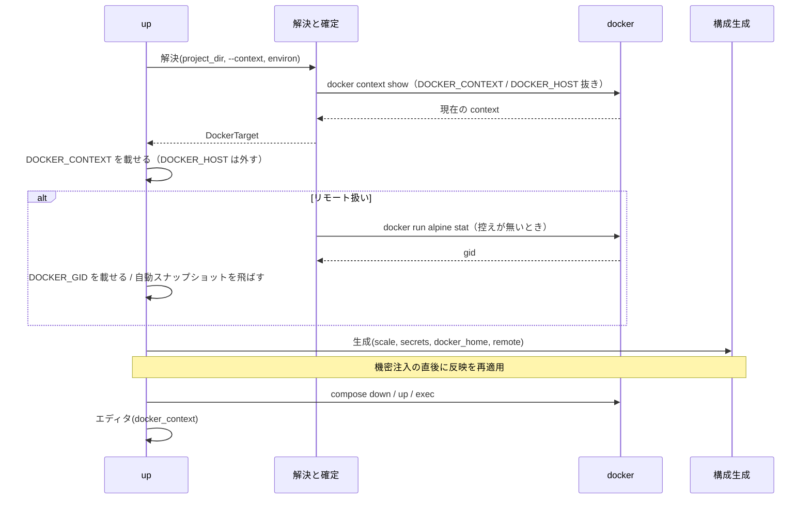

# 別ホストの Docker への dev コンテナ起動（docker context）

## 概要

devbase は、プロジェクトごとの個人設定 `projects/<name>/project.local.yml` に docker context の
名前を書くと、そのプロジェクトの `up` / `down` / `ps` / `logs` / `login` / `scale` / `build` /
`rebuild` を別ホストの docker daemon へ向ける。compose クライアントと機密の復号は手元で行い、
daemon だけがリモートにある。リモートに要るのは docker CLI・dockerd・sshd で、devbase・
`projects/`・機密鍵をリモートへ複製しない。`devbase up` が開く VS Code は、attach URI の
`settings.context` でそのホストのコンテナへ接続する。

## 用語

| 用語 | 意味 |
| --- | --- |
| docker context | docker CLI が daemon への接続先を名前で切り替える仕組み（`docker context ls` の名前） |
| 現在の context | `DOCKER_CONTEXT` と `DOCKER_HOST` を外した環境で `docker context show` が返す名前 |
| 解決した context | 優先順位に従って devbase が決めた context 名。未指定なら `None`（従来どおり CLI に委ねる） |
| リモート扱い | 解決した context が `None` でなく、現在の context と異なる（または現在の context を取得できない）状態 |
| ローカル扱い | 上記以外。従来と同じ振る舞い |

## 構成要素

| 要素 | 置き場所 | 責務 |
| --- | --- | --- |
| 個人設定の読み込み | `lib/devbase/project/local_config.py` | `project.local.yml` を読み、`docker` 節を検証して `DockerSettings` にする |
| context の解決・確定・反映 | `lib/devbase/utils/docker_context.py` | `choose_context` / `resolve_target` / `apply` / `reapply` / `reset` / `ensure_remote_gid` / `current_context` / `effective_context` |
| lifecycle コマンド | `lib/devbase/commands/container.py` | `--context` の受け取り、操作の前後の `reset`、`up` / `scale` での接続先の確定と gid |
| shell の `build` | `bin/devbase` | `--context` の抜き取りと `env exec --context` 経由の docker 呼び出し |
| `env exec` | `lib/devbase/commands/env.py` | 子プロセスの環境へ `DOCKER_CONTEXT` を載せる |
| bind mount の書き換え | `lib/devbase/volume/bind_mounts.py`、`compose.py` | 生成物の `~` を `docker.home` で展開し、書き換えられない mount を警告する |
| attach URI | `lib/devbase/editor/opener.py` | `settings.context` の決定とフラット URI の提示 |

## 仕様

### context の解決

優先順位は **CLI `--context` > 環境変数 `DEVBASE_DOCKER_CONTEXT` > `project.local.yml` の
`docker.context` > 未指定** である。環境変数の空文字（空白のみを含む）は未指定として扱う。
この段階では docker を呼ばない。

`--context` は `project` / `container` 配下の `up` / `down` / `ps` / `logs` / `login` / `scale` /
`build` / `rebuild`、トップレベルのショートカット `up` / `down` / `ps` / `login` / `scale` /
`build` / `rebuild`、および `env exec` が受け付ける。空文字と空白のみは終了コード 2 で拒む
（Python の parser と `bin/devbase` の両方）。

### リモート扱いの判定

`up` と `scale` は、解決した context を現在の context と比べる。現在の context の問い合わせは
`DOCKER_CONTEXT` と `DOCKER_HOST` を取り除いた環境で行う。どちらかが残ると docker は
それぞれ設定先自身・`default` を返し、判定が常に一方へ倒れるためである。

| 解決した context | 現在の context との関係 | 扱い |
| --- | --- | --- |
| `None` | 問い合わせない | ローカル |
| 非 `None` | 同じ | ローカル |
| 非 `None` | 異なる、または取得できない | リモート |

`docker.home` / `docker.gid` はリモート扱いのときだけ使う。CLI / 環境変数で
`project.local.yml` の `docker.context` と**別の名前**へ向けたときは、ファイルの `home` / `gid`
を使わず警告する（別の機材の値を持ち込まない）。

### 環境への反映

解決した context は環境変数 `DOCKER_CONTEXT` として `os.environ` へ載せ、以降の `docker` /
`docker compose`・`pre-up` / `deploy` フック・`up` からの自動ビルドがすべて継承する。
反映は次の条件を保つ。

- context が `None` なら環境を一切触らない
- `DOCKER_HOST` があれば警告して取り除く。docker は `DOCKER_HOST` を `DOCKER_CONTEXT` より
  優先するため、残すと context が効かない
- リモート扱いの `up` / `scale` では `DOCKER_GID` をリモート側の gid に置き換える
- 反映は冪等で、機密の注入（`_inject_secrets`）の直後に再適用する。機密ストアに
  `DOCKER_CONTEXT` / `DOCKER_GID` / `DOCKER_HOST` があっても確定した接続先が残る
- 控えは lifecycle 操作の単位で生き、`_dispatch_lifecycle` が開始時と終了時に `reset` して
  3 変数を元の値へ戻す。1 プロセスで操作を続ける TUI で、前の操作の接続先を持ち越さない

`name` でプロジェクトを切り替える経路（`project down B` 等）は、切替元の機密を落として
から切替先の `env` を読み、切替先の機密を注入した後に context を解決する。

### リモート側の gid

`group_add: ["${DOCKER_GID}"]` に渡す gid は、`docker.gid` の明示 → 控え
`$DEVBASE_ROOT/.cache/docker-gid/<context>` → `DOCKER_CONTEXT` 付きの
`docker run --rm -v /var/run/docker.sock:/s alpine:3 stat -c %g /s` の順で決める。取得した値は
控えに書く。取得に失敗した（docker が非ゼロ・出力が整数でない）ときは、docker のエラーと
`docker.gid` の書き方を示して `up` を非ゼロで終える。取得した値が `0` のときは、socket が
root 所有か rootless Docker の可能性を警告して続行する。控えは自動では消さない。

### bind mount の `~`

リモート扱いの構成生成では、生成物 `.docker-compose.scale.yml` の全サービスの bind mount で
`~` と `~/...` を `docker.home` に置き換える。短い書式・長い書式（`type: bind`）の両方に効く。
`~user/...` と相対パス（`/` でも `~` でも始まらない source）は書き換えず、一覧で警告する。
`docker.home` が無いリモート扱いでは、`~` 系と相対パスの mount を一覧で警告し、`docker.home`
の指定を促す。ローカル扱いでは書き換えない。

### 自動スナップショット

リモート扱いの `up` は自動スナップショットを作らず、警告を 1 行出す。`devbase snapshot` 系の
コマンドと `down` のローテーションは context を解決せず、従来どおり手元を対象にする。

### shell の `build` と `env exec`

`bin/devbase` の `build)` 分岐は、単体イメージ名の走査より前に `--context NAME` /
`--context=NAME` を抜き取り、シェル変数に保持する。値は環境変数へ写さず、
`compose_with_secrets`（`devbase env exec --context NAME -- ...`）と Python の
`project build --context NAME` へ引数で渡す。`cmd_build` の `docker buildx build` と
`docker image inspect` も `compose_with_secrets` を通す。

`env exec` はプロジェクト直下（`current_project_name` が決める `projects/<name>`）の
`project.local.yml` と環境変数、`--context` から context を解決し、機密を載せた**後**の辞書へ
`DOCKER_CONTEXT` を載せる。`up` からの自動ビルド（`_run_build`）は解決済みの context を
`bin/devbase build --context <name>` として引数で渡す。

### VS Code の attach URI

`settings.context` は「`DEVBASE_EDITOR_DOCKER_CONTEXT` の明示 → devbase が解決した context →
（ssh 先のときだけ）docker が実際に使う context（環境変数を外さない `docker context show`）」の
順で決める。解決した context があればローカル端末でもフラット URI に付ける。Remote-SSH 統合
端末でネスト URI と `settings.context` の両方が付くときは、手元の VS Code に同名の context が
あれば直接 attach できるフラット URI を info で提示し、`DEVBASE_EDITOR_SSH_HOST=`（空）で
恒久的にそのフラット URI へ切り替えられることも示す。空文字は自動検出のオプトアウトで、
ネストを付けず `settings.context` だけを残す。

## データ・設定

### `projects/<name>/project.local.yml`

git 管理しない。最上位に書けるのは `docker` だけで、他のキーは `ConfigError` になる。
`project.yml` に `docker:` を書くと、このファイルへ移す案内付きの `ConfigError` になる。
空ファイルは無いときと同じに扱う。

| キー | 型 | 検証 |
| --- | --- | --- |
| `docker.context` | 文字列 | 空・空白・制御文字を含むものは拒む |
| `docker.home` | 文字列 | `/` で始まる絶対パスのみ |
| `docker.gid` | 整数 | 0 以上。真偽値・文字列は拒む |

### `$DEVBASE_ROOT/.cache/docker-gid/<context>`

10 進の gid を 1 行で持つ。リモート扱いで gid を取得したときに書き、次回はこれを読む。
整数として読めない内容は無視して取り直す。

### 環境変数

| 名前 | 向き | 意味 |
| --- | --- | --- |
| `DEVBASE_DOCKER_CONTEXT` | 入力 | context の上書き（グローバル `.env` / プロジェクト `env` / shell）。空文字は未指定 |
| `DOCKER_CONTEXT` | 出力 | 解決した context。docker CLI と compose が読む |
| `DOCKER_GID` | 出力 | リモート扱いの `up` / `scale` でだけ上書き |
| `DOCKER_HOST` | 入力 | context を解決したときは警告して取り除く |
| `DEVBASE_EDITOR_DOCKER_CONTEXT` | 入力 | attach に使う context を手で決めたいときだけ。解決した context より優先 |

## セキュリティ

`project.local.yml` は接続先の実体（ホスト名・鍵・トークン）を持たず、context の名前だけを
持つ。接続先の実体は各マシンの `docker context create` が持つ。age の鍵・`.env`・
`project.local.yml` は手元に留まるが、復号済みの機密の値は従来のローカル構成と同じく
compose の変数展開を通じて接続先の daemon とコンテナへ渡る。接続先は機密を預けてよい
ホストに限る。

## 運用

- 設定が無ければ挙動は変わらない。`project.local.yml` を消せば元に戻る
- `docker context use` で現在の context 自体をリモートへ向けた状態は補正の対象外
- `devbase status` は手元の daemon だけを見る
- rootless Docker や socket が `root:root` の構成では `docker.gid` を明示する
- リモート側の gid が変わったら `.cache/docker-gid/<context>` を消すか `docker.gid` を書く
- イメージはホストごとに別物で、リモート側に無ければリモートでビルドされる

## テスト観点

- 設定の読み込みと検証（`tests/project/test_local_config.py`）、`project.yml` の `docker:` の拒否
- 優先順位・リモート判定・反映・再適用・reset・gid 取得（`tests/utils/test_docker_context.py`）
- `up` / `scale` / `down` / `ps` / `logs` / `login` の子プロセスに届く `DOCKER_CONTEXT` /
  `DOCKER_GID` / `DOCKER_HOST`、自動スナップショットの回避、TUI とプロジェクト切替での漏れ、
  機密注入後の維持、`--context` を受け付ける parser（`tests/commands/test_container_context.py`）
- `env exec` の `--context` と機密ストアより優先すること、サブディレクトリからの実行
  （`tests/commands/test_env_exec_context.py`）
- shell の `build` が `--context` を抜き取り引数で渡すこと、空値の拒否、docker 直接呼び出しの
  不在（`tests/cli/test_wrapper_build_context.py`）
- bind mount の展開と警告（`tests/volume/test_bind_mounts.py`、`test_compose_remote_home.py`）
- attach URI の `settings.context` とフラット URI の提示（`tests/editor/test_opener.py`）
- 実 daemon への接続（存在しない context のエラー、リモートでのビルドと attach）は手動確認

## 関連リンク

- [project.yml リファレンス](../user/project-yml.md)
- [環境変数ガイド「リモート Docker」](../user/environment-variables.md)
- [CLI リファレンス: project](../user/cli-reference/02-project.md)
