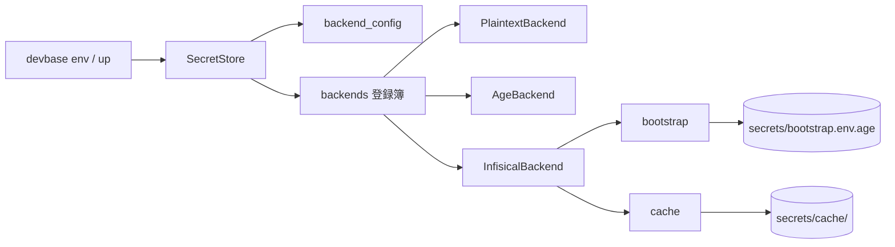
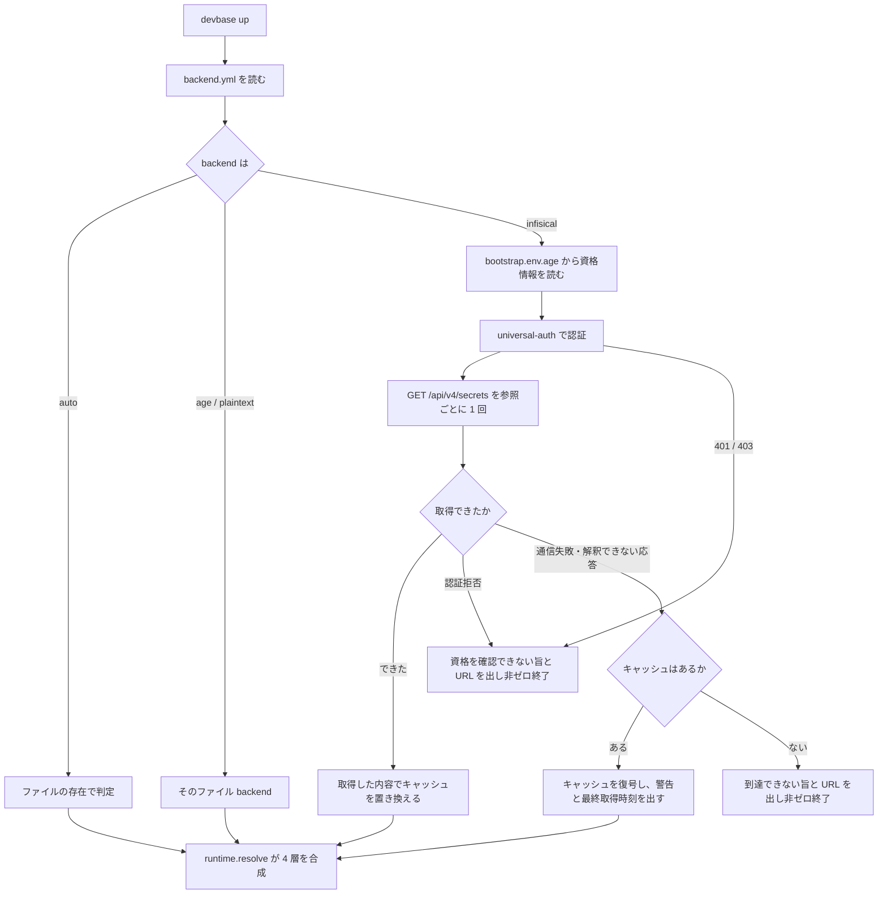

# 機密ストアの保存先の差し替え（backend と Infisical）

## 概要

devbase は機密の保存先（backend）を `$DEVBASE_ROOT/secrets/backend.yml` で明示的に選ぶ。
選べるのは `auto` / `plaintext` / `age` / `infisical` の 4 つで、設定が無ければ `auto`（暗号化
ファイルがあれば age、無ければ平文というファイルの存在による自動判定）として動き、設定を
持たない端末の挙動は変わらない。サーバ backend として [Infisical](https://infisical.com/) に
対応し、REST を標準ライブラリで叩く（常時の依存は増えない）。サーバへ到達できないときは
age で暗号化した手元のキャッシュで起動し、認証を拒まれたときはキャッシュを使わずに止まる。

機密の参照には**適用範囲**（共通 / プロジェクト）に加えて**持ち主**（チーム / 個人）の軸が
あり、`devbase env list` / `get` / `set` / `delete` / `edit` の `--user` で個人単位の置き場を
相手にする。ファイル backend は個人単位の置き場を持たない。

## 用語

| 用語 | 意味 |
| --- | --- |
| 参照（`SecretRef`） | 機密の宛先。適用範囲（`global` / `project`）と持ち主（`team` / `user`）の組み合わせで 4 種 |
| チーム単位の機密 | チームの全員が同じ値を使う機密（サービスアカウントの鍵、連携先の API キーなど） |
| 個人単位の機密 | 利用者ごとに値が違う機密（各自のクラウドアクセスキー、個人アクセストークンなど） |
| backend | 参照に対して機密を読み書きする実装。`plaintext` / `age` / `infisical`。`auto` は存在による判定 |
| ブートストラップ機密 | サーバ backend が接続に使う client ID / client secret。`secrets/bootstrap.env.age` に age で暗号化して置く |
| キャッシュ | サーバの内容と一致すると確かめられた機密を、参照ごとに age で暗号化して手元に控えたもの |
| scope | キャッシュの取得元を表す指紋。接続先 URL・project ID・environment・secretPath・client ID の SHA-256 |
| client secret / access token | 前者は machine identity の長期の資格情報で手元に保存する。後者は前者を交換して得る短期の資格情報でプロセス内にだけ持つ |

## 構成要素

| 要素 | 置き場所 | 責務 |
| --- | --- | --- |
| backend の設定 | `lib/devbase/env/backend_config.py` | `secrets/backend.yml` の読み書きと検証、参照ごとの `secretPath` の組み立て |
| 登録簿 | `lib/devbase/env/backends.py` | backend 名から実装を作る。未知の名前は一覧を添えて拒む |
| ストアの窓口 | `lib/devbase/env/secret_store.py` | `SecretRef`（持ち主の軸）、`PlaintextBackend` / `AgeBackend`、設定を見て backend を選ぶ `SecretStore` |
| Infisical adapter | `lib/devbase/env/infisical.py` | 認証、参照ごとの一括取得、差分適用の書き込み、失敗の種類の判定 |
| ブートストラップ | `lib/devbase/env/bootstrap.py` | 接続資格情報を登録簿を経由せず age で直接読み書きする |
| キャッシュ | `lib/devbase/env/cache.py` | 参照ごとの控えの書き込み・読み出し・破棄・全消去 |
| 機密の合成 | `lib/devbase/env/runtime.py` | 4 層の機密を重ねてコンテナへ渡す |
| `env backend` コマンド | `lib/devbase/commands/env_backend.py` | `status` / `use` / `test` / `migrate` |
| `env` コマンド | `lib/devbase/commands/env.py` | `--user` の受け取り、`edit` の分岐、一覧の保存形式表示 |
| `rekey` / `doctor` | `lib/devbase/commands/env_ops.py` | 手元の age 暗号文すべての再暗号化、backend 設定と権限の点検 |
| `encrypt` / `decrypt` | `lib/devbase/commands/env_migrate.py` | age ストアと平文の間の移動（backend の向きと突き合わせる） |
| `import` | `lib/devbase/env/io_import.py` | サーバ backend の参照への取り込みと age 暗号化した退避 |



## 仕様

### backend の選択

`SecretStore` は生成時に設定を読まず、最初に backend が必要になった時点で `backend.yml` を
1 度だけ読む（`SecretStore(...)` の生成箇所を変えずに済ませ、設定が壊れていても設定を触らない
コマンドを止めないため）。`backend_for` / `mode` / `exists` / `path` は選択中の backend へ
委譲する。

| `backend` | 動作 |
| --- | --- |
| `auto`（既定） | 参照ごとに暗号化ファイルがあれば age、無ければ平文。両方あれば「どちらが正か判断できない」として止める |
| `plaintext` / `age` | 常にその backend。ファイルの存在で判定せず、両方あっても止めない |
| `infisical` | 常にサーバ。`path()` は `secretPath` を `Path` にした表示用の値で、ローカルには存在しない |

`mode(ref)` は選択中の backend 名（存在しなければ `absent`）を返す。`direct_edit(ref)` が真
なのは平文だけで、それ以外の `env edit` は一時ファイル経由（読み出し → 編集 → 書き戻し）で
行う。`has_user_refs(ref)` は個人単位の参照を持つかで、`infisical` だけ真。

設定に機密は入らない。値が入るのはブートストラップだけである。

### 参照の持ち主と `--user`

`SecretRef` は `kind`（`global` / `project`）、`name`、`owner`（`team` / `user`、既定 `team`）
を持つ。生成は `for_global(owner=...)` / `for_project(name, owner=...)` の 2 つで、既存の
呼び出しはすべてチーム単位を指す。`label()` はチーム単位では従来の文字列（`グローバル` /
`プロジェクト '<name>'`）を返し、個人単位では `個人の` を前に付ける。

`-p` は適用範囲の軸を、`--user` は持ち主の軸を選び、片方の指定がもう片方を動かさない。
`-p` は名前を取らない真偽フラグで、対象のプロジェクトは実行時のディレクトリから決まる。

| 指定 | `set` / `delete` / `edit` の宛先 |
| --- | --- |
| なし | チーム共通 |
| `-p` | チームのプロジェクト |
| `--user` | 個人共通 |
| `--user -p` | 個人のプロジェクト |

`list` は指定の無い軸を絞らず、チーム共通 → 個人共通 → チームのプロジェクト → 個人の
プロジェクトの順に出す。チーム共通の節は変数が 0 件でも出し、それ以外は存在する参照だけ出す。
保存形式の表示は age が `[暗号化]`、平文は無し、それ以外は `[<backend 名>]`。`get` は
個人共通 → チーム共通 → 個人のプロジェクト → チームのプロジェクトの順に探す（`--user` なら
個人単位だけ）。

`init` / `sync` / `project` / `export` / `import` は `--user` を受け付けず、扱う参照はチーム
単位のままである。個人単位の参照を持たない backend での `--user` は、`set` / `delete` /
`edit` の共通の入口で拒み、チーム単位へ落とさない（ファイル backend の `path()` はチーム
単位のファイルを指すため、入口で止めないと `edit --user` がチームの `.env` を開く）。
読む側の `list` / `get` は個人単位の参照が無いだけとして扱う。

### 重ね順（`devbase up`）

`runtime.resolve()` は次の順に重ね、後の層が勝つ。

1. チーム共通の機密
2. 個人共通の機密
3. プロジェクトの非機密設定（`projects/<name>/env`）
4. プロジェクトのチーム機密
5. プロジェクトの個人機密

規則は「適用範囲が狭いものが勝つ」「同じ適用範囲では個人単位がチーム単位に勝つ」の 2 つ。
前者は従来の順そのままで、後者を内側へ足した形である。持ち主を外側にすると、個人共通の値が
プロジェクトのチーム機密に勝ち、プロジェクト専用のサービスアカウントの鍵が各自の共通設定で
上書きされるため採らない。コンテナへ列挙する変数名は 4 層のキーをこの順で並べ、重複は先に
現れた位置で 1 件に畳む。個人単位の参照を持たない backend では 2 と 5 が空になり、結果は
従来と同じである。

### `devbase env backend`

| コマンド | 入力 | 成功 | 失敗 |
| --- | --- | --- | --- |
| `status` | なし | backend 名、保存先、4 参照の `secretPath`、個人単位の識別子、接続資格情報の有無、キャッシュの有無と最終取得時刻。0 | 設定が壊れていれば理由を述べて 1 |
| `use <name>` | `--url` `--project-id` `--environment` `--user ID` `--client-id` `--client-secret-stdin` `--no-cache` | 検証 → 資格情報の保存 → 設定の保存の順で行い、要約を表示（client secret は伏せる）。0 | 未知の名前・必須項目の欠落は 2、鍵が無いなどは 1。**いずれも設定を書き換えない** |
| `test` | なし | 認証と参照ごとの取得（キャッシュへ落ちない）を行い、接続先 URL と読めた参照の件数を表示。0 | 到達できない・認証できない・サーバ backend でない → 1 |
| `migrate --to <name>` | `--to age\|infisical` `--dry-run` `--yes` | 後述 | 衝突は 2、読み戻しの不一致・書き込み失敗は 1 |

client secret は引数で受け取らない。`--client-secret-stdin` で標準入力の最初の行を読むか、
TTY では伏せ字入力で尋ねる。`use` は引数に無い項目を既存の設定から引き継ぎ、資格情報の
指定が無ければ既存のブートストラップを使う。`use infisical` は `backend.yml` より先に
ブートストラップを書く（資格情報を書けない状態で backend だけが切り替わると、次の実行から
機密を読めなくなる）。

`cli.py` は `env backend` を機密の注入を行わないコマンドとして扱う（設定が壊れている・
サーバに届かない状態でこそ実行されるため）。

### Infisical との契約

使う経路は 5 つで、認証以外は `Authorization: Bearer <accessToken>` を付ける。

| 用途 | 経路 | 送るもの |
| --- | --- | --- |
| 認証 | `POST /api/v1/auth/universal-auth/login` | `clientId` / `clientSecret` → `accessToken` / `expiresIn` |
| 一括取得 | `GET /api/v4/secrets` | `projectId` / `environment` / `secretPath` / `expandSecretReferences=false` / `includePersonalOverrides=false` → `{secrets: [{secretKey, secretValue}]}` |
| 作成 / 更新 / 削除 | `POST` / `PATCH` / `DELETE /api/v4/secrets/{name}` | `projectId` / `environment` / `secretPath`（/ `secretValue`）。`name` はパスの 1 要素として `/` を含めて符号化する |

- `expandSecretReferences=false` を常に送る。`${OTHER_KEY}` のような参照記法を文字列のまま
  往復させ、差分の判定にも展開前の値を使うためである
- `includePersonalOverrides=false` を常に送り、設定で変える手段を置かない。持ち主の軸は
  `secretPath` で表す（personal override は全員が見る値の上書きで、同名の値が先に無いと
  作れない）
- 参照ごとに 1 回 `GET` を呼ぶ。`recursive` は使わない（個人単位のパスは利用者ごとに分かれて
  おり、親から辿ると他人のパスまで要求する）。`runtime.resolve()` 1 回はプロジェクト指定あり
  で認証 1 回 + 取得 4 回、指定なしで認証 1 回 + 取得 2 回
- 同じ `SecretStore` の中では、取得した参照を控えて `exists` → `load` の並びで 2 度取りに
  行かない。書き込み前の差分計算には使わず、必ず取り直す
- access token は `expiresIn` の少し前に取り直す。取得が 401 を返したら手元の token を捨てて
  1 度だけ再認証し、同じ取得をやり直す。それでも 401、または 403 なら資格の取り消しとして
  扱う。ログイン自体の 401 / 403 は取り直す先が無いのでその時点で確定する
- `save` / `save_bytes` は参照の内容**全体**を受け取り、取得した現状との差分だけを
  DELETE → PATCH → POST の順に送る。値が同じキーは送らない。途中で失敗したら残りを送らず、
  反映済みのキー名を述べて止め、その参照のキャッシュを消す。巻き戻しは行わない
- Infisical にはコメント・空行の置き場が無く、`load_bytes()` が返すのは `KEY=VALUE` の並び
  である

`secretPath` の対応:

| 参照 | `secretPath` |
| --- | --- |
| チーム共通 | `<path_team_global>`（既定 `/team/global`） |
| チームのプロジェクト | `<path_team_project_prefix>/<name>`（既定 `/team/projects/<name>`） |
| 個人共通 | `<path_user_prefix>/<user>/global`（既定 `/users/<user>/global`） |
| 個人のプロジェクト | `<path_user_prefix>/<user>/projects/<name>` |

`<name>` と `<user>` はパス区切りと `..` を含まない検査を通っているため、組み立てた
`secretPath` が設定した親の外へ出ることはない。

### 失敗の種類とキャッシュ

サーバとのやり取りの失敗は例外の型で区別し、キャッシュの扱いを決める。

| サーバとのやり取りの結果 | 例外 | 世代を書き直すか | キャッシュを使ってよいか |
| --- | --- | --- | --- |
| 取得の成功（`secrets` が配列。0 件を含む） | — | 取得した内容で置き換える | — |
| 書き込みの成功 | — | 書いた内容で置き換える。置き換えられなければ消す | — |
| 書き込みが途中で失敗 | `SecretWriteError` | 消す | — |
| 通信できない（接続不能・タイムアウト・5xx・本文の途中切れ）・応答を解釈できない | `SecretUnreachableError` | 残す | 使う |
| 認証拒否（再認証後も 401、または 403） | `SecretAuthError` | 残す | **使わず、非ゼロで終了する** |

キャッシュはサーバの内容の写しであって記録ではなく、最後にサーバと一致すると確かめられた
1 世代だけを持つ。空の一覧も「その参照には機密が 1 件も無い」という取得結果として空の世代で
置き換える（前の世代を残すと、WebUI で消した機密が次の不達で戻る）。書き込みの成功でも
置き換えるのは、書き込みの前に読んだ内容で控えが止まると、`env delete` で消したキーが次の
不達でコンテナへ戻るためである。

認証拒否でキャッシュへ落ちないのは、失効させた client secret や外した権限が手元の起動を
止められなくなるためで、控えは消さない（client secret の書き間違いのような一時的な状態で
控えを失わない）。

キャッシュを使えるのは、上表で「使う」失敗であることに加えて、復号して得た `backend` と
`scope` が現在の設定から計算した値と一致する参照だけである。接続先 URL・project ID・
environment・識別子・client ID のいずれかを変えると変更前の控えは使われず、不達なら接続先を
示して非ゼロで終了する。

`cache.enabled` が偽のときは、控えを作らないだけでなく、backend を解決するすべての実行で
`cache/` 配下の控えを消す。消せなければ残ったパスを挙げて非ゼロで終了する。



### 移行（`migrate`）

移す対象はチーム単位の参照だけである。移行元と移行先は `backend.yml` の選択とは無関係に
組み立て、成功したときだけ設定を書き換える。サーバ側の読み取りは `fetch`（キャッシュへ
落ちない）で行い、取得できなければ書き込み前に止まる。

1. 移行先の同じ参照を読み、同じキーがあれば 1 件も書かずに衝突したキー名を挙げて 2 で終了
   する（`--dry-run` も同じ検査を行い、キー名だけを表示する。値は出さない）
2. 移行先に元からあった内容へ移行元を重ねたものを保存する（`save` は参照の全体を受け取る
   ため、移行元だけを渡すと移行先の既存キーが消える）
3. 読み戻して、移行元の全キーと移行先に元からあった全キーが期待どおりの値で返ることを
   確かめる。一致しなければこの実行で作成したキーだけを消し、移行前の設定のまま 1 で終了する
4. `backend.yml` を `--to` の値へ書き換える
5. `--to infisical` では移行元の age / 平文ファイルを `backups/env-backend-migrate/<日時>/` へ
   移し、退避先を表示する。`--to age` ではサーバ上の機密を消さず、残っている場所（接続先
   URL と `secretPath`）を表示し、`cache/` を消す

設定の書き換えを退避より先に行うのは、設定を書けなかったときに元のファイルだけが移動済みに
なり、設定が指す先から機密が読めなくなるのを防ぐためである。`bootstrap.env.age` はどちらの
向きでも残す（再び `infisical` へ戻すときに資格情報を入れ直さずに済む）。サーバ側を消さない
のは、他の利用者が参照している可能性を devbase が判断できないためである。

### 既存コマンドの扱い

| コマンド | 扱い |
| --- | --- |
| `env edit` | `direct_edit` が真（平文）なら保存先をそのままエディタへ渡す。それ以外は一時ファイル（自分専用の `0700` ディレクトリに `0600`）経由で `load_bytes()` → 編集 → `save_bytes()` |
| `env init --reset` | ファイル backend では従来どおり `.backup` を複製する。サーバ backend では読み出した値を age で暗号化して `backups/env-init/<日時>/` へ控え、作れなければ 1 件も消さずに非ゼロで終了する |
| `env encrypt` / `decrypt` | age 専用。backend が `infisical` なら止める。明示的な設定が変換後の保存先と逆（`plaintext` で `encrypt`、`age` で `decrypt`）でも止める（設定が指す先から機密が消える）。`auto` と一致する設定ではファイルの存在で判定する |
| `env rekey` | backend の選択に関わらず実行でき、手元の age 暗号文すべて（機密の参照、`bootstrap.env.age`、`cache/` 配下）を 1 つのまとまりとして再暗号化する |
| `env export` | チーム単位の 2 種の参照だけを backend 越しに読む。個人単位の `secretPath` へ要求は届かない。バンドルの名前と `manifest.yml` の `version` は変わらない |
| `env import` | チーム単位の参照へ backend 越しに書く。ファイル backend では従来どおり複製と原子的な rename。サーバ backend では取り込み前の値を age で暗号化して `backups/` へ全件控えてから参照ごとに `save_bytes()` し、失敗した参照までを（失敗した参照自身も含めて）控えた値で巻き戻す。受信者鍵が無ければ 1 件も取り込まない。暗号化の判定は「保存先が age か」で行い、`backend: age` で保存先がまだ無い参照も暗号文として保存する |
| `env doctor` | `backend.yml` の読み込みと登録簿の名前、`backend: infisical` でのブートストラップの 2 キー、`backend.yml` / `bootstrap.env.age` / `cache/` 配下の権限（ファイル `0600`、ディレクトリ `0700`）、`git check-ignore` による除外（`secrets/backend.yml` / `secrets/bootstrap.env.age` / `secrets/cache/team/global.env.age`）を点検する |

### 常に成り立つ条件

- 機密の値と client secret は、ログ・例外メッセージ・`--dry-run` の出力・`index.json` に載らない
- `backend.yml` に機密は入らない。ブートストラップとキャッシュは age 暗号文としてしか
  ディスクに置かれない。age の識別鍵が無い端末では平文へ落とさず、鍵の用意を促して非ゼロで
  終了する
- `backend` が `auto` のとき、`SecretStore` の全メソッドの結果は backend の仕組みを持たない
  ときと同じである
- ファイル backend は個人単位の参照に対して `exists()` が偽・`load()` が空を返し、書き込みと
  `remove()` は何もしない（拒む）
- 対応していない設定値（`api_version` が `v4` 以外、`version` が 1 以外、未知の backend 名、
  ループバック以外への `http`、パス区切りや `..` を含む `user`）は既定へ読み替えず、キー名と
  受け付ける値を添えて拒む

## データ・設定

### `$DEVBASE_ROOT/secrets/backend.yml`（`0600`）

```yaml
version: 1
backend: infisical
infisical:
  url: https://infisical.example.com
  project_id: 7f0e2c1a-....
  environment: common
  user: member01
  path_team_global: /team/global
  path_team_project_prefix: /team/projects
  path_user_prefix: /users
  api_version: v4
  timeout_seconds: 5
cache:
  enabled: true
```

| キー | 意味 | 空・不在のとき |
| --- | --- | --- |
| `version` | 形式の版。`1` だけを受け付ける | `1` |
| `backend` | `auto` / `plaintext` / `age` / `infisical` | `auto` |
| `infisical.url` | 接続先。`https` に限る。`http` はホストが `localhost` / `127.0.0.1` / `::1` のときだけ受け付ける | `infisical` のとき必須 |
| `infisical.project_id` | project の識別子 | 同上 |
| `infisical.environment` | environment の slug | `common` |
| `infisical.user` | 個人単位の置き場に使う識別子。パス区切りと `..` は不可 | `infisical` のとき必須 |
| `infisical.path_team_global` / `path_team_project_prefix` / `path_user_prefix` | `secretPath` の親。`/` で始まる | 上記の既定 |
| `infisical.api_version` | `v4` だけを受け付ける | `v4` |
| `infisical.timeout_seconds` | 1 回の HTTP の待ち時間（正の整数） | `5` |
| `cache.enabled` | キャッシュを書く・読むか。偽なら既存の控えも消す | `true` |

### `$DEVBASE_ROOT/secrets/bootstrap.env.age`（`0600`）

`DEVBASE_INFISICAL_CLIENT_ID` と `DEVBASE_INFISICAL_CLIENT_SECRET` の `KEY=VALUE` を、
機密の age ストアと同じ受信者・同じ鍵で暗号化したもの。登録簿を経由せず `AgeBackend` で
直接読み書きする（有効な backend を通すと「接続するための値を、接続しないと読めない」
循環になる）。

### `$DEVBASE_ROOT/secrets/cache/`（ディレクトリ `0700`、ファイル `0600`）

| パス | 中身 |
| --- | --- |
| `team/global.env.age`、`team/projects/<name>.env.age` | チーム単位の参照の控え |
| `user/global.env.age`、`user/projects/<name>.env.age` | 個人単位の参照の控え（識別子はパスに入れず、`scope` で区別する） |
| `index.json` | 参照ごとの `fetched_at` / `backend` / `url_host`。`status` の表示だけに使い、可否の判定には使わない。キー名も値も入れない |

控えは 1 参照 1 ファイルで、復号すると次の JSON になる。控えた機密と `scope` を同じ暗号文に
収め、原子的な置き換えで書くため、両者が食い違った組み合わせは残らない。

```json
{"version": 1, "scope": "sha256:...", "backend": "infisical",
 "fetched_at": "2026-09-08T10:00:00+09:00", "secrets": "KEY=value\n..."}
```

### 退避先

| 操作 | 退避先 | 形 |
| --- | --- | --- |
| `migrate --to infisical` | `backups/env-backend-migrate/<日時>/` | 移行元の age / 平文ファイルをそのまま移動 |
| `env import`（サーバ backend） | `backups/env-import/dbenv-<日時>/<owner>-<kind>[-<name>].env.age` | 取り込み前の値を age 暗号化 |
| `env init --reset`（サーバ backend） | `backups/env-init/<日時>/<owner>-<kind>[-<name>].env.age` | 同上 |

## セキュリティ

- client secret はコマンド引数で受け取らない（`ps` から読める位置に置かない）。標準入力か
  TTY の伏せ字入力だけを経路にする
- `http` はループバック宛てだけ受け付ける。環境変数やテスト専用のオプションで例外を開ける
  手段は置かない（実サーバを使う端末でも開けられる抜け道になる）
- `scope` を SHA-256 にするのは、project の識別子と client ID を平文で残さないためである
- 個人単位の機密は `secretPath` で分け、他人のパスを読む権限が無ければサーバが 401 / 403 を
  返す。宛先を指すのは設定、渡してよいかを決めるのはサーバという分担である
- `secrets/` は Git の除外対象で、`doctor` が実際に除外されることを確かめる

## 運用

- 設定が無ければ挙動は変わらない。`backend.yml` を消せば `auto` に戻る
- Infisical を使う場合も age の鍵が要る（ブートストラップとキャッシュの暗号化に使う）。
  受信者の入れ替えは `rekey` が担い、外した受信者は資格情報も控えも復号できなくなる
- サーバの構築・運用は devbase の範囲外で、devbase は既存のサーバへ接続するだけである
- 1 台の端末が同時に使う backend は 1 つ、扱う個人単位の機密は 1 人分である
- 複数人の同時編集の競合はサーバ側の最終書き込み優先に従う。不達のときに書き込みを控えへ
  溜める経路は無い
- 個人単位の機密は `export` / `import` で持ち運ばない。端末を替えても backend の設定と認証で
  同じ値が読める

## テスト観点

- 設定の読み込み・検証・既定値・`secretPath` の組み立て（`tests/env/test_backend_config.py`）
- 参照の持ち主、登録簿、設定による backend の選択、`auto` の互換（`tests/env/test_secret_store_backend.py`）
- ブートストラップの往復と鍵が無いときの失敗（`tests/env/test_bootstrap.py`）
- 偽 Infisical サーバ（`tests/conftest.py`、`http.server`）に対する差分適用・往復回数・
  再認証・403・不達・キー名の符号化・`backend test`（`tests/env/test_infisical.py`）
- キャッシュの配置・不達時の復帰・認証拒否での不使用・`scope`・書き込みとの同期・無効化・
  原子性・本文の途中切れ（`tests/env/test_cache.py`）
- 4 層の重ね順とファイル backend での不変（`tests/env/test_runtime.py`）
- `status` / `use` と argv に client secret を取る経路が無いこと（`tests/commands/test_env_backend.py`）
- `--user` の宛先、`list` / `get` の順序、ファイル backend での拒否、`edit` / `init --reset`
  （`tests/commands/test_env_user_axis.py`）
- 移行の衝突・読み戻し・巻き戻し・設定の切替の順序・両方向（`tests/commands/test_env_backend_migrate.py`）
- `rekey` の対象、`encrypt` / `decrypt` の向き、`doctor` の点検（`tests/commands/test_env_ops_backend.py`）
- `export` / `import` がサーバ backend 越しに動き、個人単位を触らないこと、暗号化した退避、
  巻き戻し、`backend: age` への import（`tests/cli/test_env_bundle_backend.py`）
- 実サーバに対する `devbase env backend test` / `devbase up`、folder path 単位の権限の
  絞り込み、自己ホストの Infisical が `v4` を持つことは手動確認

## 関連リンク

- [機密の保存先を選ぶ](../user/env-backend.md)
- [環境変数の暗号化](../user/env-encryption.md)
- [CLI リファレンス: env](../user/cli-reference/03-env.md)
- 発端の依頼: `issues/security-key.md`
