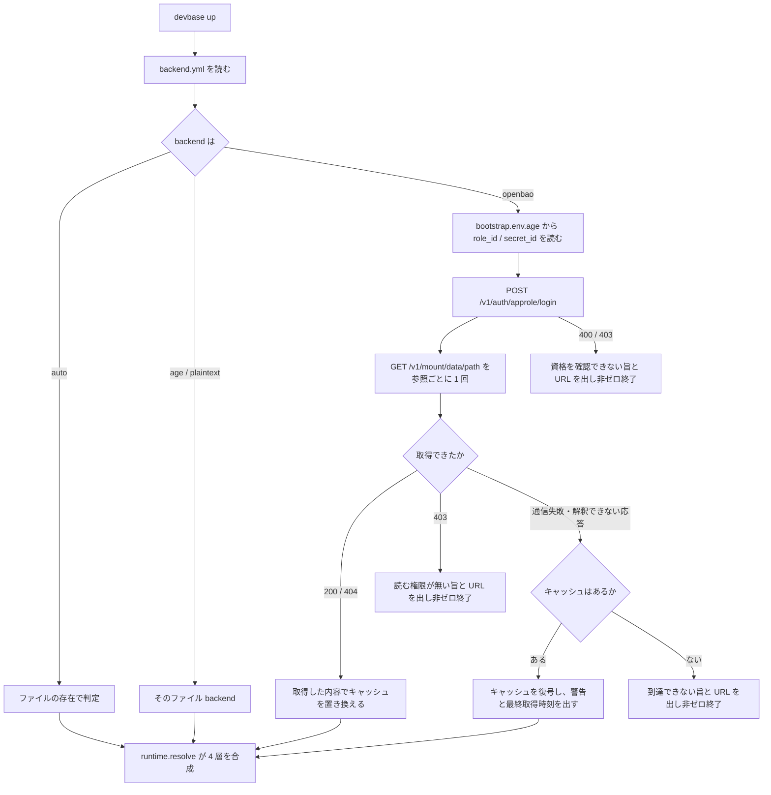

# 機密ストアの保存先の差し替え（backend と OpenBao）

## 概要

devbase は機密の保存先（backend）を `$DEVBASE_ROOT/secrets/backend.yml` で明示的に選ぶ。
選べるのは `auto` / `plaintext` / `age` / `openbao` の 4 つで、設定が無ければ `auto`（暗号化
ファイルがあれば age、無ければ平文というファイルの存在による自動判定）として動き、設定を
持たない端末の挙動は変わらない。サーバ backend として [OpenBao](https://openbao.org/) の
KV v2 シークレットエンジンに対応し、REST を標準ライブラリで叩く（常時の依存は増えない）。
サーバへ到達できないときは age で暗号化した手元のキャッシュで起動し、認証を拒まれたときは
キャッシュを使わずに止まる。

機密の参照には**適用範囲**（共通 / プロジェクト）に加えて**持ち主**（チーム / 個人）の軸が
あり、`devbase env list` / `get` / `set` / `delete` / `edit` の `--user` で個人単位の置き場を
相手にする。ファイル backend は個人単位の置き場を持たない。

### サーバ backend に OpenBao を採る理由

最初のサーバ backend は Infisical を予定していた。Community 版（ライセンス無し）では
次の点が設計に合わない（確認したコードの位置は devbasex/devbase#166 にある）。

| 要件 | Infisical Community 版 | OpenBao |
| --- | --- | --- |
| パス単位の権限（他人の個人単位のパスをサーバが拒む） | カスタムロールとフォルダ単位のアクセス制御が使えない。組み込みロールは project 全体に効く | テンプレート化したポリシー（`{{identity.entity.name}}`）で 1 つの置き場の中をパス単位に許可・拒否できる |
| 利用者ごと・端末ごとの資格の失効 | machine identity の client secret 単位 | AppRole の `role_id` を利用者ごと、`secret_id` を端末ごとに分けて失効できる |
| 監査ログ | 記録されない（保持日数 0） | 標準で持つ。値は HMAC 化される |
| 同時編集の競合 | 最終書き込み優先 | 版を指定した書き込み（check-and-set）で後から書いた側が止まる |

Infisical で個人単位の機密を守るには利用者ごとに project を分けるしかなく、「持ち主の軸を
パスで分ける」設計が成り立たない。OpenBao ではその設計がそのまま成り立つ。開発モードの
サーバに対する確認の結果は #166 にある。

## 用語

| 用語 | 意味 |
| --- | --- |
| 参照（`SecretRef`） | 機密の宛先。適用範囲（`global` / `project`）と持ち主（`team` / `user`）の組み合わせで 4 種 |
| チーム単位の機密 | チームの全員が同じ値を使う機密（サービスアカウントの鍵、連携先の API キーなど） |
| 個人単位の機密 | 利用者ごとに値が違う機密（各自のクラウドアクセスキー、個人アクセストークンなど） |
| backend | 参照に対して機密を読み書きする実装。`plaintext` / `age` / `openbao`。`auto` は存在による判定 |
| パス | KV v2 の中で 1 つの参照を指す相対パス（`team/global` など）。`.env` 1 つがパス 1 つに対応し、キーと値の組をまとめて持つ |
| 版 | KV v2 がパスごとに持つ書き込みの通し番号。書き込みで 1 ずつ進み、版を指定した書き込み（check-and-set）に使う |
| ブートストラップ機密 | サーバ backend が接続に使う AppRole の `role_id` / `secret_id`。`secrets/bootstrap.env.age` に age で暗号化して置く |
| キャッシュ | サーバの内容と一致すると確かめられた機密を、参照ごとに age で暗号化して手元に控えたもの |
| scope | キャッシュの取得元を表す指紋。接続先 URL・`mount`・パス・`role_id` の SHA-256 |
| `role_id` / `secret_id` / token | `role_id` は利用者ごとの AppRole の識別子。`secret_id` は端末ごとに発行される長期の資格情報で手元に保存する。token は両者を交換して得る短期の資格情報でプロセス内にだけ持つ |

## 構成要素

| 要素 | 置き場所 | 責務 |
| --- | --- | --- |
| backend の設定 | `lib/devbase/env/backend_config.py` | `secrets/backend.yml` の読み書きと検証、参照ごとのパスの組み立て |
| 登録簿 | `lib/devbase/env/backends.py` | backend 名から実装を作る。未知の名前は一覧を添えて拒む |
| ストアの窓口 | `lib/devbase/env/secret_store.py` | `SecretRef`（持ち主の軸）、`PlaintextBackend` / `AgeBackend`、設定を見て backend を選ぶ `SecretStore` |
| OpenBao adapter | `lib/devbase/env/openbao.py` | AppRole 認証、参照ごとの取得、版を指定した丸ごとの書き込み、失敗の種類の判定 |
| ブートストラップ | `lib/devbase/env/bootstrap.py` | 接続資格情報を登録簿を経由せず age で直接読み書きする |
| キャッシュ | `lib/devbase/env/cache.py` | 参照ごとの控えの書き込み・読み出し・破棄・全消去 |
| 機密の合成 | `lib/devbase/env/runtime.py` | 4 層の機密を重ねてコンテナへ渡す |
| `env backend` コマンド | `lib/devbase/commands/env_backend.py` | `status` / `use` / `test` / `migrate` |
| `env` コマンド | `lib/devbase/commands/env.py` | `--user` の受け取り、`edit` の分岐、一覧の保存形式表示 |
| `rekey` / `doctor` | `lib/devbase/commands/env_ops.py` | 手元の age 暗号文すべての再暗号化、backend 設定と権限の点検 |
| `encrypt` / `decrypt` | `lib/devbase/commands/env_migrate.py` | age ストアと平文の間の移動（backend の向きと突き合わせる） |
| `import` | `lib/devbase/env/io_import.py` | サーバ backend の参照への取り込みと age 暗号化した退避 |


## 仕様

### backend の選択

`SecretStore` は生成時に設定を読まず、最初に backend が必要になった時点で `backend.yml` を
1 度だけ読む（`SecretStore(...)` の生成箇所を変えずに済ませ、設定が壊れていても設定を触らない
コマンドを止めないため）。`backend_for` / `mode` / `exists` / `path` は選択中の backend へ
委譲する。

| `backend` | 動作 |
| --- | --- |
| `auto`（既定） | 参照ごとに暗号化ファイルがあれば age、無ければ平文。両方あれば「どちらが正か判断できない」として止める |
| `plaintext` / `age` | 常にその backend。ファイルの存在で判定せず、両方あっても止めない |
| `openbao` | 常にサーバ。`path()` は `<mount>/<パス>` を `Path` にした表示用の値で、ローカルには存在しない |

`mode(ref)` は選択中の backend 名（存在しなければ `absent`）を返す。`direct_edit(ref)` が真
なのは平文だけで、それ以外の `env edit` は一時ファイル経由（読み出し → 編集 → 書き戻し）で
行う。`has_user_refs(ref)` は個人単位の参照を持つかで、`openbao` だけ真。

設定に機密は入らない。値が入るのはブートストラップだけである。

### 参照の持ち主と `--user`

`SecretRef` は `kind`（`global` / `project`）、`name`、`owner`（`team` / `user`、既定 `team`）
を持つ。生成は `for_global(owner=...)` / `for_project(name, owner=...)` の 2 つで、既存の
呼び出しはすべてチーム単位を指す。`label()` はチーム単位では従来の文字列（`グローバル` /
`プロジェクト '<name>'`）を返し、個人単位では `個人の` を前に付ける。

`-p` は適用範囲の軸を、`--user` は持ち主の軸を選び、片方の指定がもう片方を動かさない。
`-p` は名前を取らない真偽フラグで、対象のプロジェクトは実行時のディレクトリから決まる。

| 指定 | `set` / `delete` / `edit` の宛先 |
| --- | --- |
| なし | チーム共通 |
| `-p` | チームのプロジェクト |
| `--user` | 個人共通 |
| `--user -p` | 個人のプロジェクト |

`list` は指定の無い軸を絞らず、チーム共通 → 個人共通 → チームのプロジェクト → 個人の
プロジェクトの順に出す。チーム共通の節は変数が 0 件でも出し、それ以外は存在する参照だけ出す。
保存形式の表示は age が `[暗号化]`、平文は無し、それ以外は `[<backend 名>]`。`get` は
個人共通 → チーム共通 → 個人のプロジェクト → チームのプロジェクトの順に探す（`--user` なら
個人単位だけ）。

`init` / `sync` / `project` / `export` / `import` は `--user` を受け付けず、扱う参照はチーム
単位のままである。個人単位の参照を持たない backend での `--user` は、`set` / `delete` /
`edit` の共通の入口で拒み、チーム単位へ落とさない（ファイル backend の `path()` はチーム
単位のファイルを指すため、入口で止めないと `edit --user` がチームの `.env` を開く）。
読む側の `list` / `get` は個人単位の参照が無いだけとして扱う。

### 重ね順（`devbase up`）

`runtime.resolve()` は次の順に重ね、後の層が勝つ。

1. チーム共通の機密
2. 個人共通の機密
3. プロジェクトの非機密設定（`projects/<name>/env`）
4. プロジェクトのチーム機密
5. プロジェクトの個人機密

規則は「適用範囲が狭いものが勝つ」「同じ適用範囲では個人単位がチーム単位に勝つ」の 2 つ。
前者は従来の順そのままで、後者を内側へ足した形である。持ち主を外側にすると、個人共通の値が
プロジェクトのチーム機密に勝ち、プロジェクト専用のサービスアカウントの鍵が各自の共通設定で
上書きされるため採らない。コンテナへ列挙する変数名は 4 層のキーをこの順で並べ、重複は先に
現れた位置で 1 件に畳む。個人単位の参照を持たない backend では 2 と 5 が空になり、結果は
従来と同じである。

### `devbase env backend`

| コマンド | 入力 | 成功 | 失敗 |
| --- | --- | --- | --- |
| `status` | なし | backend 名、保存先、`mount`、4 参照のパス、個人単位の識別子、接続資格情報の有無と `role_id`、キャッシュの有無と最終取得時刻。0 | 設定が壊れていれば理由を述べて 1 |
| `use <name>` | `--url` `--mount` `--user ID` `--role-id` `--secret-id-stdin` `--no-cache` | 検証 → 資格情報の保存 → 設定の保存の順で行い、要約を表示（`secret_id` は伏せる）。0 | 未知の名前・必須項目の欠落は 2、鍵が無いなどは 1。**いずれも設定を書き換えない** |
| `test` | なし | 認証と参照ごとの取得（キャッシュへ落ちない）を行い、接続先 URL と読めた参照の件数を表示。0 | 到達できない・認証できない・サーバ backend でない → 1 |
| `migrate --to <name>` | `--to age\|openbao` `--dry-run` `--yes` | 後述 | 衝突は 2、読み戻しの不一致・書き込み失敗は 1 |

`secret_id` は引数で受け取らない。`--secret-id-stdin` で標準入力の最初の行を読むか、TTY では
伏せ字入力で尋ねる。`use` は引数に無い項目を既存の設定から引き継ぎ、資格情報の指定が無ければ
既存のブートストラップを使う。`use openbao` は `backend.yml` より先にブートストラップを書く
（資格情報を書けない状態で backend だけが切り替わると、次の実行から機密を読めなくなる）。

`cli.py` は `env backend` を機密の注入を行わないコマンドとして扱う（設定が壊れている・
サーバに届かない状態でこそ実行されるため）。

### OpenBao との契約

使う経路は 4 つで、認証以外は `X-Vault-Token: <token>` を付ける。`<path>` は後述の対応表の
パスで、キーと値の組は KV v2 の 1 つのパスにまとめて置く。

| 用途 | 経路 | 送るもの / 受け取るもの |
| --- | --- | --- |
| 認証 | `POST /v1/auth/approle/login` | `role_id` / `secret_id` → `auth.client_token` / `auth.lease_duration` |
| 取得 | `GET /v1/<mount>/data/<path>` | → `data.data`（キーと値の辞書）/ `data.metadata.version` |
| 保存 | `POST /v1/<mount>/data/<path>` | `{"options": {"cas": <版>}, "data": {<キーと値の辞書>}}` |
| 削除（参照ごと） | `DELETE /v1/<mount>/metadata/<path>` | 全版を消す |

- 参照ごとに 1 回 `GET` を呼ぶ。`LIST` は使わない（個人単位のパスは利用者ごとに分かれて
  おり、親から辿ると他人のパスまで要求する。サーバのポリシーも `users/` 直下の一覧を拒む）。
  `runtime.resolve()` 1 回はプロジェクト指定ありで認証 1 回 + 取得 4 回、指定なしで認証
  1 回 + 取得 2 回
- 同じ `SecretStore` の中では、取得した参照の内容と版を控えて `exists` → `load` の並びで
  2 度取りに行かない。この控えの版が、その参照を次に書くときの基準になる
- token は実行のたびに取り直し、ディスクへ保存しない。`lease_duration` の少し前に取り直す
  （エディタを長く開いた `env edit` の書き戻しで、期限切れの token を送らないため）。
  応答の状態による再認証は置かない。認証以外の経路の 403 は権限の不足として確定する
  （サーバ側で token の期限を実行時間より十分長くする前提で、期限切れは事前の取り直しだけで
  扱う）
- `save` / `save_bytes` は参照の内容**全体**を受け取り、**読んだときの版を指定して丸ごと
  置き換える**。
  1. 基準の版は、同じ `SecretStore` でその参照を最後に読んだとき（`load` / `load_bytes` /
     `fetch`）の `data.metadata.version` である。まだ読んでいなければ、書き込みの直前に
     `GET` して得る。404 でも本文に `data.metadata.version` があればその値を版とし、
     無ければ 0 とする（最新版が論理削除されたパスは 404 と一緒に現在の版を返す。版 0 は
     「まだ 1 度も書かれていない」の意味で、論理削除されたパスに 0 を送ると不一致になる）
  2. 保存対象の辞書全体を `options.cas` にその版を付けて `POST` する
  3. 版が合わず 400 になったら、読んでから書くまでの間に他の誰かが書いた旨を述べて非ゼロで
     終了し、その参照の控えを消す。同じ操作をやり直せば、読み直した版で書ける

  基準を「読んだときの版」にするのは、書き込みの直前に取り直した版を使うと、読んでから
  書くまでの間の他人の更新に CAS が通ってしまい、黙って上書きする（lost update）ためで
  ある。`env set` は読み出しから書き戻しまでが 1 つの `SecretStore` の中で閉じ、`env edit`
  はエディタを開く前に読んだ版を書き戻しまで持つ。1 つの参照の書き込みは原子的で、一部の
  キーだけが新しい状態にはならない。差分の計算も、「どこまで反映したか」の報告も要らない
- `remove(ref)` は取得して存在を確かめてから `DELETE /v1/<mount>/metadata/<path>` で全版を
  消し、存在しなければ何もせず偽を返す。CLI のコマンドはこの経路を使わない（`env delete` は
  キーを除いた全体を `save` し、`migrate` はサーバ側を消さない）
- 応答の `data.data` の値は文字列だけを受け付ける。文字列以外の値（数値・真偽値・null・
  入れ子）が含まれていれば応答を解釈できないとして扱う（devbase と WebUI は文字列しか書か
  ない）
- KV v2 は値の中の `${OTHER_KEY}` を展開しない。参照記法は文字列のまま往復する
- KV v2 にはコメント・空行の置き場が無く、`load_bytes()` が返すのは `KEY=VALUE` の並び
  である

パスの対応:

| 参照 | パス |
| --- | --- |
| チーム共通 | `<path_team_global>`（既定 `team/global`） |
| チームのプロジェクト | `<path_team_project_prefix>/<name>`（既定 `team/projects/<name>`） |
| 個人共通 | `<path_user_prefix>/<user>/global`（既定 `users/<user>/global`） |
| 個人のプロジェクト | `<path_user_prefix>/<user>/projects/<name>` |

`<name>` と `<user>` はパス区切りと `..` を含まない検査を通っているため、組み立てたパスが
設定した親の外へ出ることはない。URL へ埋め込む前に各要素を符号化する（`/` は区切りとして
残す）。`<user>` は社内メールアドレスの `@` より前の部分で、サーバ側の entity 名と同じ値に
する。サーバのポリシーは entity 名で個人単位のパスを絞るため、設定の `user` が本人と違えば
`users/<user>/...` の取得が 403 になる。

サーバ側の構成（KV v2 のマウント、ポリシー、AppRole、token の期限）は devbase の範囲外で、
運用側のリポジトリ（carmo-cdk#312）が持つ。devbase が前提にするのは、上の 4 経路と
「本人のパスは読み書きでき、チームのパスは読め、他人のパスは拒まれる」ことだけである。

### 失敗の種類とキャッシュ

サーバとのやり取りの失敗は例外の型で区別し、キャッシュの扱いを決める。

| サーバとのやり取りの結果 | 例外 | 世代を書き直すか | キャッシュを使ってよいか |
| --- | --- | --- | --- |
| 取得の成功（200 で `data.data` が辞書。0 件を含む） | — | 取得した内容で置き換える | — |
| 取得が 404（未作成、または最新版が論理削除されている） | — | 機密 0 件として空の世代で置き換える | — |
| 書き込みの成功 | — | 書いた内容で置き換える。置き換えられなければ消す | — |
| 書き込みの版が合わない（400 で `errors` に check-and-set の不一致） | `SecretConflictError` | 消す | — |
| 通信できない（接続不能・タイムアウト・5xx・本文の途中切れ）・応答を解釈できない（上記以外の 4xx を含む） | `SecretUnreachableError` | 残す | 使う |
| 認証拒否（ログインの 400 / 403）・権限の不足（取得の 403・書き込みの 403） | `SecretAuthError` | 残す | **使わず、非ゼロで終了する** |

`SecretAuthError` の文言は原因ごとに分ける。

| 応答 | 意味 | 述べること |
| --- | --- | --- |
| ログインの 400（`invalid role or secret`） | `secret_id` の失効か書き間違い | 資格を確認できない。`secret_id` が失効していないか |
| ログインの 403 | 利用者（entity）の無効化 | 同上 |
| 取得の 403 | ログインは通ったが、そのパスを読む権限が無い | 読む権限が無い。`user` の設定が本人と違う可能性 |
| 書き込みの 403 | ログインは通ったが、書く権限が無い（チーム単位への書き込みなど） | 書き込み権限が無い。資格の取り消しとは別の文言にする（ログインが成功しているため区別できる） |

ログインの 400 を「応答を解釈できない」側へ分類しない（失効させた `secret_id` でキャッシュへ
落ちてしまう）。

キャッシュはサーバの内容の写しであって記録ではなく、最後にサーバと一致すると確かめられた
1 世代だけを持つ。404 も「その参照には機密が 1 件も無い」という取得結果として空の世代で
置き換える（前の世代を残すと、WebUI で消した機密が次の不達で戻る）。書き込みの成功でも
置き換えるのは、書き込みの前に読んだ内容で控えが止まると、`env delete` で消したキーが次の
不達でコンテナへ戻るためである。版の不一致で消すのは、読んだ内容がもう現物と違うと分かって
いるためである。それ以外の書き込みの失敗（不達・403）ではサーバは変わっておらず、読んだ
ときに進んだ世代がそのまま写しとして正しい。

認証拒否と権限の不足でキャッシュへ落ちないのは、失効させた `secret_id` や外した権限が手元の
起動を止められなくなるためで、控えは消さない（`secret_id` の書き間違いのような一時的な
状態で控えを失わない）。

キャッシュを使えるのは、上表で「使う」失敗であることに加えて、復号して得た `backend` と
`scope` が現在の設定から計算した値と一致する参照だけである。接続先 URL・`mount`・パス・
`role_id` のいずれかを変えると変更前の控えは使われず、不達なら接続先を示して非ゼロで終了
する。

`cache.enabled` が偽のときは、控えを作らないだけでなく、backend を解決するすべての実行で
`cache/` 配下の控えを消す。消せなければ残ったパスを挙げて非ゼロで終了する。



### 移行（`migrate`）

移す対象はチーム単位の参照だけである。移行元と移行先は `backend.yml` の選択とは無関係に
組み立て、成功したときだけ設定を書き換える。サーバ側の読み取りは `fetch`（キャッシュへ
落ちない）で行い、取得できなければ書き込み前に止まる。

1. 移行先の同じ参照を読み、同じキーがあれば 1 件も書かずに衝突したキー名を挙げて 2 で終了
   する（`--dry-run` も同じ検査を行い、キー名だけを表示する。値は出さない）
2. 移行先に元からあった内容へ移行元を重ねたものを保存する（`save` は参照の全体を受け取る
   ため、移行元だけを渡すと移行先の既存キーが消える）
3. 読み戻して、移行元の全キーと移行先に元からあった全キーが期待どおりの値で返ることを
   確かめる。一致しなければこの実行で作成したキーだけを消し、移行前の設定のまま 1 で終了する
4. `backend.yml` を `--to` の値へ書き換える
5. `--to openbao` では移行元の age / 平文ファイルを `backups/env-backend-migrate/<日時>/` へ
   移し、退避先を表示する。`--to age` ではサーバ上の機密を消さず、残っている場所（接続先
   URL と `<mount>/<パス>`）を表示し、`cache/` を消す

`--to openbao` でチーム単位のパスへ書く権限が無ければ、手順 2 で「書き込み権限が無い」旨を
述べて 1 で終了する（移行はチームの置き場を作る操作で、書ける利用者が行う）。

設定の書き換えを退避より先に行うのは、設定を書けなかったときに元のファイルだけが移動済みに
なり、設定が指す先から機密が読めなくなるのを防ぐためである。`bootstrap.env.age` はどちらの
向きでも残す（再び `openbao` へ戻すときに資格情報を入れ直さずに済む）。サーバ側を消さない
のは、他の利用者が参照している可能性を devbase が判断できないためである。

### 既存コマンドの扱い

| コマンド | 扱い |
| --- | --- |
| `env edit` | `direct_edit` が真（平文）なら保存先をそのままエディタへ渡す。それ以外は一時ファイル（自分専用の `0700` ディレクトリに `0600`）経由で `load_bytes()` → 編集 → `save_bytes()`。書き戻しの版はエディタを開く前に読んだときのものなので、編集中に他の人が書いていれば版の不一致で止まる |
| `env init --reset` | ファイル backend では従来どおり `.backup` を複製する。サーバ backend では読み出した値を age で暗号化して `backups/env-init/<日時>/` へ控え、作れなければ 1 件も消さずに非ゼロで終了する |
| `env encrypt` / `decrypt` | age 専用。backend が `openbao` なら止める。明示的な設定が変換後の保存先と逆（`plaintext` で `encrypt`、`age` で `decrypt`）でも止める（設定が指す先から機密が消える）。`auto` と一致する設定ではファイルの存在で判定する |
| `env rekey` | backend の選択に関わらず実行でき、手元の age 暗号文すべて（機密の参照、`bootstrap.env.age`、`cache/` 配下）を 1 つのまとまりとして再暗号化する |
| `env export` | チーム単位の 2 種の参照だけを backend 越しに読む。個人単位のパスへ要求は届かない。バンドルの名前と `manifest.yml` の `version` は変わらない |
| `env import` | チーム単位の参照へ backend 越しに書く。ファイル backend では従来どおり複製と原子的な rename。サーバ backend では取り込み前の値を age で暗号化して `backups/` へ全件控えてから参照ごとに `save_bytes()` し、失敗した参照までを（失敗した参照自身も含めて）控えた値で巻き戻す。受信者鍵が無ければ 1 件も取り込まない。暗号化の判定は「保存先が age か」で行い、`backend: age` で保存先がまだ無い参照も暗号文として保存する |
| `env doctor` | `backend.yml` の読み込みと登録簿の名前、`backend: openbao` でのブートストラップの 2 キー、`backend.yml` / `bootstrap.env.age` / `cache/` 配下の権限（ファイル `0600`、ディレクトリ `0700`）、`git check-ignore` による除外（`secrets/backend.yml` / `secrets/bootstrap.env.age` / `secrets/cache/team/global.env.age`）を点検する |

### 常に成り立つ条件

- 機密の値と `secret_id` は、ログ・例外メッセージ・`status` の出力・`--dry-run` の出力・
  `index.json` に載らない
- `backend.yml` に機密は入らない。ブートストラップとキャッシュは age 暗号文としてしか
  ディスクに置かれない。age の識別鍵が無い端末では平文へ落とさず、鍵の用意を促して非ゼロで
  終了する
- `backend` が `auto` のとき、`SecretStore` の全メソッドの結果は backend の仕組みを持たない
  ときと同じである
- ファイル backend は個人単位の参照に対して `exists()` が偽・`load()` が空を返し、書き込みと
  `remove()` は何もしない（拒む）
- サーバ backend への 1 つの参照の書き込みは、丸ごと反映されるか、何も反映されないかの
  どちらかである
- 対応していない設定値は既定へ読み替えず、キー名と受け付ける値を添えて拒む。対象は
  `version` が 1 以外、未知の backend 名、ループバック以外への `http`、パス区切りや `..` を
  含む `user` / `mount`、`/` で始まる・終わる・`..` を含む `path_*` である

## データ・設定

### `$DEVBASE_ROOT/secrets/backend.yml`（`0600`）

```yaml
version: 1
backend: openbao
openbao:
  url: https://openbao.example.com
  mount: devbase
  user: member01
  path_team_global: team/global
  path_team_project_prefix: team/projects
  path_user_prefix: users
  timeout_seconds: 5
cache:
  enabled: true
```

| キー | 意味 | 空・不在のとき |
| --- | --- | --- |
| `version` | 形式の版。`1` だけを受け付ける | `1` |
| `backend` | `auto` / `plaintext` / `age` / `openbao` | `auto` |
| `openbao.url` | 接続先。`https` に限る。`http` はホストが `localhost` / `127.0.0.1` / `::1` のときだけ受け付ける | `openbao` のとき必須 |
| `openbao.mount` | KV v2 シークレットエンジンのマウント名。パス区切りと `..` は不可 | `devbase` |
| `openbao.user` | 個人単位の置き場に使う識別子（entity 名）。パス区切りと `..` は不可 | `openbao` のとき必須 |
| `openbao.path_team_global` / `path_team_project_prefix` / `path_user_prefix` | パスの親。`/` で始めない・終えない | 上記の既定 |
| `openbao.timeout_seconds` | 1 回の HTTP の待ち時間（正の整数） | `5` |
| `cache.enabled` | キャッシュを書く・読むか。偽なら既存の控えも消す | `true` |

### `$DEVBASE_ROOT/secrets/bootstrap.env.age`（`0600`）

`DEVBASE_OPENBAO_ROLE_ID` と `DEVBASE_OPENBAO_SECRET_ID` の `KEY=VALUE` を、機密の age
ストアと同じ受信者・同じ鍵で暗号化したもの。登録簿を経由せず `AgeBackend` で直接読み書き
する（有効な backend を通すと「接続するための値を、接続しないと読めない」循環になる）。

### `$DEVBASE_ROOT/secrets/cache/`（ディレクトリ `0700`、ファイル `0600`）

| パス | 中身 |
| --- | --- |
| `team/global.env.age`、`team/projects/<name>.env.age` | チーム単位の参照の控え |
| `user/global.env.age`、`user/projects/<name>.env.age` | 個人単位の参照の控え（識別子はパスに入れず、`scope` で区別する） |
| `index.json` | 参照ごとの `fetched_at` / `backend` / `url_host`。`status` の表示だけに使い、可否の判定には使わない。キー名も値も入れない |

控えは 1 参照 1 ファイルで、復号すると次の JSON になる。控えた機密と `scope` を同じ暗号文に
収め、原子的な置き換えで書くため、両者が食い違った組み合わせは残らない。

```json
{"version": 1, "scope": "sha256:...", "backend": "openbao",
 "fetched_at": "2026-09-08T10:00:00+09:00", "secrets": "KEY=value\n..."}
```

### 退避先

| 操作 | 退避先 | 形 |
| --- | --- | --- |
| `migrate --to openbao` | `backups/env-backend-migrate/<日時>/` | 移行元の age / 平文ファイルをそのまま移動 |
| `env import`（サーバ backend） | `backups/env-import/dbenv-<日時>/<owner>-<kind>[-<name>].env.age` | 取り込み前の値を age 暗号化 |
| `env init --reset`（サーバ backend） | `backups/env-init/<日時>/<owner>-<kind>[-<name>].env.age` | 同上 |

## セキュリティ

- `secret_id` はコマンド引数で受け取らない（`ps` から読める位置に置かない）。標準入力か
  TTY の伏せ字入力だけを経路にする
- `http` はループバック宛てだけ受け付ける。環境変数やテスト専用のオプションで例外を開ける
  手段は置かない（実サーバを使う端末でも開けられる抜け道になる）
- `scope` を SHA-256 にするのは、`role_id` とパスを平文で残さないためである
- 個人単位の機密はパスで分け、他人のパスを読む権限が無ければサーバが 403 を返す。宛先を
  指すのは設定、渡してよいかを決めるのはサーバ（entity 名で絞るポリシー）という分担である
- 端末ごとに `secret_id` を分けるため、1 台の失効が他の端末に及ばない。失効前に発行済みの
  token は期限まで使えるため、期限はサーバ側で短く保つ
- `secrets/` は Git の除外対象で、`doctor` が実際に除外されることを確かめる

## 運用

- 設定が無ければ挙動は変わらない。`backend.yml` を消せば `auto` に戻る
- OpenBao を使う場合も age の鍵が要る（ブートストラップとキャッシュの暗号化に使う）。
  受信者の入れ替えは `rekey` が担い、外した受信者は資格情報も控えも復号できなくなる
- サーバの構築・運用は devbase の範囲外で、devbase は既存のサーバへ接続するだけである。
  利用者は管理者から接続先 URL・`mount`・自分の識別子・`role_id`・端末ごとの `secret_id` を
  受け取る
- 1 台の端末が同時に使う backend は 1 つ、扱う個人単位の機密は 1 人分である
- 複数人の同時編集は版の不一致として後から書いた側で止まる。黙って上書きせず、読み直して
  やり直す。不達のときに書き込みを控えへ溜める経路は無い
- 個人単位の機密は `export` / `import` で持ち運ばない。端末を替えても backend の設定と認証で
  同じ値が読める
- チーム単位のパスへ書けるのは、サーバ側で書き込みのポリシーを付けた利用者だけである。
  それ以外の利用者の `env set`（`--user` なし）と `migrate --to openbao` は「書き込み権限が
  無い」で止まる

## テスト観点

- 設定の読み込み・検証・既定値・パスの組み立て（`tests/env/test_backend_config.py`）
- 参照の持ち主、登録簿、設定による backend の選択、`auto` の互換（`tests/env/test_secret_store_backend.py`）
- ブートストラップの往復と鍵が無いときの失敗（`tests/env/test_bootstrap.py`）
- 偽 OpenBao サーバに対する読んだ版を基準にした丸ごと書き込み・読んでから書くまでの間の
  他人の更新による版の不一致・往復回数・ログインの
  400 / 403・取得と書き込みの 403・404 と論理削除後の版・不達・パス要素の符号化・
  `backend test`（`tests/env/test_openbao.py`）。偽サーバは `tests/conftest.py` の
  `http.server` で、AppRole のログインと KV v2 の取得・版付き保存・メタデータ削除を持つ。
  ポリシーの代わりに、`users/<user>/` 以外への書き込みと他人のパスを 403 にする
- キャッシュの配置・不達時の復帰・認証拒否での不使用・`scope`・書き込みとの同期・版の不一致
  での破棄・無効化・原子性・本文の途中切れ（`tests/env/test_cache.py`）
- 4 層の重ね順とファイル backend での不変（`tests/env/test_runtime.py`）
- `status` / `use` と argv に `secret_id` を取る経路が無いこと（`tests/commands/test_env_backend.py`）
- `--user` の宛先、`list` / `get` の順序、ファイル backend での拒否、`edit` / `init --reset`
  （`tests/commands/test_env_user_axis.py`）
- 移行の衝突・読み戻し・巻き戻し・設定の切替の順序・両方向・書き込み権限が無いとき
  （`tests/commands/test_env_backend_migrate.py`）
- `rekey` の対象、`encrypt` / `decrypt` の向き、`doctor` の点検（`tests/commands/test_env_ops_backend.py`）
- `export` / `import` がサーバ backend 越しに動き、個人単位を触らないこと、暗号化した退避、
  巻き戻し、`backend: age` への import（`tests/cli/test_env_bundle_backend.py`）
- 実サーバに対する `devbase env backend test` / `devbase up` は手動確認。ポリシーによる
  他人のパスと `users/` 直下の一覧の拒否、端末 1 台の `secret_id` の失効も同じ（開発モードの
  サーバでの確認結果は #166。本番のサーバでは配布後に確かめる）

## 関連リンク

- [機密の保存先を選ぶ](../user/env-backend.md)
- [環境変数の暗号化](../user/env-encryption.md)
- [CLI リファレンス: env](../user/cli-reference/03-env.md)
- 発端の依頼: `issues/security-key.md`
- Infisical から OpenBao への切り替えの経緯: devbasex/devbase#166
- [OpenBao: KV v2 API](https://openbao.org/api-docs/secret/kv/kv-v2/)
- [OpenBao: AppRole auth](https://openbao.org/docs/auth/approle/)
- [OpenBao: Policies](https://openbao.org/docs/concepts/policies/)
