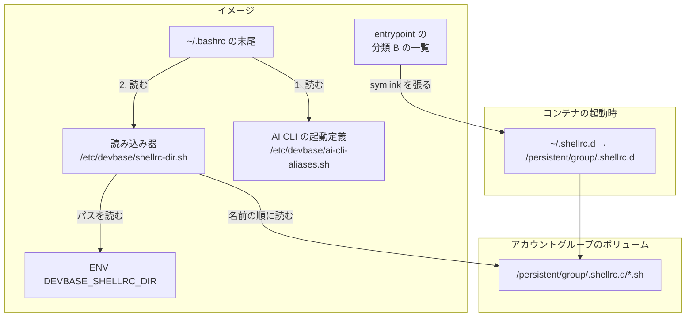

# 作り直しても残るシェルの設定（`~/.shellrc.d`）

## 概要

base イメージのコンテナは、シェルの設定の置き場所 `~/.shellrc.d/` を持つ。実体はアカウント
グループのボリューム（`/persistent/group/.shellrc.d/`）にあり、コンテナを作り直しても残る。
対話の bash は起動時に、置き場所の直下の `*.sh` を名前の順に読む。

置き場所のパスはコンテナの環境変数 `DEVBASE_SHELLRC_DIR` が示す。対話シェルでない処理
（`docker exec` の中や Claude Code の Bash）からも見えるので、設定を足すツールは
`~/.bashrc` を書き換えずに、この変数の指す先へ 1 ファイルを置けばよい。最初の使い手は
ai-plugins の中継（devbasex/ai-plugins#928）である。

利用者向けの使い方（置き方・置くファイルの作法）は
[コンテナ操作ガイド: 作り直しても残るシェルの設定](../user/container-operations.md#作り直しても残るシェルの設定)
にある。

## 対象範囲

- 置き場所の永続化（`entrypoint.sh` の分類 B のエントリ）と、置き場所を読む読み込み器
- 環境変数 `DEVBASE_SHELLRC_DIR`
- base から派生するイメージ（`general` / `go` / `php` / `php85` / `bi-tools` / `latex` /
  `trygroup`）への伝播の規則
- 対象に含まないもの:
  - zsh。base に zsh は入っておらず、`~/.zshrc` を読むシェルがいない。zsh を入れる変更の
    ときに起動定義と一緒に読み込みを足す（置き場所の名前はシェルに依らないので変えずに済む）
  - `containers/lfm` と `containers/snapshot`。base を継がない（「伝播の規則」）
  - 全コンテナ共通（分類 A）の置き場所。グループをまたいで効かせたい設定の置き場所は作らない
  - 置き場所へ最初から入れておくファイル。devbase は置き場所へ何も書かない

## 構成要素

| 要素 | 置き場所 | 責務 |
| --- | --- | --- |
| 永続化のエントリ | `containers/base/entrypoint.sh` の `DEVBASE_GROUP_SETTINGS` の末尾の `".shellrc.d"` | 既存の `devbase_link_setting` が、グループ側に空のディレクトリを作り、`~/.shellrc.d` をそこへの symlink にする |
| 読み込み器 | `containers/base/shellrc-dir.sh` → イメージの `/etc/devbase/shellrc-dir.sh`（`0644`） | 置き場所の `*.sh` を名前の順に読み、使った変数を消す |
| 環境変数 | `containers/base/Dockerfile` の `ENV DEVBASE_SHELLRC_DIR=/home/${USERNAME}/.shellrc.d` | 置き場所のパスを、非対話の処理と派生イメージへ示す |
| `~/.bashrc` の 1 行 | 同じ Dockerfile の `RUN` | `. /etc/devbase/ai-cli-aliases.sh` の行の**次**に `. /etc/devbase/shellrc-dir.sh` を書く |

読み込みを `~/.bashrc` へ直接書かずファイルにしているのは、Docker を起動しないテストで
振る舞いを固定するためである（`ai-cli-aliases.sh` と同じ形）。読み込みの中身を直しても
`~/.bashrc` の行は変わらない。

## 仕様

### 外への約束

devbase が外へ約束するのは、環境変数 `DEVBASE_SHELLRC_DIR` と、その既定値の置き場所
`~/.shellrc.d/` の 2 つである。

| 項目 | 約束 |
| --- | --- |
| 値 | `/home/ubuntu/.shellrc.d`（絶対パス。イメージの `ENV` が決める） |
| 存在 | entrypoint が終わった後（`/tmp/entrypoint-ready` がある時点）、値のパスは開発ユーザーが所有し書けるディレクトリで、実体はアカウントグループのボリュームにある |
| 共有の単位 | アカウントグループ。同じグループのコンテナすべてで同じ設定が効き、別のグループには効かない |
| 互換性 | 変数が無い（古いイメージ）ときは置き場所も無い。変数の有無で判定し、無ければ建て直しを案内するのは使う側（ai-plugins など）の扱いで、devbase は約束しない |

名前の採否: `~/.shellrc.d` はシェルの名前を含まず、後で zsh を足しても同じ置き場所を読ませ
られる。変数は、イメージの開発ユーザーのホームで値が決まるのでイメージの `ENV` で定める。
ホストが生成する compose で渡すと、古いイメージのコンテナへも存在しない置き場所を指す変数が
渡る。entrypoint の `export` は `docker exec` のシェルに届かない。

分類 B（グループ単位）に置くのは、最初の使い手である中継の本体が `~/.claude/ndf/`（分類 B）に
あるためである。分類 A にすると、中継の本体が無い別のグループでも中継を読む行が効いてしまう。

### 読む先

- 読む先は `DEVBASE_SHELLRC_DIR` の値で、変数が空か未設定なら `$HOME/.shellrc.d` である。
  置く側と読む側が同じ 1 つの値から決まる
- 変数が**空でない**のにその先がディレクトリでないときは、何も読まない。`$HOME/.shellrc.d` へは
  戻らない
- 置き場所そのものが symlink でも辿って読む（実配置は `~/.shellrc.d` がグループのボリュームへの
  symlink である）
- 変数を既定から別の場所へ向けると、読み込みもそちらへ移る。向けた先は永続化の対象ではない

### 読むもの・読む順

- 置き場所の**直下**の、名前が `.sh` で終わるもので、`[ -f ]` と `[ -r ]` を満たすもの（通常
  ファイル、または通常ファイルを指す symlink で、読めるもの）を読む
- 読まないもの: サブディレクトリの中、`.` で始まる名前（`dotglob` が有効でも）、他の拡張子や
  拡張子の無い名前、`*.sh` という名前のディレクトリ
- 順序はグロブの展開順（ファイル名の昇順）。同じ alias を複数のファイルが定義すると、後ろの
  ファイルの定義が残る
- `ai-cli-aliases.sh` の**後**に読むので、同じ名前の alias（`claude` など）は置き場所の定義が
  devbase の定義より勝つ
- ディレクトリ名・ファイル名に空白やグロブ文字（`[x]` / `*`）が含まれても、単語分割も再展開も
  されずに読む

### 読まれる時点

対話の bash の起動時だけである。`devbase login`（`docker compose exec ... bash`、対話の非ログイン
シェル）は `~/.bashrc` を読み、tmux の窓（ログインシェル）は `~/.profile` 経由で `~/.bashrc` を
読む。`~/.bashrc` は先頭で非対話シェルを帰す（Ubuntu の既定）ため、読み込みの 1 行は非対話の
処理では実行されない。非対話の処理へ届くのは環境変数だけである。置いたファイルは次に開く
シェルから効く。

### 常に成り立つ条件

- **読み込みの前後で `failglob` / `dotglob` の状態は変わらない。** グロブを展開する間だけ両方を
  切り、展開の結果を配列へ移し、**読む前に**有効だったものを戻す。置き場所のファイルは利用者の
  設定のまま読まれ、ファイルの中で変えた設定（`shopt -s failglob` など）は後ろのファイルと
  読み込みの後にも残る
- **控えと戻しは `IFS` に依らない。** 有効だった設定を `shopt -q` で 1 つずつ別の変数に控え、
  `shopt -s` で 1 つずつ戻す。名前を 1 本の文字列にまとめて単語分割で戻す形は、利用者の `IFS` に
  空白が無いとき（`IFS=$'\n\t'` など）に戻せないため採らない
- **`nullglob` の状態に依らない。** 一致が無いとグロブは文字列のまま残り、`[ -f ]` で落ちる。
  `nullglob` が有効なら繰り返しが 0 回になるだけで、結果は同じである
- **変数を残さない。** 読み込み器が使う変数は `__devbase_shellrc_` で始め、最後に `unset` する。
  利用者が先に置いた変数（`f` など）は変わらない。置き場所のファイルが同じ名前の変数を使う
  場合までは守らない
- **外部コマンドもサブシェルも起動しない。** 組み込み（`[`・`if`・`for`・`.`・`shopt`・`unset`）と
  代入だけで書き、コマンド置換（`$(...)` / `` ` ``）とパイプを使わない。置き場所が空のときの
  追加の処理は、ディレクトリの判定、設定 2 つの控えと戻し、1 回のグロブで終わる。`PATH` が空でも
  動く
- **読み込み器の終了状態は 0 である。** 各ファイルを `if` で包み、最後の `unset` で終える。
  最後のファイルが読めなくても、`~/.bashrc` の直後の `$?` に非 0 を残さない
- bash 3.2（macOS の `/bin/bash`）でも同じ結果になる。テストはホストの bash でも走る

### エラー処理

| 場合 | 扱い |
| --- | --- |
| 置き場所が無い・ディレクトリでない・空・`*.sh` が 1 つも無い | **黙って飛ばす。** 何も出力せず、終了状態 0。`failglob` が有効でも `no match` を出さない |
| 読み取り権限の無いファイル、リンク切れの symlink | **黙って飛ばし**、次のファイルへ進む |
| ファイルの中の構文・実行のエラー | **知らせる。** bash がそのファイルの誤りとして標準エラーに出し、次のファイルへ進む。devbase は誤りを握りつぶさず、シェルの起動も止めない |

置き場所のファイル自身が `exit` を実行すると対話シェルが終わる。これは防がない（利用者向け
文書の作法で `exit` を書かないよう求める）。

### 権限

置き場所に書けるのは、同じアカウントグループのボリュームに書ける者だけである。既に
`~/.claude`（hooks を含む）へ書ける者と同じ範囲で、新しい書き手を増やさない。実体は
entrypoint（開発ユーザーで走る）が既存の `devbase_ensure_entry` で作るので、開発ユーザーの
所有になる。イメージと entrypoint は置き場所へファイルを書かない。

## データ・設定

| 項目 | 値 |
| --- | --- |
| 環境変数 | `DEVBASE_SHELLRC_DIR=/home/ubuntu/.shellrc.d`（イメージの `ENV`） |
| 置き場所 | `~/.shellrc.d` → `/persistent/group/.shellrc.d`（ボリューム `devbase_home_{group}`） |
| 読み込み器 | `/etc/devbase/shellrc-dir.sh`（root 所有、`0644`。`/etc/devbase` は既存の `install -d -m 0755` が先に作る） |
| `~/.bashrc` | 末尾に `. /etc/devbase/ai-cli-aliases.sh` → `. /etc/devbase/shellrc-dir.sh` の順 |

`default` グループでは、初回シード（`devbase_seed_group_settings`）が `/persistent/ai/.shellrc.d`
からのコピーを試み、シード元が無いので `skip (シード元なし)` の 1 行を出す。グループ側に
`.shellrc.d` がまだ無い最初の起動の 1 回だけで、除外の一覧は持たない。

## 運用

- 変更は**イメージを建て直すまで反映されない**。読み込みの 1 行・読み込み器・`ENV`・
  `entrypoint.sh` はどれもイメージの中にあり、`devbase up` だけでは反映されない。
  `devbase build base --no-cache` で base を建て直し、使っている派生イメージ（いずれも
  `FROM devbase-base:latest`）も建て直し、稼働中のコンテナは `devbase down` → `devbase up` で
  作り直す
- `ENV` は派生イメージへ継がれ、`~/.bashrc` も base の層を継ぐので、派生イメージ側の変更は
  要らない
- `containers/lfm` は base を継がず、base から `/entrypoint.sh` をコピーするだけである。lfm の
  コンテナでも `~/.shellrc.d` の symlink は張られるが、`~/.bashrc` と `ENV` は lfm 自身の
  Dockerfile が持つので読まれない。lfm は起動定義も `~/.bashrc` へ直書きしており、base に
  そろえるのは別の課題である。`containers/snapshot` は base を継がない
- 切り戻しはコミットの revert と base の建て直しで足りる。グループのボリュームに残る
  `.shellrc.d/` は読まれなくなるだけで、消さなくても害はない
- 建てて確かめてあるのは arm64 である。変更はシェルの断片・symlink の一覧・`ENV` で、
  アーキテクチャに依存しない

## テスト観点

`tests/containers/test_shellrc_dir.py`（Docker を要さない。読み込み器を一時ディレクトリの
`HOME` で `bash -c` から `shopt -s expand_aliases` を付けて source する）:

- 置き場所の `*.sh` がファイル名の昇順で全部読まれ、同じ alias は後ろの定義が残ること。
  通常ファイルを指す symlink も名前の順に読まれること
- `x.txt` / `README` / `*.sh` という名前のディレクトリ / `.` で始まる名前が読まれないこと。
  `dotglob` が有効でも `.` で始まる名前が読まれないこと
- 置き場所が無い・空・`*.sh` が無いとき、標準出力と標準エラーが空で直後の `$?` が 0 であること。
  `failglob` が有効でも同じであること
- 有効だった `failglob` / `dotglob` が読む前に戻り、読んだ後も有効であること。片方だけ有効な
  場合と、`IFS` に空白が無い場合も同じであること。ファイルの中で有効にした設定が後ろのファイルと
  読み込みの後に残ること。無効だった設定は無効のままであること
- 構文の誤りを持つファイルが標準エラーに出て、後ろのファイルが読まれること
- 読めないファイルとリンク切れの symlink が、何も出さずに飛ばされ、後ろのファイルが読まれ、
  終了状態 0 であること
- `ai-cli-aliases.sh` の後に読み込み器を source すると、置き場所の `alias claude` が残ること
- 読み込みの後に `__devbase_` で始まる変数が残らず、先に置いた `f` の値が変わらないこと
- 変数が指す場所を読むこと。変数が空・未設定なら `$HOME/.shellrc.d` を読むこと。変数が指す先が
  無いときは `$HOME/.shellrc.d` へ戻らず、何も出さないこと
- 置き場所とファイルの名前に空白やグロブ文字があっても名前の順に読むこと。置き場所が symlink
  でも辿ること
- `PATH` を空にして source しても誤りが出ないこと。読み込み器の本文に `$(`・`` ` ``・`|` が
  無いこと
- Dockerfile で、`/etc/devbase` を作った後に読み込み器を `COPY` すること、
  `ENV DEVBASE_SHELLRC_DIR=/home/${USERNAME}/.shellrc.d` があること、`~/.bashrc` の読み込み器の
  行が `ai-cli-aliases.sh` の行より後であること、読み込み器を `.zshrc` へ書く行が無いこと

`tests/containers/test_entrypoint_ai_settings.py`（`DEVBASE_ENTRYPOINT_LIB_ONLY=1` で関数を呼ぶ）:

- `~/.shellrc.d` がグループの根の下の `.shellrc.d` への symlink であること
- entrypoint の後、グループ側の `.shellrc.d` が空のディレクトリであること（devbase は何も書かない）
- 片方のグループの置き場所に置いたファイルが、もう片方のグループの置き場所から見えないこと
- 既存の分類 A・B のエントリの張り先と、`default` グループの初回シードの結果が変わらないこと

既存の `tests/containers/test_ai_cli_aliases.py` が通り、起動定義と起動オプションが変わらない
ことも確かめる。

建てたイメージで手で確かめる観点（CI はイメージを建てないため、CI では確かめない）:

- `devbase build base --no-cache` が成功すること
- 作り直したコンテナで `~/.shellrc.d` が `/persistent/group/.shellrc.d` を指す symlink で、
  その先が `ubuntu` の所有であること
- `docker exec <container> printenv DEVBASE_SHELLRC_DIR` が `/home/ubuntu/.shellrc.d` を出すこと
- 置き場所に alias を定義したファイルを置き、`devbase down` → `devbase up` の後の
  `devbase login` で alias が効くこと。同じグループの別のコンテナ（`--index=2`）でも効くこと
- 建て直しの前後で `~/.zshrc` が変わらないこと

## 関連リンク

- [コンテナ操作ガイド: 作り直しても残るシェルの設定](../user/container-operations.md#作り直しても残るシェルの設定)
- [AI CLI alias の読み込み](ai-cli-alias-loading.md)
- [Issue #253](https://github.com/devbasex/devbase/issues/253)
- [devbasex/ai-plugins#928](https://github.com/devbasex/ai-plugins/issues/928)
