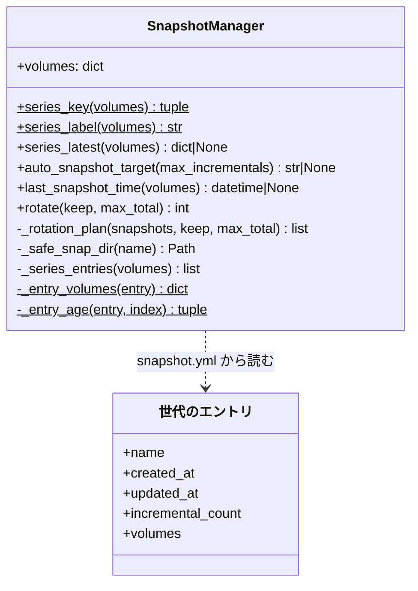

# スナップショットの世代の系列（アカウントグループごとの保持と差分の積み先）

## 概要

スナップショットの世代は、控える**対象ボリュームの組**ごとの**系列**に分かれる。組は共通
ボリューム `devbase_home_ubuntu` とグループのボリューム `devbase_home_<group>` からなり、
共通ボリュームは固定のため、系列はアカウントグループと 1 対 1 に対応する。

- `devbase up` の自動スナップショットは、起動するグループの系列の**最新の世代**へ差分を積む。
  別のグループを起動してから戻っても、`full.tar.zst` を取り直さない
- 自動スナップショットの最小間隔（`DEVBASE_SNAPSHOT_MIN_INTERVAL_MINUTES`）は系列ごとに判定する
- ローテーションは系列ごとに `keep` 世代を残し、全体の上限（既定 `keep × 3`）を超えた分を系列を
  またいで古い順に消す。**各系列の最新の世代は消さない**
- ローテーションは消す前に世代の場所を検証し、`backups/` の外やシンボリックリンクの先を消さない

系列はどこにも保存しない。`snapshot.yml` のエントリの `volumes` からその場で導く。

利用者向けの読み方は [スナップショットガイド: 系列](../user/snapshot-guide.md#系列) と
[CLI リファレンス: `devbase snapshot rotate`](../user/cli-reference/05-snapshot.md#devbase-snapshot-rotate)
にある。

## 対象範囲

- 自動スナップショットの積み先・新しい世代を作る条件・最小間隔の判定
- `devbase up` / `devbase down` / `devbase snapshot rotate` / TUI のローテーションの規則
- 世代の場所の検証（`_safe_snap_dir`）。`create` / `restore` / `copy` / `delete` / `rotate` が共有する
- ログの文言

含まない:

- 世代を名前で区別すること。`--name` の世代・`copy` の世代・`pre-restore-*` も対象ボリュームの組で
  系列に入り、同じ規則で消える。名前付きの世代の保護は #256 で扱う
- 復元の対象・順序・失敗時の案内（変えていない）。復元前の自動バックアップが控えるボリュームは #255
- `devbase snapshot list` / `devbase status` の表示。`status` の「最新」は `snapshot.yml` の最後の
  エントリ（最も新しく**作られた**世代）で、直前に差分を積んだ世代とは一致しないことがある
- 保持をバイト数で制限すること
- リモート扱いの `up`（自動スナップショットを作らない。[別ホストの Docker への dev コンテナ起動](remote-docker-context.md#自動スナップショット)）

## 用語

| 用語 | 意味 |
| --- | --- |
| 世代 | `backups/<名前>/` の 1 つ。`full.tar.zst` 1 つと、0 個以上の `incr-NNN.tar.zst` からなる |
| 対象ボリュームの組 | `snapshot.yml` のエントリの `volumes`（マウント名 → ボリューム名）。現行は `{ai: devbase_home_ubuntu, group: devbase_home_<group>}` |
| 系列 | 対象ボリュームの組が同じ世代の集まり。`volumes` が無い・空・dict でないエントリ（PLAN39 より前の旧レイアウト）は `{'': devbase_home_ubuntu}` の組として 1 つの系列になる |
| 系列の最新の世代 | 系列の中で `created_at` が最も新しい世代。同じ値なら `snapshot.yml` で後ろのもの |
| 全体の上限 | 系列をまたいで数えた世代の数の上限（`max_total`） |

## 構成要素

| 要素 | 置き場所 | 責務 |
| --- | --- | --- |
| 系列の解決 | `lib/devbase/snapshot/manager.py` の `SnapshotManager.series_key` / `series_label` / `_entry_volumes` / `_series_entries` / `series_latest` | エントリを系列に分け、系列の最新の世代を返す。系列の表示名を作る |
| 積み先の判定 | 同 `auto_snapshot_target` | 積み先の世代の名前か、新しい世代を作るべきこと（`None`）を返し、理由をログへ出す |
| 最小間隔の元 | 同 `last_snapshot_time(volumes=None)` | 渡された組の系列の世代のアーカイブの mtime の最大を返す |
| 保持 | 同 `rotate(keep, max_total)` と、副作用の無い `_rotation_plan` | 削除候補を決め、場所を検証してから消す |
| 世代の場所の検証 | 同 `_safe_snap_dir` | 名前・シンボリックリンク・`backups/` の外を `SnapshotError` で止める |
| 自動スナップショット | `lib/devbase/commands/container.py` の `_auto_snapshot` / `_should_skip_by_interval` | 最小間隔を系列で判定し、判定の結果に従って `create` と `rotate()` を呼ぶ |
| 自動ローテーション | 同 `cmd_down` | `mgr.rotate()` を既定の引数で呼ぶ |
| 手動ローテーション | `lib/devbase/cli.py`（`--keep` / `--max-total`）、`lib/devbase/commands/snapshot.py` の `cmd_snapshot` / `_snapshot_rotate` | 引数を `rotate` へ渡す。`max_total` は `getattr(args, 'max_total', None)` で受ける |
| TUI | `lib/devbase/tui/actions_snapshot.py` の `_op_rotate` | 「グループごとに保持する世代数 (--keep)」だけを問い、`max_total` は渡さない |

世代の規則は `manager.py` に置き、`container.py` は判定の結果に従って作成を呼ぶだけにする。

`系列` は型として持たない。`series_key(volumes)` が返すタプルを辞書のキーにして、その場で
エントリを束ねる。

系列の判定とローテーションはホストの Python の中だけで完結し、Docker を呼ばない。Docker を
呼ぶのは既存の `create` のアーカイブ作成だけで、この規則は呼ぶ回数（full か差分か）を決める。

## 仕様

### 系列の識別

- `series_key(volumes)` は `tuple(sorted((str(k), str(v)) ...))`。値は検証しない。キーとして比べる
  だけで、マウントには使わないためである。マウントに使う値は従来どおり `snapshot_volumes` が
  `meta.yml` から検証して返す
- 判定には `meta.yml` ではなく `snapshot.yml` を使う。ローテーションが全世代の `meta.yml` を読まずに
  済み、壊れた `meta.yml` の検証エラーでローテーション全体が止まらない
- `series_label(volumes)` は `group` があれば `グループ <名前>`（`devbase_home_` を外した名前）、
  無ければ `旧レイアウト（共通ボリュームのみ）`
- 世代の新旧は `(created_at, snapshot.yml での位置)` で比べる（`_entry_age`）。`created_at` が無い
  エントリは空文字として最も古い。引用符なしの日時は YAML が `datetime` で返すため、`isoformat()` の
  文字列に揃えて比べる

**系列を保存しない理由**: エントリは PLAN39 以降すべて `volumes` を持ち、系列はそこから一意に決まる。
別に保存すると `volumes` と食い違ったときの規則と既存の `snapshot.yml` の移行が要る。導けば移行が
無く、変更前の devbase へ戻しても同じ `snapshot.yml` を読める。

### 差分の積み先

`auto_snapshot_target(max_incrementals=10)` は次の順に判定する。対象は `self.volumes`（起動する
グループの組）の系列である。

| 順 | 条件 | 結果 | ログ |
| --- | --- | --- | --- |
| 1 | 系列に世代が無い | `None` | INFO `{系列} の世代がまだ無いため、新しい世代を作成します` |
| 2 | 系列の最新の世代が `_safe_snap_dir` を通らない（不正な名前・シンボリックリンク・`backups/` の外） | `None` | WARNING `{系列} の最新の世代 '{名前}' は扱えないため、新しい世代を作成します: {理由}` |
| 3 | 最新の世代のディレクトリがあり、その `meta.yml` の組が `self.volumes` と違う | `None` | INFO `世代 {名前} の meta.yml の対象ボリューム ({組}) が {系列} と一致しないため、新しい世代を作成します` |
| 4 | 最新の世代の `incremental_count` が上限以上 | `None` | INFO `世代 {名前}（{系列}）の差分が上限 ({上限}) に達したため、新しい世代を作成します` |
| 5 | それ以外 | 最新の世代の名前 | 出さない |

- 順 2 は、通らない世代へ積もうとすると `create` が止まり、`rotate` は系列の最新を消さないため、
  起動のたびに同じ失敗を繰り返すことを防ぐ。新しい世代を作れば、扱えない世代は最新でなくなり、
  次のローテーションで一覧から外れる
- ディレクトリが無い世代の名前を返したときは、`create(name=...)` が新しいディレクトリとして
  full を作る
- 名前を明示して組の違う世代へ差分を作ろうとすると、`_create_incremental` が理由を示して
  `SnapshotError` で止める（旧レイアウトの世代へは差分を積まない）

**間に別グループの起動を挟んでも、系列の最新の世代へ積む。** `snapshot.snar` は世代ごとにあり、
系列が同じならアーカイブのレイアウト（`/source/ai` と `/source/group`）もマウントするボリュームも
同じで、snar の記録と今のツリーのパスが対応する。間に変わった共通ボリュームの中身は「前回の差分
からの変更」として次の差分に入るだけである。代償として、共通ボリュームの変化は系列ごとに別々に
控えられる。

### 最小間隔

`_auto_snapshot` は `last_snapshot_time(mgr.volumes)` で、起動するグループの系列の世代だけを見る。

- 系列の世代（`snapshot.yml` のエントリ）のうち、名前が単一の要素で、シンボリックリンクでない
  実ディレクトリだけを走査する。`volumes` を省くと `backups/` の全ディレクトリを走査する
- 数えるのはアーカイブ（`full.tar.zst` / `incr-*.tar.zst`）の mtime だけで、`meta.yml` /
  `snapshot.snar` / `*.bak` は数えない。作成に失敗しても残りうるためである
- `間隔 > 0` かつ `0 ≤ 経過 < 間隔` なら飛ばす。経過が負（mtime が未来）なら飛ばさない。
  `DEVBASE_SNAPSHOT_MIN_INTERVAL_MINUTES=0` はどの系列でも飛ばさない

**系列ごとにする理由**: 全体で判定すると、default を控えた直後に with を起動したとき、with の
系列は何時間も控えていなくても飛ばされる。系列ごとにして控える回数が増えても、2 回目以降は差分になる。

### 保持

`rotate(keep=3, max_total=None)`:

1. `max_total` を省けば `keep × 3`。`keep < 1` か `max_total < 1` なら `SnapshotError`（何も消さない）
2. エントリを `series_key` で束ね、各系列を古い順に並べ、古い側から `len - keep` 件を削除候補にする
   （理由: 系列ごとの保持）
3. 残りの総数が `max_total` を超える間、残りが 2 件以上の系列の最古の世代のうち最も古い 1 件を
   削除候補にする（理由: 全体の上限）。そうした系列が無ければ警告して打ち切る
4. 候補が無ければ 0 を返し、`snapshot.yml` を書かない
5. 候補ごとに `_safe_snap_dir` で検証し、通ればディレクトリを消す。通らなければディレクトリを
   消さず、一覧からだけ外して警告する
6. 残りを古い順に並べて `snapshot.yml` へ保存し、`max_generations` に `keep` を書く。
   検証を通って消した（ディレクトリが既に無かったものを含む）数を返す。一覧から外しただけのエントリは数えない

常に成り立つこと:

- **各系列の最新の世代は `rotate` では消えない。** 次の差分の積み先であり、消すとそのグループの次の
  起動で full を取り直すことになる。使わなくなったグループや旧レイアウトの系列の最新の世代も残り、
  不要なら `devbase snapshot delete` で消す
- ディスクに載る世代の数は、`rotate` の後に `max(max_total, 系列の数)` を超えない
- 旧レイアウトの系列は 1 つの系列として数え、他の系列の保持に影響しない

**全体の上限を持つ理由**: 系列ごとの保持だけでは、使わなくなった系列が 3 世代ずつ残り続け、
グループの数だけディスクの使用量が増える。既定を `keep` と独立した定数にしないのは、`--keep` を
増やした利用者の上限が黙って指定より少なくなるためである。バイト数で持たないのは、1 世代の大きさが
差分の数で 1 桁以上振れ、何世代残るかを予測できないためである。

`devbase up`（作成の後）と `devbase down` は `rotate()` を既定の引数（系列ごと 3・全体 9）で呼ぶ。
手動の `--keep` / `--max-total` は保存せず、その 1 回だけに効く。4 グループ以上の端末では、
自動のローテーションで各系列の世代が 3 未満になりうる。自動のローテーションの上限を変える手段は
持たない。

### `devbase snapshot rotate`

| 項目 | 内容 |
| --- | --- |
| 形 | `devbase snapshot rotate [--keep N] [--max-total M]` |
| `--keep N` | 系列（グループ）ごとに残す数。既定 3 |
| `--max-total M` | 全体の上限。既定 `N × 3`。各グループの最新の世代は上限を超えても残す |
| 失敗 | `N < 1` / `M < 1` は `SnapshotError` → `cmd_snapshot` がエラーを出して終了コード 1 |
| TUI | `keep` だけを問い、`max_total` を渡さない。`cmd_snapshot` は `getattr` で受け、既定の `keep × 3` で動く |

**`--keep` の意味を「全体で残す数」から「系列ごとに残す数」へ変えた。** 自動のローテーション
（系列ごと）と同じ語を同じ意味にするためである。同じ値で残る世代の**数**は変更前より減らないが、
**どの世代が残るか**は変わりうる（全体の上限は、世代の多い系列の古い世代を、他の系列の最新の世代より
先に消す）。

### 世代の場所の検証

`_safe_snap_dir(name)` は次の順に判定し、通らなければ `SnapshotError` にする。

1. 名前が `is_single_segment_name` を満たさない（`../outside` など）
2. `backups/<名前>` がシンボリックリンク（リンク先が `backups/` の外・兄弟の `backups-outside/`・
   `backups/` の中の別の世代のどれでも）
3. 解決後のパスが `Path.is_relative_to(backups_dir.resolve())` でない

- 包含は文字列の前方一致ではなく**パスの要素の単位**で比べる。前方一致では兄弟の
  `backups-outside/` が `backups` で始まるため通ってしまう
- devbase はリンクの世代を作らない。リンクを通すと、リンク先がどこでも `delete` が実体を消しうる
- `backups/` 自体をリンクにした構成は、解決後の `backups/` と比べるため使える
- `create` / `restore` / `copy` / `delete` はこの検証で止まり、ボリュームへの書き込みもディレクトリの
  作成・削除も起こさない。`rotate` だけは止まらず、そのエントリを一覧から外して警告する。不正な
  エントリ 1 つで `devbase down` のたびにローテーション全体が止まるのを避けるためである

## データ・設定

**形は変えていない。** 移行は無く、変更前の devbase も同じファイルを読める。

| 保存先 | 系列の規則での扱い |
| --- | --- |
| `backups/snapshot.yml` の `snapshots[].volumes` | 系列の識別子の元 |
| 同 `snapshots[].created_at` | 世代の新旧。差分を積んでも変わらない（差分は `updated_at` と `incremental_count` を更新する） |
| 同 `snapshots[].incremental_count` | 差分の上限の判定 |
| 同 `max_generations` | `rotate` が消したときに `keep` を書く。読む側は無い |
| 各世代の `meta.yml` の `volumes` | 系列の判定には使わない。積む直前の検証（`auto_snapshot_target` の順 3 と `_create_incremental`）でだけ読む |
| アーカイブの mtime | 最小間隔の判定 |

| 設定 | 値 |
| --- | --- |
| `DEFAULT_MAX_GENERATIONS` | 3（系列ごとの保持数の既定） |
| 全体の上限の既定 | `keep × 3`（既定 9） |
| `DEFAULT_MAX_INCREMENTALS` | 10（1 世代の差分の上限） |
| `DEVBASE_SNAPSHOT_MIN_INTERVAL_MINUTES` | 既定 60。0 で無効。不正な値は既定へ戻す |

### ログの文言

| 場面 | 水準 | 文言 |
| --- | --- | --- |
| 最小間隔で飛ばす | INFO | `[0/6] {系列} の直近のスナップショット ({時刻}) から{分}分以内のためスキップします` |
| 新しい世代を作る | INFO | `[0/6] 新しいスナップショット世代を作成中 ({系列})...`（直前に積み先の判定の理由の 1 行） |
| 差分を積む | INFO | `[0/6] スナップショットを差分更新中: {名前} ({系列})` |
| 系列ごとの保持で消した | INFO | `ローテーション: {系列} の {数} 世代を削除しました（グループごとに {keep} 世代保持）` |
| 全体の上限で消した | INFO | `ローテーション: 全体の上限 {max_total} 世代を超えたため、{系列} の {名前} を削除しました` |
| 全体の上限を満たせない | WARNING | `全体の上限 {max_total} 世代を超えていますが、各グループの最新の世代は消さないため {残り} 世代を残します` |
| 場所が不正なエントリ | WARNING | `snapshot.yml の世代 '{名前}' は場所が不正なため、ディレクトリを消さずに一覧からだけ外します: {理由}` |

`{系列}` は `series_label` の値（例: `グループ default`）。グループの切替は新しい世代を作る理由では
ないため、切替を理由とする行は無い。文言に直前の世代を作ったプロジェクトは添えない。世代は
プロジェクトではなくボリュームの組に属し、同じグループの複数のプロジェクトが 1 つの世代へ積む。

## エラー処理

| 場面 | 扱い |
| --- | --- |
| `_auto_snapshot` の中の例外（グループ名の不正による `DevbaseError`、`SnapshotError` など） | 警告 1 行に変えて起動を続ける。`snapshot.yml` を作らない |
| `cmd_down` の `rotate()` の失敗 | 警告 1 行。コンテナの停止は済んでおり、終了コード 0 |
| `rotate` の `keep` / `max_total` が 1 未満 | `SnapshotError`。何も消さず `snapshot.yml` も書かない |
| `rotate` の候補が `_safe_snap_dir` を通らない | ディレクトリを消さず、一覧から外して警告。他の候補の削除は続ける |
| `create` / `restore` / `copy` / `delete` の世代が `_safe_snap_dir` を通らない | `SnapshotError` → CLI は終了コード 1 |

## 運用

- 次の `devbase up` から新しい規則で動く。利用者の操作は要らない
- 使わなくなったグループや旧レイアウトの系列の最新の世代は自動では消えない。
  `devbase snapshot list` の「対象ボリューム」とサイズの列で見て、`devbase snapshot delete` で消す
- 長く残したい世代は `backups/` の外へ複製する。`copy` の世代も系列に入り、ローテーションの対象になる
- 切り戻し（この変更の前の devbase へ戻す）では、最初の `devbase down` で全体 3 世代の旧規則の
  ローテーションが走り、系列ごとに残っていた世代が消える。`snapshot copy` の退避では守れないため、
  `backups/` の外へ複製してから戻す
- 別グループの起動を挟んで積んだ差分を実際の `devbase-snapshot` で復元し、最後の差分の時点の
  共通ボリュームに戻ることは、自動テストでは確かめていない（tar は差し替えている）

## テスト観点

自動テストは `DEVBASE_ROOT` を `tmp_path` へ向け、`SnapshotManager._run_docker_tar` を差し替えて
Docker を起動しない。`snapshot.yml` を直接書くテストは、世代のディレクトリと `meta.yml` も書く。

積み先（`tests/snapshot/test_manager_series.py`、`tests/snapshot/test_manager_volumes.py`）:

- default の世代の後に with の世代を作っても、default の積み先は default の最新の世代であること
- 系列に世代が無いグループは `None` と理由の行。差分の上限は系列ごとに数え、他の系列の差分数を
  使わないこと
- 旧レイアウトの世代だけなら `None`。組の違う世代を名前で指定した差分は `SnapshotError`
- `meta.yml` の組が食い違う最新の世代では `None`。`created_at` の新旧（引用符なしの YAML の日時を含む）
- 系列の最新がシンボリックリンクか `../outside` のとき、`None` と WARNING 1 行。新しい世代を作った後は
  それが積み先になり、`rotate` で扱えないエントリが一覧から外れ、外の中身が残ること

最小間隔と `_auto_snapshot` の流れ（`tests/snapshot/test_auto_snapshot_series.py`）:

- グループを行き来した後の起動で `create(name=..., full=False)` が呼ばれ、世代の数が変わらないこと。
  出力に切替を理由とする行が無く、`グループ default` を含むこと
- 10 分前の系列は飛ばし、2 時間前の系列は積むこと。間隔 0 なら飛ばさないこと。mtime が未来なら
  飛ばさないこと
- 新しい世代の作成の後の `rotate()` が、その系列の最古だけを消し、他の系列を残すこと
- 不正なグループ名では警告 1 行で、`snapshot.yml` を作らないこと

保持（`tests/snapshot/test_manager_series.py`）:

- default 4・with 1 で default の最古 1 世代だけが消え、戻り値が 1
- default と with を交互に 4 つずつで、各 3 世代が残ること
- 4 系列 × 3 世代（A1〜D3 の順）で A1・B1・C1 が消えること。A の 3 世代が最古のときは A の古い 2 と
  B の最古が消え、A の最新が残ること
- 10 系列 × 1 世代で `rotate(keep=3, max_total=9)` が何も消さず、WARNING が 1 件
- 旧レイアウト 3 世代と default 3 世代で何も消さないこと
- `keep=0` / `max_total=0` が `SnapshotError` で何も消さないこと
- 既存と同じ 3 エントリ（default 2・with 1）の `snapshot.yml` で 0 を返し、ファイルのバイト列が
  変わらないこと
- 系列ごとの削除と全体の上限の削除のログにグループ名があること

場所の検証（`tests/snapshot/test_manager_series.py`）:

- `../outside` のエントリが削除の対象でも `backups/` の外が残り、エントリが外れ、WARNING 1 件
- 兄弟の `backups-outside/` を指すリンク、`backups/` の中の最新の世代を指すリンクのどちらでも、
  リンク先の中身が残り、エントリが外れ、WARNING 1 件。`_safe_snap_dir('old')` が `SnapshotError`
- 同じリンクで `cmd_snapshot` の `delete` が終了コード 1 でリンク先が残ること。`restore` / `copy` /
  `create(name=...)` が `SnapshotError` で、tar を呼ばず `backups/new` も作らないこと

CLI と TUI:

- `--keep` / `--max-total` / 別名の parse（`tests/cli/test_snapshot_rotate_args.py`）
- `cmd_snapshot` に `keep=2, max_total=2` を渡すと上限が効くこと。`max_total` を省くと上限が
  `keep × 3` になること。0 以下で終了コード 1（`tests/snapshot/test_manager_series.py`）
- TUI の問いの文言と、`max_total` を渡さないこと（`tests/cli/tui/test_actions_snapshot.py`）
- `cmd_down` の `rotate()` の失敗で終了コード 0（`tests/commands/test_container_down_snapshot.py`）

復元のテスト（`tests/snapshot/test_restore_incremental.py`、`test_manager_volumes.py` の復元）は
変えずに通ること。

実機で確かめる観点: 2 つのグループのプロジェクトを `DEVBASE_SNAPSHOT_MIN_INTERVAL_MINUTES=0` で
交互に `devbase up` し、それぞれの系列の最新の世代に `incr-001` が積まれ、世代の数が変わらないことを
`devbase snapshot list` で見る。

## 関連リンク

- [スナップショットガイド](../user/snapshot-guide.md)
- [CLI リファレンス: snapshot (ss) グループ](../user/cli-reference/05-snapshot.md)
- [コンテナ運用ガイド](../user/container-operations.md)
- [別ホストの Docker への dev コンテナ起動（docker context）](remote-docker-context.md)
- [位置引数の解決（プロジェクト名・イメージ名）](cli-argument-resolution.md)（スナップショットの名前の規則）
