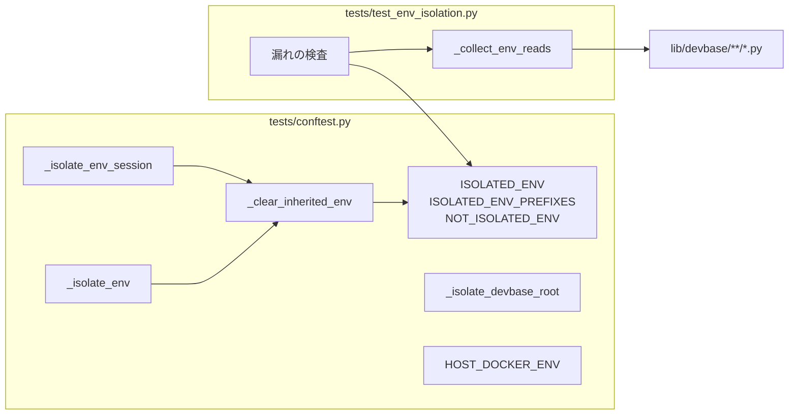
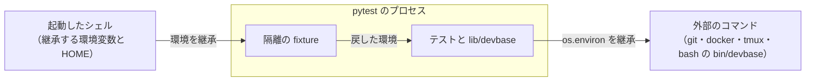
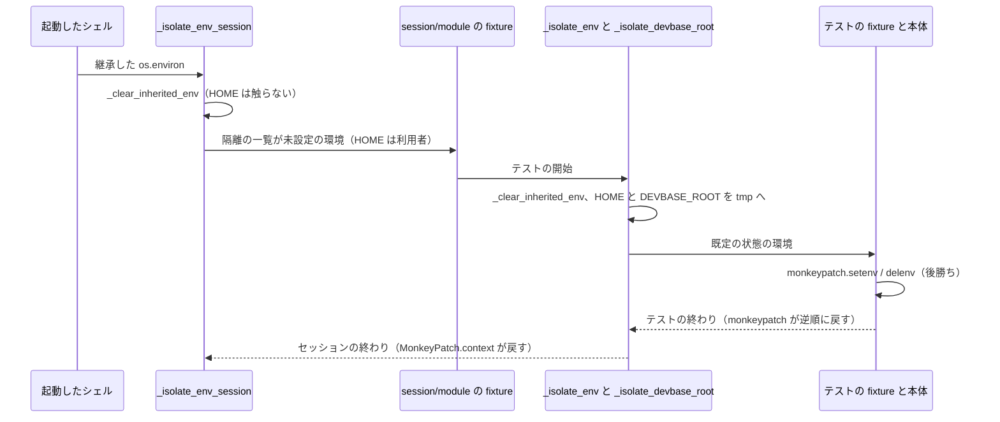

# テストの環境の隔離（環境変数と HOME）

## 概要

pytest は起動したシェルの環境をそのまま継承する。`tests/conftest.py` の autouse fixture は、
`lib/devbase` が読む環境変数を未設定へ戻し、`HOME` をテストごとの tmp のディレクトリへ置き換える。
これで pytest の結果は、起動したシェルの環境変数と利用者のホームディレクトリの中身から切り離され、
どの端末から走らせても同じコミットなら同じ件数が通る。

`lib/devbase` に環境変数を読むコードを足して隔離の一覧へ入れ忘れると、漏れの検査
（`tests/test_env_isolation.py`）が変数名と読む場所を出して落ちる。

隔離はテストの環境だけを変え、`lib/devbase` と `bin/devbase` の振る舞いは変えない。

### コンテキスト

| コンテキスト | 何の語が 1 つの意味に決まるか |
| --- | --- |
| テストの実行環境（`test`） | pytest のプロセスが持つ環境変数と `HOME` を、どの時点でどの状態にするか |

`lib/devbase` の各所（docker context・エディタ・機密など）は環境変数を読む側として現れるだけである。

## 用語

語の定義は [用語集](../glossary.md) の「テストの実行環境（`test`）」にある。この仕様は次の語を使う。

- 環境の隔離
- 隔離の一覧
- 隔離しない一覧
- 読み取りの集合
- 漏れの検査

## 対象範囲

- `tests/conftest.py` の autouse fixture による、環境変数と `HOME` の隔離
- 隔離の前の Docker の接続設定を、実機の Docker を使うテストへ渡す仕組み
- `lib/devbase` が読む変数を隔離の一覧へ入れ忘れたときに落ちる漏れの検査
- `DEVBASE_ROOT` はここでは未設定へ戻さず、`_isolate_devbase_root` がテストごとの tmp の root へ固定する
- `PATH`・`TMPDIR`・`LANG` など実行環境そのものを表す変数は隔離しない（読み取りの集合に入らない）
- テストが起動する外部のコマンド（`git`・`docker`・`tmux`）が自分で読む変数（`GIT_CONFIG_GLOBAL`・
  `DOCKER_CONFIG`・`SSH_AUTH_SOCK` など）は隔離しない。`HOME` の置き換えで既定の置き場は tmp へ移るが、
  変数で置き場を指している端末では利用者の設定を読む

## 構成要素

| 要素 | 置き場所 | 責務 |
| --- | --- | --- |
| `ISOLATED_ENV` | `tests/conftest.py` | 未設定へ戻す変数名の tuple。名前順に並べる |
| `ISOLATED_ENV_PREFIXES` | 同 | 未設定へ戻す変数名の接頭辞の tuple（`GCP_CREDENTIALS_BASE64__` の 1 つ） |
| `NOT_ISOLATED_ENV` | 同 | 隔離しない変数名から理由の文字列への dict |
| `_clear_inherited_env(mp)` | 同 | 渡された `MonkeyPatch` で、隔離の一覧の変数と接頭辞に合う `os.environ` の変数をすべて `delenv` する |
| `_isolate_env_session` | 同 | session scope の autouse fixture。`pytest.MonkeyPatch.context()` の中で `_clear_inherited_env` を呼び、セッションの終わりに戻す。`HOME` は触らない |
| `_isolate_env` | 同 | function scope の autouse fixture。`monkeypatch` で `_clear_inherited_env` を呼び、`HOME` を `tmp_path_factory.mktemp('home')` へ `setenv` する |
| `_isolate_devbase_root` | 同 | function scope の autouse fixture。`DEVBASE_ROOT` をテストごとの tmp の root へ `setenv` する |
| `HOST_DOCKER_ENV` / `host_docker_env()` | 同 | conftest の読み込み時（隔離の前）の Docker の接続設定と、それを今の環境に重ねた subprocess 用の env |
| 読み取りの集め方（`_collect_env_reads`） | `tests/test_env_isolation.py` | `lib/devbase/**/*.py` を `ast` で読み、読み取りの集合を返す |
| 漏れの検査と隔離のテスト | 同 | 下の「テスト観点」の 7 つのテスト |



すべて 1 つの pytest のプロセスの中で動く。外部の系は、pytest を起動したシェルと、テストが起動する
外部のコマンドの 2 つである。



外部のコマンドは `os.environ` を引き継ぐため、隔離はテストが起動する `bin/devbase` と `git` / `docker` にも
及ぶ。`bin/devbase` が読む `DEV_SERVICE_NAME`・`DEVBASE_ROOT`・`HOME`・`PWD` は、隔離の一覧・`_isolate_env`・
`_isolate_devbase_root` で覆われる。`PATH`・`PYTHONPATH` は実行環境として継承したまま残す。

## 仕様

### 集約

| 集約 | 持ち主（書き換えてよいもの） | 根 | 値オブジェクト |
| --- | --- | --- | --- |
| 隔離の規則 | `tests/conftest.py` | 隔離の一覧（`ISOLATED_ENV`） | 変数名・変数名の接頭辞・隔離しない理由 |
| 読み取りの集合 | `lib/devbase` の各ファイル | — | 変数名と、読む場所（`<lib/devbase からの相対パス>:<行>`） |
| 読み取りの集め方 | `tests/test_env_isolation.py` | `_collect_env_reads` | 拾う形（文字列・同じファイルの定数・`keys` の定数） |

読み取りの集合は `lib/devbase` のソースから導く値で、持ち主はソースを書く開発者である。隔離の規則は
それを名前でだけ参照し、2 つが揃っていないことを漏れの検査が見つける。

### 隔離の 2 段

隔離の fixture は session scope と function scope の 2 段で立つ。



- **session の段が先に立つ。** pytest は scope の広い fixture から立て、同じ scope では autouse を先に立てる。
  root の `conftest.py` の session scope の autouse は、テストのファイルが持つ session / module scope の
  fixture（`tests/containers/test_base_image_font_matching.py` の `probe`、`tests/containers/test_tmux_conf.py`
  の `options` など）より前に立つ。function scope の段だけでは、これらの fixture が継承した値を読む
  （偽の `DOCKER_HOST` へ `docker info` を打つなど）
- **テストごとの段でも同じ一覧を消す。** `lib/devbase` は `os.environ` へ直接書く箇所を持つ
  （`commands/container.py` の `PWD`・`COMPOSE_PROJECT_NAME` など、`tui/actions_env.py` の `PWD`）。
  `monkeypatch` を通らない書き込みは、次のテストの開始で消える
- **テストの側の設定は後勝ちになる。** root の `conftest.py` の function scope の autouse は、テストが明示に
  求める fixture とテストの本体より先に立つ。テストの側の `monkeypatch.setenv` / `delenv` は同じ
  `monkeypatch` に後から積まれ、テストの終わりに逆順で戻る。未設定の分岐も設定済みの分岐も、テストの側で
  1 行書けば試せる

### 既定の状態

- **隔離の一覧の変数はすべて未設定へ戻し、固定値を置かない。** `lib/devbase` は読む変数に未設定のときの
  既定を持つ（`DEV_SERVICE_NAME` は `dev`、`SHELL` は `/bin/bash`、`PWD` は `os.getcwd()`）。固定値にすると、
  未設定の分岐を試すテストが毎回 `delenv` を書くことになる
- **`PWD` も未設定へ戻す。** 起動したシェルの現在地で、`monkeypatch.chdir` と食い違うため。未設定なら
  `lib/devbase` は `os.getcwd()` を使い、chdir と揃う
- **`HOME` は function scope の段でだけ、テストごとの tmp のディレクトリへ置き換える。** 未設定にすると
  `Path.home()` と `os.path.expanduser` がパスワードのデータベースから利用者のホームを引き、隔離にならない。
  テストごとに別のディレクトリにするのは、書き込んだテストが隣のテストへ漏らさないためである
- **session の段では `HOME` を置き換えない。** docker は `~/.docker` の context の設定で daemon を探すため、
  session の段で替えると docker を使う session scope の fixture が skip に回る。session / module scope の
  fixture は利用者の `HOME` を読む

### 隔離の前の Docker の接続設定

隔離で `DOCKER_HOST` / `DOCKER_CONTEXT` は消え、`HOME` の置き換えで `~/.docker` の context も見失う。
実機の Docker を使うテストが同じ daemon を選べるように、conftest の読み込み時（fixture より前）に
接続設定を `HOST_DOCKER_ENV` へ採っておく。

| 項目 | 値 |
| --- | --- |
| 採る変数 | `DOCKER_HOST`・`DOCKER_CONTEXT`・`DOCKER_CONFIG` のうち、読み込み時に設定されているもの |
| `DOCKER_CONFIG` が無いとき | 元の `HOME` があれば `<元の HOME>/.docker` を入れる |
| `host_docker_env()` | `{**os.environ, **HOST_DOCKER_ENV}`。subprocess の `env=` に渡す |

使う側は 2 通りある。`tests/containers/test_base_image_font_matching.py` は `docker` の subprocess に
`env=host_docker_env()` を渡す。`tests/snapshot/test_restore_incremental.py` の `throwaway_volume` は、
`SnapshotManager` が `os.environ` のまま docker を呼ぶため、`HOST_DOCKER_ENV` を `monkeypatch.setenv` で
環境そのものへ積む。Docker を使わないテストはこの設定を受け取らない。

### 読み取りの集合の集め方

`_collect_env_reads` は `lib/devbase/**/*.py` を `ast` で読み、次の 2 つの和を返す。値は変数名から
読む場所（`<ファイル>:<行>` の集合）への dict である。

**1. 読み取りの形。** 受け手 `R` が `os.environ`、または名前が `env` / `environ` の変数のとき:

| 形 | 例 |
| --- | --- |
| `R.get(N, ...)` / `R.pop(N, ...)` / `R.setdefault(N, ...)` | `os.environ.get('DEV_SERVICE_NAME', 'dev')` |
| `R[N]` | `os.environ['COMPOSE_PROJECT_NAME']` |
| `N in R` / `N not in R` | `KEY_FILE_ENV in os.environ` |
| `os.getenv(N, ...)` | — |

`N` は次の 3 つのどれかに解決できたときだけ拾う。解決できない `N`（関数の引数など）は拾わない。

| `N` の書き方 | 解決の仕方 | 例 |
| --- | --- | --- |
| 文字列の定数 | そのまま | `'DEV_SERVICE_NAME'` |
| 名前 | 同じファイルの最上位で文字列を代入した名前、無ければ `keys.py` の最上位の名前 | `KEY_FILE_ENV`（`env/agekeys.py`） |
| `keys.X` / `K.X` | `keys.py` の最上位で `X` に代入した文字列 | `keys.GCP_AUTH_MODE` |

受け手に `env` / `environ` の名前を含めるのは、`utils/docker_context.py`・`editor/opener.py`・
`env/gcp_auth.py`・`editor/window_title.py` が `os.environ` を引数で受けて読むためである。`os.environ` の
形だけでは `DOCKER_CONTEXT`・`DOCKER_HOST`・`DEVBASE_DOCKER_CONTEXT`・`TMUX` を見逃す。受け手が環境変数で
ない辞書のときは名前が増えるだけで、テストの結果を変えない。

**2. `lib/devbase/env/keys.py` の定数。** 最上位の代入の右辺が文字列ならその値を、tuple なら要素のうち
文字列の定数を拾う（`AWS_ALL_KEYS` の要素は名前なので拾わず、名前の側の代入で拾う）。`keys.py` の定数は
すべて入れる。`env.get(keys.X)` の `env` は `os.environ` のことも `EnvFile` のこともあり、さらに
`env/runtime.py` はプロジェクトの `env` に書いたキーを名前を問わず `os.environ` から読むため、環境変数として
読むものを静的に切り分けられないからである。入れすぎた名前は未設定へ戻されるだけで、テストの結果を変えない。

どちらも、大文字・数字・`_` だけの名前（`^[A-Z][A-Z0-9_]*$`）に絞る。`__` で終わる値
（`GCP_CREDENTIALS_BASE64__`）は接頭辞として扱い、変数名の集合から外す。

### 3 つの一覧

| 一覧 | 中身 | 数 |
| --- | --- | --- |
| `ISOLATED_ENV` | 読み取りの集合から `DEVBASE_ROOT` を除いた名前と、集め方に掛からない 2 個（下の表） | 72 |
| `ISOLATED_ENV_PREFIXES` | `GCP_CREDENTIALS_BASE64__` | 1 |
| `NOT_ISOLATED_ENV` | `DEVBASE_ROOT`（理由: `_isolate_devbase_root` がテストごとの tmp の root へ固定する） | 1 |

**集め方に掛からないため手で足す 2 個:**

| 変数 | 読む場所 | 掛からない理由 |
| --- | --- | --- |
| `DEVBASE_IMAGE_MAX_AGE_DAYS` | `lib/devbase/commands/container.py` | 名前を引数で受ける `_env_non_negative_int` の中で読む |
| `DEVBASE_SNAPSHOT_MIN_INTERVAL_MINUTES` | 同 | 同上 |

`ISOLATED_ENV` の中身（名前順）:

```text
ANTHROPIC_API_KEY  AWS_ACCESS_KEY_ID  AWS_CONFIG_BASE64  AWS_DEFAULT_REGION  AWS_PROFILE
AWS_SECRET_ACCESS_KEY  AWS_SSO_URL  BIGQUERY_DATASETS  BIGQUERY_KEY_FILE  BIGQUERY_LOCATION
BIGQUERY_PROJECT  COMPOSE_PROFILES  COMPOSE_PROJECT_NAME  CONTEXT7_API_KEY  DEVBASE_ACCOUNT_GROUP
DEVBASE_AGE_KEY_FILE  DEVBASE_DOCKER_CONTEXT  DEVBASE_EDITOR  DEVBASE_EDITOR_DOCKER_CONTEXT
DEVBASE_EDITOR_SSH_HOST  DEVBASE_IGNORE_PLUGIN_REQUIRES  DEVBASE_IMAGE_MAX_AGE_DAYS
DEVBASE_OPEN_EDITOR  DEVBASE_OPEN_INDEX  DEVBASE_S3_ENDPOINT_URL  DEVBASE_S3_REGION  DEVBASE_S3_SSE
DEVBASE_S3_SSE_KMS_KEY_ID  DEVBASE_SNAPSHOT_MIN_INTERVAL_MINUTES  DEVBASE_WINDOW_TITLE
DEVBASE_WORKSPACE  DEVBASE_WORKSPACE_B64  DEVBASE_WORKSPACE_FOLDERS  DEVIN_API_KEY
DEVIN_API_ORG_WIDE  DEVIN_ORG_ID  DEVIN_SERVICE_ADMIN  DEVIN_SERVICE_USER  DEV_SERVICE_NAME
DOCKER_CONTEXT  DOCKER_GID  DOCKER_HOST  EDITOR  GCP_ACTIVE_PROFILE  GCP_AUTH_MODE  GEMINI_API_KEY
GH_TOKEN  GITHUB_PERSONAL_ACCESS_TOKEN  GIT_CREDENTIALS_BASE64  GIT_CREDENTIAL_HELPER  GIT_USER_EMAIL
GIT_USER_NAME  GOOGLE_APPLICATION_CREDENTIALS  GOOGLE_APPLICATION_CREDENTIALS_BASE64
GOOGLE_CLOUD_LOCATION  GOOGLE_CLOUD_PROJECT  HOST_SSH_HOST  HOST_SSH_USER  NPM_TOKEN  OPENAI_API_KEY
PWD  PYPI_API_KEY  SHELL  SLACK_BOT_TOKEN  SLACK_CHANNEL_ID  SLACK_TEAM_ID  SLACK_USER_MENTION  TMUX
VSCODE_IPC_HOOK_CLI  WSL_DISTRO_NAME  WSL_INTEROP  XDG_CONFIG_HOME
```

正本は `tests/conftest.py` の `ISOLATED_ENV` である。

漏れの検査は隔離の一覧の余分な名前（読み取りの集合に無い名前）を落とさない。`lib/devbase` から読み取りが
消えても名前が残るだけで隔離は壊れず、手で足した 2 個も余分と区別できないためである。

一覧は隔離の fixture と同じ `tests/conftest.py` に置き、漏れの検査は既存のテストと同じく
`from tests.conftest import ISOLATED_ENV, ISOLATED_ENV_PREFIXES, NOT_ISOLATED_ENV, _clear_inherited_env`
で読む。

### 常に成り立つ条件

| # | 集約 | 条件 | 破れたとき何が止めるか |
| --- | --- | --- | --- |
| I1 | 隔離の規則 | 読み取りの集合の変数名はすべて、隔離の一覧か隔離しない一覧のどちらかにある | `test_every_env_read_is_listed` が、載っていない変数名と読む場所を出して落ちる |
| I2 | 隔離の規則 | 隔離の一覧と隔離しない一覧は、同じ変数名を持たない | `test_isolated_and_not_isolated_are_disjoint` が、重なった変数名を出して落ちる |
| I3 | 隔離の規則 | function scope の隔離の fixture の設定が終わった直後（テストの側の function scope の fixture が立つ前）に、隔離の一覧の変数と接頭辞に合う変数はすべて未設定である | `test_env_unset_before_test_fixtures` が落ちる。一覧を消す helper の契約は `test_clear_inherited_env_unsets_listed` が別に見る |
| I4 | 隔離の規則 | session scope の隔離の fixture の設定が終わった時点で、起動元から継承した隔離の一覧の変数と接頭辞に合う変数はすべて未設定である（`HOME` は利用者のまま） | 変数を偽の値にした全体の起動で、docker を使うテスト（`test_base_image_font_matching.py`）が skip に回る |
| I5 | 隔離の規則 | テストの側が `monkeypatch.setenv` / `delenv` で書いた値は、隔離の fixture より後に効く | `test_test_side_setenv_wins` と、setenv する既存のテストが落ちる |
| I6 | 読み取りの集め方 | 集める処理は、既知の読み取りを 3 つの書き方（文字列・同じファイルの定数・`keys` の定数）のそれぞれで拾う | `test_collector_finds_known_reads` が落ちる |
| I7 | 隔離の規則 | function scope の隔離の fixture の設定が終わった直後に、`HOME` はそのテストだけの tmp のディレクトリを指す | `test_home_is_per_test_tmp` が落ちる |

I4 が保証するのは session の段が終わった時点までである。その後に別のテストが `os.environ` へ直接書いた
値は、後から初めて立つ session / module scope の fixture に残り得る。

### ドメインイベント

| # | イベント | 発生元 | 受け手 |
| --- | --- | --- | --- |
| E1 | 開発者が変数を export した端末で pytest を起動した | 開発者 | session scope の隔離の fixture |
| E2 | session scope の autouse fixture が、継承した隔離の一覧の変数を未設定へ戻した（`HOME` は触らない） | `_isolate_env_session`（セッションごとに 1 回） | 以降に立つ session / module scope の fixture |
| E3 | function scope の autouse fixture が、変数と `HOME` を既定の状態へ戻した | `_isolate_env`（テストごとに 1 回） | 以降に立つ fixture とテストの本体 |
| E4 | テストが自分で変数を設定した | テストの fixture と本体 | `lib/devbase` の読み取り |
| E5 | `lib/devbase` に、環境変数を読むコードが足された | 開発者 | 漏れの検査（I1） |

## エラー処理

漏れの検査（`test_every_env_read_is_listed`）が落ちたときの文言は、1 行目に件数、2 行目以降に 1 変数 1 行で
`<変数名>: <ファイル>:<行>, ...` を並べ、最後の行で直し方を示す。

```text
隔離の一覧に無い環境変数が 1 個ある
DEV_SERVICE_NAME: volume/compose.py:37
tests/conftest.py の ISOLATED_ENV か NOT_ISOLATED_ENV（理由つき）に足す
```

`test_isolated_and_not_isolated_are_disjoint` は `両方の一覧にある: <名前>, ...` で落ちる。

## 運用

- `lib/devbase` に環境変数の読み取りを足したら、変数名を `tests/conftest.py` の `ISOLATED_ENV` へ名前順に
  足す。未設定へ戻せない変数は、理由を添えて `NOT_ISOLATED_ENV` へ足す
- 名前を引数で受けて読む補助関数（`_env_non_negative_int` の形）は読み取りの集合に掛からず、漏れの検査が
  見逃す。そうした補助関数に渡す名前は、理由のコメントを添えて `ISOLATED_ENV` へ手で足す
- テストで変数の値が要るときは、テストの側で `monkeypatch.setenv` する。未設定の分岐は既定のまま試せる。
  `DEVBASE_ROOT` の未設定の分岐を試すときだけ `monkeypatch.delenv('DEVBASE_ROOT', raising=False)` を書く
- 実機の Docker を呼ぶテストは、subprocess へ `env=host_docker_env()` を渡すか、`HOST_DOCKER_ENV` を
  `monkeypatch.setenv` で積む。渡さないと、隔離で接続設定を失った docker が別の daemon を探して skip に回る
- 利用者のホームディレクトリのファイル（`~/.devbase/config.yml`・`~/.git-credentials`・`~/.ssh`・
  `~/.config` の age 鍵など）はテストの中から見えない。要るテストは tmp の `HOME` の下へ用意する

## テスト観点

`tests/test_env_isolation.py`:

- `test_every_env_read_is_listed`: 読み取りの集合の名前がすべて隔離の一覧か隔離しない一覧にあること。
  無ければ「エラー処理」の文言で変数名と読む場所を出して落ちること（I1）
- `test_isolated_and_not_isolated_are_disjoint`: 2 つの一覧が同じ名前を持たないこと（I2）
- `test_collector_finds_known_reads`: 読み取りの集合に `DEV_SERVICE_NAME`（文字列、`volume/compose.py`）・
  `DEVBASE_AGE_KEY_FILE`（同じファイルの定数、`env/agekeys.py`）・`GCP_AUTH_MODE`（`keys` の定数、
  `env/gcp_auth.py`）が、その読む場所つきで入ること（I6）
- `test_clear_inherited_env_unsets_listed`: 新しい `MonkeyPatch` で隔離の一覧の全部と
  `GCP_CREDENTIALS_BASE64__x` を設定してから `_clear_inherited_env` を呼ぶと、どれも `os.environ` に
  無いこと（I3 の helper）
- `test_env_unset_before_test_fixtures`: module scope の fixture が `DEV_SERVICE_NAME` と
  `GCP_CREDENTIALS_BASE64__x` を設定しても、テストが求める function scope の fixture が立った時点の
  `os.environ` にどちらも無いこと（I3）。`_isolate_env` が一覧を消し損ねても、fixture の順序が崩れても落ちる
- `test_home_is_per_test_tmp`: `os.environ['HOME']` が `pwd.getpwuid(os.getuid()).pw_dir` と異なり、
  `tmp_path_factory.getbasetemp()` の下にあること（I7）
- `test_test_side_setenv_wins`: `monkeypatch.setenv('DEV_SERVICE_NAME', 'x')` の後に
  `get_dev_service_name()` が `'x'` を返すこと（I5）

全体の起動で確かめる観点:

- `DEV_SERVICE_NAME=bogusdev uv run --locked pytest tests/ -q -p no:randomly` の passed と skipped の件数が、
  変数を設定しない起動と同じで、failed が 0 であること
- 次の 16 個を実在しない値（`SHELL` は実在する別のシェル、`DOCKER_HOST` は `tcp://127.0.0.1:1` など）にした
  同じ起動の passed と skipped の件数が、変数を設定しない起動と同じで、failed が 0 であること:
  `DEV_SERVICE_NAME`・`DEVBASE_ACCOUNT_GROUP`・`DEVBASE_AGE_KEY_FILE`・`COMPOSE_PROJECT_NAME`・
  `XDG_CONFIG_HOME`・`EDITOR`・`SHELL`・`DEVBASE_OPEN_INDEX`・`DEVBASE_OPEN_EDITOR`・`DEVBASE_EDITOR`・
  `DOCKER_CONTEXT`・`DOCKER_HOST`・`DEVBASE_DOCKER_CONTEXT`・`GCP_AUTH_MODE`・`GCP_ACTIVE_PROFILE`・`TMUX`。
  docker が使える端末では `test_base_image_font_matching.py` が skip に回らないこと（I4）。docker が
  使えない端末では変数に関係なく同じ数だけ skip し、件数の比較は同じになる
手で確かめる観点:

- `ISOLATED_ENV` から `DEV_SERVICE_NAME` を 1 つ外すと、上の 1 つ目の起動で
  `tests/volume/test_compose_gcp_auth.py` と `tests/volume/test_compose_secret_env.py` のテストが落ち、
  `test_every_env_read_is_listed` が `DEV_SERVICE_NAME: volume/compose.py:<行>` を出して落ちること

## 関連リンク

- [用語集](../glossary.md)
- [devbase 開発参加ガイド: テスト](../developer/contributing.md#テスト)
- [#218](https://github.com/devbasex/devbase/issues/218)（環境変数と `HOME` の隔離）、[#209](https://github.com/devbasex/devbase/issues/209)（`DEVBASE_ROOT` の隔離）
