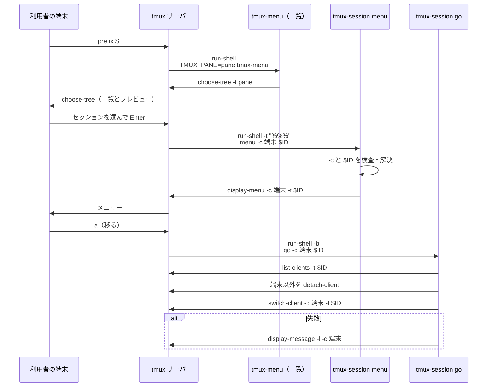

# tmux のセッションを名指しで扱うコマンド（tmux-session）

## 概要

base イメージは、1 つの tmux セッションを名前か ID で指して操作するコマンド `tmux-session` を
同梱する。操作は 3 つある。

- 移る（`go`）: 指したセッションへ移り、そのセッションに繋がっている**他の**端末を外す
- 調べる（`peek`）: attach せずに、繋がっている端末・pane のプロセス・画面の直近を出す
- 落とす（`kill`）: attach 中・実行中を問わずセッションを終わらせる

tmux の中では `prefix S` でセッションの一覧（`choose-tree`）を出し、選んだセッションに同じ
3 つをメニューから行える。コマンド `tmux-menu`（`tmux-session menu`）からも同じ一覧とメニューを
開ける。tmux の外で打つと attach して、attach した画面に一覧を出す。UI は tmux 組み込みの
`choose-tree` / `display-menu` / `display-popup` だけで組み、パッケージを足さない。

`tmux-first` / `tmux-clean` は「同じベース名のセッション群」を、操作中の端末と実行中の
セッションを守りながら整理する道具である。`tmux-session` は 1 つを狙って強制的に効かせる道具で、
守りの既定が逆になるため別のコマンドにしてある。`tmux-first` / `tmux-clean` の振る舞いは
変えない。

利用者向けの使い方（コマンドの例・メニューのキー・ホストの tmux で使う手順）は
[環境変数ガイド: セッションを名指しで扱う](../user/environment-variables.md#セッションを名指しで扱う)
にある。

## 対象範囲

- コマンド `tmux-session` と短縮名 `tmux-go` / `tmux-peek` / `tmux-kill` / `tmux-menu`
- `/etc/tmux.conf` の `prefix S` の割り当て
- base と、base を継ぐ派生イメージへの伝播の規則
- `containers/lfm` と `containers/snapshot` は base を継がないため対象に含まない
- ホストの `~/.local/bin` と `~/.tmux.conf` へ配る仕組みは持たない。devbase はホストの利用者の
  ファイルへ書かず（`~/.tmux.conf` を書き換えると、消したつもりの行が戻るなどの食い違いを
  生む）、手順を利用者向け文書に書いて利用者が置く
- tmux の外で、attach せずに一覧から選ぶ UI は持たない。`tmux-menu` は tmux の外では attach して
  一覧を出す。名指しの 3 操作は tmux の外からもコマンドで使える
- 読み取り専用の attach（`tmux attach -r`）の操作は持たない。`choose-tree` のプレビューが
  同じ用途を満たす

## 構成要素

| 要素 | 置き場所 | 責務 |
| --- | --- | --- |
| 本体 | `containers/base/tmux-session` → `/usr/local/bin/tmux-session` | サブコマンド `go` / `peek` / `kill` / `menu` を持つ POSIX sh（`#!/bin/sh`、`set -eu`）の 1 ファイル |
| 短縮名 | `/usr/local/bin/tmux-go` / `tmux-peek` / `tmux-kill` / `tmux-menu` | `tmux-session` への symlink。呼ばれた名前でサブコマンドが決まる |
| 導入 | `containers/base/Dockerfile` の「tmux セッションの整理コマンド」の節 | `COPY --chmod=0755 tmux-session /usr/local/bin/tmux-session` と、`tmux1` / `tmuxc` と同じ `RUN` の `ln -sf` 4 つ |
| キーの割り当て | `containers/base/tmux.conf` の末尾 → `/etc/tmux.conf` | `bind-key S run-shell "TMUX_PANE=#{pane_id} tmux-menu"` の 1 行。一覧の定義（`choose-tree` と template）は `tmux-session` が持つ |
| 静的検査 | `.github/workflows/ci.yml` の `shellcheck` ジョブ | `containers/base/tmux-first` / `tmux-clean` / `tmux-session` を既定の severity（style まで）で検査する |
| 回帰テスト | `tests/containers/test_tmux_session.py`、`tests/containers/test_tmux_conf.py` | 専用の tmux サーバでの振る舞いと、Dockerfile・tmux.conf の形を固定する |

本体を 1 ファイルにし短縮名を symlink にするのは、セッションの解決・実行元の端末の特定・`-c` の
検査を 4 つのサブコマンドで共有するためである。POSIX sh にはファイルをまたいで関数を共有する
標準の置き場所が無い。短縮名を alias にしないのは、`tmux1` / `tmuxc` と同じく alias が bash の
対話シェルにしか効かないためである。

`tmux-session` は tmux の CLI と `ps` だけを通して動き、tmux の内部の状態を直接読まない。
型（クラス）・永続データは持たない。

## 仕様

### 呼び出しの形

```text
tmux-session go   [-c 端末] <セッション>
tmux-session peek [-n 行数] <セッション>
tmux-session kill [-n] [-f] [-c 端末] <セッション>...
tmux-session menu
tmux-session menu -c 端末 <セッション>
tmux-go   …  = tmux-session go   …
tmux-peek …  = tmux-session peek …
tmux-kill …  = tmux-session kill …
tmux-menu …  = tmux-session menu …
```

- `basename "$0"` が `tmux-go` / `tmux-peek` / `tmux-kill` / `tmux-menu` なら第 1 引数を
  サブコマンドとして読まない。それ以外の名前で呼ばれたときは第 1 引数をサブコマンドとして読む
- `-h` / `--help` はどのサブコマンドでも使い方を標準出力へ出して終了コード 0 で終わる
- `kill` の `-n` は `--dry-run`、`-f` は `--force` とも書ける。`--` でオプションの終わりを示せる
- オプションはサブコマンドごとに受け付けるものが決まっている。`peek` は `-c` を、`go` は `-n` を
  受け取らない（知らないオプションとして終了コード 2）
- `go` / `peek` / `menu` はセッションをちょうど 1 つ、`kill` は 1 つ以上取る。ただし `menu` は
  セッションも `-c` も無いときに限り一覧を開く形になる。どちらか一方でもあればメニューを出す形として読む
- `-n 行数` は 0 以上の整数だけを受け付ける。既定は 20

`tmux-menu` を `menu` の短縮名にし、一覧を開く動きを「セッションも `-c` も無い形」に割り当てるのは、
`tmux-go` = `go` と同じ規則で名前から動きが読め、メニューを出す形（`menu -c 端末 <セッション>`）の
呼び出し元を何も変えずに済むためである。メニューを出す形は、`/etc/tmux.conf` の一覧の template と、
利用者がホストの `~/.tmux.conf` へ写した以前の割り当ての行が呼ぶため、形を変えない。

### セッションの指し方

| 引数の形 | 解決 |
| --- | --- |
| `$` + 数字（例 `$3`） | その ID のセッションだけ。無ければ「無い」。同じ文字列の名前へは**落ちない** |
| それ以外 | 名前の**完全一致**。`devbase-1` は `devbase-10` に当たらない |

`tmux list-sessions -F '#{session_id} #{session_name}'` を読み、最初の空白より後ろ全体を名前として
比べる（`tmux-clean` と同じ方法）。比べる値は `awk -v` ではなく環境変数で渡す（`-v` は値の `\` を
解釈するため）。名前に空白・`'`・`"`・`$`・`;` を含んでも取り違えない。

解決した後の tmux の操作はすべて ID（`-t '$3'`）で行う。ID は `$` と数字だけでできており、tmux の
コマンドにもシェルにも引用 1 段で渡せる。

**ID の形の引数を名前へ落とさないのは**、メニューが ID を渡すためである。確認を待つ間に対象が
終わって ID が消えたとき、名前へ落とすと `$3` という名前の別のセッションを落とす。代わりに、
`$` と数字だけの名前のセッションはコマンドから名前で指せない（`prefix S` の一覧からは選べる）。

### `-c 端末` と知らせの出し先

`-c` は「この端末の代わりに操作する」ことを示す。`menu` が組む項目は必ず `-c` を付けて呼ぶ。

| 項目 | `-c` あり | `-c` なし |
| --- | --- | --- |
| 値の形 | `[A-Za-z0-9/_.-]` だけでできていること。外れたら・空なら終了コード 2 | — |
| 端末の存在 | `tmux list-clients` に無ければ終了コード 1 | — |
| 実行元の端末 | `-c` の値 | tmux の中なら「実行元の特定」の規則で決める。tmux の外なら無し |
| 自分のセッション | `-c` の端末が見ているセッション | `TMUX` と `TMUX_PANE` があれば、その pane があるセッション |
| 知らせ（`KILL …` など） | `tmux display-message -l -c 端末` で端末の状態行へ出す。標準出力には何も出さない | 標準出力 |
| 警告・誤り | 端末の状態行と標準エラーの両方 | 標準エラー |

tmux の端末名は tty のパス（`/dev/pts/4`）か `client-<pid>` で、`-c` の値の形に収まる。この検査で
`menu` が組む tmux のコマンドへ引用 1 段で埋め込める。`display-message` に `-l` を付けるのは、
名前などに含まれる `#` を書式として展開させないためである。

### 実行元の特定（`go` で `-c` が無く tmux の中にいるとき）

`tmux-first` と同じ規則で決める（規則を変えるときは両方を直す）。pane のシェルは起動元の端末を
知らないため、`tmux display-message -p '#{client_activity}:#{client_name}'`（tmux の「現在の
端末」＝最終操作が最も新しい端末）を読み、最終操作から **10 秒以内**（境界の 10 秒を含む）の
ときだけ実行元と認める。プロンプトから打った場合はそのキー入力で最終操作が更新される。

### `go`（移る）

| 状況 | 振る舞い |
| --- | --- |
| tmux の外（`TMUX` が空）で `-c` なし | `exec tmux attach-session -d -t '$ID'`。`-d` で、そのセッションに繋がっていた端末を外す |
| 実行元が決まった（`-c` あり、または特定できた） | `list-clients -t '$ID'` の端末のうち実行元以外を `detach-client -t` で外し、**その後で**実行元が見ているセッションが対象と違えば `switch-client -c 実行元 -t '$ID'` で切り替える |
| tmux の中で実行元を特定できない | 何も外さず、切り替えず、手で切り替えるコマンド（`tmux switch-client -t '$ID'` と名前）を標準エラーへ出して終了コード 1 |

- 外すのを切り替えより先にする。先に切り替えると実行元も対象のセッションの端末の一覧に入る
- 別のセッションに繋がっている端末は `list-clients -t '$ID'` に出ないため、触らない
- 対象が実行元の今のセッションなら、他の端末を外すだけで切り替えない
- ある端末を外せなかったときは警告を出して残りの端末へ進み、切り替えも行う。切り替えに
  失敗したときは終了コード 1

### `peek`（調べる）

読むだけで、tmux の状態（繋がっている端末・セッションの一覧）を変えない。標準出力へ次の 4 節を
この順に出す。

```text
session  devbase-2 ($3)  windows 2  attached 1
clients
  /dev/pts/4  最終操作 Thu Sep 24 10:31:02 2026
panes
  0.0  uv  pid=1234  /work/devbase
    1300  uv run devbase list
      1310  python3 …/devbase list
  1.0  bash  pid=1400  /work
screen (0.0 の直近 20 行)
  …
```

| 節 | 取り方 |
| --- | --- |
| session | `display-message -p -t '$ID'` の `#{session_windows}` / `#{session_attached}` と、解決した名前・ID |
| clients | `list-clients -t '$ID'` の `#{client_name}` と `#{t:client_activity}`。無ければ `(なし)` |
| panes | `list-panes -s -t '$ID'` の `#{window_index}.#{pane_index}`・`#{pane_current_command}`・`#{pane_pid}`・`#{pane_current_path}`。各行の下へ `pane_pid` の子孫のプロセスを深さで字下げして並べる |
| screen | 今のウィンドウの今の pane の見えている画面を `capture-pane -p -J -t '$ID'` で取り、末尾の空行を除いてから最後の `<行数>` 行を出す。`-n 0` ならこの節を出さない |

- 子孫のプロセスは `ps -A -o pid= -o ppid= -o args=` を 1 回だけ取り、`awk` で辿る。Linux の
  procps と macOS の `ps` で同じ引数が使える。`pgrep -P` は子しか出さず、`uv` の下の `python3`
  のような孫が見えないため使わない。`&` で起動したものも出る
- `capture-pane -S -<行数>` は使わない。`-S` は履歴側の開始位置で、「履歴 N 行 + 画面全体」を
  返すため直近 N 行にならない

### `kill`（落とす）

| 状況 | 振る舞い |
| --- | --- |
| 対象が見つかった | `kill-session -t '$ID'`。attach 中・実行中を問わない。`KILL 名前` を出す |
| 対象が無い | 標準エラーへ出し、残りの対象へ進む。最後に終了コード 1 |
| `kill-session` が失敗した | 警告を出し、残りの対象へ進む。最後に終了コード 1 |
| 対象が自分のセッション・`-f` なし | 落とさずに理由を出し、残りへ進む。最後に終了コード 1 |
| 対象が自分のセッション・`-f` あり | **他の対象をすべて処理した後で**最後に落とす。自分のシェルに SIGHUP が届き、この処理自身も終わり得るため |
| `-n` | 落とさずに `KILL 名前 (dry-run)` を出す。`-f` と併せたときの自分のセッションも最後に出す |

`kill` は確認を挟まない。非対話でも使うためで、確認はメニューの側が持つ。

### `menu` と `prefix S`

`/etc/tmux.conf` の割り当ては次の 1 行である。

```tmux
bind-key S run-shell "TMUX_PANE=#{pane_id} tmux-menu"
```

一覧の定義は `tmux-session` の 1 か所にあり、`prefix S` とコマンド `tmux-menu`（`tmux-session menu`）が
共有する。`run-shell` は渡した文字列の `#{…}` を先に展開するため、template を割り当てへ直接書かずに
コマンドを呼ぶ。一覧を開く形の `tmux-session` は次を実行する。

```sh
TREE_TEMPLATE='run-shell -t "%%%" "tmux-session menu -c #{q:client_name} #{q:session_id}"'
tmux choose-tree -t "$TMUX_PANE" -Zs -O name "$TREE_TEMPLATE"   # TMUX と TMUX_PANE がある
tmux choose-tree -Zs -O name "$TREE_TEMPLATE"                   # TMUX があり TMUX_PANE が空
tmux attach-session \; choose-tree -Zs -O name "$TREE_TEMPLATE"  # tmux の外
```

- 一覧を出す pane は `TMUX_PANE` で決める。`run-shell` の中には `TMUX_PANE` が無く、`-t` が無いと
  直近に操作された別の端末に出ることがあるため、`prefix S` は押した pane の ID を `TMUX_PANE` で渡す
  （`run-shell` は `#{pane_id}` を先に展開し、`%3` の形の引用の要らない ID が渡る）
- tmux は、端末を持たないクライアントから来たコマンドの現在の pane を、その環境の `TMUX_PANE` で
  決める。そのため `-t` が無くても `TMUX_PANE` の pane に出る。それでも `-t "$TMUX_PANE"` を付けるのは、
  出す pane をコマンドの行に書いて読めるようにし、tmux が環境から現在の pane を引く規則に頼らない
  ためである。`-t` の有無で振る舞いは変わらない
- tmux の外での attach 先は tmux の既定（端末の繋がっていないセッションを優先し、その中で直近のもの。
  すべてに端末が繋がっていれば全体で直近のもの）に従い、attach した画面に一覧を出す。attach 先を
  引数で取らないのは、名指しで移るなら `tmux-go` があり、一覧からどのセッションへも移れるためである。
  tmux のサーバが動いていなければ、サーバもセッションも作らずに終了コード 1 で終わる
- `choose-tree -Zs -O name` は、名前順のセッションの一覧を全画面で出す。tmux の既定の操作
  （`v` でプレビューの切り替え、`f` で絞り込み、`x` で 1 つ落とす、`t` で印を付けて `X` で
  まとめて落とす）はそのまま使える
- template の `"%%%"` は選んだセッションの `=名前:` に置き換わる。`%%%` は `"` `\` `$` `;` `~` の
  前に `\` を補うため、二重引用の中でどんな名前でも壊れない。`'%%'` は `'` を含む名前で解析に
  失敗する。template では**最初の 1 つだけ**が置き換わるため、`%%%` は `-t` の 1 か所だけに書く
- `run-shell -t` で選んだセッションを対象にすることで、`#{q:session_id}` は選んだセッションの ID、
  `#{q:client_name}` は `prefix S` を押した端末の名前に、シェル向けの引用付きで展開される。
  `q:` を外すと `$1` などがシェルの位置引数として展開され、値が消える
- `menu` へ渡すのは名前ではなく ID である

`menu` は次を出す。

```text
tmux display-menu -c 端末 -t '$ID' -T '#[align=centre]#{session_name}' …
```

題名は `-t` のセッションで書式が展開されるため、名前をコマンドへ埋め込まない。項目は次の 3 つ。

| 表示 | キー | 動かすもの |
| --- | --- | --- |
| 移る（他の端末を外す） | `a` | `run-shell -b "tmux-session go -c '端末' '$ID'"` |
| 中身を見る | `p` | `display-popup -c '端末' -E -w 90% -h 90% "tmux-session peek '$ID'; …; read -r _"`。出力の後に `[Enter で閉じる]` を出し、Enter で閉じる |
| 落とす | `k` | `confirm-before -t '端末' -p '<表示名> を落としますか? (y/n)' "run-shell -b \"tmux-session kill -f -c '端末' '$ID'\""` |

- 項目のコマンドへ埋め込むのは、検査済みの端末名・ID と `<表示名>` だけである。引用は
  `display-menu` の項目 → tmux のコマンド → `run-shell` のシェルの 3 段になる。tmux の二重引用の
  中の `$数字` は環境変数として展開されない（変数名は英字か `_` で始まる）ため、ID は `\` なしで
  書ける
- `<表示名>` は、名前が `[A-Za-z0-9._+@-]` だけでできていれば名前（devbase のセッション名
  `<ディレクトリ名>-<数字>` はここに入る）、それ以外の文字を含めば ID（例 `$3`）。確認の文の書式は
  押した端末の今のセッションで展開されるため、`#{session_name}` では選んだセッションを指せない
- `confirm-before` の端末の指定は `-t` である（`-c` は確認のキーを指す）
- **「落とす」は `-f` を付けて呼ぶ。** `confirm-before` の同意が自分のセッションを落とすことの
  確認を兼ねる。自分のセッションが落ちた端末は tmux の `detach-on-destroy` の既定（`on`）に
  従って外れる
- 「中身を見る」を `display-popup` にするのは、作業中の pane を覆わず、閉じれば元の画面に戻る
  ためである。base に `less` は無く、`more` は出力が窓に収まるとすぐ終わって窓が閉じるため、
  `read` で Enter を待つ。popup の高さを超える出力は上が切れる。全体はシェルで `tmux-peek` を
  実行して読む
- 背景の `run-shell -b` から呼ばれた `go` / `kill` の知らせと誤りは、`display-message -c` で
  押した端末の状態行へ届く

`prefix S` は tmux 3.6・3.7b の既定で割り当てが無く、既定の `s`（`choose-tree -Zs`）と並ぶ位置に
ある。`prefix s` は置き換えない（tmux に慣れた利用者の手の動きを変えるため）。



### 終了コード（全サブコマンド共通）

| 終了コード | 場合 |
| --- | --- |
| 0 | 成功。`-h` / `--help` |
| 1 | tmux が無い・サーバが無い・対象のセッションが無い・`-c` の端末が無い・実行元を特定できない・自分のセッションを `-f` なしで `kill` しようとした・tmux のコマンドが失敗した |
| 2 | 使い方の誤り（サブコマンドが無い・知らないサブコマンドとオプション・オプションの値が無い・セッションの数が合わない・`-n` が 0 以上の整数でない・`-c` の値の形が外れた・メニューを出す形の `menu` に `-c` が無い） |

誤りは理由を標準エラーへ出す。終了コード 2 のときは `使い方は <呼ばれた名前> -h` を添える。

### 常に成り立つ条件

- 名前は完全一致で解決し、`$` + 数字は ID としてだけ解決する
- 解決した後の tmux の操作は ID で行い、名前をシェルや tmux のコマンドへ埋め込まない
  （例外は安全な文字だけの `<表示名>`）
- `peek` は tmux の状態を変えない
- `go` は、実行元の端末と、対象以外のセッションに繋がっている端末を外さない。実行元が
  分からないときは何もしない
- `kill` は `-f` なしで自分のセッションを落とさず、`-f` ありでも自分のセッションは最後に落とす
- `tmux-first` / `tmux-clean` と、その短縮名 `tmux1` / `tmuxc` の振る舞いは変わらない

## データ・設定

環境変数・設定ファイルは持たない。tmux の既定のソケット（`$TMUX_TMPDIR/tmux-<uid>/default`）の
サーバへ繋ぎ、`-S` / `-L` は受け取らない。

`prefix S` の割り当ては `/etc/tmux.conf` にあり、tmux は後から `~/.tmux.conf` を読むため、利用者が
`S` を別の操作に割り当てていればそちらが勝つ。その場合もコマンドは使える。

## 運用

- 変更は**イメージを建て直すまで反映されない**。`devbase build base --no-cache` で base を
  建て直し、使っている派生イメージ（いずれも `FROM devbase-base:latest`）も建て直し、稼働中の
  コンテナは `devbase down` → `devbase up` で作り直す。`devbase up` だけでは反映されない
- 稼働中の tmux サーバへ `prefix S` だけを先に効かせるには `tmux source-file /etc/tmux.conf` を使う
  （コマンドが `PATH` に無ければメニューは動かない）
- `containers/lfm` と `containers/snapshot` は base を継がないため入らない
- ホストの tmux で使うときは、利用者が devbase の checkout の `containers/base/tmux-session` を
  指す symlink を `~/.local/bin` へ 5 つ（`tmux-session` と短縮名 4 つ）張り、`~/.tmux.conf` へ上の
  1 行を足す。複写ではなく symlink にすると `git pull` で更新が届く
- ホストの `~/.tmux.conf` に以前の割り当て（`bind-key S choose-tree …` で template を直接書く行）を
  残していても、`prefix S` はメニューを出す形を呼ぶためそのまま動く。`tmux-menu` を使うには symlink の
  `tmux-menu` を足す
- 動作を確かめてある tmux は、コンテナの 3.6（Ubuntu 26.04）とホストの 3.7b。使う機能
  （`choose-tree` の template・`display-menu`（3.0 以降）・`display-popup`（3.2 以降）・
  書式の `q:`）は両方にある。`/bin/sh` は Ubuntu の dash と macOS の bash 3.2（POSIX モード）で
  確かめてある。WSL のホストと amd64 の建て直しは確かめていない（アーキテクチャに依存するものは
  無い）

## テスト観点

`tests/containers/test_tmux_session.py`。テストごとに短い一時ディレクトリへ `TMUX_TMPDIR` を向け、
`TMUX` を消した環境で tmux サーバを起動し、端末は `pty` から attach する。利用者の tmux サーバには
触れない。tmux が無い環境では tmux を使うテストを skip する。

- 移る
  - tmux の外で `tmux-go devbase-1` を実行すると `devbase-1` に attach し、それまで繋がっていた
    端末は外れ、`devbase-10` の端末は残ること
  - `-c` の実行元・プロンプトから打った実行元のどちらでも、対象の**他の**端末を外してから実行元を
    切り替え、実行元と別のセッションの端末は残ること。対象が実行元の今のセッションなら切り替えずに
    他の端末だけを外すこと
  - 最終操作から 10 秒なら実行元と認め、11 秒なら何も外さず切り替えず終了コード 1 になること
  - 端末を外せなかったときも残りの端末へ進んで切り替えること。切り替えに失敗したら終了コード 1
- 調べる
  - `&` で起動したものと子の下の孫を含め、4 節（session / clients / panes / screen）を出すこと
  - `-n` の行数、`-n 0`、画面の行数を超える `-n`、端末が無いとき `(なし)` を出すこと
  - 前後で `list-clients` と `list-sessions` が変わらないこと
- 落とす
  - 端末が繋がりコマンドが動いているセッションを `-f` なしで落とし、`devbase-30` は残ること
  - 無い対象・落とせない対象を飛ばして残りを落とし、終了コード 1 になること
  - 自分のセッションは `-f` なしで残って終了コード 1、`-f` ありで他を処理した後に落ちること。
    `-c` の端末が見ているセッションも自分のセッションとして扱うこと
  - `-n` は何も落とさず、`-n -f` の自分のセッションも最後に出すこと
- 名前と誤り
  - 名前に空白・`'`・`"`・`$`・`;` を含んでも、3 つの操作が名前どおりのセッションに効くこと
  - `$` + 数字が ID のセッションに効き、同じ文字列の名前へ落ちないこと
  - 使い方の誤り（上の表の各場合）は終了コード 2、無いセッション・サーバが無い・`-c` の端末が
    無いときは終了コード 1 で、理由を標準エラーへ出すこと
  - `tmux-session <サブコマンド>` と短縮名が同じ振る舞いをし、どちらでも `-h` が終了コード 0 で
    あること
- `prefix S`
  - `containers/base/tmux.conf` を読んだ tmux の `list-keys -T prefix` に `S` の割り当てがちょうど
    1 つあり、`run-shell "TMUX_PANE=#{pane_id} tmux-menu"` であること（`test_tmux_conf.py`）
  - 引数を書き出すだけの偽の `tmux-session` を `PATH` の先頭に置き、`pty` から `C-b S` → 選択 →
    Enter を送ると、選んだセッションの ID と押した端末の名前が渡ること。特殊文字の名前でも同じこと
  - 本物の `tmux-session` で、メニューの「移る」「中身を見る」「落とす」（確認の `y`）がそれぞれ
    効き、今いるセッションも同意すれば落ちること。背景の `run-shell` からの知らせが端末へ届くこと
- `tmux-menu`（一覧を開く形）
  - tmux の中で `tmux-menu` と `tmux-session menu` のどちらをプロンプトから打っても、その pane に
    一覧（`tree-mode`）が出ること
  - `TMUX_PANE` の pane に一覧が出て、後から attach して直近に操作された端末の pane には出ないこと。
    `TMUX` があり `TMUX_PANE` を消した環境でも、端末が 1 つだけなら、その端末の pane に一覧が出て
    終了コード 0 であること
  - tmux の外で打つと、端末の繋がっていないセッションへ attach して一覧を出すこと
  - 偽の `tmux-session` で、中・外のどちらで開いた一覧でも、選んで Enter を押すと
    `menu -c <Enter を押した端末> <選んだ ID>` が渡ること。特殊文字の名前でも同じこと
  - 本物の `tmux-session` で、一覧から出したメニューの「移る」で Enter を押した端末が移り、対象に
    繋がっていた他の端末が外れること
  - メニューを出す形（`-c 端末 <ID>`）は、`tmux-menu` と `tmux-session menu` のどちらでもメニューを
    出すこと
  - サーバが無いと、`tmux-menu` と `tmux-session menu` のどちらも終了コード 1 で標準エラーへ理由を
    出し、セッションを作らないこと
  - `tmux-menu -h` が終了コード 0 で、`tmux-session -h` の使い方に `tmux-menu` が載ること。`-c` だけで
    セッションが無い・`-c` が無い・余分な引数・知らないオプションは終了コード 2 であること
- 配布
  - Dockerfile に `COPY --chmod=0755 tmux-session /usr/local/bin/tmux-session` が 1 行あり、
    短縮名 4 つの `ln -sf tmux-session /usr/local/bin/<名前>` があること
  - `containers/base/tmux-session` が `#!/bin/sh` で始まり実行権を持つこと

一覧を開いて選ぶテストは、コマンド行とカーソルの移動を `send-keys` で pane へ送り、Enter だけは
繋いだ端末から送る。`send-keys` で送った Enter では、template の `#{client_name}` が押した端末ではなく
直近に操作された端末に展開され、渡った端末名を確かめられないためである。後から attach した端末は、
打たなくても直近に操作された端末になる。

`test_tmux_conf.py` の copy-mode の割り当ての比較は `-T copy-mode` / `-T copy-mode-vi` の行だけを
対象にし、`prefix S` の行が混ざっても崩れない。

CI はイメージを建てないため、次は建てたイメージで手で確かめる。

- `docker run --rm --entrypoint /bin/bash devbase-base:latest -c 'ls -l /usr/local/bin/tmux-*; tmux-go -h; echo exit=$?'`
  で `tmux-session` と短縮名 4 つのコマンドがあり、`tmux-go -h` が終了コード 0 で終わること
- 建てた base の `shellcheck` で `containers/base/tmux-session` を既定の severity で検査すると、
  指摘が 0 件であること
- 建て直した base のコンテナの tmux で、`prefix S` のメニューの 3 つの操作が効くこと
- 建て直した base のコンテナで `tmux-menu` を打つと、セッションの一覧が開くこと

CI の ShellCheck ジョブは runner の shellcheck で `tmux-first` / `tmux-clean` / `tmux-session` を
検査する。

## 関連リンク

- [環境変数ガイド: セッションを名指しで扱う](../user/environment-variables.md#セッションを名指しで扱う)
- [コンテナ操作ガイド: tmux（ターミナル）の既定設定](../user/container-operations.md#tmuxターミナルの既定設定)
- [Kiro CLI 認証永続化と tmux コピー操作](kiro-auth-persistence-and-tmux-copy.md)（`/etc/tmux.conf` の他の既定）
- [base イメージの Bash の静的検査（shellcheck）](base-image-shellcheck.md)
