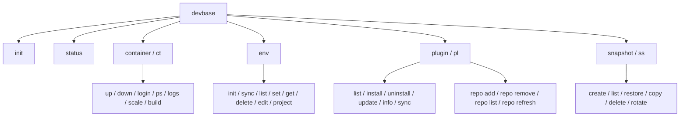

# CLI リファレンス

devbase の全コマンドの構文、オプション、使用例をまとめたリファレンスです。

## コマンド体系

devbase のコマンドは 4 つのグループとトップレベルコマンドで構成されています。



### グループエイリアス

各グループには短縮形が用意されています。

| グループ名 | エイリアス |
|-----------|-----------|
| `container` | `ct` |
| `plugin` | `pl` |
| `snapshot` | `ss` |

### ショートカットコマンド

頻繁に使用するコンテナ操作はトップレベルから直接実行できます。これらは `container` グループに自動転送されます。

| ショートカット | 転送先 |
|--------------|--------|
| `devbase up` | `devbase container up` |
| `devbase down` | `devbase container down` |
| `devbase login` | `devbase container login` |
| `devbase build` | `devbase container build` |
| `devbase ps` | `devbase container ps` |

### ユニークプレフィックスマッチング

コマンド名が一意に特定できる場合、先頭の数文字だけで実行できます。

```bash
# 以下は全て同じコマンド
devbase plugin list
devbase pl list
devbase p l
devbase pl l
```

> **Note:** 一意に特定できない場合は候補が表示されます。

## トップレベルコマンド

### `devbase init`

devbase の初期セットアップを実行します。

```
devbase init
```

実行内容:
- `bin/devbase` を PATH に追加（`~/.bashrc` / `~/.zshrc`）
- シェル補完スクリプトの登録
- `plugins.yml` の作成（存在しない場合）

### `devbase status`

現在の環境の状態をまとめて表示します。

```
devbase status
```

表示項目:
- コンテナの状態（起動中 / 停止中 / 未ビルド）
- インストール済みプラグイン一覧
- 環境変数の設定状況
- スナップショットの状態

## container (ct) グループ

コンテナのライフサイクル管理を行うコマンド群です。

### `devbase container up`

コンテナを起動します。

```
devbase container up
devbase up
```

- 起動時にスナップショットを自動作成（新世代 or 差分追加）
- `CONTAINER_SCALE` の値に基づいてコンテナ数を決定

### `devbase container down`

コンテナを停止・削除します。

```
devbase container down
devbase down
```

- 停止時にスナップショットのローテーションを自動実行

### `devbase container login`

コンテナにログインします。

```
devbase container login [index]
devbase login [index]
```

| パラメータ | 必須 | デフォルト | 説明 |
|-----------|------|-----------|------|
| `index` | いいえ | `1` | ログインするコンテナの番号 |

```bash
# 1番目のコンテナにログイン
devbase login

# 2番目のコンテナにログイン
devbase login 2
```

### `devbase container ps`

コンテナの状態を表示します。

```
devbase container ps [-a]
devbase ps [-a]
```

| オプション | 説明 |
|-----------|------|
| `-a` | 停止中のコンテナも表示 |

### `devbase container logs`

コンテナのログを表示します。

```
devbase container logs [-f] [--tail N]
```

| オプション | 説明 |
|-----------|------|
| `-f` | ログをリアルタイムで追跡 |
| `--tail N` | 末尾 N 行のみ表示 |

```bash
# 最新50行をリアルタイムで追跡
devbase container logs -f --tail 50
```

### `devbase container scale`

既存のコンテナを再起動せずにスケールします。

```
devbase container scale <num>
```

| パラメータ | 必須 | 説明 |
|-----------|------|------|
| `<num>` | はい | コンテナ数 |

```bash
# コンテナを3台に増やす
devbase container scale 3

# コンテナを1台に減らす
devbase container scale 1
```

### `devbase container build`

コンテナイメージをビルドします。

```
devbase container build [image]
devbase build [image]
```

| パラメータ | 必須 | 説明 |
|-----------|------|------|
| `image` | いいえ | ビルドするイメージ名（省略時は全イメージ） |

## env グループ

環境変数の管理を行うコマンド群です。詳細は [環境変数ガイド](environment-variables.md) を参照してください。

### `devbase env init`

環境変数の対話式初期セットアップを実行します。

```
devbase env init [--reset]
```

| オプション | 説明 |
|-----------|------|
| `--reset` | 既存の設定をリセットして再設定 |

### `devbase env sync`

ソースファイル（`~/.aws/config` 等）の変更を検出し、環境変数を再同期します。

```
devbase env sync
```

### `devbase env list`

設定済みの環境変数を一覧表示します。

```
devbase env list [-g|-p] [-r] [-k]
```

| オプション | 説明 |
|-----------|------|
| `-g` | グローバル変数のみ表示 |
| `-p` | プロジェクト変数のみ表示 |
| `-r` | 値も表示（デフォルトではキーのみ） |
| `-k` | キー名でソート |

```bash
# グローバル変数のみ、値付きで表示
devbase env list -g -r

# プロジェクト変数をキー名順で表示
devbase env list -p -k
```

### `devbase env set`

環境変数を設定します。

```
devbase env set KEY=VALUE [-p]
```

| オプション | 説明 |
|-----------|------|
| `-p` | プロジェクトレベルに設定（デフォルトはグローバル） |

```bash
# グローバルに設定
devbase env set ANTHROPIC_API_KEY=sk-xxx

# プロジェクトレベルに設定
devbase env set GCP_ACTIVE_PROFILE=my-project -p
```

### `devbase env get`

環境変数の値を取得します。

```
devbase env get KEY
```

```bash
devbase env get AWS_PROFILE
```

### `devbase env delete`

環境変数を削除します。

```
devbase env delete KEY
```

### `devbase env edit`

デフォルトエディタで `.env` ファイルを開きます。

```
devbase env edit
```

### `devbase env project`

プロジェクト固有の環境変数を対話式で設定します。

```
devbase env project
```

## plugin (pl) グループ

プラグインの管理を行うコマンド群です。

### `devbase plugin list`

インストール済み、または利用可能なプラグインを一覧表示します。

```
devbase plugin list [--available]
```

| オプション | 説明 |
|-----------|------|
| `--available` | リポジトリから取得可能なプラグインを表示 |

### `devbase plugin install`

プラグインをインストールします。

```
devbase plugin install <source>
```

ソースの指定形式:

| 形式 | 説明 | 例 |
|------|------|----|
| 名前のみ | 登録済みリポジトリから検索 | `devbase plugin install adminer` |
| リポジトリ直接指定 | 特定リポジトリのプラグイン | `devbase plugin install user/repo:plugin-name` |
| 全プラグイン一括 | リポジトリの全プラグインをインストール | `devbase plugin install user/repo --all` |
| ローカルリンク | ローカルディレクトリからリンク | `devbase plugin install /path:plugin-name --link` |

### `devbase plugin uninstall`

プラグインをアンインストールします。

```
devbase plugin uninstall <name>
```

### `devbase plugin update`

プラグインを最新バージョンに更新します。

```
devbase plugin update [name]
```

| パラメータ | 必須 | 説明 |
|-----------|------|------|
| `name` | いいえ | 更新するプラグイン名（省略時は全プラグイン） |

### `devbase plugin info`

プラグインの詳細情報を表示します。

```
devbase plugin info <name>
```

### `devbase plugin sync`

プロジェクトのシンボリックリンクを再同期します。

```
devbase plugin sync
```

### `devbase plugin repo add`

プラグインリポジトリを登録します。

```
devbase plugin repo add <url>
```

```bash
# GitHub ショートハンド
devbase plugin repo add user/repo

# 完全な URL
devbase plugin repo add https://github.com/user/repo.git
```

### `devbase plugin repo remove`

リポジトリの登録を削除します。

```
devbase plugin repo remove <name>
```

### `devbase plugin repo list`

登録済みリポジトリの一覧を表示します。

```
devbase plugin repo list
```

### `devbase plugin repo refresh`

プラグイン一覧をリポジトリから再取得します。

```
devbase plugin repo refresh [name]
```

| パラメータ | 必須 | 説明 |
|-----------|------|------|
| `name` | いいえ | 更新するリポジトリ名（省略時は全リポジトリ） |

## snapshot (ss) グループ

スナップショットの管理を行うコマンド群です。詳細は [スナップショットガイド](snapshot-guide.md) を参照してください。

### `devbase snapshot create`

スナップショットを作成します。

```
devbase snapshot create [--name NAME] [--full]
```

| オプション | 説明 |
|-----------|------|
| `--name NAME` | スナップショット名を指定（デフォルトはタイムスタンプ） |
| `--full` | フルバックアップを強制作成 |

```bash
# 自動命名で差分スナップショット
devbase snapshot create

# 名前付きフルバックアップ
devbase snapshot create --name before-upgrade --full
```

### `devbase snapshot list`

スナップショットの一覧を表示します。

```
devbase snapshot list
```

### `devbase snapshot restore`

スナップショットから復元します。

```
devbase snapshot restore <name> [--point N]
```

| パラメータ / オプション | 必須 | 説明 |
|----------------------|------|------|
| `<name>` | はい | 復元するスナップショット名 |
| `--point N` | いいえ | N 番目の差分まで復元（省略時は最新まで全適用） |

> **Warning:** 復元前に現在の状態が `pre-restore-<timestamp>` として自動バックアップされます。

### `devbase snapshot copy`

スナップショットをコピーします。

```
devbase snapshot copy <name> <new_name>
```

### `devbase snapshot delete`

スナップショットを削除します。

```
devbase snapshot delete <name>
```

### `devbase snapshot rotate`

古い世代のスナップショットを削除します。

```
devbase snapshot rotate [--keep N]
```

| オプション | 説明 |
|-----------|------|
| `--keep N` | 保持する世代数（デフォルト: `3`） |
