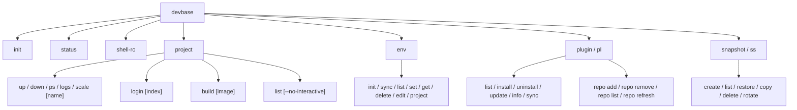

# CLI リファレンス

devbase の全コマンドの構文、オプション、使用例をまとめたリファレンスです。

## コマンド体系

devbase のコマンドは 4 つのグループとトップレベルコマンドで構成されています。


```mermaid
graph TD
    A[devbase] --> B[init]
    A --> C[status]
    A --> H[shell-rc]
    A --> D[project]
    A --> E[env]
    A --> F[plugin / pl]
    A --> G[snapshot / ss]
    D --> D1["up / down / ps / logs / scale [name]"]
    D --> D3["login [index]"]
    D --> D4["build [image]"]
    D --> D2["list [--no-interactive]"]
    E --> E1[init / sync / list / set / get / delete / edit / project]
    F --> F1[list / install / uninstall / update / info / sync]
    F --> F2[repo add / repo remove / repo list / repo refresh]
    G --> G1[create / list / restore / copy / delete / rotate]
```

> **`container` グループは非推奨になりました。** 旧 `devbase container <sub>` は
> `devbase project <sub>` のエイリアスとして当面動作しますが、実行時に非推奨警告を
> 表示します（移行期間後のリリースで削除予定）。新しいコマンドは `project` を使用してください。

### グループエイリアス

各グループには短縮形が用意されています。

| グループ名 | エイリアス | 備考 |
|-----------|-----------|------|
| `plugin` | `pl` | |
| `snapshot` | `ss` | |
| `container` | `ct` | **非推奨**（`project` へ移行してください） |

### ショートカットコマンド

頻繁に使用するプロジェクト操作はトップレベルから直接実行できます。これらは `project` グループに自動転送されます。

| ショートカット | 転送先 |
|--------------|--------|
| `devbase up [name]` | `devbase project up [name]` |
| `devbase down [name]` | `devbase project down [name]` |
| `devbase login [index]` | `devbase project login [index]` |
| `devbase build [image]` | `bin/devbase` の `cmd_build`（シェル実装）※ |
| `devbase ps [name]` | `devbase project ps [name]` |
| `devbase scale [name] <num>` | `devbase project scale [name] <num>` |
| `devbase list` | `devbase project list` |

> **Note:** `logs` はトップレベルシノニムを持ちません。`devbase project logs` を使用してください。
>
> **※ `build` の転送先について:** `devbase build` は他のショートカットのように `project` グループ
> （Python 実装）へ転送されるのではなく、`bin/devbase` のシェル実装 `cmd_build` に直接委譲されます。
> base イメージの段階ビルド等を CWD で行う必要があるためで、`devbase project build` とは実装経路が
> 異なります（名前指定はラッパーの `cd` で解決）。挙動上の入出力は同等ですが、実装は別物です。

### ユニークプレフィックスマッチング

コマンド名が一意に特定できる場合、先頭の数文字だけで実行できます。

```bash
# 以下は全て同じコマンド
devbase plugin list
devbase pl list
devbase p l
devbase pl l
```

> **Note:** 一意に特定できない場合は候補が表示されます。

## トップレベルコマンド

### `devbase init`

devbase の初期セットアップを実行します。

```
devbase init
```

実行内容:
- `bin/devbase` を PATH に追加（`~/.bashrc` / `~/.zshrc`）
- シェル補完スクリプトの登録
- `plugins.yml` の作成（存在しない場合）

### `devbase status`

現在の環境の状態をまとめて表示します。

```
devbase status
```

表示項目:
- コンテナの状態（起動中 / 停止中 / 未ビルド）
- インストール済みプラグイン一覧
- 環境変数の設定状況
- スナップショットの状態

### `devbase shell-rc`

`devbase init` が書き込んだシェル設定ファイル（rc ファイル）のフルパスを stdout に 1 行だけ出力します。`source` のコマンド置換と組み合わせ、ユーザーが zsh / bash on Linux / bash on macOS のどれを使っているかを意識せずに rc ファイルを再読み込みするためのユーティリティです。

```
devbase shell-rc
```

判定ロジックは `devbase init` と同一なので、書き込み先と完全に一致します。

| 環境 | 出力例 |
|------|--------|
| zsh | `/Users/<user>/.zshrc` |
| bash on macOS | `/Users/<user>/.bash_profile` |
| bash on Linux | `/home/<user>/.bashrc` |

使用例:

```bash
# 初期化直後に rc を再読み込み（環境差を吸収）
./bin/devbase init
source "$(./bin/devbase shell-rc)"
```

> **⚠ 引用符は必須**: `source $(devbase shell-rc)` のように引用符を省くと、ホームディレクトリ名に空白を含む環境（例: `/Users/foo bar/.zshrc`）で word splitting が起き `source` が失敗します。必ず `source "$(devbase shell-rc)"` の形で書いてください。

## project グループ

プロジェクト（コンテナ）のライフサイクル管理と一覧表示を行うコマンド群です。

### プロジェクト名指定（CWD 非依存）

`up` / `down` / `ps` / `logs` / `scale` は省略可能な `[name]` 引数を取ります。`[name]`
を指定すると、**現在のディレクトリに依存せず** `$DEVBASE_ROOT/projects/<name>` を対象に
操作できます。

```bash
# 任意のディレクトリから adminer プロジェクトを起動
devbase project up adminer

# 省略時は従来どおりカレントディレクトリのプロジェクトを対象にする
cd $DEVBASE_ROOT/projects/adminer && devbase project up
```

- `<name>` は `$DEVBASE_ROOT/projects/` 配下のプロジェクト名（`devbase project list` で確認可能）
- 存在しない名前を指定するとエラーになり、利用可能なプロジェクト候補が表示されます
- 名前解決はラッパー (`bin/devbase`) が対象ディレクトリへ `cd` してから実行します。
  これにより `build`（シェル実装）を含む全操作が名前指定で成立します
- `devbase` は PATH 上の実行ファイルとして子プロセスで起動されるため、この `cd` が
  **呼び出し元シェルの作業ディレクトリを変えることはありません**

> **`project login` / `project build` は `[name]` を取りません。** これらの単一引数はそれぞれ
> `index` / `image` であり、`[name]` を許すと `project login 2` / `project build web` が誤解釈される
> ため除外しています。一方、トップレベルシノニム `devbase build <name>` / `devbase login <name>` は
> ラッパー (`bin/devbase`) の存在性判定（`$DEVBASE_ROOT/projects/<name>` が実在すれば cd）で
> 名前解決されます（実在しない場合は従来どおり `index` / `image` として下流へ渡されます）。

> **⚠ 衝突注意（footgun）:** トップレベルシノニムの名前解決は「存在性ベース」のため、本来
> positional 引数として渡したい値が実在プロジェクト名と一致すると、その引数が名前解決の対象と
> なり project への `cd` が優先されて引数の意味が変わります。例えば `projects/2` が存在する状態の
> `devbase login 2` は index=2 ではなく project `2` への操作に、`projects/web` が存在する状態の
> `devbase build web` は image=web ではなく project `web` のビルドに化けます（`scale` の service 引数
> も同様）。これは「`build carmo` / `login carmo` でそのプロジェクトを操作する」意図的設計の
> トレードオフです。**回避策:** 衝突する場合は対象プロジェクトのディレクトリ内で実行するか、
> 明示的にそのプロジェクトへ切り替えてから（`cd` 済みの状態で）コマンドを実行してください。

### `devbase project up`

コンテナを起動します。

```
devbase project up [name]
devbase up [name]
```

- 起動時にスナップショットを自動作成（新世代 or 差分追加）
- `CONTAINER_SCALE` の値に基づいてコンテナ数を決定
- イメージの自動準備:
  - `build:` 定義あり、イメージ未存在 → `devbase build` を自動実行
  - `build:` 定義あり、イメージが7日以上古い → `devbase build --no-cache` で再ビルド
  - `image:` のみ（公開イメージ）、未存在 → `docker pull` を自動実行
  - `image:` のみ、前回 pull から7日以上経過 → `docker pull` で再取得
    （前回 pull 日時は `${DEVBASE_ROOT}/.cache/pulls/<image>` の touch-file mtime で判定）
  - 閾値は `DEVBASE_IMAGE_MAX_AGE_DAYS` 環境変数で上書き可能（既定 7、不正値は警告して既定値）

### `devbase project down`

コンテナを停止・削除します。

```
devbase project down [name]
devbase down [name]
```

- 停止時にスナップショットのローテーションを自動実行

### `devbase project login`

コンテナにログインします。

```
devbase project login [index]
devbase login [index]
```

| パラメータ | 必須 | デフォルト | 説明 |
|-----------|------|-----------|------|
| `index` | いいえ | `1` | ログインするコンテナの番号 |

```bash
# 1番目のコンテナにログイン
devbase login

# 2番目のコンテナにログイン
devbase login 2
```

### `devbase project ps`

対象プロジェクトのコンテナ状態を `docker compose ps` で表示します。複数プロジェクトの
横断一覧は `devbase project list` を使用してください。

```
devbase project ps [name] [-a]
devbase ps [name] [-a]
```

| オプション | 説明 |
|-----------|------|
| `-a` | 停止中のコンテナも表示 |

### `devbase project logs`

コンテナのログを表示します（トップレベルシノニムはありません）。

```
devbase project logs [name] [-f] [--tail N]
```

| オプション | 説明 |
|-----------|------|
| `-f` | ログをリアルタイムで追跡 |
| `--tail N` | 末尾 N 行のみ表示 |

```bash
# 最新50行をリアルタイムで追跡
devbase project logs -f --tail 50
```

### `devbase project scale`

既存のコンテナを再起動せずにスケールします。

```
devbase project scale [name] <num>
devbase scale [name] <num>
```

| パラメータ | 必須 | 説明 |
|-----------|------|------|
| `name` | いいえ | 対象プロジェクト名（省略時はカレント） |
| `<num>` | はい | コンテナ数 |

```bash
# コンテナを3台に増やす
devbase project scale 3

# 任意のディレクトリから adminer を3台に
devbase project scale adminer 3
```

### `devbase project build`

コンテナイメージをビルドします。

```
devbase project build [image]
devbase build [image]
```

| パラメータ | 必須 | 説明 |
|-----------|------|------|
| `image` | いいえ | ビルドするイメージ名（省略時は全イメージ） |

### `devbase project list`

`$DEVBASE_ROOT/projects/` 配下のプロジェクトを `NAME` / `PLUGIN` / `STATUS` の一覧で
表示します。

TTY（端末）では**デフォルトで対話選択**になり、番号入力で選んだプロジェクトを
`project up` で起動します。パイプ・リダイレクト・CI などの非 TTY 環境では自動的に
一覧表示のみへフォールバックします。

```
devbase project list [--no-interactive|--plain|-P]
devbase list [--no-interactive|--plain|-P]
```

| オプション | 説明 |
|-----------|------|
| `--no-interactive` / `--plain` / `-P` | 対話選択せず一覧表示のみ |
| `--interactive` / `-i` | （後方互換）対話選択。デフォルトのため通常は不要 |

```bash
# 一覧を表示して番号で選択・起動（TTY デフォルト）
devbase list

# 一覧表示のみ（選択しない）
devbase list --no-interactive
```

出力例:

```
NAME          PLUGIN        STATUS
adminer       adminer       running (2 containers)
carmo         carmo         stopped
carmo.takemi  carmo-fork    stopped
```

- `PLUGIN` 列はシンボリックリンク先から解決するため、PLAN04 の同名衝突 suffix
  （例 `carmo.takemi`）が付いていても正しいプラグイン名を表示します
- `STATUS` は `running (N containers)` / `stopped` / `unknown`（docker 未起動・
  `compose.yml` 不在等で判定不能）のいずれか

## container (ct) グループ（非推奨）

> **非推奨:** `container` グループは `project` グループへ移行しました。`devbase container
> <sub>` は当面 `devbase project <sub>` のエイリアスとして動作しますが、実行時に非推奨警告を
> 表示します（移行期間後のリリースで削除予定）。`[name]` 指定や `list` などの新機能は
> `project` 側のみで提供されます。

```bash
# 旧（非推奨・警告が出ます）
devbase container up

# 新（推奨）
devbase project up
devbase up
```

## env グループ

環境変数の管理を行うコマンド群です。詳細は [環境変数ガイド](environment-variables.md) を参照してください。

### `devbase env init`

環境変数の対話式初期セットアップを実行します。

```
devbase env init [--reset]
```

| オプション | 説明 |
|-----------|------|
| `--reset` | 既存の設定をリセットして再設定 |

### `devbase env sync`

ソースファイル（`~/.aws/config` 等）の変更を検出し、環境変数を再同期します。

```
devbase env sync
```

### `devbase env list`

設定済みの環境変数を一覧表示します。

```
devbase env list [-g|-p] [-r] [-k]
```

| オプション | 説明 |
|-----------|------|
| `-g` | グローバル変数のみ表示 |
| `-p` | プロジェクト変数のみ表示 |
| `-r` | 値も表示（デフォルトではキーのみ） |
| `-k` | キー名でソート |

```bash
# グローバル変数のみ、値付きで表示
devbase env list -g -r

# プロジェクト変数をキー名順で表示
devbase env list -p -k
```

### `devbase env set`

環境変数を設定します。

```
devbase env set KEY=VALUE [-p]
```

| オプション | 説明 |
|-----------|------|
| `-p` | プロジェクトレベルに設定（デフォルトはグローバル） |

```bash
# グローバルに設定
devbase env set ANTHROPIC_API_KEY=sk-xxx

# プロジェクトレベルに設定
devbase env set GCP_ACTIVE_PROFILE=my-project -p
```

### `devbase env get`

環境変数の値を取得します。

```
devbase env get KEY
```

```bash
devbase env get AWS_PROFILE
```

### `devbase env delete`

環境変数を削除します。

```
devbase env delete KEY
```

### `devbase env edit`

デフォルトエディタで `.env` ファイルを開きます。

```
devbase env edit
```

### `devbase env project`

プロジェクト固有の環境変数を対話式で設定します。

```
devbase env project
```

## plugin (pl) グループ

プラグインの管理を行うコマンド群です。

### `devbase plugin list`

インストール済み、または利用可能なプラグインを一覧表示します。

```
devbase plugin list [--available]
```

| オプション | 説明 |
|-----------|------|
| `--available` | リポジトリから取得可能なプラグインを表示 |

### `devbase plugin install`

プラグインをインストールします。

```
devbase plugin install <source>
```

ソースの指定形式:

| 形式 | 説明 | 例 |
|------|------|----|
| 名前のみ | 登録済みリポジトリから検索 | `devbase plugin install adminer` |
| リポジトリ直接指定 | 特定リポジトリのプラグイン | `devbase plugin install user/repo:plugin-name` |
| 全プラグイン一括 | リポジトリの全プラグインをインストール | `devbase plugin install user/repo --all` |
| ローカルリンク | ローカルディレクトリからリンク | `devbase plugin install /path:plugin-name --link` |

### `devbase plugin uninstall`

プラグインをアンインストールします。

```
devbase plugin uninstall <name>
```

### `devbase plugin update`

プラグインを最新バージョンに更新します。

```
devbase plugin update [name]
```

| パラメータ | 必須 | 説明 |
|-----------|------|------|
| `name` | いいえ | 更新するプラグイン名（省略時は全プラグイン） |

### `devbase plugin info`

プラグインの詳細情報を表示します。

```
devbase plugin info <name>
```

### `devbase plugin sync`

プロジェクトのシンボリックリンクを再同期します。

```
devbase plugin sync
```

### `devbase plugin migrate`

旧形式 (`plugins/<name>` へのコピー) でインストールされたプラグインを、`repos/` 配下の永続クローンへ移行します。`install` / `update` 実行時にも自動で呼び出されるため、通常は手動実行不要です。

```
devbase plugin migrate
```

移行の挙動:

| 状況 | 動作 |
|---|---|
| コピーがクローンと一致 | 旧コピーを削除し `repos/` へ移行 (migrated) |
| コピーにローカル変更あり | 旧コピーを `plugins/<name>.bak` として保全 (preserved、手動で reconcile) |
| 移行できない (ソース未登録 等) | スキップしてエラーを表示 (skipped) |

`--link` でインストールしたプラグインは移行対象外です。

### `devbase plugin repo add`

プラグインリポジトリを登録します。

```
devbase plugin repo add <url>
```

```bash
# GitHub ショートハンド
devbase plugin repo add user/repo

# 完全な URL
devbase plugin repo add https://github.com/user/repo.git
```

### `devbase plugin repo remove`

リポジトリの登録を削除します。

```
devbase plugin repo remove <name>
```

### `devbase plugin repo list`

登録済みリポジトリの一覧を表示します。

```
devbase plugin repo list
```

### `devbase plugin repo refresh`

プラグイン一覧をリポジトリから再取得します。

```
devbase plugin repo refresh [name]
```

| パラメータ | 必須 | 説明 |
|-----------|------|------|
| `name` | いいえ | 更新するリポジトリ名（省略時は全リポジトリ） |

## snapshot (ss) グループ

スナップショットの管理を行うコマンド群です。詳細は [スナップショットガイド](snapshot-guide.md) を参照してください。

### `devbase snapshot create`

スナップショットを作成します。

```
devbase snapshot create [--name NAME] [--full]
```

| オプション | 説明 |
|-----------|------|
| `--name NAME` | スナップショット名を指定（デフォルトはタイムスタンプ） |
| `--full` | フルバックアップを強制作成 |

```bash
# 自動命名で差分スナップショット
devbase snapshot create

# 名前付きフルバックアップ
devbase snapshot create --name before-upgrade --full
```

### `devbase snapshot list`

スナップショットの一覧を表示します。

```
devbase snapshot list
```

### `devbase snapshot restore`

スナップショットから復元します。

```
devbase snapshot restore <name> [--point N]
```

| パラメータ / オプション | 必須 | 説明 |
|----------------------|------|------|
| `<name>` | はい | 復元するスナップショット名 |
| `--point N` | いいえ | N 番目の差分まで復元（省略時は最新まで全適用） |

> **Warning:** 復元前に現在の状態が `pre-restore-<timestamp>` として自動バックアップされます。

### `devbase snapshot copy`

スナップショットをコピーします。

```
devbase snapshot copy <name> <new_name>
```

### `devbase snapshot delete`

スナップショットを削除します。

```
devbase snapshot delete <name>
```

### `devbase snapshot rotate`

古い世代のスナップショットを削除します。

```
devbase snapshot rotate [--keep N]
```

| オプション | 説明 |
|-----------|------|
| `--keep N` | 保持する世代数（デフォルト: `3`） |
