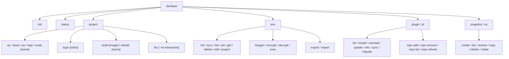

# CLI リファレンス

devbase の全コマンドの構文、オプション、使用例をまとめたリファレンスです。コマンドグループごとにファイルを分けています。

| ファイル | 内容 |
|---------|------|
| [トップレベルコマンド](01-toplevel.md) | `init` / `status` / `bin/rc` |
| [project グループ](02-project.md) | コンテナのライフサイクル管理・一覧（`up` / `down` / `login` / `ps` / `logs` / `scale` / `build` / `rebuild` / `list`）と非推奨の `container` グループ |
| [env グループ](03-env.md) | 環境変数の管理（`init` / `sync` / `list` / `set` / `get` / `delete` / `edit` / `project` / `keygen` / `encrypt` / `decrypt` / `exec` / `export` / `import`） |
| [plugin グループ](04-plugin.md) | プラグインの管理（`list` / `install` / `uninstall` / `update` / `info` / `sync` / `migrate` / `repo *`） |
| [snapshot グループ](05-snapshot.md) | スナップショットの管理（`create` / `list` / `restore` / `copy` / `delete` / `rotate`） |

## コマンド体系

devbase のコマンドは 4 つのグループとトップレベルコマンドで構成されています。



> **`container` グループは非推奨になりました。** 旧 `devbase container <sub>` は
> `devbase project <sub>` のエイリアスとして当面動作しますが、実行時に非推奨警告を
> 表示します（移行期間後のリリースで削除予定）。新しいコマンドは `project` を使用してください。

### グループエイリアス

各グループには短縮形が用意されています。

| グループ名 | エイリアス | 備考 |
|-----------|-----------|------|
| `plugin` | `pl` | |
| `snapshot` | `ss` | |
| `container` | `ct` | **非推奨**（`project` へ移行してください） |

### ショートカットコマンド

頻繁に使用するプロジェクト操作はトップレベルから直接実行できます。これらは `project` グループに自動転送されます。

| ショートカット | 転送先 |
|--------------|--------|
| `devbase up [name]` | `devbase project up [name]` |
| `devbase down [name]` | `devbase project down [name]` |
| `devbase login [index]` | `devbase project login [index]` |
| `devbase build [image]` | `bin/devbase` の `cmd_build`（シェル実装）※ |
| `devbase ps [name]` | `devbase project ps [name]` |
| `devbase scale [name] <num>` | `devbase project scale [name] <num>` |
| `devbase rebuild [name]` | `devbase project rebuild [name]` |
| `devbase list` | `devbase project list` |

> **Note:** `logs` はトップレベルシノニムを持ちません。`devbase project logs` を使用してください。
>
> **※ `build` の転送先について:** `devbase build`（既定 / `--no-cache` / `<image>`）は他の
> ショートカットのように `project` グループ（Python 実装）へ転送されるのではなく、`bin/devbase` の
> シェル実装 `cmd_build` に直接委譲されます。base イメージの段階ビルド等を CWD で行う必要があるため
> です（名前指定はラッパーの `cd` で解決）。ただし `devbase build --expires[=DAYS]` のみ、作成日の
> 判定が必要なため例外的に Python 経路（`project build`）へ委譲されます。挙動上の入出力は同等です。

### ユニークプレフィックスマッチング

コマンド名が一意に特定できる場合、先頭の数文字だけで実行できます。

```bash
# 以下は全て同じコマンド
devbase plugin list
devbase pl list
devbase p l
devbase pl l
```

> **Note:** 一意に特定できない場合は候補が表示されます。
