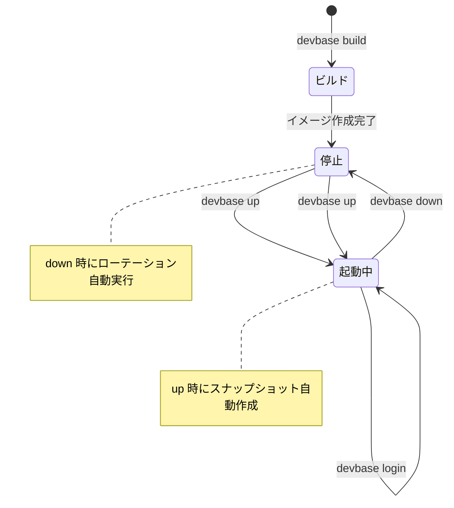
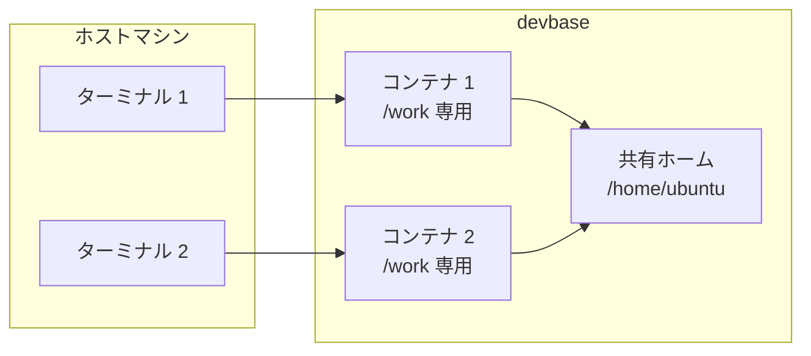
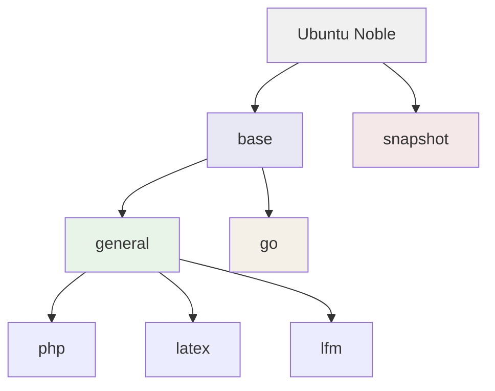

# コンテナ操作ガイド

devbase のコンテナ管理機能について、ライフサイクル、並行開発、ボリューム構造、イメージ階層を解説します。

## コンテナライフサイクル

devbase のコンテナは以下のライフサイクルで管理されます。



### 基本操作の流れ

```bash
# 1. コンテナイメージをビルド（初回のみ）
devbase build

# 2. コンテナを起動（自動スナップショット作成）
devbase up

# 3. コンテナにログイン
devbase login

# 4. コンテナ内で作業
# ...

# 5. コンテナから退出
exit

# 6. コンテナを停止・削除（自動ローテーション）
devbase down
```

### 自動スナップショット

コンテナのライフサイクルに連動して、スナップショットが自動管理されます。

| タイミング | 動作 | 条件 |
|-----------|------|------|
| `devbase up` | フルバックアップ or 差分追加 | 前回のフルバックアップからの経過日数で判定 |
| `devbase down` | 古い世代のローテーション | `DEFAULT_MAX_GENERATIONS` を超えた世代を削除 |

詳細は [スナップショットガイド](snapshot-guide.md) を参照してください。

## 並行開発

devbase は複数のコンテナを同時に起動し、並行開発を行うことができます。

### コンテナ数の設定

プロジェクトの `env` ファイルで `CONTAINER_SCALE` を設定します。デフォルト値は `2` です。

```bash
# env ファイルで設定
CONTAINER_SCALE=2
```

### 動的スケーリング

起動中のコンテナを再起動せずに、コンテナ数を変更できます。

```bash
# コンテナを3台に増やす（既存コンテナは再起動しない）
devbase container scale 3

# コンテナを1台に減らす
devbase container scale 1
```

### 各コンテナへのログイン

コンテナ番号を指定してログインします。

```bash
# 1番目のコンテナにログイン
devbase login 1

# 2番目のコンテナにログイン
devbase login 2

# 3番目のコンテナにログイン
devbase login 3
```

### 並行開発のユースケース



- 各コンテナは独立した `/work` ボリュームを持つ
- `/home/ubuntu` は全コンテナで共有される
- 異なるブランチでの並行作業に便利

## ボリューム構造

devbase のコンテナは 2 種類のボリュームを使用します。

| ボリューム名 | マウント先 | 共有範囲 | 用途 |
|-------------|-----------|---------|------|
| `devbase_home_ubuntu` | `/home/ubuntu` | 全コンテナで共有 | ユーザー設定、SSH 鍵、シェル履歴等 |
| `{project}_work_{index}` | `/work` | 各コンテナ専用 | プロジェクトのソースコード、作業ファイル |

### ボリュームの永続性

- ボリュームは `devbase down` でもコンテナが削除されても保持されます
- コンテナの再起動（`devbase up`）で同じボリュームが再マウントされます
- ボリュームを明示的に削除するには `docker volume rm` を使用します

### ボリュームの確認

```bash
# Docker ボリュームの一覧
docker volume ls | grep devbase

# 特定ボリュームの詳細
docker volume inspect devbase_home_ubuntu
```

> **Warning:** `devbase_home_ubuntu` ボリュームは全プロジェクトで共有されます。ここにプロジェクト固有のファイルを置くと、他のプロジェクトにも影響します。プロジェクト固有のファイルは `/work` に配置してください。

## コンテナイメージ階層

devbase のコンテナイメージは用途に応じた階層構造になっています。



### イメージの詳細

| イメージ | ベース | 主な内容 | 用途 |
|---------|-------|---------|------|
| **base** | Ubuntu Noble | Docker CLI、Python 3 | 最小限の開発環境 |
| **general** | base | AWS CLI、gcloud、Terraform、Node.js 20、AI CLI | 汎用開発環境 |
| **php** | general | PHP 8.3、Composer、MySQL Shell | PHP 開発 |
| **latex** | general | LaTeX | 文書作成 |
| **lfm** | general | Rust、gfortran、MeCab | 数値計算・自然言語処理 |
| **go** | base | Go 開発環境 | Go 開発 |
| **snapshot** | Ubuntu Noble | zstd のみ（約 80MB） | スナップショット専用 |

### AI CLI エイリアス

general イメージ以降のコンテナ内では、以下の AI CLI ツールがエイリアスとして利用可能です。

| エイリアス | ツール | モード | 説明 |
|-----------|-------|--------|------|
| `claude` | Claude Code | skip-permissions | Anthropic の AI コーディングアシスタント |
| `claudb` | Claude Code (AWS Bedrock) | Opus 4.6 / us-west-2 | AWS Bedrock 経由の Claude |
| `gemini` | Gemini CLI | yolo mode | Google の AI アシスタント |
| `codex` | Codex CLI | bypass-approvals | OpenAI の AI コーディングツール |
| `kiro` | Kiro CLI | trust-all-tools | AWS の AI アシスタント |

```bash
# コンテナ内での使用例
claude "このコードをレビューして"
gemini "テストを書いて"
codex "リファクタリングして"
```

## コンテナの状態確認

### プロセス一覧

```bash
# 起動中のコンテナを表示
devbase ps

# 停止中のコンテナも含めて表示
devbase ps -a
```

### ログの確認

```bash
# 最新のログを表示
devbase container logs

# リアルタイムでログを追跡
devbase container logs -f

# 末尾100行のみ追跡
devbase container logs -f --tail 100
```

### 環境の全体像

```bash
# コンテナ、プラグイン、環境変数、スナップショットの状態を一括確認
devbase status
```

## ベストプラクティス

1. **プロジェクト固有のファイルは `/work` に配置する** -- `/home/ubuntu` は全コンテナで共有されるため
2. **`CONTAINER_SCALE` は必要最小限に設定する** -- リソース消費を抑制
3. **作業終了後は `devbase down` を実行する** -- 自動ローテーションでディスク容量を管理
4. **`devbase ps` で状態を確認してからログインする** -- 異常終了したコンテナへのログイン試行を避ける
5. **イメージのビルドは初回と更新時のみ** -- 変更がない場合はキャッシュが利用される
