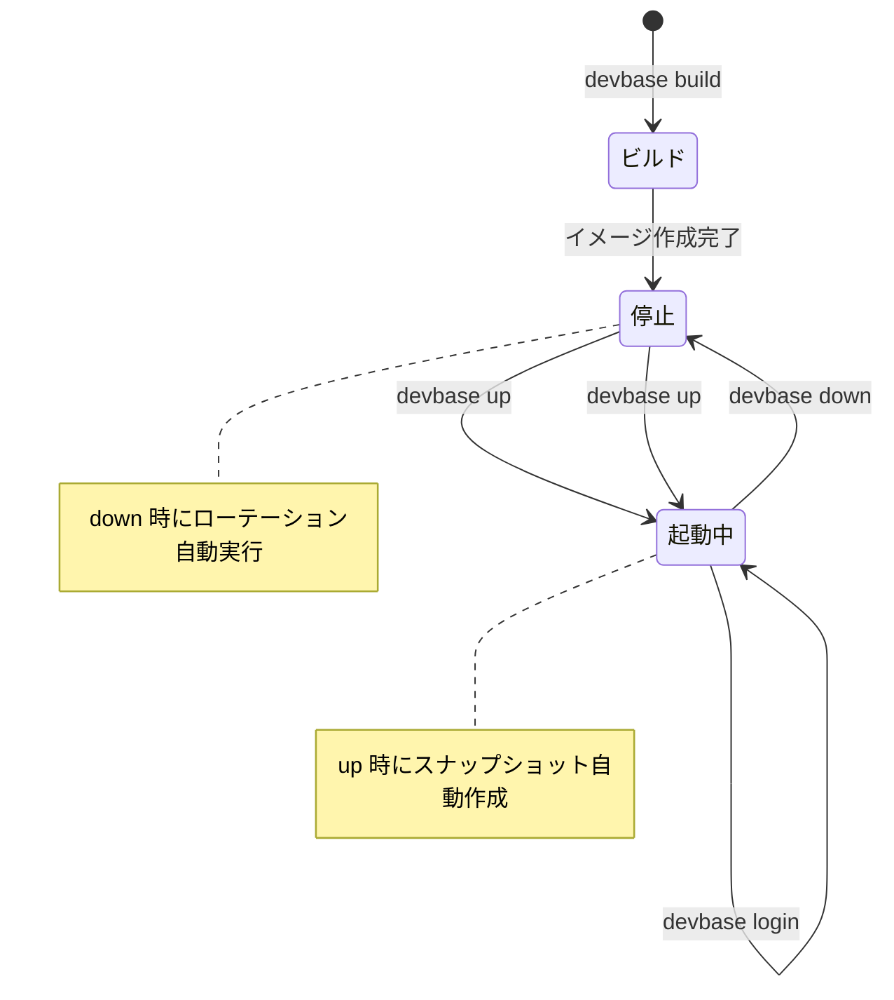
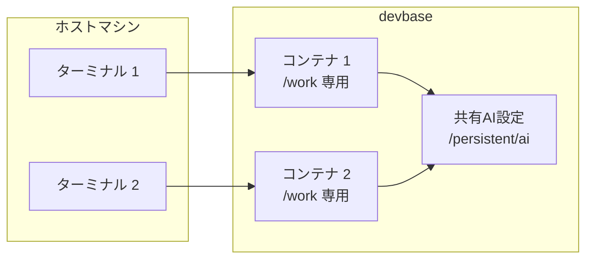
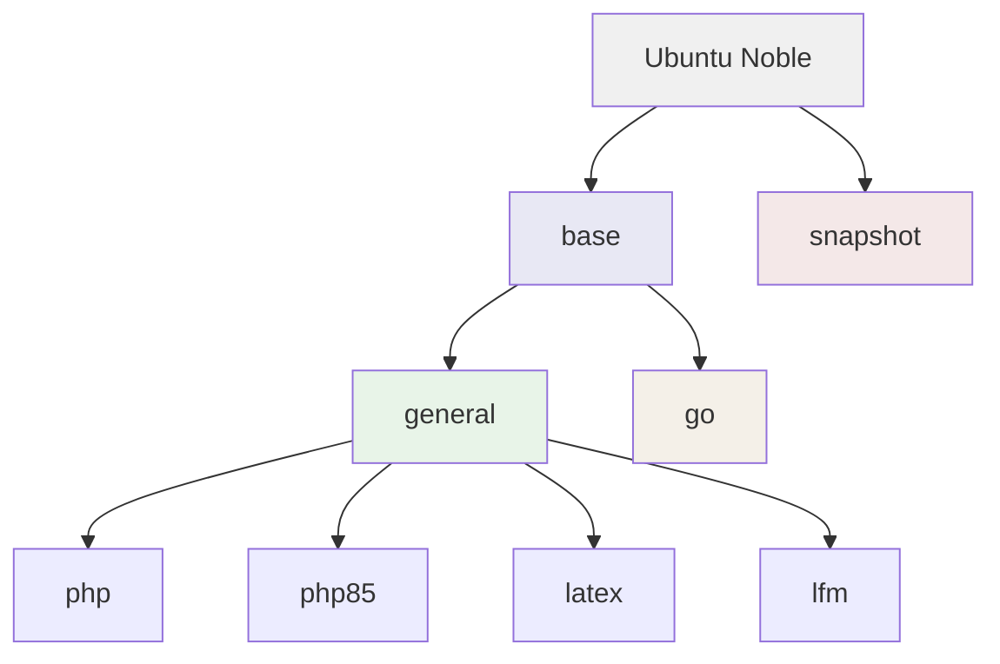

# コンテナ操作ガイド

devbase のコンテナ管理機能について、ライフサイクル、並行開発、ボリューム構造、イメージ階層を解説します。

> **コマンド体系について:** コンテナ操作は `devbase project <sub>` グループ（および
> トップレベルショートカット `devbase up` 等）で行います。旧 `devbase container <sub>` は
> 非推奨となり、`project` へのエイリアスとして警告付きで当面動作します。`project` では
> `up` / `down` / `ps` / `logs` / `scale` に `[name]` を指定することで **任意のディレクトリ
> から** 対象プロジェクトを操作できます。プロジェクト一覧は `devbase project list` を参照
> してください。詳細は [CLI リファレンス](cli-reference.md#project-グループ) を参照。

## コンテナライフサイクル

devbase のコンテナは以下のライフサイクルで管理されます。


```mermaid
stateDiagram-v2
    [*] --> ビルド: devbase build
    ビルド --> 停止: イメージ作成完了
    停止 --> 起動中: devbase up
    起動中 --> 起動中: devbase login
    起動中 --> 停止: devbase down
    停止 --> 起動中: devbase up

    note right of 起動中
        up 時にスナップショット自動作成
    end note
    note right of 停止
        down 時にローテーション自動実行
    end note
```

### 基本操作の流れ

```bash
# 1. コンテナイメージをビルド（初回のみ）
devbase build

# 2. コンテナを起動（自動スナップショット作成）
devbase up

# 3. コンテナにログイン
devbase login

# 4. コンテナ内で作業
# ...

# 5. コンテナから退出
exit

# 6. コンテナを停止・削除（自動ローテーション）
devbase down
```

### 自動スナップショット

コンテナのライフサイクルに連動して、スナップショットが自動管理されます。

| タイミング | 動作 | 条件 |
|-----------|------|------|
| `devbase up` | フルバックアップ or 差分追加 | 前回のフルバックアップからの経過日数で判定 |
| `devbase down` | 古い世代のローテーション | `DEFAULT_MAX_GENERATIONS` を超えた世代を削除 |

詳細は [スナップショットガイド](snapshot-guide.md) を参照してください。

## 並行開発

devbase は複数のコンテナを同時に起動し、並行開発を行うことができます。

### コンテナ数の設定

プロジェクトの `env` ファイルで `CONTAINER_SCALE` を設定します。デフォルト値は `2` です。

```bash
# env ファイルで設定
CONTAINER_SCALE=2
```

### 動的スケーリング

起動中のコンテナを再起動せずに、コンテナ数を変更できます。

```bash
# コンテナを3台に増やす（既存コンテナは再起動しない）
devbase project scale 3

# コンテナを1台に減らす
devbase project scale 1

# 任意のディレクトリから adminer を3台に
devbase project scale adminer 3
```

### 各コンテナへのログイン

コンテナ番号を指定してログインします。

```bash
# 1番目のコンテナにログイン
devbase login 1

# 2番目のコンテナにログイン
devbase login 2

# 3番目のコンテナにログイン
devbase login 3
```

### 並行開発のユースケース


```mermaid
graph LR
    subgraph ホストマシン
        A[ターミナル 1]
        B[ターミナル 2]
    end
    subgraph devbase
        C[コンテナ 1<br/>/work 専用]
        D[コンテナ 2<br/>/work 専用]
        E[共有AI設定<br/>/persistent/ai]
    end
    A --> C
    B --> D
    C --> E
    D --> E
```

- 各コンテナは独立した `/work` ボリュームを持つ
- `/persistent/ai`（AI 設定・共有ファイル）は全コンテナで共有される（`/home/ubuntu` 直下のうち永続化されるのは symlink 対象のみ。下記「AI 設定の永続化」参照）
- 異なるブランチでの並行作業に便利

## ボリューム構造

devbase のコンテナは 2 種類のボリュームを使用します。

| ボリューム名 | マウント先 | 共有範囲 | 用途 |
|-------------|-----------|---------|------|
| `devbase_home_ubuntu` | `/persistent/ai` | 全コンテナで共有 | AI CLI 設定（`.claude` / `.codex` / `.gemini` 等）、SSH 鍵、共有ファイル置き場（`share`）。詳細は「AI 設定の永続化」参照 |
| `{project}_work_{index}` | `/work` | 各コンテナ専用 | プロジェクトのソースコード、作業ファイル |

> **Note:** `devbase_home_ubuntu` は **`/persistent/ai`** にマウントされます（`/home/ubuntu` への直接マウントは廃止）。`/home/ubuntu` 直下はコンテナ層（揮発）で、永続化されるのは entrypoint が `/persistent/ai` 配下へ symlink する設定ファイルのみです。シェル履歴など symlink 対象外のファイルは再生成で失われます。

### ボリュームの永続性

- ボリュームは `devbase down` でもコンテナが削除されても保持されます
- コンテナの再起動（`devbase up`）で同じボリュームが再マウントされます
- ボリュームを明示的に削除するには `docker volume rm` を使用します

### ボリュームの確認

```bash
# Docker ボリュームの一覧
docker volume ls | grep devbase

# 特定ボリュームの詳細
docker volume inspect devbase_home_ubuntu
```

> **Warning:** `devbase_home_ubuntu` ボリューム（`/persistent/ai`、および symlink 経由でアクセスする `~/.claude` / `~/share` 等）は全プロジェクトで共有されます。ここにプロジェクト固有のファイルを置くと、他のプロジェクトにも影響します。プロジェクト固有のファイルは `/work` に配置してください。

## AI 設定の永続化

AI CLI ツールの設定や認証情報は、コンテナを再生成しても保持されるよう
`devbase_home_ubuntu` ボリューム（`/persistent/ai`）に永続化されます。

仕組みは **symlink** です。コンテナ起動時、entrypoint（`containers/base/entrypoint.sh`）が
以下の各エントリについて `/home/ubuntu/<name> -> /persistent/ai/<name>` の symlink を作成します。

| エントリ | 内容 |
|---------|------|
| `.claude.json` / `.claude` | Claude Code の設定・認証 |
| `.codex` | Codex CLI の設定 |
| `.gemini` | Gemini CLI の設定 |
| `.serena` | Serena MCP の設定 |
| `.kiro` | Kiro CLI の設定 |
| `.ssh` | SSH 鍵 |
| `share` | 全コンテナ共有のファイル置き場（任意用途） |

- `/persistent/ai` は全コンテナ共通の `devbase_home_ubuntu` ボリュームなので、**どのコンテナからも同じ実体**を参照します（例: `~/share` は全コンテナで共有）。
- symlink **対象外**のホーム配下ファイル（シェル履歴など）はコンテナ層に置かれ、再生成で失われます。永続化したいものは `/persistent/ai` 配下（= 上記 symlink 先）か `/work` に置いてください。
- `share` 配下に置いた VS Code ワークスペースファイルは `DEVBASE_WORKSPACE` で開けます（[環境変数](environment-variables.md) 参照）。

> **Note:** symlink 対象は entrypoint にビルド時 `COPY` で焼き込まれます。エントリを増減した場合は
> イメージの再ビルドが必要です（`devbase up` 単体では反映されない場合があります。[CLI リファレンス](cli-reference.md) の `devbase project up` の注記参照）。

## コンテナイメージ階層

devbase のコンテナイメージは用途に応じた階層構造になっています。


```mermaid
graph TD
    A[Ubuntu Noble] --> B[base]
    B --> C[general]
    B --> G[go]
    C --> D[php]
    C --> I[php85]
    C --> E[latex]
    C --> F[lfm]
    A --> H[snapshot]

    style A fill:#f0f0f0
    style B fill:#e8e8f4
    style C fill:#e8f4e8
    style G fill:#f4f0e8
    style H fill:#f4e8e8
```

### イメージの詳細

| イメージ | ベース | 主な内容 | 用途 |
|---------|-------|---------|------|
| **base** | Ubuntu Noble | Docker CLI、Python 3 | 最小限の開発環境 |
| **general** | base | AWS CLI、gcloud、Terraform、Node.js 20、AI CLI | 汎用開発環境 |
| **php** | general | PHP 8.3、Composer、MySQL Shell | PHP 8.3 系 開発 |
| **php85** | general | PHP 8.5、Composer、MySQL Shell | PHP 8.5 系 開発 |
| **latex** | general | LaTeX | 文書作成 |
| **lfm** | general | Rust、gfortran、MeCab | 数値計算・自然言語処理 |
| **go** | base | Go 開発環境 | Go 開発 |
| **snapshot** | Ubuntu Noble | zstd のみ（約 80MB） | スナップショット専用 |

### AI CLI エイリアス

general イメージ以降のコンテナ内では、以下の AI CLI ツールがエイリアスとして利用可能です。

| エイリアス | ツール | モード | 説明 |
|-----------|-------|--------|------|
| `claude` | Claude Code | skip-permissions | Anthropic の AI コーディングアシスタント |
| `claudb` | Claude Code (AWS Bedrock) | Opus 4.6 / us-west-2 | AWS Bedrock 経由の Claude |
| `gemini` | Gemini CLI | yolo mode | Google の AI アシスタント |
| `codex` | Codex CLI | bypass-approvals | OpenAI の AI コーディングツール |
| `kiro` | Kiro CLI | trust-all-tools | AWS の AI アシスタント |

```bash
# コンテナ内での使用例
claude "このコードをレビューして"
gemini "テストを書いて"
codex "リファクタリングして"
```

## コンテナの状態確認

### プロセス一覧

```bash
# 起動中のコンテナを表示
devbase ps

# 停止中のコンテナも含めて表示
devbase ps -a
```

### ログの確認

```bash
# 最新のログを表示
devbase project logs

# リアルタイムでログを追跡
devbase project logs -f

# 末尾100行のみ追跡
devbase project logs -f --tail 100
```

### プロジェクト一覧

```bash
# 階層メニュー TUI を起動（TTY ではこれがデフォルト）
devbase list

# 選択せず NAME / PLUGIN / STATUS の一覧表示のみ
devbase list --no-interactive   # --plain / -P も同義
```

> TTY（端末）では `devbase list` はデフォルトで階層メニュー TUI になり、
> プロジェクトを選んで起動・操作（up / down / login / ps / logs / scale /
> build / rebuild）できるほか、画面最下部の常設メニュー（環境変数 / プラグイン /
> スナップショット / ステータス）へ ←→ キーで移動して各管理操作を実行できます。
> パイプ・リダイレクト・CI などの非 TTY 環境では自動的に一覧表示のみに
> フォールバックします。画面構成とキー操作の詳細は
> [CLI リファレンス](cli-reference.md#devbase-project-list) を参照してください。

`devbase project ps` が「対象プロジェクト 1 つのコンテナ状態」を表示するのに対し、
`devbase list` は「全プロジェクトの横断一覧」を表示します。

### 環境の全体像

```bash
# コンテナ、プラグイン、環境変数、スナップショットの状態を一括確認
devbase status
```

## ベストプラクティス

1. **プロジェクト固有のファイルは `/work` に配置する** -- `/persistent/ai`（`~/.claude` 等の symlink 先・`~/share`）は全コンテナで共有されるため
2. **`CONTAINER_SCALE` は必要最小限に設定する** -- リソース消費を抑制
3. **作業終了後は `devbase down` を実行する** -- 自動ローテーションでディスク容量を管理
4. **`devbase ps` で状態を確認してからログインする** -- 異常終了したコンテナへのログイン試行を避ける
5. **イメージのビルドは初回と更新時のみ** -- 変更がない場合はキャッシュが利用される
