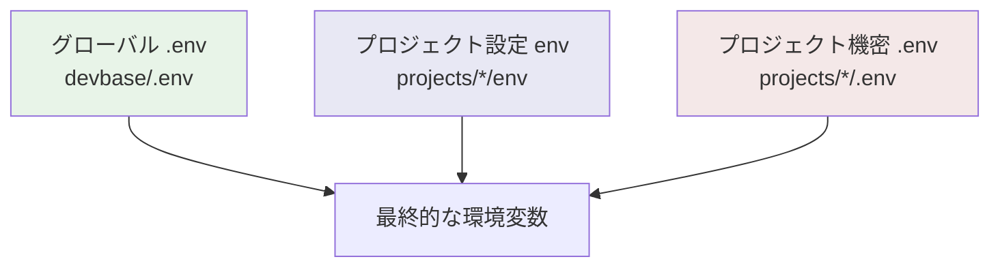
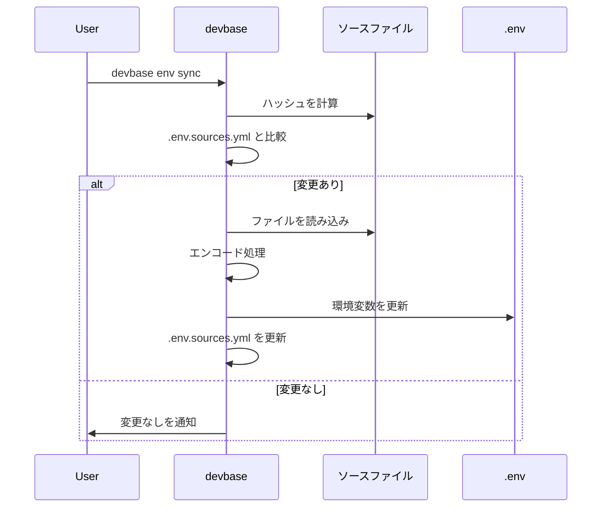

# 環境変数ガイド

devbase の環境変数管理の仕組みと操作方法を解説します。

## 3レベル構造

devbase の環境変数は 3 つのレベルで管理されます。後に読み込まれるレベルが同名のキーを上書きします（後勝ち）。



### 読み込み順序

| 優先度 | レベル | ファイル | 用途 | Git 管理 |
|-------|-------|---------|------|---------|
| 1（低） | グローバル | `devbase/.env` | 共通 API キー・認証情報 | gitignore |
| 2 | プロジェクト設定 | `projects/*/env` | リポジトリ名・コンテナ数等 | 管理対象 |
| 3（高） | プロジェクト機密 | `projects/*/.env` | プロジェクト固有の API キー | gitignore |

> **Note:** 同じキーが複数のレベルに存在する場合、優先度が高いレベルの値が使用されます。例えば、グローバルの `AWS_PROFILE` をプロジェクトの `.env` で上書きすることで、プロジェクトごとに異なる AWS プロファイルを使用できます。

### ファイルの役割

**グローバル `.env`（`devbase/.env`）**

全プロジェクトで共有する認証情報や API キーを格納します。`devbase env init` で対話式に設定するか、`devbase env set` で直接設定します。

**プロジェクト設定 `env`（`projects/*/env`）**

プロジェクト固有の設定値を格納します。Git 管理対象のため、機密情報は含めないでください。

```bash
# env ファイルの例
REPO_NAME=my-project
CONTAINER_SCALE=2
```

**プロジェクト機密 `.env`（`projects/*/.env`）**

プロジェクト固有の機密情報を格納します。gitignore 対象のため、チームメンバーは個別に設定する必要があります。

## コレクター

devbase はホストマシンの認証情報を自動収集し、コンテナ内で利用可能にする「コレクター」機能を備えています。

### コレクター一覧

#### aws -- AWS 認証

| キー | 説明 |
|------|------|
| `AWS_CONFIG_BASE64` | `~/.aws/config` と `~/.aws/credentials` を tar + Base64 エンコード |
| `AWS_PROFILE` | 使用する AWS プロファイル |
| `AWS_ACCESS_KEY_ID` | アクセスキー ID |
| `AWS_SECRET_ACCESS_KEY` | シークレットアクセスキー |
| `AWS_DEFAULT_REGION` | デフォルトリージョン |
| `AWS_SSO_URL` | SSO の開始 URL |

ソースファイル: `~/.aws/config`, `~/.aws/credentials`
ソースタイプ: `tar_base64`

#### google -- GCP 認証

| キー | 説明 |
|------|------|
| `GCP_CREDENTIALS_BASE64__*` | `~/gcp-credentials/` 配下の各プロファイル（Base64 エンコード） |
| `GCP_ACTIVE_PROFILE` | アクティブなプロファイル名 |
| `GOOGLE_CLOUD_PROJECT` | GCP プロジェクト ID |
| `GOOGLE_CLOUD_LOCATION` | GCP リージョン |
| `GOOGLE_APPLICATION_CREDENTIALS` | サービスアカウントキーのパス |
| `BIGQUERY_PROJECT` | BigQuery プロジェクト |
| `BIGQUERY_DATASETS` | BigQuery データセット |
| `BIGQUERY_LOCATION` | BigQuery ロケーション |
| `BIGQUERY_KEY_FILE` | BigQuery キーファイルパス |

ソースファイル: `~/gcp-credentials/`
ソースタイプ: `named_profiles`

#### git -- Git 認証

| キー | 説明 |
|------|------|
| `GIT_USER_NAME` | Git ユーザー名 |
| `GIT_USER_EMAIL` | Git メールアドレス |
| `GIT_CREDENTIAL_HELPER` | 認証ヘルパー設定 |
| `GIT_CREDENTIALS_BASE64` | `~/.git-credentials` の Base64 エンコード |
| `GITHUB_PERSONAL_ACCESS_TOKEN` | GitHub PAT |
| `GH_TOKEN` | GitHub CLI 用トークン |

ソースファイル: `~/.git-credentials`
ソースタイプ: `file_base64`

#### api_keys -- API キー

| キー | 説明 |
|------|------|
| `ANTHROPIC_API_KEY` | Anthropic API キー |
| `OPENAI_API_KEY` | OpenAI API キー |
| `GEMINI_API_KEY` | Google Gemini API キー |
| `CONTEXT7_API_KEY` | Context7 API キー |
| `PYPI_API_KEY` | PyPI API キー |
| `NPM_TOKEN` | npm トークン |

#### devin -- Devin

| キー | 説明 |
|------|------|
| `DEVIN_API_KEY` | Devin API キー |
| `DEVIN_API_ORG_WIDE` | 組織全体の API 設定 |
| `DEVIN_ORG_ID` | 組織 ID |
| `DEVIN_SERVICE_USER` | サービスユーザー名 |
| `DEVIN_SERVICE_ADMIN` | サービス管理者 |

#### slack -- Slack

| キー | 説明 |
|------|------|
| `SLACK_BOT_TOKEN` | Slack Bot トークン |
| `SLACK_TEAM_ID` | チーム ID |
| `SLACK_CHANNEL_ID` | チャンネル ID |
| `SLACK_USER_MENTION` | ユーザーメンション |

## ソースファイル変更検出

devbase はソースファイル（`~/.aws/config` 等）のハッシュを `.env.sources.yml` で管理しています。



### 動作の流れ

1. `devbase env sync` を実行
2. 各コレクターのソースファイルのハッシュを計算
3. `.env.sources.yml` に保存された前回のハッシュと比較
4. 変更が検出されたファイルのみ再エンコードして `.env` を更新

> **Note:** `devbase env init` を実行すると、全コレクターが初回として処理されます。

## 環境変数の操作

### 初期設定

```bash
# 対話式で全コレクターを設定
devbase env init

# 既存の設定をリセットして再設定
devbase env init --reset
```

### 同期

```bash
# ソースファイルの変更を検出して更新
devbase env sync
```

AWS や GCP の認証情報をホストマシンで更新した後に実行してください。

### 一覧表示

```bash
# 全変数のキーを表示
devbase env list

# グローバル変数のみ、値付きで表示
devbase env list -g -r

# プロジェクト変数をキー名順で表示
devbase env list -p -k
```

### 個別操作

```bash
# 値の取得
devbase env get AWS_PROFILE

# 値の設定（グローバル）
devbase env set ANTHROPIC_API_KEY=sk-xxx

# 値の設定（プロジェクトレベル）
devbase env set GCP_ACTIVE_PROFILE=my-project -p

# 値の削除
devbase env delete OLD_API_KEY
```

### エディタで編集

```bash
# デフォルトエディタで .env を開く
devbase env edit
```

`$EDITOR` 環境変数に設定されたエディタが使用されます。

### プロジェクト固有変数

```bash
# プロジェクト固有の変数を対話式で設定
devbase env project
```

## コンテナ内での環境変数

コンテナ起動時（`devbase up`）に、3レベルの `.env` / `env` ファイルが Docker Compose の `env_file` ディレクティブ経由でコンテナに注入されます。

```bash
# コンテナ内で環境変数を確認
env | grep AWS_

# Base64 エンコードされた認証情報はコンテナ起動時に自動デコードされる
ls ~/.aws/
```

> **Warning:** 環境変数を変更した後は `devbase up` でコンテナを再起動してください。起動中のコンテナには反映されません。

## ベストプラクティス

1. **機密情報は `.env` に格納する** -- Git 管理対象の `env` ファイルには機密情報を含めない
2. **プロジェクト固有の設定は `-p` フラグを使う** -- グローバル設定を汚染しない
3. **`env sync` を定期的に実行する** -- ホストマシンの認証情報更新後は必ず同期
4. **`.env.sources.yml` を Git 管理しない** -- 環境固有のハッシュ情報のため
