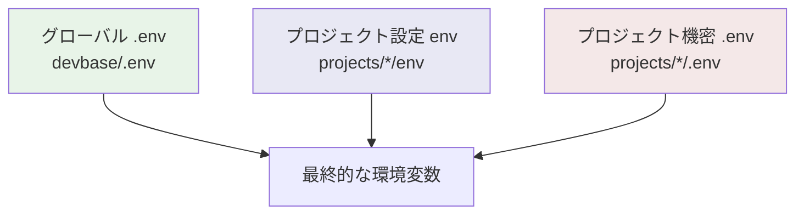
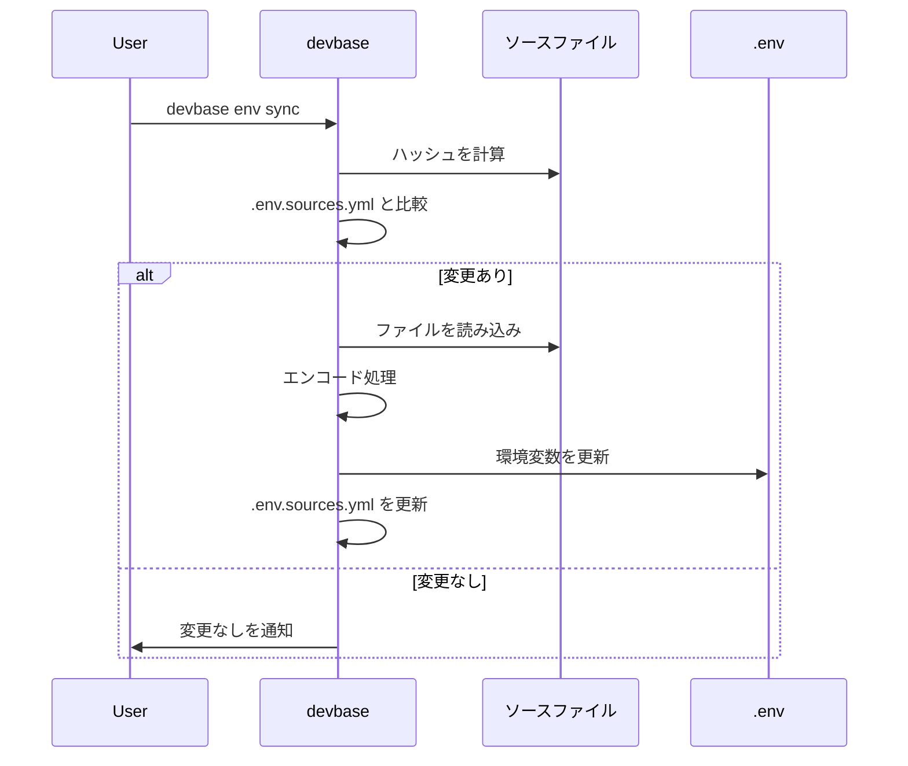

# 環境変数ガイド

devbase の環境変数管理の仕組みと操作方法を解説します。

## 3レベル構造

devbase の環境変数は 3 つのレベルで管理されます。後に読み込まれるレベルが同名のキーを上書きします（後勝ち）。


```mermaid
graph TD
    A["グローバル .env<br/>devbase/.env"] --> D[最終的な環境変数]
    B["プロジェクト設定 env<br/>projects/*/env"] --> D
    C["プロジェクト機密 .env<br/>projects/*/.env"] --> D
    style A fill:#e8f4e8
    style B fill:#e8e8f4
    style C fill:#f4e8e8
```

### 読み込み順序

| 優先度 | レベル | ファイル | 用途 | Git 管理 |
|-------|-------|---------|------|---------|
| 1（低） | グローバル | `devbase/.env` | 共通 API キー・認証情報 | gitignore |
| 2 | プロジェクト設定 | `projects/*/env` | リポジトリ名・コンテナ数等 | 管理対象 |
| 3（高） | プロジェクト機密 | `projects/*/.env` | プロジェクト固有の API キー | gitignore |

> **Note:** 同じキーが複数のレベルに存在する場合、優先度が高いレベルの値が使用されます。例えば、グローバルの `AWS_PROFILE` をプロジェクトの `.env` で上書きすることで、プロジェクトごとに異なる AWS プロファイルを使用できます。

### ファイルの役割

**グローバル `.env`（`devbase/.env`）**

全プロジェクトで共有する認証情報や API キーを格納します。`devbase env init` で対話式に設定するか、`devbase env set` で直接設定します。

**プロジェクト設定 `env`（`projects/*/env`）**

プロジェクト固有の設定値を格納します。Git 管理対象のため、機密情報は含めないでください。

```bash
# env ファイルの例
REPO_NAME=my-project
CONTAINER_SCALE=2
```

**プロジェクト機密 `.env`（`projects/*/.env`）**

プロジェクト固有の機密情報を格納します。gitignore 対象のため、チームメンバーは個別に設定する必要があります。

## コレクター

devbase はホストマシンの認証情報を自動収集し、コンテナ内で利用可能にする「コレクター」機能を備えています。

### コレクター一覧

#### aws -- AWS 認証

| キー | 説明 |
|------|------|
| `AWS_CONFIG_BASE64` | `~/.aws/config` と `~/.aws/credentials` を tar + Base64 エンコード |
| `AWS_PROFILE` | 使用する AWS プロファイル |
| `AWS_ACCESS_KEY_ID` | アクセスキー ID |
| `AWS_SECRET_ACCESS_KEY` | シークレットアクセスキー |
| `AWS_DEFAULT_REGION` | デフォルトリージョン |
| `AWS_SSO_URL` | SSO の開始 URL |

ソースファイル: `~/.aws/config`, `~/.aws/credentials`
ソースタイプ: `tar_base64`

#### google -- GCP 認証

| キー | 説明 |
|------|------|
| `GCP_CREDENTIALS_BASE64__*` | `~/gcp-credentials/` 配下の各プロファイル（Base64 エンコード） |
| `GCP_ACTIVE_PROFILE` | アクティブなプロファイル名 |
| `GOOGLE_CLOUD_PROJECT` | GCP プロジェクト ID |
| `GOOGLE_CLOUD_LOCATION` | GCP リージョン |
| `GOOGLE_APPLICATION_CREDENTIALS` | サービスアカウントキーのパス |
| `BIGQUERY_PROJECT` | BigQuery プロジェクト |
| `BIGQUERY_DATASETS` | BigQuery データセット |
| `BIGQUERY_LOCATION` | BigQuery ロケーション |
| `BIGQUERY_KEY_FILE` | BigQuery キーファイルパス |

ソースファイル: `~/gcp-credentials/`
ソースタイプ: `named_profiles`

#### git -- Git 認証

| キー | 説明 |
|------|------|
| `GIT_USER_NAME` | Git ユーザー名 |
| `GIT_USER_EMAIL` | Git メールアドレス |
| `GIT_CREDENTIAL_HELPER` | 認証ヘルパー設定 |
| `GIT_CREDENTIALS_BASE64` | `~/.git-credentials` の Base64 エンコード |
| `GITHUB_PERSONAL_ACCESS_TOKEN` | GitHub PAT |
| `GH_TOKEN` | GitHub CLI 用トークン |

ソースファイル: `~/.git-credentials`
ソースタイプ: `file_base64`

#### api_keys -- API キー

| キー | 説明 |
|------|------|
| `ANTHROPIC_API_KEY` | Anthropic API キー |
| `OPENAI_API_KEY` | OpenAI API キー |
| `GEMINI_API_KEY` | Google Gemini API キー |
| `CONTEXT7_API_KEY` | Context7 API キー |
| `PYPI_API_KEY` | PyPI API キー |
| `NPM_TOKEN` | npm トークン |

#### devin -- Devin

| キー | 説明 |
|------|------|
| `DEVIN_API_KEY` | Devin API キー |
| `DEVIN_API_ORG_WIDE` | 組織全体の API 設定 |
| `DEVIN_ORG_ID` | 組織 ID |
| `DEVIN_SERVICE_USER` | サービスユーザー名 |
| `DEVIN_SERVICE_ADMIN` | サービス管理者 |

#### slack -- Slack

| キー | 説明 |
|------|------|
| `SLACK_BOT_TOKEN` | Slack Bot トークン |
| `SLACK_TEAM_ID` | チーム ID |
| `SLACK_CHANNEL_ID` | チャンネル ID |
| `SLACK_USER_MENTION` | ユーザーメンション |

#### host -- ホスト接続情報 (SSH)

コンテナからホストへ SSH してホスト側 GUI アプリ（例: Chrome をリモートデバッグモードで起動）を起動するワークフロー向けの設定です。`devbase env init` はホスト上で実行されるため、ホストのログインユーザー名を自動取得して既定値として提示します。

| キー | 説明 |
|------|------|
| `HOST_SSH_USER` | コンテナ→ホスト SSH 時のホストログインユーザー名（既定: `getpass.getuser()` で自動取得） |
| `HOST_SSH_HOST` | SSH 先ホスト名（既定: `host.docker.internal`、WSL2/Windows では上書き可） |

ユーザー名のみで秘密情報ではありません。SSH 鍵やリモートログインの有効化はホスト側でユーザーが別途設定する前提です。`devbase env sync` 実行時には、未設定のキーのみ既定値で補完されます（既存値は上書きしません）。

## `devbase up` 後のエディタ自動オープン

`devbase up` 完了後、dev コンテナへ接続した VS Code を自動で開けます（VS Code の「Attach to Running Container」を CLI から起動）。既定では `/work/$GIT_REPO` フォルダを開きます（`--folder-uri`）。`DEVBASE_WORKSPACE` を指定するとフォルダの代わりに `*.code-workspace` ワークスペースファイルを開きます（`--file-uri`）。

これらは `devbase env init` の収集対象外で、プロジェクトの `env` か `$DEVBASE_ROOT/.env` に手書きする devbase 動作設定です。

| キー | 説明 |
|------|------|
| `DEVBASE_OPEN_EDITOR` | 真（`1`/`true`/`yes`/`on`）で `up` 後にエディタを開く（既定: OFF） |
| `DEVBASE_EDITOR` | 起動コマンド（既定: `code`）。`cursor` / `code-insiders` 等も可 |
| `DEVBASE_WORKSPACE` | 開く `*.code-workspace` ファイルの**コンテナ内絶対パス**（例 `/home/ubuntu/share/work/uttarov2-doc.workspace`）。指定時はフォルダではなくワークスペースを開く。未設定なら従来どおり `/work/$GIT_REPO` フォルダ。`~/share`（= 全コンテナ共有ボリューム `/persistent/ai/share` への symlink）配下に置けば全コンテナで共用可 |
| `DEVBASE_OPEN_INDEX` | scale 時に開く dev インスタンス番号（既定: `1`） |
| `DEVBASE_EDITOR_SSH_HOST` | Remote-SSH 跨ホスト構成での ssh-remote ホスト名（例 `mac2`）。**通常は `~/.vscode-server` から自動検出**され不要。検出が外れる場合のみ明示。下記「跨ホスト」参照 |
| `DEVBASE_EDITOR_DOCKER_CONTEXT` | 跨ホスト時に ssh 先で使う docker context（既定: ホストの `docker context show`） |

都度の上書きは CLI フラグで行います: `devbase up --open` / `--no-open` / `--open-index N`（env より優先）。

### 実行コンテキスト別の挙動

| コンテキスト | 挙動 |
|------|------|
| ローカル端末（Mac/Linux） | ローカル VS Code が開く |
| WSL 端末 | Windows 側 VS Code が開く（`code` ラッパ経由） |
| VS Code の Remote-SSH 統合ターミナル（同一ホストの Docker） | **クライアント側（手元）の VS Code** が開く（`code` シムが委譲） |
| VS Code の Remote-SSH 統合ターミナル（**跨ホスト**: ssh 先の Docker にコンテナ） | `DEVBASE_EDITOR_SSH_HOST` 設定時にネスト URI で開く（下記「跨ホスト」参照） |
| 手元から素の SSH（VS Code 外）で接続中 | クライアントへ自動で開く公式手段が無いため、手元で実行する `code --folder-uri ...` コマンドを提示 |
| tmux / screen 経由のターミナル | `VSCODE_IPC_HOOK_CLI` が古くなっていると VS Code 統合ターミナルとみなさず、SSH 経路の「コマンド提示」へ degrade（下記「tmux / screen 経由で使う場合」参照） |
| CI / 非対話（非 TTY） / `code` 不在 | 理由を表示してスキップ（`up` 自体は成功） |

#### 跨ホスト（Windows VS Code → Remote-SSH → Mac のコンテナ）

手元（例 Windows）の VS Code から Remote-SSH で別ホスト（例 Mac）へ入り、その統合ターミナルで `devbase up` を実行する構成では、コンテナは **ssh 先（Mac）の Docker** 上にあります。このとき `code` の開く要求はクライアント（Windows）へ委譲されるため、フラットな attach URI のままだと **クライアント側の Docker** を見に行きコンテナが見つかりません（「コンテナーにアタッチできません。すでに存在しません」）。

これを解決するには、ネスト URI `vscode-remote://attached-container+<hex>@ssh-remote+<host>/work/...` を使い、docker ルックアップを ssh 先（コンテナのある Mac）で行わせます。`<host>` は **手元 `~/.ssh/config` の `Host` 別名**（例 `mac2`）で、これは「今の VS Code 接続の authority ラベル」と完全一致する必要があります（ネスト attach は新規 ssh 接続を張らず既存接続を再利用するため。IP や `user@IP` は "Parent authority found without ExecServer" で不可）。

このラベルは VS Code が ssh 先の端末 env に渡さない（`SSH_CONNECTION` は IP のみ）ものの、**devbase は ssh 先（Mac）の VS Code 系サーバーディレクトリ（`~/.vscode-server` / `~/.cursor-server` / `~/.vscode-server-insiders` 等）の File History から自動検出**します（`DEVBASE_EDITOR` で cursor 等を使う場合も横断）。よって**通常は設定不要**です。docker context は `docker context show` から自動取得します。

自動検出が外れる場合（複数 ssh-remote ホストを使い分けている等）のみ明示します:

```sh
# $DEVBASE_ROOT/env など（全プロジェクト共通にしたい場合）
DEVBASE_EDITOR_SSH_HOST=mac2
# 必要なら docker context も明示
# DEVBASE_EDITOR_DOCKER_CONTEXT=desktop-linux
```

解決順は **`DEVBASE_EDITOR_SSH_HOST` 明示 → `~/.vscode-server` 自動検出 → フラット URI**。

> 同一ホスト構成（手元 Mac/Linux で直接、または ssh 先の Docker にコンテナが無い場合）では ssh-remote ホストは付かず、従来どおりフラット URI で開きます。

#### tmux / screen 経由で使う場合

VS Code は統合ターミナルごとに `$TMPDIR/vscode-ipc-<uuid>.sock` を作り、`VSCODE_IPC_HOOK_CLI` でその場所を伝えます。`code` はこのソケット経由でクライアント側の VS Code に依頼するため、**ソケットが死んでいると `code` は何もできません**。

tmux / screen はサーバープロセスが**セッション作成時の環境変数を保持し続ける**ため、ここが噛み合いません。VS Code のウィンドウをリロードしたり開き直したりするとソケットは作り直されますが、既存の tmux セッションに再アタッチした端末は**古いパスを引き継いだまま**になります。

devbase はソケットの実在を確認してから VS Code 統合ターミナルと判定します（変数の有無だけでは判定しません）。古い場合は警告を出したうえで「手元で実行するコマンドの提示」へ degrade するので、**黙って何も起きないという状態にはなりません**。提示されたコマンドを手元で実行すれば開けます。

自動で開く状態に戻すには、tmux 側に環境変数を追随させます。`~/.tmux.conf` に以下を追記してください。

```tmux
set -ga update-environment " VSCODE_IPC_HOOK_CLI VSCODE_GIT_IPC_HANDLE VSCODE_GIT_ASKPASS_NODE VSCODE_GIT_ASKPASS_MAIN VSCODE_GIT_ASKPASS_EXTRA_ARGS VSCODE_NONCE GIT_ASKPASS BROWSER TERM_PROGRAM"
```

これで **attach のたびに**接続してきたクライアントの値でセッション環境が更新されます。ただし更新されるのはセッション環境であり、**すでに起動しているペインのシェル**には波及しません。既存ペインにも追随させたい場合は、シェルの rc（`~/.bash_profile` 等）にプロンプトフックを置きます。

```bash
if [ -n "${TMUX:-}" ]; then
  _vscode_sync_env() {
    # ソケットが生きている間は何もしない（サブプロセスを起動しない）
    [ -n "${VSCODE_IPC_HOOK_CLI:-}" ] && [ -S "${VSCODE_IPC_HOOK_CLI}" ] && return 0
    local line
    while IFS= read -r line; do
      case "$line" in
        VSCODE_IPC_HOOK_CLI=*|VSCODE_GIT_IPC_HANDLE=*|GIT_ASKPASS=*|BROWSER=*)
          export "${line%%=*}=${line#*=}" ;;
      esac
    done < <(tmux show-environment 2>/dev/null)
    return 0
  }
  case ";${PROMPT_COMMAND:-};" in
    *";_vscode_sync_env;"*) ;;
    *) PROMPT_COMMAND="_vscode_sync_env;${PROMPT_COMMAND:-}" ;;
  esac
fi
```

反映するには `tmux kill-server` でサーバーを作り直してください（`~/.tmux.conf` はサーバー起動時にのみ読まれ、既存ペインのシェルも修正前の rc で起動しているため）。

##### 同じプロジェクトのセッションが増え続ける場合

VS Code のウィンドウが異常終了すると、VS Code サーバー側に pty が取り残され、tmux クライアントだけがセッションへ繋がったまま残ります。統合ターミナルの起動スクリプトは「クライアントが繋がっているセッション = 使用中」と判定するため、`adminer-1` に戻れず `adminer-2`, `adminer-3` … と新しいセッションが増えていきます。

このときは dev コンテナに同梱の `tmux-first` を実行してください。放置されたクライアントを切断したうえで、一番若い番号のセッションへ現在の端末を切り替えます。

接続しているというだけでは居座りとは判定しません。切断対象は最終操作から `TMUX_FIRST_IDLE` 秒（既定 300）以上経過したクライアントだけで、いま使われている別ウィンドウの端末は残します（`-f` で全件切断）。

`TMUX_FIRST_IDLE` に指定できるのは 0 以上の整数だけです。負数・数値以外・空文字を指定すると、すべてのクライアントが放置扱いになってしまうため `tmux-first` はエラー終了します（既定値 300 が使われるのは未設定のときだけです）。

実行元の端末は必ず切断対象から除外します。ただしペイン内のシェルには「どのクライアントから起動されたか」の情報がないため、tmux が持つ「最終操作が最も新しいクライアント」を実行元とみなしています。プロンプトへ打ち込んで起動した場合はそのキー入力で最終操作が更新されるため必ず実行元自身になりますが、hook や `tmux send-keys` 経由でキー入力を伴わずに起動された場合は実行元を特定できません。特定できなかった場合は `-f` を付けていても切断を行わず、セッションの切り替えだけを行います。

```bash
tmux-first        # 現在のセッション名からベース名を推定 (adminer-2 -> adminer)
tmux-first -n     # 切り替えず、対象と切断予定のクライアントだけ表示する
tmux-first -f     # 操作中のクライアントも含めて切断する
TMUX_FIRST_IDLE=60 tmux-first   # 放置とみなす秒数を変える
tmux1             # tmux-first の短縮コマンド (/usr/local/bin の symlink)
```

誰がいつから繋いでいるかは次で確認できます。

```bash
tmux list-clients -F '#{client_name} -> #{client_session}  最終操作 #{t:client_activity}'
```

切り替わったあと、そのセッションのプロンプトで `tmux-clean` を実行すると置き去りのセッションを削除できます。安全側の既定として、keeper（tmux 内なら現在のセッション、tmux 外なら最小番号）、アタッチ中のセッション、シェル以外を実行中のセッション、`&` で起動したバックグラウンドジョブが残っているセッションは残します。

```bash
tmux-clean        # 不要なセッションを削除
tmux-clean -n     # 削除せず、削除対象と除外理由を表示する
tmux-clean -f     # アタッチ中・実行中のセッションも削除する
tmuxc             # tmux-clean の短縮コマンド (/usr/local/bin の symlink)
```

## ソースファイル変更検出

devbase はソースファイル（`~/.aws/config` 等）のハッシュを `.env.sources.yml` で管理しています。


```mermaid
sequenceDiagram
    participant User
    participant devbase
    participant SourceFile as ソースファイル
    participant EnvFile as .env

    User->>devbase: devbase env sync
    devbase->>SourceFile: ハッシュを計算
    devbase->>devbase: .env.sources.yml と比較
    alt 変更あり
        devbase->>SourceFile: ファイルを読み込み
        devbase->>devbase: エンコード処理
        devbase->>EnvFile: 環境変数を更新
        devbase->>devbase: .env.sources.yml を更新
    else 変更なし
        devbase->>User: 変更なしを通知
    end
```

### 動作の流れ

1. `devbase env sync` を実行
2. 各コレクターのソースファイルのハッシュを計算
3. `.env.sources.yml` に保存された前回のハッシュと比較
4. 変更が検出されたファイルのみ再エンコードして `.env` を更新

> **Note:** `devbase env init` を実行すると、全コレクターが初回として処理されます。

## 環境変数の操作

### 初期設定

```bash
# 対話式で全コレクターを設定
devbase env init

# 既存の設定をリセットして再設定
devbase env init --reset
```

### 同期

```bash
# ソースファイルの変更を検出して更新
devbase env sync
```

AWS や GCP の認証情報をホストマシンで更新した後に実行してください。

### 一覧表示

```bash
# 全変数のキーを表示
devbase env list

# グローバル変数のみ、値付きで表示
devbase env list -g -r

# プロジェクト変数をキー名順で表示
devbase env list -p -k
```

### 個別操作

```bash
# 値の取得
devbase env get AWS_PROFILE

# 値の設定（グローバル）
devbase env set ANTHROPIC_API_KEY=sk-xxx

# 値の設定（プロジェクトレベル）
devbase env set GCP_ACTIVE_PROFILE=my-project -p

# 値の削除
devbase env delete OLD_API_KEY
```

### エディタで編集

```bash
# デフォルトエディタで .env を開く
devbase env edit
```

`$EDITOR` 環境変数に設定されたエディタが使用されます。

### プロジェクト固有変数

```bash
# プロジェクト固有の変数を対話式で設定
devbase env project
```

## コンテナ内での環境変数

コンテナ起動時（`devbase up`）に、3レベルの `.env` / `env` ファイルが Docker Compose の `env_file` ディレクティブ経由でコンテナに注入されます。

```bash
# コンテナ内で環境変数を確認
env | grep AWS_

# Base64 エンコードされた認証情報はコンテナ起動時に自動デコードされる
ls ~/.aws/
```

> **Warning:** 環境変数を変更した後は `devbase up` でコンテナを再起動してください。起動中のコンテナには反映されません。

## 別マシンへの移行 / バックアップ

複数プロジェクトの `.env` 群を 1 つのバンドルにまとめ、暗号化したまま転送・復元するには `devbase env export` / `devbase env import` を使います。詳細は [環境変数の export/import ガイド](env-export-import.md) を参照してください。

```bash
# 既存マシンで export (~/.ssh/id_ed25519.pub があれば鍵指定省略可)
devbase env export ./bundle.dbenv

# 新マシンで import (既定は keep-existing マージ)
devbase env import ./bundle.dbenv
```

## ベストプラクティス

1. **機密情報は `.env` に格納する** -- Git 管理対象の `env` ファイルには機密情報を含めない
2. **プロジェクト固有の設定は `-p` フラグを使う** -- グローバル設定を汚染しない
3. **`env sync` を定期的に実行する** -- ホストマシンの認証情報更新後は必ず同期
4. **`.env.sources.yml` を Git 管理しない** -- 環境固有のハッシュ情報のため
5. **別マシンへの移行は `devbase env export` を使う** -- `scp -r` で個別コピーする代わりに、暗号化バンドル 1 ファイルで安全に移動できる ([詳細](env-export-import.md))
