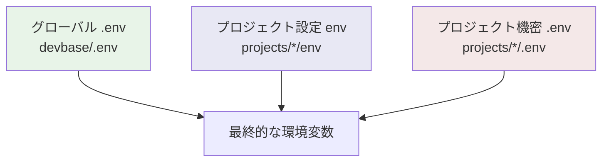
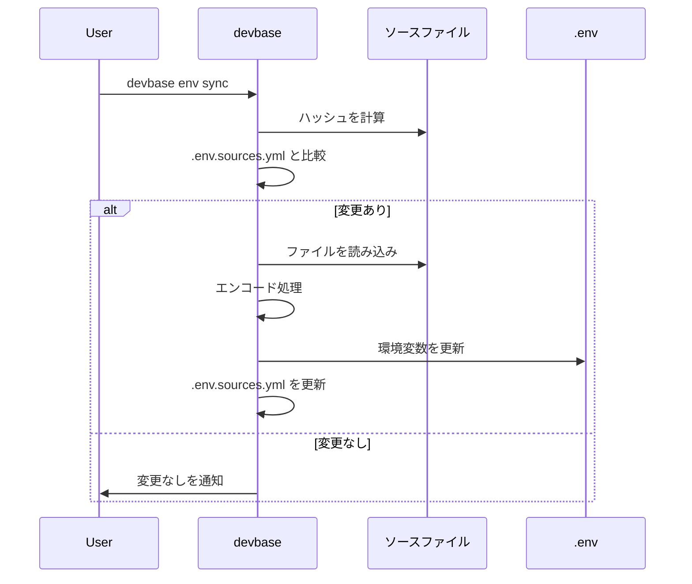

# 環境変数ガイド

devbase の環境変数管理の仕組みと操作方法を解説します。

## 3レベル構造

devbase の環境変数は 3 つのレベルで管理されます。後に読み込まれるレベルが同名のキーを上書きします（後勝ち）。


```mermaid
graph TD
    A["グローバル .env<br/>devbase/.env"] --> D[最終的な環境変数]
    B["プロジェクト設定 env<br/>projects/*/env"] --> D
    C["プロジェクト機密 .env<br/>projects/*/.env"] --> D
    style A fill:#e8f4e8
    style B fill:#e8e8f4
    style C fill:#f4e8e8
```

### 読み込み順序

| 優先度 | レベル | ファイル | 用途 | Git 管理 |
|-------|-------|---------|------|---------|
| 1（低） | グローバル | `devbase/.env` | 共通 API キー・認証情報 | gitignore |
| 2 | プロジェクト環境変数 | `projects/*/env` | コンテナへ渡すプロジェクト固有の環境変数（`ENABLE_SSH` 等） | 管理対象 |
| 3（高） | プロジェクト機密 | `projects/*/.env` | プロジェクト固有の API キー | gitignore |

> **Note:** 同じキーが複数のレベルに存在する場合、優先度が高いレベルの値が使用されます。例えば、グローバルの `AWS_PROFILE` をプロジェクトの `.env` で上書きすることで、プロジェクトごとに異なる AWS プロファイルを使用できます。

### ファイルの役割

**グローバル `.env`（`devbase/.env`）**

全プロジェクトで共有する認証情報や API キーを格納します。`devbase env init` で対話式に設定するか、`devbase env set` で直接設定します。

**プロジェクト設定 `env`（`projects/*/env`）**

コンテナへ渡すプロジェクト固有の環境変数を格納します。Git 管理対象のため、機密情報は含めないでください。

```bash
# env ファイルの例
ENABLE_SSH=true
```

devbase 自身の設定（どのリポジトリを clone するか、コンテナ数、エディタの自動オープン）は
環境変数ではなく [`projects/*/project.yml`](project-yml.md) に書きます。`env` に
`GIT_USER` / `GIT_REPO` / `WORK_DIR` / `CONTAINER_SCALE` を書いても効果はありません。

`compose.yml` が `env_file: - env` で参照するため、中身が無くてもファイル自体は残してください。

**プロジェクト機密 `.env`（`projects/*/.env`）**

プロジェクト固有の機密情報を格納します。gitignore 対象のため、チームメンバーは個別に設定する必要があります。

## コレクター

devbase はホストマシンの認証情報を自動収集し、コンテナ内で利用可能にする「コレクター」機能を備えています。

### コレクター一覧

#### aws -- AWS 認証

| キー | 説明 |
|------|------|
| `AWS_CONFIG_BASE64` | `~/.aws/config` と `~/.aws/credentials` を tar + Base64 エンコード |
| `AWS_PROFILE` | 使用する AWS プロファイル |
| `AWS_ACCESS_KEY_ID` | アクセスキー ID |
| `AWS_SECRET_ACCESS_KEY` | シークレットアクセスキー |
| `AWS_DEFAULT_REGION` | デフォルトリージョン |
| `AWS_SSO_URL` | SSO の開始 URL |

ソースファイル: `~/.aws/config`, `~/.aws/credentials`
ソースタイプ: `tar_base64`

#### google -- GCP 認証

| キー | 説明 |
|------|------|
| `GCP_CREDENTIALS_BASE64__*` | `~/gcp-credentials/` 配下の各プロファイル（Base64 エンコード） |
| `GCP_ACTIVE_PROFILE` | アクティブなプロファイル名 |
| `GOOGLE_CLOUD_PROJECT` | GCP プロジェクト ID |
| `GOOGLE_CLOUD_LOCATION` | GCP リージョン |
| `GOOGLE_APPLICATION_CREDENTIALS` | サービスアカウントキーのパス（鍵モードのみ。下記参照） |
| `BIGQUERY_PROJECT` | BigQuery プロジェクト |
| `BIGQUERY_DATASETS` | BigQuery データセット |
| `BIGQUERY_LOCATION` | BigQuery ロケーション |
| `BIGQUERY_KEY_FILE` | BigQuery キーファイルパス（鍵モードのみ。下記参照） |

ソースファイル: `~/gcp-credentials/`
ソースタイプ: `named_profiles`

##### `GCP_AUTH_MODE` -- 認証モードの切り替え

Google はサービスアカウント鍵を非推奨とし、ローカル開発には
`gcloud auth application-default login`（ユーザー認証 = ADC）を推奨しています。
devbase は gcloud の設定ディレクトリをアカウントグループごとに永続化するため、
ADC を既定の経路にできます。鍵が要る場面のために切り替えを残しています。

`GCP_AUTH_MODE` はプロジェクトの `env` かグローバル `env` に手書きします。

| 値 | 挙動 |
|---|---|
| `adc` | 鍵を書かない。`GOOGLE_APPLICATION_CREDENTIALS` と `BIGQUERY_KEY_FILE` を**コンテナへ渡さない**。認証は `$CLOUDSDK_CONFIG/application_default_credentials.json`（= `gcloud auth application-default login` の結果）に委ねる |
| `key` | `GCP_CREDENTIALS_BASE64__<profile>` を復号して書き、上記 2 変数を渡す（従来どおり） |
| 未設定 | 鍵の env があれば `key`、無ければ `adc`（既存プロジェクトは従来どおり動きます） |

鍵の有無は **`GCP_ACTIVE_PROFILE`（未設定なら `default`）のプロファイル** 1 本だけで
判定します（無ければ後方互換の `GOOGLE_APPLICATION_CREDENTIALS_BASE64`）。別プロファイル
の鍵があっても、アクティブなプロファイルの鍵が無ければ `adc` です。`GCP_AUTH_MODE=key` を
明示していても同じで、鍵が無ければ `adc` として構成します（警告を出します）。ホスト側と
コンテナ側で判定が食い違うと、実体の無いパスだけがコンテナへ残るためです。

`adc` で 2 変数を**渡さない**のが要点です。値だけ残して実体が無いと、ADC は
ユーザー認証へフォールバックせず `DefaultCredentialsError` で落ちます。元の
`compose.yml` の `environment:` にパスが直書きされている場合も、`adc` では生成 compose
から取り除きます。

取り除く対象は **dev サービス（`dev-1` 〜 `dev-N`）だけ**です。`GCP_AUTH_MODE` は dev の
認証方式の宣言なので、独自に鍵をマウントしている `batch` のような非 dev サービスが
`environment:` や `env_file` で受け取っている 2 変数はそのまま残します。

##### 鍵の実体を渡す範囲

`adc` が止めるのは **鍵をファイルへ書き出すこと**だけで、鍵を運ぶ base64 変数の配布までは
止まりません。名前が生成 compose の `environment:` に載っている限り、Compose が値を解決して
コンテナへ渡すため、`env` で中身が読めてしまいます。

そこで devbase は、コンテナ内で**使われない**鍵の変数も dev の列挙から外します。entrypoint が
読むのはアクティブプロファイルの鍵 1 本だけだからです。

| 変数 | `adc` | `key` |
|---|---|---|
| `GCP_CREDENTIALS_BASE64__<アクティブプロファイル>` | **渡さない** | 渡す |
| `GCP_CREDENTIALS_BASE64__<それ以外>` | 渡さない | 渡さない |
| `GOOGLE_APPLICATION_CREDENTIALS_BASE64` | 渡さない | アクティブプロファイルの鍵が無いときだけ渡す |

`adc` で**アクティブプロファイルの鍵も渡さない**のが要点です。entrypoint の
`devbase_setup_gcp_credentials` は `adc` だと鍵を読む前に return するため、鍵の実体は
1 本も要りません。アクティブ分だけ残すと「鍵を使わない」と宣言したコンテナの `env` から
秘密鍵が読めてしまいます。

除外は `compose.yml` の dev サービスへ**直書き**された変数にも効きます。列挙を絞るだけでは
直書きが生成物に残り、対策を迂回するためです。非 dev サービスの明示設定には触りません。

3 行目は後方互換キーの扱いです。entrypoint は `key` モードでアクティブプロファイルの鍵が
無いときだけこのキーへフォールバックするので、**そのときは供給源になるため外せません**。
逆に言うと、プロファイル別キーへ移行済みのプロジェクトでは渡らなくなります。

これはアカウントグループ（`DEVBASE_ACCOUNT_GROUP`）をまたいだ鍵の共有を防ぐためのものです。
グループを分けてもこの除外が無いと、別グループ用のサービスアカウント鍵がコンテナへ届きます。

> **Note:** アクティブプロファイルの鍵が無く、`GCP_AUTH_MODE` も宣言していない構成では、
> 後方互換キーが `key` モードを引き起こして渡り続けます。別グループの鍵を持ち込みたくない
> なら、プロジェクトの `env` に `GCP_AUTH_MODE=adc` を明示してください。

```bash
# ADC を使う（推奨）
echo 'GCP_AUTH_MODE=adc' >> projects/<name>/env
devbase project up <name>
```

切り替えには `devbase up` が必要です（コンテナへ渡す環境変数が変わるため）。
手順の全体は [Google 認証ガイド](google-auth.md) を参照してください。

##### gcloud / gws の設定ディレクトリ

| 変数 | 値 | 意味 |
|---|---|---|
| `CLOUDSDK_CONFIG` | `/persistent/group/gcloud` | gcloud の設定ディレクトリ。`credentials.db` / `access_tokens.db` / `application_default_credentials.json` がここに入る |
| `GOOGLE_WORKSPACE_CLI_CONFIG_DIR` | `/persistent/group/gws` | gws（Google Workspace CLI）の設定ディレクトリ |

いずれも devbase が生成 compose で渡すため、`env` に書く必要はありません。

> **Warning:** `CLOUDSDK_CONFIG` を向け直したあとの `~/.config/gcloud` は
> **gcloud の設定ディレクトリではありません**。鍵モードで書き出される
> サービスアカウント鍵の置き場でしかなく、コンテナ層（揮発）に残ります。
> gcloud の実際の設定を見たいときは `$CLOUDSDK_CONFIG` を参照してください。

#### git -- Git 認証

| キー | 説明 |
|------|------|
| `GIT_USER_NAME` | Git ユーザー名 |
| `GIT_USER_EMAIL` | Git メールアドレス |
| `GIT_CREDENTIAL_HELPER` | 認証ヘルパー設定 |
| `GIT_CREDENTIALS_BASE64` | `~/.git-credentials` の Base64 エンコード |
| `GITHUB_PERSONAL_ACCESS_TOKEN` | GitHub PAT |
| `GH_TOKEN` | GitHub CLI 用トークン |

ソースファイル: `~/.git-credentials`
ソースタイプ: `file_base64`

#### api_keys -- API キー

| キー | 説明 |
|------|------|
| `ANTHROPIC_API_KEY` | Anthropic API キー |
| `OPENAI_API_KEY` | OpenAI API キー |
| `GEMINI_API_KEY` | Google Gemini API キー |
| `CONTEXT7_API_KEY` | Context7 API キー |
| `PYPI_API_KEY` | PyPI API キー |
| `NPM_TOKEN` | npm トークン |

#### devin -- Devin

| キー | 説明 |
|------|------|
| `DEVIN_API_KEY` | Devin API キー |
| `DEVIN_API_ORG_WIDE` | 組織全体の API 設定 |
| `DEVIN_ORG_ID` | 組織 ID |
| `DEVIN_SERVICE_USER` | サービスユーザー名 |
| `DEVIN_SERVICE_ADMIN` | サービス管理者 |

#### slack -- Slack

| キー | 説明 |
|------|------|
| `SLACK_BOT_TOKEN` | Slack Bot トークン |
| `SLACK_TEAM_ID` | チーム ID |
| `SLACK_CHANNEL_ID` | チャンネル ID |
| `SLACK_USER_MENTION` | ユーザーメンション |

#### host -- ホスト接続情報 (SSH)

コンテナからホストへ SSH してホスト側 GUI アプリ（例: Chrome をリモートデバッグモードで起動）を起動するワークフロー向けの設定です。`devbase env init` はホスト上で実行されるため、ホストのログインユーザー名を自動取得して既定値として提示します。

| キー | 説明 |
|------|------|
| `HOST_SSH_USER` | コンテナ→ホスト SSH 時のホストログインユーザー名（既定: `getpass.getuser()` で自動取得） |
| `HOST_SSH_HOST` | SSH 先ホスト名（既定: `host.docker.internal`、WSL2/Windows では上書き可） |

ユーザー名のみで秘密情報ではありません。SSH 鍵やリモートログインの有効化はホスト側でユーザーが別途設定する前提です。`devbase env sync` 実行時には、未設定のキーのみ既定値で補完されます（既存値は上書きしません）。

## アカウントグループ (`DEVBASE_ACCOUNT_GROUP`)

**使用する Google / AWS アカウントの単位**を宣言します。`devbase env init` の収集対象では
なく、`$DEVBASE_ROOT/env` かプロジェクトの `env` に手書きする devbase 動作設定です。

| キー | 説明 |
|------|------|
| `DEVBASE_ACCOUNT_GROUP` | アカウントグループ名。未設定なら `default`。グループごとに `devbase_home_<group>` ボリュームが作られ、コンテナへ `/persistent/group` としてマウントされる |

```bash
# projects/<name>/env
DEVBASE_ACCOUNT_GROUP=kkg
```

同じグループのコンテナは Claude Code / gcloud / gws の認証と会話ログを共有し、
違うグループのコンテナは互いの認証に到達できません。`~/.claude/plugins` のような
共通資産は別ボリューム (`/persistent/ai`) に残るため、グループを増やしても重複しません。

グループ名には次の 3 つが使えません（`devbase up` の前にエラーになります）。

| 使えない名前 | 理由 |
|---|---|
| `^[a-zA-Z0-9][a-zA-Z0-9._-]*$` に合わないもの | Docker のボリューム名にできない |
| `ubuntu` | 共通ボリューム `devbase_home_ubuntu` と同名になる |
| 数字だけの名前（`1` / `042`）| インスタンス番号のボリューム `devbase_home_<index>` と同名になる |

解決結果は `devbase status` の `[環境]` セクションに出ます。ボリューム構造の全体は
[コンテナ運用ガイド](container-operations.md)、Google 認証の手順は
[Google 認証ガイド](google-auth.md) を参照してください。

## `devbase up` 後のエディタ自動オープン

`devbase up` 完了後、dev コンテナへ接続した VS Code を自動で開けます（VS Code の「Attach to Running Container」を CLI から起動）。

開く対象は [`project.yml`](project-yml.md) から決まります。

- リポジトリが 1 件: primary リポジトリのフォルダ（`--folder-uri`）
- リポジトリが 2 件以上: 全リポジトリを含む multi-root ワークスペース `/work/<プロジェクト名>.code-workspace`（`--file-uri`）

自動オープンの有無は `project.yml` の `open_editor` が最優先で、未指定なら以下の env に従います。このうち `DEVBASE_OPEN_EDITOR` だけは `devbase env init` の editor コレクターが対話収集し（対話の既定は `1` = 有効）、`$DEVBASE_ROOT/.env` に書き込まれます。残りは収集対象外で、`$DEVBASE_ROOT/.env` かプロジェクトの `env` に手書きする devbase 動作設定です。

| キー | 説明 |
|------|------|
| `DEVBASE_OPEN_EDITOR` | 真（`1`/`true`/`yes`/`on`）で `up` 後にエディタを開く。`devbase env init` の対話既定は `1`（有効）なので、init 済みの環境では通常 ON。キー自体が未設定のときのみ OFF に倒れる。`project.yml` の `open_editor` が指定されていればそちらが優先 |
| `DEVBASE_EDITOR` | 起動コマンド（既定: `code`）。`cursor` / `code-insiders` 等も可 |
| `DEVBASE_WORKSPACE` | 開く `*.code-workspace` ファイルの**コンテナ内絶対パス**を明示指定する（例 `/home/ubuntu/share/work/uttarov2-doc.workspace`）。**効くのはリポジトリ 1 件の構成だけ**です。2 件以上の構成では `devbase up` が自動生成した `/work/<プロジェクト名>.code-workspace` を直接開くため、この env を設定しても上書きできません。`~/share`（= 全コンテナ共有ボリューム `/persistent/ai/share` への symlink）配下に置けば全コンテナで共用可 |
| `DEVBASE_OPEN_INDEX` | scale 時に開く dev インスタンス番号（既定: `1`） |
| `DEVBASE_EDITOR_SSH_HOST` | Remote-SSH 跨ホスト構成での ssh-remote ホスト名（例 `mac2`）。**通常は `~/.vscode-server` から自動検出**され不要。検出が外れる場合のみ明示。下記「跨ホスト」参照 |
| `DEVBASE_EDITOR_DOCKER_CONTEXT` | 跨ホスト時に ssh 先で使う docker context（既定: ホストの `docker context show`） |
| `DEVBASE_WINDOW_TITLE` | attach 先 VS Code の `window.title` テンプレート。`{container}` が実コンテナ名（例 `nyle-dx-dev-1`）に置換される。既定は `{container}${separator}${dirty}${activeEditorShort}`。`0` / `false` / `off` / 空文字で無効化。下記「ウィンドウタイトル」参照 |

都度の上書きは CLI フラグで行います: `devbase up --open` / `--no-open` / `--open-index N`（env より優先）。

### ウィンドウタイトル（どの窓がどのプロジェクトか）

VS Code の既定タイトルは編集中ファイル名が先頭に来るため、複数プロジェクトの窓を並べるとどれがどれか判別できません。devbase は `up` のたびに各 dev コンテナへ **コンテナ名始まりのタイトル**を設定します。

```
nyle-dx-dev-1 - main.py
```

書き込み先は**コンテナ内**の Remote settings `~/.vscode-server/data/Machine/settings.json` の `window.title` です（`window.title` は WINDOW スコープなのでリモート設定で有効）。クライアント側の attached container config ではなくコンテナ内へ書くのは、

- `imageConfigs/<image>.json` は**イメージ単位**で、`devbase-php:latest` のような共有イメージではインスタンスを区別できない
- `nameConfigs/<container>.json` はコンテナ名単位だが、存在すると `imageConfigs` が読まれなくなり既存の `workspaceFolder` / `extensions` が失われる
- クライアント側のパスは OS 依存で、跨ホスト構成では devbase の走るホストに無い

ため。エディタ自動オープン（`DEVBASE_OPEN_EDITOR`）の有無に関わらず設定されるので、手動で「コンテナーにアタッチ」した窓にも効きます。

既存の設定は保持し、値が同じなら書き込みません（無用な設定ファイル監視の発火を避けるため）。設定ファイルが JSON として読めない場合は**上書きせず諦めます**。

タイトルを変えたい / 止めたい場合は `DEVBASE_WINDOW_TITLE` を使います:

```sh
# コンテナ名だけにする
DEVBASE_WINDOW_TITLE={container}
# ブランチ名なども足す（VS Code のタイトル変数がそのまま使える）
DEVBASE_WINDOW_TITLE={container}${separator}${activeEditorShort}${separator}${rootName}
# 無効化（VS Code 既定のタイトルに戻す）
DEVBASE_WINDOW_TITLE=0
```

> 無効化しても、既にコンテナへ書き込んだ `window.title` は消えません。戻すにはコンテナ内 `~/.vscode-server/data/Machine/settings.json` から `window.title` を削除してください。

### 実行コンテキスト別の挙動

| コンテキスト | 挙動 |
|------|------|
| ローカル端末（Mac/Linux） | ローカル VS Code が開く |
| WSL 端末 | Windows 側 VS Code が開く（`code` ラッパ経由） |
| VS Code の Remote-SSH 統合ターミナル（同一ホストの Docker） | **クライアント側（手元）の VS Code** が開く（`code` シムが委譲） |
| VS Code の Remote-SSH 統合ターミナル（**跨ホスト**: ssh 先の Docker にコンテナ） | `DEVBASE_EDITOR_SSH_HOST` 設定時にネスト URI で開く（下記「跨ホスト」参照） |
| 手元から素の SSH（VS Code 外）で接続中 | クライアントへ自動で開く公式手段が無いため、手元で実行する `code --folder-uri ...` コマンドを提示 |
| tmux 経由のターミナル | `VSCODE_IPC_HOOK_CLI` が古くなっていても、tmux のセッション環境から生きた値を拾い直して開く。拾えなければ「コマンド提示」へ degrade（下記「tmux / screen 経由で使う場合」参照） |
| CI / 非対話（非 TTY） / `code` 不在 | 理由を表示してスキップ（`up` 自体は成功） |

#### 跨ホスト（Windows VS Code → Remote-SSH → Mac のコンテナ）

手元（例 Windows）の VS Code から Remote-SSH で別ホスト（例 Mac）へ入り、その統合ターミナルで `devbase up` を実行する構成では、コンテナは **ssh 先（Mac）の Docker** 上にあります。このとき `code` の開く要求はクライアント（Windows）へ委譲されるため、フラットな attach URI のままだと **クライアント側の Docker** を見に行きコンテナが見つかりません（「コンテナーにアタッチできません。すでに存在しません」）。

これを解決するには、ネスト URI `vscode-remote://attached-container+<hex>@ssh-remote+<host>/work/...` を使い、docker ルックアップを ssh 先（コンテナのある Mac）で行わせます。`<host>` は **手元 `~/.ssh/config` の `Host` 別名**（例 `mac2`）で、これは「今の VS Code 接続の authority ラベル」と完全一致する必要があります（ネスト attach は新規 ssh 接続を張らず既存接続を再利用するため。IP や `user@IP` は "Parent authority found without ExecServer" で不可）。

このラベルは VS Code が ssh 先の端末 env に渡さない（`SSH_CONNECTION` は IP のみ）ものの、**devbase は ssh 先（Mac）の VS Code 系サーバーディレクトリ（`~/.vscode-server` / `~/.cursor-server` / `~/.vscode-server-insiders` 等）の File History から自動検出**します（`DEVBASE_EDITOR` で cursor 等を使う場合も横断）。よって**通常は設定不要**です。docker context は `docker context show` から自動取得します。

自動検出が外れる場合（複数 ssh-remote ホストを使い分けている等）のみ明示します:

```sh
# $DEVBASE_ROOT/env など（全プロジェクト共通にしたい場合）
DEVBASE_EDITOR_SSH_HOST=mac2
# 必要なら docker context も明示
# DEVBASE_EDITOR_DOCKER_CONTEXT=desktop-linux
```

解決順は **`DEVBASE_EDITOR_SSH_HOST` 明示 → `~/.vscode-server` 自動検出 → フラット URI**。

> 同一ホスト構成（手元 Mac/Linux で直接、または ssh 先の Docker にコンテナが無い場合）では ssh-remote ホストは付かず、従来どおりフラット URI で開きます。

#### tmux / screen 経由で使う場合

VS Code は統合ターミナルごとに `$TMPDIR/vscode-ipc-<uuid>.sock` を作り、`VSCODE_IPC_HOOK_CLI` でその場所を伝えます。`code` はこのソケット経由でクライアント側の VS Code に依頼するため、**ソケットが死んでいると `code` は何もできません**。

tmux / screen はサーバープロセスが**セッション作成時の環境変数を保持し続ける**ため、ここが噛み合いません。VS Code のウィンドウをリロードしたり開き直したりするとソケットは作り直されますが、既存の tmux セッションに再アタッチした端末は**古いパスを引き継いだまま**になります。

devbase は**実際にソケットへ接続できるかを確認**してから VS Code 統合ターミナルと判定します（変数の有無でも、ファイルの実在でも判定しません）。

死んでいた場合、**tmux 内なら `tmux show-environment` を見に行きます**。`update-environment`（後述）を設定していれば、tmux のセッション環境は attach のたびに更新されるので、**ペインのシェルが古くても tmux 側には生きた値が入っています**。拾えた場合はその値を使い、起動する `code` にも渡します（変数を差し替えないと `code` 自身が古いソケットへ繋ぎに行って失敗するため）。

拾えなかった場合は警告を出したうえで「手元で実行するコマンドの提示」へ degrade するので、**黙って何も起きないという状態にはなりません**。提示されたコマンドを手元で実行すれば開けます。

ソケットの死に方は 2 通りあります。

| 状態 | 起きる場面 | ファイルの実在 |
|---|---|---|
| ファイルごと消えている | VS Code のウィンドウを正常に閉じた（VS Code が削除する） | 無し |
| ファイルは残っているが listen していない | VS Code のクラッシュ・強制終了・OS 再起動で後始末されなかった | **有り** |

後者は `$TMPDIR` に孤児ソケットとして溜まり、接続しようとすると `ECONNREFUSED` になります。`ls` でも `test -S` でも生きているものと見分けが付かないため、**生死の判定には実際の接続が要ります**。

自動で開く状態に戻すには、tmux 側に環境変数を追随させます。`~/.tmux.conf` に以下を追記してください。

```tmux
set -ga update-environment " VSCODE_IPC_HOOK_CLI VSCODE_GIT_IPC_HANDLE VSCODE_GIT_ASKPASS_NODE VSCODE_GIT_ASKPASS_MAIN VSCODE_GIT_ASKPASS_EXTRA_ARGS VSCODE_NONCE GIT_ASKPASS BROWSER TERM_PROGRAM"
```

これで **attach のたびに**接続してきたクライアントの値でセッション環境が更新されます。**`devbase up` にはこの設定だけで十分**です（devbase がセッション環境を直接読むため）。

ただし更新されるのはセッション環境であり、**すでに起動しているペインのシェル**には波及しません。`code` を手で叩く、git の askpass を使うなど **devbase 以外**でも追随させたい場合は、シェルの rc（`~/.bash_profile` 等）にプロンプトフックを置きます。なお **rc を書き換えても、すでに動いているシェルには反映されません**（起動時に一度読むだけのため）。そのペインで直ちに効かせたいときは `source ~/.bash_profile` するか、開き直してください。

```bash
if [ -n "${TMUX:-}" ]; then
  _vscode_sync_env() {
    # ソケットが生きている間は拾い直さない。生存確認は 2 段で行う。
    # -S はファイルの種別しか見ないため、listen していない孤児ソケットも
    # 通過してしまう（上表の 2 つめ）。実際に接続できるかまで確認する。
    # -S を前段に置くことで、ファイルが無い一般ケースでは nc を起動しない。
    # macOS の nc は -z を付けると Unix ソケットで誤判定するので付けないこと。
    [ -n "${VSCODE_IPC_HOOK_CLI:-}" ] && [ -S "${VSCODE_IPC_HOOK_CLI}" ] \
      && nc -U -w 1 "${VSCODE_IPC_HOOK_CLI}" </dev/null >/dev/null 2>&1 && return 0
    local line
    while IFS= read -r line; do
      case "$line" in
        VSCODE_IPC_HOOK_CLI=*|VSCODE_GIT_IPC_HANDLE=*|GIT_ASKPASS=*|BROWSER=*)
          export "${line%%=*}=${line#*=}" ;;
      esac
    done < <(tmux show-environment 2>/dev/null)
    return 0
  }
  case ";${PROMPT_COMMAND:-};" in
    *";_vscode_sync_env;"*) ;;
    *) PROMPT_COMMAND="_vscode_sync_env;${PROMPT_COMMAND:-}" ;;
  esac
fi
```

反映するには `tmux kill-server` でサーバーを作り直してください（`~/.tmux.conf` はサーバー起動時にのみ読まれ、既存ペインのシェルも修正前の rc で起動しているため）。

##### 同じプロジェクトのセッションが増え続ける場合

VS Code のウィンドウが異常終了すると、VS Code サーバー側に pty が取り残され、tmux クライアントだけがセッションへ繋がったまま残ります。統合ターミナルの起動スクリプトは「クライアントが繋がっているセッション = 使用中」と判定するため、`adminer-1` に戻れず `adminer-2`, `adminer-3` … と新しいセッションが増えていきます。

このときは dev コンテナに同梱の `tmux-first` を実行してください。放置されたクライアントを切断したうえで、一番若い番号のセッションへ現在の端末を切り替えます。

接続しているというだけでは居座りとは判定しません。切断対象は最終操作から `TMUX_FIRST_IDLE` 秒（既定 300）以上経過したクライアントだけで、いま使われている別ウィンドウの端末は残します（`-f` で全件切断）。

`TMUX_FIRST_IDLE` に指定できるのは 0 以上の整数だけです。負数・数値以外・空文字を指定すると、すべてのクライアントが放置扱いになってしまうため `tmux-first` はエラー終了します（既定値 300 が使われるのは未設定のときだけです）。

実行元の端末は必ず切断対象から除外します。ただしペイン内のシェルには「どのクライアントから起動されたか」の情報がないため、tmux が持つ「最終操作が最も新しいクライアント」を実行元とみなしています。プロンプトへ打ち込んで起動した場合はそのキー入力で最終操作が更新されるため必ず実行元自身になりますが、hook や `tmux send-keys` 経由でキー入力を伴わずに起動された場合は実行元を特定できません。特定できなかった場合は `-f` を付けていても切断を行わず、セッションの切り替えも行いません（実行元が分からないまま切り替えると、直近に操作された別の利用者の端末を切り替えてしまうためです）。このときは手動で切り替えるための `tmux switch-client` コマンドを表示します。

```bash
tmux-first        # 現在のセッション名からベース名を推定 (adminer-2 -> adminer)
tmux-first -n     # 切り替えず、対象と切断予定のクライアントだけ表示する
tmux-first -f     # 操作中のクライアントも含めて切断する
TMUX_FIRST_IDLE=60 tmux-first   # 放置とみなす秒数を変える
tmux1             # tmux-first の短縮コマンド (/usr/local/bin の symlink)
```

誰がいつから繋いでいるかは次で確認できます。

```bash
tmux list-clients -F '#{client_name} -> #{client_session}  最終操作 #{t:client_activity}'
```

切り替わったあと、そのセッションのプロンプトで `tmux-clean` を実行すると置き去りのセッションを削除できます。安全側の既定として、keeper（tmux 内なら現在のセッション、tmux 外なら最小番号）、アタッチ中のセッション、シェル以外を実行中のセッション、`&` で起動したバックグラウンドジョブが残っているセッションは残します。加えて、アタッチ数や pane の一覧を tmux から取得できなかったセッションも、実行中かどうか判断できないため残します。

```bash
tmux-clean        # 不要なセッションを削除
tmux-clean -n     # 削除せず、削除対象と除外理由を表示する
tmux-clean -f     # アタッチ中・実行中のセッションも削除する
tmuxc             # tmux-clean の短縮コマンド (/usr/local/bin の symlink)
```

## ソースファイル変更検出

devbase はソースファイル（`~/.aws/config` 等）のハッシュを `.env.sources.yml` で管理しています。


```mermaid
sequenceDiagram
    participant User
    participant devbase
    participant SourceFile as ソースファイル
    participant EnvFile as .env

    User->>devbase: devbase env sync
    devbase->>SourceFile: ハッシュを計算
    devbase->>devbase: .env.sources.yml と比較
    alt 変更あり
        devbase->>SourceFile: ファイルを読み込み
        devbase->>devbase: エンコード処理
        devbase->>EnvFile: 環境変数を更新
        devbase->>devbase: .env.sources.yml を更新
    else 変更なし
        devbase->>User: 変更なしを通知
    end
```

### 動作の流れ

1. `devbase env sync` を実行
2. 各コレクターのソースファイルのハッシュを計算
3. `.env.sources.yml` に保存された前回のハッシュと比較
4. 変更が検出されたファイルのみ再エンコードして `.env` を更新

> **Note:** `devbase env init` を実行すると、全コレクターが初回として処理されます。

## 環境変数の操作

### 初期設定

```bash
# 対話式で全コレクターを設定
devbase env init

# 既存の設定をリセットして再設定
devbase env init --reset
```

### 同期

```bash
# ソースファイルの変更を検出して更新
devbase env sync
```

AWS や GCP の認証情報をホストマシンで更新した後に実行してください。

### 一覧表示

```bash
# 全変数のキーを表示
devbase env list

# グローバル変数のみ、値付きで表示
devbase env list -g -r

# プロジェクト変数をキー名順で表示
devbase env list -p -k
```

### 個別操作

```bash
# 値の取得
devbase env get AWS_PROFILE

# 値の設定（グローバル）
devbase env set ANTHROPIC_API_KEY=sk-xxx

# 値の設定（プロジェクトレベル）
devbase env set GCP_ACTIVE_PROFILE=my-project -p

# 値の削除
devbase env delete OLD_API_KEY
```

### エディタで編集

```bash
# デフォルトエディタで .env を開く
devbase env edit
```

`$EDITOR` 環境変数に設定されたエディタが使用されます。

### プロジェクト固有変数

```bash
# プロジェクト固有の変数を対話式で設定
devbase env project
```

## コンテナ内での環境変数

コンテナ起動時（`devbase up`）に、3レベルの `.env` / `env` ファイルが Docker Compose の `env_file` ディレクティブ経由でコンテナに注入されます。

```bash
# コンテナ内で環境変数を確認
env | grep AWS_

# Base64 エンコードされた認証情報はコンテナ起動時に自動デコードされる
ls ~/.aws/
```

> **Warning:** 環境変数を変更した後は `devbase up` でコンテナを再起動してください。起動中のコンテナには反映されません。

## 別マシンへの移行 / バックアップ

複数プロジェクトの `.env` 群を 1 つのバンドルにまとめ、暗号化したまま転送・復元するには `devbase env export` / `devbase env import` を使います。詳細は [環境変数の export/import ガイド](env-export-import.md) を参照してください。

```bash
# 既存マシンで export (~/.ssh/id_ed25519.pub があれば鍵指定省略可)
devbase env export ./bundle.dbenv

# 新マシンで import (既定は keep-existing マージ)
devbase env import ./bundle.dbenv
```

## ベストプラクティス

1. **機密情報は `.env` に格納する** -- Git 管理対象の `env` ファイルには機密情報を含めない
2. **プロジェクト固有の設定は `-p` フラグを使う** -- グローバル設定を汚染しない
3. **`env sync` を定期的に実行する** -- ホストマシンの認証情報更新後は必ず同期
4. **`.env.sources.yml` を Git 管理しない** -- 環境固有のハッシュ情報のため
5. **別マシンへの移行は `devbase env export` を使う** -- `scp -r` で個別コピーする代わりに、暗号化バンドル 1 ファイルで安全に移動できる ([詳細](env-export-import.md))
