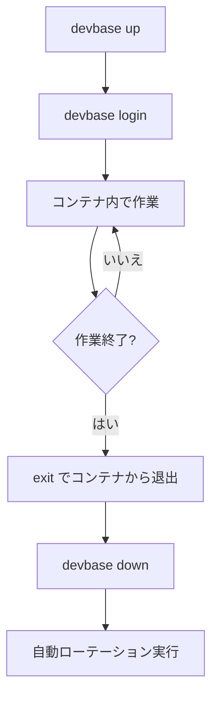

# はじめに

devbase の初回セットアップから日常的な開発ワークフローまでを解説します。

## 前提条件

devbase を利用するには、以下のソフトウェアがホストマシンにインストールされている必要があります。

| ソフトウェア | 最低バージョン | 確認コマンド |
|-------------|--------------|-------------|
| Docker Engine | 20.10 以上 | `docker --version` |
| Docker Compose | v2.x 以上 | `docker compose version` |
| Bash | 4.0 以上 | `bash --version` |
| Zsh（代替） | 5.0 以上 | `zsh --version` |
| Python | 3.10 以上 | `python3 --version` |
| Git | 最新推奨 | `git --version` |

> **Note:** Docker Desktop を使用している場合、Docker Engine と Docker Compose の両方が含まれています。Linux では Docker Engine を直接インストールし、Docker Compose プラグインを追加してください。

## セットアップ手順

### 1. リポジトリのクローン

```bash
git clone https://github.com/devbasex/devbase.git
cd devbase
```

### 2. devbase の初期化

```bash
./bin/devbase init
```

`init` コマンドは以下を自動実行します。

- `bin/devbase` を PATH に追加（`~/.bashrc` / `~/.zshrc` に追記）
- シェル補完スクリプトの登録（Tab 補完が有効になる）
- プラグイン設定ファイル `plugins.yml` の作成

### 3. シェルの再読み込み

```bash
# Bash の場合
source ~/.bashrc

# Zsh の場合
source ~/.zshrc
```

> **Note:** 新しいターミナルを開いても同様に反映されます。

### 4. プラグインリポジトリの登録

```bash
devbase plugin repo add user/repo
```

GitHub のショートハンド（`user/repo`）形式で指定できます。完全な URL も使用可能です。

```bash
# 登録済みリポジトリの確認
devbase plugin repo list
```

### 5. プラグインのインストール

```bash
# 利用可能なプラグインの確認
devbase plugin list --available

# プラグインのインストール
devbase plugin install <name>
```

インストールされたプラグインは `projects/` ディレクトリ配下にプロジェクトとして展開されます。

### 6. プロジェクトディレクトリへの移動

```bash
cd projects/<project>
```

### 7. 環境変数の設定

```bash
devbase env init
```

対話式のウィザードが起動し、以下を順に設定します。

1. グローバル環境変数（AWS 認証、GCP 認証、Git 認証など）
2. プロジェクト固有の環境変数

詳細は [環境変数ガイド](environment-variables.md) を参照してください。

### 8. コンテナイメージのビルド

```bash
devbase build
```

初回はベースイメージのビルドに時間がかかります（ネットワーク速度に依存）。2回目以降はキャッシュが利用されるため高速です。

### 9. コンテナの起動

```bash
devbase up
```

起動時に自動スナップショットが作成されます（詳細は [スナップショットガイド](snapshot-guide.md) を参照）。

### 10. コンテナへのログイン

```bash
devbase login
```

デフォルトでは 1 番目のコンテナにログインします。複数コンテナ環境では番号を指定できます。

```bash
devbase login 2
```

## 日常ワークフロー

セットアップ完了後の日常的な開発フローは以下のとおりです。



### 作業開始

```bash
# プロジェクトディレクトリに移動
cd devbase/projects/<project>

# コンテナ起動（自動スナップショット作成）
devbase up

# コンテナにログイン
devbase login
```

### 作業中

```bash
# コンテナの状態確認（別ターミナルから）
devbase ps

# ログの確認
devbase container logs -f

# 2番目のコンテナにログイン（並行作業）
devbase login 2
```

### 作業終了

```bash
# コンテナから退出
exit

# コンテナ停止・削除（自動ローテーション実行）
devbase down
```

## 環境の状態確認

`status` コマンドで環境の全体像を確認できます。

```bash
devbase status
```

表示される情報:

- コンテナの状態（起動中 / 停止中）
- インストール済みプラグイン
- 環境変数の設定状況
- スナップショットの状態

## プロジェクト構成の概要

devbase をセットアップすると、以下のようなディレクトリ構成になります。

```
devbase/
├── bin/
│   └── devbase              # メインエントリポイント
├── projects/
│   └── <project>/           # プラグインから作成されるプロジェクト
│       ├── plugin.yml       # プラグイン定義
│       ├── compose.yml      # Docker Compose 設定
│       ├── env              # プロジェクト設定（Git 管理）
│       ├── .env             # プロジェクト機密情報（gitignore）
│       └── backups/         # スナップショット保存先
├── .env                     # グローバル環境変数（gitignore）
└── plugins.yml              # プラグイン設定
```

## 次のステップ

- [CLI リファレンス](cli-reference.md) -- 全コマンドの詳細な使い方
- [環境変数ガイド](environment-variables.md) -- 環境変数の3レベル構造とコレクター
- [コンテナ操作ガイド](container-operations.md) -- 並行開発やボリュームの詳細
- [スナップショットガイド](snapshot-guide.md) -- バックアップと復元の仕組み
- [トラブルシューティング](troubleshooting.md) -- 問題が発生したとき
