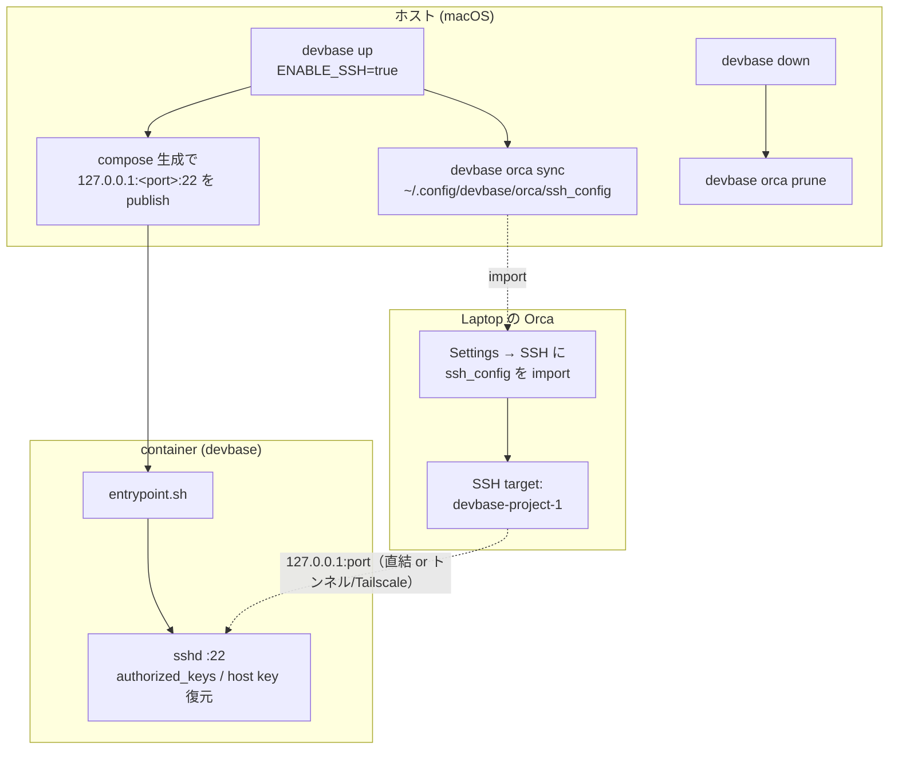

# Orca 接続ガイド

[Orca](https://www.onorca.dev/) から devbase が起動したコンテナへ SSH 接続し、コンテナ内で `git worktree` や AI エージェント CLI（claude / codex / gemini など）を動かすための手順を解説します。

## 概要

Orca はリモート開発を **「SSH target 上に worktree を作り、agent も SSH target 側で動かし、editor/diff は手元で使う」** モデル（[SSH worktrees](https://www.onorca.dev/docs/ssh)）で提供します。

devbase はこのモデルに合わせ、**コンテナ内の `sshd` をホストのポートへ publish して、Orca からは普通の `HostName + Port` の SSH host として見せる**構成を採ります。`docker exec` でターミナルだけコンテナへ入れる方式や `ProxyCommand` 方式は採りません（理由は[トラブルシューティング](#トラブルシューティング)を参照）。

構成は次の 3 層になります。

```text
Laptop (Windows / macOS)
  └─ Orca
      └─ SSH target: devbase-<project>-<index>   ← Orca は普通の SSH host として認識
            └─ macOS 上の Docker container (devbase)
                 ├─ sshd (:22 → host 127.0.0.1:<port> に publish)
                 ├─ git / claude / codex / gemini / worktree
                 └─ repo (/work)
```

devbase 側は次のように動作します。



## 前提

- コンテナ内 `sshd` は base イメージに含まれます。**base イメージの変更を反映するには再ビルドが必要**です。既存イメージを使っている場合は、必ず一度 `devbase build --no-cache` を実行してください。`devbase up` だけでは反映されません。

  ```bash
  devbase build --no-cache
  ```

  > **Warning:** base の Dockerfile / entrypoint の変更は `devbase up` では取り込まれません。SSH 接続が確立できないときは、まず base の再ビルド漏れを疑ってください。

- Orca が手元の Laptop（macOS または Windows）にインストールされていること。
- 公開鍵認証で接続します。手元に SSH 鍵ペア（例 `~/.ssh/id_ed25519` / `~/.ssh/id_ed25519.pub`）があること。無ければ `ssh-keygen -t ed25519` で作成してください。

## 手順

### 1. 公開鍵を収集する（`devbase env init`）

`SSH_AUTHORIZED_KEYS` には **Orca を動かすマシンの公開鍵**を登録します。この値は entrypoint がコンテナ内の `~/.ssh/authorized_keys` へ展開し、Orca からの公開鍵認証に使われます。認証に使う秘密鍵は Orca 側（下記 config の `IdentityFile`）にあるため、両者が対になっている必要があります。

`devbase env init` は **Mac 上で実行される**ため、自動収集されるのは Mac の公開鍵（`~/.ssh/id_ed25519.pub` など）です。したがって登録手順は接続元によって変わります。

- **パターン A: macOS 上の Orca**（同一 Mac） — 自動収集された Mac の公開鍵がそのまま Orca の鍵になるため、`devbase env init` だけで完了します。

  ```bash
  devbase env init
  ```

- **パターン B: Windows 上の Orca** — Orca は Windows 側の秘密鍵で接続するため、**Windows の公開鍵**を登録する必要があります（Mac の公開鍵では認証できません）。Windows 側で公開鍵を取得し、`SSH_AUTHORIZED_KEYS` に設定してください。

  ```powershell
  # Windows (PowerShell) — 公開鍵の内容を確認
  type $env:USERPROFILE\.ssh\id_ed25519.pub
  ```

  ```bash
  # Mac 側 — 上で表示された Windows の公開鍵を登録
  devbase env set SSH_AUTHORIZED_KEYS="ssh-ed25519 AAAA... user@windows"
  ```

> **Note:** すでに `env init` 済みで公開鍵だけ追加・更新したい場合は `devbase env sync` を実行するか、`devbase env set SSH_AUTHORIZED_KEYS=...` で直接設定できます。**複数行（複数鍵）に対応**するため、Mac と Windows の両方から接続する場合は 1 行に 1 鍵ずつ両方を登録できます。
>
> 生成 config には `IdentityFile` を出力しません。SSH クライアント / Orca が既定の秘密鍵（`~/.ssh/id_ed25519`, `~/.ssh/id_rsa`, …）を順に試行するため、`id_ed25519` でも `id_rsa` でも登録した公開鍵と対応する秘密鍵が使われます。特定の鍵を強制したい場合は、接続元マシンの `~/.ssh/config` で該当 `Host` に `IdentityFile` を追記してください。

### 2. SSH を有効にして起動する（`ENABLE_SSH=true`）

`ENABLE_SSH=true` を設定して `devbase up` すると、entrypoint が `sshd` を起動し、compose 生成時にコンテナの `:22` がホストの `127.0.0.1:<port>` へ publish されます。

```bash
# プロジェクトの env に設定する場合
devbase env set ENABLE_SSH=true -p

devbase up
```

publish 先ポートは **プロジェクト名 + index から決定的に算出**されます（既定 base `2200`）。`down` → `up` しても同じポートに戻るため、Orca 側の設定が壊れません。

### 3. Orca 用 SSH config を生成する（`devbase orca sync`）

`devbase orca sync` は、稼働中のコンテナと publish ポートを解決して、Orca 専用の SSH config を生成します。

```bash
devbase orca sync
```

生成先は次の**専用ファイル**です（ホストの `~/.ssh/config` は一切変更しません）。

```text
~/.config/devbase/orca/ssh_config
```

生成される内容の例:

```sshconfig
# Managed by devbase — do not edit. Import this file into Orca (Settings → SSH).
Host devbase-carmo-1
  HostName 127.0.0.1
  Port 2231
  User ubuntu
  StrictHostKeyChecking accept-new
```

関連コマンド:

| コマンド | 説明 |
|---------|------|
| `devbase orca sync` | 全プロジェクト横断で稼働中コンテナを集約し、config を再生成（毎回上書き） |
| `devbase orca prune` | 停止済みコンテナのエントリを config から除去 |
| `devbase orca status` | 現在の import 対象一覧と Orca への登録手順を表示 |

> **Note:** `devbase up` の完了後に sync、`devbase down` 時に prune が自動で呼ばれます。手動で最新化したいときのみ上記コマンドを使ってください。

### 4. Orca に config を import する

Orca の **Settings → SSH** を開き、生成された `~/.config/devbase/orca/ssh_config` を import します。このファイルには devbase コンテナのエントリしか含まれないため、Orca からは devbase コンテナ以外の SSH ホストは見えません（[隔離](#隔離-ホストの-sshconfig-を汚さない)を参照）。

### 5. SSH target に repo / worktree を作成する

Orca 上で、import した SSH target（例 `devbase-carmo-1`）を location に選び、repo / worktree を作成します。`git worktree add` などの操作は SSH target 側、つまり devbase コンテナ内で実行されます。

## 環境変数一覧

Orca 連携に関わる環境変数です。`ENABLE_SSH` / `SSH_AUTHORIZED_KEYS` は `devbase env init` で設定でき、その他は必要に応じてプロジェクトの `env` などに設定します。

| 変数 | 既定値 | 説明 |
|------|--------|------|
| `ENABLE_SSH` | （未設定 = 無効） | `true` / `1` で entrypoint が `sshd` を起動し、compose で SSH ポートを publish する |
| `SSH_AUTHORIZED_KEYS` | （未設定） | 手元の公開鍵。entrypoint がコンテナ内 `~/.ssh/authorized_keys` へ展開する。複数行可。`devbase env init` で収集 |
| `DEVBASE_SSH_BIND` | `127.0.0.1` | publish の bind 先。既定は外部非公開。LAN/Tailscale 直結時に上書きする |
| `DEVBASE_SSH_PORT_BASE` | `2200` | publish ポートの算出起点。プロジェクト + index からのオフセットを加算する |
| `DEVBASE_ORCA_HOSTNAME` | `127.0.0.1` | 生成 config の `HostName`。Tailscale 名や Mac の LAN IP へ上書きすると Windows から直結できる |

## 接続パターン

接続元が同一 Mac かどうかで 2 通りの構成があります。

### パターン A: macOS（同一 Mac・直結）

Orca と devbase コンテナが同じ Mac 上にある場合、Docker Desktop が `127.0.0.1:<port>` を公開しているため**追加設定なしで直結**できます。生成された config をそのまま import すれば接続できます。

```text
Orca (macOS) ──▶ 127.0.0.1:<port> ──▶ container sshd
```

### パターン B: Windows → macOS

手元の Windows の Orca から、macOS 上のコンテナへ接続する場合は、`127.0.0.1` へ到達させる経路が必要です。次のいずれかを使います。

**B-1. SSH トンネル**

Windows から Mac へ SSH トンネルを張り、ローカルの同一ポートをコンテナのポートへ転送します。

```bash
# Windows 側で実行（<port> は devbase orca status で確認）
ssh -L <port>:127.0.0.1:<port> mac-host
```

トンネルを張ったまま、Orca には既定の `HostName 127.0.0.1` の config をそのまま import します。Orca は Windows の `127.0.0.1:<port>` に接続し、トンネル経由で Mac 上のコンテナへ届きます。

**B-2. Tailscale / LAN 直結**

Mac が Tailscale や LAN で Windows から到達可能な場合は、`DEVBASE_SSH_BIND` を広げて publish し、`DEVBASE_ORCA_HOSTNAME` を Mac の Tailscale 名 / LAN IP に上書きして sync します。

```bash
# Mac 側
devbase env set DEVBASE_SSH_BIND=0.0.0.0 -p          # 到達可能なインターフェースへ bind
devbase env set DEVBASE_ORCA_HOSTNAME=mac.tailnet.ts.net -p
devbase up
devbase orca sync
```

生成 config の `HostName` が指定した名前になるため、Windows の Orca はそのアドレスへ直結します。

> **Warning:** `DEVBASE_SSH_BIND=0.0.0.0` はコンテナの SSH ポートを外部インターフェースへ公開します。信頼できるネットワーク（Tailscale など）に限定し、公開鍵認証のみである点を確認してください。

## 隔離: ホストの `~/.ssh/config` を汚さない

devbase は**専用ファイル `~/.config/devbase/orca/ssh_config` だけ**を生成し、Orca にはそれを import させます。ホストの `~/.ssh/config` は編集も `Include` もしません。

そのため Orca からは devbase コンテナのエントリしか見えず、**手元の `~/.ssh/config` に登録した他のホスト（本番サーバー等）は Orca に表示されません**。`Include` 方式ではメインの config にマージされ Orca が全ホストを読んでしまうため、devbase では採用していません。

## Ports tab / リモートポートフォワード

sshd は `AllowTcpForwarding yes` で構成されているため、Orca の **Ports tab** による remote port forward / preview が利用できます。コンテナ内で起動した開発サーバー（例 `:3000`）を手元へフォワードしてプレビューする、といった使い方が可能です。

## トラブルシューティング

### `docker exec` / `ProxyCommand` 方式を採らない理由

Orca は SSH target 上で file explorer / diff / worktree 管理を行います。`docker exec` でターミナルだけコンテナへ入れる方式や `ProxyCommand docker exec ... sshd -i` 方式では、**これらの機能がホスト側を向いてしまい**、コンテナ内のファイルを正しく扱えません。また file transfer に必要な SFTP が使えず **`SFTP is not available`** となります（[Orca の open issue](https://github.com/stablyai/orca/issues/7781)）。

devbase がコンテナ内 `sshd` を publish して「普通の SSH host」として見せるのは、これらの制約を回避し、file/diff/worktree をすべてコンテナ内で完結させるためです。

### `known_hosts` の警告が出る

sshd の host key はコンテナの `/persistent/ai/ssh/` に**永続化**され、再ビルド / 再作成時も同じ key が復元されます。したがって、再ビルド後も Orca 側 `known_hosts` の不一致警告は出ません。

初回接続時は生成 config の `StrictHostKeyChecking accept-new` により、host key が自動で登録されます。

### 接続できないときの確認順

1. `devbase build --no-cache` で base を再ビルドしたか（sshd 入りイメージになっているか）。
2. `ENABLE_SSH=true` で `devbase up` したか。
3. `devbase orca status` で対象コンテナと publish ポートが表示されるか。
4. 手元から素の SSH で疎通するか（`ssh -p <port> ubuntu@127.0.0.1 whoami`）。
5. Windows からの場合、SSH トンネル / Tailscale 経路が張れているか。

## 関連ドキュメント

- [環境変数ガイド](environment-variables.md) — 環境変数の 3 レベル構造と操作
- [コンテナ操作ガイド](container-operations.md) — ライフサイクル、並行開発、ボリューム構造
- [CLI リファレンス](cli-reference.md) — 全コマンドの構文・オプション
