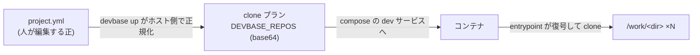

# project.yml リファレンス

`projects/<name>/project.yml` は、1 つのプロジェクト（= 1 つの dev コンテナ群）が
**どのリポジトリを開発対象にするか**と、devbase 自身のふるまいを定義するファイルです。
Git 管理対象で、プロジェクト設定の正です。

1 プロジェクトに複数のリポジトリを登録でき、すべてが同じコンテナの `/work` 配下へ
clone されます。関連する複数リポジトリ（本体・ドキュメント・インフラなど）を 1 つの
開発環境で横断的に扱うための仕組みです。

## 最小構成

```yaml
version: 1
repos:
  - owner: volareinc
    repo: carmo
```

`devbase up` すると、コンテナ内の `/work/carmo` にリポジトリが clone され、
ログイン直後の作業ディレクトリもそこになります。

## 複数リポジトリ

```yaml
version: 1
scale: 1
open_editor: true

defaults:
  owner: uttaro-dev2

repos:
  - repo: uttarov2          # 先頭が primary
    host: gitlab.com        # リポジトリごとにホストを変えられる
    owner: uttaro_dev
    dir: system             # /work/system へ clone する
  - repo: uttarov2-doc
  - repo: uttarov2migration
    branch: develop
    init: false
```

リポジトリが 2 件以上あるとき、`devbase up` は全リポジトリを含む
**multi-root ワークスペース** `/work/<プロジェクト名>.code-workspace` を生成し、
エディタはそれを開きます（1 件のときは primary リポジトリのフォルダを開きます）。

## キー一覧

### 最上位

| キー | 必須 | 既定値 | 説明 |
|------|------|--------|------|
| `version` | はい | -- | スキーマ版。現在は `1` |
| `repos` | はい | -- | clone するリポジトリの配列（1 件以上） |
| `defaults` | いいえ | -- | `repos` の各要素へ継承させる既定値（`host` / `owner` / `branch` / `init`） |
| `scale` | いいえ | `2` | 起動するコンテナ数。`devbase project scale N` はこの値を書き換える |
| `open_editor` | いいえ | -- | `devbase up` 後に VS Code を自動で開くか。未指定なら env `DEVBASE_OPEN_EDITOR` に従う |
| `work_dir` | いいえ | primary の `/work/<dir>` | エディタが開く既定フォルダを明示指定する。**効くのはリポジトリが 1 件のときだけ**で、2 件以上のときは自動生成の multi-root ワークスペースが開かれる |

### `repos[]`

| キー | 必須 | 既定値 | 説明 |
|------|------|--------|------|
| `owner` | はい | `defaults.owner` | Git ホストのユーザー名または Organization 名 |
| `repo` | はい | -- | リポジトリ名 |
| `host` | いいえ | `github.com` | Git ホスト名（例 `gitlab.com`） |
| `dir` | いいえ | `repo` と同じ | `/work` 直下の clone 先ディレクトリ名 |
| `branch` | いいえ | リポジトリの既定ブランチ | clone 直後にチェックアウトするブランチ |
| `init` | いいえ | `true` | リポジトリ直下の `./init.sh` を実行するか。clone 直後だけでなく**コンテナ起動のたび**（既存 clone があっても）実行されます |
| `primary` | いいえ | 先頭要素が `true` | ログイン直後の作業ディレクトリになるリポジトリ（1 件だけ指定可） |

clone URL は `https://<host>/<owner>/<repo>.git` で組み立てられます。認証は
コンテナに渡された既存の Git 資格情報の仕組みに委ねます（`project.yml` に
資格情報は書きません）。

`branch` と `init` は実行タイミングが異なります。

| キー | 実行タイミング | 理由 |
|------|--------------|------|
| `branch` | **clone 直後の 1 回だけ** | 既存 clone にも毎回適用すると、コンテナ内で作業ブランチへ切り替えた状態が再起動のたびに引き戻されるため |
| `init` | **コンテナ起動のたび**（既存 clone があっても毎回） | 依存パッケージの再取得など、コンテナ再生成後にも必要な処理を置く場所のため |

`init.sh` は毎回走るので、**何度実行しても同じ結果になる（冪等な）内容にしてください**。
`git clone` や追記のような繰り返すと壊れる処理を書く場合は、スクリプト側で実行済みかを
判定してください。実行が重い・1 回だけでよい場合は `init: false` にして手動実行に切り替えます。
なお `init.sh` の失敗は警告に留まり、他リポジトリの処理とコンテナ起動は続行されます。

## 検証されること

設定ミスを黙って無視せず、`devbase up` の時点でエラーにします。

- `owner` / `repo` が無い、`repos` が空
- `dir` の重複（同じ `/work/<dir>` を 2 つのリポジトリが奪い合う）
- `primary: true` が 2 件以上
- 未知のキー（`brunch: main` のような打ち間違いが「書いたのに効かない」形で表れないため）
- `repos[]` の `host` / `owner` / `repo` / `dir` / `branch` に空白・制御文字が混ざっている
- `dir` が `/work` 直下から外れている（`../` や入れ子のパス、`.` / `..`）

## `env` との使い分け

| 書く場所 | 内容 | 例 |
|---------|------|-----|
| `project.yml` | devbase 自身の設定 | リポジトリ、コンテナ数、エディタの自動オープン |
| `env` | コンテナへ渡す環境変数 | `ENABLE_SSH`、アプリが読む設定値 |
| `.env` | プロジェクト固有の機密 | API キー、DB 接続情報 |

`compose.yml` が `env_file: - env` で参照するため、`env` は**ファイル自体が必須**です。
渡したい環境変数が無ければ空ファイルで構いませんが、削除すると `devbase up` が
compose の起動時に失敗します。

## 旧 `env` 形式からの移行

`GIT_USER` / `GIT_REPO` / `GIT_HOST` / `WORK_DIR` / `CONTAINER_SCALE` /
`DEVBASE_OPEN_EDITOR` を `env` に書く旧形式は廃止されました。`project.yml` の無い
プロジェクトは `devbase up` が移行手順を案内して停止します。

変換は [`devbase project migrate-config`](cli-reference/02-project.md#devbase-project-migrate-config)
で行います。

```bash
devbase project migrate-config --dry-run   # 変換結果を確認
devbase project migrate-config             # 適用
```

| 旧 `env` のキー | 移行先 |
|----------------|--------|
| `GIT_USER` | `repos[].owner` |
| `GIT_REPO` | `repos[].repo` |
| `GIT_HOST` | `repos[].host` |
| `WORK_DIR` | `work_dir`（既定値と同じ場合は書きません） |
| `CONTAINER_SCALE` | `scale` |
| `DEVBASE_OPEN_EDITOR` | `open_editor` |

## コンテナへの渡り方

`project.yml` を編集する人が意識する必要はありませんが、仕組みを知っておくと
トラブルシュートに役立ちます。



YAML の解釈はホスト側の Python に閉じています。コンテナ側は復号して 1 行ずつ
clone するだけなので、イメージへ YAML パーサを持ち込みません。

> **Note:** `entrypoint.sh` はイメージに焼き込まれます。devbase 本体を更新して
> clone のふるまいが変わった場合は、`devbase build --no-cache` でベースイメージを
> 再ビルドしないと反映されません。
