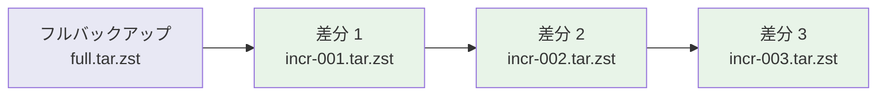
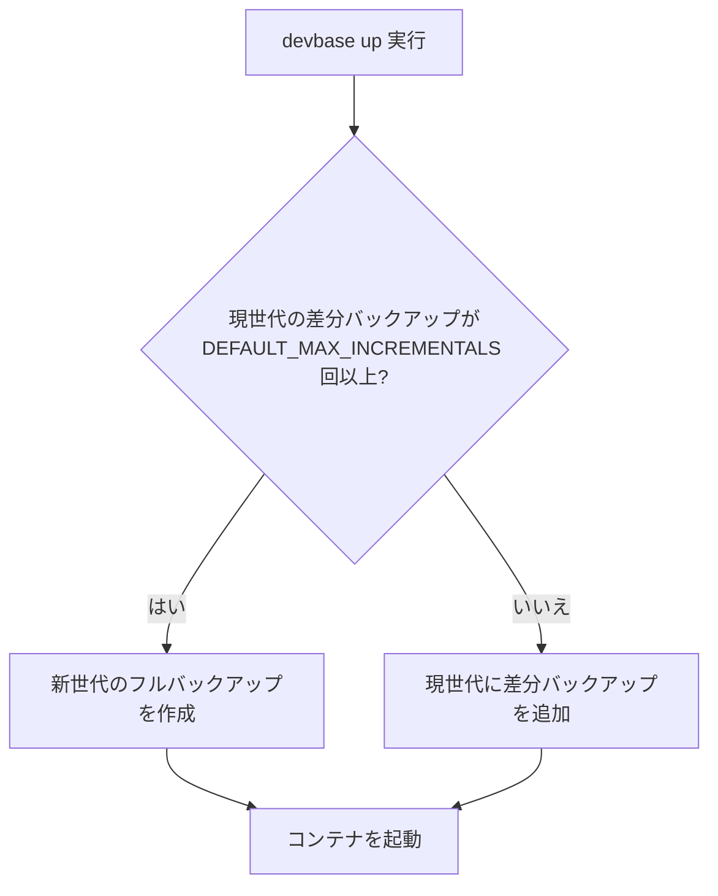
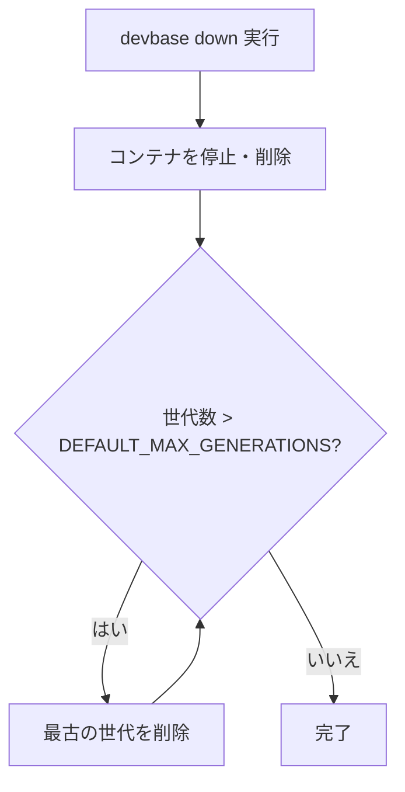
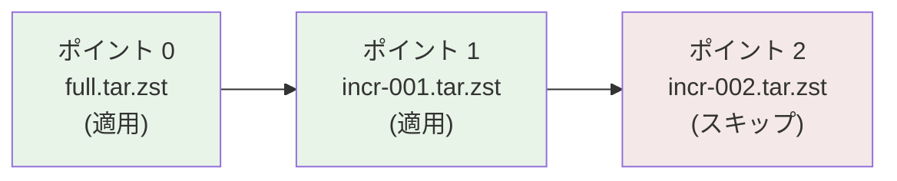

# スナップショットガイド

devbase のスナップショット機能は、コンテナの `/home/ubuntu` 共通ボリューム (`devbase_home_ubuntu`) を増分バックアップし、世代管理と復元を提供します。`/work` 配下のプロジェクト作業ファイルはバックアップ対象外なので、重要なファイルは Git に push するか別途バックアップを取ってください。

## 仕組み

### 増分バックアップ

devbase のスナップショットは GNU tar の `--listed-incremental` オプションを使用した増分バックアップ方式を採用しています。



- **フルバックアップ**: `/home/ubuntu` 共通ボリューム全体をアーカイブ
- **差分バックアップ**: 前回からの変更分のみをアーカイブ
- **圧縮**: zstd `-1 -T0`（圧縮レベル 1、全 CPU コア使用）で高速圧縮

### 軽量専用イメージ

スナップショット操作には専用の軽量コンテナイメージ `devbase-snapshot` を使用します。

| 項目 | 値 |
|------|-----|
| イメージ名 | `devbase-snapshot` |
| サイズ | 約 80MB |
| 含まれるツール | zstd のみ |
| ビルドタイミング | 初回のスナップショット操作時に自動ビルド |

プロジェクトのコンテナを起動せずにバックアップ・復元を実行できるため、ダウンタイムが発生しません。

## 世代管理

### 設定パラメータ

| パラメータ | デフォルト値 | 説明 |
|-----------|------------|------|
| `DEFAULT_MAX_INCREMENTALS` | `10` | 1 世代あたりの最大差分バックアップ数 |
| `DEFAULT_MAX_GENERATIONS` | `3` | 保持する最大世代数 |

デフォルト設定では、差分バックアップが 10 回溜まるとフルバックアップが新たに作成され、最大 3 世代が保持されます。

### 世代の概念

```mermaid
graph TD
    subgraph 世代 1（最古）
        A1[full.tar.zst]
        A2[incr-001.tar.zst]
        A3[incr-002.tar.zst]
    end
    subgraph 世代 2
        B1[full.tar.zst]
        B2[incr-001.tar.zst]
    end
    subgraph 世代 3（最新）
        C1[full.tar.zst]
    end
```

- 1 つの世代は 1 つのフルバックアップと 0 個以上の差分バックアップで構成される
- 差分バックアップが `DEFAULT_MAX_INCREMENTALS` 回に達すると新しい世代が開始される
- `DEFAULT_MAX_GENERATIONS` を超えた古い世代は自動的に削除される

## 自動実行

スナップショットはコンテナのライフサイクルに連動して自動実行されます。

### `devbase up` 時の動作



### `devbase down` 時の動作



## バックアップデータ構造

スナップショットは `${DEVBASE_ROOT}/backups/` ディレクトリ（devbase ルート直下）に保存され、全プロジェクトで共通の場所に集約されます。

```
backups/
├── snapshot.yml                    # スナップショット全体のメタデータ
├── 20260220-103000/                # タイムスタンプ名の世代
│   ├── meta.yml                    # 世代のメタデータ
│   ├── full.tar.zst               # フルバックアップ
│   ├── incr-001.tar.zst           # 差分バックアップ 1
│   └── incr-002.tar.zst           # 差分バックアップ 2
└── before-upgrade/                 # 名前付きスナップショット
    ├── meta.yml
    └── full.tar.zst
```

### ファイルの説明

| ファイル | 内容 |
|---------|------|
| `snapshot.yml` | 全世代のインデックス情報 |
| `meta.yml` | 世代ごとの作成日時、バックアップポイント数、サイズ等 |
| `full.tar.zst` | フルバックアップアーカイブ |
| `incr-NNN.tar.zst` | 差分バックアップアーカイブ（NNN は連番） |

## コマンド詳細

### スナップショットの作成

#### 自動命名（タイムスタンプ）

```bash
devbase snapshot create
```

現在の世代に差分バックアップを追加します。世代が存在しない場合はフルバックアップを作成します。

#### 名前付きスナップショット

```bash
devbase snapshot create --name before-upgrade
```

指定した名前でスナップショットを作成します。重要な変更の前に手動で作成する場合に便利です。

#### フルバックアップの強制作成

```bash
devbase snapshot create --full
```

差分ではなく、強制的にフルバックアップを作成します。

```bash
# 名前付きフルバックアップ
devbase snapshot create --name before-migration --full
```

### スナップショットの一覧

```bash
devbase snapshot list
```

出力例:

```
Name                  Points  Size      Created
20260218-080000       3       1.2 GB    2026-02-18 08:00:00
20260220-103000       2       850 MB    2026-02-20 10:30:00
before-upgrade        1       2.1 GB    2026-02-21 14:00:00
```

### スナップショットからの復元

#### 最新の状態に復元

```bash
devbase snapshot restore 20260220-103000
```

指定した世代のフルバックアップと全差分バックアップを順に適用し、最新の状態に復元します。

#### 特定の時点まで復元

```bash
devbase snapshot restore 20260220-103000 --point 1
```

フルバックアップ（ポイント 0）と差分バックアップ 1（ポイント 1）まで適用します。ポイント 2 以降の変更は適用されません。



#### 復元の安全性

復元を実行する前に、現在の `/home/ubuntu` 共通ボリュームの状態が `pre-restore-<timestamp>` という名前で自動バックアップされます。

```bash
# 復元前に自動作成されるバックアップ
# backups/pre-restore-20260221-150000/
#   ├── meta.yml
#   └── full.tar.zst
```

> **Note:** 復元を元に戻したい場合は、この自動バックアップから再度復元できます。

```bash
# 復元を元に戻す
devbase snapshot restore pre-restore-20260221-150000
```

### スナップショットのコピー

```bash
devbase snapshot copy 20260220-103000 important-milestone
```

既存のスナップショットを別名でコピーします。ローテーションから保護したい重要なスナップショットに使用します。

### スナップショットの削除

```bash
devbase snapshot delete 20260218-080000
```

指定したスナップショットを削除します。

> **Warning:** 削除は取り消せません。重要なスナップショットは事前に `snapshot copy` でバックアップしてください。

### 手動ローテーション

```bash
# デフォルトの保持数で実行
devbase snapshot rotate

# 保持する世代数を指定
devbase snapshot rotate --keep 5
```

`--keep N` で指定した世代数より古い世代を削除します。名前付きスナップショット（`--name` で作成したもの）はローテーション対象外です。

## 運用のベストプラクティス

1. **重要な変更の前には名前付きスナップショットを作成する**

   ```bash
   devbase snapshot create --name before-db-migration --full
   ```

2. **名前付きスナップショットはローテーションから保護される** -- 自動削除されないため、不要になったら手動で削除する

3. **復元は `--point N` で段階的に確認する** -- 全差分適用の前に特定時点を確認

4. **バックアップ容量を定期的に確認する**

   ```bash
   devbase snapshot list
   du -sh projects/<project>/backups/
   ```

5. **ローテーションの保持数はプロジェクトに合わせて調整する**

   ```bash
   # 長期保持が必要な場合
   devbase snapshot rotate --keep 7
   ```
