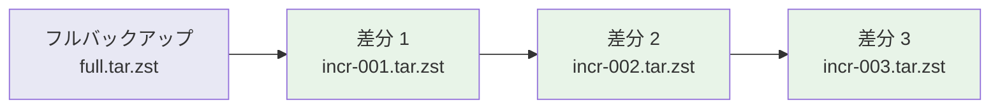
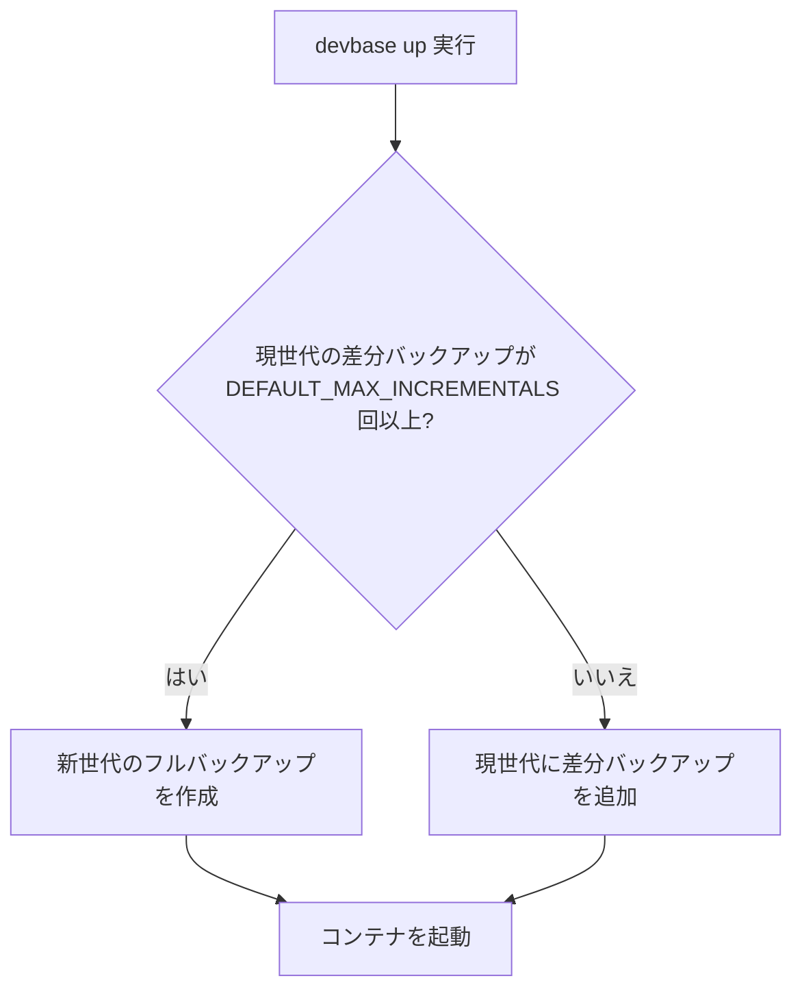
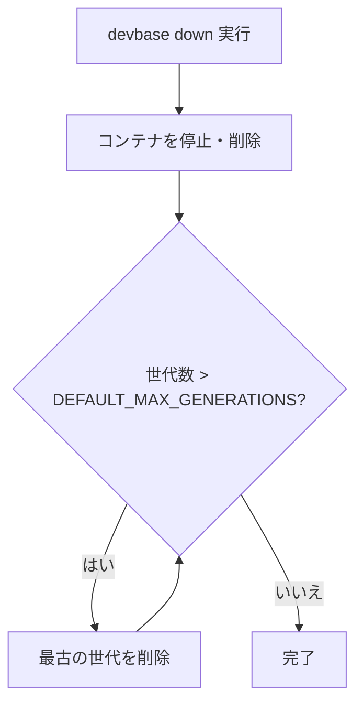
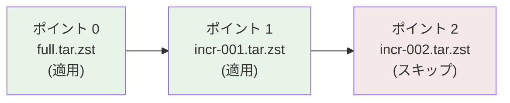

# スナップショットガイド

devbase のスナップショット機能は、永続化ボリュームを増分バックアップし、世代管理と復元を提供します。
`/work` 配下のプロジェクト作業ファイルはバックアップ対象外なので、重要なファイルは Git に push するか別途バックアップを取ってください。

対象は次の 2 本です。

| ボリューム | コンテナ内 | 内容 |
|---|---|---|
| `devbase_home_ubuntu` | `/persistent/ai` | 全コンテナ共通の AI 資産・共有ファイル |
| `devbase_home_{group}` | `/persistent/group` | アカウントグループ単位の認証・会話ログ・gcloud / gws の設定 |

`{group}` は実行時の `DEVBASE_ACCOUNT_GROUP` の解決結果です（未設定なら `default`）。
プロジェクトディレクトリで実行すればそのプロジェクトのグループが、devbase ルートで実行すれば
グローバル `env` の値（無ければ `default`）が対象になります。詳細は
[コンテナ運用ガイド](container-operations.md) の「アカウントグループ」を参照してください。

## 仕組み

### 増分バックアップ

devbase のスナップショットは GNU tar の `--listed-incremental` オプションを使用した増分バックアップ方式を採用しています。


```mermaid
graph LR
    A[フルバックアップ<br/>full.tar.zst] --> B[差分 1<br/>incr-001.tar.zst]
    B --> C[差分 2<br/>incr-002.tar.zst]
    C --> D[差分 3<br/>incr-003.tar.zst]

    style A fill:#e8e8f4
    style B fill:#e8f4e8
    style C fill:#e8f4e8
    style D fill:#e8f4e8
```

- **フルバックアップ**: 対象ボリューム 2 本の全体をアーカイブ（アーカイブ内では `ai/` と `group/` に分かれます）
- **差分バックアップ**: 前回からの変更分のみをアーカイブ
- **圧縮**: zstd `-1 -T0`（圧縮レベル 1、全 CPU コア使用）で高速圧縮

### 軽量専用イメージ

スナップショット操作には専用の軽量コンテナイメージ `devbase-snapshot` を使用します。

| 項目 | 値 |
|------|-----|
| イメージ名 | `devbase-snapshot` |
| サイズ | 約 80MB |
| 含まれるツール | zstd のみ |
| ビルドタイミング | 初回のスナップショット操作時に自動ビルド |

プロジェクトのコンテナを起動せずにバックアップ・復元を実行できるため、ダウンタイムが発生しません。

## 世代管理

### 設定パラメータ

| パラメータ | デフォルト値 | 説明 |
|-----------|------------|------|
| `DEFAULT_MAX_INCREMENTALS` | `10` | 1 世代あたりの最大差分バックアップ数 |
| `DEFAULT_MAX_GENERATIONS` | `3` | 保持する最大世代数 |

デフォルト設定では、差分バックアップが 10 回溜まるとフルバックアップが新たに作成され、最大 3 世代が保持されます。

### 世代の概念

```mermaid
graph TD
    subgraph 世代 1（最古）
        A1[full.tar.zst]
        A2[incr-001.tar.zst]
        A3[incr-002.tar.zst]
    end
    subgraph 世代 2
        B1[full.tar.zst]
        B2[incr-001.tar.zst]
    end
    subgraph 世代 3（最新）
        C1[full.tar.zst]
    end
```

- 1 つの世代は 1 つのフルバックアップと 0 個以上の差分バックアップで構成される
- 差分バックアップが `DEFAULT_MAX_INCREMENTALS` 回に達すると新しい世代が開始される
- `DEFAULT_MAX_GENERATIONS` を超えた古い世代は自動的に削除される

## 自動実行

スナップショットはコンテナのライフサイクルに連動して自動実行されます。

### `devbase up` 時の動作


```mermaid
flowchart TD
    A[devbase up 実行] --> B{現世代の差分バックアップが<br/>DEFAULT_MAX_INCREMENTALS 回以上?}
    B -->|はい| C[新世代のフルバックアップを作成]
    B -->|いいえ| D[現世代に差分バックアップを追加]
    C --> E[コンテナを起動]
    D --> E
```

### `devbase down` 時の動作


```mermaid
flowchart TD
    A[devbase down 実行] --> B[コンテナを停止・削除]
    B --> C{世代数 > DEFAULT_MAX_GENERATIONS?}
    C -->|はい| D[最古の世代を削除]
    D --> C
    C -->|いいえ| E[完了]
```

## バックアップデータ構造

スナップショットは `${DEVBASE_ROOT}/backups/` ディレクトリ（devbase ルート直下）に保存され、全プロジェクトで共通の場所に集約されます。

```
backups/
├── snapshot.yml                    # スナップショット全体のメタデータ
├── 20260220-103000/                # タイムスタンプ名の世代
│   ├── meta.yml                    # 世代のメタデータ
│   ├── full.tar.zst               # フルバックアップ
│   ├── incr-001.tar.zst           # 差分バックアップ 1
│   └── incr-002.tar.zst           # 差分バックアップ 2
└── before-upgrade/                 # 名前付きスナップショット
    ├── meta.yml
    └── full.tar.zst
```

### ファイルの説明

| ファイル | 内容 |
|---------|------|
| `snapshot.yml` | 全世代のインデックス情報（対象ボリューム名を含む）|
| `meta.yml` | 世代ごとの作成日時、バックアップポイント数、サイズ、**対象ボリューム**等 |
| `full.tar.zst` | フルバックアップアーカイブ |
| `incr-NNN.tar.zst` | 差分バックアップアーカイブ（NNN は連番） |

## コマンド詳細

### スナップショットの作成

#### 自動命名（タイムスタンプ）

```bash
devbase snapshot create
```

現在の世代に差分バックアップを追加します。世代が存在しない場合はフルバックアップを作成します。

#### 名前付きスナップショット

```bash
devbase snapshot create --name before-upgrade
```

指定した名前でスナップショットを作成します。重要な変更の前に手動で作成する場合に便利です。

#### フルバックアップの強制作成

```bash
devbase snapshot create --full
```

差分ではなく、強制的にフルバックアップを作成します。

```bash
# 名前付きフルバックアップ
devbase snapshot create --name before-migration --full
```

### スナップショットの一覧

```bash
devbase snapshot list
```

出力例:

```
名前                     作成日時                    差分数        サイズ  対象ボリューム
------------------------------------------------------------------------------------------
20260218-080000          2026-02-18 08:00:00           3       1.2GB  devbase_home_ubuntu
20260220-103000          2026-02-20 10:30:00           2     850.0MB  devbase_home_ubuntu, devbase_home_default
before-upgrade           2026-02-21 14:00:00           1       2.1GB  devbase_home_ubuntu, devbase_home_kkg
```

「対象ボリューム」が `devbase_home_ubuntu` だけの世代は、アカウントグループ分離より**前**に
作られた世代です。そのまま共通ボリュームへ復元できます。

### 対象ボリュームが変わったとき

アカウントグループを切り替えたり、分離前の環境から更新したりすると、対象ボリュームの構成が
変わります。このとき devbase は**新しい世代を作ります**。旧世代の差分状態ファイル
（`snapshot.snar`）は別のレイアウトを記録しているため、そこへ差分を積むと全ファイルが
移動したものとして扱われ、差分が壊れるからです。世代を分けることで旧世代はそのまま復元できます。

構成の違う世代を明示的に指定して差分を作ろうとした場合は、理由を示して中断します。

```console
$ devbase snapshot create --name 20260218-080000
スナップショット操作に失敗: スナップショット '20260218-080000' は別のボリューム構成
(devbase_home_ubuntu) で作られています。現在の対象は devbase_home_ubuntu,
devbase_home_default です。新しい世代を作成してください (devbase snapshot create)
```

### スナップショットからの復元

#### 最新の状態に復元

```bash
devbase snapshot restore 20260220-103000
```

指定した世代のフルバックアップと全差分バックアップを順に適用し、最新の状態に復元します。

#### 特定の時点まで復元

```bash
devbase snapshot restore 20260220-103000 --point 1
```

フルバックアップ（ポイント 0）と差分バックアップ 1（ポイント 1）まで適用します。ポイント 2 以降の変更は適用されません。


```mermaid
graph LR
    A["ポイント 0<br/>full.tar.zst<br/>(適用)"] --> B["ポイント 1<br/>incr-001.tar.zst<br/>(適用)"]
    B --> C["ポイント 2<br/>incr-002.tar.zst<br/>(スキップ)"]

    style A fill:#e8f4e8
    style B fill:#e8f4e8
    style C fill:#f4e8e8
```

#### 復元の安全性

復元を実行する前に、現在の対象ボリュームの状態が `pre-restore-<timestamp>` という名前で自動バックアップされます。

```bash
# 復元前に自動作成されるバックアップ
# backups/pre-restore-20260221-150000/
#   ├── meta.yml
#   └── full.tar.zst
```

> **Note:** 復元を元に戻したい場合は、この自動バックアップから再度復元できます。

```bash
# 復元を元に戻す
devbase snapshot restore pre-restore-20260221-150000
```

#### 復元中に出る rename の警告

差分の適用中に、次のような警告が出ることがあります。**復元は続行され、内容も正しく復元されます。**

```
WARNING incr-002.tar.zst の展開で tar が rename に失敗しました。GNU tar の incremental が
inode 番号の再利用でディレクトリの rename を誤検出したものとみなし、復元を続けます:
tar: Cannot rename './ai/.claude/plugins/cache/foo' to './ai/.claude/plugins/cache/bar': Directory not empty
```

これは GNU tar の増分バックアップの仕組みに由来します。tar はディレクトリを
**inode 番号**で追跡して「名前の変更」を検出しますが、`~/.claude/plugins/cache/` のように
ディレクトリごと作り直される場所では、削除されたディレクトリの inode 番号が新しい
ディレクトリに再利用されます。すると tar は無関係なディレクトリを「名前が変わった」と
誤検出し、復元時にその名前変更を実行しようとして失敗します。

tar は名前変更に失敗しても展開そのものは最後まで行うため、devbase はこの失敗だけを
警告として扱い、次の差分へ進みます。**警告が出ても対応は不要です。**

> **Note:** 警告に出たパスが、利用者が実際に `mv` したディレクトリだった場合に限り、
> そのディレクトリの中身が復元されない可能性があります。心当たりがある場合だけ、
> 警告に出たパスを確認してください。

#### 復元が失敗したとき

rename 以外の理由で失敗した場合、復元はその場で止まります。このとき
**対象ボリュームは途中まで書き換わっている可能性があります**。エラーには、どのアーカイブの
展開中に失敗したかと、元に戻す手順が出ます。

```
復元に失敗しました (incr-002.tar.zst の展開中)。対象ボリュームは途中まで
書き換わっている可能性があります。復元前の状態は 'pre-restore-20260221-150000' に退避してあります。
元に戻すには devbase snapshot restore pre-restore-20260221-150000 を実行してください。
```

案内のとおり `pre-restore-<timestamp>` から復元すれば、復元を始める前の状態に戻せます。

### スナップショットのコピー

```bash
devbase snapshot copy 20260220-103000 important-milestone
```

既存のスナップショットを別名でコピーします。ローテーションから保護したい重要なスナップショットに使用します。

### スナップショットの削除

```bash
devbase snapshot delete 20260218-080000
```

指定したスナップショットを削除します。

> **Warning:** 削除は取り消せません。重要なスナップショットは事前に `snapshot copy` でバックアップしてください。

### 手動ローテーション

```bash
# デフォルトの保持数で実行
devbase snapshot rotate

# 保持する世代数を指定
devbase snapshot rotate --keep 5
```

`--keep N` で指定した世代数より古い世代を削除します。名前付きスナップショット（`--name` で作成したもの）はローテーション対象外です。

## 運用のベストプラクティス

1. **重要な変更の前には名前付きスナップショットを作成する**

   ```bash
   devbase snapshot create --name before-db-migration --full
   ```

2. **名前付きスナップショットはローテーションから保護される** -- 自動削除されないため、不要になったら手動で削除する

3. **復元は `--point N` で段階的に確認する** -- 全差分適用の前に特定時点を確認

4. **バックアップ容量を定期的に確認する**

   ```bash
   devbase snapshot list
   du -sh projects/<project>/backups/
   ```

5. **ローテーションの保持数はプロジェクトに合わせて調整する**

   ```bash
   # 長期保持が必要な場合
   devbase snapshot rotate --keep 7
   ```
