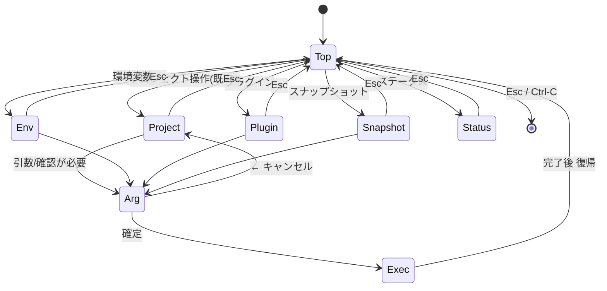

# PLAN31_2: `devbase list` TUI の統合UI化

> 元 issue: `issues/i31.md` 第2項
> ステータス: 着手可（設計確定 2026-06-09・既存コード精読済み）
> 関連: PLAN31_1 (init は installer に吸収)、PLAN06 (`project` 群)
> 関連 skill: `/ndf:issue-plan-strategy`, `/ndf:implementation-plan`

## 1. 背景と目的

現状の `devbase list` TUI（`lib/devbase/commands/project.py`）は
**プロジェクト選択 → up/rebuild/down サブメニュー**まで（i29〜i32 の到達点）。
ゴールは **`devbase` のほぼ全操作を TUI から実行可能**にすること。`init` は
PLAN31_1 に吸収のため対象外。範囲は **全コマンド群を階層メニューでフル統合**
（ユーザー確認済み 2026-06-09）。

## 2. 既存コード調査結果（実装の核心）

### 2.1 全ハンドラは `args.subcommand` + `getattr(args, …)` 駆動

CLI の実体は argparse だが、各グループハンドラは Namespace を
`subcommand` で分岐し属性を `getattr` で読むだけ。**TUI は `types.SimpleNamespace`
を組んで既存ハンドラを直接呼べる**（ロジック二重実装不要）。実証パターンが既にある:

```python
# project.py:174-185  _start_project_action
from devbase.commands.container import cmd_project
return cmd_project(types.SimpleNamespace(subcommand=action, name=name, scale=None))
```

### 2.2 ハンドラのシグネチャと委譲経路

| カテゴリ | エントリ | シグネチャ | 出典 |
|---|---|---|---|
| project ライフサイクル | `cmd_project(args)` → `_dispatch_lifecycle` | `args`(Namespace) | `container.py:309-311`, `265-306` |
| env | `cmd_env(devbase_root, args)` | `(Path, Namespace)` | `env.py:18-` |
| plugin | `cmd_plugin(devbase_root, args)` | `(Path, Namespace)` | `plugin.py:23-` |
| snapshot | `cmd_snapshot(devbase_root, args)` | `(Path, Namespace)` | `snapshot.py:22-` |
| status | `cmd_status(devbase_root)` | `(Path,)` 引数なし | `status.py:184` |

> 重要な発見: `_dispatch_lifecycle` は `getattr(args,'name',None)` が真なら
> **subcommand を問わず** `_resolve_project_name` で対象 `projects/<name>` へ
> `chdir` する（`container.py:278-284`, `205-262`）。つまり TUI は project 系で
> **一律 `name=<選択プロジェクト>` を渡せば chdir が効く**。`login`/`build` は
> parser に `name` が無い（`cli.py:89-110`）が、Namespace に `name` を載せれば
> chdir は発動するので問題なし。

### 2.3 各サブコマンドが読む属性（cli.py parser 定義より逆算）

TUI が組む `SimpleNamespace` に必要な属性。CLI 実行と差異を出さないための契約表。

| サブコマンド | 必要属性（既定） | 出典 (cli.py) | scope |
|---|---|---|---|
| project up | `name`, `scale`(None) | `_dispatch_lifecycle:288` | CWD(name で chdir) |
| project down | `name` | `:290` | 〃 / 破壊的 |
| project login | `name`, `index`("1") | `:291`, `99` | 〃 |
| project ps | `name`, `all`(False) | `:292`, `167-169` | 〃 |
| project logs | `name`, `follow`(False), `tail`(None) | `:293`, `171-174` | 〃 |
| project scale | `name`, `new_scale`(int) | `:295`, `178-180` | 〃 |
| project build | `name`, `image`(None) | `:297`, `110` | 〃 |
| project rebuild | `name` | `:298`, `188-190` | 〃 |
| env init | `reset`(False) | `env.py:23`, `cli:219-220` | global .env / 対話 |
| env list | `global_only`,`project_only`,`reveal`,`keys_only` | `env.py:25-29`, `cli:224-231` | global+project |
| env set | `assignment`("K=V"), `project`(False) | `env.py:30-31`, `cli:233-235` | `--project` 時 CWD |
| env get/delete | `key` | `env.py:32-33`, `cli:237-241` | global |
| env edit/sync/project | （なし） | `cli:222,243-244` | edit/project は CWD |
| env export/import | `dest`/`source` 他多数 | `env.py:392-430`, `cli:246-328` | global+project |
| plugin list | `available`(False) | `plugin.py:29`, `cli:337-338` | global |
| plugin install | `source`, `link`, `install_all` | `plugin.py:31-33`, `cli:341-345` | global |
| plugin uninstall/info | `name` | `plugin.py:34,36`, `cli:348-355` | global / 破壊的(uninstall) |
| plugin update | `name`(None) | `plugin.py:35`, `cli:351-352` | global |
| plugin sync/migrate | （なし） | `cli:357-360` | global |
| plugin repo add | `repo_command='add'`, `url`, `name`(None) | `plugin.py:176,185`, `cli:366-368` | global |
| plugin repo remove | `repo_command='remove'`, `name`, `force` | `cli:370-373` | global / 破壊的 |
| plugin repo list/refresh | `repo_command`, (`name` for refresh) | `cli:375-378` | global |
| snapshot create | `name`(None), `full`(False) | `snapshot.py:29-30`, `cli:387-389` | global |
| snapshot restore | `name`, `point`(None) | `snapshot.py:33-34`, `cli:393-395` | global / 破壊的 |
| snapshot copy | `name`, `new_name` | `snapshot.py:36-37`, `cli:398-400` | global |
| snapshot delete | `name` | `snapshot.py:38`, `cli:402-403` | global / 破壊的 |
| snapshot rotate | `keep`(3) | `snapshot.py:39`, `cli:405-406` | global |

### 2.4 既存 TUI 資産（PR1 で再利用・移送する）

- questionary は任意依存。未導入時はフォールバック (`project.py:26-31`, `319-331`)。
- メニュー部品: `_show_menu`/`_show_action_menu`/`_with_escape_cancel`/`_with_escape_back`/
  `_add_escape_binding`/`_MENU_BACK` 番兵（`project.py:195-289`）。
- ナビ規約: **Esc=トップ復帰**(`_with_escape_cancel`), **←=1階層戻る**(`_with_escape_back`,
  Left+Esc)（`project.py:214-245`）。Ctrl-C=中止(rc=0)。
- 非 TTY 判定 → 一覧表示フォールバック（`project.py:391-394`）。
- プロジェクト一覧と状態: `list_projects`/`_print_table`（`project.py:75-130`）、
  状態は `docker ps` 1 回集計 `status._running_counts_by_project`（`project.py:105`）。

## 3. 設計方針

### 3.1 アーキテクチャ（モジュール切り出し）

`project.py` 肥大化を避け `lib/devbase/tui/` パッケージへ分離:

```text
lib/devbase/tui/
  menu.py        # questionary ラッパ・_MENU_BACK・escape binding・引数収集ヘルパ
                 #   (text/select/confirm/int/path + 入力検証ループ)
  app.py         # トップ階層メニュー & カテゴリ routing。devbase_root を保持
  dispatch.py    # SimpleNamespace 生成 + 既存ハンドラ呼び出しの薄い共通関数
  actions_project.py / actions_env.py / actions_plugin.py
  actions_snapshot.py / actions_status.py
```

- `cmd_project_list`（`project.py:378`）は **新 `tui.app.run(devbase_root, args)` への入口**に置換。
- `dispatch.py` は `_start_project_action`（`project.py:174-185`）を一般化:
  `dispatch_lifecycle(subcommand, name, **attrs)` / `dispatch_group(handler, devbase_root, subcommand, **attrs)`。
- questionary 不在 / 非 TTY 時は現状フォールバック（project 一覧の番号入力）を維持し、
  全 TUI を要求された場合は「CLI を使ってください」と縮退案内。

### 3.2 `devbase list` の入口挙動（後方互換に配慮）

`devbase list` は新トップメニューを開く。互換性のため **「プロジェクト操作」を
先頭・既定ハイライト**にし、Enter 連打で従来の project 選択フローに到達できるようにする
（PR1 のレビュー観点に「既存挙動の非回帰」を明記）。`--no-interactive`/`--plain` は
従来どおり一覧テーブルのみ。

### 3.3 project スコープ依存の扱い

`env set --project` / `env project` / `env edit` は CWD（プロジェクトディレクトリ）で
動く。これらを TUI から実行する場合は **先にプロジェクトを選ばせて chdir**（2.2 の
name→chdir 機構、または `os.chdir`）してからハンドラを呼ぶ。env/plugin/snapshot の
global 操作は DEVBASE_ROOT 上で動くため chdir 不要。

### 3.4 破壊的操作の確認

`down`/`env delete`/`plugin uninstall`/`plugin repo remove`/`snapshot delete`/
`snapshot restore` は実行前に `menu.confirm()` で確認（2.3 の「破壊的」印）。

### 3.5 状態遷移



## 4. PR 分割計画

PR1 で土台（`tui/` + メニューエンジン + 既存挙動の移送）。PR2〜5 は release 上で
並行（各カテゴリは別 `actions_*.py` で衝突しにくい）。

| PR # | branch 名 | 概要 | 主な変更 | 依存 | 並行 |
|---|---|---|---|---|---|
| 1 | `feature/PLAN31_2-tui-framework` | `tui/` 新設・`menu`/`dispatch`/`app`・トップ階層メニュー・Esc/←/Ctrl-C 規約移送・引数収集ヘルパ・**既存 project up/down/rebuild を非回帰移送**・`cmd_project_list` を入口に置換 | `tui/*`, `project.py` | なし | ○ |
| 2 | `feature/PLAN31_2-project-ops` | project に login/ps/logs/scale/build 追加（index/all/follow+tail/new_scale(int 検証)/image(`containers/` から選択)） | `tui/actions_project.py` | PR1 | × |
| 3 | `feature/PLAN31_2-env-ops` | env: init/list/set/get/delete/edit/sync/project/export/import。project スコープ系は事前 chdir | `tui/actions_env.py` | PR1 | ○ |
| 4 | `feature/PLAN31_2-plugin-ops` | plugin: list/install/uninstall/update/info/sync/migrate + repo add/remove/list/refresh | `tui/actions_plugin.py` | PR1 | ○ |
| 5 | `feature/PLAN31_2-snapshot-status` | snapshot: create/list/restore/copy/delete/rotate + status 閲覧 | `tui/actions_snapshot.py`, `actions_status.py` | PR1 | ○ |

```text
release branch: release/PLAN31_2
base branch: main
```

## 5. テスト計画

- **単体（monkeypatch）**: 既存テストが `_show_menu`/`_show_action_menu` を
  monkeypatch する手法（`project.py` docstring 参照）を踏襲。`menu.*` を差し替えて
  選択値を注入し、各 action が **2.3 の契約どおりの `SimpleNamespace`** を組んで
  ハンドラを呼ぶことを検証（ハンドラは mock）。状態遷移（Esc 復帰 / ← 戻り /
  Ctrl-C 中止 / 完了後トップ復帰）も検証。
- **非 TTY / questionary 不在**: 一覧フォールバック・縮退案内に落ちること。
- **破壊的操作**: confirm を介すこと（拒否で実行されない）。
- **結合（release）**: list→project up、env set→get、plugin list、snapshot create→list
  を実コンテナ / dummy plugin で通し確認。既存 pytest（400+ passed）非回帰維持。

## 6. 留意点 / リスク

- **引数契約の同期**: 2.3 の表は cli.py parser と一対一。CLI 側で引数が変わると TUI が
  壊れるため、PR ごとに該当 parser を再確認（PLAN06 で `login=index`/`build=image` に
  整理済みの曖昧さに注意）。可能なら契約を 1 箇所に定数化し parser との同期テストを足す。
- **入口挙動変更**: `devbase list` がトップメニュー化する点は破壊的変更なので、PR1 で
  「プロジェクト操作」既定ハイライトと `--plain` 維持により muscle-memory を保全。
- **切り出しの競合**: `project.py` は i29〜i32 で頻繁に更新。PR1 は現行ロジックを保全
  移送し、差分レビューしやすい単位を維持する。
