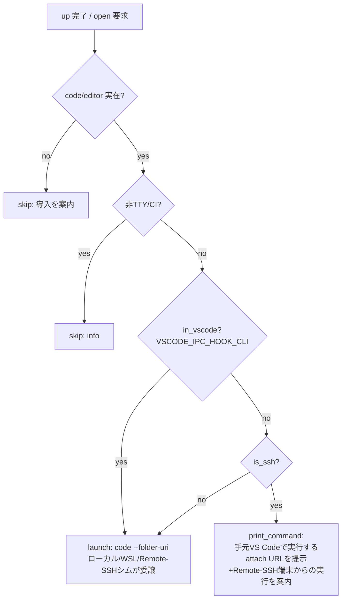

# PLAN31_3: `devbase up` 後に dev コンテナへ接続した VS Code を自動で開く

> 元 issue: `issues/i31.md` 第3項
> ステータス: 計画（2026-06-13 作成 / 未着手）
> 関連: PLAN31_1 (installer)、PLAN31_2 (list TUI 統合)、PLAN06 (`project` 群)
> 関連 skill: `/ndf:issue-plan-strategy`, `/ndf:implementation-plan`, `/ndf:investigation-rules`

## 1. 背景と目的

`devbase up` でコンテナ起動後、ユーザは別途 VS Code を開いて手動で
「Attach to Running Container」する必要がある。これを **`up` 完了時に自動で
dev コンテナへ接続した VS Code を開く**ことで起動〜開発開始の導線を短縮する。

ゴール（issue 文言）:

- コンテナ起動後、devcontainer 機能で dev コンテナに接続した VS Code を開く
- `/work/{repository name}`（= `/work/$GIT_REPO`）をワークスペースとして開く
- **WSL 環境では Windows 側の VS Code を開く**
- **（ユーザ追加要件 2026-06-13）SSH 接続時は SSH クライアント側の VS Code を開く。**
  例: Windows→WSL→SSH で Mac に接続し Mac 側で `devbase` を実行 → Windows の
  VS Code が dev コンテナに繋がって開く（可能な範囲で）。

## 2. 実現可否調査結果（エビデンス）

> `/ndf:investigation-rules`: 「できる/できない」の結論には一次情報の裏取りを必須とする。

### 2.1 一貫機構 — `code` CLI への委譲

VS Code は **統合ターミナル内で `VSCODE_IPC_HOOK_CLI`（unix socket）を自動設定**し、
リモート/ローカルの `code` コマンドはこの socket 経由で**「このフォルダを開け」を
クライアント側 VS Code に IPC で委譲**する。WSL では `code` ラッパが `code.exe`
（Windows 側）を起動する。したがって **`code --folder-uri <uri>` を PATH 上の
`code` で叩く**だけで、実行コンテキストに応じて正しいクライアントへ窓が開く。

### 2.2 コンテナ attach URI

```
vscode-remote://attached-container+<hex>/work/$GIT_REPO
```

`<hex>` は **`{"containerName":"/<実コンテナ名>"}` を UTF-8 hex 化**した文字列。
（単純な名前の hex ではない点に注意。Docker 内部のコンテナ名は先頭 `/` 付き。）

### 2.3 ネスト authority（**実機で動作することを確認・当初想定を訂正**）

> ⚠️ 訂正（2026-06-13 実装時の実機検証）。当初は「合成記法は存在しない
> （microsoft/vscode#242489 *not planned*）」と記載していたが、**誤り**だった。

`attached-container+<hex>@ssh-remote+<host>` という**ネスト authority は実際に
サポートされており動作する**（VS Code 1.124.2 / Dev Containers 0.459.1 で確認）。
正常動作中の窓の resource URI を採取したところ:

```
vscode-remote://attached-container+<hex>@ssh-remote+mac2/work/...
hex = {"containerName":"/<name>","settings":{"context":"desktop-linux"}}
```

`@ssh-remote+<host>` を付けると docker ルックアップが **ssh 先（コンテナのある
ホスト）** で行われるため、跨ホスト（手元 Windows VS Code → ssh → Mac のコンテナ）
でも単発 `code --folder-uri` で直接アタッチできる。`settings.context` は ssh 先で
使う docker context を指定する。

### 2.4 結論（実行コンテキスト別マトリクス）

| コンテキスト | 自動オープン | 機構 / 根拠 |
|---|---|---|
| Mac/Linux ローカル端末 | ✓ | ローカル `code` が attach URI を解決 |
| WSL 端末 | ✓ (Windows VS Code) | `code` ラッパ→`code.exe`、Docker Desktop のコンテナへ attach |
| VS Code **Remote-SSH 統合端末**（リモート=Mac・**同一ホストの Docker**） | ✓ (クライアント側) | `code` シムが委譲。同一ホストの Docker にコンテナがある場合はフラット URI で解決 |
| VS Code **Remote-SSH 統合端末**（**跨ホスト**: ssh 先 Mac の Docker にコンテナ） | ✓ (要 `DEVBASE_EDITOR_SSH_HOST`) | フラット URI だとクライアント(Windows)の Docker を見て失敗。**ネスト URI `@ssh-remote+<host>`（§2.3）で ssh 先の Docker を解決**。ssh ホスト名は env から取得不可のため明示設定が要る |
| plain SSH（WSL→ssh→Mac 等、VS Code 外） | ✗ → コマンド表示 | IPC hook 無し。手元で叩く `code` コマンドを提示するのが上限 |
| CI / 非TTY / `code` 不在 | ✗ → info スキップ | エディタ起動の前提を満たさない |

→ 跨ホスト（手元 Windows VS Code → Remote-SSH→Mac で `devbase up`、コンテナは Mac の
Docker）が最頻ユースケース。**`DEVBASE_EDITOR_SSH_HOST`（例 `mac2`）の設定で自動成立**。
ssh ホスト名（クライアント `~/.ssh/config` の Host 別名）は VS Code が ssh 先端末 env に
渡さない（`SSH_CONNECTION` は IP のみ）ため自動取得できず、明示が必須（実機調査で確認）。
plain ssh はコマンド提示で degrade。

## 3. 既存コード調査結果

| 項目 | 事実 | 出典 |
|---|---|---|
| `up` の最終工程 | `[5/6]` 後に deploy script→「Deploy completed」で終了。**`[6/6]` を追加**して開く | `commands/container.py:407-424` |
| 実コンテナ名 | scale 生成 compose が `container_name = ${COMPOSE_PROJECT_NAME}-{dev}-{index}` を全インスタンスに設定（決定的） | `volume/compose.py:149` |
| ワークスペース | `WORK_DIR=/work/$GIT_REPO`（例 `/work/adminer`） | project `env`, `docs/plugin-dev/quickstart.md:103` |
| dev service 名 | `DEV_SERVICE_NAME` or `dev` | `volume/compose.py:16-18` |
| エディタ既定 | `env edit` は `$EDITOR`(既定 `vi`) を使用 | `commands/env.py:333` |
| TUI 委譲 | ハンドラは `SimpleNamespace` 駆動で TUI から直呼び可能 | PLAN31_2 §2.1 |

実コンテナ名は決定的だが、compose バージョン差異への保険として
**`docker compose ps --format json` で instance 1 の `Name` を取得**し、失敗時は
`{COMPOSE_PROJECT_NAME}-{dev}-1` へフォールバックする。scale>1 では既定で
**instance 1** を開く（`--open-index N` で上書き可）。

## 4. 設計

### 4.1 新規モジュール `lib/devbase/editor/opener.py`

責務を純粋関数に分離してテスト可能にする:

- `detect_context() -> EditorContext` — env から判定:
  `is_tty`(stdout.isatty), `in_vscode`(`VSCODE_IPC_HOOK_CLI`),
  `is_wsl`(`WSL_DISTRO_NAME` or `/proc/version` に `microsoft`),
  `is_ssh`(`SSH_CONNECTION`/`SSH_CLIENT`/`SSH_TTY`), `is_darwin`(`uname`)
- `resolve_editor_cmd() -> list[str] | None` — 既定 `code`。`DEVBASE_EDITOR`
  優先、なければ `code`→（無ければ `$EDITOR`）。`shutil.which` で実在確認
- `build_attach_uri(container_name, workdir) -> str` —
  `{"containerName":"/<name>"}` を hex 化し attach URI を組む
- `resolve_container_name(...) -> str` — `docker compose ps` 優先＋決定的フォールバック
- `decide_action(ctx, editor) -> OpenPlan` — マトリクス(§2.4)を 1 関数に集約。
  返り値は `launch`(直接起動) / `print_command`(コマンド提示) / `skip`(理由付き)
- `open_editor(...)` — `decide_action` に従い `subprocess.Popen`(非ブロッキング) /
  メッセージ出力。例外は warning に握り潰し `up` 本体を絶対に失敗させない



### 4.2 `cmd_up` への統合

`[5/6]` 後、deploy script 実行後に `[6/6] Opening editor...` を追加。
`open_editor(project_name, scale, index=open_index, mode=open_mode)` を呼ぶ。
**戻り値で `up` の rc を変えない**（エディタ起動失敗はデプロイ成功を覆さない）。

### 4.3 設定・CLI・TUI

| 層 | 追加 | 既定 |
|---|---|---|
| env/config | `DEVBASE_OPEN_EDITOR`(真偽), `DEVBASE_EDITOR`(コマンド), `DEVBASE_OPEN_INDEX` | §6 の決定に従う |
| CLI flag | `up` / `project up` に `--open` / `--no-open`, `--open-index N` | env を上書き |
| TUI | project up アクションに「起動後エディタを開く」を反映（PLAN31_2 経路） | env 既定踏襲 |

env 解釈は既存 `_parse_env_assignment`（`container.py:121`）に合わせる。
新キーは `env/keys.py` と `docs/user/environment-variables.md` に追記。

## 5. 決定事項（2026-06-13 ユーザ確認済み）

| # | 論点 | 決定 | 備考 |
|---|---|---|---|
| D1 | 自動オープンの既定 | ✅ **env `DEVBASE_OPEN_EDITOR` で制御（未設定時 OFF）+ `--open`/`--no-open` で都度上書き** | 暴発回避を最優先。プロジェクト env に 1 行書けば常時 ON にできる |
| D2 | 接続方式 | ✅ **Attach to Running Container（§2.2 URI）** | devbase project は devcontainer.json 非依存。現構成にそのまま乗る |
| D3 | エディタ | ✅ 既定 `code`、`DEVBASE_EDITOR` で上書き | `cursor` 等も同 URI スキームで動作 |
| D4 | scale>1 の対象 | ✅ instance 1（`--open-index` で変更） | |
| D5 | PR 構成 | ✅ **単一 PR（案A）** | §6 参照 |

## 6. PR 構成（単一 PR）

差分は cmd_up 統合＋新規 editor モジュール＋CLI/env＋docs＋テストで中規模
（~400 行目安・結合度高）。Step 2 の単一 PR 条件に合致するため release 運用は取らない。

| branch | 概要 |
|---|---|
| `feature/PLAN31_3-up-open-editor` | editor モジュール＋cmd_up `[6/6]`＋CLI/env＋docs＋テスト一括 → main へ |

## 7. テスト計画

- 単体（実 docker/VS Code 不要・env monkeypatch）:
  `detect_context`（WSL/SSH/VSCODE/Darwin の各組合せ）、
  `build_attach_uri`（hex が `{"containerName":"/name"}` と一致）、
  `resolve_editor_cmd`（`DEVBASE_EDITOR`/`code`/不在）、
  `decide_action`（§2.4 マトリクス全分岐＝launch/print/skip）
- `cmd_up` 統合: `open_editor` を mock し **rc が常に 0 のまま**であること、
  `--no-open`/`DEVBASE_OPEN_EDITOR=0` で呼ばれないこと
- 既存 706 passed を維持

## 8. リスク・未確定（実機検証で更新）

- ~~VS Code Remote-SSH 統合端末でのクライアント側 attach は実機検証が必要~~
  → **検証済み（2026-06-13）**。跨ホストではフラット URI だと失敗し、ネスト URI
  `@ssh-remote+<host>` + `settings.context` で成立することを確認（§2.3/§2.4 を訂正）。
- ssh ホスト名（`DEVBASE_EDITOR_SSH_HOST`）は env 自動取得不可のため**ユーザ明示が前提**。
  未設定の跨ホストではフラット URI にフォールバックし、従来同様アタッチ失敗ダイアログが出る
  （実害は無いが体験は劣化）。`$DEVBASE_ROOT/env` への 1 行設定を案内する。
- **plain SSH（VS Code 外）では自動オープン不可**。コマンド提示で degrade（変更なし）。
- 統合ターミナル自動表示は `.vscode/tasks.json`(folderOpen) 配置で実現。VS Code 公式に
  起動時ターミナル設定は無く（`hideOnStartup` は復元セッションの表示制御のみ）folderOpen
  が唯一。自動実行は Workspace Trust と `task.allowAutomaticTasks`（共に user スコープ専用・
  devbase 制御外）に依存し、初回のみ承認クリックが要る。
- `code` ラッパの非ブロッキング起動が `up` プロセス終了をブロックしないこと確認

## 9. 参考（一次情報）

- microsoft/vscode#242489（ネスト authority not planned）
- attach URI / hex payload: cspotcode.com "Attach VSCode to container from CLI"
- `VSCODE_IPC_HOOK_CLI` の委譲挙動: VS Code remote troubleshooting docs
