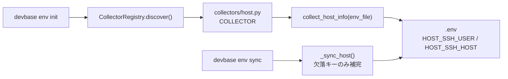

# PLAN48: `devbase env init` で `HOST_SSH_USER` を自動設定する

## 関連リンク

- 元 issue: [#48](https://github.com/devbasex/devbase/issues/48) `feat: devbase env init で HOST_SSH_USER を自動設定する`
- 利用側 (参照のみ・本リポジトリ対象外): ai-plugins `plugins/ndf/skills/playwright-browser-connect/`
  （`scripts/start-host-chrome.sh` がコンテナ→ホスト SSH のために `HOST_SSH_USER` を要求する）

## 概要

`devbase env init` の対話セットアップに **ホスト接続情報 (SSH)** コレクタを追加し、
ホスト (mac/Linux/WSL) のログインユーザー名を `HOST_SSH_USER` として `.env` に自動設定する。
併せて SSH 先ホスト名 `HOST_SSH_HOST`（既定 `host.docker.internal`）も収集する。

これにより、コンテナからホストへ SSH してホスト側 GUI アプリ（例: Chrome をリモート
デバッグモードで起動）を起動するワークフローを、`HOST_SSH_USER=<名>` の手動指定なしで
利用できるようにする。

`devbase env init` は **ホスト上で実行される CLI** であり、ホストのユーザー名を確実に
取得できる立場にある（`getpass.getuser()`）。

## 設計判断（確定事項）

| 論点 | 決定 | 理由 |
|---|---|---|
| 収集キー | `HOST_SSH_USER` + `HOST_SSH_HOST` 両方 | WSL2/Windows ではホストユーザーと SSH 先が一致しないケースがあり、`HOST_SSH_HOST` の上書き余地を残す（issue 補足） |
| `devbase env sync` 対応 | あり（欠落キーの補完） | 既存ユーザーの `.env` への後付け backfill。ただし手動上書きは尊重して上書きしない |
| 進め方 | 単一 PR | 変更 ~4 ファイル・~100 行・依存タスクなし。release ブランチ不要 |

## アーキテクチャ整合

既存のコレクタ機構に倣う:

- `lib/devbase/env/collector.py` の `CollectorRegistry` は `env/collectors/*.py` を走査し、
  モジュール直下の **`COLLECTOR` 定数**（大文字）を登録する。issue 例の `collector =` は
  実装規約と異なるため `COLLECTOR =` で定義する。
- 既存 `git.py` / `slack.py` と同じ `Collector(name, display_name, collect_fn)` インターフェース。
- 対話入力は `devbase.env.store.safe_input`（EOF 安全。非対話/CI では default を返す）を使う。



## 変更ファイル

| ファイル | 種別 | 内容 |
|---|---|---|
| `lib/devbase/env/keys.py` | 変更 | `HOST_SSH_USER` / `HOST_SSH_HOST` 定数を追加 |
| `lib/devbase/env/collectors/host.py` | 新規 | `host` コレクタ（`collect_host_info` + `COLLECTOR`） |
| `lib/devbase/commands/env.py` | 変更 | `cmd_env_sync` に `_sync_host()` を追加 |
| `docs/user/environment-variables.md` | 変更 | `#### host` 節とコレクタ一覧へ追記 |
| `tests/env/test_collector_host.py` | 新規 | コレクタ + sync の単体テスト |

## 実装詳細

### 1. `keys.py`

```python
# --- Host (コンテナ→ホスト SSH 接続) ---
HOST_SSH_USER = "HOST_SSH_USER"
HOST_SSH_HOST = "HOST_SSH_HOST"  # 任意。default: host.docker.internal
```

### 2. `collectors/host.py`（新規）

```python
"""ホスト接続情報 (SSH) コレクター"""

import getpass

from devbase.log import get_logger
from devbase.env import keys
from devbase.env.store import EnvFile, safe_input
from devbase.env.collector import Collector

logger = get_logger(__name__)

DEFAULT_HOST_SSH_HOST = "host.docker.internal"


def _default_host_user() -> str:
    """ホストのログインユーザー名。HOME/USER/LOGNAME 欠落時も例外を出さず "" を返す。"""
    try:
        return getpass.getuser()
    except Exception:
        return ""


def collect_host_info(env_file: EnvFile) -> None:
    """ホスト接続情報 (SSH) を対話的に収集する"""
    print("\n=== ホスト接続情報 (SSH) ===")

    default_user = env_file.get(keys.HOST_SSH_USER) or _default_host_user()
    user = safe_input(f"{keys.HOST_SSH_USER} [{default_user}]: ", default_user)
    if user:
        env_file.set(keys.HOST_SSH_USER, user)
    else:
        logger.info("%s: 既定値が取得できずスキップ", keys.HOST_SSH_USER)

    default_host = env_file.get(keys.HOST_SSH_HOST) or DEFAULT_HOST_SSH_HOST
    host = safe_input(f"{keys.HOST_SSH_HOST} [{default_host}]: ", default_host)
    if host:
        env_file.set(keys.HOST_SSH_HOST, host)


COLLECTOR = Collector(
    name="host",
    display_name="ホスト接続情報 (SSH)",
    collect_fn=collect_host_info,
)
```

非対話 (EOF) 時: `safe_input` が default を返すため `HOST_SSH_USER=getpass.getuser()`・
`HOST_SSH_HOST=host.docker.internal` が設定される（受け入れ条件「非対話/CI でも既定値で設定」）。
`getpass.getuser()` が空を返す環境では `HOST_SSH_USER` は安全にスキップされる。

### 3. `cmd_env_sync` への `_sync_host()` 追加

ホスト情報はソースファイルを持たないため hash 比較は使わず、**欠落キーのみ既定値で補完**する
（既存値＝WSL2 等での手動上書きは尊重して上書きしない）。既存ユーザーの `.env` への後付け
backfill として機能する。

```python
def _sync_host(env_file):
    """ホスト接続情報の同期。欠落キーを既定値で補完する。更新件数を返す。"""
    from devbase.env.collectors.host import _default_host_user, DEFAULT_HOST_SSH_HOST
    updated = 0
    if not env_file.get(keys.HOST_SSH_USER):
        user = _default_host_user()
        if user:
            env_file.set(keys.HOST_SSH_USER, user)
            logger.info("HOST_SSH_USER: %s を設定", user)
            updated += 1
    if not env_file.get(keys.HOST_SSH_HOST):
        env_file.set(keys.HOST_SSH_HOST, DEFAULT_HOST_SSH_HOST)
        logger.info("HOST_SSH_HOST: %s を設定", DEFAULT_HOST_SSH_HOST)
        updated += 1
    return updated
```

`cmd_env_sync` 内で `updated += _sync_host(env_file)` を呼ぶ。`updated > 0` なら既存ロジック
どおり `env_file.save()` まで到達する。

### 4. ドキュメント (`docs/user/environment-variables.md`)

「コレクター一覧」に `host` を追加し、slack 節の後に以下を追記:

```markdown
#### host -- ホスト接続情報 (SSH)

| キー | 説明 |
|------|------|
| `HOST_SSH_USER` | コンテナ→ホスト SSH 時のホストログインユーザー名（既定: `getpass.getuser()`） |
| `HOST_SSH_HOST` | SSH 先ホスト名（既定: `host.docker.internal`、WSL2/Windows では上書き可） |

ユーザー名のみで秘密情報ではない。SSH 鍵・リモートログイン有効化はホスト側で別途設定する前提。
```

## テスト計画 (`tests/env/test_collector_host.py`)

`input` / `getpass.getuser` を monkeypatch した単体テスト（本コレクタは questionary を
使わない素の `input`/`safe_input` 経路のため、real TTY は不要）:

1. **既定値設定**: `getuser`→"alice"、入力 EOF → `HOST_SSH_USER=alice` / `HOST_SSH_HOST=host.docker.internal`
2. **上書き**: 入力で "bob" / "192.168.1.10" → その値で設定される
3. **getuser 例外**: `getuser` が例外 → `HOST_SSH_USER` 未設定・`HOST_SSH_HOST` は既定で設定
4. **既存値優先**: env に既存 `HOST_SSH_USER=carol` → default 提示が carol
5. **`_sync_host` backfill**: 欠落時に補完・既存値は上書きしない・更新件数が正しい
6. **レジストリ登録**: `CollectorRegistry.discover()` 後に name=="host" が含まれる

既存テスト一式が回帰しないこと（`pytest tests/`）も確認する。

## 受け入れ条件（issue より）

- [ ] `devbase env init` 実行時に `HOST_SSH_USER` の既定値（ホストのユーザー名）が提示され、確認・変更できる
- [ ] `.env` に `HOST_SSH_USER` が書き出され、コンテナ内の環境変数として参照できる
- [ ] 非対話/CI でも既定値（`getpass.getuser()`）で設定される、もしくは安全にスキップされる
- [ ] `HOST_SSH_HOST`（既定 `host.docker.internal`）を収集し、上書きできる
- [ ] `devbase env sync` で欠落キーを既定値で補完する（既存値は尊重）
- [ ] ドキュメント（`docs/user/environment-variables.md`）に `HOST_SSH_USER` / `HOST_SSH_HOST` を追記

## PR 計画

| PR | branch | base | 概要 |
|---|---|---|---|
| 単一 | `feature/PLAN48-host-ssh-user` | `main` | 上記 4 ファイル変更 + テスト。`/ndf:cross-review` でセルフレビュー後 merge |

release ブランチは作成しない（単一 PR・低結合）。`/ndf:implementation-plan` 確認 →
実装 → `/ndf:pr` → `/ndf:cross-review` の通常フローで進める。
