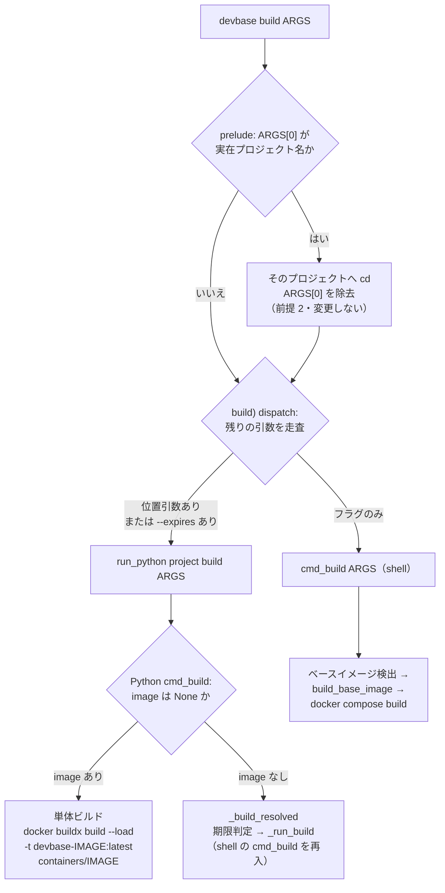

# PLAN49: `devbase build <image>` の単体ビルド

- 対象 issue: [#139](https://github.com/devbasex/devbase/issues/139)
- 関連 issue: [#136](https://github.com/devbasex/devbase/issues/136)（ベースイメージ再ビルドが必要になり本不具合を踏んだ経緯）
- ワークフローモード: `standard`
  - 根拠: ドキュメントに記載のある `devbase build [image]` が動かない不具合の修正で、
    本番の振る舞い（コマンドの実行結果）が変わる。構文・オプションという公開インタフェースの
    約束自体は変えず、実装を約束へ合わせる。データ移行と認可の変更はない。

## 依頼（原文）

> `devbase build <image>` が必ず失敗します。`<image>` の位置引数が剥がされないまま
> `docker buildx build` へ渡り、PATH が 2 つになるためです。
>
> ```
> $ devbase build base --no-cache
> === Building devbase images ===
> Building devbase-base:latest...
> ERROR: docker: 'docker buildx build' requires 1 argument
>
> Usage:  docker buildx build [OPTIONS] PATH | URL | -
>
> ✗ Failed to build devbase-base
> ```
>
> （中略。原文は issue #139 を参照）
>
> ## 対処案
>
> `cmd_build` の引数ループで位置引数（`--` で始まらないもの）を `<image>` として取り出し、
> 指定があれば単体ビルドへ分岐します。
>
> タグの規約は `devbase-<image>` へ揃えるのが自然だと考えます（`check_base_image_dependency` が
> `FROM devbase-` を前提にしており、`containers/base` → `devbase-base` の対応が既にあるため）。
> ただし `containers/` 配下に `devbase-` を前提としないイメージがあるかは確認が要ります。
>
> 到達不能な Python 側の単体ビルド実装は、shell へ寄せるなら削除、Python へ寄せるなら
> ルーティングを変える、のどちらかで重複を解消すべきです。
>
> ## テスト
>
> `bin/devbase` は ShellCheck しか CI が見ていないため、引数解釈の回帰を防ぐテストがありません。
> `tests/` に `devbase build <image>` が組み立てるコマンドを検証するケースを足せると安全です。

## 目的

`docs/user/cli-reference/02-project.md` が正式な構文として載せている
`devbase build [image]` を、記載どおりに動く状態にする。ベースイメージだけを再ビルドする
手段を取り戻し、プロジェクトイメージを巻き込む回避策を不要にする。

## 調査で確定した事実

依頼文が「確認が要る」としていた点を先に潰した。

| 確認事項 | 結果 | 根拠 |
| --- | --- | --- |
| `containers/` 配下のイメージが `devbase-<name>` 規約に従うか | **10 件すべて従う** | `containers/*/compose.yml` の `image:` が `devbase-general` `devbase-bi-tools` `devbase-lfm` `devbase-latex` `devbase-php85` `devbase-php`。compose.yml を持たない `base` `go` `snapshot` `trygroup` も、`bin/devbase` の `build_base_image`（`devbase-base`）、他 Dockerfile の `FROM devbase-base:latest`、`lib/devbase/snapshot/manager.py:34` の `SNAPSHOT_IMAGE = 'devbase-snapshot:latest'` で同規約。例外は無い |
| Python 側 `cmd_build(image=...)` が到達不能か | **到達可能。ただしトップレベル `devbase build` からは不可** | `devbase project build <image>` / `devbase container build <image>` は `lib/devbase/cli.py` の `_add_build_subparser` が `image` positional を持ち、`container.py:460` で `cmd_build(image=...)` へ届く。トップレベル `build` だけが `bin/devbase` の `cmd_build`（shell）へ流れる |
| 2 実装のタグ規約の食い違い | **実在する** | shell: `docker buildx build --load -t "${base_image}:latest"`（`devbase-base:latest`）。Python: `docker build -t <image>`（`base:latest`）。`FROM devbase-base:latest` を解決できないタグを作る |

現状の再現（`docker` / `compose_with_secrets` をスタブ化して `bin/devbase` の dispatch だけを実行）:

```
$ devbase build base --no-cache
DOCKER:buildx build --load -t devbase-base:latest <ROOT>/containers/base base --no-cache
                                                  ^^^^^^^^^^^^^^^^^^^^^^ ^^^^ PATH が 2 つ
COMPOSE:docker compose build dev base --no-cache
                                 ^^^^ compose にもサービス名として漏れる
```

`--no-cache` を付けない `devbase build base` でも、同じ位置引数が compose 側へ漏れる。

## 前提

- 前提 1: `containers/<name>` から作るイメージのタグは `devbase-<name>:latest` に統一する。
  上表のとおり現状 10 件すべてがこの規約であり、規約外のイメージは無い。
  （成否の判定: `containers/*/compose.yml` の `image:` と `Dockerfile` の `FROM` を再走査して
  `devbase-` 以外の参照が出ないこと）
- 前提 2: トップレベル `devbase build <image>` の `<image>` が実在プロジェクト名
  （`$DEVBASE_ROOT/projects/<image>`）と衝突した場合の挙動は、現行の「存在性ベースで
  プロジェクトへ cd」を維持する。`bin/devbase` に意図的な設計として明記されており、
  本修正の対象外とする（[#142](https://github.com/devbasex/devbase/issues/142) として起票）。該当は `bi-tools`（`projects/bi-tools` と `containers/bi-tools` が
  両方実在）。この場合の単体ビルドは `devbase project build bi-tools` が逃げ道になる
  （`project build` の位置引数は name 解決の対象外）。
- 前提 3: `--expires` は単体ビルドでは対象外という現行仕様（`docs/user/cli-reference/02-project.md`
  の注記、Python 側の警告）を変えない。

## 対象範囲

含む:

- `bin/devbase` の `cmd_build` が位置引数 `<image>` を解釈し、単体ビルドへ分岐すること
- 単体ビルドのタグ規約を `devbase-<image>:latest` に統一すること（shell 経路・Python 経路の両方）
- shell と Python に分かれている単体ビルド実装の重複解消
- `bin/devbase` の引数解釈に対する回帰テストの追加
- 上記に伴う `docs/user/cli-reference/02-project.md` の記述の追従

含まない:

- `<image>` と実在プロジェクト名の衝突（前提 2）の解消 → [#142](https://github.com/devbasex/devbase/issues/142)
- `--expires` を単体ビルドへ適用すること（前提 3）
- `containers/` 配下のイメージの追加・削除・Dockerfile の変更
- CI に pytest を追加すること（`tests/` は存在するが `.github/workflows/ci.yml` は
  compileall / ruff / shellcheck のみ）→ [#141](https://github.com/devbasex/devbase/issues/141) として起票

## 用語

| 用語 | 意味 |
| --- | --- |
| 単体ビルド | `$DEVBASE_ROOT/containers/<image>` を直接 `docker build` する経路。compose を経由しない |
| compose ビルド | `image` 省略時の既定経路。ベースイメージ + `docker compose build <dev サービス>` の 2 段 |
| ベースイメージ | `FROM devbase-*` で参照される親イメージ。`check_base_image_dependency` が Dockerfile から検出する |

## 受け入れ条件

- [ ] AC1: `containers/base` が存在する状態で `devbase build base` を実行すると、
      `docker` へ渡る引数列は `buildx build --load -t devbase-base:latest <ROOT>/containers/base` の
      1 回だけになる。PATH に相当する引数は 1 つで、`base` が余分な位置引数として残らない
- [ ] AC2: `devbase build base` は compose ビルド（`docker compose build`）を **実行しない**
- [ ] AC3: `devbase build base --no-cache` は AC1 の引数列の末尾に `--no-cache` だけを足した
      1 回の `docker` 呼び出しになる
- [ ] AC4: `containers/` に存在しない名前（例 `devbase build nosuchimage`。ただし
      `projects/nosuchimage` も存在しないこと）を渡すと、終了コードが非 0 になり、
      標準出力または標準エラーに探したディレクトリのパスが出る。compose ビルドへ
      フォールバックしない
- [ ] AC5: `devbase project build base` と `devbase container build base` が組み立てる
      docker コマンドのイメージタグが `devbase-base:latest` になる（現状の `base:latest` から変わる）
- [ ] AC6: `devbase build`（`image` 省略）の 4 経路が現行どおり動く
  - [ ] AC6-1: フラグなし → ベースイメージの存在確認 + compose ビルド
  - [ ] AC6-2: `--no-cache` → ベースイメージを no-cache でビルド後に compose ビルド
  - [ ] AC6-3: `--project-no-cache` → ベースイメージはキャッシュあり、compose のみ `--no-cache`
  - [ ] AC6-4: `--expires` / `--expires=N` → Python の `project build` へ委譲
- [ ] AC7: `devbase build <image> --expires=7` は期限判定を行わず、`--expires` が無視される旨の
      警告を出したうえで単体ビルドする（前提 3 の現行仕様の維持）
- [ ] AC8: 単体ビルドの `docker` コマンドを組み立てる実装が、リポジトリ内で 1 箇所に集約される
      （shell と Python の双方に別々の `docker build` 呼び出しが残らない）
- [ ] AC9: AC1〜AC7 を固定する自動テストが `tests/` にあり、`bin/devbase` を実際に
      起動して検証する（wrapper の文字列 grep だけで済ませない）
- [ ] AC10: 既存テスト（`tests/` 一式）が退行しない。特に
      `tests/cli/test_build_shortcut_consistency.py` と `tests/cli/test_project_name_resolution.py`
      が通り続ける
- [ ] AC11: `docs/user/cli-reference/02-project.md` の `devbase project build` の節が、
      単体ビルドのタグ規約（`devbase-<image>:latest`）と前提 2 の衝突挙動を記載する

## 非機能の条件

| 種類 | 条件 |
| --- | --- |
| 性能 | 単体ビルドは `docker` を 1 回だけ起動する（現状の compose ビルド巻き込みを無くすことが目的のため） |
| 権限 | 変更なし。`docker` の実行権限のみ |
| 記録 | 単体ビルドの開始時に対象イメージ名とコンテキストディレクトリを出力する |

## 影響

| 対象 | 影響 |
| --- | --- |
| 公開インタフェース | 構文とオプションは変わらない。`devbase build <image>` が失敗から成功に変わる。`devbase project build <image>` / `devbase container build <image>` が作るタグが `<image>:latest` から `devbase-<image>:latest` へ変わる（旧タグは `FROM devbase-*` を解決できず実用されていないため、互換の維持は不要と判断する） |
| データ | スキーマ変更・移行なし |
| 既存の振る舞い | `image` 省略時の 4 経路は変えない（AC6）。変わるのは `image` 指定時のみ |

## 検証手段

| 項目 | 手段 |
| --- | --- |
| 起動 | `bash -n bin/devbase`（構文）／スタブ化した `docker` で `bin/devbase build base --no-cache` を実行し組み立てられる引数列を確認 |
| テスト | `uv run pytest tests/ -q`（全体）、`uv run pytest tests/cli -q`（限定） |
| 静的解析 | `shellcheck --severity=error bin/devbase`、`uv run ruff check --select=E9,F63,F7,F82 lib`、`python -m compileall -q lib bin` |
| 手動確認 | 実 docker での `devbase build base --no-cache` 実行と、`docker image inspect devbase-base:latest` の作成日更新。リリース後テストで行う |

## 前提とする取り決め

| 項目 | 参照先 / 決めたこと |
| --- | --- |
| プロジェクト構造 | shell 入口は `bin/devbase`、Python 実装は `lib/devbase/`、テストは `tests/<領域>/`。仕様と計画は `issues/`、確定仕様は `docs/`。`CONTRIBUTING.md` 参照 |
| コーディング規約 | shell は `shellcheck --severity=error` を通すこと（`.github/workflows/ci.yml`）。Python は `ruff check --select=E9,F63,F7,F82`。既存コードに合わせ、コメントは日本語で意図（なぜ）を書く |
| テスト戦略 | `bin/devbase` の引数解釈は、`tests/cli/test_project_name_resolution.py` と同じく関数をスタブ化して wrapper を実プロセスで起動する結合テストで担保する。Python 側の単体ビルドは `subprocess` を差し替えた単体テストで担保する |

## 境界

| 区分 | 内容 |
| --- | --- |
| 常に行う | 既存テスト一式の実行、ShellCheck / ruff / compileall の実行、変更範囲のコメント整備 |
| 確認してから行う | `bin/devbase` の dispatch 構造の変更、Python 側 `cmd_build` のシグネチャ変更、`docs/` の構文表の書き換え |
| 行わない | 前提 2 の衝突挙動の変更、`--expires` の仕様変更、`containers/` 配下の変更、CI への pytest 追加 |

## 未決

| 項目 | 誰が決めるか | 期限 |
| --- | --- | --- |
| 単体ビルドの実装を shell / Python のどちらへ寄せるか（AC8 の実現方法） | `design` 工程で決定し「決定の記録」に残す | 設計レビューまで |

---

# 設計

要求と受け入れ条件は本ファイルの前半にある。この節は「どう作るか」だけを扱う。

## 構成要素

| 要素 | 責務 |
| --- | --- |
| `bin/devbase` の `build)` dispatch ケース | `_DEVBASE_ARGS` を走査し、位置引数 `<image>` または `--expires` があれば Python へ、無ければ shell の `cmd_build` へ振り分ける |
| `bin/devbase` の `cmd_build` | compose ビルド（`image` 省略時）専用。ベースイメージ依存の検出と 2 段ビルドを引き受ける。位置引数は届かない前提になる |
| `lib/devbase/commands/container.py` の `cmd_build` | `image` 指定時の単体ビルドを引き受ける唯一の実装。`docker` コマンドの組み立てとタグ付けを行う |
| `tests/cli/test_build_image_argument.py`（新規） | wrapper の振り分けと、Python 側が組み立てる `docker` 引数列を固定する |

## 入出力の契約

変えるのはコマンドの約束である。仕様記述の形式は持たないため、ここに直接書く。

### `devbase build [image] [--no-cache | --expires[=DAYS]]`

| 項目 | 内容 |
| --- | --- |
| 名前 | `devbase build` |
| 入力 | 位置引数 `image`（任意、`containers/<image>` のディレクトリ名）。`--no-cache`（真偽）。`--expires[=DAYS]`（任意、整数） |
| 出力（`image` 指定・成功） | `docker buildx build --load -t devbase-<image>:latest $DEVBASE_ROOT/containers/<image>` を 1 回実行し、その終了コードを返す。compose ビルドは行わない |
| 出力（`image` 省略） | 現行どおり。ベースイメージ + `docker compose build <dev サービス>` の 2 段 |
| 失敗の形 | `containers/<image>` が無い → 終了コード 1、`Image directory not found: <パス>`。`containers/<image>/Dockerfile` が無い → 終了コード 1、`Dockerfile not found: <パス>`。`DEVBASE_ROOT` 未設定 → 終了コード 1、`DEVBASE_ROOT not set`。`docker` が失敗 → その終了コードをそのまま返す |
| 互換性 | 構文とオプションは変わらない。`image` 指定は現状 100% 失敗するため、成功へ変わることで壊れる呼び出し側は無い |

### `devbase project build [image]` / `devbase container build [image]`

| 項目 | 内容 |
| --- | --- |
| 入力・出力・失敗の形 | 上記の `devbase build` と同一（同じ Python 実装へ届くため） |
| 互換性 | **作られるイメージタグが `<image>:latest` から `devbase-<image>:latest` へ変わる。** 旧タグは `FROM devbase-*` を解決できず、リポジトリ内のどこからも参照されていないため、移行措置は設けない |

`--expires` を `image` と併用した場合は、`--expires` を無視する警告を出して単体ビルドを行う
（現行仕様の維持、AC7）。

## 処理の流れ



`--expires` 経路（`E` → `G` → `I` → `F`）が shell へ戻るのは現行どおりで、この変更では触らない。
`E` → `G` → `H` が今回追加する経路である。

## 決定の記録

### 決定 1: 単体ビルドの実装は Python 側へ寄せ、shell は振り分けだけを行う

`devbase project build <image>` / `devbase container build <image>` という公開された入口が
すでに Python 側の実装へ届いており、これを残したまま実装を 1 本にするには、shell が Python を
呼ぶ向きしか成り立たない。逆向き（Python が `bash bin/devbase build <image>` を呼ぶ）にすると、
`bin/devbase` の先頭にある「位置引数が実在プロジェクト名なら cd して引数を除去する」処理を
通ってしまい、`devbase project build bi-tools` が `projects/bi-tools` の compose ビルドへ
化ける（`projects/bi-tools` と `containers/bi-tools` は両方実在する）。現在は
`project build` の位置引数がこの処理の対象外であることで守られている挙動を、実装を寄せた
だけで壊すことになる。

shell 側へ寄せて Python の `image` 位置引数ごと削除する案は、公開されているコマンドの
引数を削ることになるため採らない。

### 決定 2: 振り分けは `cmd_build` の中ではなく `build)` dispatch ケースで行う

`--expires` の振り分けが既に同じ場所にあり、「どの引数がどちらの実装へ行くか」を 1 箇所で
読めるようにするため。`cmd_build` の側は compose ビルド専用になり、位置引数を考慮しなくて
よくなる。

`cmd_build` の引数ループで位置引数を取り出して分岐する案（issue の対処案）は、shell と
Python の 2 実装が残ったままになり、タグ規約の食い違いを解消できないため採らない。

### 決定 3: 単体ビルドのタグは `devbase-<image>:latest` とし、`docker buildx build --load` を使う

`containers/` 配下 10 件すべてが `devbase-<name>` 規約で参照されており、規約外のイメージは
無い。`base` を `base:latest` としてビルドしても、他の Dockerfile の `FROM devbase-base:latest`
からは見えず、ビルドした意味が失われる。

タグは `containers/` 配下のディレクトリ名から一意に導く。渡された `image` から `devbase-`
接頭辞を剥がすことはしない。剥がすと `containers/xxx` と `containers/devbase-xxx` が
`devbase-xxx:latest` を取り合い、別ディレクトリなのに互いのイメージを上書きしてしまう。
`devbase build devbase-base` のように接頭辞込みで渡した場合は、存在確認で
`containers/devbase-base` を探して見つからず、探したパスを示して終了コード 1 で終わる。

コマンドを `docker build` から `docker buildx build --load` へ揃えるのは、shell の
`build_base_image` が同じイメージを buildx で作っているためである。ビルダが分かれると、
同じイメージを 2 通りの方法で作ることになり、`--load` を伴わない buildx 既定ビルダでは
生成物がローカルのイメージ一覧へ現れない。

### 決定 4: shell の `build_base_image` は Python へ寄せず、そのまま残す

これは compose ビルドの 1 段目であって単体ビルドではない。Python へ寄せると、shell の
ビルド経路の途中で `uv run` の往復が挟まり、`_run_build`（Python → shell）との間で
呼び出しが 3 往復する。振る舞いは変わらないため、費用に見合わない。

単体ビルド経路（`image` 指定）の `docker` 呼び出しは Python の 1 箇所だけになる。

## テスト設計

| 受け入れ条件 | 何で確かめるか |
| --- | --- |
| AC1 / AC2 / AC3 | `tests/cli/test_build_image_argument.py`: `bin/devbase` を `run_python` / `cmd_build` / `compose_with_secrets` をスタブ化して実プロセス起動し、`build base` / `build base --no-cache` が `PYTHON:project build base ...` を出力し `BUILD:`（shell の compose 経路）を出力しないことを確認 |
| AC1 / AC3（docker 引数列） | 同ファイル: `container.cmd_build(image='base', ...)` を `subprocess.run` を差し替えて呼び、組み立てられる引数列が `['docker','buildx','build','--load','-t','devbase-base:latest',<dir>]`（`--no-cache` 時は末尾に追加）であることを確認 |
| AC4 | 同ファイル: 存在しない `containers/<name>` に対し戻り値が 1 で、ログに探したパスが含まれることを確認。`subprocess.run` が呼ばれないことも併せて確認 |
| AC5 | 同ファイル: `cmd_build(image='base')` のタグが `devbase-base:latest` であること（上と同じ検証で満たす） |
| AC6-1〜AC6-3 | 同ファイル: `build` / `build --no-cache` / `build --project-no-cache` が `BUILD:` 側（shell の `cmd_build`）へ届くことを確認。既存の `tests/cli/test_build_shortcut_consistency.py` も維持 |
| AC6-4 | 既存の `test_wrapper_routes_build_expires_to_python` を維持し、新テストで `build --expires=7` が `PYTHON:project build --expires=7` になることを確認 |
| AC7 | 同ファイル: `cmd_build(image='base', expires=7)` が警告を出し、期限判定（`docker image inspect`）を行わず単体ビルドの引数列を組み立てることを確認 |
| AC8 | `grep` ではなく設計上の保証。単体ビルドの `docker` 呼び出しが Python の 1 関数だけになることを、レビューで確認する |
| AC9 | 上記テストが `bin/devbase` を実プロセスで起動していること |
| AC10 | `uv run pytest tests/ -q` |
| AC11 | `docs/user/cli-reference/02-project.md` の差分をレビューで確認 |

## 未確認のまま残ること

| 項目 | 内容 |
| --- | --- |
| 実 docker での動作 | この工程では `docker` をスタブ化して検証する。実際にイメージが作られ `FROM devbase-base:latest` から解決できることは、リリース後テストで確かめる |
| `containers/go` `containers/trygroup` のタグ | compose.yml を持たず、`devbase-go` / `devbase-trygroup` としてビルドされる前例が無い。規約からは `devbase-<name>` になるが、この 2 件を実際に使う経路は未確認 |

## 受け入れ条件の変更

- ~~AC8: 単体ビルドの docker コマンドを組み立てる実装が、リポジトリ内で 1 箇所に集約される
  （shell と Python の双方に別々の `docker build` 呼び出しが残らない）~~
  → **AC8（改）: `image` 指定の単体ビルド経路で `docker` を起動する実装が 1 箇所（Python の
  `cmd_build`）だけになる。** compose ビルドの 1 段目である shell の `build_base_image` は
  対象外とする（2026-09-02、決定 4 の理由による）
- ~~単体ビルドのタグは、`image` が `devbase-` 始まりで渡された場合も二重に付かないよう
  接頭辞を剥がしてから付け直す~~
  → **タグは `containers/` 配下のディレクトリ名から一意に導き、`devbase-` 接頭辞は
  剥がさずそのまま前置する。** 剥がすと `containers/xxx` と `containers/devbase-xxx` が
  `devbase-xxx:latest` を取り合い、別ディレクトリなのに互いのイメージを上書きしてしまう。
  接頭辞込みで渡された場合は `containers/devbase-<name>` が見つからず、探したパスを示して
  終了コード 1 で終わる（2026-09-02、PR [#144](https://github.com/devbasex/devbase/pull/144)
  のレビュー指摘による）
- **追加: 単体ビルドの `image` は `containers/` 配下の 1 ディレクトリ名として妥当な文字
  （`[A-Za-z0-9][A-Za-z0-9._-]*`）に限り、それ以外は `docker` を起動せず終了コード 1 で
  終わる。** `/` や `\`、`..` を通すと `$DEVBASE_ROOT` の外を指せてしまい、Docker タグとしても
  不正な名前を渡せてしまうため（2026-09-02、PR [#144](https://github.com/devbasex/devbase/pull/144)
  のレビュー指摘による）

---

# 実装計画

## 関連リンク

- issue [#139](https://github.com/devbasex/devbase/issues/139)
- 設計 PR [#143](https://github.com/devbasex/devbase/pull/143)（マージ済み。本ファイルの前半 2 節）
- 範囲外として起票: [#141](https://github.com/devbasex/devbase/issues/141) / [#142](https://github.com/devbasex/devbase/issues/142)

## モード

`standard`。ドキュメント記載の `devbase build [image]` が動かない不具合の修正で、本番の振る舞いが変わる。構文・オプションの約束は変えない。

## 目的と非目的

達成したい状態:

- `devbase build <image>` が `containers/<image>` を単体ビルドし、`devbase-<image>:latest` を作る
- 単体ビルドの `docker` 呼び出しが Python の 1 箇所だけになる
- `bin/devbase` の引数解釈に回帰テストがある

やらないこと:

- `<image>` と実在プロジェクト名の衝突の解消（#142）
- CI へ pytest を追加すること（#141）
- `--expires` を単体ビルドへ適用すること
- `containers/` 配下の変更

## 受け入れ条件

本ファイル前半の AC1〜AC11（AC8 は「受け入れ条件の変更」節の改訂版）をそのまま使う。検証手段は同節の「テスト設計」に対応させる。

## 代替案と採否

設計の「決定の記録」に記載済み。ここでは再掲しない。

## 互換性

| 対象 | 変更 | 互換性の扱い |
| --- | --- | --- |
| `devbase build [image]` | 失敗 → 成功 | 破壊なし。現状 100% 失敗するため依存する呼び出し側が存在しない |
| `devbase project build <image>` / `devbase container build <image>` | タグが `<image>:latest` → `devbase-<image>:latest` | 旧タグはリポジトリ内のどこからも参照されておらず `FROM devbase-*` を解決できないため、移行措置を設けない |
| データスキーマ | なし | — |

## 修正対象

| ファイル | 変更 |
| --- | --- |
| `bin/devbase` | dispatch の `build)` ケース（428-440 行）に位置引数の検出を足す |
| `lib/devbase/commands/container.py` | `cmd_build` の単体ビルド（972-998 行）のタグとビルダを直す。`_dispatch_lifecycle` の docstring（435-437 行）を実態へ合わせる |
| `lib/devbase/cli.py` | `SHORTCUTS` と `_add_shortcut_parsers` のルーティング注記を実態へ合わせる |
| `tests/cli/test_build_image_argument.py` | 新規 |
| `docs/user/cli-reference/02-project.md` | `devbase project build` の節にタグ規約と衝突挙動を追記 |

## タスク分解

### Task 1: 単体ビルドの `docker` コマンドを直す

- **対象ファイル:** `lib/devbase/commands/container.py`、`tests/cli/test_build_image_argument.py`
- **変更内容:** `cmd_build(image=...)` が組み立てるコマンドを `['docker', 'build', '-t', image, str(image_dir)]` から `['docker', 'buildx', 'build', '--load', '-t', f'devbase-{image}:latest', str(image_dir)]` へ変える。`--no-cache` は末尾に付ける。タグは `containers/` 配下のディレクトリ名から一意に導き、`devbase-` 接頭辞は剥がさずそのまま前置する（剥がすと `containers/xxx` と `containers/devbase-xxx` が同じタグを取り合い、別ディレクトリなのに互いのイメージを上書きしてしまうため）。`devbase build devbase-base` のように接頭辞込みで渡した場合は `containers/devbase-base` が見つからず、探したパスを示して終了コード 1 で終わる。
- **満たす受け入れ条件:** AC1（docker 引数列）、AC3、AC4、AC5、AC7
- **進め方:** `subprocess.run` を差し替えて引数列を捕まえる失敗するテストを先に書き、実装で通す。存在しないディレクトリ・`Dockerfile` 不在・`DEVBASE_ROOT` 未設定の 3 つの失敗系も同じ回で固定する。

### Task 2: wrapper が位置引数を Python へ振り分ける

- **対象ファイル:** `bin/devbase`、`tests/cli/test_build_image_argument.py`
- **変更内容:** dispatch の `build)` ケースのループで、`--expires` の検出に加えて `-` で始まらない引数を `_build_image` として拾う。`_has_expires` か `_build_image` のいずれかが立っていれば `run_python project build "${_DEVBASE_ARGS[@]}"`、どちらも無ければ `cmd_build "${_DEVBASE_ARGS[@]}"` を呼ぶ。
- **満たす受け入れ条件:** AC1（振り分け）、AC2、AC6-1〜AC6-4、AC9
- **進め方:** `tests/cli/test_project_name_resolution.py` と同じスタブ方式（`run_python` / `cmd_build` / `compose_with_secrets` を関数で上書きし、`bin/devbase` を実プロセス起動）で失敗するテストを先に書く。`build base` が `PYTHON:` 側へ、`build` / `build --no-cache` / `build --project-no-cache` が `BUILD:` 側へ行くことを固定する。

### Task 3: ルーティングの注記を実態へ合わせる

- **対象ファイル:** `lib/devbase/cli.py`、`lib/devbase/commands/container.py`
- **変更内容:** 「build は shell 実装へ委譲する」旨の注記が 3 箇所（`cli.py` の `SHORTCUTS` 前、`cli.py` の `_add_shortcut_parsers` docstring、`container.py` の `_dispatch_lifecycle` docstring）にある。`image` 指定と `--expires` は Python、それ以外が shell という現在の実態を書く。
- **満たす受け入れ条件:** AC8（実装が 1 箇所であることを読み手が追えるようにする）
- **進め方:** コメントのみ。テスト駆動の対象外。

### Task 4: ドキュメントを追従させる

- **対象ファイル:** `docs/user/cli-reference/02-project.md`
- **変更内容:** `devbase project build` の節に、単体ビルドが作るタグが `devbase-<image>:latest` であること、`<image>` が実在プロジェクト名と一致すると name 解決が優先されること（逃げ道は `devbase project build <image>`、詳細は #142）を書く。
- **満たす受け入れ条件:** AC11
- **進め方:** ドキュメントのみ。テスト駆動の対象外。

## 影響範囲

- `devbase build` の 4 経路（既定 / `--no-cache` / `--project-no-cache` / `--expires`）— 変えない。Task 2 の振り分け条件が誤ると全経路に影響するため、AC6 のテストで固定する
- `devbase rebuild` / `devbase up` — `_run_build` 経由で `bash bin/devbase build [--no-cache|--project-no-cache]` を呼ぶ。いずれもフラグのみで位置引数を持たないため、振り分けの影響を受けない
- `lib/devbase/snapshot/manager.py` — `devbase-snapshot:latest` を独自に build している。今回は触らない

## リスクと対処

| リスク | 対処 |
| --- | --- |
| 振り分け条件の誤りで `devbase build --no-cache` が Python 側へ流れ、2 段ビルドが失われる | AC6 のテストで 4 経路すべての行き先を固定する |
| `_run_build`（Python → shell）と新しい振り分け（shell → Python）で無限再帰する | `_run_build` は位置引数を渡さないため shell 側の `cmd_build` へ入る。AC6-2 / AC6-3 のテストがこれを固定する |
| タグ変更に気付かず `base:latest` を参照している箇所が残る | `grep -rn "base:latest"` 等でリポジトリ全体を走査し、`devbase-` 接頭辞なしの参照が無いことを確認する |

## 切り戻し手順

コード変更のみでデータ移行を伴わない。PR の revert で完全に戻る。イメージのタグが変わるが、旧タグ（`<image>:latest`）は誰も参照していないため後始末は不要。

## 完了の定義

- [ ] AC1〜AC11 をすべて満たし、条件ごとに検証手段と結果が対応している
- [ ] `uv run pytest tests/ -q` が通る
- [ ] `shellcheck --severity=error bin/devbase` が通る
- [ ] `uv run ruff check --select=E9,F63,F7,F82 lib` が通る
- [ ] `python -m compileall -q lib bin` が通る
