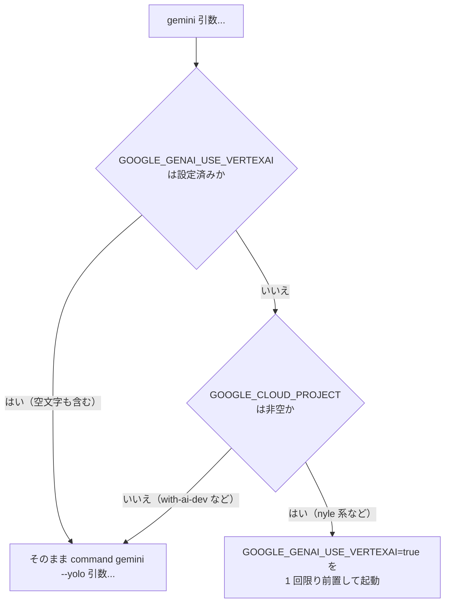

# PLAN50: `gemini` の Vertex AI 強制をやめる

- 発端: with-ai-dev コンテナで gemini の Vertex AI 経由の利用ができなくなった（2026-09-03、利用者からの報告）
- ワークフローモード: `standard`
  - 根拠: 全コンテナの `gemini` コマンドの振る舞いが変わる。公開 API・スキーマ・認可の
    変更は無く、触るのは `containers/base` の 1 領域。

## 依頼（原文）

> with-aiのコンテナで、geminiのvertex ai経由の利用ができなくなっています。設定を復帰させてください

> OAuthで行きます。
> takemi.ohama@gmail.comの現在のプランを調べたい

利用者は Vertex AI ではなく OAuth（個人アカウント）で使う方針を選んだ。この計画が扱うのは、
その方針を邪魔している devbase 側の作りである。

## 目的

`containers/base/Dockerfile` が `.bashrc` へ書き込む alias が、**全コンテナで
`GOOGLE_GENAI_USE_VERTEXAI=true` を無条件に強制している**。Vertex AI を使わない
プロジェクトでも Vertex 経路へ倒れるため、これをやめる。

## 調査で確定した事実

| 確認事項 | 結果 | 根拠 |
| --- | --- | --- |
| `GOOGLE_GENAI_USE_VERTEXAI` の設定箇所 | **alias 1 か所のみ** | `grep -rn GOOGLE_GENAI_USE_VERTEXAI containers/ lib/ bin/` → `containers/base/Dockerfile:207` だけ。どの `projects/*/env` にも無く、`secrets/global.env.age` のキーにも無い |
| Vertex に必要な `GOOGLE_CLOUD_PROJECT` の出所 | `secrets/global.env.age`（値は nyle の GCP プロジェクト） | 機密ストアのキー一覧に `GOOGLE_CLOUD_PROJECT` / `GOOGLE_CLOUD_LOCATION` がある |
| プロジェクトを空にしているもの | `with-ai-dev` と `project-trygroup-prd` の 2 件 | 各 `projects/*/env` の走査 |

つまり alias は「Vertex を使う」と決め打つ一方、Vertex に不可欠なプロジェクトは
グローバルの機密が供給しており、**プロジェクトを空にした環境では前提が崩れる**。

現物での確認（with-ai-dev コンテナ）:

```
$ tail -n 3 ~/.bashrc
alias gemini='GOOGLE_GENAI_USE_VERTEXAI=true gemini --yolo "$@"'
$ echo "$GOOGLE_CLOUD_PROJECT"
nyle-carmo-analysis          # 空にしたはずの値。別の不具合（下記）
$ gcloud auth list
*  ohama.takemi@withjp.inc   # nyle のプロジェクトへの権限は無い
```

### alias の `"$@"` について

`alias x='... "$@"'` の `"$@"` は alias 自身の引数ではなく**シェルの位置パラメータ**に展開される。
対話シェルでは空で、非対話シェルでは alias 展開自体が既定で無効なため、現状は実害が出ていない。
意図した働きをしていないので、この機会に落とす。

## 前提

- 前提 1: Vertex AI は `GOOGLE_CLOUD_PROJECT` が決まっていなければ使えない。したがって
  「`GOOGLE_CLOUD_PROJECT` が空でない」ことを Vertex を使う条件として扱ってよい。
  （成否の判定: Vertex を使うプロジェクトの env に `GOOGLE_CLOUD_PROJECT` が必ずあること）
- 前提 2: `--yolo`（確認プロンプトの省略）は現状どおり付ける。他の AI CLI の alias と揃える方針を変えない。
- 前提 3: 稼働中のコンテナには反映されない。ベースイメージの再ビルドとコンテナ再作成が要る。

## 対象範囲

含む:

- `gemini` の起動時に `GOOGLE_GENAI_USE_VERTEXAI` を無条件に立てるのをやめること
- alias 群を Dockerfile のインライン `echo` から独立したファイルへ出し、テストできるようにすること
- 上記に伴う `docs/` の追従

含まない:

- `GOOGLE_CLOUD_PROJECT` がプロジェクトの `env` の空上書きを無視してコンテナへ漏れる件。
  再現は確認したが、`devbase.env.runtime.resolve()` を現在の環境で実行すると空に解決されるため、
  稼働中のコンテナが古いだけの可能性がある。別途切り分ける
- `~/.gemini/settings.json` の `selectedType` の管理（利用者が選ぶもの）
- 他の AI CLI（claude / claudb / codex / kiro / agy）の起動オプションの変更

## 用語

| 用語 | 意味 |
| --- | --- |
| Vertex 経路 | `GOOGLE_GENAI_USE_VERTEXAI=true` で GCP プロジェクト上の Vertex AI を使う経路 |
| OAuth 経路 | Google アカウントでログインして Code Assist を使う経路（`oauth-personal`） |
| alias 群 | `containers/base/Dockerfile` が `.bashrc` へ書き込む AI CLI の起動定義一式 |

## 受け入れ条件

- [ ] AC1: `GOOGLE_CLOUD_PROJECT` が未設定または空のシェルで `gemini` を起動すると、
      `GOOGLE_GENAI_USE_VERTEXAI` が子プロセスへ渡らない
- [ ] AC2: `GOOGLE_CLOUD_PROJECT` が非空のシェルで `gemini` を起動すると、
      `GOOGLE_GENAI_USE_VERTEXAI=true` が子プロセスへ渡る（現行の nyle 系の振る舞いの維持）
- [ ] AC3: 呼び出し側が `GOOGLE_GENAI_USE_VERTEXAI` を明示的に設定している場合は、値を上書きしない。
      空文字や `false` を設定した場合も、その値のまま渡る
- [ ] AC4: `gemini` へ渡した引数が、そのままの順序で実体へ届く。`--yolo` が必ず付く
- [ ] AC5: `claude` / `claudb` / `codex` / `kiro` / `agy` が起動する実体とオプションが現行と変わらない
- [ ] AC6: `complete -o default claudb kiro` が引き続き有効
- [ ] AC7: 対話シェルで `gemini` が定義されている（`type gemini` が実体のパスではなく定義を返す）
- [ ] AC8: AC1〜AC5 を固定する自動テストが `tests/containers/` にあり、**Docker に依存せず**
      実行できる（既存の `tests/containers/test_entrypoint_*.py` と同じく shell を直接読む方式）
- [ ] AC9: 既存テスト一式（`tests/`）が退行しない
- [ ] AC10: `docs/` に、Vertex 経路と OAuth 経路の切り替わり方が書かれている

## 影響

| 対象 | 影響 |
| --- | --- |
| 公開インタフェース | `gemini` コマンドの起動時の環境が変わる。`GOOGLE_CLOUD_PROJECT` を持つプロジェクト（既定）では現行と同じ |
| データ | なし |
| 既存の振る舞い | `GOOGLE_CLOUD_PROJECT` を空にした 2 プロジェクト（`with-ai-dev` / `project-trygroup-prd`）で Vertex を強制しなくなる。これが修正の目的 |
| 反映の条件 | ベースイメージの再ビルド（`devbase build base --no-cache`）とコンテナの再作成が要る |

## 検証手段

| 項目 | 手段 |
| --- | --- |
| テスト | `uv run pytest tests/containers -q`（限定）、`uv run pytest tests/ -q`（全体） |
| 静的解析 | `shellcheck --severity=error containers/base/ai-cli-aliases.sh`、`python -m compileall -q lib bin` |
| 手動確認 | ベースイメージを再ビルドしたコンテナで `type gemini` と、`GOOGLE_CLOUD_PROJECT` の有無による分岐。リリース後テストで行う |

## 前提とする取り決め

| 項目 | 参照先 / 決めたこと |
| --- | --- |
| プロジェクト構造 | コンテナへ入れる shell 資産は `containers/base/` に置き、Dockerfile が `COPY` する（`tmux.conf` / `tmux-first` / `entrypoint.sh` と同じ）。テストは `tests/containers/` |
| コーディング規約 | shell は `shellcheck --severity=error` を通す。コメントは日本語で意図（なぜ）を書く |
| テスト戦略 | Docker を起動せず、shell ファイルを直接 source して振る舞いを固定する（既存の `tests/containers/` の方式） |

## 境界

| 区分 | 内容 |
| --- | --- |
| 常に行う | 既存テスト一式の実行、ShellCheck、変更範囲のコメント整備 |
| 確認してから行う | 他の AI CLI の alias の変更、`--yolo` の付け外し |
| 行わない | `GOOGLE_CLOUD_PROJECT` 漏れの調査、`settings.json` の管理、ベースイメージの他の変更 |

---

# 設計

## 構成要素

| 要素 | 責務 |
| --- | --- |
| `containers/base/ai-cli-aliases.sh`（新規） | AI CLI の起動定義を持つ唯一の場所。alias 群と `gemini` の関数 |
| `containers/base/Dockerfile` | 上記を `COPY` し、`.bashrc` から読み込ませる。インラインの `echo` 群を落とす |
| `tests/containers/test_ai_cli_aliases.py`（新規） | 起動定義の振る舞いを Docker 抜きで固定する |

## 入出力の契約

### `gemini [引数...]`

| 項目 | 内容 |
| --- | --- |
| 名前 | `gemini`（シェル関数） |
| 入力 | 任意の引数。環境変数 `GOOGLE_CLOUD_PROJECT` と `GOOGLE_GENAI_USE_VERTEXAI` |
| 出力 | `gemini --yolo <引数...>` を実体で起動し、その終了コードを返す |
| 環境の決め方 | `GOOGLE_GENAI_USE_VERTEXAI` が**未設定のときだけ**、`GOOGLE_CLOUD_PROJECT` が非空なら `true` を補う。設定済みならその値を保つ |
| 互換性 | `GOOGLE_CLOUD_PROJECT` を持つ既存のプロジェクトでは現行と同じ |

補い方は呼び出し 1 回限りの前置（`VAR=値 command ...`）で行い、シェルの環境そのものは変えない。
`gemini` を 1 度実行したら以降の別のコマンドまで Vertex 扱いになる、という副作用を作らないため。

## 処理の流れ



## 決定の記録

### 決定 1: Vertex を使うかは `GOOGLE_CLOUD_PROJECT` の有無で決める

Vertex AI はプロジェクトが決まっていなければ呼べない。`GOOGLE_CLOUD_PROJECT` が空という状態は
「Vertex を使えない」と同義であり、推測ではなく前提条件そのものである。プロジェクトを空にした
2 件はいずれも「nyle の GCP を使わない」意思で空にしており、判定と意図が一致する。

新しい専用の変数（`DEVBASE_GEMINI_AUTH` など）を足す案は採らない。設定する場所が 1 つ増え、
`GOOGLE_CLOUD_PROJECT` と食い違ったときにどちらが正かを決める必要が出る。

### 決定 2: alias ではなくシェル関数にする

alias は引数を受け取れない（`"$@"` はシェルの位置パラメータに展開される）ため、条件分岐を
書けない。関数なら引数をそのまま渡せ、`command` で自分自身への再帰も避けられる。

### 決定 3: 起動定義を Dockerfile から独立したファイルへ出す

インラインの `echo ... >> ~/.bashrc` はテストできない。Dockerfile の文字列を `grep` する
テストは、書き方を変えるたびに壊れるうえ、振る舞いを固定しない。`tmux.conf` と同じく
`COPY` する資産にすれば、`tests/containers/` の既存の方式（shell を直接 source する）で
振る舞いそのものを固定できる。

この移動自体は振る舞いを変えない。`gemini` の変更とはコミットを分ける。

### 決定 4: 明示的に設定された `GOOGLE_GENAI_USE_VERTEXAI` は空文字でも尊重する

判定に `[ -n "$GOOGLE_GENAI_USE_VERTEXAI" ]` を使うと、意図して空にした場合に `true` を
補ってしまう。`${VAR+x}` で**設定されているか**を見る。「明示的に無効化した」を表現できる形を残す。

## テスト設計

| 受け入れ条件 | 何で確かめるか |
| --- | --- |
| AC1 / AC2 / AC3 | `tests/containers/test_ai_cli_aliases.py`: PATH の先頭へ `gemini` のスタブ（受け取った環境と引数を出力する実行可能ファイル）を置き、`ai-cli-aliases.sh` を source して `gemini` を呼ぶ。`GOOGLE_CLOUD_PROJECT` と `GOOGLE_GENAI_USE_VERTEXAI` の組み合わせを parametrize で回す |
| AC4 | 同ファイル: スタブが出力した引数列が `--yolo <渡した引数...>` と一致すること |
| AC5 / AC6 | 同ファイル: `shopt -s expand_aliases` して source し、`alias claude` などの定義文字列と `complete -p` を突き合わせる |
| AC7 | 同ファイル: `type -t gemini` が `function` を返すこと |
| AC8 | 上記が Docker を起動しないこと（`bash` の起動のみ） |
| AC9 | `uv run pytest tests/ -q` |
| AC10 | `docs/` の差分をレビューで確認 |

## 未確認のまま残ること

| 項目 | 内容 |
| --- | --- |
| 実コンテナでの動作 | この工程では shell を直接 source して検証する。ベースイメージを再ビルドしたコンテナで `type gemini` と分岐が期待どおりかは、リリース後テストで確かめる |
| `GOOGLE_CLOUD_PROJECT` の漏れ | 対象範囲外。稼働中のコンテナでは `nyle-carmo-analysis` が入っているが、現在の環境で `resolve()` を実行すると空になる。この計画では扱わない |
