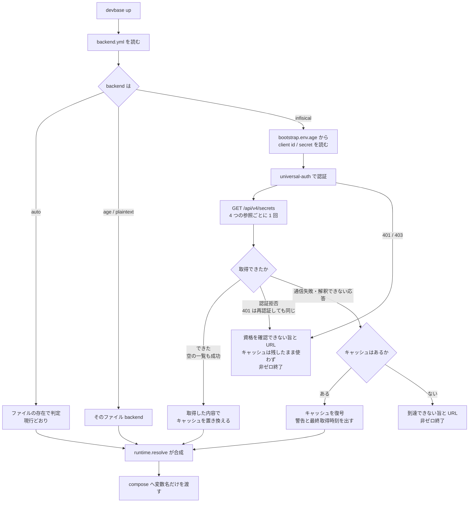
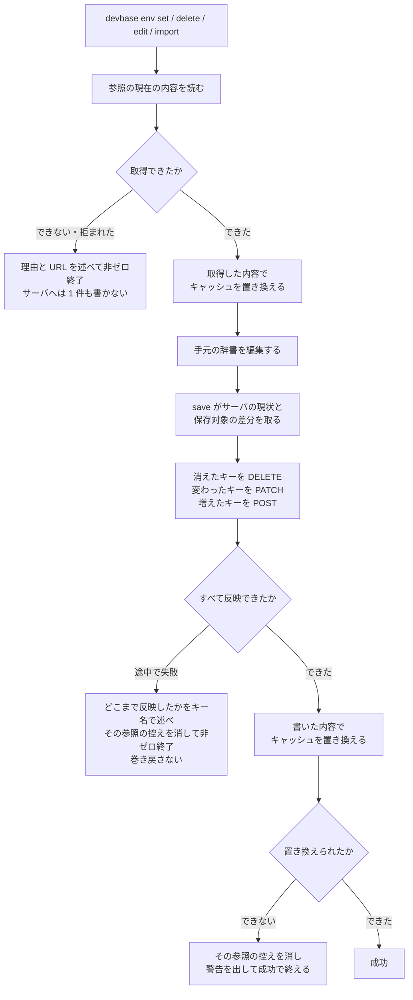

# PLAN51: 機密ストアの保存先を差し替え可能にする — 設計 2 / 入出力の契約と処理の流れ

この文書は、増えるコマンドと既存コマンドの扱い、Infisical との約束、機密が解決されるまでの
順序を扱う。何をどこに置くかは[設計 1](PLAN51_secret-backend-design.md) にある。

| 文書 | 内容 |
| --- | --- |
| [仕様](PLAN51_secret-backend-pluggable.md) | 要求・前提・受け入れ条件 |
| [設計 1: 構成要素とデータ構造](PLAN51_secret-backend-design.md) | 何をどこに置くか |
| [設計 2: 入出力の契約と処理の流れ](PLAN51_secret-backend-contract.md) | どのコマンドが何を返すか、外部との約束、機密が解決されるまでの順序 |
| [設計 3: 決定の記録とテスト設計](PLAN51_secret-backend-decisions.md) | なぜその形にしたか、何で確かめるか |

## 入出力の契約

### 増えるコマンド

| 名前 | 入力 | 出力（成功） | 失敗の形 |
| --- | --- | --- | --- |
| `devbase env backend status` | なし | 現在の backend 名、保存先（パスまたは URL）、**チーム単位と個人単位それぞれの `secretPath` と、個人単位の識別子**、キャッシュの有無と最終取得時刻。終了コード 0 | 設定が壊れているとき、読めなかった箇所を述べて 1 |
| `devbase env backend use <name>` | `<name>`、`--url`、`--project-id`、`--environment`、`--user`、`--client-id`、`--client-secret-stdin`、`--no-cache` | 書き込んだ設定の要約（**client secret は伏せる**）。終了コード 0 | 未知の名前なら利用できる名前の一覧を添えて 2。必須の設定が欠けていれば欠けた項目名を述べて 2。**いずれの場合も設定を書き換えない** |
| `devbase env backend test` | なし | 接続先 URL と、読めた参照の件数。終了コード 0 | 到達できない・認証できない・参照が読めない、のどれかを述べて 1 |
| `devbase env backend migrate --to <name>` | `--to`、`--dry-run`、`--yes` | 移す参照とキー**名**の一覧と、移行元の機密が残る場所（`age` からは退避先のパス、`infisical` からは接続先 URL と `secretPath`）。`--dry-run` では書き込まない | 移行先に同じキーがあれば 1 件も書かずに、衝突したキー名を挙げて 2。読み戻しの検証に失敗したら**この実行で作成したキーだけ**を消し、移行前の設定のまま 1 |

#### 個人単位の参照を指す

参照を選ぶ既存の `-p` / `--project` を受け付けるコマンド（`env list` / `get` / `set` /
`delete` / `edit` / `init` / `project` / `sync`）へ、持ち主を選ぶ `--user` を足す。組み合わせと
宛先は次のとおり。

| 指定 | 宛先の参照 |
| --- | --- |
| どちらも付けない | チーム共通（現行と同じ） |
| `-p <name>` だけ | チームのプロジェクト（現行と同じ） |
| `--user` だけ | 個人共通 |
| `--user -p <name>` | 個人のプロジェクト |

**既定をチーム単位に置く。** 既定を個人単位にすると、backend を設定していない端末で
`devbase env set` の書き先が変わり、既定の挙動を変えないという前提 3 を満たせない。個人単位へ
書くときは `--user` を明示する。

`--user` を付けた実行は、backend が個人単位の参照を持たないとき（`age` / `plaintext` /
`auto`）、その backend が個人単位を持たない旨を述べて非ゼロ終了する。書き先を黙ってチーム単位へ
落とすと、個人の資格情報が全員から見える場所へ入る。

**client secret を引数で受け取らない。** `--client-secret-stdin` で標準入力から読むか、TTY では
`questionary` の伏せ字入力で尋ねる。`ps` から読める位置に置かないためである。

`--dry-run` の出力にキーの**値**を含めない。キー名だけを並べる。

**移行先の既存キーを上書きしない。** 書き込みの前に移行先の同じ参照を読み、同じキーがあれば
1 件も書かずに中止する。`--dry-run` も同じ検査を行い、衝突したキー名を一覧に示す。上書きしたい
場合は、そのキーを移行先で消してから実行する。理由は[決定 7](PLAN51_secret-backend-decisions.md) にある。

**保存対象には、衝突しなかった移行先の既存キーも含める。** `SecretStore.save()` は渡した辞書を
その参照の**全体**として扱い、辞書に無いキーを消す（[決定 10](PLAN51_secret-backend-decisions.md)）。衝突の検査を通ったということは、
移行元のキーと移行先のキーが重なっていないという意味でしかない。移行元のキーだけを渡すと、
衝突しなかった移行先の既存キーが同じ保存で消える。よって、衝突の検査に使った移行先の内容へ
移行元の内容を重ねたものを保存対象にする。衝突を先に拒んでいるため、重ねた結果で値が変わる
キーは無い。

**読み戻しの検証も巻き戻しも同じ範囲で見る。** 読み戻しでは、移行元の全キーと、移行先に元から
あった全キーの両方が期待どおりの値で返ることを確かめる。検証に失敗した実行では、この実行で
作成したキーだけを消し、移行先に元からあったキーは値も含めてそのまま残す。移行の前から
サーバにあった機密には触れない、という性質を保存・読み戻し・巻き戻しの 3 つで揃える。

### 既存コマンドの互換性

| コマンド | 扱い |
| --- | --- |
| `env list` / `get` / `set` / `delete` / `project` / `sync` | 出力形式は変えない。参照を指す `--user` を足す（下記）。既定の宛先と既存の引数の意味は変えない。`SecretStore` 越しに動くため backend を問わない |
| `env edit` | 出力形式は変えない。参照を指す `--user` を足す。**保存先を直接エディタへ渡すのは平文の backend だけ**にし、それ以外は一時ファイル経由で `load_bytes()` / `save_bytes()` を呼ぶ（下記） |
| `env init --reset` | 出力形式は変えない。参照を指す `--user` を足す。退避はファイル backend では現行どおり保存先を複製し、サーバ backend では読み出した値を age 暗号化して控える（下記） |
| `env encrypt` / `decrypt` | **age 固有のまま**。有効な backend が `age` / `auto` 以外のとき、age 専用である旨を述べて非ゼロ終了する |
| `env rekey` | 引数・出力形式は変えない。**backend の選択に関わらず実行でき**、再暗号化の対象へ `bootstrap.env.age` と `cache/` 配下を加える（[決定 8](PLAN51_secret-backend-decisions.md)） |
| `env export` / `import` | バンドル形式を変えない。**扱うのはチーム単位の 2 種の参照だけ**で、書き出しはそこから有効な backend 越しに読み、取り込みも同じ参照へ有効な backend 越しに書く（下記） |
| `devbase up` ほかコンテナ操作 | 変えない。`runtime.resolve()` の入力が変わるだけで、compose へ渡すものは同じ |

`cli.py` の `SUBCMD_MAP` に `backend` を足す。`b` は他と衝突しないが、`SUBCMD_PREFIX_PREFERENCES`
は既存の指定を変えない。

#### バンドルが扱うのはチーム単位の参照だけ

バンドルに入る名前は `env/global.env` / `env/projects/<name>/.env` / `env/sources.yml` の 3 種の
ままで、持ち主を表す表現を足さない。`manifest.yml` の `version` も 1 のままにする。

| バンドル内の名前 | 対応する参照 | 書き出し | 取り込み |
| --- | --- | --- | --- |
| `env/global.env` | チーム共通 | 収録する | チーム共通へ書く |
| `env/projects/<name>/.env` | チームのプロジェクト | 収録する | 同じ名前のチームのプロジェクトへ書く |
| `env/sources.yml` | 機密ではない | 現行どおり | 現行どおり |
| （名前を持たない） | 個人共通 / 個人のプロジェクト | 収録しない | 書かない |

`env export` は持ち主が `user` の参照を読まない。サーバ backend でも取得を送るのはチーム単位の
2 種だけで、個人単位の `secretPath` へは要求が届かない。`env import` は復元先を現行のまま
チーム単位の参照とし（`io_import._secret_ref_for()`）、この表に無い名前は現行どおり拒む
（`_import_merge.filter_members()`）。参照の持ち主を選ぶ `--user` は `export` / `import` へ
足さない。

**名前も版も増えないため、往復はどちらの向きでも成り立つ。** この計画の実装を持たない devbase
が作ったバンドルはそのまま取り込め、この計画の実装が作ったバンドルもその devbase が取り込める。
仕様の「含まない」にある「バンドル形式の変更」は、この形でそのまま成り立つ。理由は
[決定 13](PLAN51_secret-backend-decisions.md) にある。

**個人単位の機密は持ち運ばない。** 置き場はサーバの `/users/<user>/...` にあり、端末を替えても
backend の設定と認証だけで同じ値が読める。ファイル backend は個人単位の参照を持たないため
（[設計 1 のデータ構造](PLAN51_secret-backend-design.md)）、age ストアにある個人向けの値をサーバの個人単位の置き場へ移すときは
`devbase env set --user` で入れ直す。移行コマンドが扱う範囲も同じくチーム単位だけである。

#### `env import` の取り込み先を backend へ向ける

現行の `io_import._build_plans()` は参照ごとに書き込み先の `Path` を決め、`_import_atomic.commit()`
は tmp を `os.replace()` でローカルへ rename する。どちらも backend を通らないため、`backend_for()`
の差し替えだけでは取り込み先がサーバにならない。次の 4 段階を backend 越しの操作へ置き換える。

| 段階 | 現行 | 変更後 |
| --- | --- | --- |
| 計画 | 参照ごとに書き込み先の `Path` を決める | 参照ごとに `(SecretRef, bytes)` を決める。保存先は backend が持つ |
| 退避 | 対象ファイルを `backups/` へ複製する | **ファイル backend では現行のまま複製する。** サーバ backend では取り込み前の値を backend から読み、`backups/` へ age 暗号化して控える |
| 適用 | tmp を `os.replace()` で一括 rename | 参照ごとに `store.save_bytes()` を呼ぶ |
| 巻き戻し | 退避したファイルを書き戻す | 控えた値を書き戻し（ファイル backend は複製したファイル、サーバ backend は復号した値を `store.save_bytes()` で）、取り込み前に無かった参照は消す |

**退避の暗号化はサーバ backend に限る。** ファイル backend（`auto` / `age` / `plaintext`）では、
控えの元になるファイルが同じ形で手元にあるため、複製しても平文の機密は増えない。ここを
暗号化すると、受信者鍵を設定していない利用者の `import` が鍵の要求で失敗し、前提 3 の
「既定の挙動は変えない」に反する。サーバ backend では控えの元が手元に無く、退避が新しい
平文ファイルを作ることになるため暗号化する。この場合に受信者鍵が無ければ、取り込みを 1 件も
始めずに鍵の用意を促して非ゼロ終了する（ブートストラップと同じ扱い）。

ファイル backend では `save_bytes()` の内側で既存の `write_secure_bytes_atomic` が働くため、
1 つの参照の書き込みが途中の状態で残ることはない。参照をまたぐ一括 rename が持っていた同時性は
サーバ backend では作れないので、失敗した参照までを順に巻き戻す形にする。

`export` 側は `store.load_bytes()` を通るため、収録の判定を直せば backend を問わず動く（[決定 4](PLAN51_secret-backend-decisions.md)）。

#### `path()` をファイルとして扱う経路を backend の性質で分ける

`path()` はファイル backend では開いて読み書きしてよいファイルを指すが、サーバ backend では
`secretPath` を `Path` にしただけの**表示と由来の記録のための値**であり、ローカルには存在しない。
`path()` の戻り値を実ファイルとして扱っている経路が 2 つあり、どちらも `backend_for()` の
差し替えだけでは通らない。

| 経路 | 現行 | 変更後 |
| --- | --- | --- |
| `cmd_env_edit()`（`commands/env.py:459`） | `is_encrypted()` が偽なら `path()` をエディタへ渡す | `direct_edit` が偽なら一時ファイル経由で編集する |
| `SecretEnvFile.backup()`（`env init --reset` が呼ぶ） | `path()` を `shutil.copy2` で `<path>.backup` へ複製する | ファイル backend は現行のまま。サーバ backend は `load_bytes()` を age 暗号化して `backups/env-init/<日時>/` へ控える |

**分岐の基準を「暗号化されているか」から「保存先をファイルとして直接編集できるか」へ変える。**
`SecretBackend` に真偽値 `direct_edit` を足し、`PlaintextBackend` だけ真、`AgeBackend` と
`InfisicalBackend` は偽とする。`SecretStore.direct_edit(ref)` は選択中の backend の値を返す。
現行の `is_encrypted()`（＝`mode() == 'age'`）は `mode` が `infisical` のときも偽になるため、
そのままでは `/global` のようなローカルパスをエディタで開くだけになり、サーバの機密を編集も
保存もできない。

`cmd_env_edit()` は `direct_edit` が偽のとき既存の `_edit_encrypted()` を通す。この関数は
`load_bytes()` → 一時ファイル（自分専用の `0700` ディレクトリに `0600`）→ `save_bytes()` しか
使っておらず age 固有の処理を持たないため、実装を変えずにサーバ backend でもそのまま働く。
age を指す名前だけ `_edit_via_tempfile()` へ改める。

`backup()` は現行、複製に失敗しても警告を出して `None` を返すだけで、呼び出し側の
`cmd_env_init()` はそのまま全キーの削除へ進む。サーバ backend では退避を作れないまま消すことに
なるため、**退避を作れなかったときは削除へ進まず非ゼロで返す**。サーバ backend の退避を age で
暗号化する理由と、受信者鍵が無ければ 1 件も消さずに終了する扱いは、`import` の退避（前節）と
同じである。

一覧の保存形式表示（`_mode_suffix()`、`commands/env.py:372`）も `is_encrypted()` を見ており、
`infisical` では何も付かない。`mode()` を使い、`age` は現行どおり `[暗号化]`、`plaintext` は
何も付けず、それ以外は `[<backend 名>]` を付ける。

### Infisical との契約（外部）

devbase 側では OpenAPI 記述を持たず、Infisical が公開しているものを正とする。使う経路は次の 5 つ。

| 用途 | 経路 | 送るもの |
| --- | --- | --- |
| 認証 | `POST /api/v1/auth/universal-auth/login` | `clientId`, `clientSecret` → `accessToken`, `expiresIn` |
| 一括取得 | `GET /api/v4/secrets` | `projectId`, `environment`, `secretPath`, `includePersonalOverrides`, `expandSecretReferences` → `{secrets: [{secretKey, secretValue}]}` |
| 作成 | `POST /api/v4/secrets/{secretName}` | `projectId`, `environment`, `secretValue`, `secretPath` |
| 更新 | `PATCH /api/v4/secrets/{secretName}` | 同上 |
| 削除 | `DELETE /api/v4/secrets/{secretName}` | `projectId`, `environment`, `secretPath` |

認証以外はすべて `Authorization: Bearer <accessToken>` を付ける。access token は
プロセス内にだけ持ち、ディスクへ書かない。`expiresIn` を過ぎたら取り直す。**取得が 401 を
返したときも 1 度だけ取り直して同じ取得をやり直し、それでも 401 / 403 なら資格の取り消しとして
扱う**（[設計 1 のキャッシュの節](PLAN51_secret-backend-design.md)）。

**一括取得に `expandSecretReferences=false` を必ず載せる。** [Infisical の list secrets](https://infisical.com/docs/api-reference/endpoints/secrets/list)
はこの既定が `true` で、値に含まれる `${OTHER_KEY}` をサーバ側で展開して返す。既存の `EnvFile` は
同じ記法を文字列のまま保持するため、既定のままでは `set` した値と `get` で返る値が変わり、
`migrate` の読み戻し検証も一致しない。差分適用（後述）が値の比較で判断するため、展開された値を
受け取ると変わっていないキーまで `PATCH` の対象になる。

**`includePersonalOverrides=false` を常に送る。** 持ち主の軸は `secretPath` で表すため
（[設計 1 のデータ構造](PLAN51_secret-backend-design.md)）、personal override は読まない。設定でこれを変える手段は置かない（[決定 6](PLAN51_secret-backend-decisions.md)）。
WebUI から personal override を付けた場合、devbase の取得はそれを見ずに全員が見る値を返す。

**参照ごとに 1 回、`GET /api/v4/secrets` を呼ぶ。** `devbase up` がプロジェクトを指定して読む
参照はチーム共通・個人共通・チームのプロジェクト・個人のプロジェクトの 4 つなので、認証 1 回 +
取得 4 回の計 5 往復に収まる。プロジェクトを指定しない実行は共通の 2 参照だけで 3 往復になる。
`recursive` は使わない（プロジェクトを 1 つ読むだけの場面で全プロジェクトの機密を受け取らない
ため）。個人単位のパスは利用者ごとに分かれているので、`recursive` で親から辿ると他人のパスまで
要求することになる。

**`save` / `save_bytes` は差分を取ってから送る。** `SecretBackend` にはキー単位の削除も更新も
無く、`SecretStore.save(ref, data)` は参照の内容**全体**を辞書で受け取る。ファイル backend は
これを 1 つのファイルの原子的な置き換えとして満たすが、Infisical はキー単位の 3 経路しか
持たないため、同じ意味をサーバ側で組み立てる必要がある。手順は次のとおり。

1. 対象の参照を `GET /api/v4/secrets` で読み、サーバの現在のキーと値を得る
2. サーバにあり保存対象に無いキーを `DELETE` する
3. 両方にあり値が違うキーを `PATCH` する
4. サーバに無く保存対象にあるキーを `POST` する
5. 値が同じキーは送らない

差分を取らずに保存対象のキーだけを `POST` すると、`env delete` と `env edit` の行削除、
`env import --replace` で消えたキーがサーバに残り続け、削除がまったく効かない。既にあるキーへ
`POST` すると 409 で拒まれるため、`POST` と `PATCH` の使い分けにも現在のサーバ状態が要る。
手順 1 の取得は書き込みの直前に行い、`up` の取得を使い回さない。

**1 つの参照の書き込みは原子的にならない。** 途中で失敗すれば、一部のキーだけが新しい状態の
参照が残る。この場合は残りを送らずに止め、**どこまで反映したかをキー名で述べて**非ゼロ終了し、
その参照の控えを消す（[設計 1 のキャッシュの節](PLAN51_secret-backend-design.md)）。サーバの状態が保存対象とも手順 1 の取得結果とも一致
しなくなり、手元に「サーバの写し」と言える世代が無くなるためである。

巻き戻しは行わない。巻き戻しも同じ経路を使う書き込みであり、そこで失敗すると「戻したつもりが
戻っていない」状態を 1 段深いところへ作る。複数人での同時編集の競合解決を扱わないこと（対象
範囲）と同じで、最終的な状態は WebUI で確かめられる形にとどめる。

`save_bytes` は受け取ったバイト列を `EnvFile.parse_bytes()` で辞書にしてから同じ差分適用へ
通す。Infisical にはコメント・空行・`export` 表記の置き場が無いため、サーバ backend では
`load_bytes()` が返すのが `KEY=VALUE` の並びになり、`env edit` で書いたコメントは次の編集で
消える。ファイル backend との違いなので、利用者向けドキュメントに書く。

**検査の手段:** `http.server` で立てた偽サーバに対する結合テスト。ループバック宛ての `http` を
許すのはこのためである（[設計 1 の設定ファイルの節](PLAN51_secret-backend-design.md)）。実サーバに対する確認は `carmo-cdk#312` の完了後に
手動で行う。

## 処理の流れ

### 読み: `devbase up` が機密を解決するまで

### 重ね順: 4 つの参照をどの順に重ねるか

`runtime.resolve()`（`lib/devbase/env/runtime.py`）は現在、共通の機密 → プロジェクトの非機密
設定（`projects/<name>/env`） → プロジェクトの機密 の順に重ねる。持ち主の軸が入ると、機密の層が
2 つから 4 つになる。

| 重ねる順 | 層 | 同じキーがあるときの扱い |
| --- | --- | --- |
| 1 | チーム共通の機密 | 以降の層に譲る |
| 2 | 個人共通の機密 | チーム共通に勝つ |
| 3 | プロジェクトの非機密設定 | 共通の 2 層に勝つ |
| 4 | プロジェクトのチーム機密 | 非機密設定に勝つ |
| 5 | プロジェクトの個人機密 | 同じプロジェクトのチーム機密に勝つ |

規則は 2 つである。**適用範囲が狭いものが勝つ**（プロジェクトのものが共通のものに勝つ）、
**同じ適用範囲では個人単位がチーム単位に勝つ**。前者は現行の重ね順そのままで、後者を内側へ
足した形になる。プロジェクトの非機密設定を共通の 2 層とプロジェクトの 2 層の間へ置くのは、
現行が共通機密とプロジェクト機密の間へ置いているのと同じ位置を保つためである。同じキー名が
複数の層にあるとき、どの層の値がコンテナへ載るかはこの順で一意に決まる。理由は[決定 12](PLAN51_secret-backend-decisions.md) にある。

コンテナへ列挙する変数名は、4 層の機密のキーをこの順で並べ、重複は先に現れた位置で 1 件に畳む。
非機密設定は現行どおり列挙しない。

### 書き: `devbase env set` / `delete` がサーバと控えを揃えるまで

不達のときに書き込みだけを控えへ溜める経路は作らない。控えはサーバの写しであって、まだ
サーバに無い変更の置き場ではない（[決定 5](PLAN51_secret-backend-decisions.md)）。溜めた変更を後で送る仕組みを持つと、送る前に
別の端末が同じキーを変えていた場合に、どちらを残すかを devbase が決めることになる。
