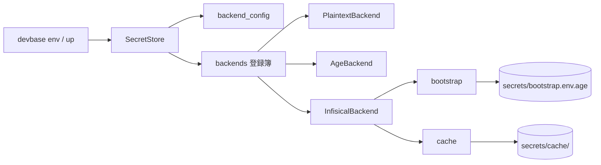
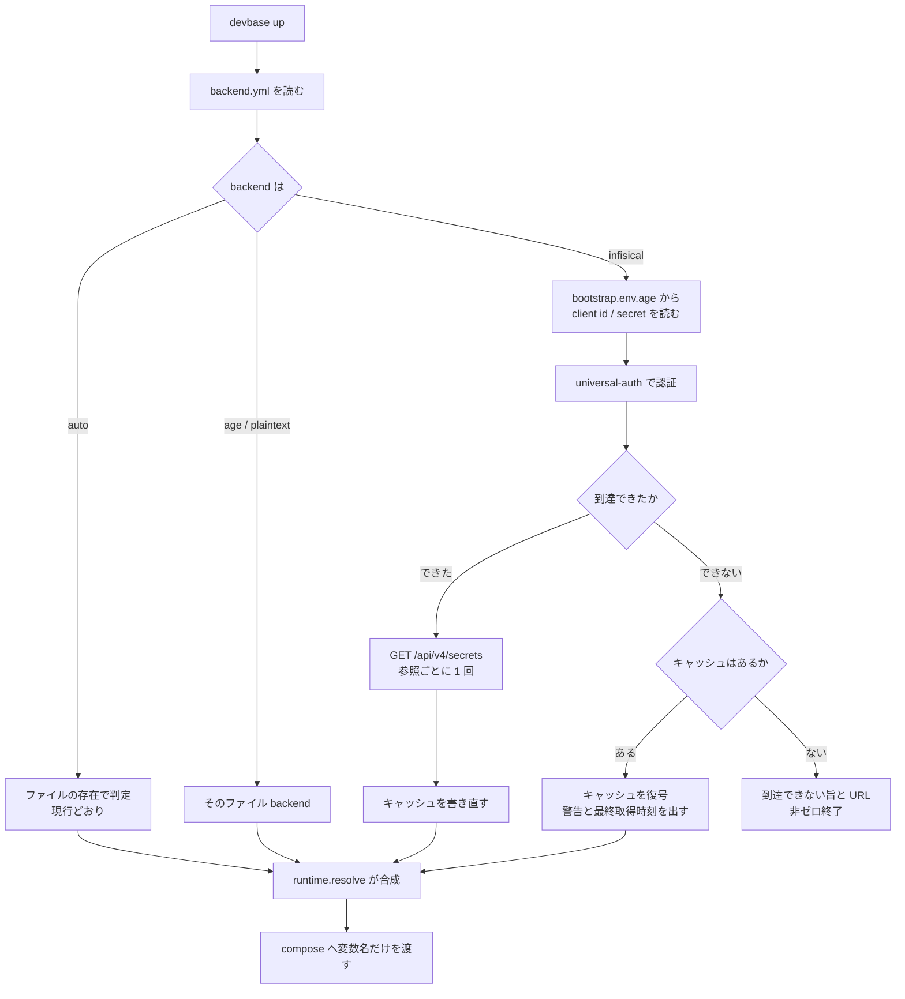

# PLAN51: 機密ストアの保存先を差し替え可能にする — 設計

要求と受け入れ条件は [PLAN51_secret-backend-pluggable.md](PLAN51_secret-backend-pluggable.md) にある。
この文書は「どう作るか」だけを扱う。

## 構成要素

| 要素 | 責務 |
| --- | --- |
| `env/backend_config.py`（新規） | どの backend を使うかと、その非機密設定を `secrets/backend.yml` から読み書きする |
| `env/backends.py`（新規） | backend 名から実装を作る登録簿。未知の名前を、利用できる名前の一覧を添えて拒む |
| `env/infisical.py`（新規） | Infisical の REST を叩く `SecretBackend` 実装 |
| `env/bootstrap.py`（新規） | サーバ接続に使う機密を `secrets/bootstrap.env.age` から読む。**登録簿を経由しない** |
| `env/cache.py`（新規） | 取得できた機密を age で暗号化して控え、不達時に読み出す |
| `env/secret_store.py`（改修） | `backend_for()` が設定を見るようにする。設定が無ければ現行の自動判定のまま |
| `commands/env_backend.py`（新規） | `devbase env backend` の 4 サブコマンド |
| `commands/env_ops.py`（改修） | `doctor` に backend 設定・ブートストラップ・キャッシュの点検を足す |
| `cli.py`（改修） | サブコマンドの登録と、prefix 解決の優先指定 |

`PlaintextBackend` と `AgeBackend` は `secret_store.py` に置いたままにする。登録簿はそれらを
参照するだけで、移動しない。

**登録簿は `backend_for()` の中から遅延 import する。** `env/backends.py` は
`secret_store.py` の `SecretBackend` を参照し、`secret_store.py` は登録簿を参照するため、
モジュール先頭で import すると循環する。関数内 import は既存コードでも使っている書き方である
（`commands/env.py:46` ほか）。



## データ構造

### 1. backend の選択と非機密設定 — `$DEVBASE_ROOT/secrets/backend.yml`

```yaml
version: 1
backend: infisical
infisical:
  url: https://infisical.example.com
  project_id: 7f0e2c1a-....
  environment: shared
  path_global: /global
  path_project_prefix: /projects
  api_version: v4
  timeout_seconds: 5
  include_personal_overrides: false
cache:
  enabled: true
```

| キー | 意味 | 空・不在のとき |
| --- | --- | --- |
| `version` | この形式の版。将来の変更を検出するためだけに持つ | 不在なら `1` として読む |
| `backend` | 使う backend 名。`auto` / `plaintext` / `age` / `infisical` | **`auto`**（＝現行のファイル存在による判定） |
| `infisical.url` | 接続先。**スキームは `https` に限る**（`http` は明示的に拒む） | `backend: infisical` のとき必須。不在は設定エラー |
| `infisical.project_id` | Infisical の project の識別子 | 同上 |
| `infisical.environment` | environment の slug | 不在なら `shared` |
| `infisical.path_global` | 共通機密を置く `secretPath` | 不在なら `/global` |
| `infisical.path_project_prefix` | プロジェクト機密の親 `secretPath` | 不在なら `/projects` |
| `infisical.api_version` | 叩く API の版。`v4` / `v3` | 不在なら `v4` |
| `infisical.timeout_seconds` | 1 回の HTTP の待ち時間 | 不在なら `5` |
| `infisical.include_personal_overrides` | 読み取りに personal override を含めるか | 不在なら `false`（決定 6） |
| `cache.enabled` | キャッシュを書く・読むか | 不在なら `true` |

- **このファイルに機密は入らない。** 値が入るのはブートストラップ（次項）だけである
- 権限は `0600`。`secrets/` は既に `.gitignore` に載っているため、追加の除外設定は要らない
- 空の値は「未設定」であって「該当なし」ではない。上表の既定へ落ちる

### 2. ブートストラップ機密 — `$DEVBASE_ROOT/secrets/bootstrap.env.age`

`KEY=VALUE` 形式を age で暗号化したもの。既存の `AgeBackend` と同じ暗号化・同じ権限。

| キー | 意味 |
| --- | --- |
| `DEVBASE_INFISICAL_CLIENT_ID` | machine identity の client ID |
| `DEVBASE_INFISICAL_CLIENT_SECRET` | 同 client secret |

**このファイルだけは登録簿を経由せず、直接 `AgeBackend` で読む。** 有効な backend を通して
読もうとすると、「接続するための値を、接続しないと読めない」循環になる。

**平文へは落とさない。** age の識別鍵が無い端末では、鍵の置き場と用意の手順を述べて、
`backend use infisical` と機密の読み込みの両方を非ゼロで終了させる。接続資格情報を age ストアに
置くことは要求の側で決まっており、鍵が無いことを理由に平文の置き場を作ると満たせなくなる。
既存の自動判定はファイルの存在で backend を選ぶだけで、鍵の有無で平文へ移す規則は持たない。
`bootstrap.env.age` があって鍵が無い状態は、復号できない状態としてそのまま失敗させる。

### 3. キャッシュ — `$DEVBASE_ROOT/secrets/cache/`

| パス | 中身 |
| --- | --- |
| `cache/global.env.age` | 共通機密の控えと、その取得元を表す `scope`（age 暗号化） |
| `cache/projects/<name>.env.age` | プロジェクト機密の控えと `scope` |
| `cache/index.json` | 参照ごとの `fetched_at` / `backend` / `url_host`。`status` の表示だけに使う |

**1 つの参照のキャッシュは 1 ファイルに収める。** 控えた機密と `scope` を同じ age 暗号文の
中へ入れ、`write_secure_bytes_atomic` で 1 回の置き換えとして書く。復号すると両方が必ず同じ
取得の結果として一緒に出るため、機密と `scope` が食い違った組み合わせは作れない。暗号文を
復号した中身は次の形にする。

```json
{
  "version": 1,
  "scope": "sha256:9f2c1e...",
  "backend": "infisical",
  "fetched_at": "2026-09-08T10:00:00+09:00",
  "secrets": "KEY=value\n..."
}
```

`index.json` は `status` が最終取得時刻と接続先を表示するためだけに置く。**キャッシュを使える
かの判定には使わない。** キー名も値も入れない。何が保存されているかは暗号文の側にしか無い
状態を保つ。欠けていても壊れていてもキャッシュの可否は変わらない。

```json
{
  "version": 1,
  "entries": {
    "global": {"fetched_at": "2026-09-08T10:00:00+09:00", "backend": "infisical", "url_host": "infisical.example.com"},
    "project:carmo": {"fetched_at": "2026-09-08T10:00:00+09:00", "backend": "infisical", "url_host": "infisical.example.com"}
  }
}
```

**キャッシュを使える条件:** `scope` は接続先 URL 全体・`project_id`・`environment`・その参照の
`secretPath`・認証主体（client ID）を連結して SHA-256 を取ったものである。読み出すときは現在の
設定から同じ手順で計算し、**復号して得た** `backend` と `scope` の両方が一致する参照だけを
キャッシュとして使う。一致しない参照はキャッシュが無いものとして扱い、不達なら接続先を示して
非ゼロ終了する。

指紋を持たず参照名と `url_host` だけで一致を見ると、同じホスト上の別の project や environment
へ切り替えた直後に不達だった場合、切り替える前の機密を新しい環境のコンテナへ渡すことになる。
連結した値をそのまま置かず SHA-256 にするのは、project の識別子と client ID を平文で残さない
ためである。

暗号文と `scope` を別のファイルへ分けると、どちらも原子的に置き換えても組み合わせが崩れる。
scope A と scope B を使う 2 つの `devbase up` が「B の暗号文 → A の暗号文 → A の `scope` →
B の `scope`」の順に書けば、B の `scope` に A の機密が結び付いた状態が残り、別の environment の
機密を渡してしまう。更新の途中でプロセスが止まった場合も同じ形が残る。1 ファイルに収めれば、
残るのはどちらか一方の完全な世代だけになる。

**時系列の扱い: 上書きし、過去を残さない。** 理由は決定 5 にある。

**移行:** 既存データの変換は無い。`devbase env backend migrate` が明示的に呼ばれたときだけ、
age ストアの内容をサーバへ写す。写した後の age 側は `backups/env-backend-migrate/<日時>/` へ
退避し、自動削除しない（既存の `env encrypt` と同じ性質）。

**検査の手段:** `devbase env doctor` に次を足す。

- `secrets/backend.yml` が YAML として読め、`backend` が登録簿にある名前であること
- `backend.yml` / `bootstrap.env.age` / `cache/` 配下の権限が `0600`、ディレクトリが `0700` であること
- `backend: infisical` なのにブートストラップの 2 キーが揃っていない状態を指摘すること
- 上記 3 つのパスが `git check-ignore` で除外されること（既存の `_ignore_probe_paths` へ追加する）

### 4. Infisical 上での配置

| devbase の参照 | Infisical 側の位置 |
| --- | --- |
| 共通（`global`） | `projectId=<設定値>`, `environment=<設定値>`, `secretPath=<path_global>` |
| プロジェクト（`project:<name>`） | 同上、`secretPath=<path_project_prefix>/<name>` |

`<name>` は既存の `_validate_project_name()` を通したものだけを使う。パス区切りと `..` は
そこで拒まれるため、組み立てた `secretPath` が設定した親の外へ出ることはない。

## 入出力の契約

### 増えるコマンド

| 名前 | 入力 | 出力（成功） | 失敗の形 |
| --- | --- | --- | --- |
| `devbase env backend status` | なし | 現在の backend 名、保存先（パスまたは URL）、キャッシュの有無と最終取得時刻。終了コード 0 | 設定が壊れているとき、読めなかった箇所を述べて 1 |
| `devbase env backend use <name>` | `<name>`、`--url`、`--project-id`、`--environment`、`--client-id`、`--client-secret-stdin`、`--no-cache` | 書き込んだ設定の要約（**client secret は伏せる**）。終了コード 0 | 未知の名前なら利用できる名前の一覧を添えて 2。必須の設定が欠けていれば欠けた項目名を述べて 2。**いずれの場合も設定を書き換えない** |
| `devbase env backend test` | なし | 接続先 URL と、読めた参照の件数。終了コード 0 | 到達できない・認証できない・参照が読めない、のどれかを述べて 1 |
| `devbase env backend migrate --to <name>` | `--to`、`--dry-run`、`--yes` | 移す参照とキー**名**の一覧。`--dry-run` では書き込まない | 移行先に同じキーがあれば 1 件も書かずに、衝突したキー名を挙げて 2。読み戻しの検証に失敗したら**この実行で作成したキーだけ**を消し、移行前の設定のまま 1 |

**client secret を引数で受け取らない。** `--client-secret-stdin` で標準入力から読むか、TTY では
`questionary` の伏せ字入力で尋ねる。`ps` から読める位置に置かないためである。

`--dry-run` の出力にキーの**値**を含めない。キー名だけを並べる。

**移行先の既存キーを上書きしない。** 書き込みの前に移行先の同じ参照を読み、同じキーがあれば
1 件も書かずに中止する。`--dry-run` も同じ検査を行い、衝突したキー名を一覧に示す。上書きしたい
場合は、そのキーを移行先で消してから実行する。理由は決定 7 にある。

### 既存コマンドの互換性

| コマンド | 扱い |
| --- | --- |
| `env list` / `get` / `set` / `delete` / `edit` / `project` / `sync` | 引数・出力形式ともに変えない。`SecretStore` 越しに動くため backend を問わない |
| `env encrypt` / `decrypt` / `rekey` | **age 固有のまま**。有効な backend が `age` / `auto` 以外のとき、age 専用である旨を述べて非ゼロ終了する |
| `env export` / `import` | バンドル形式を変えない。書き出しは有効な backend から読み、取り込みは有効な backend へ書く |
| `devbase up` ほかコンテナ操作 | 変えない。`runtime.resolve()` の入力が変わるだけで、compose へ渡すものは同じ |

`cli.py` の `SUBCMD_MAP` に `backend` を足す。`b` は他と衝突しないが、`SUBCMD_PREFIX_PREFERENCES`
は既存の指定を変えない。

#### `env import` の取り込み先を backend へ向ける

現行の `io_import._build_plans()` は参照ごとに書き込み先の `Path` を決め、`_import_atomic.commit()`
は tmp を `os.replace()` でローカルへ rename する。どちらも backend を通らないため、`backend_for()`
の差し替えだけでは取り込み先がサーバにならない。次の 4 段階を backend 越しの操作へ置き換える。

| 段階 | 現行 | 変更後 |
| --- | --- | --- |
| 計画 | 参照ごとに書き込み先の `Path` を決める | 参照ごとに `(SecretRef, bytes)` を決める。保存先は backend が持つ |
| 退避 | 対象ファイルを `backups/` へ複製する | **ファイル backend では現行のまま複製する。** サーバ backend では取り込み前の値を backend から読み、`backups/` へ age 暗号化して控える |
| 適用 | tmp を `os.replace()` で一括 rename | 参照ごとに `store.save_bytes()` を呼ぶ |
| 巻き戻し | 退避したファイルを書き戻す | 控えた値を書き戻し（ファイル backend は複製したファイル、サーバ backend は復号した値を `store.save_bytes()` で）、取り込み前に無かった参照は消す |

**退避の暗号化はサーバ backend に限る。** ファイル backend（`auto` / `age` / `plaintext`）では、
控えの元になるファイルが同じ形で手元にあるため、複製しても平文の機密は増えない。ここを
暗号化すると、受信者鍵を設定していない利用者の `import` が鍵の要求で失敗し、前提 3 の
「既定の挙動は変えない」に反する。サーバ backend では控えの元が手元に無く、退避が新しい
平文ファイルを作ることになるため暗号化する。この場合に受信者鍵が無ければ、取り込みを 1 件も
始めずに鍵の用意を促して非ゼロ終了する（ブートストラップと同じ扱い）。

ファイル backend では `save_bytes()` の内側で既存の `write_secure_bytes_atomic` が働くため、
1 つの参照の書き込みが途中の状態で残ることはない。参照をまたぐ一括 rename が持っていた同時性は
サーバ backend では作れないので、失敗した参照までを順に巻き戻す形にする。

`export` 側は `store.load_bytes()` を通るため、収録の判定を直せば backend を問わず動く（決定 4）。

### Infisical との契約（外部）

devbase 側では OpenAPI 記述を持たず、Infisical が公開しているものを正とする。使う経路は次の 5 つ。

| 用途 | 経路 | 送るもの |
| --- | --- | --- |
| 認証 | `POST /api/v1/auth/universal-auth/login` | `clientId`, `clientSecret` → `accessToken`, `expiresIn` |
| 一括取得 | `GET /api/v4/secrets` | `projectId`, `environment`, `secretPath`, `includePersonalOverrides`, `expandSecretReferences` → `{secrets: [{secretKey, secretValue}]}` |
| 作成 | `POST /api/v4/secrets/{secretName}` | `projectId`, `environment`, `secretValue`, `secretPath` |
| 更新 | `PATCH /api/v4/secrets/{secretName}` | 同上 |
| 削除 | `DELETE /api/v4/secrets/{secretName}` | `projectId`, `environment`, `secretPath` |

認証以外はすべて `Authorization: Bearer <accessToken>` を付ける。access token は
プロセス内にだけ持ち、ディスクへ書かない。`expiresIn` を過ぎたら取り直す。

**一括取得に `expandSecretReferences=false` を必ず載せる。** [Infisical の list secrets](https://infisical.com/docs/api-reference/endpoints/secrets/list)
はこの既定が `true` で、値に含まれる `${OTHER_KEY}` をサーバ側で展開して返す。既存の `EnvFile` は
同じ記法を文字列のまま保持するため、既定のままでは `set` した値と `get` で返る値が変わり、
`migrate` の読み戻し検証も一致しない。`v3`（`/api/v3/secrets/raw`）へ落とす場合も同じ指定を送る。

**参照ごとに 1 回、`GET /api/v4/secrets` を呼ぶ。** `devbase up` で読む参照は共通と
プロジェクトの 2 つなので、認証 1 回 + 取得 2 回の計 3 往復に収まる。`recursive` は使わない
（プロジェクトを 1 つ読むだけの場面で全プロジェクトの機密を受け取らないため）。

**検査の手段:** `http.server` で立てた偽サーバに対する結合テスト。実サーバに対する確認は
`carmo-cdk#312` の完了後に手動で行う。

## 処理の流れ

`devbase up` が機密を解決するまで。



## 決定の記録

### 決定 1: backend の選択を設定ファイルへ置き、現行の自動判定は `auto` として残す

保存先がファイルでない backend は「ファイルの存在」では選べないため、選択を明示する場所が
要る。既定を `auto` にすることで、設定ファイルを持たない既存の端末は現行と同じ経路を通り、
挙動が変わらない（前提 3）。

「暗号化ファイルがあれば `age`、無ければ `plaintext`」という現行規則を単に拡張して
「サーバの設定があれば `infisical`」とする案は採らない。設定の有無で保存先が変わると、
接続設定を書いた時点で機密の読み先が黙って移り、移行の意思表示と区別がつかない。

### 決定 2: サーバ接続に使う機密を専用のファイルへ分ける

有効な backend を通してこれを読むと、「接続するための値を、接続しないと読めない」循環になる。
共通の機密（`global.env.age`）へ相乗りさせる案は、`migrate` でその中身がサーバへ移った時点で
手元から消え、次回以降つながらなくなるため採らない。

### 決定 3: HTTP は標準ライブラリで書く

`urllib.request` で足りる範囲の呼び出ししか行わない。`requests` や `httpx` を足すと、devbase を
入れるすべての端末に常時の依存が 1 つ増える（前提 2）。`infisical` CLI を必須にする案も、
Go のバイナリを各端末へ配る手間が同じ理由で釣り合わない。

### 決定 4: `SecretStore` の生成箇所 11 か所は変えない

`backend_for()` の内側で設定を見る形にすれば、呼び出し側は 1 か所も変えずに済む。
工場関数を新設して 11 か所を書き換える案は、差分が広がるわりに得るものが無く、
既存テストの書き換えも要る。

**`backend_for()` だけでなく、`mode()` / `exists()` / `path()` も選択中の backend へ委譲する。**
現行の `mode()` は `age.exists()` と `plaintext.exists()` だけを見るため、委譲しないと
`exists()` がサーバ上の機密に `False` を返す。`bundle.py` の export は `store.exists()` で
収録を決めており（`bundle.py:252,299`）、サーバにだけある機密がバンドルから落ちる。

| メソッド | 委譲後の返し方 |
| --- | --- |
| `mode(ref)` | 選択中の backend 名（`age` / `plaintext` / `infisical`）。その backend に無ければ `absent` |
| `exists(ref)` | 選択中の backend の `exists(ref)` |
| `path(ref)` | ファイル backend はファイルのパス。サーバ backend は `secretPath` を `Path` として返す |

`backend` が `auto` のときの `mode()` は現行のままで、暗号化と平文の同時存在を拒む判定も残る。
`path()` の戻り値の型は変えないため、`$DEVBASE_ROOT` の外側のパスをそのまま文字列にする
`bundle.py` の `_origin()` は手を入れずに済む。

`store.age` / `store.plaintext` を名指しで触っている `env_migrate.py` と `env_ops.py` は、
age 固有の操作なのでそのまま残す（決定 8）。

### 決定 5: キャッシュは上書きし、過去を残さない

キャッシュは**サーバの内容の写し**であって記録ではない。誰がいつ何を変えたかは Infisical の
監査ログが持つ。履歴を手元に積むと、失効したはずの値が端末に残り続け、守りたいものと逆に
働く。

保持するのは最後に取得できた 1 世代だけとし、取得に失敗したときは書き換えない（前提 4）。
これにより「サーバが空を返した」ことでキャッシュが消える事故も起きない。

### 決定 6: 初版は shared の機密だけを読み書きする

`include_personal_overrides` は設定として持つが、既定は `false` にする。読みで personal を
含めて書きが shared へ行くと、`set` した値が `get` で返らない状態が起きる。

人ごとに値が違うものをどう表すかは `carmo-cdk#312` の「決めてほしいこと」に上げてあり、
そこが決まってから既定を見直す。

### 決定 7: 移行は片方向ずつ行い、読み戻して検証する

`env encrypt` が既に「書く → 読み戻して一致を確認する → 元を退避する」という順序を持っている。
機密を失う経路を 2 通り作らないため、同じ順序に揃える。

この順序の前に、**移行先に同じキーが無いことを確かめる**。移行先に既にある値を上書きすると、
読み戻しが一致しなかったときに戻す先が「上書きする前の値」になり、その値は移行の実行中にしか
手元に無い。控えを持てば機密の置き場が 1 つ増え、途中で落ちた場合はその控えごと失われる。
衝突を先に拒めば、巻き戻しはこの実行で作成したキーを消すだけで済み、移行の前からサーバに
あった機密には触れない。衝突したキーは名前を挙げて示し、移行先で消してから再実行してもらう。

両方向を同時に同期する案は採らない。どちらが正かを devbase 側で判断できず、
`SecretStore.backend_for()` が暗号化と平文の同時存在を拒んでいるのと同じ理由で、
黙って一方を選ぶと事故になる。

### 決定 8: `encrypt` / `decrypt` / `rekey` は age 専用のまま残す

これらは age の受信者と鍵を操作するコマンドであり、サーバ backend には対応する概念が無い。
汎用の名前へ広げると、backend ごとに意味が違うコマンドになる。有効な backend が age 系で
ないときは、その旨を述べて止める。

## テスト設計

| 受け入れ条件 | 何で確かめるか |
| --- | --- |
| 未設定で `backend status` が `age` / `plaintext` を返す | `tests/commands/test_env_backend.py`（設定ファイル無しの単体） |
| `backend use infisical` で設定が保存され `status` が変わる | 同上（`tmp_path` の `DEVBASE_ROOT`） |
| `backend use age` で戻り、値が同じまま取れる | 同上 + `tests/env/test_secret_store.py` の往復 |
| `backend test` が到達可否で 0 / 非ゼロを返す | 偽サーバに対する結合テスト（`tests/env/test_infisical.py`） |
| 未知の backend 名を拒み、設定を書き換えない | `tests/commands/test_env_backend.py` |
| `list` / `set` / `get` / `delete` が backend を問わず同じ形で動く | 偽サーバに対する結合テスト。既存の `tests/commands/test_env_store_switch.py` に倣う |
| `-p` で書いた値が別プロジェクトから取れない | `secretPath` の組み立ての単体テスト + 結合テスト |
| `devbase up` の環境変数が age のときと同じ変数名で載る | `tests/env/test_runtime.py` に backend 差し替えの場合を追加 |
| `migrate --dry-run` が値を出さず書き込まない | 偽サーバの受信記録を検査する結合テスト |
| `migrate` が読み戻して一致しなければ巻き戻す | 偽サーバが不一致を返す場合の結合テスト |
| 移行失敗後も `get` が移行前と同じ値を返す | 同上 |
| 不達 + キャッシュあり → 起動して警告 | 偽サーバを落とした結合テスト |
| 不達 + キャッシュなし → 非ゼロ終了 | 同上 |
| 取得失敗でキャッシュが変化しない | `tests/env/test_cache.py`（ファイルのハッシュ比較） |
| キャッシュが age で暗号化されている | 同上（先頭が age のヘッダであること） |
| 接続先・project・environment を変えるとキャッシュを使わない | `scope` を変えた場合の `tests/env/test_cache.py` と、不達かつ不一致で非ゼロ終了する結合テスト |
| 控えと `scope` が同じ 1 ファイルに収まる | `tests/env/test_cache.py`（暗号文だけを別 `scope` の世代へ差し替えても、読み出しが `scope` の不一致として捨てること） |
| 更新の途中で止めても前の世代が残る | `tests/env/test_cache.py`（置き換えの直前で中断させ、読み出しが前の値と前の `scope` を返すこと） |
| 別 `scope` の同時書き込みで組み合わせが混ざらない | `tests/env/test_cache.py`（2 つの書き込みを交互に進め、残った 1 件の `scope` と中身が対応すること） |
| 鍵が無い端末でブートストラップが平文へ落ちない | `tests/env/test_bootstrap.py`（識別鍵を外した状態で非ゼロ終了し、平文ファイルが増えないこと） |
| 参照記法を含む値が set / get と migrate の往復で変わらない | 偽サーバが `expandSecretReferences` の受信を記録する結合テスト（`tests/env/test_infisical.py`） |
| 移行先に同じキーがあれば 1 件も書かない | 偽サーバの受信記録を検査する結合テスト |
| `env import` の取り込み先が有効な backend になる | 偽サーバに対する結合テスト（`tests/cli/test_env_import.py` に backend 差し替えの場合を追加） |
| 未設定の backend では `import` の退避が現行のまま働く | 既存の `tests/cli/test_env_import.py` を書き換えずに通す（受信者鍵を用意しなくても成功すること） |
| サーバ backend の `import` の退避が暗号化される | 同上の結合テスト（`backups/` に平文の機密が増えず、受信者鍵が無ければ 1 件も取り込まずに終了すること） |
| `env export` がサーバ上の機密を収録する | 偽サーバに対する結合テスト（`tests/cli/test_env_export.py`） |
| 値がログ・エラー・`--dry-run` に出ない | `caplog` と標準出力を走査する検査を上記各テストへ足す |
| トークンが argv に載らない | `backend use` の引数定義に client secret を取る位置引数・オプションが無いことの検査 |
| 既存利用者の挙動が変わらない | **既存テストを 1 行も書き換えずに通す**（`uv run pytest`） |
| `doctor` が backend 設定とキャッシュの権限を検出する | `tests/commands/test_env_ops.py` に追加 |
| 新しい設定・キャッシュが Git から除外される | `doctor` の `git check-ignore` 検査へ 3 パスを追加し、その検査自体をテストする |

## 未確認のまま残ること

| 項目 | 内容 |
| --- | --- |
| 自己ホストの Infisical が `v4` を持つか | 公開ドキュメントの現行版は `/api/v4/secrets` を示すが、実際に立てる版がこれを持つかは構築後にしか確かめられない。`api_version` を設定で持たせ、`v3`（`/api/v3/secrets/raw`）へ落とせるようにして受ける |
| personal override の要否 | `carmo-cdk#312` の「決めてほしいこと」に上げてある。決まるまで既定は `false`（決定 6） |
| access token の有効期間 | `expiresIn` の実値がサーバ設定に依存する。過ぎたら取り直す実装にして、値そのものには依存しない |
| 同時実行 | 2 つの `devbase up` が同時にキャッシュを書く場合。参照ごとに 1 ファイルを `write_secure_bytes_atomic` で置き換えるため、残るのはどちらか一方の完全な世代で、`scope` は必ずその世代のものになる。どちらの世代が残るかは決まらないが、混ざった組み合わせは残らない |
| プロジェクト数が増えたときの往復 | 現状 20 個前後で、1 回の `up` が読むのは 2 参照のみ。全参照を一度に読む場面（`env list` の全体表示）だけ `recursive` を使うかは、実測してから決める |
