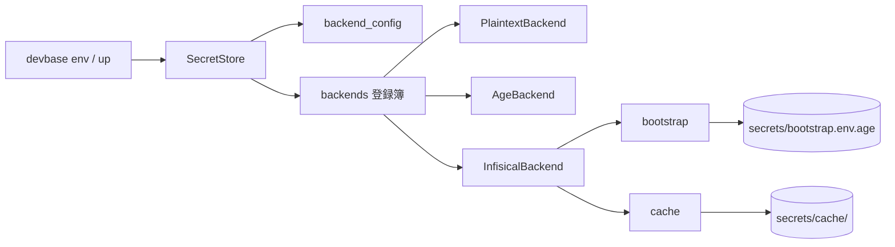

# PLAN51: 機密ストアの保存先を差し替え可能にする — 設計 1 / 構成要素とデータ構造

この文書は「どう作るか」のうち、増える要素と、何をどこに置くかを扱う。

| 文書 | 内容 |
| --- | --- |
| [仕様](PLAN51_secret-backend-pluggable.md) | 要求・前提・受け入れ条件 |
| [設計 1: 構成要素とデータ構造](PLAN51_secret-backend-design.md) | 何をどこに置くか |
| [設計 2: 入出力の契約と処理の流れ](PLAN51_secret-backend-contract.md) | どのコマンドが何を返すか、外部との約束、機密が解決されるまでの順序 |
| [設計 3: 決定の記録とテスト設計](PLAN51_secret-backend-decisions.md) | なぜその形にしたか、何で確かめるか |

## 構成要素

| 要素 | 責務 |
| --- | --- |
| `env/backend_config.py`（新規） | どの backend を使うかと、その非機密設定を `secrets/backend.yml` から読み書きする |
| `env/backends.py`（新規） | backend 名から実装を作る登録簿。未知の名前を、利用できる名前の一覧を添えて拒む |
| `env/infisical.py`（新規） | Infisical の REST を叩く `SecretBackend` 実装 |
| `env/bootstrap.py`（新規） | サーバ接続に使う機密を `secrets/bootstrap.env.age` から読む。**登録簿を経由しない** |
| `env/cache.py`（新規） | 取得できた機密を age で暗号化して控え、不達時に読み出す |
| `env/secret_store.py`（改修） | `backend_for()` が設定を見るようにする。設定が無ければ現行の自動判定のまま。backend が「保存先をファイルとして直接編集できるか」を `direct_edit` として持つ |
| `env/secret_view.py`（改修） | `backup()` が backend の性質で退避の作り方を分ける |
| `commands/env.py`（改修） | `edit` の分岐を `direct_edit` へ切り替え、一覧の保存形式表示に backend 名を使う |
| `commands/env_backend.py`（新規） | `devbase env backend` の 4 サブコマンド |
| `commands/env_ops.py`（改修） | `doctor` に backend 設定・ブートストラップ・キャッシュの点検を足す。`rekey` が再暗号化する対象へブートストラップとキャッシュを加える |
| `cli.py`（改修） | サブコマンドの登録と、prefix 解決の優先指定 |

`PlaintextBackend` と `AgeBackend` は `secret_store.py` に置いたままにする。登録簿はそれらを
参照するだけで、移動しない。

**登録簿は `backend_for()` の中から遅延 import する。** `env/backends.py` は
`secret_store.py` の `SecretBackend` を参照し、`secret_store.py` は登録簿を参照するため、
モジュール先頭で import すると循環する。関数内 import は既存コードでも使っている書き方である
（`commands/env.py:46` ほか）。



## データ構造

### 1. backend の選択と非機密設定 — `$DEVBASE_ROOT/secrets/backend.yml`

```yaml
version: 1
backend: infisical
infisical:
  url: https://infisical.example.com
  project_id: 7f0e2c1a-....
  environment: common
  user: member01
  path_team_global: /team/global
  path_team_project_prefix: /team/projects
  path_user_prefix: /users
  api_version: v4
  timeout_seconds: 5
cache:
  enabled: true
```

| キー | 意味 | 空・不在のとき |
| --- | --- | --- |
| `version` | この形式の版。将来の変更を検出するためだけに持つ | 不在なら `1` として読む |
| `backend` | 使う backend 名。`auto` / `plaintext` / `age` / `infisical` | **`auto`**（＝現行のファイル存在による判定） |
| `infisical.url` | 接続先。**スキームは `https` に限る**（ループバック宛てだけ例外。下記） | `backend: infisical` のとき必須。不在は設定エラー |
| `infisical.project_id` | Infisical の project の識別子 | 同上 |
| `infisical.environment` | environment の slug | 不在なら `common` |
| `infisical.user` | 個人単位の機密の置き場を決める識別子。パス区切りと `..` を含む値は設定エラー | `backend: infisical` のとき必須。不在は設定エラー |
| `infisical.path_team_global` | チーム単位の共通機密を置く `secretPath` | 不在なら `/team/global` |
| `infisical.path_team_project_prefix` | チーム単位のプロジェクト機密の親 `secretPath` | 不在なら `/team/projects` |
| `infisical.path_user_prefix` | 個人単位の機密の親 `secretPath`。この下に `user` の値が入る | 不在なら `/users` |
| `infisical.api_version` | 叩く API の版。**受け付けるのは `v4` だけ** | 不在なら `v4`。他の値は設定エラー |
| `infisical.timeout_seconds` | 1 回の HTTP の待ち時間 | 不在なら `5` |
| `cache.enabled` | キャッシュを書く・読むか。**偽のときは既存の控えも消す**（キャッシュの節） | 不在なら `true` |

- **このファイルに機密は入らない。** 値が入るのはブートストラップ（次項）だけである
- 権限は `0600`。`secrets/` は既に `.gitignore` に載っているため、追加の除外設定は要らない
- 空の値は「未設定」であって「該当なし」ではない。上表の既定へ落ちる

**`http` を許すのはループバック宛てだけにする。** ホスト名が `localhost` / `127.0.0.1` / `::1`
のいずれかのときに限り `http` を受け付け、それ以外のホストへの `http` は設定エラーとして拒む。
偽サーバに対する結合テスト（[テスト設計](PLAN51_secret-backend-decisions.md)）は標準ライブラリの `http.server` を平文で立てるため、
`http` を無条件に拒むと `http://127.0.0.1:<port>` がバリデーションで弾かれ、この経路を試せない。
許す範囲をループバックへ閉じれば、平文が流れるのは同じ端末の中だけになる。

例外を環境変数やテスト専用のオプションで開ける案は採らない。実サーバを使う端末でも開けられる
抜け道になり、設定を書き間違えた利用者が経路上へ平文で機密を送る状態を作れてしまう。
ホストで判定すれば、開けられる範囲が最初から同じ端末の中に限られる。

**対応していない値は既定へ落とさず、設定エラーとして拒む。** `api_version` は上表の
「空・不在のとき」の既定を持つが、これは値が**無い**ときの話である。`v3` のように利用者が
意図して書いた値を黙って `v4` へ読み替えると、書いたとおりに動いていないことに気づく手段が
無くなる。欠けている項目名を挙げるのと同じ形で、受け付けない値もキー名と受け付ける値を述べて
非ゼロ終了する。

### 2. ブートストラップ機密 — `$DEVBASE_ROOT/secrets/bootstrap.env.age`

`KEY=VALUE` 形式を age で暗号化したもの。既存の `AgeBackend` と同じ暗号化・同じ権限。

| キー | 意味 |
| --- | --- |
| `DEVBASE_INFISICAL_CLIENT_ID` | machine identity の client ID |
| `DEVBASE_INFISICAL_CLIENT_SECRET` | 同 client secret |

**このファイルだけは登録簿を経由せず、直接 `AgeBackend` で読む。** 有効な backend を通して
読もうとすると、「接続するための値を、接続しないと読めない」循環になる。

**平文へは落とさない。** age の識別鍵が無い端末では、鍵の置き場と用意の手順を述べて、
`backend use infisical` と機密の読み込みの両方を非ゼロで終了させる。接続資格情報を age ストアに
置くことは要求の側で決まっており、鍵が無いことを理由に平文の置き場を作ると満たせなくなる。
既存の自動判定はファイルの存在で backend を選ぶだけで、鍵の有無で平文へ移す規則は持たない。
`bootstrap.env.age` があって鍵が無い状態は、復号できない状態としてそのまま失敗させる。

**受信者の入れ替えは `devbase env rekey` が受け持つ。** 選択中の backend が `infisical` でも
このファイルを再暗号化の対象に含める。含めないと、Infisical を使っている間は接続資格情報の
受信者を変える手段が無くなる（[決定 8](PLAN51_secret-backend-decisions.md)）。

### 3. キャッシュ — `$DEVBASE_ROOT/secrets/cache/`

| パス | 中身 |
| --- | --- |
| `cache/team/global.env.age` | チーム共通の機密の控えと、その取得元を表す `scope`（age 暗号化） |
| `cache/team/projects/<name>.env.age` | チームのプロジェクト機密の控えと `scope` |
| `cache/user/global.env.age` | 個人共通の機密の控えと `scope` |
| `cache/user/projects/<name>.env.age` | 個人のプロジェクト機密の控えと `scope` |
| `cache/index.json` | 参照ごとの `fetched_at` / `backend` / `url_host`。`status` の表示だけに使う |

置き場を持ち主で分けるのは、参照 1 つにつき 1 ファイルという対応をそのまま保つためである。
1 台の端末が扱う個人単位の機密は設定した 1 人分だけなので、パスに識別子は入れない。設定の
`user` を書き換えた場合は `secretPath` が変わり、後述の `scope` が一致しなくなるため、
書き換える前の控えは使われない。

**1 つの参照のキャッシュは 1 ファイルに収める。** 控えた機密と `scope` を同じ age 暗号文の
中へ入れ、`write_secure_bytes_atomic` で 1 回の置き換えとして書く。復号すると両方が必ず同じ
取得の結果として一緒に出るため、機密と `scope` が食い違った組み合わせは作れない。暗号文を
復号した中身は次の形にする。

```json
{
  "version": 1,
  "scope": "sha256:9f2c1e...",
  "backend": "infisical",
  "fetched_at": "2026-09-08T10:00:00+09:00",
  "secrets": "KEY=value\n..."
}
```

`index.json` は `status` が最終取得時刻と接続先を表示するためだけに置く。**キャッシュを使える
かの判定には使わない。** キー名も値も入れない。何が保存されているかは暗号文の側にしか無い
状態を保つ。欠けていても壊れていてもキャッシュの可否は変わらない。

```json
{
  "version": 1,
  "entries": {
    "team:global": {"fetched_at": "2026-09-08T10:00:00+09:00", "backend": "infisical", "url_host": "infisical.example.com"},
    "team:project:carmo": {"fetched_at": "2026-09-08T10:00:00+09:00", "backend": "infisical", "url_host": "infisical.example.com"},
    "user:global": {"fetched_at": "2026-09-08T10:00:00+09:00", "backend": "infisical", "url_host": "infisical.example.com"},
    "user:project:carmo": {"fetched_at": "2026-09-08T10:00:00+09:00", "backend": "infisical", "url_host": "infisical.example.com"}
  }
}
```

**キャッシュを書き直す条件:** サーバの内容と一致すると確かめられたときだけ書き直す。確かめ
られるのは、取得が成功したときと、devbase 自身の書き込みが成功したときの 2 つである。まず
取得の側から決める。**取得の成功**は「応答を最後まで受け取れて、本文が `secrets` の配列として
読めた」ことであり、**`secrets` が空の配列であっても成功である**。この場合は `secrets` を空に
した世代で置き換える。取得を理由に書き直さないのは失敗したときだけで、失敗とは**通信できない
場合（接続不能・タイムアウト・5xx）・応答を解釈できない場合（JSON として読めない・`secrets` が
配列でない）・認証を拒まれた場合（401 / 403）**を指す。

空の一覧を失敗と同じ扱いにすると、WebUI でその参照の最後の機密を消して正常に取得できた後、
次の不達で削除済みの機密がコンテナへ戻る。空の一覧は「取れなかった」ではなく「その参照には
機密が 1 件も無い」という取得結果なので、両者を区別する。

**書き込みが成功したときも同じ世代へ進める。** `save()` / `save_bytes()` がサーバへの反映を
終えたら、**書いた内容で**その参照のキャッシュを置き換える。取得の成功だけを条件にすると、
`env set` / `delete` / `edit` / `import` は書き込みの前に読んだ内容で控えを作り、書き込みの結果を
控えへ反映しないまま終わる。漏れたトークンを `env delete LEAKED_KEY` で消した直後にサーバが
不達になれば、削除済みのトークンが控えからコンテナへ戻り、`set` で新しく入れたキーは載らない。

書いた後に取得し直さず、書いた内容をそのまま新しい世代にする。`save()` は渡された辞書と
サーバ側の状態を一致させてから返るため（Infisical との契約の差分適用）、取り直しても同じものが
返る。`fetched_at` には書き込みが成功した時刻を、`scope` には現在の設定から計算した値を入れる。

**新しい世代を書けなければ、その参照の控えを消す。** 受信者鍵が無い・置き場へ書けないといった
理由で置き換えに失敗したとき、前の世代を残せば書き込みの前の機密が控えとして生き続ける。消せば
次の不達では起動できなくなるが、消したはずの機密が戻ることはない。サーバへの書き込み自体は
済んでいるのでコマンドは成功として終え、控えを消したことを警告に出す。

**`cache.enabled` が偽のときは、控えを作らないだけでなく既存の控えを消す。** 読み書きを
止めるだけでは、真だった間に作った控えが `cache/` に残る。その状態で `env delete` により機密を
消し、`cache.enabled` を真へ戻してからサーバへ到達できない実行を行うと、消したはずの機密が
控えからコンテナへ渡る。偽の間に起きた変更は控えへ写されないため、残った控えはサーバの写しで
はなくなる。よって backend を解決するすべての実行（`devbase up`・`devbase env` 系・
`devbase env backend status`）で、`cache.enabled` が偽なら `cache/` 配下の控えを消してから
先へ進む。この規則によって「偽のときは控えが存在しない」が保たれるため、書き込みの後に
置き換えるものは無い。

控えを消せなかったときは、残っている控えのパスを挙げて非ゼロ終了する。読み書きを止めたまま
実行を続けると、真へ戻した後の到達できない実行でその控えが使われる。設定を手で書き換えた場合も
次の実行で消えるため、無効にする操作を `devbase env backend use --no-cache` に限定しなくてよい。

**控えを残す条件と、控えを使ってよい条件は同じではない。** 取得を理由に書き直さないのは
「サーバの内容を知れなかった」ときだが、その中には「知る資格を失った」ときが混じる。前者では
手元の世代を渡してよく、後者で渡すと、サーバ側で client secret を失効させても参照の権限を
外しても、手元では過去の機密で起動が続く。失敗の種類ごとに 2 つを分けて決める。

| サーバとのやり取りの結果 | 世代を書き直すか | キャッシュを使ってよいか |
| --- | --- | --- |
| 取得の成功（本文が `secrets` の配列。0 件を含む） | 取得した内容で置き換える | — |
| **書き込みの成功（`save` / `save_bytes`）** | **書いた内容で置き換える。置き換えられなければ消す** | — |
| **書き込みが途中で失敗** | **消す**（サーバの状態がどちらとも一致しない） | — |
| 通信できない（接続不能・タイムアウト・5xx） | 残す | 使う |
| 応答を解釈できない（JSON として読めない・`secrets` が配列でない） | 残す | 使う |
| **認証拒否（401 / 403）** | **残す** | **使わず、非ゼロ終了する** |

**認証拒否と判定する前に 1 度だけ再認証する。** access token の期限切れも資格の取り消しも
同じ 401 で返るため、取得が 401 を返したら手元の access token を捨てて `universal-auth` から
取り直し、同じ取得を 1 度だけやり直す。やり直しても 401 / 403 なら資格の取り消しとして扱い、
接続先 URL と「資格を確認できない」旨を述べて非ゼロ終了する。ログイン自体が 401 / 403 を
返した場合は取り直す先が無いので、その時点で確定する。403 は再認証しても変わらないため
やり直さない。

**認証拒否のときも控えは消さない。** 401 / 403 はサーバに何が入っているかを教えないので、
これを理由に消したり空の世代で置き換えたりすると、client secret の書き間違いや権限付与の
順番待ちといった一時的な状態で控えを失う。残したまま使わない形にすれば、資格が戻るまでは
起動できず、戻った後の不達では従来どおり働く。理由は[決定 9](PLAN51_secret-backend-decisions.md) にある。

**キャッシュを使える条件:** 上表で「使ってよい」失敗であることに加えて、`scope` の一致を求める。
`scope` は接続先 URL 全体・`project_id`・`environment`・その参照の
`secretPath`・認証主体（client ID）を連結して SHA-256 を取ったものである。読み出すときは現在の
設定から同じ手順で計算し、**復号して得た** `backend` と `scope` の両方が一致する参照だけを
キャッシュとして使う。一致しない参照はキャッシュが無いものとして扱い、不達なら接続先を示して
非ゼロ終了する。

指紋を持たず参照名と `url_host` だけで一致を見ると、同じホスト上の別の project や environment
へ切り替えた直後に不達だった場合、切り替える前の機密を新しい環境のコンテナへ渡すことになる。
連結した値をそのまま置かず SHA-256 にするのは、project の識別子と client ID を平文で残さない
ためである。

暗号文と `scope` を別のファイルへ分けると、どちらも原子的に置き換えても組み合わせが崩れる。
scope A と scope B を使う 2 つの `devbase up` が「B の暗号文 → A の暗号文 → A の `scope` →
B の `scope`」の順に書けば、B の `scope` に A の機密が結び付いた状態が残り、別の environment の
機密を渡してしまう。更新の途中でプロセスが止まった場合も同じ形が残る。1 ファイルに収めれば、
残るのはどちらか一方の完全な世代だけになる。

**時系列の扱い: 上書きし、過去を残さない。** 理由は[決定 5](PLAN51_secret-backend-decisions.md) にある。

**受信者の入れ替え:** `devbase env rekey` の再暗号化の対象に `cache/` 配下を含める。
外した受信者が控えを復号できる状態を手元に残さないためである（[決定 8](PLAN51_secret-backend-decisions.md)）。

**移行:** 既存データの変換は無い。`devbase env backend migrate --to <name>` が明示的に呼ばれた
ときだけ、移行元の参照を読んで移行先へ写す。**どちらの向きでも移行元の機密は自動削除しない**
（既存の `env encrypt` と同じ性質）。移す対象は**持ち主がチーム単位の参照だけ**である。
ファイル backend は個人単位の参照を持たないため、`age → infisical` では移す元が無く、
`infisical → age` では移した先が無い。個人単位の機密はサーバ上にそのまま残り、移行の対象にも
削除の対象にもならない。向きごとの扱いは次のとおり。

| 向き | 移行元の機密 | 手元の age 暗号文 | 完了後の設定 |
| --- | --- | --- | --- |
| age → infisical | age ストアのファイルを `backups/env-backend-migrate/<日時>/` へ退避する。退避先のパスを表示する | `bootstrap.env.age` は残す。`cache/` は読み戻しの取得で新しい世代になる | `backend` を `infisical` にする |
| infisical → age | **サーバ上にそのまま残す。** 消さず、退避も作らない。残っている場所として接続先 URL と `secretPath` を表示する | `bootstrap.env.age` は残す。**`cache/` 配下は消す** | `backend` を `age` にする |

`backend.yml` を書き換えるのは**読み戻しの検証が通った後**である。検証に失敗した実行は、この
実行で作成したキーだけを消し、設定を移行前のまま残す（[決定 7](PLAN51_secret-backend-decisions.md)）。

**`infisical → age` で `cache/` を消す。** キャッシュはサーバ backend が不達のときに使うもので、
`backend` が `age` になった後は読み出す経路が無い。残せば、目的を持たない機密の控えが手元に
増え続ける。`bootstrap.env.age` を残すのは、`infisical` へ戻すときに接続資格情報を入れ直さずに
済ませるためで、こちらは残す使い道がある。

**サーバ側を消さないのは、消してよいかを devbase が判断できないため。** サーバの機密は WebUI
から他の利用者も参照している可能性があり、1 台の端末が backend を `age` へ戻したことは、その
参照を全員が使わなくなったことを意味しない。消す操作は WebUI に用意されているので、devbase は
場所を示すところまでにとどめる。

**検査の手段:** `devbase env doctor` に次を足す。

- `secrets/backend.yml` が YAML として読め、`backend` が登録簿にある名前であること
- `backend.yml` / `bootstrap.env.age` / `cache/` 配下の権限が `0600`、ディレクトリが `0700` であること
- `backend: infisical` なのにブートストラップの 2 キーが揃っていない状態を指摘すること
- `backend: infisical` なのに `infisical.user` が設定されていない状態を指摘すること
- 上記 3 つのパスが `git check-ignore` で除外されること（既存の `_ignore_probe_paths` へ追加する）

### 4. 機密の 2 つの軸と Infisical 上での配置

`.env` に入る機密は 2 つの軸で分かれる。1 つは devbase が既に持っている**適用範囲**の軸
（全プロジェクトで使うか、1 つのプロジェクトのものか）で、もう 1 つは**持ち主**の軸
（利用者ごとに値が違うか、チームで同じ値を使うか）である。2 つは直交し、4 つの組み合わせ
すべてに実際の機密がある。

| | 個人単位（利用者ごとに値が違う） | チーム単位（全員が同じ値を使う） |
| --- | --- | --- |
| **共通**（全プロジェクト） | 各自のクラウドアクセスキー、コード管理サービスの個人アクセストークン、AI サービスの API キー | 参照先のクラウドプロジェクト名（`GOOGLE_CLOUD_PROJECT`）のような、人によって変わらない設定 |
| **プロジェクト** | そのプロジェクトで各自が使う個人の資格情報 | サービスアカウントの鍵、連携先サーバの API キー |

**持ち主の軸は `secretPath` で表す。** Infisical は project → environment → folder path の
階層を持ち、role と additional privileges で読み書きできる範囲を絞れる
（[project](https://infisical.com/docs/documentation/platform/secrets-mgmt/project)、
[access controls](https://infisical.com/docs/documentation/platform/access-controls/overview)）。
パスを分ければ個人単位の機密とチーム単位の機密は別の場所に置かれ、他人の個人単位のパスを読む
権限を与えなければ、値そのものが返らない。

| devbase の参照 | Infisical 側の `secretPath`（`projectId` と `environment` はいずれも設定値） |
| --- | --- |
| チーム共通（`team:global`） | `<path_team_global>` |
| チームのプロジェクト（`team:project:<name>`） | `<path_team_project_prefix>/<name>` |
| 個人共通（`user:global`） | `<path_user_prefix>/<user>/global` |
| 個人のプロジェクト（`user:project:<name>`） | `<path_user_prefix>/<user>/projects/<name>` |

`<name>` は既存の `_validate_project_name()` を通したものだけを使う。`<user>` にも同じ検査を
掛け、パス区切りと `..` を含む値は設定エラーとして拒む。どちらもそこで拒まれるため、組み立てた
`secretPath` が設定した親の外へ出ることはない。

**personal override では持ち主の軸を表さない。** Infisical は 1 つのキーに対して、全員が見る
値と、書いた本人にだけ返る値（personal override）を持てる。personal override は前者の
**上書き**であり、同じ名前の値が先に無いと作れない
（[shared と override の解説](https://questions.infisical.com/kb/t/discussing-shared-vs-overridden-secret-values/2K295f)）。
各自のクラウドアクセスキーのように、チームで共有する値がそもそも存在しないものをこの形で表すと、
実体の無い値を全員から見える場所へ置くことになる。取得は personal override があればそれを、
無ければ全員が見る値を返すため、置いた値を消せば全員がその実体の無い値を受け取る。理由は
[決定 11](PLAN51_secret-backend-decisions.md) にある。

**`<user>` は設定に置き、machine identity からは引かない。** 識別子の払い出し単位は
`carmo-cdk#312` の決定待ちで、machine identity から人の識別子を引く経路も未確認である
（[未確認のまま残ること](PLAN51_secret-backend-decisions.md)）。設定へ置けば、払い出し単位が決まった後に「設定が無ければ引く」形へ
広げられる。他人の識別子を書いても、読み取り権限が無ければサーバが 401 / 403 を返し、
資格を確認できない旨を述べて非ゼロ終了する（[決定 9](PLAN51_secret-backend-decisions.md)）。宛先を指すのは設定、渡してよいかを
決めるのはサーバ、という分担にする。

**ファイル backend は個人単位の参照を持たない。** `age` と `plaintext` の保存先は 1 台の端末の
中にあり、その端末を使う人が 1 人である以上、持ち主で分ける先が無い。`SecretRef` へ持ち主
（`team` / `user`）を足し、既存の `SecretRef.for_global()` / `for_project()` は `team` を返す。
ファイル backend は持ち主が `user` の参照に対して `exists()` が偽・`load()` が空を返し、
書き込みは個人単位を持たない旨を述べて非ゼロ終了する。既存の呼び出しはすべて `team` を指す
ため、backend を設定していない端末では読む先も書く先も現行と同じになる（前提 3）。
