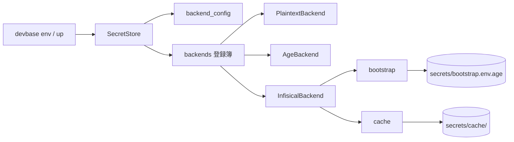
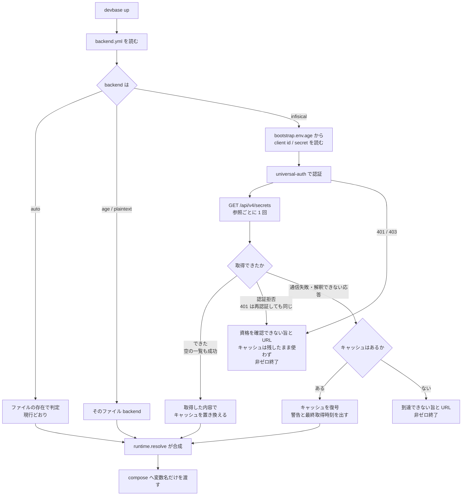
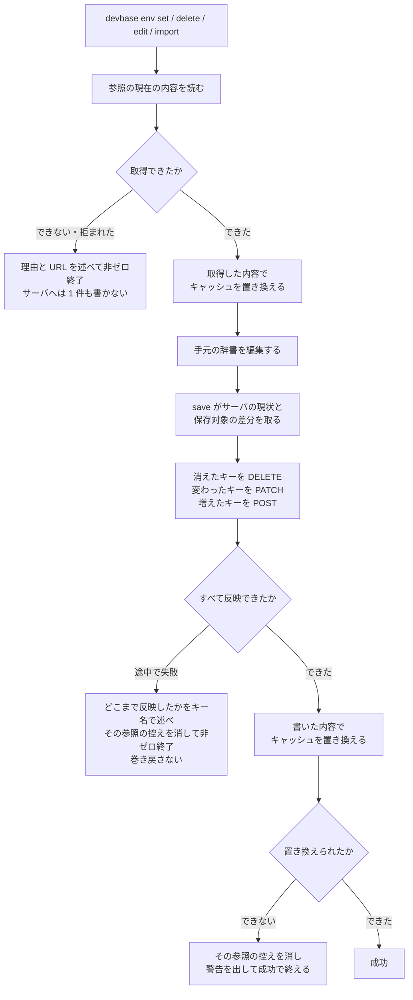

# PLAN51: 機密ストアの保存先を差し替え可能にする — 設計

要求と受け入れ条件は [PLAN51_secret-backend-pluggable.md](PLAN51_secret-backend-pluggable.md) にある。
この文書は「どう作るか」だけを扱う。

## 構成要素

| 要素 | 責務 |
| --- | --- |
| `env/backend_config.py`（新規） | どの backend を使うかと、その非機密設定を `secrets/backend.yml` から読み書きする |
| `env/backends.py`（新規） | backend 名から実装を作る登録簿。未知の名前を、利用できる名前の一覧を添えて拒む |
| `env/infisical.py`（新規） | Infisical の REST を叩く `SecretBackend` 実装 |
| `env/bootstrap.py`（新規） | サーバ接続に使う機密を `secrets/bootstrap.env.age` から読む。**登録簿を経由しない** |
| `env/cache.py`（新規） | 取得できた機密を age で暗号化して控え、不達時に読み出す |
| `env/secret_store.py`（改修） | `backend_for()` が設定を見るようにする。設定が無ければ現行の自動判定のまま。backend が「保存先をファイルとして直接編集できるか」を `direct_edit` として持つ |
| `env/secret_view.py`（改修） | `backup()` が backend の性質で退避の作り方を分ける |
| `commands/env.py`（改修） | `edit` の分岐を `direct_edit` へ切り替え、一覧の保存形式表示に backend 名を使う |
| `commands/env_backend.py`（新規） | `devbase env backend` の 4 サブコマンド |
| `commands/env_ops.py`（改修） | `doctor` に backend 設定・ブートストラップ・キャッシュの点検を足す。`rekey` が再暗号化する対象へブートストラップとキャッシュを加える |
| `cli.py`（改修） | サブコマンドの登録と、prefix 解決の優先指定 |

`PlaintextBackend` と `AgeBackend` は `secret_store.py` に置いたままにする。登録簿はそれらを
参照するだけで、移動しない。

**登録簿は `backend_for()` の中から遅延 import する。** `env/backends.py` は
`secret_store.py` の `SecretBackend` を参照し、`secret_store.py` は登録簿を参照するため、
モジュール先頭で import すると循環する。関数内 import は既存コードでも使っている書き方である
（`commands/env.py:46` ほか）。



## データ構造

### 1. backend の選択と非機密設定 — `$DEVBASE_ROOT/secrets/backend.yml`

```yaml
version: 1
backend: infisical
infisical:
  url: https://infisical.example.com
  project_id: 7f0e2c1a-....
  environment: shared
  path_global: /global
  path_project_prefix: /projects
  api_version: v4
  timeout_seconds: 5
  include_personal_overrides: false
cache:
  enabled: true
```

| キー | 意味 | 空・不在のとき |
| --- | --- | --- |
| `version` | この形式の版。将来の変更を検出するためだけに持つ | 不在なら `1` として読む |
| `backend` | 使う backend 名。`auto` / `plaintext` / `age` / `infisical` | **`auto`**（＝現行のファイル存在による判定） |
| `infisical.url` | 接続先。**スキームは `https` に限る**（ループバック宛てだけ例外。下記） | `backend: infisical` のとき必須。不在は設定エラー |
| `infisical.project_id` | Infisical の project の識別子 | 同上 |
| `infisical.environment` | environment の slug | 不在なら `shared` |
| `infisical.path_global` | 共通機密を置く `secretPath` | 不在なら `/global` |
| `infisical.path_project_prefix` | プロジェクト機密の親 `secretPath` | 不在なら `/projects` |
| `infisical.api_version` | 叩く API の版。**受け付けるのは `v4` だけ** | 不在なら `v4`。他の値は設定エラー |
| `infisical.timeout_seconds` | 1 回の HTTP の待ち時間 | 不在なら `5` |
| `infisical.include_personal_overrides` | 読み取りに personal override を含めるか。**受け付けるのは `false` だけ** | 不在なら `false`。`true` は設定エラー（決定 6） |
| `cache.enabled` | キャッシュを書く・読むか | 不在なら `true` |

- **このファイルに機密は入らない。** 値が入るのはブートストラップ（次項）だけである
- 権限は `0600`。`secrets/` は既に `.gitignore` に載っているため、追加の除外設定は要らない
- 空の値は「未設定」であって「該当なし」ではない。上表の既定へ落ちる

**`http` を許すのはループバック宛てだけにする。** ホスト名が `localhost` / `127.0.0.1` / `::1`
のいずれかのときに限り `http` を受け付け、それ以外のホストへの `http` は設定エラーとして拒む。
偽サーバに対する結合テスト（テスト設計）は標準ライブラリの `http.server` を平文で立てるため、
`http` を無条件に拒むと `http://127.0.0.1:<port>` がバリデーションで弾かれ、この経路を試せない。
許す範囲をループバックへ閉じれば、平文が流れるのは同じ端末の中だけになる。

例外を環境変数やテスト専用のオプションで開ける案は採らない。実サーバを使う端末でも開けられる
抜け道になり、設定を書き間違えた利用者が経路上へ平文で機密を送る状態を作れてしまう。
ホストで判定すれば、開けられる範囲が最初から同じ端末の中に限られる。

**対応していない値は既定へ落とさず、設定エラーとして拒む。** `api_version` と
`include_personal_overrides` は、上表の「空・不在のとき」の既定を持つが、これは値が**無い**
ときの話である。`v3` や `true` のように利用者が意図して書いた値を黙って `v4` / `false` へ
読み替えると、書いたとおりに動いていないことに気づく手段が無くなる。欠けている項目名を挙げる
のと同じ形で、受け付けない値もキー名と受け付ける値を述べて非ゼロ終了する。

### 2. ブートストラップ機密 — `$DEVBASE_ROOT/secrets/bootstrap.env.age`

`KEY=VALUE` 形式を age で暗号化したもの。既存の `AgeBackend` と同じ暗号化・同じ権限。

| キー | 意味 |
| --- | --- |
| `DEVBASE_INFISICAL_CLIENT_ID` | machine identity の client ID |
| `DEVBASE_INFISICAL_CLIENT_SECRET` | 同 client secret |

**このファイルだけは登録簿を経由せず、直接 `AgeBackend` で読む。** 有効な backend を通して
読もうとすると、「接続するための値を、接続しないと読めない」循環になる。

**平文へは落とさない。** age の識別鍵が無い端末では、鍵の置き場と用意の手順を述べて、
`backend use infisical` と機密の読み込みの両方を非ゼロで終了させる。接続資格情報を age ストアに
置くことは要求の側で決まっており、鍵が無いことを理由に平文の置き場を作ると満たせなくなる。
既存の自動判定はファイルの存在で backend を選ぶだけで、鍵の有無で平文へ移す規則は持たない。
`bootstrap.env.age` があって鍵が無い状態は、復号できない状態としてそのまま失敗させる。

**受信者の入れ替えは `devbase env rekey` が受け持つ。** 選択中の backend が `infisical` でも
このファイルを再暗号化の対象に含める。含めないと、Infisical を使っている間は接続資格情報の
受信者を変える手段が無くなる（決定 8）。

### 3. キャッシュ — `$DEVBASE_ROOT/secrets/cache/`

| パス | 中身 |
| --- | --- |
| `cache/global.env.age` | 共通機密の控えと、その取得元を表す `scope`（age 暗号化） |
| `cache/projects/<name>.env.age` | プロジェクト機密の控えと `scope` |
| `cache/index.json` | 参照ごとの `fetched_at` / `backend` / `url_host`。`status` の表示だけに使う |

**1 つの参照のキャッシュは 1 ファイルに収める。** 控えた機密と `scope` を同じ age 暗号文の
中へ入れ、`write_secure_bytes_atomic` で 1 回の置き換えとして書く。復号すると両方が必ず同じ
取得の結果として一緒に出るため、機密と `scope` が食い違った組み合わせは作れない。暗号文を
復号した中身は次の形にする。

```json
{
  "version": 1,
  "scope": "sha256:9f2c1e...",
  "backend": "infisical",
  "fetched_at": "2026-09-08T10:00:00+09:00",
  "secrets": "KEY=value\n..."
}
```

`index.json` は `status` が最終取得時刻と接続先を表示するためだけに置く。**キャッシュを使える
かの判定には使わない。** キー名も値も入れない。何が保存されているかは暗号文の側にしか無い
状態を保つ。欠けていても壊れていてもキャッシュの可否は変わらない。

```json
{
  "version": 1,
  "entries": {
    "global": {"fetched_at": "2026-09-08T10:00:00+09:00", "backend": "infisical", "url_host": "infisical.example.com"},
    "project:carmo": {"fetched_at": "2026-09-08T10:00:00+09:00", "backend": "infisical", "url_host": "infisical.example.com"}
  }
}
```

**キャッシュを書き直す条件:** サーバの内容と一致すると確かめられたときだけ書き直す。確かめ
られるのは、取得が成功したときと、devbase 自身の書き込みが成功したときの 2 つである。まず
取得の側から決める。**取得の成功**は「応答を最後まで受け取れて、本文が `secrets` の配列として
読めた」ことであり、**`secrets` が空の配列であっても成功である**。この場合は `secrets` を空に
した世代で置き換える。取得を理由に書き直さないのは失敗したときだけで、失敗とは**通信できない
場合（接続不能・タイムアウト・5xx）・応答を解釈できない場合（JSON として読めない・`secrets` が
配列でない）・認証を拒まれた場合（401 / 403）**を指す。

空の一覧を失敗と同じ扱いにすると、WebUI でその参照の最後の機密を消して正常に取得できた後、
次の不達で削除済みの機密がコンテナへ戻る。空の一覧は「取れなかった」ではなく「その参照には
機密が 1 件も無い」という取得結果なので、両者を区別する。

**書き込みが成功したときも同じ世代へ進める。** `save()` / `save_bytes()` がサーバへの反映を
終えたら、**書いた内容で**その参照のキャッシュを置き換える。取得の成功だけを条件にすると、
`env set` / `delete` / `edit` / `import` は書き込みの前に読んだ内容で控えを作り、書き込みの結果を
控えへ反映しないまま終わる。漏れたトークンを `env delete LEAKED_KEY` で消した直後にサーバが
不達になれば、削除済みのトークンが控えからコンテナへ戻り、`set` で新しく入れたキーは載らない。

書いた後に取得し直さず、書いた内容をそのまま新しい世代にする。`save()` は渡された辞書と
サーバ側の状態を一致させてから返るため（Infisical との契約の差分適用）、取り直しても同じものが
返る。`fetched_at` には書き込みが成功した時刻を、`scope` には現在の設定から計算した値を入れる。

**新しい世代を書けなければ、その参照の控えを消す。** 受信者鍵が無い・置き場へ書けないといった
理由で置き換えに失敗したとき、前の世代を残せば書き込みの前の機密が控えとして生き続ける。消せば
次の不達では起動できなくなるが、消したはずの機密が戻ることはない。サーバへの書き込み自体は
済んでいるのでコマンドは成功として終え、控えを消したことを警告に出す。`cache.enabled` が偽の
ときは控えを持たないので、書き込みの後も何もしない。

**控えを残す条件と、控えを使ってよい条件は同じではない。** 取得を理由に書き直さないのは
「サーバの内容を知れなかった」ときだが、その中には「知る資格を失った」ときが混じる。前者では
手元の世代を渡してよく、後者で渡すと、サーバ側で client secret を失効させても参照の権限を
外しても、手元では過去の機密で起動が続く。失敗の種類ごとに 2 つを分けて決める。

| サーバとのやり取りの結果 | 世代を書き直すか | キャッシュを使ってよいか |
| --- | --- | --- |
| 取得の成功（本文が `secrets` の配列。0 件を含む） | 取得した内容で置き換える | — |
| **書き込みの成功（`save` / `save_bytes`）** | **書いた内容で置き換える。置き換えられなければ消す** | — |
| **書き込みが途中で失敗** | **消す**（サーバの状態がどちらとも一致しない） | — |
| 通信できない（接続不能・タイムアウト・5xx） | 残す | 使う |
| 応答を解釈できない（JSON として読めない・`secrets` が配列でない） | 残す | 使う |
| **認証拒否（401 / 403）** | **残す** | **使わず、非ゼロ終了する** |

**認証拒否と判定する前に 1 度だけ再認証する。** access token の期限切れも資格の取り消しも
同じ 401 で返るため、取得が 401 を返したら手元の access token を捨てて `universal-auth` から
取り直し、同じ取得を 1 度だけやり直す。やり直しても 401 / 403 なら資格の取り消しとして扱い、
接続先 URL と「資格を確認できない」旨を述べて非ゼロ終了する。ログイン自体が 401 / 403 を
返した場合は取り直す先が無いので、その時点で確定する。403 は再認証しても変わらないため
やり直さない。

**認証拒否のときも控えは消さない。** 401 / 403 はサーバに何が入っているかを教えないので、
これを理由に消したり空の世代で置き換えたりすると、client secret の書き間違いや権限付与の
順番待ちといった一時的な状態で控えを失う。残したまま使わない形にすれば、資格が戻るまでは
起動できず、戻った後の不達では従来どおり働く。理由は決定 9 にある。

**キャッシュを使える条件:** 上表で「使ってよい」失敗であることに加えて、`scope` の一致を求める。
`scope` は接続先 URL 全体・`project_id`・`environment`・その参照の
`secretPath`・認証主体（client ID）を連結して SHA-256 を取ったものである。読み出すときは現在の
設定から同じ手順で計算し、**復号して得た** `backend` と `scope` の両方が一致する参照だけを
キャッシュとして使う。一致しない参照はキャッシュが無いものとして扱い、不達なら接続先を示して
非ゼロ終了する。

指紋を持たず参照名と `url_host` だけで一致を見ると、同じホスト上の別の project や environment
へ切り替えた直後に不達だった場合、切り替える前の機密を新しい環境のコンテナへ渡すことになる。
連結した値をそのまま置かず SHA-256 にするのは、project の識別子と client ID を平文で残さない
ためである。

暗号文と `scope` を別のファイルへ分けると、どちらも原子的に置き換えても組み合わせが崩れる。
scope A と scope B を使う 2 つの `devbase up` が「B の暗号文 → A の暗号文 → A の `scope` →
B の `scope`」の順に書けば、B の `scope` に A の機密が結び付いた状態が残り、別の environment の
機密を渡してしまう。更新の途中でプロセスが止まった場合も同じ形が残る。1 ファイルに収めれば、
残るのはどちらか一方の完全な世代だけになる。

**時系列の扱い: 上書きし、過去を残さない。** 理由は決定 5 にある。

**受信者の入れ替え:** `devbase env rekey` の再暗号化の対象に `cache/` 配下を含める。
外した受信者が控えを復号できる状態を手元に残さないためである（決定 8）。

**移行:** 既存データの変換は無い。`devbase env backend migrate --to <name>` が明示的に呼ばれた
ときだけ、移行元の参照を読んで移行先へ写す。**どちらの向きでも移行元の機密は自動削除しない**
（既存の `env encrypt` と同じ性質）。向きごとの扱いは次のとおり。

| 向き | 移行元の機密 | 手元の age 暗号文 | 完了後の設定 |
| --- | --- | --- | --- |
| age → infisical | age ストアのファイルを `backups/env-backend-migrate/<日時>/` へ退避する。退避先のパスを表示する | `bootstrap.env.age` は残す。`cache/` は読み戻しの取得で新しい世代になる | `backend` を `infisical` にする |
| infisical → age | **サーバ上にそのまま残す。** 消さず、退避も作らない。残っている場所として接続先 URL と `secretPath` を表示する | `bootstrap.env.age` は残す。**`cache/` 配下は消す** | `backend` を `age` にする |

`backend.yml` を書き換えるのは**読み戻しの検証が通った後**である。検証に失敗した実行は、この
実行で作成したキーだけを消し、設定を移行前のまま残す（決定 7）。

**`infisical → age` で `cache/` を消す。** キャッシュはサーバ backend が不達のときに使うもので、
`backend` が `age` になった後は読み出す経路が無い。残せば、目的を持たない機密の控えが手元に
増え続ける。`bootstrap.env.age` を残すのは、`infisical` へ戻すときに接続資格情報を入れ直さずに
済ませるためで、こちらは残す使い道がある。

**サーバ側を消さないのは、消してよいかを devbase が判断できないため。** サーバの機密は WebUI
から他の利用者も参照している可能性があり、1 台の端末が backend を `age` へ戻したことは、その
参照を全員が使わなくなったことを意味しない。消す操作は WebUI に用意されているので、devbase は
場所を示すところまでにとどめる。

**検査の手段:** `devbase env doctor` に次を足す。

- `secrets/backend.yml` が YAML として読め、`backend` が登録簿にある名前であること
- `backend.yml` / `bootstrap.env.age` / `cache/` 配下の権限が `0600`、ディレクトリが `0700` であること
- `backend: infisical` なのにブートストラップの 2 キーが揃っていない状態を指摘すること
- 上記 3 つのパスが `git check-ignore` で除外されること（既存の `_ignore_probe_paths` へ追加する）

### 4. Infisical 上での配置

| devbase の参照 | Infisical 側の位置 |
| --- | --- |
| 共通（`global`） | `projectId=<設定値>`, `environment=<設定値>`, `secretPath=<path_global>` |
| プロジェクト（`project:<name>`） | 同上、`secretPath=<path_project_prefix>/<name>` |

`<name>` は既存の `_validate_project_name()` を通したものだけを使う。パス区切りと `..` は
そこで拒まれるため、組み立てた `secretPath` が設定した親の外へ出ることはない。

## 入出力の契約

### 増えるコマンド

| 名前 | 入力 | 出力（成功） | 失敗の形 |
| --- | --- | --- | --- |
| `devbase env backend status` | なし | 現在の backend 名、保存先（パスまたは URL）、キャッシュの有無と最終取得時刻。終了コード 0 | 設定が壊れているとき、読めなかった箇所を述べて 1 |
| `devbase env backend use <name>` | `<name>`、`--url`、`--project-id`、`--environment`、`--client-id`、`--client-secret-stdin`、`--no-cache` | 書き込んだ設定の要約（**client secret は伏せる**）。終了コード 0 | 未知の名前なら利用できる名前の一覧を添えて 2。必須の設定が欠けていれば欠けた項目名を述べて 2。**いずれの場合も設定を書き換えない** |
| `devbase env backend test` | なし | 接続先 URL と、読めた参照の件数。終了コード 0 | 到達できない・認証できない・参照が読めない、のどれかを述べて 1 |
| `devbase env backend migrate --to <name>` | `--to`、`--dry-run`、`--yes` | 移す参照とキー**名**の一覧と、移行元の機密が残る場所（`age` からは退避先のパス、`infisical` からは接続先 URL と `secretPath`）。`--dry-run` では書き込まない | 移行先に同じキーがあれば 1 件も書かずに、衝突したキー名を挙げて 2。読み戻しの検証に失敗したら**この実行で作成したキーだけ**を消し、移行前の設定のまま 1 |

**client secret を引数で受け取らない。** `--client-secret-stdin` で標準入力から読むか、TTY では
`questionary` の伏せ字入力で尋ねる。`ps` から読める位置に置かないためである。

`--dry-run` の出力にキーの**値**を含めない。キー名だけを並べる。

**移行先の既存キーを上書きしない。** 書き込みの前に移行先の同じ参照を読み、同じキーがあれば
1 件も書かずに中止する。`--dry-run` も同じ検査を行い、衝突したキー名を一覧に示す。上書きしたい
場合は、そのキーを移行先で消してから実行する。理由は決定 7 にある。

### 既存コマンドの互換性

| コマンド | 扱い |
| --- | --- |
| `env list` / `get` / `set` / `delete` / `project` / `sync` | 引数・出力形式ともに変えない。`SecretStore` 越しに動くため backend を問わない |
| `env edit` | 引数・出力形式は変えない。**保存先を直接エディタへ渡すのは平文の backend だけ**にし、それ以外は一時ファイル経由で `load_bytes()` / `save_bytes()` を呼ぶ（下記） |
| `env init --reset` | 引数・出力形式は変えない。退避はファイル backend では現行どおり保存先を複製し、サーバ backend では読み出した値を age 暗号化して控える（下記） |
| `env encrypt` / `decrypt` | **age 固有のまま**。有効な backend が `age` / `auto` 以外のとき、age 専用である旨を述べて非ゼロ終了する |
| `env rekey` | 引数・出力形式は変えない。**backend の選択に関わらず実行でき**、再暗号化の対象へ `bootstrap.env.age` と `cache/` 配下を加える（決定 8） |
| `env export` / `import` | バンドル形式を変えない。書き出しは有効な backend から読み、取り込みは有効な backend へ書く |
| `devbase up` ほかコンテナ操作 | 変えない。`runtime.resolve()` の入力が変わるだけで、compose へ渡すものは同じ |

`cli.py` の `SUBCMD_MAP` に `backend` を足す。`b` は他と衝突しないが、`SUBCMD_PREFIX_PREFERENCES`
は既存の指定を変えない。

#### `env import` の取り込み先を backend へ向ける

現行の `io_import._build_plans()` は参照ごとに書き込み先の `Path` を決め、`_import_atomic.commit()`
は tmp を `os.replace()` でローカルへ rename する。どちらも backend を通らないため、`backend_for()`
の差し替えだけでは取り込み先がサーバにならない。次の 4 段階を backend 越しの操作へ置き換える。

| 段階 | 現行 | 変更後 |
| --- | --- | --- |
| 計画 | 参照ごとに書き込み先の `Path` を決める | 参照ごとに `(SecretRef, bytes)` を決める。保存先は backend が持つ |
| 退避 | 対象ファイルを `backups/` へ複製する | **ファイル backend では現行のまま複製する。** サーバ backend では取り込み前の値を backend から読み、`backups/` へ age 暗号化して控える |
| 適用 | tmp を `os.replace()` で一括 rename | 参照ごとに `store.save_bytes()` を呼ぶ |
| 巻き戻し | 退避したファイルを書き戻す | 控えた値を書き戻し（ファイル backend は複製したファイル、サーバ backend は復号した値を `store.save_bytes()` で）、取り込み前に無かった参照は消す |

**退避の暗号化はサーバ backend に限る。** ファイル backend（`auto` / `age` / `plaintext`）では、
控えの元になるファイルが同じ形で手元にあるため、複製しても平文の機密は増えない。ここを
暗号化すると、受信者鍵を設定していない利用者の `import` が鍵の要求で失敗し、前提 3 の
「既定の挙動は変えない」に反する。サーバ backend では控えの元が手元に無く、退避が新しい
平文ファイルを作ることになるため暗号化する。この場合に受信者鍵が無ければ、取り込みを 1 件も
始めずに鍵の用意を促して非ゼロ終了する（ブートストラップと同じ扱い）。

ファイル backend では `save_bytes()` の内側で既存の `write_secure_bytes_atomic` が働くため、
1 つの参照の書き込みが途中の状態で残ることはない。参照をまたぐ一括 rename が持っていた同時性は
サーバ backend では作れないので、失敗した参照までを順に巻き戻す形にする。

`export` 側は `store.load_bytes()` を通るため、収録の判定を直せば backend を問わず動く（決定 4）。

#### `path()` をファイルとして扱う経路を backend の性質で分ける

`path()` はファイル backend では開いて読み書きしてよいファイルを指すが、サーバ backend では
`secretPath` を `Path` にしただけの**表示と由来の記録のための値**であり、ローカルには存在しない。
`path()` の戻り値を実ファイルとして扱っている経路が 2 つあり、どちらも `backend_for()` の
差し替えだけでは通らない。

| 経路 | 現行 | 変更後 |
| --- | --- | --- |
| `cmd_env_edit()`（`commands/env.py:459`） | `is_encrypted()` が偽なら `path()` をエディタへ渡す | `direct_edit` が偽なら一時ファイル経由で編集する |
| `SecretEnvFile.backup()`（`env init --reset` が呼ぶ） | `path()` を `shutil.copy2` で `<path>.backup` へ複製する | ファイル backend は現行のまま。サーバ backend は `load_bytes()` を age 暗号化して `backups/env-init/<日時>/` へ控える |

**分岐の基準を「暗号化されているか」から「保存先をファイルとして直接編集できるか」へ変える。**
`SecretBackend` に真偽値 `direct_edit` を足し、`PlaintextBackend` だけ真、`AgeBackend` と
`InfisicalBackend` は偽とする。`SecretStore.direct_edit(ref)` は選択中の backend の値を返す。
現行の `is_encrypted()`（＝`mode() == 'age'`）は `mode` が `infisical` のときも偽になるため、
そのままでは `/global` のようなローカルパスをエディタで開くだけになり、サーバの機密を編集も
保存もできない。

`cmd_env_edit()` は `direct_edit` が偽のとき既存の `_edit_encrypted()` を通す。この関数は
`load_bytes()` → 一時ファイル（自分専用の `0700` ディレクトリに `0600`）→ `save_bytes()` しか
使っておらず age 固有の処理を持たないため、実装を変えずにサーバ backend でもそのまま働く。
age を指す名前だけ `_edit_via_tempfile()` へ改める。

`backup()` は現行、複製に失敗しても警告を出して `None` を返すだけで、呼び出し側の
`cmd_env_init()` はそのまま全キーの削除へ進む。サーバ backend では退避を作れないまま消すことに
なるため、**退避を作れなかったときは削除へ進まず非ゼロで返す**。サーバ backend の退避を age で
暗号化する理由と、受信者鍵が無ければ 1 件も消さずに終了する扱いは、`import` の退避（前節）と
同じである。

一覧の保存形式表示（`_mode_suffix()`、`commands/env.py:372`）も `is_encrypted()` を見ており、
`infisical` では何も付かない。`mode()` を使い、`age` は現行どおり `[暗号化]`、`plaintext` は
何も付けず、それ以外は `[<backend 名>]` を付ける。

### Infisical との契約（外部）

devbase 側では OpenAPI 記述を持たず、Infisical が公開しているものを正とする。使う経路は次の 5 つ。

| 用途 | 経路 | 送るもの |
| --- | --- | --- |
| 認証 | `POST /api/v1/auth/universal-auth/login` | `clientId`, `clientSecret` → `accessToken`, `expiresIn` |
| 一括取得 | `GET /api/v4/secrets` | `projectId`, `environment`, `secretPath`, `includePersonalOverrides`, `expandSecretReferences` → `{secrets: [{secretKey, secretValue}]}` |
| 作成 | `POST /api/v4/secrets/{secretName}` | `projectId`, `environment`, `secretValue`, `secretPath` |
| 更新 | `PATCH /api/v4/secrets/{secretName}` | 同上 |
| 削除 | `DELETE /api/v4/secrets/{secretName}` | `projectId`, `environment`, `secretPath` |

認証以外はすべて `Authorization: Bearer <accessToken>` を付ける。access token は
プロセス内にだけ持ち、ディスクへ書かない。`expiresIn` を過ぎたら取り直す。**取得が 401 を
返したときも 1 度だけ取り直して同じ取得をやり直し、それでも 401 / 403 なら資格の取り消しとして
扱う**（キャッシュの節）。

**一括取得に `expandSecretReferences=false` を必ず載せる。** [Infisical の list secrets](https://infisical.com/docs/api-reference/endpoints/secrets/list)
はこの既定が `true` で、値に含まれる `${OTHER_KEY}` をサーバ側で展開して返す。既存の `EnvFile` は
同じ記法を文字列のまま保持するため、既定のままでは `set` した値と `get` で返る値が変わり、
`migrate` の読み戻し検証も一致しない。差分適用（後述）が値の比較で判断するため、展開された値を
受け取ると変わっていないキーまで `PATCH` の対象になる。

**参照ごとに 1 回、`GET /api/v4/secrets` を呼ぶ。** `devbase up` で読む参照は共通と
プロジェクトの 2 つなので、認証 1 回 + 取得 2 回の計 3 往復に収まる。`recursive` は使わない
（プロジェクトを 1 つ読むだけの場面で全プロジェクトの機密を受け取らないため）。

**`save` / `save_bytes` は差分を取ってから送る。** `SecretBackend` にはキー単位の削除も更新も
無く、`SecretStore.save(ref, data)` は参照の内容**全体**を辞書で受け取る。ファイル backend は
これを 1 つのファイルの原子的な置き換えとして満たすが、Infisical はキー単位の 3 経路しか
持たないため、同じ意味をサーバ側で組み立てる必要がある。手順は次のとおり。

1. 対象の参照を `GET /api/v4/secrets` で読み、サーバの現在のキーと値を得る
2. サーバにあり保存対象に無いキーを `DELETE` する
3. 両方にあり値が違うキーを `PATCH` する
4. サーバに無く保存対象にあるキーを `POST` する
5. 値が同じキーは送らない

差分を取らずに保存対象のキーだけを `POST` すると、`env delete` と `env edit` の行削除、
`env import --replace` で消えたキーがサーバに残り続け、削除がまったく効かない。既にあるキーへ
`POST` すると 409 で拒まれるため、`POST` と `PATCH` の使い分けにも現在のサーバ状態が要る。
手順 1 の取得は書き込みの直前に行い、`up` の取得を使い回さない。

**1 つの参照の書き込みは原子的にならない。** 途中で失敗すれば、一部のキーだけが新しい状態の
参照が残る。この場合は残りを送らずに止め、**どこまで反映したかをキー名で述べて**非ゼロ終了し、
その参照の控えを消す（キャッシュの節）。サーバの状態が保存対象とも手順 1 の取得結果とも一致
しなくなり、手元に「サーバの写し」と言える世代が無くなるためである。

巻き戻しは行わない。巻き戻しも同じ経路を使う書き込みであり、そこで失敗すると「戻したつもりが
戻っていない」状態を 1 段深いところへ作る。複数人での同時編集の競合解決を扱わないこと（対象
範囲）と同じで、最終的な状態は WebUI で確かめられる形にとどめる。

`save_bytes` は受け取ったバイト列を `EnvFile.parse_bytes()` で辞書にしてから同じ差分適用へ
通す。Infisical にはコメント・空行・`export` 表記の置き場が無いため、サーバ backend では
`load_bytes()` が返すのが `KEY=VALUE` の並びになり、`env edit` で書いたコメントは次の編集で
消える。ファイル backend との違いなので、利用者向けドキュメントに書く。

**検査の手段:** `http.server` で立てた偽サーバに対する結合テスト。ループバック宛ての `http` を
許すのはこのためである（設定ファイルの節）。実サーバに対する確認は `carmo-cdk#312` の完了後に
手動で行う。

## 処理の流れ

### 読み: `devbase up` が機密を解決するまで



### 書き: `devbase env set` / `delete` がサーバと控えを揃えるまで



不達のときに書き込みだけを控えへ溜める経路は作らない。控えはサーバの写しであって、まだ
サーバに無い変更の置き場ではない（決定 5）。溜めた変更を後で送る仕組みを持つと、送る前に
別の端末が同じキーを変えていた場合に、どちらを残すかを devbase が決めることになる。

## 決定の記録

### 決定 1: backend の選択を設定ファイルへ置き、現行の自動判定は `auto` として残す

保存先がファイルでない backend は「ファイルの存在」では選べないため、選択を明示する場所が
要る。既定を `auto` にすることで、設定ファイルを持たない既存の端末は現行と同じ経路を通り、
挙動が変わらない（前提 3）。

「暗号化ファイルがあれば `age`、無ければ `plaintext`」という現行規則を単に拡張して
「サーバの設定があれば `infisical`」とする案は採らない。設定の有無で保存先が変わると、
接続設定を書いた時点で機密の読み先が黙って移り、移行の意思表示と区別がつかない。

### 決定 2: サーバ接続に使う機密を専用のファイルへ分ける

有効な backend を通してこれを読むと、「接続するための値を、接続しないと読めない」循環になる。
共通の機密（`global.env.age`）へ相乗りさせる案は、`migrate` でその中身がサーバへ移った時点で
手元から消え、次回以降つながらなくなるため採らない。

### 決定 3: HTTP は標準ライブラリで書く

`urllib.request` で足りる範囲の呼び出ししか行わない。`requests` や `httpx` を足すと、devbase を
入れるすべての端末に常時の依存が 1 つ増える（前提 2）。`infisical` CLI を必須にする案も、
Go のバイナリを各端末へ配る手間が同じ理由で釣り合わない。

### 決定 4: `SecretStore` の生成箇所 11 か所は変えない

`backend_for()` の内側で設定を見る形にすれば、呼び出し側は 1 か所も変えずに済む。
工場関数を新設して 11 か所を書き換える案は、差分が広がるわりに得るものが無く、
既存テストの書き換えも要る。

**`backend_for()` だけでなく、`mode()` / `exists()` / `path()` も選択中の backend へ委譲する。**
現行の `mode()` は `age.exists()` と `plaintext.exists()` だけを見るため、委譲しないと
`exists()` がサーバ上の機密に `False` を返す。`bundle.py` の export は `store.exists()` で
収録を決めており（`bundle.py:252,299`）、サーバにだけある機密がバンドルから落ちる。

| メソッド | 委譲後の返し方 |
| --- | --- |
| `mode(ref)` | 選択中の backend 名（`age` / `plaintext` / `infisical`）。その backend に無ければ `absent` |
| `exists(ref)` | 選択中の backend の `exists(ref)` |
| `path(ref)` | ファイル backend はファイルのパス。サーバ backend は `secretPath` を `Path` として返す（**表示と由来の記録のための値**で、開いて読み書きしてよいファイルではない） |

`backend` が `auto` のときの `mode()` は現行のままで、暗号化と平文の同時存在を拒む判定も残る。
`path()` の戻り値の型は変えないため、`$DEVBASE_ROOT` の外側のパスをそのまま文字列にする
`bundle.py` の `_origin()` は手を入れずに済む。

`store.age` / `store.plaintext` を名指しで触っている `env_migrate.py` と `env_ops.py` は、
age 固有の操作なので名指しのまま残す。`env_ops.py` の `rekey` だけは、age 暗号文が増えた分だけ
対象の列挙を広げる（決定 8）。

### 決定 5: キャッシュは上書きし、過去を残さない

キャッシュは**サーバの内容の写し**であって記録ではない。誰がいつ何を変えたかは Infisical の
監査ログが持つ。履歴を手元に積むと、失効したはずの値が端末に残り続け、守りたいものと逆に
働く。

保持するのは最後に**サーバと一致すると確かめられた** 1 世代だけとし、**取得が成功したときと
書き込みが成功したときの両方で置き換える**。書き換えないのは取得に失敗したときだけである
（前提 4）。失敗は通信できない場合・応答を解釈できない場合・認証を拒まれた場合に限り、機密が
0 件の正常な応答は成功として空の世代へ置き換える。ここで決めるのは世代を書き直すかどうかだけ
で、残した世代を使ってよいかは決定 9 が別に決める。

書き込みを置き換えの条件に入れないと、控えが「最後に**読んだ**状態」で止まる。`env set` も
`env delete` も書き込みの前に読むため、その読みで作った世代には、これから消すキーが入って
いる。サーバへの反映だけを行って控えを据え置けば、次の不達で消したはずの機密が戻る。控えが
サーバの写しである以上、devbase 自身が起こした変更こそ真っ先に写す必要がある。

サーバが空を返したときに前の世代を残すと、消したはずの機密が次の不達で戻る。キャッシュが
サーバの写しである以上、写した先にも「1 件も無い」という状態が要る。

### 決定 6: 初版は shared の機密だけを読み書きする

`include_personal_overrides` は設定として持つが、**受け付ける値は `false` だけ**にし、`true` は
設定エラーとして拒む。

読みで personal を含めて書きが shared へ行くと、同名の personal override を持つ利用者では
`set` した値が `get` で返らない。「`set` の直後の `get` が同じ値を返す」は backend を問わない
受け入れ条件なので、これを破れる設定を書ける状態で残すと、設定した人だけが静かに壊れた挙動を
受け取る。既定を `false` にするだけでは足りない。設定ファイルへ `true` と書けばその状態へ
入れてしまい、`get` が古い値を返す理由が設定ファイルの 1 行にあることは、症状からは見えない。

書きの側も personal へ向けて読み書きを揃える案は、どちらへ書くかを利用者が指定する手段を先に
決める必要がある。人ごとに値が違うものをどう表すかは `carmo-cdk#312` の「決めてほしいこと」に
上げてあり、そこが決まってから読み書きの対象を揃えた形で `true` を受け付ける。設定のキーは
いま置いておき、受け付ける値だけを後から広げる。

### 決定 7: 移行は片方向ずつ行い、読み戻して検証する

`env encrypt` が既に「書く → 読み戻して一致を確認する → 元を退避する」という順序を持っている。
機密を失う経路を 2 通り作らないため、同じ順序に揃える。

この順序の前に、**移行先に同じキーが無いことを確かめる**。移行先に既にある値を上書きすると、
読み戻しが一致しなかったときに戻す先が「上書きする前の値」になり、その値は移行の実行中にしか
手元に無い。控えを持てば機密の置き場が 1 つ増え、途中で落ちた場合はその控えごと失われる。
衝突を先に拒めば、巻き戻しはこの実行で作成したキーを消すだけで済み、移行の前からサーバに
あった機密には触れない。衝突したキーは名前を挙げて示し、移行先で消してから再実行してもらう。

**移行元の機密を残す形は向きで変わる。** `age → infisical` では移行元がファイルなので、
`backups/env-backend-migrate/<日時>/` へ退避して元の場所から動かす。`infisical → age` では
移行元がサーバで、devbase が場所を移せる相手ではない。サーバ上にそのまま残し、退避も作らず、
残っている場所を表示するだけにする。どちらも「移行元を自動削除しない」という同じ性質を、
移行元の形に合わせて満たしている（キャッシュの節の表）。

両方向を同時に同期する案は採らない。どちらが正かを devbase 側で判断できず、
`SecretStore.backend_for()` が暗号化と平文の同時存在を拒んでいるのと同じ理由で、
黙って一方を選ぶと事故になる。

### 決定 8: `encrypt` / `decrypt` は age 専用のまま残し、`rekey` は手元の age 暗号文すべてを対象にする

`encrypt` / `decrypt` は age ストアと平文ストアの間で機密を移すコマンドであり、サーバ backend
には対応する概念が無い。汎用の名前へ広げると、backend ごとに意味が違うコマンドになる。有効な
backend が age 系でないときは、その旨を述べて止める。

`rekey` だけは扱いが違う。これは保存先を移すコマンドではなく、**手元にある age 暗号文の受信者を
入れ替える**コマンドである。`backend: infisical` のときも `bootstrap.env.age` と `cache/` 配下は
age 暗号文として手元に残り、受信者を入れ替える手段はこれ以外に無い。backend の選択を理由に
止めると、Infisical を使っている間は受信者を変えられず、外した鍵の持ち主が接続資格情報と
キャッシュを復号できる状態が続く。よって `rekey` は backend の選択に関わらず実行でき、対象は
次のとおりとする。

| 対象 | 現行 | この設計 |
| --- | --- | --- |
| `global.env.age` / `projects/<name>.env.age` | 含む | 含む |
| `bootstrap.env.age` | 無い | **含む** |
| `cache/global.env.age` / `cache/projects/<name>.env.age` | 無い | **含む** |

そのため `env_ops.py` の `_encrypted_refs()` が返すものを、参照（`SecretRef`）の一覧から
**age 暗号文のパスの一覧**へ広げる。参照を持たないブートストラップとキャッシュを同じ列挙へ
載せるためで、`--dry-run` の表示・確認・差し替えはいずれも現行どおり 1 つのまとまりとして扱い、
片方だけ済んだ状態は残さない。

キャッシュを再暗号化せず消す案は採らない。消せば外した受信者は読めなくなるが、その直後に
サーバへ到達できない端末は起動できなくなり、受信者の入れ替えが可用性を落とす操作になる。

### 決定 9: 認証を拒まれたときはキャッシュへ落ちない

キャッシュは**サーバへ問い合わせられなかったとき**の代わりであって、**問い合わせを拒まれた
とき**の代わりではない。401 / 403 はサーバが「この資格ではこの参照を渡さない」と答えたもので、
不達とは意味が違う。ここでキャッシュへ落ちると、失効させた client secret や剥がした権限が
手元の起動を止められない。`scope` は認証主体として client ID を含むが、失効しても剥奪しても
client ID は変わらないため、`scope` の一致だけではこの状態を区別できない。

拒否と期限切れの区別は 1 度の再認証で付ける。取得が 401 を返した時点では、access token が
`expiresIn` を過ぎただけの場合と資格が取り消された場合を見分けられない。取り直して同じ取得を
やり直せば、前者は成功へ変わり、後者は 401 / 403 のまま残る。やり直しを 1 度に限るのは、
拒否が確定している相手へ繰り返し資格を送らないためである。

拒否のときにキャッシュを消す案は採らない。消すのは「サーバに機密が無い」と読めたときの動作で
あり、401 / 403 はそれを教えない。設定を直せば元に戻る状態のために控えを失えば、資格を直した
後の不達で起動できなくなる。**残したまま使わない**ことで、資格が生きている間だけキャッシュが
効く状態になる。

拒否を不達と同じ扱いにして警告だけ出す案も採らない。警告は `devbase up` の出力に流れるだけで、
起動そのものは止まらない。資格を取り消した側から見て、取り消しがいつ効いたのかを確かめる手段が
無くなる。

### 決定 10: キー単位の削除 API を足さず、`save` の差分適用でそろえる

`SecretBackend` へ `delete(ref, key)` を足し、`cmd_env_delete` などがキーごとに呼ぶ形へ変える
案は採らない。`SecretStore` を使う既存の呼び出しは、`SecretEnvFile` が辞書を組み立てて `save()`
へ渡す形に揃っている。キー単位の API を足すと削除の経路が 2 通りになり、ファイル backend では
「全量を書く」、サーバ backend では「1 件ずつ消す」と意味が分かれる。`env edit` のように利用者が
何行消したかを devbase が把握していない経路では、結局は差分を取り直すことになる。

差分を取る場所を backend の内側に置けば、`SecretStore` の契約は「渡した辞書が参照の全体になる」
の 1 つで済み、呼び出し側を 1 か所も変えずに済む（決定 4）。同じ理由で、`InfisicalBackend` は
差分に必要なサーバの現状を自分で取得する。呼び出し側に「保存の前に読んでおくこと」を求めると、
その約束を守らない呼び出しが 1 つあるだけで削除が効かなくなる。

## テスト設計

| 受け入れ条件 | 何で確かめるか |
| --- | --- |
| 未設定で `backend status` が `age` / `plaintext` を返す | `tests/commands/test_env_backend.py`（設定ファイル無しの単体） |
| `backend use infisical` で設定が保存され `status` が変わる | 同上（`tmp_path` の `DEVBASE_ROOT`） |
| `backend use age` で戻り、値が同じまま取れる | 同上 + `tests/env/test_secret_store.py` の往復 |
| `backend test` が到達可否で 0 / 非ゼロを返す | 偽サーバに対する結合テスト（`tests/env/test_infisical.py`） |
| 未知の backend 名を拒み、設定を書き換えない | `tests/commands/test_env_backend.py` |
| ループバック以外の `http` を拒み、`http://127.0.0.1` は通す | `tests/env/test_backend_config.py`（`https://` と `http://localhost` と `http://127.0.0.1` が通り、`http://infisical.example.com` が設定エラーになること） |
| `api_version` が `v4` 以外なら設定エラー | 同上（`v3` を書いた `backend.yml` が、受け付ける値を述べて非ゼロ終了し、`v4` へ読み替えられないこと） |
| `include_personal_overrides: true` が設定エラー | 同上（`false` を書いた場合と不在の場合だけ通ること） |
| `list` / `set` / `get` / `delete` が backend を問わず同じ形で動く | 偽サーバに対する結合テスト。既存の `tests/commands/test_env_store_switch.py` に倣う |
| サーバ backend の `edit` が一時ファイル経由でサーバへ保存される | 偽サーバに対する結合テスト（`tests/commands/test_env_store_switch.py` の `edit` の場合を backend 差し替えで追加。エディタ役が受け取るのは `secretPath` ではなく一時ファイルで、保存後にサーバへ書き込みが届き、一時ファイルが残らないこと） |
| サーバ backend の `init --reset` が退避を作れなければ 1 件も消さない | 同上（受信者鍵を外した状態で非ゼロ終了し、サーバ上の機密が残ること） |
| 一覧の保存形式表示が backend 名を示す | `tests/commands/test_env_store_switch.py`（`age` は `[暗号化]` のまま、`infisical` は `[infisical]`、平文は何も付かないこと） |
| `-p` で書いた値が別プロジェクトから取れない | `secretPath` の組み立ての単体テスト + 結合テスト |
| `save` が消えたキーをサーバから消す | 偽サーバの受信記録を検査する結合テスト（`tests/env/test_infisical.py`。`delete` と `edit` の行削除と `import --replace` のいずれでも `DELETE` が届くこと） |
| `save` が既存キーへ `POST` せず `PATCH` する | 同上（変わったキーだけが `PATCH`、増えたキーだけが `POST`、値が同じキーは 1 度も送られないこと） |
| 書き込みが途中で失敗したら巻き戻さず止まる | 同上（偽サーバが 2 件目で 500 を返す場合。3 件目が送られず、反映済みのキー名が出力に現れ、非ゼロで終了すること） |
| `devbase up` の環境変数が age のときと同じ変数名で載る | `tests/env/test_runtime.py` に backend 差し替えの場合を追加 |
| `migrate --dry-run` が値を出さず書き込まない | 偽サーバの受信記録を検査する結合テスト |
| `migrate` が読み戻して一致しなければ巻き戻す | 偽サーバが不一致を返す場合の結合テスト |
| 移行失敗後も `get` が移行前と同じ値を返す | 同上 |
| 不達 + キャッシュあり → 起動して警告 | 偽サーバを落とした結合テスト |
| 不達 + キャッシュなし → 非ゼロ終了 | 同上 |
| 認証拒否 + キャッシュあり → キャッシュを使わず非ゼロ終了 | 偽サーバが取得に 401 / 403 を返す結合テスト（`tests/env/test_infisical.py`）。コンテナが起動せず、キャッシュの復号が 1 度も呼ばれないこと |
| ログインが 401 のときも同じく非ゼロ終了 | 同上（偽サーバが `universal-auth/login` に 401 を返す場合） |
| 401 の後に 1 度だけ再認証してやり直す | 同上（偽サーバの受信記録で、`login` が 2 回・取得が 2 回であり、2 度目が成功すれば起動すること。403 では再認証しないこと） |
| 認証拒否でキャッシュが変化せず、資格が戻れば再び使える | `tests/env/test_cache.py`（401 の後にファイルのハッシュが変わらず、続けて不達にした実行でそのキャッシュが使われること） |
| 通信失敗・解釈できない応答でキャッシュが変化しない | `tests/env/test_cache.py`（偽サーバを落とした場合と、500 や壊れた JSON を返す場合で、ファイルのハッシュが変わらないこと） |
| 機密 0 件の正常な応答でキャッシュが空になる | `tests/env/test_cache.py`（偽サーバが `{"secrets": []}` を返した後、続けて不達にしても前の機密が読み出されないこと） |
| 書き込みの成功でキャッシュが同じ世代へ進む | `tests/env/test_cache.py`（`env delete KEY` の後に不達で `devbase up` を実行し、消したキーがコンテナへ渡らず、同じ実行で `set` した値が渡ること） |
| キャッシュを置き換えられなければ控えを消す | 同上（受信者鍵を外した状態で `env set` を実行し、サーバへの書き込みは成功・警告が出る・その参照の控えが残っていないこと） |
| 書き込みが途中で失敗したら控えを消す | 同上（偽サーバが途中で 500 を返した後、不達にした `devbase up` がキャッシュを使わず非ゼロ終了すること） |
| キャッシュが age で暗号化されている | 同上（先頭が age のヘッダであること） |
| 接続先・project・environment を変えるとキャッシュを使わない | `scope` を変えた場合の `tests/env/test_cache.py` と、不達かつ不一致で非ゼロ終了する結合テスト |
| 控えと `scope` が同じ 1 ファイルに収まる | `tests/env/test_cache.py`（暗号文だけを別 `scope` の世代へ差し替えても、読み出しが `scope` の不一致として捨てること） |
| 更新の途中で止めても前の世代が残る | `tests/env/test_cache.py`（置き換えの直前で中断させ、読み出しが前の値と前の `scope` を返すこと） |
| 別 `scope` の同時書き込みで組み合わせが混ざらない | `tests/env/test_cache.py`（2 つの書き込みを交互に進め、残った 1 件の `scope` と中身が対応すること） |
| 鍵が無い端末でブートストラップが平文へ落ちない | `tests/env/test_bootstrap.py`（識別鍵を外した状態で非ゼロ終了し、平文ファイルが増えないこと） |
| 参照記法を含む値が set / get と migrate の往復で変わらない | 偽サーバが `expandSecretReferences` の受信を記録する結合テスト（`tests/env/test_infisical.py`） |
| 移行先に同じキーがあれば 1 件も書かない | 偽サーバの受信記録を検査する結合テスト |
| `migrate --to age` がサーバの機密を残す | 偽サーバの受信記録を検査する結合テスト（`DELETE` が 1 度も届かず、出力に接続先 URL と `secretPath` が現れること） |
| `migrate --to age` の完了後にキャッシュが残らない | 同上（`cache/` 配下が空になり、`bootstrap.env.age` は残ること） |
| 移行が成功したときだけ `backend.yml` が変わる | `tests/commands/test_env_backend.py`（読み戻しの検証に失敗した実行の後、`backend` が移行前のままであること。両方向で確かめる） |
| `env import` の取り込み先が有効な backend になる | 偽サーバに対する結合テスト（`tests/cli/test_env_import.py` に backend 差し替えの場合を追加） |
| 未設定の backend では `import` の退避が現行のまま働く | 既存の `tests/cli/test_env_import.py` を書き換えずに通す（受信者鍵を用意しなくても成功すること） |
| サーバ backend の `import` の退避が暗号化される | 同上の結合テスト（`backups/` に平文の機密が増えず、受信者鍵が無ければ 1 件も取り込まずに終了すること） |
| `env export` がサーバ上の機密を収録する | 偽サーバに対する結合テスト（`tests/cli/test_env_export.py`） |
| 値がログ・エラー・`--dry-run` に出ない | `caplog` と標準出力を走査する検査を上記各テストへ足す |
| トークンが argv に載らない | `backend use` の引数定義に client secret を取る位置引数・オプションが無いことの検査 |
| 既存利用者の挙動が変わらない | **既存テストを 1 行も書き換えずに通す**（`uv run pytest`） |
| `backend: infisical` でも `rekey` が実行できる | `tests/commands/test_env_ops.py`（backend の選択を理由に止めず、`encrypt` / `decrypt` は止まること） |
| `rekey` がブートストラップとキャッシュも再暗号化する | 同上（受信者から外した鍵で `bootstrap.env.age` と `cache/` 配下のどちらも復号できないこと） |
| `doctor` が backend 設定とキャッシュの権限を検出する | `tests/commands/test_env_ops.py` に追加 |
| 新しい設定・キャッシュが Git から除外される | `doctor` の `git check-ignore` 検査へ 3 パスを追加し、その検査自体をテストする |

## 未確認のまま残ること

| 項目 | 内容 |
| --- | --- |
| 自己ホストの Infisical が `v4` を持つか | 公開ドキュメントの現行版は `/api/v4/secrets` を示すが、実際に立てる版がこれを持つかは構築後にしか確かめられない。`api_version` を設定として持つのはこのためだが、**初版が受け付ける値は `v4` だけ**とする。立てた版が `v4` を持たなければ、そのときに `v3` の取得・作成・更新・削除の 4 経路とパラメータをすべて定義してから受け付ける値に加える。取得だけ定義された値を先に公開すると、`set` と `delete` と `migrate` の送り先が無いまま選べてしまう |
| personal override の要否 | `carmo-cdk#312` の「決めてほしいこと」に上げてある。決まるまで `include_personal_overrides` は `false` だけを受け付け、`true` は設定エラーとして拒む（決定 6） |
| access token の有効期間 | `expiresIn` の実値がサーバ設定に依存する。過ぎたら取り直す実装にして、値そのものには依存しない |
| 同時実行 | 2 つの `devbase up` が同時にキャッシュを書く場合。参照ごとに 1 ファイルを `write_secure_bytes_atomic` で置き換えるため、残るのはどちらか一方の完全な世代で、`scope` は必ずその世代のものになる。どちらの世代が残るかは決まらないが、混ざった組み合わせは残らない |
| プロジェクト数が増えたときの往復 | 現状 20 個前後で、1 回の `up` が読むのは 2 参照のみ。全参照を一度に読む場面（`env list` の全体表示）だけ `recursive` を使うかは、実測してから決める |
